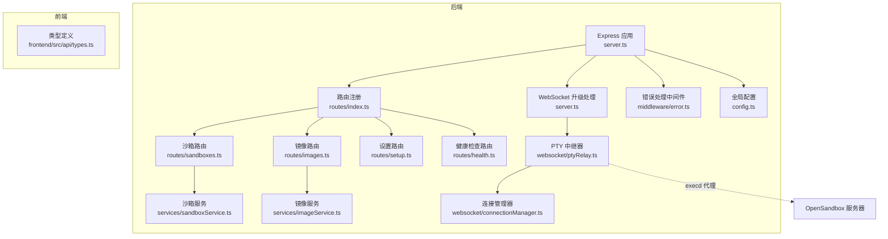
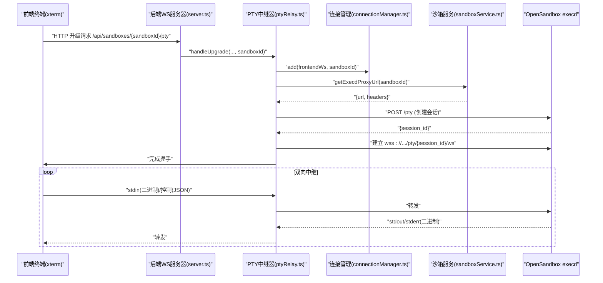
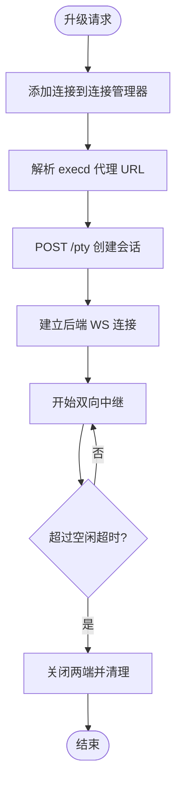
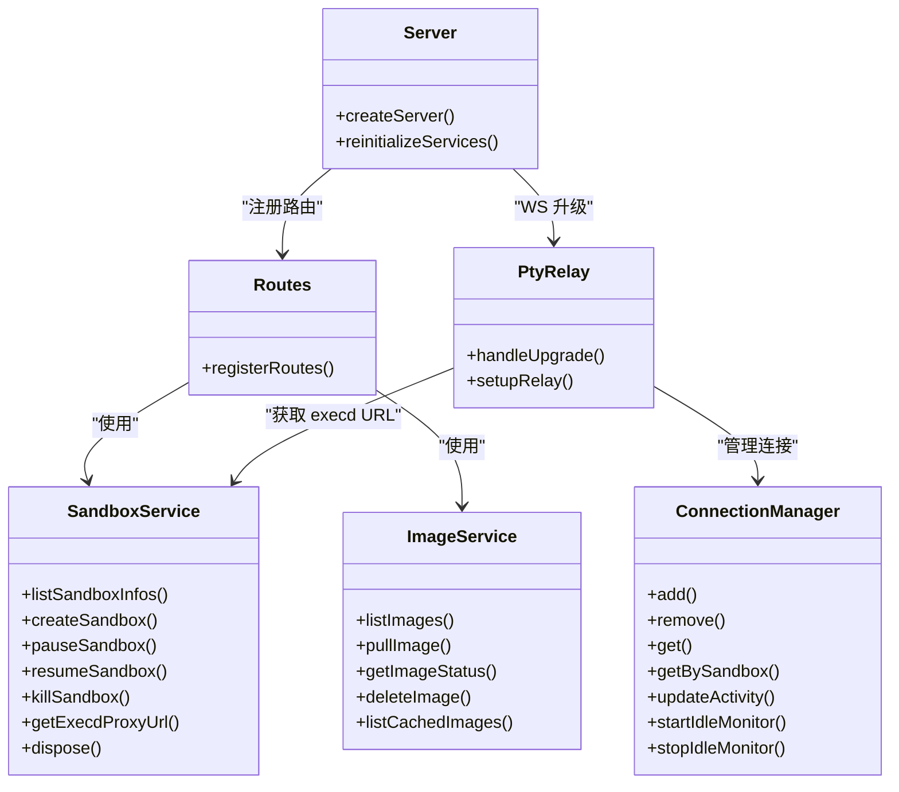

# API接口规范

<cite>
**本文引用的文件**
- [apps/backend/src/index.ts](file://apps/backend/src/index.ts)
- [apps/backend/src/server.ts](file://apps/backend/src/server.ts)
- [apps/backend/src/routes/index.ts](file://apps/backend/src/routes/index.ts)
- [apps/backend/src/routes/sandboxes.ts](file://apps/backend/src/routes/sandboxes.ts)
- [apps/backend/src/routes/images.ts](file://apps/backend/src/routes/images.ts)
- [apps/backend/src/routes/setup.ts](file://apps/backend/src/routes/setup.ts)
- [apps/backend/src/routes/health.ts](file://apps/backend/src/routes/health.ts)
- [apps/backend/src/services/sandboxService.ts](file://apps/backend/src/services/sandboxService.ts)
- [apps/backend/src/services/imageService.ts](file://apps/backend/src/services/imageService.ts)
- [apps/backend/src/websocket/connectionManager.ts](file://apps/backend/src/websocket/connectionManager.ts)
- [apps/backend/src/websocket/ptyRelay.ts](file://apps/backend/src/websocket/ptyRelay.ts)
- [apps/backend/src/websocket/types.ts](file://apps/backend/src/websocket/types.ts)
- [apps/backend/src/middleware/error.ts](file://apps/backend/src/middleware/error.ts)
- [apps/backend/src/config.ts](file://apps/backend/src/config.ts)
- [apps/backend/src/types/index.ts](file://apps/backend/src/types/index.ts)
- [apps/frontend/src/api/types.ts](file://apps/frontend/src/api/types.ts)
</cite>

## 目录
1. [简介](#简介)
2. [项目结构](#项目结构)
3. [核心组件](#核心组件)
4. [架构总览](#架构总览)
5. [详细组件分析](#详细组件分析)
6. [依赖关系分析](#依赖关系分析)
7. [性能与可扩展性](#性能与可扩展性)
8. [故障排查指南](#故障排查指南)
9. [结论](#结论)
10. [附录：API定义与示例](#附录api定义与示例)

## 简介
本文件为 Sandbox Manager 的完整 API 接口规范，覆盖以下内容：
- REST API 端点：HTTP 方法、URL 模式、请求参数、响应格式与错误码
- WebSocket API（PTY 终端）：连接流程、消息格式、事件类型与实时交互模式
- 认证与安全：鉴权方式、密钥传递、代理与协议配置
- 错误处理策略与日志追踪：统一响应体、错误分类与请求 ID
- 版本控制与兼容性：当前版本与未来演进建议
- 速率限制与性能优化：缓存、连接复用与超时设置
- 常见用例与客户端集成：典型工作流与最佳实践
- 调试与监控：SSE 流、日志级别与健康检查

## 项目结构
后端采用 Express + WebSocket 实现 REST 与 PTY 通道；服务层封装对 OpenSandbox SDK 的调用；路由层负责资源编排与参数校验；中间件统一错误处理与日志。

图表来源
- [apps/backend/src/server.ts:36-90](file://apps/backend/src/server.ts#L36-L90)
- [apps/backend/src/routes/index.ts:8-13](file://apps/backend/src/routes/index.ts#L8-L13)
- [apps/backend/src/websocket/ptyRelay.ts:22-38](file://apps/backend/src/websocket/ptyRelay.ts#L22-L38)
- [apps/backend/src/websocket/connectionManager.ts:7-16](file://apps/backend/src/websocket/connectionManager.ts#L7-L16)
- [apps/backend/src/services/sandboxService.ts:11-47](file://apps/backend/src/services/sandboxService.ts#L11-L47)

章节来源
- [apps/backend/src/server.ts:36-90](file://apps/backend/src/server.ts#L36-L90)
- [apps/backend/src/routes/index.ts:8-13](file://apps/backend/src/routes/index.ts#L8-L13)

## 核心组件
- 服务层
  - 沙箱服务：封装 OpenSandbox SDK 的连接、创建、暂停/恢复、删除与端点解析
  - 镜像服务：镜像拉取、状态查询与缓存列表
- WebSocket 层
  - 连接管理器：维护前端 WS 与后端 execd WS 的映射，空闲检测与清理
  - PTY 中继器：透明转发二进制帧与 JSON 控制帧，建立会话并双向中继
- 路由层
  - 沙箱：列表、创建、详情、删除、暂停、恢复、端点 URL 解析
  - 镜像：列出镜像、拉取镜像、查询状态、删除镜像、节点缓存列表
  - 设置：测试连接、远程配置保存、本地 K8s 流程（SSE）、完成本地配置
  - 健康：服务自检、配置状态、可达性
- 中间件与配置
  - 统一错误处理：根据异常类型映射 HTTP 状态码
  - 全局配置：端口、CORS、日志级别、OpenSandbox 参数、PTY 空闲超时

章节来源
- [apps/backend/src/services/sandboxService.ts:11-148](file://apps/backend/src/services/sandboxService.ts#L11-L148)
- [apps/backend/src/services/imageService.ts](file://apps/backend/src/services/imageService.ts)
- [apps/backend/src/websocket/connectionManager.ts:7-102](file://apps/backend/src/websocket/connectionManager.ts#L7-L102)
- [apps/backend/src/websocket/ptyRelay.ts:22-171](file://apps/backend/src/websocket/ptyRelay.ts#L22-L171)
- [apps/backend/src/routes/sandboxes.ts:9-175](file://apps/backend/src/routes/sandboxes.ts#L9-L175)
- [apps/backend/src/routes/images.ts:7-78](file://apps/backend/src/routes/images.ts#L7-L78)
- [apps/backend/src/routes/setup.ts:7-139](file://apps/backend/src/routes/setup.ts#L7-L139)
- [apps/backend/src/routes/health.ts:6-52](file://apps/backend/src/routes/health.ts#L6-L52)
- [apps/backend/src/middleware/error.ts:5-48](file://apps/backend/src/middleware/error.ts#L5-L48)
- [apps/backend/src/config.ts:48-71](file://apps/backend/src/config.ts#L48-L71)

## 架构总览
后端通过 HTTP 提供 REST API，通过 WebSocket 提供 PTY 终端能力。WebSocket 升级路径仅限沙箱 PTY，URL 为 /api/sandboxes/{sandboxId}/pty。PTy 中继器负责在前端终端与 OpenSandbox execd 之间透明转发数据帧，并处理控制帧（resize/exit）。

图表来源
- [apps/backend/src/server.ts:75-87](file://apps/backend/src/server.ts#L75-L87)
- [apps/backend/src/websocket/ptyRelay.ts:40-118](file://apps/backend/src/websocket/ptyRelay.ts#L40-L118)
- [apps/backend/src/websocket/connectionManager.ts:30-46](file://apps/backend/src/websocket/connectionManager.ts#L30-L46)
- [apps/backend/src/services/sandboxService.ts:129-138](file://apps/backend/src/services/sandboxService.ts#L129-L138)

## 详细组件分析

### REST API 定义与行为

- 健康检查
  - GET /api/health
  - 功能：返回服务状态、配置状态与可达性
  - 成功响应字段：status, configured, opensandboxReady, timestamp, uptime
  - 失败场景：OpenSandbox 不可达时返回 configured=true, opensandboxReady=false

- 设置
  - GET /api/setup/status
    - 返回配置状态与当前模式（local/remote）
  - POST /api/setup/test-connection
    - 请求体：{ serverUrl, apiKey, protocol }
    - 返回：connected, error?
  - POST /api/setup/remote
    - 请求体：{ serverUrl, apiKey, protocol }
    - 成功：更新配置并重新初始化服务
  - GET /api/setup/local-k8s/stream
    - SSE 流：progress/done/error 事件
    - 断开或失败时可停止本地端口转发
  - POST /api/setup/complete
    - 完成本地 K8s 配置并重新初始化服务

- 镜像管理
  - GET /api/images/cached
    - 返回各节点缓存的镜像列表
  - GET /api/images
    - 返回预拉取镜像列表
  - POST /api/images
    - 请求体：{ image }
    - 成功：202，异步拉取
  - GET /api/images/:name/status
    - 查询镜像拉取状态
  - DELETE /api/images/:name
    - 删除指定镜像

- 沙箱管理
  - GET /api/sandboxes
    - 查询参数：state(可多值), page, pageSize
    - 过滤：自动剔除已过期实例
    - 响应：items(扁平化), pagination
  - POST /api/sandboxes
    - 请求体：CreateSandboxBody
    - 成功：202，返回创建中的沙箱信息
  - GET /api/sandboxes/:sandboxId
    - 返回沙箱详情（扁平化）
  - DELETE /api/sandboxes/:sandboxId
    - 成功：204
  - POST /api/sandboxes/:sandboxId/pause
    - 暂停
  - POST /api/sandboxes/:sandboxId/resume
    - 恢复
  - GET /api/sandboxes/:sandboxId/endpoints/:port
    - 返回解析后的 url/scheme/host/port

- 文件与命令（子路由）
  - /api/sandboxes/:sandboxId/files 与 /api/sandboxes/:sandboxId/commands
  - 由沙箱路由挂载，具体实现依赖沙箱服务的连接实例

章节来源
- [apps/backend/src/routes/health.ts:6-52](file://apps/backend/src/routes/health.ts#L6-L52)
- [apps/backend/src/routes/setup.ts:17-139](file://apps/backend/src/routes/setup.ts#L17-L139)
- [apps/backend/src/routes/images.ts:14-78](file://apps/backend/src/routes/images.ts#L14-L78)
- [apps/backend/src/routes/sandboxes.ts:61-175](file://apps/backend/src/routes/sandboxes.ts#L61-L175)
- [apps/backend/src/types/index.ts:13-89](file://apps/backend/src/types/index.ts#L13-L89)

### WebSocket API（PTY 终端）

- 连接地址
  - /api/sandboxes/{sandboxId}/pty
  - 仅支持升级一次，失败则断开

- 握手与会话建立
  - 后端完成前端 WS 握手后，解析 execd 代理 URL 并创建会话
  - 使用 HTTP POST /pty 创建会话，获得 session_id
  - 建立到 wss://.../pty/{session_id}/ws 的后端 WS

- 数据帧格式
  - 二进制帧
    - 0x00 + UTF-8 字节：stdin（前端→execd）
    - 0x01 + 字节：stdout（execd→前端）
    - 0x02 + 字节：stderr（execd→前端）
  - 文本帧（JSON）
    - resize：{ type:"resize", cols, rows }
    - exit：{ type:"exit", code }

- 生命周期与清理
  - 连接管理器维护映射并记录最后活动时间
  - 空闲超时（默认 5 分钟）触发自动关闭
  - 任一侧关闭或出错均触发清理

图表来源
- [apps/backend/src/websocket/ptyRelay.ts:40-118](file://apps/backend/src/websocket/ptyRelay.ts#L40-L118)
- [apps/backend/src/websocket/connectionManager.ts:18-28](file://apps/backend/src/websocket/connectionManager.ts#L18-L28)
- [apps/backend/src/websocket/types.ts:4-20](file://apps/backend/src/websocket/types.ts#L4-L20)

章节来源
- [apps/backend/src/server.ts:75-87](file://apps/backend/src/server.ts#L75-L87)
- [apps/backend/src/websocket/ptyRelay.ts:22-171](file://apps/backend/src/websocket/ptyRelay.ts#L22-L171)
- [apps/backend/src/websocket/connectionManager.ts:7-102](file://apps/backend/src/websocket/connectionManager.ts#L7-L102)
- [apps/backend/src/websocket/types.ts:1-20](file://apps/backend/src/websocket/types.ts#L1-L20)

### 认证与安全

- 认证方式
  - OpenSandbox API 密钥：通过环境变量 OPENSANDBOX_API_KEY 注入
  - 密钥随请求头传递至 OpenSandbox 服务器
  - 支持使用服务器代理（useServerProxy），减少客户端网络复杂度

- 安全考虑
  - CORS：由配置项 corsOrigin 控制
  - 日志级别：通过 LOG_LEVEL 调整
  - 协议：OPENSANDBOX_PROTOCOL 支持 http/https
  - 端口转发：本地 K8s 模式下自动进行端口转发，注意仅限 localhost/127.0.0.1

章节来源
- [apps/backend/src/config.ts:48-71](file://apps/backend/src/config.ts#L48-L71)
- [apps/backend/src/services/sandboxService.ts:23-29](file://apps/backend/src/services/sandboxService.ts#L23-L29)
- [apps/backend/src/index.ts:13-46](file://apps/backend/src/index.ts#L13-L46)

### 错误处理与日志

- 统一响应体
  - 成功：{ success: true, data }
  - 失败：{ success: false, error: { code, message, requestId? } }

- 异常映射
  - SDK 异常 → HTTP 状态码映射（如 502/504）
  - 参数解析失败 → 400
  - 其他 → 500

- 请求追踪
  - 自动注入请求 ID（x-request-id），便于日志关联

章节来源
- [apps/backend/src/middleware/error.ts:5-48](file://apps/backend/src/middleware/error.ts#L5-L48)
- [apps/backend/src/types/index.ts:3-11](file://apps/backend/src/types/index.ts#L3-L11)

## 依赖关系分析

图表来源
- [apps/backend/src/server.ts:36-90](file://apps/backend/src/server.ts#L36-L90)
- [apps/backend/src/routes/index.ts:8-13](file://apps/backend/src/routes/index.ts#L8-L13)
- [apps/backend/src/services/sandboxService.ts:11-148](file://apps/backend/src/services/sandboxService.ts#L11-L148)
- [apps/backend/src/services/imageService.ts](file://apps/backend/src/services/imageService.ts)
- [apps/backend/src/websocket/connectionManager.ts:7-102](file://apps/backend/src/websocket/connectionManager.ts#L7-L102)
- [apps/backend/src/websocket/ptyRelay.ts:22-171](file://apps/backend/src/websocket/ptyRelay.ts#L22-L171)

章节来源
- [apps/backend/src/server.ts:36-90](file://apps/backend/src/server.ts#L36-L90)
- [apps/backend/src/routes/index.ts:8-13](file://apps/backend/src/routes/index.ts#L8-L13)

## 性能与可扩展性

- 缓存与连接复用
  - 沙箱服务使用 LRU 缓存连接实例，默认容量 50，TTL 10 分钟
  - 减少重复连接与握手开销

- 超时与空闲
  - OpenSandbox 请求超时可通过环境变量配置
  - PTY 连接空闲超时默认 5 分钟，避免资源泄露

- 传输优化
  - PTY 中继器透明转发二进制帧，降低 CPU 开销
  - 建议前端使用高效终端库（如 xterm.js）并启用合适的缓冲策略

- 扩展建议
  - 在网关层增加速率限制与配额控制
  - 对高频查询（如列表/状态）增加本地缓存与分页索引
  - 将镜像拉取与沙箱创建异步化，结合 SSE 或长轮询反馈进度

[本节为通用性能指导，无需特定文件来源]

## 故障排查指南

- 健康检查
  - 若 configured=true 但 opensandboxReady=false，表示配置正确但 OpenSandbox 不可达
  - 建议检查网络连通性、代理设置与 API 密钥

- PTY 连接失败
  - 检查 /api/sandboxes/{sandboxId}/pty 是否返回握手超时或会话创建失败
  - 查看后端日志中的连接 ID 与错误堆栈

- SSE 流中断
  - 本地 K8s 流程中若断开，后端会停止端口转发
  - 重新发起 /api/setup/local-k8s/stream 获取最新进度

- 错误响应定位
  - 关注 error.code 与 requestId，结合后端日志定位问题

章节来源
- [apps/backend/src/routes/health.ts:6-52](file://apps/backend/src/routes/health.ts#L6-L52)
- [apps/backend/src/routes/setup.ts:69-120](file://apps/backend/src/routes/setup.ts#L69-L120)
- [apps/backend/src/middleware/error.ts:18-31](file://apps/backend/src/middleware/error.ts#L18-L31)

## 结论
Sandbox Manager 提供了清晰的 REST API 与高效的 PTY WebSocket 通道，配合完善的错误处理与可观测性，适合在生产环境中稳定运行。建议在网关层引入速率限制与审计日志，并持续优化缓存与超时策略以提升用户体验。

[本节为总结性内容，无需特定文件来源]

## 附录：API定义与示例

### 统一响应体
- 成功：{ success: true, data }
- 失败：{ success: false, error: { code, message, requestId? } }

章节来源
- [apps/backend/src/types/index.ts:3-11](file://apps/backend/src/types/index.ts#L3-L11)

### REST API 示例

- 健康检查
  - GET /api/health
  - 成功响应示例字段：status, configured, opensandboxReady, timestamp, uptime

- 设置
  - GET /api/setup/status
  - POST /api/setup/test-connection
    - 请求体：{ serverUrl, apiKey, protocol }
  - POST /api/setup/remote
    - 请求体：{ serverUrl, apiKey, protocol }
  - GET /api/setup/local-k8s/stream
    - 事件：progress, done, error
  - POST /api/setup/complete

- 镜像
  - GET /api/images/cached
  - GET /api/images
  - POST /api/images
    - 请求体：{ image }
  - GET /api/images/:name/status
  - DELETE /api/images/:name

- 沙箱
  - GET /api/sandboxes?state=Running&pageSize=20
  - POST /api/sandboxes
    - 请求体：CreateSandboxBody
  - GET /api/sandboxes/:sandboxId
  - DELETE /api/sandboxes/:sandboxId
  - POST /api/sandboxes/:sandboxId/pause
  - POST /api/sandboxes/:sandboxId/resume
  - GET /api/sandboxes/:sandboxId/endpoints/:port

章节来源
- [apps/backend/src/routes/health.ts:6-52](file://apps/backend/src/routes/health.ts#L6-L52)
- [apps/backend/src/routes/setup.ts:17-139](file://apps/backend/src/routes/setup.ts#L17-L139)
- [apps/backend/src/routes/images.ts:14-78](file://apps/backend/src/routes/images.ts#L14-L78)
- [apps/backend/src/routes/sandboxes.ts:61-175](file://apps/backend/src/routes/sandboxes.ts#L61-L175)
- [apps/backend/src/types/index.ts:13-89](file://apps/backend/src/types/index.ts#L13-L89)

### WebSocket（PTY）消息格式

- 控制帧（文本 JSON）
  - resize：{ type:"resize", cols, rows }
  - exit：{ type:"exit", code }

- 数据帧（二进制）
  - stdin：0x00 + UTF-8 字节
  - stdout：0x01 + 字节
  - stderr：0x02 + 字节

章节来源
- [apps/backend/src/websocket/ptyRelay.ts:10-21](file://apps/backend/src/websocket/ptyRelay.ts#L10-L21)
- [apps/backend/src/websocket/types.ts:4-9](file://apps/backend/src/websocket/types.ts#L4-L9)

### 客户端集成最佳实践

- 请求追踪
  - 始终携带 x-request-id，便于后端日志关联
- 超时与重试
  - 对 OpenSandbox 请求设置合理超时与指数退避
- 终端优化
  - 前端使用 xterm.js 并在 resize 时发送控制帧
  - 合理设置缓冲大小与渲染频率
- 安全
  - 通过 HTTPS 与受控 CORS 源访问
  - 避免在客户端暴露 API 密钥

[本节为通用实践建议，无需特定文件来源]