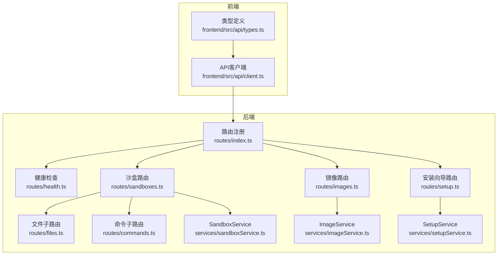
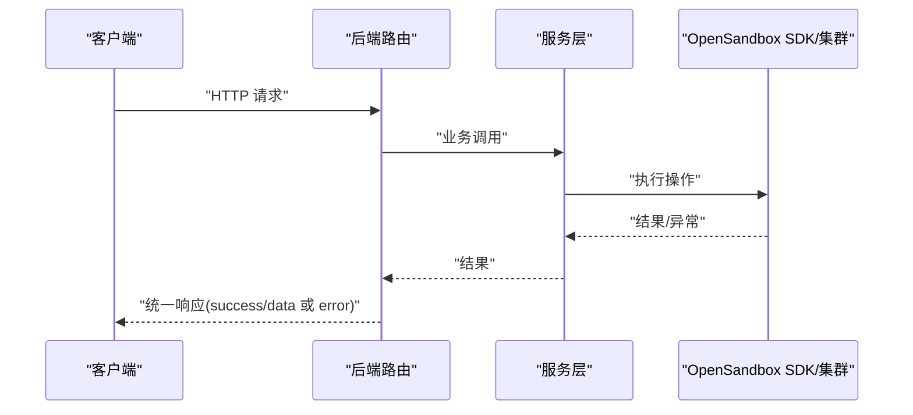
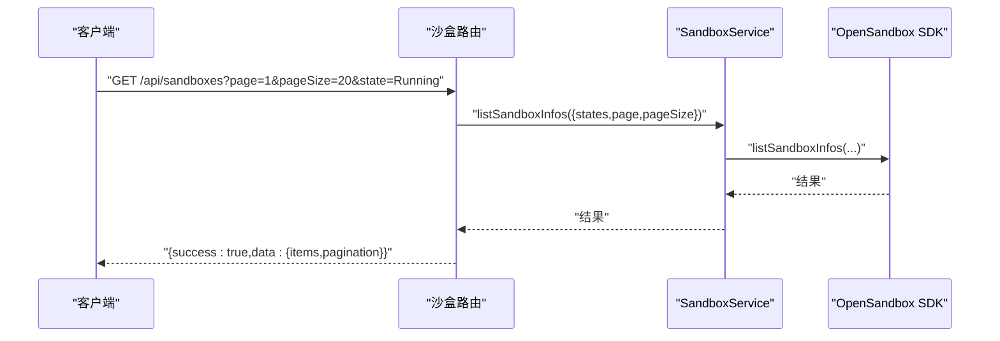
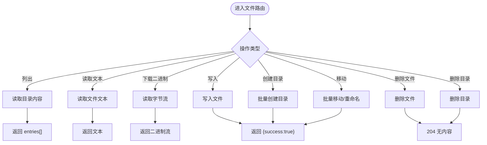
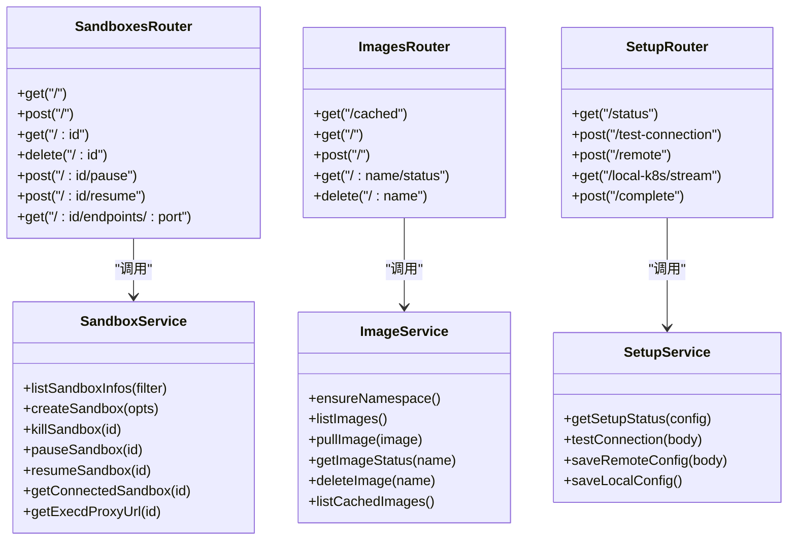

# REST API规范

<cite>
**本文引用的文件**
- [apps/backend/src/routes/index.ts](file://apps/backend/src/routes/index.ts)
- [apps/backend/src/routes/sandboxes.ts](file://apps/backend/src/routes/sandboxes.ts)
- [apps/backend/src/routes/files.ts](file://apps/backend/src/routes/files.ts)
- [apps/backend/src/routes/commands.ts](file://apps/backend/src/routes/commands.ts)
- [apps/backend/src/routes/images.ts](file://apps/backend/src/routes/images.ts)
- [apps/backend/src/routes/setup.ts](file://apps/backend/src/routes/setup.ts)
- [apps/backend/src/routes/health.ts](file://apps/backend/src/routes/health.ts)
- [apps/backend/src/types/index.ts](file://apps/backend/src/types/index.ts)
- [apps/backend/src/middleware/error.ts](file://apps/backend/src/middleware/error.ts)
- [apps/backend/src/services/sandboxService.ts](file://apps/backend/src/services/sandboxService.ts)
- [apps/backend/src/services/imageService.ts](file://apps/backend/src/services/imageService.ts)
- [apps/backend/src/services/setupService.ts](file://apps/backend/src/services/setupService.ts)
- [apps/backend/src/config.ts](file://apps/backend/src/config.ts)
- [apps/frontend/src/api/client.ts](file://apps/frontend/src/api/client.ts)
- [apps/frontend/src/api/types.ts](file://apps/frontend/src/api/types.ts)
- [apps/backend/src/websocket/types.ts](file://apps/backend/src/websocket/types.ts)
- [apps/backend/src/websocket/connectionManager.ts](file://apps/backend/src/websocket/connectionManager.ts)
</cite>

## 目录
1. [简介](#简介)
2. [项目结构](#项目结构)
3. [核心组件](#核心组件)
4. [架构总览](#架构总览)
5. [详细组件与API规范](#详细组件与api规范)
6. [依赖关系分析](#依赖关系分析)
7. [性能考量](#性能考量)
8. [故障排查指南](#故障排查指南)
9. [结论](#结论)
10. [附录](#附录)

## 简介
本文件为 Sandbox Manager 的完整 REST API 规范，覆盖沙盒管理、文件操作、命令执行、镜像管理、系统健康检查与安装向导等接口。文档详细说明了每个端点的请求方法、URL 模式、请求参数、响应格式、HTTP 状态码、错误响应格式与认证要求，并提供 curl 与 JavaScript fetch 示例。同时说明查询参数、分页机制、过滤选项、API 版本控制策略与向后兼容性。

## 项目结构
后端采用 Express 路由模块化组织，按功能域划分路由：健康检查、沙盒、镜像、安装向导、文件与命令子路由。各路由通过统一的错误中间件处理异常，返回一致的响应结构；前端通过统一的 API 客户端封装请求与错误处理。

图表来源
- [apps/backend/src/routes/index.ts:1-18](file://apps/backend/src/routes/index.ts#L1-L18)
- [apps/backend/src/routes/health.ts:1-52](file://apps/backend/src/routes/health.ts#L1-L52)
- [apps/backend/src/routes/sandboxes.ts:1-175](file://apps/backend/src/routes/sandboxes.ts#L1-L175)
- [apps/backend/src/routes/files.ts:1-327](file://apps/backend/src/routes/files.ts#L1-L327)
- [apps/backend/src/routes/commands.ts:1-95](file://apps/backend/src/routes/commands.ts#L1-L95)
- [apps/backend/src/routes/images.ts:1-78](file://apps/backend/src/routes/images.ts#L1-L78)
- [apps/backend/src/routes/setup.ts:1-139](file://apps/backend/src/routes/setup.ts#L1-L139)
- [apps/backend/src/services/sandboxService.ts:1-148](file://apps/backend/src/services/sandboxService.ts#L1-L148)
- [apps/backend/src/services/imageService.ts:1-386](file://apps/backend/src/services/imageService.ts#L1-L386)
- [apps/backend/src/services/setupService.ts:1-147](file://apps/backend/src/services/setupService.ts#L1-L147)
- [apps/frontend/src/api/client.ts:1-45](file://apps/frontend/src/api/client.ts#L1-L45)
- [apps/frontend/src/api/types.ts:1-146](file://apps/frontend/src/api/types.ts#L1-L146)

章节来源
- [apps/backend/src/routes/index.ts:1-18](file://apps/backend/src/routes/index.ts#L1-L18)

## 核心组件
- 统一响应结构
  - 成功响应：包含 success=true 与 data 字段
  - 错误响应：包含 success=false 与 error 对象，含 code、message、可选 requestId
- 错误处理中间件
  - 将 SDK 异常映射为 HTTP 状态码，记录日志并返回统一错误结构
- 配置驱动
  - 通过环境变量加载配置，支持 OpenSandbox 连接参数、CORS、日志级别、PTY 空闲超时等

章节来源
- [apps/backend/src/types/index.ts:3-11](file://apps/backend/src/types/index.ts#L3-L11)
- [apps/backend/src/middleware/error.ts:4-48](file://apps/backend/src/middleware/error.ts#L4-L48)
- [apps/backend/src/config.ts:48-71](file://apps/backend/src/config.ts#L48-L71)

## 架构总览
后端路由层负责解析请求、校验参数、调用服务层；服务层对接 OpenSandbox SDK 或本地命令工具；前端通过统一客户端发起请求并处理响应。

图表来源
- [apps/backend/src/routes/sandboxes.ts:96-105](file://apps/backend/src/routes/sandboxes.ts#L96-L105)
- [apps/backend/src/services/sandboxService.ts:74-88](file://apps/backend/src/services/sandboxService.ts#L74-L88)
- [apps/backend/src/routes/images.ts:37-53](file://apps/backend/src/routes/images.ts#L37-L53)
- [apps/backend/src/services/imageService.ts:227-294](file://apps/backend/src/services/imageService.ts#L227-L294)

## 详细组件与API规范

### 健康检查 API
- 路径与方法
  - GET /api/health
- 功能
  - 返回服务状态、是否已配置、OpenSandbox 可达性、时间戳与运行时长
- 响应
  - data.status: "ok"
  - data.configured: 是否完成初始化
  - data.opensandboxReady: OpenSandbox 连通性
  - data.timestamp: ISO 时间
  - data.uptime: 进程运行秒数
- 状态码
  - 200 成功
- 认证
  - 无需认证
- 示例
  - curl: curl -s http://localhost:3000/api/health
  - fetch: fetch("/api/health").then(r=>r.json())

章节来源
- [apps/backend/src/routes/health.ts:6-51](file://apps/backend/src/routes/health.ts#L6-L51)

### 安装向导 API
- 路径与方法
  - GET /api/setup/status
  - POST /api/setup/test-connection
  - POST /api/setup/remote
  - GET /api/setup/local-k8s/stream (SSE)
  - POST /api/setup/complete
- 功能
  - 查询当前配置状态
  - 测试远程 OpenSandbox 连接
  - 保存远程配置并重载服务
  - 本地 K8s 安装进度流式推送
  - 完成本地安装并重载服务
- 请求体字段
  - test-connection: serverUrl, apiKey, protocol
  - remote: serverUrl, apiKey, protocol
- 响应
  - status: { configured, k8sMode?, osbServerUrl? }
  - test-connection: { connected, error? }
  - remote/complete: { configured: true }
- 状态码
  - 200 成功；400 缺少必要字段；409 并发安装；500 内部错误
- 认证
  - 无需认证
- 示例
  - curl: curl -s -X POST -H "Content-Type: application/json" -d '{"serverUrl":"...","apiKey":"..."}' http://localhost:3000/api/setup/remote
  - fetch: fetch("/api/setup/status").then(r=>r.json())

章节来源
- [apps/backend/src/routes/setup.ts:17-23](file://apps/backend/src/routes/setup.ts#L17-L23)
- [apps/backend/src/routes/setup.ts:25-43](file://apps/backend/src/routes/setup.ts#L25-L43)
- [apps/backend/src/routes/setup.ts:45-67](file://apps/backend/src/routes/setup.ts#L45-L67)
- [apps/backend/src/routes/setup.ts:69-120](file://apps/backend/src/routes/setup.ts#L69-L120)
- [apps/backend/src/routes/setup.ts:122-138](file://apps/backend/src/routes/setup.ts#L122-L138)

### 沙盒管理 API
- 路径与方法
  - GET /api/sandboxes
  - POST /api/sandboxes
  - GET /api/sandboxes/:sandboxId
  - DELETE /api/sandboxes/:sandboxId
  - POST /api/sandboxes/:sandboxId/pause
  - POST /api/sandboxes/:sandboxId/resume
  - GET /api/sandboxes/:sandboxId/endpoints/:port
- 查询参数
  - GET /api/sandboxes
    - state: 状态过滤（可多值）
    - page/pageSize: 分页
- 请求体字段
  - POST /api/sandboxes: image, name?, timeoutSeconds?, env?, metadata?, resource?, networkPolicy?
  - POST /api/sandboxes/:sandboxId/pause, resume: 无
  - GET /api/sandboxes/:sandboxId/endpoints/:port: 无
- 响应数据
  - 列表: items[] 包含 id、name、image、status、statusDetail、createdAt、expiresAt、entrypoint、metadata、env；pagination
  - 单个: 同上对象
  - endpoints: { url, scheme, host, port }
- 状态码
  - 200 成功；202 创建已接受；204 删除成功；400 参数缺失；503 未配置 OpenSandbox；其他错误见错误处理
- 认证
  - 无需认证
- 示例
  - curl: curl -s -X POST -H "Content-Type: application/json" -d '{"image":"alpine:latest"}' http://localhost:3000/api/sandboxes
  - fetch: fetch("/api/sandboxes", {method:"POST",body:JSON.stringify({image:"alpine:latest"})}).then(r=>r.json())
- 过滤与分页
  - 支持按状态过滤与分页；过期沙盒在列表中会被过滤

图表来源
- [apps/backend/src/routes/sandboxes.ts:62-93](file://apps/backend/src/routes/sandboxes.ts#L62-L93)
- [apps/backend/src/services/sandboxService.ts:49-56](file://apps/backend/src/services/sandboxService.ts#L49-L56)

章节来源
- [apps/backend/src/routes/sandboxes.ts:61-175](file://apps/backend/src/routes/sandboxes.ts#L61-L175)
- [apps/backend/src/types/index.ts:13-24](file://apps/backend/src/types/index.ts#L13-L24)
- [apps/backend/src/services/sandboxService.ts:74-88](file://apps/backend/src/services/sandboxService.ts#L74-L88)

### 文件操作 API
- 路径与方法
  - GET /api/sandboxes/:sandboxId/files
  - GET /api/sandboxes/:sandboxId/files/content?path=...
  - GET /api/sandboxes/:sandboxId/files/download?path=...
  - POST /api/sandboxes/:sandboxId/files/write
  - POST /api/sandboxes/:sandboxId/files/mkdir
  - POST /api/sandboxes/:sandboxId/files/move
  - DELETE /api/sandboxes/:sandboxId/files/files?path=...
  - DELETE /api/sandboxes/:sandboxId/files/directories?path=...
- 查询参数
  - GET /files: path=目录路径（默认根）
  - GET /content, /download: path=文件路径
  - DELETE /files, /directories: path=字符串或数组
- 请求体字段
  - write: { path, content, mode? }
  - mkdir: { paths[], mode? }
  - move: { entries[{ src, dest }] }
- 响应
  - 列表: entries[] { name, path, isDir, size, modTime? }
  - 下载: application/octet-stream
  - 其他: { success: true }
- 状态码
  - 200 成功；204 无内容；400 缺少参数/路径为目录；其他错误见错误处理
- 认证
  - 无需认证
- 示例
  - curl: curl -s "http://localhost:3000/api/sandboxes/{sandboxId}/files?path=/tmp"
  - fetch: fetch("/api/sandboxes/{sandboxId}/files/content?path=/etc/passwd").then(r=>r.text())

图表来源
- [apps/backend/src/routes/files.ts:19-327](file://apps/backend/src/routes/files.ts#L19-L327)

章节来源
- [apps/backend/src/routes/files.ts:19-327](file://apps/backend/src/routes/files.ts#L19-L327)
- [apps/backend/src/types/index.ts:33-46](file://apps/backend/src/types/index.ts#L33-L46)

### 命令执行 API
- 路径与方法
  - POST /api/sandboxes/:sandboxId/commands
  - POST /api/sandboxes/:sandboxId/commands/session
  - POST /api/sandboxes/:sandboxId/commands/session/:sessionId/run
  - DELETE /api/sandboxes/:sandboxId/commands/session/:sessionId
- 请求体字段
  - 执行命令: { command, cwd?, timeoutSeconds?, envs? }
  - 创建会话: { workingDirectory? }
  - 会话内执行: { command, cwd?, timeoutSeconds? }
- 响应
  - 执行结果: { exitCode, stdout, stderr, executionTimeMs }
  - 会话: { sessionId }
- 状态码
  - 200 成功；400 缺少 command；其他错误见错误处理
- 认证
  - 无需认证
- 示例
  - curl: curl -s -X POST -H "Content-Type: application/json" -d '{"command":"ls -l"}' http://localhost:3000/api/sandboxes/{sandboxId}/commands
  - fetch: fetch("/api/sandboxes/{sandboxId}/commands/session", {method:"POST",body:JSON.stringify({workingDirectory:"/home"})}).then(r=>r.json())

章节来源
- [apps/backend/src/routes/commands.ts:12-95](file://apps/backend/src/routes/commands.ts#L12-L95)
- [apps/backend/src/types/index.ts:26-58](file://apps/backend/src/types/index.ts#L26-L58)

### 镜像管理 API
- 路径与方法
  - GET /api/images/cached
  - GET /api/images
  - POST /api/images
  - GET /api/images/:name/status
  - DELETE /api/images/:name
- 请求体字段
  - POST /images: { image }
- 响应数据
  - 列表: ImageInfo[] { name, image, status, daemonSetName, createdAt, nodesReady, nodesTotal, message? }
  - cached: CachedImage[] { image, node, sizeBytes? }
  - pull: 同 ImageInfo
- 状态码
  - 200 成功；202 异步拉取已接受；204 删除成功；400 参数无效；其他错误见错误处理
- 认证
  - 无需认证
- 示例
  - curl: curl -s -X POST -H "Content-Type: application/json" -d '{"image":"nginx:alpine"}' http://localhost:3000/api/images
  - fetch: fetch("/api/images/cached").then(r=>r.json())

章节来源
- [apps/backend/src/routes/images.ts:14-78](file://apps/backend/src/routes/images.ts#L14-L78)
- [apps/backend/src/types/index.ts:69-88](file://apps/backend/src/types/index.ts#L69-L88)
- [apps/backend/src/services/imageService.ts:196-222](file://apps/backend/src/services/imageService.ts#L196-L222)
- [apps/backend/src/services/imageService.ts:227-294](file://apps/backend/src/services/imageService.ts#L227-L294)
- [apps/backend/src/services/imageService.ts:299-317](file://apps/backend/src/services/imageService.ts#L299-L317)
- [apps/backend/src/services/imageService.ts:344-384](file://apps/backend/src/services/imageService.ts#L344-L384)

### 系统设置与配置
- 环境变量配置
  - OPENSANDBOX_SERVER_URL, OPENSANDBOX_API_KEY, OPENSANDBOX_PROTOCOL, OPENSANDBOX_USE_SERVER_PROXY, OPENSANDBOX_REQUEST_TIMEOUT_SECONDS
  - PORT, NODE_ENV, CORS_ORIGIN, LOG_LEVEL, PTY_IDLE_TIMEOUT_MS
- 行为说明
  - 未配置 OpenSandbox 时，沙盒相关路由返回 503
  - 健康检查根据连接可达性返回不同状态
- 示例
  - curl: 设置环境变量后重启服务生效

章节来源
- [apps/backend/src/config.ts:48-71](file://apps/backend/src/config.ts#L48-L71)
- [apps/backend/src/routes/sandboxes.ts:34-45](file://apps/backend/src/routes/sandboxes.ts#L34-L45)
- [apps/backend/src/routes/health.ts:9-22](file://apps/backend/src/routes/health.ts#L9-L22)

## 依赖关系分析
- 路由到服务
  - 沙盒路由依赖 SandboxService；镜像路由依赖 ImageService；安装向导路由依赖 SetupService
- 服务到外部
  - SandboxService 依赖 OpenSandbox SDK；ImageService 依赖 kubectl 命令与 Kubernetes DaemonSet
- 错误处理
  - 统一错误中间件将 SDK 异常映射为 HTTP 状态码并记录日志

图表来源
- [apps/backend/src/routes/sandboxes.ts:96-175](file://apps/backend/src/routes/sandboxes.ts#L96-L175)
- [apps/backend/src/routes/images.ts:14-78](file://apps/backend/src/routes/images.ts#L14-L78)
- [apps/backend/src/routes/setup.ts:17-138](file://apps/backend/src/routes/setup.ts#L17-L138)
- [apps/backend/src/services/sandboxService.ts:49-147](file://apps/backend/src/services/sandboxService.ts#L49-L147)
- [apps/backend/src/services/imageService.ts:95-385](file://apps/backend/src/services/imageService.ts#L95-L385)
- [apps/backend/src/services/setupService.ts:58-146](file://apps/backend/src/services/setupService.ts#L58-L146)

## 性能考量
- 沙盒连接缓存
  - SandboxService 使用 LRU 缓存连接实例，默认容量 50，10 分钟 TTL，避免频繁连接开销
- 列表与搜索回退
  - 文件列表优先使用 SDK 搜索，失败则回退到 ls + stat 方案，限制输出条目上限
- PTY 空闲清理
  - 连接管理器定期扫描空闲连接并关闭，空闲阈值由配置项控制
- 超时与代理
  - OpenSandbox 请求超时可配置，支持服务器代理模式以提升网络稳定性

章节来源
- [apps/backend/src/services/sandboxService.ts:17-47](file://apps/backend/src/services/sandboxService.ts#L17-L47)
- [apps/backend/src/routes/files.ts:209-327](file://apps/backend/src/routes/files.ts#L209-L327)
- [apps/backend/src/websocket/connectionManager.ts:18-101](file://apps/backend/src/websocket/connectionManager.ts#L18-L101)
- [apps/backend/src/config.ts:61-62](file://apps/backend/src/config.ts#L61-L62)

## 故障排查指南
- 常见错误码
  - 400 参数错误（如缺少 path、command、image 等）
  - 409 安装向导并发冲突
  - 500 服务器内部错误
  - 503 OpenSandbox 未配置
  - 504 连接超时
- 错误响应
  - error.code: HTTP_状态码 或 SDK 异常类型
  - error.message: 错误描述
  - error.requestId: 请求 ID（若存在）
- 排查步骤
  - 使用 /api/health 检查配置与连通性
  - 使用 /api/setup/status 与 /api/setup/test-connection 验证 OpenSandbox 配置
  - 查看后端日志中的请求 ID 与堆栈信息
  - 对于文件/命令操作，确认路径与权限

章节来源
- [apps/backend/src/middleware/error.ts:33-47](file://apps/backend/src/middleware/error.ts#L33-L47)
- [apps/backend/src/routes/health.ts:24-50](file://apps/backend/src/routes/health.ts#L24-L50)
- [apps/backend/src/routes/setup.ts:25-43](file://apps/backend/src/routes/setup.ts#L25-L43)

## 结论
本文档提供了 Sandbox Manager 的完整 REST API 规范，涵盖沙盒生命周期、文件与命令操作、镜像管理、健康检查与安装向导。通过统一的响应结构、错误处理与配置驱动，确保前后端交互的一致性与可维护性。建议在生产环境中启用 HTTPS、严格校验输入参数，并结合健康检查与日志监控进行运维保障。

## 附录

### 统一响应与错误格式
- 成功响应
  - { success: true, data: ... }
- 错误响应
  - { success: false, error: { code, message, requestId? } }

章节来源
- [apps/backend/src/types/index.ts:3-11](file://apps/backend/src/types/index.ts#L3-L11)
- [apps/backend/src/middleware/error.ts:23-30](file://apps/backend/src/middleware/error.ts#L23-L30)

### 前端调用约定
- 基础路径: /api
- Content-Type: application/json（当有请求体时）
- 处理 204 无内容情况
- 失败时抛出 ApiError，包含 code、message、statusCode

章节来源
- [apps/frontend/src/api/client.ts:16-44](file://apps/frontend/src/api/client.ts#L16-L44)
- [apps/frontend/src/api/types.ts:49-61](file://apps/frontend/src/api/types.ts#L49-L61)

### WebSocket 与 PTY
- PTY 控制消息类型
  - resize: cols, rows
  - exit: code
- 连接管理
  - 维护前端 WS 与后端 WS 的映射
  - 空闲超时自动清理
- 用途
  - 通过 SandboxService 获取 execd 代理地址，用于建立 PTY 通道

章节来源
- [apps/backend/src/websocket/types.ts:4-19](file://apps/backend/src/websocket/types.ts#L4-L19)
- [apps/backend/src/websocket/connectionManager.ts:30-101](file://apps/backend/src/websocket/connectionManager.ts#L30-L101)
- [apps/backend/src/services/sandboxService.ts:129-138](file://apps/backend/src/services/sandboxService.ts#L129-L138)