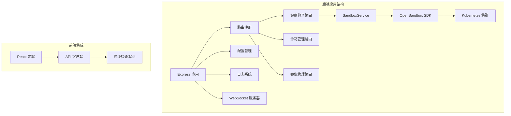
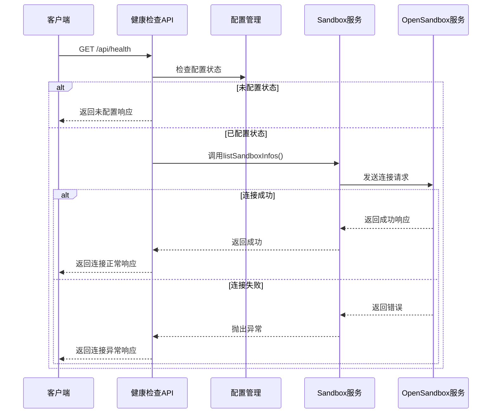
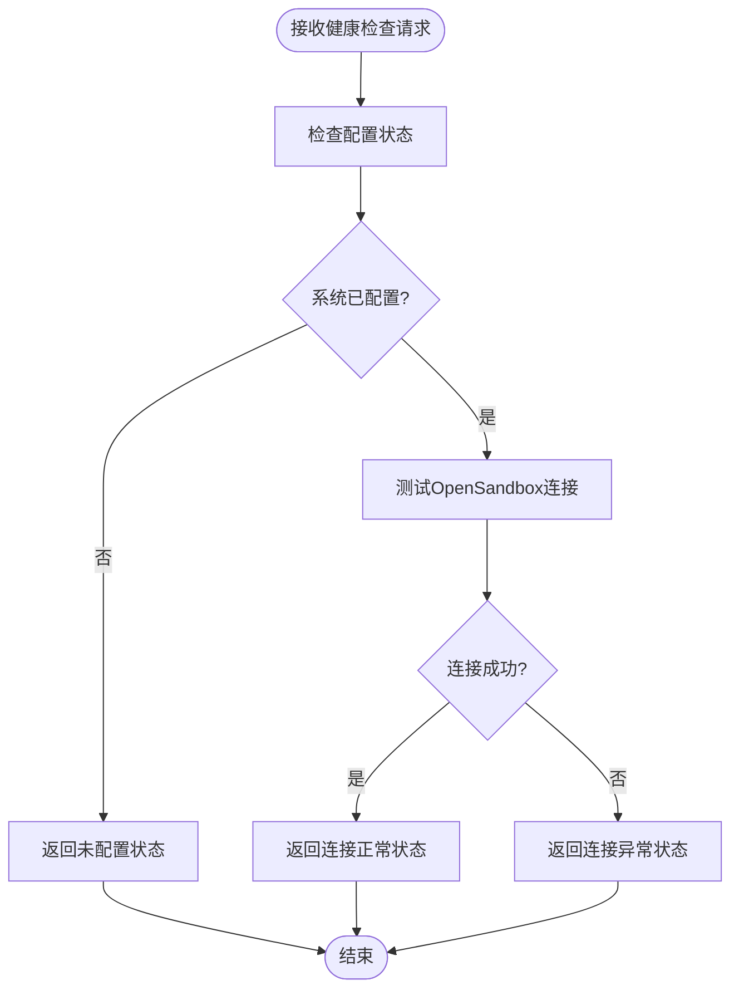
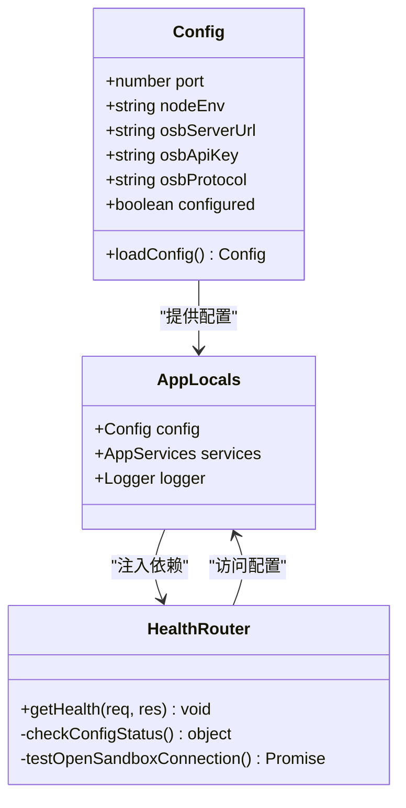
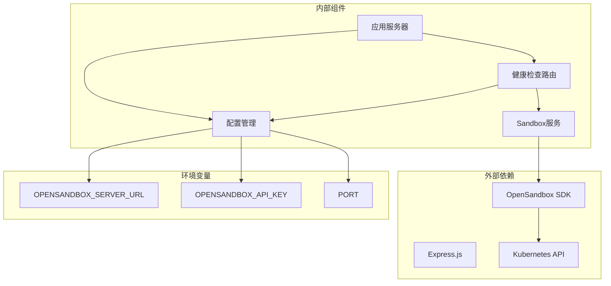
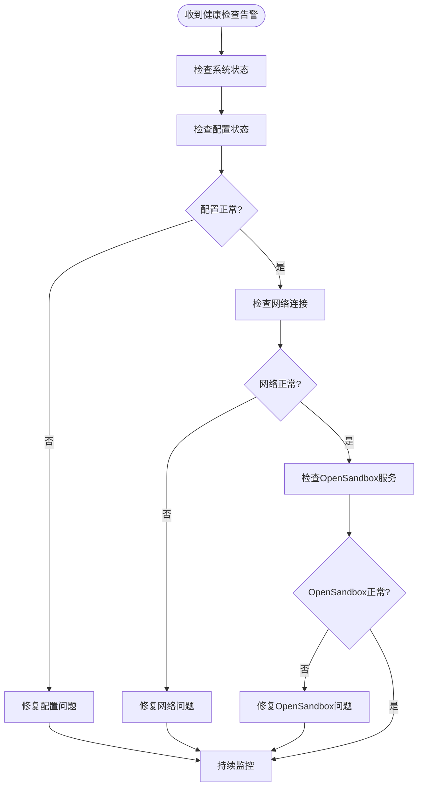

# 健康检查API

<cite>
**本文档引用的文件**
- [apps/backend/src/routes/health.ts](file://apps/backend/src/routes/health.ts)
- [apps/backend/src/server.ts](file://apps/backend/src/server.ts)
- [apps/backend/src/config.ts](file://apps/backend/src/config.ts)
- [apps/backend/src/services/sandboxService.ts](file://apps/backend/src/services/sandboxService.ts)
- [apps/backend/src/routes/index.ts](file://apps/backend/src/routes/index.ts)
- [apps/backend/src/index.ts](file://apps/backend/src/index.ts)
- [README.md](file://README.md)
</cite>

## 目录
1. [简介](#简介)
2. [项目结构](#项目结构)
3. [核心组件](#核心组件)
4. [架构概览](#架构概览)
5. [详细组件分析](#详细组件分析)
6. [依赖关系分析](#依赖关系分析)
7. [性能考虑](#性能考虑)
8. [故障排除指南](#故障排除指南)
9. [结论](#结论)
10. [附录](#附录)

## 简介

健康检查API是Sandbox Manager系统中用于监控和验证系统健康状态的关键组件。该API提供了一个简单的端点来检查后端服务的整体可用性和连接状态，特别是与OpenSandbox基础设施的连接状态。

Sandbox Manager是一个基于OpenSandbox的Kubernetes AI沙箱管理平台，通过Web界面创建、管理和隔离沙箱环境。健康检查API确保系统在生产环境中能够可靠地运行，并为负载均衡器和容器编排系统提供必要的健康状态信息。

## 项目结构

Sandbox Manager采用模块化架构设计，健康检查功能位于后端应用程序的核心路由系统中：



**图表来源**
- [apps/backend/src/routes/index.ts:1-18](file://apps/backend/src/routes/index.ts#L1-L18)
- [apps/backend/src/server.ts:36-90](file://apps/backend/src/server.ts#L36-L90)

**章节来源**
- [apps/backend/src/routes/index.ts:1-18](file://apps/backend/src/routes/index.ts#L1-L18)
- [apps/backend/src/server.ts:36-90](file://apps/backend/src/server.ts#L36-L90)

## 核心组件

健康检查API的核心组件包括：

### 主要组件职责

1. **健康检查路由处理器**：处理HTTP GET请求，返回系统健康状态
2. **配置管理系统**：管理OpenSandbox连接配置
3. **Sandbox服务封装**：提供OpenSandbox连接状态检查
4. **应用本地存储**：维护全局应用状态和配置

### 健康检查响应结构

健康检查API返回标准化的JSON响应格式，包含以下关键字段：

| 字段名 | 类型 | 描述 | 示例值 |
|--------|------|------|--------|
| success | boolean | 请求是否成功 | true |
| data.status | string | 健康状态 | "ok" |
| data.configured | boolean | 系统是否已配置 | true/false |
| data.opensandboxReady | boolean | OpenSandbox连接状态 | true/false |
| data.timestamp | string | ISO时间戳 | "2024-01-01T00:00:00.000Z" |
| data.uptime | number | 进程运行时间(秒) | 3600 |

**章节来源**
- [apps/backend/src/routes/health.ts:6-51](file://apps/backend/src/routes/health.ts#L6-L51)

## 架构概览

健康检查API在整个系统架构中的位置和作用：



**图表来源**
- [apps/backend/src/routes/health.ts:6-51](file://apps/backend/src/routes/health.ts#L6-L51)
- [apps/backend/src/services/sandboxService.ts:49-56](file://apps/backend/src/services/sandboxService.ts#L49-L56)

**章节来源**
- [apps/backend/src/routes/health.ts:6-51](file://apps/backend/src/routes/health.ts#L6-L51)
- [apps/backend/src/services/sandboxService.ts:11-47](file://apps/backend/src/services/sandboxService.ts#L11-L47)

## 详细组件分析

### 健康检查路由实现

健康检查路由实现了智能的状态检测逻辑，根据系统配置状态提供不同的检查策略：



**图表来源**
- [apps/backend/src/routes/health.ts:6-51](file://apps/backend/src/routes/health.ts#L6-L51)

#### 配置状态检查

当系统未配置时，健康检查返回基础状态信息：
- `configured`: false
- `opensandboxReady`: false
- 包含基本的系统运行信息

#### 连接状态检查

当系统已配置时，健康检查通过调用SandboxService的`listSandboxInfos`方法来验证OpenSandbox连接：
- 使用最小化的查询参数（page: 1, pageSize: 1）
- 捕获任何连接异常以避免触发重新设置流程

**章节来源**
- [apps/backend/src/routes/health.ts:6-51](file://apps/backend/src/routes/health.ts#L6-L51)

### 配置管理系统集成

健康检查API与配置管理系统的紧密集成确保了准确的状态报告：



**图表来源**
- [apps/backend/src/config.ts:3-23](file://apps/backend/src/config.ts#L3-L23)
- [apps/backend/src/server.ts:22-26](file://apps/backend/src/server.ts#L22-L26)
- [apps/backend/src/routes/health.ts:6-8](file://apps/backend/src/routes/health.ts#L6-L8)

**章节来源**
- [apps/backend/src/config.ts:3-71](file://apps/backend/src/config.ts#L3-L71)
- [apps/backend/src/server.ts:22-26](file://apps/backend/src/server.ts#L22-L26)

### Sandbox服务封装

SandboxService提供了对OpenSandbox SDK的封装，支持健康检查中的连接状态验证：

| 方法名 | 参数 | 返回值 | 描述 |
|--------|------|--------|------|
| listSandboxInfos | filter: object | Promise<Array> | 列出沙箱信息 |
| getSandboxInfo | sandboxId: string | Promise<object> | 获取单个沙箱信息 |
| createSandbox | opts: object | Promise<object> | 创建新沙箱 |
| getConnectedSandbox | sandboxId: string | Promise<Sandbox> | 获取连接的沙箱实例 |

**章节来源**
- [apps/backend/src/services/sandboxService.ts:49-123](file://apps/backend/src/services/sandboxService.ts#L49-L123)

## 依赖关系分析

健康检查API的依赖关系图展示了其与其他系统组件的交互：



**图表来源**
- [apps/backend/src/routes/health.ts:1-52](file://apps/backend/src/routes/health.ts#L1-L52)
- [apps/backend/src/config.ts:48-71](file://apps/backend/src/config.ts#L48-L71)

**章节来源**
- [apps/backend/src/routes/health.ts:1-52](file://apps/backend/src/routes/health.ts#L1-L52)
- [apps/backend/src/config.ts:48-71](file://apps/backend/src/config.ts#L48-L71)

## 性能考虑

健康检查API在设计时充分考虑了性能和可靠性：

### 响应时间优化

- **轻量级检查**：使用最小化的查询参数（page: 1, pageSize: 1）减少网络开销
- **快速失败机制**：连接异常时立即返回，避免长时间等待
- **无状态设计**：不维护任何会话状态，降低内存占用

### 资源使用控制

- **最小化依赖**：仅依赖必要的Express中间件
- **零缓存策略**：健康检查不使用任何缓存机制
- **及时释放**：连接检查完成后立即释放资源

### 错误处理策略

- **优雅降级**：即使OpenSandbox连接失败也返回成功状态
- **明确区分**：通过`opensandboxReady`字段明确指示连接状态
- **无副作用**：健康检查不会影响系统其他功能

## 故障排除指南

### 常见问题诊断

#### 1. 系统未配置状态

**症状**：`configured: false`，`opensandboxReady: false`

**可能原因**：
- 缺少必要的环境变量配置
- OpenSandbox服务器URL未正确设置
- API密钥未配置

**解决方案**：
- 检查`.env`文件中的配置项
- 确认`OPENSANDBOX_SERVER_URL`和`OPENSANDBOX_API_KEY`设置正确
- 通过`/api/setup`端点完成系统配置

#### 2. OpenSandbox连接失败

**症状**：`configured: true`，`opensandboxReady: false`

**可能原因**：
- OpenSandbox服务器不可达
- 网络连接问题
- 认证凭据无效
- 端口转发配置错误

**诊断步骤**：
1. 验证OpenSandbox服务器状态
2. 检查端口转发是否正常工作
3. 确认API密钥有效
4. 查看后端日志中的错误信息

#### 3. 网络连接问题

**症状**：健康检查响应缓慢或超时

**诊断方法**：
- 使用`curl`直接测试OpenSandbox服务器
- 检查防火墙和网络策略
- 验证DNS解析是否正常

### 监控和告警建议

#### 健康检查频率建议

| 环境类型 | 推荐检查间隔 | 最小间隔 | 最大间隔 |
|----------|-------------|---------|---------|
| 开发环境 | 15-30秒 | 5秒 | 2分钟 |
| 测试环境 | 30-60秒 | 10秒 | 5分钟 |
| 生产环境 | 1-5分钟 | 30秒 | 10分钟 |

#### 告警阈值设置

| 指标 | 正常阈值 | 警告阈值 | 严重阈值 |
|------|---------|---------|---------|
| 响应时间(ms) | < 1000 | 3000-5000 | > 5000 |
| 连接成功率(%) | 100 | 95-99 | < 95 |
| 系统可用性(%) | 100 | 99-99.9 | < 99 |
| 进程重启次数 | 0 | 1-2 | > 2 |

#### 故障诊断流程



**章节来源**
- [apps/backend/src/routes/health.ts:6-51](file://apps/backend/src/routes/health.ts#L6-L51)
- [apps/backend/src/config.ts:48-71](file://apps/backend/src/config.ts#L48-L71)

## 结论

健康检查API为Sandbox Manager系统提供了简单而有效的健康监控能力。通过智能的状态检测和清晰的响应格式，它能够：

1. **简化运维管理**：为负载均衡器和容器编排系统提供标准的健康检查接口
2. **提高系统可靠性**：及时发现和报告系统问题
3. **降低维护成本**：自动化监控减少了人工巡检的需求
4. **增强用户体验**：前端可以基于健康检查结果提供更好的用户反馈

该API的设计充分考虑了性能、可靠性和易用性，在保证功能完整性的同时保持了代码的简洁性。通过合理的配置和监控策略，健康检查API将成为Sandbox Manager系统稳定运行的重要保障。

## 附录

### API规范详情

#### 端点定义
- **路径**：`/api/health`
- **方法**：`GET`
- **认证**：无需认证
- **内容类型**：`application/json`

#### 成功响应示例

```json
{
  "success": true,
  "data": {
    "status": "ok",
    "configured": true,
    "opensandboxReady": true,
    "timestamp": "2024-01-01T00:00:00.000Z",
    "uptime": 3600
  }
}
```

#### 错误响应示例

```json
{
  "success": false,
  "error": {
    "code": "HEALTH_CHECK_FAILED",
    "message": "无法连接到OpenSandbox服务"
  }
}
```

### 环境变量配置

| 变量名 | 默认值 | 描述 |
|--------|--------|------|
| `OPENSANDBOX_SERVER_URL` | `localhost:8080` | OpenSandbox服务器地址 |
| `OPENSANDBOX_API_KEY` | (空) | OpenSandbox API密钥 |
| `OPENSANDBOX_PROTOCOL` | `http` | 连接协议(http/https) |
| `PORT` | `3000` | 后端服务监听端口 |
| `LOG_LEVEL` | `info` | 日志级别(debug/info/warn/error) |

### 集成场景

#### 负载均衡器集成

健康检查API特别适用于以下负载均衡场景：
- **Nginx**：使用`location /api/health`进行健康检查
- **HAProxy**：配置`option httpchk GET /api/health`
- **AWS ELB**：使用HTTP健康检查目标
- **GCP Load Balancer**：配置HTTP健康检查

#### 容器编排集成

- **Kubernetes**：使用`livenessProbe`和`readinessProbe`
- **Docker Compose**：配置`healthcheck`指令
- **Nomad**：使用`check.http`配置

#### 监控系统集成

- **Prometheus**：通过`curl`抓取健康检查端点
- **Datadog**：配置HTTP检查监控
- **New Relic**：设置Synthetics监控
- **Zabbix**：创建HTTP检查项

**章节来源**
- [README.md:153-188](file://README.md#L153-L188)
- [apps/backend/src/config.ts:48-71](file://apps/backend/src/config.ts#L48-L71)