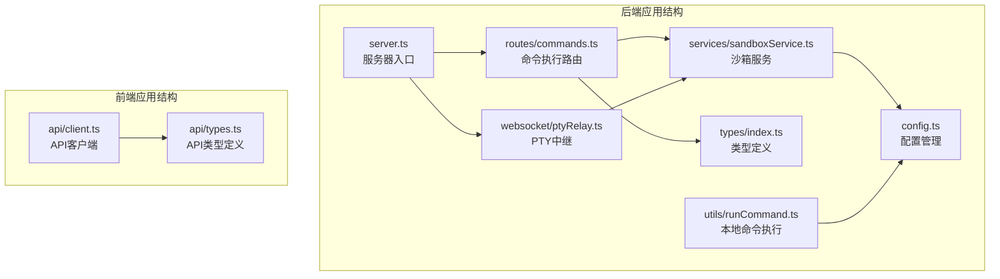
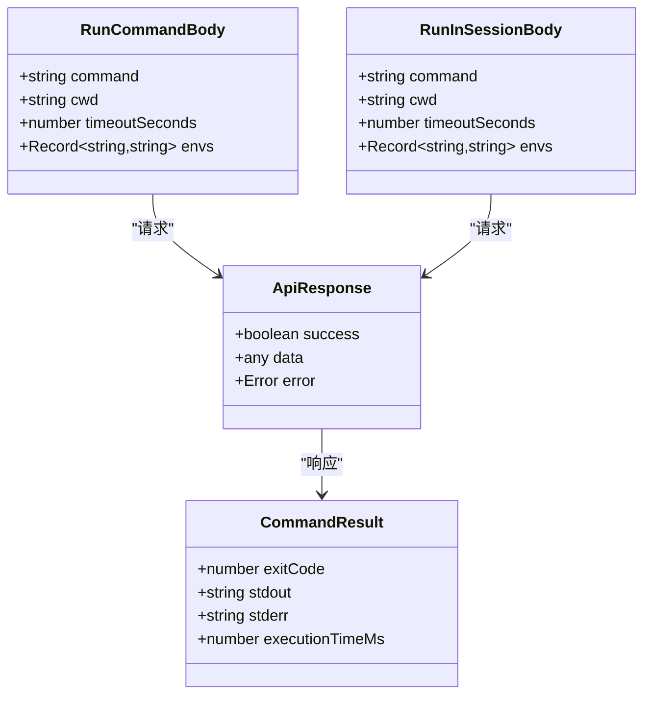
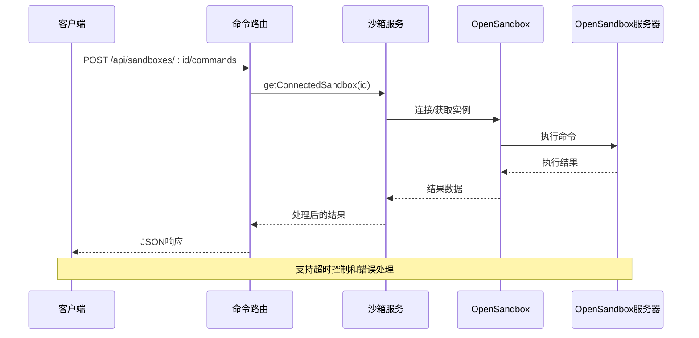
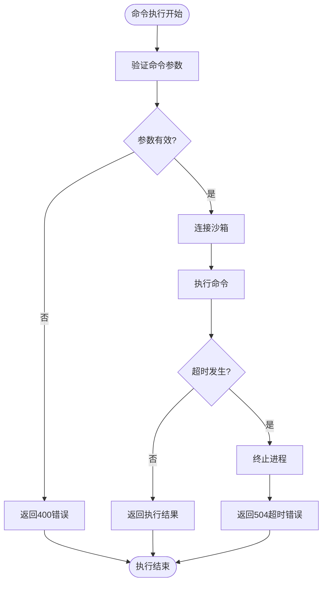
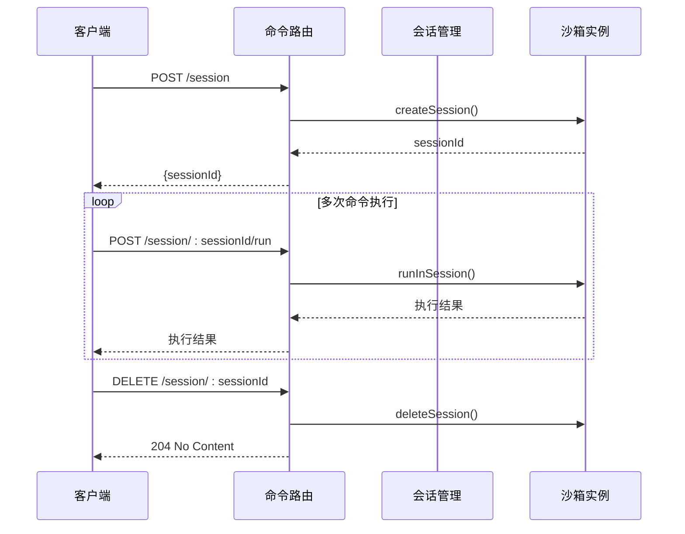
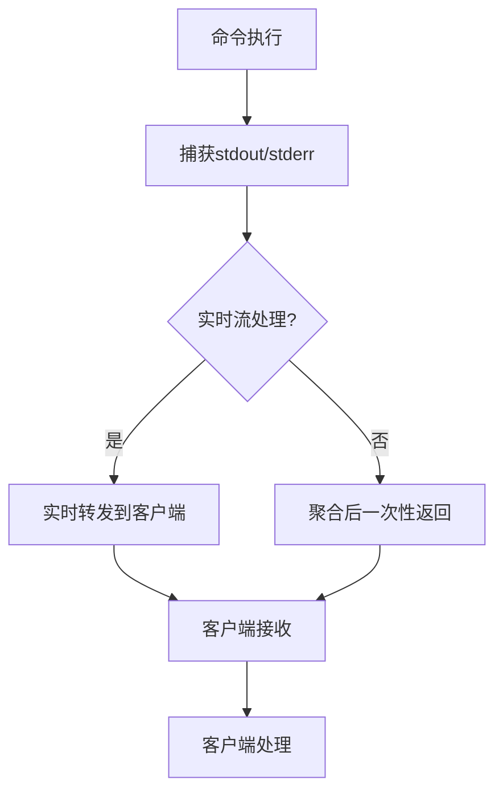
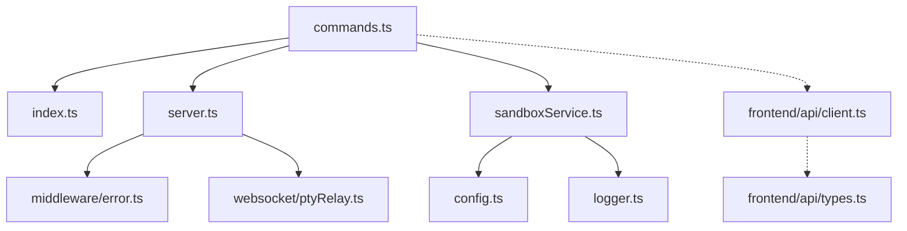
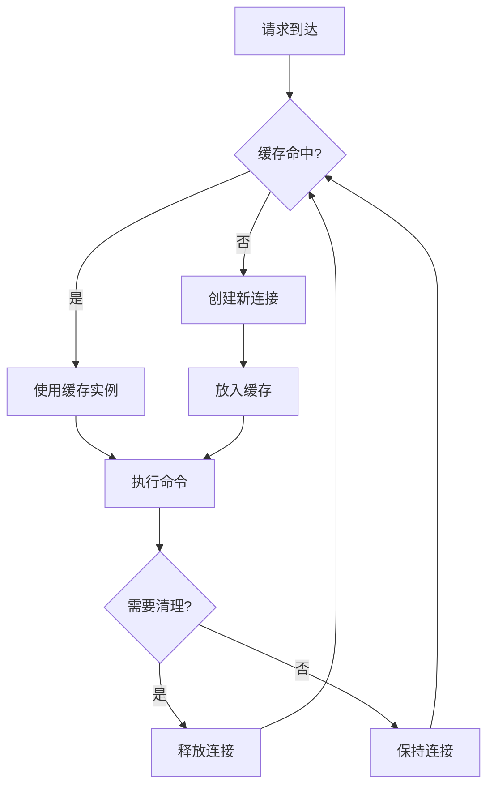

# 命令执行API

<cite>
**本文档引用的文件**
- [apps/backend/src/routes/commands.ts](file://apps/backend/src/routes/commands.ts)
- [apps/backend/src/types/index.ts](file://apps/backend/src/types/index.ts)
- [apps/backend/src/services/sandboxService.ts](file://apps/backend/src/services/sandboxService.ts)
- [apps/backend/src/middleware/error.ts](file://apps/backend/src/middleware/error.ts)
- [apps/backend/src/config.ts](file://apps/backend/src/config.ts)
- [apps/backend/src/server.ts](file://apps/backend/src/server.ts)
- [apps/backend/src/utils/runCommand.ts](file://apps/backend/src/utils/runCommand.ts)
- [apps/backend/src/websocket/ptyRelay.ts](file://apps/backend/src/websocket/ptyRelay.ts)
- [apps/frontend/src/api/client.ts](file://apps/frontend/src/api/client.ts)
- [apps/frontend/src/api/types.ts](file://apps/frontend/src/api/types.ts)
- [README.md](file://README.md)
</cite>

## 目录
1. [简介](#简介)
2. [项目结构](#项目结构)
3. [核心组件](#核心组件)
4. [架构概览](#架构概览)
5. [详细组件分析](#详细组件分析)
6. [依赖关系分析](#依赖关系分析)
7. [性能考虑](#性能考虑)
8. [故障排除指南](#故障排除指南)
9. [结论](#结论)
10. [附录](#附录)

## 简介

本文档详细说明了基于OpenSandbox的命令执行API，重点介绍如何通过REST API在沙盒环境中执行命令。该API支持两种执行模式：同步命令执行（一次性响应）和异步会话执行（持久化会话）。文档涵盖了POST /sandboxes/:sandboxId/commands端点的完整规范，包括请求格式、参数选项、响应结构、超时设置、输出流处理和错误返回机制。

该系统基于Express.js构建，通过OpenSandbox SDK与Kubernetes集群中的沙箱进行交互。后端采用LRU缓存管理沙箱连接，确保高效的服务性能。

## 项目结构

命令执行功能位于后端应用的路由层，主要涉及以下关键文件：



**图表来源**
- [apps/backend/src/routes/commands.ts:1-95](file://apps/backend/src/routes/commands.ts#L1-L95)
- [apps/backend/src/services/sandboxService.ts:1-148](file://apps/backend/src/services/sandboxService.ts#L1-L148)
- [apps/backend/src/server.ts:1-119](file://apps/backend/src/server.ts#L1-L119)

**章节来源**
- [apps/backend/src/routes/commands.ts:1-95](file://apps/backend/src/routes/commands.ts#L1-L95)
- [apps/backend/src/types/index.ts:1-89](file://apps/backend/src/types/index.ts#L1-L89)
- [apps/backend/src/server.ts:1-119](file://apps/backend/src/server.ts#L1-L119)

## 核心组件

### 命令执行路由层

命令执行API通过Express路由器实现，提供三个核心端点：
- POST /api/sandboxes/:sandboxId/commands - 同步命令执行
- POST /api/sandboxes/:sandboxId/commands/session - 创建会话
- POST /api/sandboxes/:sandboxId/commands/session/:sessionId/run - 在会话中执行命令

### 类型定义系统

系统采用强类型设计，定义了完整的请求和响应数据结构：



**图表来源**
- [apps/backend/src/types/index.ts:26-58](file://apps/backend/src/types/index.ts#L26-L58)
- [apps/frontend/src/api/types.ts:42-47](file://apps/frontend/src/api/types.ts#L42-L47)

**章节来源**
- [apps/backend/src/types/index.ts:26-58](file://apps/backend/src/types/index.ts#L26-L58)
- [apps/frontend/src/api/types.ts:42-47](file://apps/frontend/src/api/types.ts#L42-L47)

## 架构概览

命令执行系统采用分层架构设计，确保安全性和可扩展性：



**图表来源**
- [apps/backend/src/routes/commands.ts:13-35](file://apps/backend/src/routes/commands.ts#L13-L35)
- [apps/backend/src/services/sandboxService.ts:112-123](file://apps/backend/src/services/sandboxService.ts#L112-L123)

系统架构的关键特性：
- **安全隔离**：通过OpenSandbox SDK确保命令执行在受控环境中进行
- **连接管理**：LRU缓存机制优化沙箱连接性能
- **错误处理**：统一的错误分类和HTTP状态码映射
- **超时控制**：多层超时机制确保系统稳定性

**章节来源**
- [apps/backend/src/services/sandboxService.ts:17-44](file://apps/backend/src/services/sandboxService.ts#L17-L44)
- [apps/backend/src/middleware/error.ts:5-47](file://apps/backend/src/middleware/error.ts#L5-L47)

## 详细组件分析

### POST /api/sandboxes/:sandboxId/commands 端点

这是最常用的命令执行端点，支持同步命令执行和一次性响应。

#### 请求格式

| 字段 | 类型 | 必需 | 描述 | 示例 |
|------|------|------|------|------|
| command | string | 是 | 要执行的命令字符串 | `"ls -la"` |
| cwd | string | 否 | 工作目录路径 | `"/home/user"` |
| timeoutSeconds | number | 否 | 命令执行超时时间（秒） | `30` |
| envs | object | 否 | 环境变量映射 | `{"KEY": "VALUE"}` |

#### 响应结构

成功响应包含以下字段：

| 字段 | 类型 | 描述 |
|------|------|------|
| success | boolean | 命令执行是否成功 |
| data | object | 执行结果对象 |
| data.exitCode | number | 命令退出码 |
| data.stdout | string | 标准输出内容 |
| data.stderr | string | 标准错误内容 |
| data.executionTimeMs | number | 执行耗时（毫秒） |

#### 错误处理

系统支持多种错误类型：

| 错误代码 | HTTP状态码 | 描述 | 触发场景 |
|----------|------------|------|----------|
| MISSING_COMMAND | 400 | 缺少命令参数 | 请求体中未包含command字段 |
| INVALID_ARGUMENT | 400 | 参数无效 | JSON解析失败或参数格式错误 |
| NOT_CONFIGURED | 503 | 未配置 | OpenSandbox未正确配置 |
| HTTP_500 | 500 | 内部服务器错误 | 未知系统错误 |
| HTTP_502 | 502 | 网关错误 | OpenSandbox API调用失败 |
| HTTP_504 | 504 | 网关超时 | 沙箱准备或命令执行超时 |

#### 超时设置机制

系统采用多层超时控制：



**图表来源**
- [apps/backend/src/routes/commands.ts:19-34](file://apps/backend/src/routes/commands.ts#L19-L34)
- [apps/backend/src/middleware/error.ts:33-47](file://apps/backend/src/middleware/error.ts#L33-L47)

**章节来源**
- [apps/backend/src/routes/commands.ts:13-35](file://apps/backend/src/routes/commands.ts#L13-L35)
- [apps/backend/src/types/index.ts:26-31](file://apps/backend/src/types/index.ts#L26-L31)
- [apps/backend/src/middleware/error.ts:5-47](file://apps/backend/src/middleware/error.ts#L5-L47)

### 异步会话执行模式

系统还支持会话化的命令执行，适用于需要长时间交互的场景：

#### 会话生命周期



**图表来源**
- [apps/backend/src/routes/commands.ts:37-94](file://apps/backend/src/routes/commands.ts#L37-L94)

#### 会话端点说明

| 端点 | 方法 | 功能 | 响应 |
|------|------|------|------|
| /api/sandboxes/:sandboxId/commands/session | POST | 创建新会话 | `{ sessionId: string }` |
| /api/sandboxes/:sandboxId/commands/session/:sessionId/run | POST | 在指定会话中执行命令 | 命令执行结果 |
| /api/sandboxes/:sandboxId/commands/session/:sessionId | DELETE | 删除会话 | 204 No Content |

**章节来源**
- [apps/backend/src/routes/commands.ts:37-94](file://apps/backend/src/routes/commands.ts#L37-L94)

### 输出流处理

系统支持实时输出流处理，特别适用于长运行命令：

#### 输出流机制



**图表来源**
- [apps/backend/src/utils/runCommand.ts:27-36](file://apps/backend/src/utils/runCommand.ts#L27-L36)

输出流处理特性：
- **实时性**：支持实时输出流转发
- **缓冲区管理**：避免内存溢出
- **编码处理**：正确处理UTF-8字符编码

**章节来源**
- [apps/backend/src/utils/runCommand.ts:1-54](file://apps/backend/src/utils/runCommand.ts#L1-L54)

## 依赖关系分析

### 组件耦合度



**图表来源**
- [apps/backend/src/routes/commands.ts:1-10](file://apps/backend/src/routes/commands.ts#L1-L10)
- [apps/backend/src/server.ts:15-26](file://apps/backend/src/server.ts#L15-L26)

### 外部依赖

系统依赖的关键外部组件：
- **OpenSandbox SDK**：提供沙箱管理和命令执行能力
- **Express.js**：Web框架和路由处理
- **WebSocket (ws)**：支持PTY终端连接
- **LRU Cache**：连接缓存管理

**章节来源**
- [apps/backend/src/services/sandboxService.ts:1-10](file://apps/backend/src/services/sandboxService.ts#L1-L10)
- [apps/backend/src/server.ts:1-14](file://apps/backend/src/server.ts#L1-L14)

## 性能考虑

### 连接缓存策略

系统使用LRU缓存优化沙箱连接性能：

| 配置项 | 默认值 | 说明 |
|--------|--------|------|
| 缓存大小 | 50 | 最大缓存的沙箱实例数量 |
| TTL | 10分钟 | 缓存条目的生存时间 |
| 清理策略 | FIFO | 超时后自动清理 |

### 资源管理



**图表来源**
- [apps/backend/src/services/sandboxService.ts:35-44](file://apps/backend/src/services/sandboxService.ts#L35-L44)

### 超时配置

系统提供多层超时配置：

| 配置项 | 默认值 | 说明 |
|--------|--------|------|
| 请求超时 | 300秒 | HTTP请求最大等待时间 |
| PTY空闲超时 | 300000毫秒 | PTY连接空闲超时时间 |
| 命令执行超时 | 可配置 | 单个命令执行超时时间 |

**章节来源**
- [apps/backend/src/config.ts:48-70](file://apps/backend/src/config.ts#L48-L70)
- [apps/backend/src/services/sandboxService.ts:35-44](file://apps/backend/src/services/sandboxService.ts#L35-L44)

## 故障排除指南

### 常见错误诊断

#### 命令执行失败

**问题**：命令执行返回非零退出码
**解决方案**：
1. 检查命令语法和参数
2. 验证工作目录是否存在
3. 确认必要的环境变量已设置
4. 查看stderr输出获取详细错误信息

#### 超时问题

**问题**：命令执行超时返回504错误
**解决方案**：
1. 增加timeoutSeconds参数值
2. 优化命令执行逻辑
3. 检查网络连接稳定性
4. 考虑使用会话模式进行长时间操作

#### 连接问题

**问题**：沙箱连接失败
**解决方案**：
1. 验证OpenSandbox服务器配置
2. 检查API密钥有效性
3. 确认沙箱实例状态正常
4. 查看日志获取详细错误信息

### 调试技巧

#### 启用详细日志

```bash
# 设置日志级别为debug
export LOG_LEVEL=debug

# 启用请求ID追踪
curl -H "X-Request-ID: custom-request-id" \
     -X POST http://localhost:3000/api/sandboxes/:id/commands \
     -H "Content-Type: application/json" \
     -d '{"command":"ls -la"}'
```

#### 使用会话模式进行调试

```javascript
// 1. 创建会话
const session = await fetch('/api/sandboxes/:id/commands/session', {
  method: 'POST',
  headers: {'Content-Type': 'application/json'}
});

const { sessionId } = await session.json();

// 2. 在会话中多次执行命令
for (let i = 0; i < 5; i++) {
  const result = await fetch(`/api/sandboxes/:id/commands/session/${sessionId}/run`, {
    method: 'POST',
    headers: {'Content-Type': 'application/json'},
    body: JSON.stringify({command: `echo "iteration ${i}"`})
  });
}

// 3. 删除会话
await fetch(`/api/sandboxes/:id/commands/session/${sessionId}`, {
  method: 'DELETE'
});
```

**章节来源**
- [apps/backend/src/middleware/error.ts:18-30](file://apps/backend/src/middleware/error.ts#L18-L30)
- [apps/backend/src/config.ts:66-68](file://apps/backend/src/config.ts#L66-L68)

## 结论

命令执行API提供了安全、可靠的沙盒命令执行能力，支持同步和异步两种执行模式。系统通过多层架构设计确保了高可用性和可扩展性，同时提供了完善的错误处理和监控机制。

关键优势：
- **安全性**：通过OpenSandbox SDK确保命令执行在受控环境中进行
- **灵活性**：支持同步和会话两种执行模式
- **可观测性**：完整的日志记录和错误追踪
- **性能**：LRU缓存优化连接管理
- **可靠性**：多层超时控制和错误恢复机制

建议的最佳实践：
1. 优先使用会话模式处理长时间运行的命令
2. 合理设置超时时间，避免阻塞系统资源
3. 监控命令执行结果，及时发现异常情况
4. 使用环境变量管理敏感配置信息
5. 定期清理不再使用的会话连接

## 附录

### API端点完整列表

| 端点 | 方法 | 功能 | 响应码 |
|------|------|------|--------|
| /api/sandboxes/:sandboxId/commands | POST | 同步命令执行 | 200, 400, 500, 502, 504 |
| /api/sandboxes/:sandboxId/commands/session | POST | 创建会话 | 200, 400, 500, 502 |
| /api/sandboxes/:sandboxId/commands/session/:sessionId/run | POST | 会话内命令执行 | 200, 400, 500, 502, 504 |
| /api/sandboxes/:sandboxId/commands/session/:sessionId | DELETE | 删除会话 | 204, 404, 500, 502 |

### 环境变量配置

| 变量名 | 默认值 | 说明 |
|--------|--------|------|
| OPENSANDBOX_SERVER_URL | localhost:8080 | OpenSandbox服务器地址 |
| OPENSANDBOX_API_KEY | (必需) | API访问密钥 |
| OPENSANDBOX_PROTOCOL | http | 连接协议（http/https） |
| PORT | 3000 | 服务监听端口 |
| LOG_LEVEL | info | 日志级别 |
| PTY_IDLE_TIMEOUT_MS | 300000 | PTY空闲超时时间 |

### 前端集成示例

```typescript
// 前端API客户端使用示例
import { request } from './api/client';

// 同步命令执行
try {
  const result = await request('POST', '/api/sandboxes/:id/commands', {
    command: 'ls -la',
    cwd: '/home/user',
    timeoutSeconds: 30
  });
  console.log('命令执行结果:', result);
} catch (error) {
  console.error('命令执行失败:', error.message);
}
```

**章节来源**
- [README.md:153-187](file://README.md#L153-L187)
- [apps/frontend/src/api/client.ts:16-44](file://apps/frontend/src/api/client.ts#L16-L44)