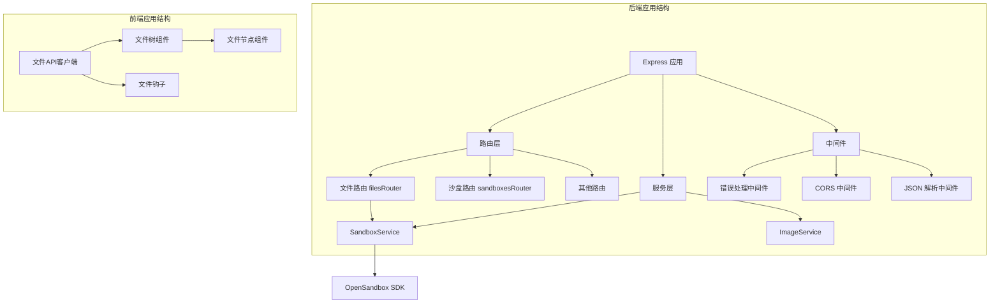
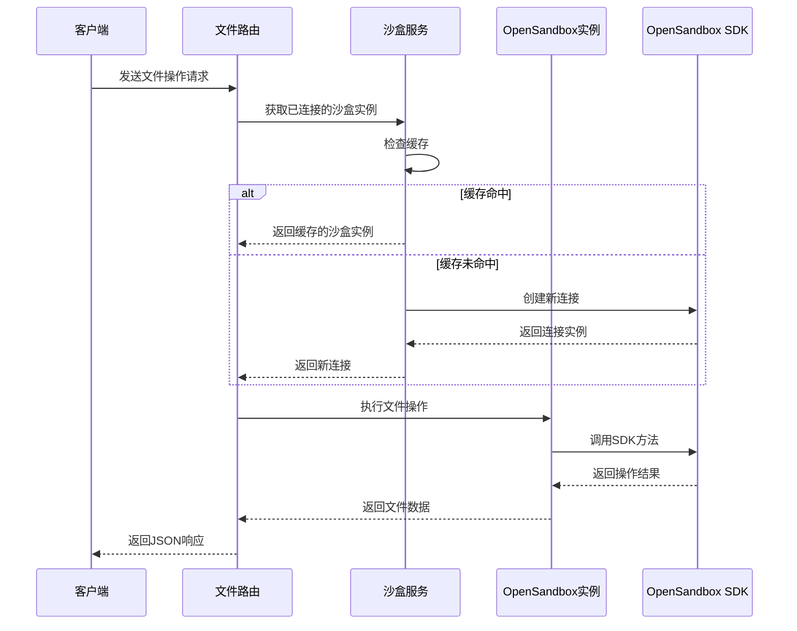
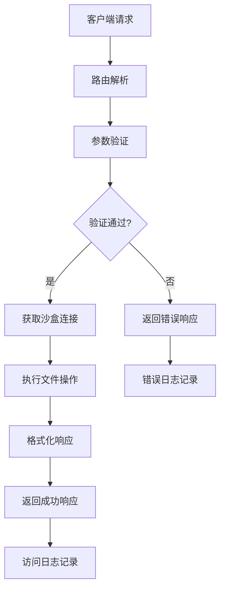
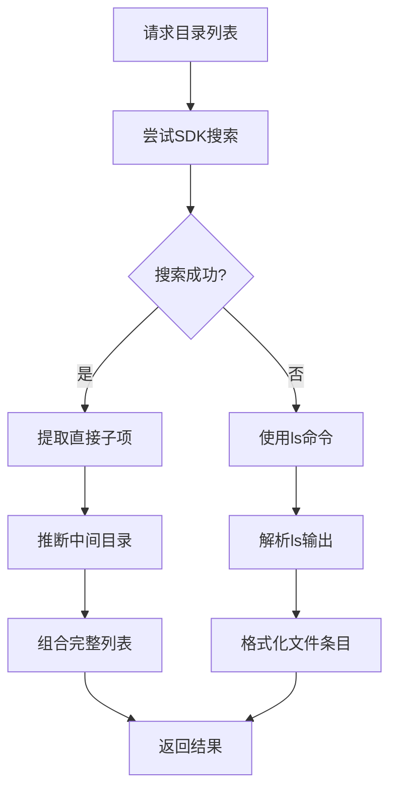
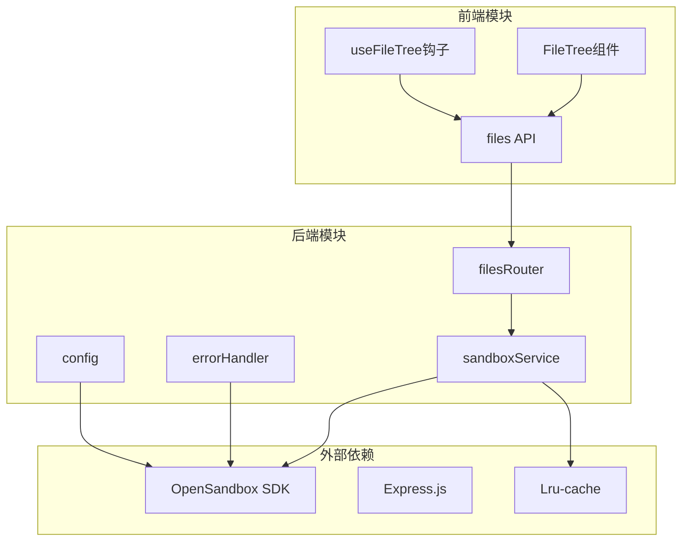
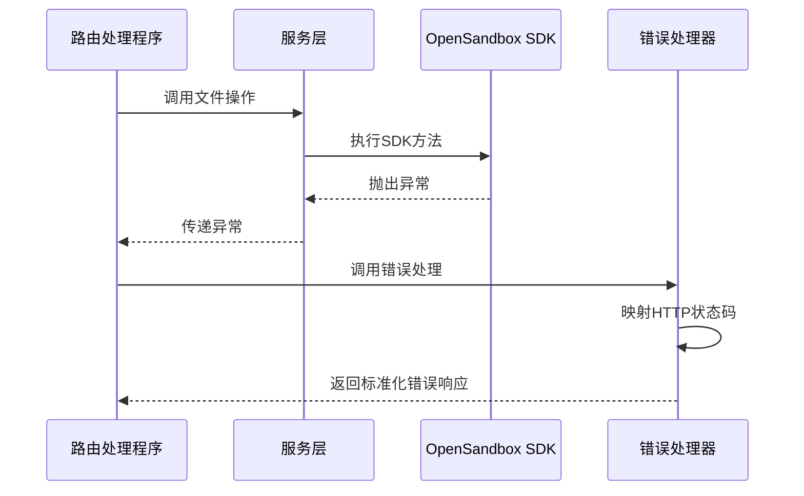

# 文件操作API

<cite>
**本文档引用的文件**
- [apps/backend/src/routes/files.ts](file://apps/backend/src/routes/files.ts)
- [apps/backend/src/services/sandboxService.ts](file://apps/backend/src/services/sandboxService.ts)
- [apps/backend/src/middleware/error.ts](file://apps/backend/src/middleware/error.ts)
- [apps/backend/src/types/index.ts](file://apps/backend/src/types/index.ts)
- [apps/backend/src/config.ts](file://apps/backend/src/config.ts)
- [apps/backend/src/server.ts](file://apps/backend/src/server.ts)
- [apps/frontend/src/api/files.ts](file://apps/frontend/src/api/files.ts)
- [apps/frontend/src/api/types.ts](file://apps/frontend/src/api/types.ts)
- [apps/frontend/src/components/files/FileTree.tsx](file://apps/frontend/src/components/files/FileTree.tsx)
- [apps/frontend/src/hooks/useFileTree.ts](file://apps/frontend/src/hooks/useFileTree.ts)
</cite>

## 目录
1. [简介](#简介)
2. [项目结构](#项目结构)
3. [核心组件](#核心组件)
4. [架构概览](#架构概览)
5. [详细组件分析](#详细组件分析)
6. [依赖关系分析](#依赖关系分析)
7. [性能考虑](#性能考虑)
8. [故障排除指南](#故障排除指南)
9. [结论](#结论)
10. [附录](#附录)

## 简介

本文档详细说明了沙盒内部文件系统的REST API接口，该系统允许用户对OpenSandbox容器内的文件进行浏览、读取、写入、创建目录、移动重命名、删除等操作。API基于Express.js构建，通过OpenSandbox SDK与沙盒环境进行交互。

该API提供了完整的文件管理功能，包括：
- 文件列表浏览（支持递归搜索和命令回退）
- 文件内容读取（文本和二进制）
- 文件写入和覆盖
- 目录创建
- 文件移动和重命名
- 文件和目录删除

## 项目结构

文件操作API位于后端服务中，采用模块化设计：



**图表来源**
- [apps/backend/src/server.ts:36-90](file://apps/backend/src/server.ts#L36-L90)
- [apps/backend/src/routes/files.ts:8-44](file://apps/backend/src/routes/files.ts#L8-L44)

**章节来源**
- [apps/backend/src/server.ts:36-90](file://apps/backend/src/server.ts#L36-L90)
- [apps/backend/src/routes/files.ts:8-44](file://apps/backend/src/routes/files.ts#L8-L44)

## 核心组件

### 文件路由控制器

文件操作API通过filesRouter统一管理所有文件相关请求。该路由器支持以下主要操作：

- **目录列表**：`GET /sandboxes/:sandboxId/files`
- **文件内容读取**：`GET /sandboxes/:sandboxId/files/content`
- **文件下载**：`GET /sandboxes/:sandboxId/files/download`
- **文件写入**：`POST /sandboxes/:sandboxId/files/write`
- **目录创建**：`POST /sandboxes/:sandboxId/files/mkdir`
- **文件移动/重命名**：`POST /sandboxes/:sandboxId/files/move`
- **文件删除**：`DELETE /sandboxes/:sandboxId/files/files`
- **目录删除**：`DELETE /sandboxes/:sandboxId/files/directories`

### 沙盒服务层

SandboxService负责管理与OpenSandbox SDK的连接，提供LRU缓存机制来优化性能：

- 连接池管理（最多50个连接，10分钟超时）
- 自动连接重建
- 缓存失效处理
- 执行端点URL生成

### 错误处理机制

全局错误处理器将SDK异常映射到标准HTTP响应格式：

- SDK异常 → HTTP 502
- 超时异常 → HTTP 504  
- 参数验证失败 → HTTP 400
- 其他异常 → HTTP 500

**章节来源**
- [apps/backend/src/routes/files.ts:19-207](file://apps/backend/src/routes/files.ts#L19-L207)
- [apps/backend/src/services/sandboxService.ts:11-147](file://apps/backend/src/services/sandboxService.ts#L11-L147)
- [apps/backend/src/middleware/error.ts:5-47](file://apps/backend/src/middleware/error.ts#L5-L47)

## 架构概览

文件操作API采用分层架构设计，确保职责分离和可维护性：



**图表来源**
- [apps/backend/src/routes/files.ts:14-17](file://apps/backend/src/routes/files.ts#L14-L17)
- [apps/backend/src/services/sandboxService.ts:112-123](file://apps/backend/src/services/sandboxService.ts#L112-L123)

### 数据流图



**图表来源**
- [apps/backend/src/routes/files.ts:20-44](file://apps/backend/src/routes/files.ts#L20-L44)
- [apps/backend/src/middleware/error.ts:18-31](file://apps/backend/src/middleware/error.ts#L18-L31)

## 详细组件分析

### 文件列表功能

文件列表功能实现了智能的目录浏览机制，结合了SDK搜索API和命令回退方案：

#### 主要特性

1. **SDK搜索优先**：使用`search` API获取递归目录内容
2. **直接子项过滤**：从递归结果中提取直接子项
3. **目录推断**：根据深层路径推断不存在的中间目录
4. **命令回退**：当SDK搜索失败时使用`ls -1Ap`命令

#### 实现细节



**图表来源**
- [apps/backend/src/routes/files.ts:213-275](file://apps/backend/src/routes/files.ts#L213-L275)
- [apps/backend/src/routes/files.ts:281-313](file://apps/backend/src/routes/files.ts#L281-L313)

**章节来源**
- [apps/backend/src/routes/files.ts:213-313](file://apps/backend/src/routes/files.ts#L213-L313)

### 文件读取功能

文件读取功能支持两种模式：文本内容读取和二进制文件下载。

#### 文本内容读取

- **端点**：`GET /sandboxes/:sandboxId/files/content`
- **查询参数**：`path`（必需）
- **响应类型**：`text/plain`
- **错误处理**：目录检测、路径验证

#### 二进制文件下载

- **端点**：`GET /sandboxes/:sandboxId/files/download`
- **查询参数**：`path`（必需）
- **响应类型**：`application/octet-stream`
- **适用场景**：图片、压缩包、可执行文件等二进制文件

**章节来源**
- [apps/backend/src/routes/files.ts:47-94](file://apps/backend/src/routes/files.ts#L47-L94)

### 文件写入功能

文件写入功能支持单文件写入操作：

#### 请求格式

```typescript
interface WriteFileBody {
  path: string;      // 文件路径（必需）
  content: string;   // 文件内容（必需）
  mode?: number;     // 文件权限模式（可选）
}
```

#### 响应格式

```typescript
interface ApiResponse {
  success: boolean;
  data?: any;
  error?: {
    code: string;
    message: string;
    requestId?: string;
  };
}
```

**章节来源**
- [apps/backend/src/routes/files.ts:97-115](file://apps/backend/src/routes/files.ts#L97-L115)
- [apps/backend/src/types/index.ts:33-37](file://apps/backend/src/types/index.ts#L33-L37)

### 目录管理功能

#### 目录创建

- **端点**：`POST /sandboxes/:sandboxId/files/mkdir`
- **请求体**：包含`paths`数组和可选`mode`
- **批量操作**：支持一次创建多个目录

#### 文件删除

- **端点**：`DELETE /sandboxes/:sandboxId/files/files`
- **查询参数**：`path`（支持单个或多个路径）
- **批量删除**：支持同时删除多个文件

#### 目录删除

- **端点**：`DELETE /sandboxes/:sandboxId/files/directories`
- **查询参数**：`path`（支持单个或多个路径）
- **注意事项**：仅删除空目录

**章节来源**
- [apps/backend/src/routes/files.ts:118-207](file://apps/backend/src/routes/files.ts#L118-L207)
- [apps/backend/src/types/index.ts:39-46](file://apps/backend/src/types/index.ts#L39-L46)

### 文件移动和重命名

- **端点**：`POST /sandboxes/:sandboxId/files/move`
- **请求体**：包含`entries`数组，每个元素为`{src: string, dest: string}`
- **批量操作**：支持同时移动多个文件
- **原子性**：移动操作在沙盒环境中保证原子性

**章节来源**
- [apps/backend/src/routes/files.ts:139-157](file://apps/backend/src/routes/files.ts#L139-L157)

## 依赖关系分析

### 组件依赖图



**图表来源**
- [apps/backend/src/services/sandboxService.ts:1-10](file://apps/backend/src/services/sandboxService.ts#L1-L10)
- [apps/backend/src/routes/files.ts:1-8](file://apps/backend/src/routes/files.ts#L1-L8)

### 错误处理依赖链



**图表来源**
- [apps/backend/src/middleware/error.ts:33-47](file://apps/backend/src/middleware/error.ts#L33-L47)
- [apps/backend/src/routes/files.ts:41-43](file://apps/backend/src/routes/files.ts#L41-L43)

**章节来源**
- [apps/backend/src/services/sandboxService.ts:1-10](file://apps/backend/src/services/sandboxService.ts#L1-L10)
- [apps/backend/src/middleware/error.ts:33-47](file://apps/backend/src/middleware/error.ts#L33-L47)

## 性能考虑

### 缓存策略

SandboxService实现了LRU缓存机制来优化连接性能：

- **缓存大小**：最多50个沙盒连接
- **TTL设置**：10分钟自动失效
- **清理机制**：自动关闭失效连接
- **连接复用**：避免重复建立网络连接

### 文件列表优化

文件列表功能采用了双重策略来确保性能：

1. **SDK搜索优先**：利用SDK的高效搜索能力
2. **命令回退机制**：在SDK不可用时使用shell命令
3. **输出限制**：使用`head -500`限制最大返回条目数

### 内存管理

- **流式处理**：文件下载使用Buffer.from进行内存管理
- **批量操作**：支持批量文件操作减少网络往返
- **连接池**：复用沙盒连接避免频繁握手

**章节来源**
- [apps/backend/src/services/sandboxService.ts:35-44](file://apps/backend/src/services/sandboxService.ts#L35-L44)
- [apps/backend/src/routes/files.ts:287](file://apps/backend/src/routes/files.ts#L287)

## 故障排除指南

### 常见错误及解决方案

#### 1. 路径相关错误

**错误代码**：`MISSING_PATH`
**描述**：缺少必需的path参数
**解决方案**：确保请求包含有效的path查询参数

**错误代码**：`IS_DIRECTORY`  
**描述**：指定路径是目录而非文件
**解决方案**：检查路径是否指向正确的目标文件

#### 2. SDK连接错误

**错误代码**：`HTTP_502`
**描述**：OpenSandbox SDK调用失败
**解决方案**：
- 检查OpenSandbox服务器连通性
- 验证API密钥配置
- 查看服务器日志获取详细错误信息

#### 3. 超时错误

**错误代码**：`HTTP_504`
**描述**：沙盒启动超时
**解决方案**：
- 增加超时时间配置
- 检查镜像拉取状态
- 验证资源配额

#### 4. 参数验证错误

**错误代码**：`HTTP_400`
**描述**：请求参数无效
**解决方案**：
- 检查请求体格式
- 验证必填字段完整性
- 确认数据类型正确性

### 日志分析

系统提供了详细的日志记录机制：

- **请求ID追踪**：每个请求都有唯一标识符
- **错误详情记录**：包含完整的错误堆栈信息
- **性能指标**：记录请求处理时间和资源使用情况

### 调试建议

1. **启用详细日志**：设置`LOG_LEVEL=debug`
2. **检查网络连通性**：验证OpenSandbox服务器可达性
3. **验证认证配置**：确认API密钥和服务器URL正确
4. **监控资源使用**：关注内存和CPU使用情况

**章节来源**
- [apps/backend/src/middleware/error.ts:18-31](file://apps/backend/src/middleware/error.ts#L18-L31)
- [apps/backend/src/config.ts:48-70](file://apps/backend/src/config.ts#L48-L70)

## 结论

文件操作API提供了完整的沙盒文件管理系统，具有以下特点：

### 技术优势
- **模块化设计**：清晰的分层架构便于维护和扩展
- **性能优化**：连接池和缓存机制提升响应速度
- **容错处理**：多重回退机制确保服务稳定性
- **标准化响应**：统一的错误处理和响应格式

### 功能完整性
- 支持所有基本文件操作（浏览、读取、写入、删除）
- 提供批量操作能力
- 包含完善的错误处理机制
- 支持二进制文件处理

### 最佳实践建议
1. **合理使用缓存**：利用LRU缓存提升性能
2. **错误重试**：对临时性错误实施重试机制
3. **资源监控**：定期检查内存和连接使用情况
4. **安全考虑**：确保文件路径的安全验证

该API为开发者提供了可靠、高效的沙盒文件管理解决方案，适用于各种容器化开发和测试场景。

## 附录

### API端点对照表

| 方法 | 端点 | 描述 | 必需参数 |
|------|------|------|----------|
| GET | `/sandboxes/:sandboxId/files` | 获取目录列表 | `path` |
| GET | `/sandboxes/:sandboxId/files/content` | 读取文件内容 | `path` |
| GET | `/sandboxes/:sandboxId/files/download` | 下载文件 | `path` |
| POST | `/sandboxes/:sandboxId/files/write` | 写入文件 | `path`, `content` |
| POST | `/sandboxes/:sandboxId/files/mkdir` | 创建目录 | `paths` |
| POST | `/sandboxes/:sandboxId/files/move` | 移动/重命名 | `entries` |
| DELETE | `/sandboxes/:sandboxId/files/files` | 删除文件 | `path` |
| DELETE | `/sandboxes/:sandboxId/files/directories` | 删除目录 | `path` |

### 配置选项

| 配置项 | 类型 | 默认值 | 描述 |
|--------|------|--------|------|
| `OPENSANDBOX_SERVER_URL` | string | - | OpenSandbox服务器地址 |
| `OPENSANDBOX_API_KEY` | string | - | API访问密钥 |
| `OPENSANDBOX_PROTOCOL` | "http"\|"https" | "http" | 连接协议 |
| `OPENSANDBOX_REQUEST_TIMEOUT_SECONDS` | number | 300 | 请求超时时间 |
| `CORS_ORIGIN` | string | "*" | CORS允许的源 |

### 前端集成示例

前端提供了完整的文件操作接口：

- **文件列表**：`listFiles(sandboxId, dirPath)`
- **文件读取**：`getFileContent(sandboxId, filePath)`
- **文件写入**：`writeFile(sandboxId, filePath, content)`
- **目录创建**：`createDirectory(sandboxId, dirPath)`
- **文件删除**：`deleteFile(sandboxId, filePath)`

这些接口与后端API完全对应，确保前后端的一致性和易用性。

**章节来源**
- [apps/frontend/src/api/files.ts:4-31](file://apps/frontend/src/api/files.ts#L4-L31)
- [apps/frontend/src/api/types.ts:27-33](file://apps/frontend/src/api/types.ts#L27-L33)