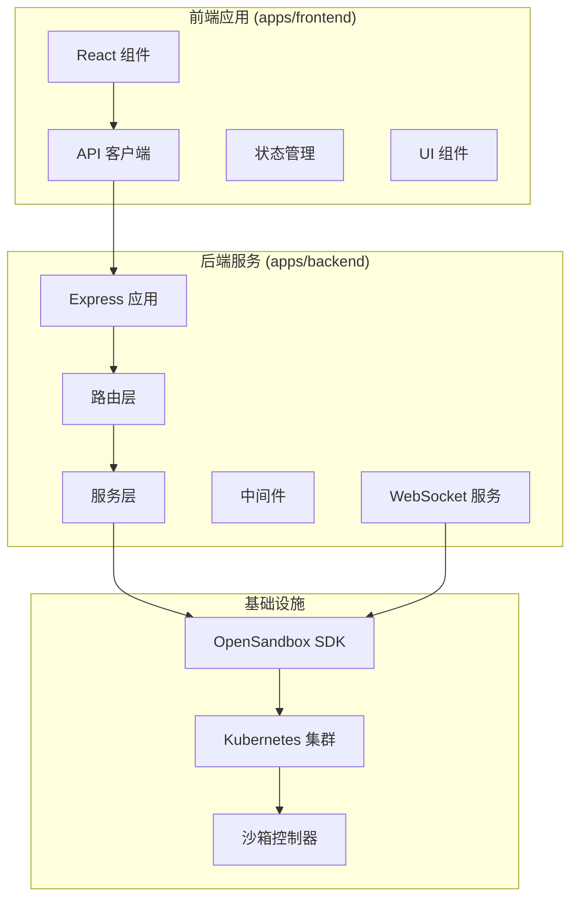
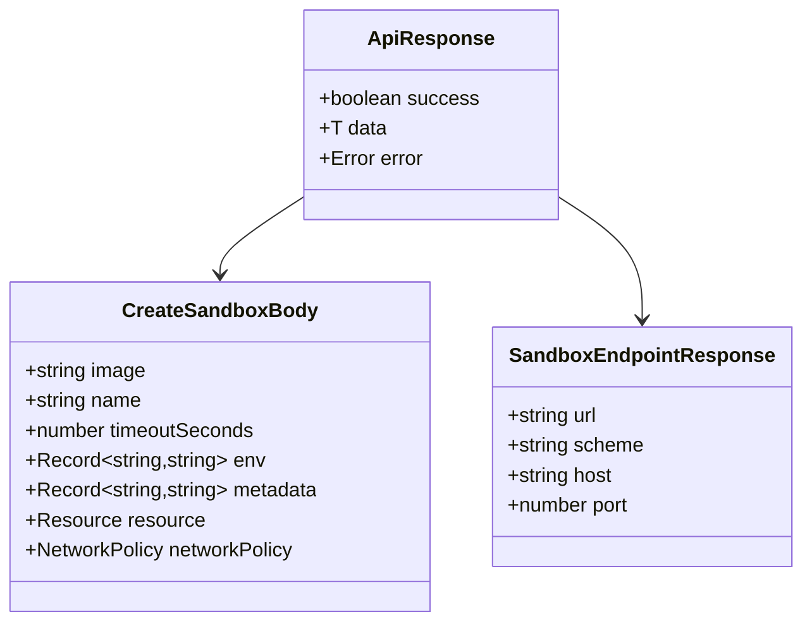
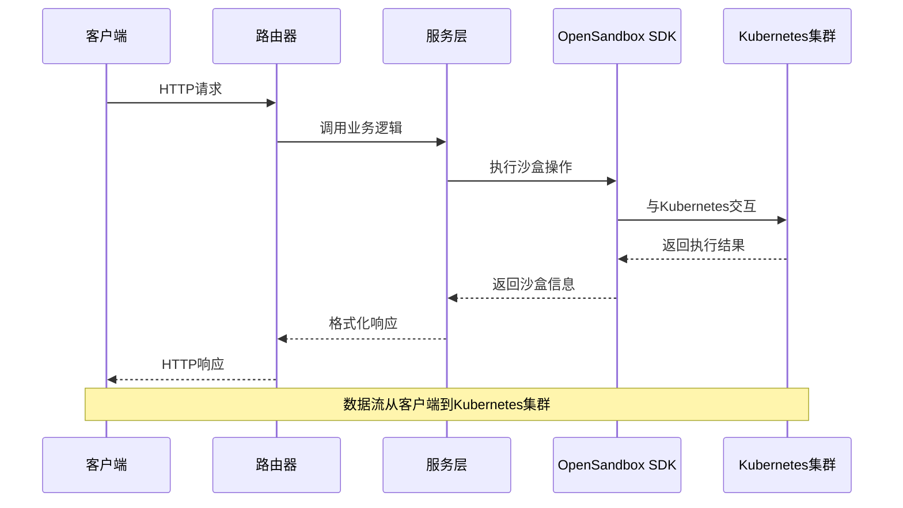
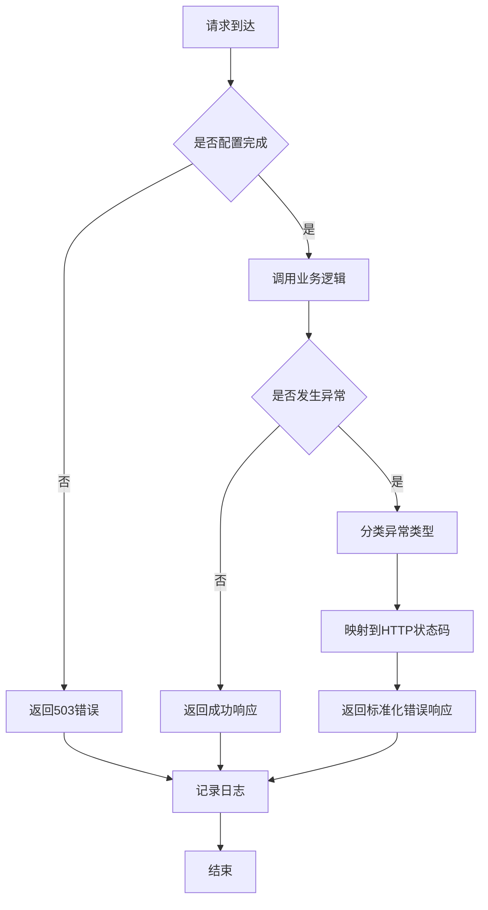
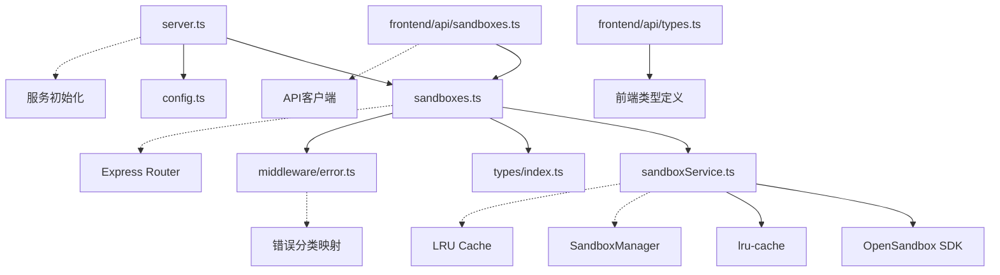
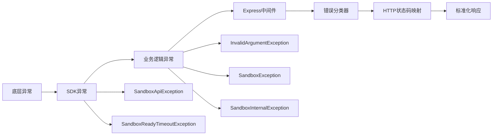

# 沙盒管理API

<cite>
**本文档引用的文件**
- [apps/backend/src/routes/sandboxes.ts](file://apps/backend/src/routes/sandboxes.ts)
- [apps/backend/src/services/sandboxService.ts](file://apps/backend/src/services/sandboxService.ts)
- [apps/backend/src/types/index.ts](file://apps/backend/src/types/index.ts)
- [apps/backend/src/middleware/error.ts](file://apps/backend/src/middleware/error.ts)
- [apps/backend/src/server.ts](file://apps/backend/src/server.ts)
- [apps/backend/src/routes/index.ts](file://apps/backend/src/routes/index.ts)
- [apps/frontend/src/api/sandboxes.ts](file://apps/frontend/src/api/sandboxes.ts)
- [apps/frontend/src/api/types.ts](file://apps/frontend/src/api/types.ts)
- [apps/backend/src/config.ts](file://apps/backend/src/config.ts)
- [README.md](file://README.md)
</cite>

## 目录
1. [简介](#简介)
2. [项目结构](#项目结构)
3. [核心组件](#核心组件)
4. [架构概览](#架构概览)
5. [详细组件分析](#详细组件分析)
6. [依赖关系分析](#依赖关系分析)
7. [性能考虑](#性能考虑)
8. [故障排除指南](#故障排除指南)
9. [结论](#结论)
10. [附录](#附录)

## 简介

沙盒管理API是基于OpenSandbox的Kubernetes AI沙箱管理平台的核心REST API接口。该API允许用户创建、管理和控制隔离的沙盒环境，支持完整的生命周期管理，包括沙盒的创建、查询、删除、暂停和恢复操作。

该平台通过Web UI提供直观的沙箱管理界面，结合Web终端(xterm.js)实现实时交互体验。后端采用Express + WebSocket + OpenSandbox SDK架构，前端使用React 19 + TypeScript + Tailwind CSS技术栈。

## 项目结构

项目采用monorepo架构，主要包含以下关键组件：



**图表来源**
- [apps/backend/src/server.ts:36-90](file://apps/backend/src/server.ts#L36-L90)
- [apps/backend/src/routes/index.ts:9-15](file://apps/backend/src/routes/index.ts#L9-L15)

**章节来源**
- [apps/backend/src/server.ts:36-90](file://apps/backend/src/server.ts#L36-L90)
- [apps/backend/src/routes/index.ts:9-15](file://apps/backend/src/routes/index.ts#L9-L15)
- [README.md:114-140](file://README.md#L114-L140)

## 核心组件

### API 路由层

沙盒管理API的核心路由定义在`apps/backend/src/routes/sandboxes.ts`中，包含以下主要端点：

1. **GET /api/sandboxes** - 列出所有沙盒
2. **POST /api/sandboxes** - 创建新沙盒
3. **GET /api/sandboxes/:id** - 获取特定沙盒信息
4. **DELETE /api/sandboxes/:id** - 删除沙盒
5. **POST /api/sandboxes/:id/pause** - 暂停沙盒
6. **POST /api/sandboxes/:id/resume** - 恢复沙盒
7. **GET /api/sandboxes/:id/endpoints/:port** - 获取沙盒端点URL

### 服务层

`apps/backend/src/services/sandboxService.ts`实现了核心业务逻辑，封装了OpenSandbox SDK的复杂性，并提供了以下功能：

- 沙盒生命周期管理
- LRU缓存机制优化连接性能
- 错误处理和重试策略
- 连接配置管理

### 类型定义

API使用统一的响应格式和类型定义，确保前后端数据一致性：



**图表来源**
- [apps/backend/src/types/index.ts:3-11](file://apps/backend/src/types/index.ts#L3-L11)
- [apps/backend/src/types/index.ts:13-24](file://apps/backend/src/types/index.ts#L13-L24)
- [apps/backend/src/types/index.ts:60-65](file://apps/backend/src/types/index.ts#L60-L65)

**章节来源**
- [apps/backend/src/routes/sandboxes.ts:1-175](file://apps/backend/src/routes/sandboxes.ts#L1-L175)
- [apps/backend/src/services/sandboxService.ts:11-148](file://apps/backend/src/services/sandboxService.ts#L11-L148)
- [apps/backend/src/types/index.ts:1-89](file://apps/backend/src/types/index.ts#L1-L89)

## 架构概览

沙盒管理API采用分层架构设计，确保关注点分离和代码可维护性：



**图表来源**
- [apps/backend/src/routes/sandboxes.ts:62-116](file://apps/backend/src/routes/sandboxes.ts#L62-L116)
- [apps/backend/src/services/sandboxService.ts:58-88](file://apps/backend/src/services/sandboxService.ts#L58-L88)

### 错误处理架构

系统实现了统一的错误处理机制，将底层异常转换为标准的HTTP响应：



**图表来源**
- [apps/backend/src/middleware/error.ts:5-47](file://apps/backend/src/middleware/error.ts#L5-L47)
- [apps/backend/src/routes/sandboxes.ts:34-45](file://apps/backend/src/routes/sandboxes.ts#L34-L45)

**章节来源**
- [apps/backend/src/middleware/error.ts:1-48](file://apps/backend/src/middleware/error.ts#L1-L48)
- [apps/backend/src/server.ts:66-67](file://apps/backend/src/server.ts#L66-L67)

## 详细组件分析

### 沙盒列表端点 (GET /api/sandboxes)

#### 功能描述
获取所有沙盒的列表信息，支持按状态过滤和分页查询。

#### 请求参数
- `state` (可选): 沙盒状态过滤器，支持多个状态值
- `page` (可选): 页码，默认1
- `pageSize` (可选): 每页大小，默认20

#### 响应格式
```json
{
  "success": true,
  "data": {
    "items": [
      {
        "id": "string",
        "name": "string",
        "image": "string",
        "status": "string",
        "statusDetail": {
          "state": "string",
          "reason": "string",
          "message": "string",
          "lastTransitionAt": "string"
        },
        "createdAt": "string",
        "expiresAt": "string",
        "entrypoint": ["string"],
        "metadata": {"key": "value"},
        "env": {"key": "value"}
      }
    ],
    "pagination": {
      "page": 1,
      "pageSize": 20,
      "total": 100
    }
  }
}
```

#### HTTP状态码
- `200 OK`: 成功获取沙盒列表
- `400 Bad Request`: 请求参数无效
- `500 Internal Server Error`: 服务器内部错误

**章节来源**
- [apps/backend/src/routes/sandboxes.ts:62-93](file://apps/backend/src/routes/sandboxes.ts#L62-L93)
- [apps/backend/src/types/index.ts:3-11](file://apps/backend/src/types/index.ts#L3-L11)

### 创建沙盒端点 (POST /api/sandboxes)

#### 功能描述
创建一个新的沙盒实例，支持自定义镜像、环境变量、资源限制等配置。

#### 请求体参数
```typescript
interface CreateSandboxBody {
  image: string;                    // 必需：容器镜像名称
  name?: string;                    // 可选：沙盒名称
  timeoutSeconds?: number;          // 可选：超时时间（秒），默认600
  env?: Record<string, string>;     // 可选：环境变量
  metadata?: Record<string, string>; // 可选：元数据信息
  resource?: {                      // 可选：资源限制
    cpu?: string;
    memory?: string;
  };
  networkPolicy?: {                 // 可选：网络策略
    defaultAction: string;
    egress?: Array<{
      action: string;
      target: string;
    }>;
  };
}
```

#### 响应格式
返回创建的沙盒信息，格式与沙盒详情相同。

#### HTTP状态码
- `202 Accepted`: 沙盒创建已接受（异步处理）
- `400 Bad Request`: 请求参数无效
- `500 Internal Server Error`: 服务器内部错误

**章节来源**
- [apps/backend/src/routes/sandboxes.ts:95-105](file://apps/backend/src/routes/sandboxes.ts#L95-L105)
- [apps/backend/src/types/index.ts:13-24](file://apps/backend/src/types/index.ts#L13-L24)

### 获取沙盒详情端点 (GET /api/sandboxes/:id)

#### 功能描述
获取指定沙盒的完整信息，包括状态、配置、环境变量等。

#### 路径参数
- `:id` (必需): 沙盒唯一标识符

#### 响应格式
与沙盒列表中的单个条目格式相同。

#### HTTP状态码
- `200 OK`: 成功获取沙盒信息
- `404 Not Found`: 沙盒不存在
- `500 Internal Server Error`: 服务器内部错误

**章节来源**
- [apps/backend/src/routes/sandboxes.ts:107-116](file://apps/backend/src/routes/sandboxes.ts#L107-L116)

### 删除沙盒端点 (DELETE /api/sandboxes/:id)

#### 功能描述
删除指定的沙盒实例，释放相关资源。

#### 路径参数
- `:id` (必需): 沙盒唯一标识符

#### 响应格式
- `204 No Content`: 成功删除沙盒

#### HTTP状态码
- `204 No Content`: 成功删除
- `404 Not Found`: 沙盒不存在
- `500 Internal Server Error`: 服务器内部错误

**章节来源**
- [apps/backend/src/routes/sandboxes.ts:118-127](file://apps/backend/src/routes/sandboxes.ts#L118-L127)

### 暂停沙盒端点 (POST /api/sandboxes/:id/pause)

#### 功能描述
暂停指定沙盒的运行，保留其状态以便后续恢复。

#### 路径参数
- `:id` (必需): 沙盒唯一标识符

#### 响应格式
```json
{
  "success": true
}
```

#### HTTP状态码
- `200 OK`: 成功暂停沙盒
- `404 Not Found`: 沙盒不存在
- `500 Internal Server Error`: 服务器内部错误

**章节来源**
- [apps/backend/src/routes/sandboxes.ts:129-138](file://apps/backend/src/routes/sandboxes.ts#L129-L138)

### 恢复沙盒端点 (POST /api/sandboxes/:id/resume)

#### 功能描述
恢复之前暂停的沙盒，继续其正常运行。

#### 路径参数
- `:id` (必需): 沙盒唯一标识符

#### 响应格式
```json
{
  "success": true
}
```

#### HTTP状态码
- `200 OK`: 成功恢复沙盒
- `404 Not Found`: 沙盒不存在
- `500 Internal Server Error`: 服务器内部错误

**章节来源**
- [apps/backend/src/routes/sandboxes.ts:140-149](file://apps/backend/src/routes/sandboxes.ts#L140-L149)

### 获取沙盒端点URL端点 (GET /api/sandboxes/:id/endpoints/:port)

#### 功能描述
获取指定沙盒特定端口的访问URL，用于外部访问沙盒内的服务。

#### 路径参数
- `:id` (必需): 沙盒唯一标识符
- `:port` (必需): 端口号

#### 响应格式
```json
{
  "success": true,
  "data": {
    "url": "string",      // 完整的访问URL
    "scheme": "string",   // 协议 (http/https)
    "host": "string",     // 主机地址
    "port": number        // 端口号
  }
}
```

#### HTTP状态码
- `200 OK`: 成功获取端点信息
- `404 Not Found`: 沙盒或端口不存在
- `500 Internal Server Error`: 服务器内部错误

**章节来源**
- [apps/backend/src/routes/sandboxes.ts:151-174](file://apps/backend/src/routes/sandboxes.ts#L151-L174)
- [apps/backend/src/types/index.ts:60-65](file://apps/backend/src/types/index.ts#L60-L65)

## 依赖关系分析

### 组件依赖图



**图表来源**
- [apps/backend/src/routes/sandboxes.ts:1-9](file://apps/backend/src/routes/sandboxes.ts#L1-L9)
- [apps/backend/src/services/sandboxService.ts:1-10](file://apps/backend/src/services/sandboxService.ts#L1-L10)
- [apps/backend/src/server.ts:8-13](file://apps/backend/src/server.ts#L8-L13)

### 错误处理依赖链

系统实现了完整的错误处理依赖链，确保每个异常都能被正确捕获和处理：



**图表来源**
- [apps/backend/src/middleware/error.ts:33-47](file://apps/backend/src/middleware/error.ts#L33-L47)

**章节来源**
- [apps/backend/src/routes/sandboxes.ts:34-45](file://apps/backend/src/routes/sandboxes.ts#L34-L45)
- [apps/backend/src/middleware/error.ts:1-48](file://apps/backend/src/middleware/error.ts#L1-L48)

## 性能考虑

### 缓存策略

系统采用了LRU缓存机制来优化沙盒连接性能：

- **缓存容量**: 最多50个沙盒实例
- **TTL设置**: 10分钟
- **自动清理**: 过期实例自动关闭连接
- **内存管理**: 清理时确保连接安全关闭

### 连接管理

- **延迟连接**: 仅在需要时建立沙盒连接
- **连接复用**: 同一沙盒的多次操作复用现有连接
- **超时控制**: 支持可配置的请求超时时间

### 前端集成

前端API客户端提供了完整的JavaScript集成示例：

```javascript
// 基本API调用示例
const response = await fetch('/api/sandboxes', {
  method: 'GET',
  headers: {
    'Content-Type': 'application/json'
  }
});

const data = await response.json();
console.log('沙盒列表:', data.data.items);
```

**章节来源**
- [apps/backend/src/services/sandboxService.ts:17-44](file://apps/backend/src/services/sandboxService.ts#L17-L44)
- [apps/frontend/src/api/sandboxes.ts:1-40](file://apps/frontend/src/api/sandboxes.ts#L1-L40)

## 故障排除指南

### 常见错误及解决方案

#### 503 Service Unavailable
**原因**: OpenSandbox未正确配置
**解决方案**: 完成平台设置向导，配置正确的服务器URL和API密钥

#### 400 Bad Request
**原因**: 请求参数无效或缺失
**解决方案**: 检查请求体格式，确保必需字段存在且格式正确

#### 404 Not Found
**原因**: 沙盒不存在或已删除
**解决方案**: 验证沙盒ID的正确性，确认沙盒状态

#### 504 Gateway Timeout
**原因**: OpenSandbox服务超时
**解决方案**: 检查OpenSandbox服务状态，增加超时配置

### 调试建议

1. **启用详细日志**: 设置`LOG_LEVEL=debug`获取更详细的错误信息
2. **检查网络连接**: 确保后端能够访问OpenSandbox服务器
3. **验证认证**: 确认API密钥配置正确
4. **监控资源**: 关注沙盒资源使用情况

**章节来源**
- [apps/backend/src/middleware/error.ts:14-47](file://apps/backend/src/middleware/error.ts#L14-L47)
- [apps/backend/src/config.ts:48-70](file://apps/backend/src/config.ts#L48-L70)

## 结论

沙盒管理API提供了完整、可靠的REST接口，支持对OpenSandbox沙盒的全生命周期管理。通过清晰的架构设计、完善的错误处理机制和优化的性能策略，该API能够满足生产环境的需求。

关键特性包括：
- 标准化的REST API设计
- 完善的错误处理和状态码映射
- 高效的连接缓存机制
- 一致的响应格式
- 完整的前端JavaScript集成示例

该API为开发者提供了简单易用的接口，同时保持了强大的功能性和可靠性。

## 附录

### 环境变量配置

| 变量名 | 默认值 | 描述 |
|--------|--------|------|
| `OPENSANDBOX_SERVER_URL` | localhost:8080 | OpenSandbox服务器地址 |
| `OPENSANDBOX_API_KEY` | (空) | OpenSandbox API密钥 |
| `OPENSANDBOX_PROTOCOL` | http | 连接协议 (http/https) |
| `PORT` | 3000 | 后端监听端口 |
| `CORS_ORIGIN` | * | CORS允许来源 |
| `LOG_LEVEL` | info | 日志级别 |
| `PTY_IDLE_TIMEOUT_MS` | 300000 | PTY空闲超时(毫秒) |

### API使用示例

#### JavaScript 客户端调用
```javascript
// 创建沙盒
async function createSandbox() {
  const response = await fetch('/api/sandboxes', {
    method: 'POST',
    headers: {
      'Content-Type': 'application/json'
    },
    body: JSON.stringify({
      image: 'nginx:latest',
      name: 'my-sandbox',
      timeoutSeconds: 3600,
      env: {
        'ENV': 'production'
      }
    })
  });
  
  const result = await response.json();
  console.log('创建的沙盒ID:', result.data.id);
}

// 获取沙盒端点
async function getSandboxEndpoint(sandboxId, port) {
  const response = await fetch(`/api/sandboxes/${sandboxId}/endpoints/${port}`);
  const result = await response.json();
  console.log('访问URL:', result.data.url);
}
```

**章节来源**
- [apps/backend/src/config.ts:48-70](file://apps/backend/src/config.ts#L48-L70)
- [apps/frontend/src/api/sandboxes.ts:1-40](file://apps/frontend/src/api/sandboxes.ts#L1-L40)