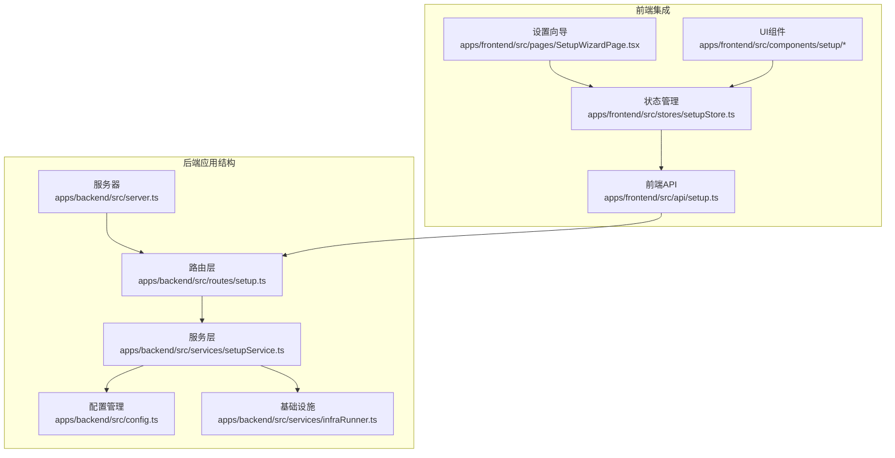
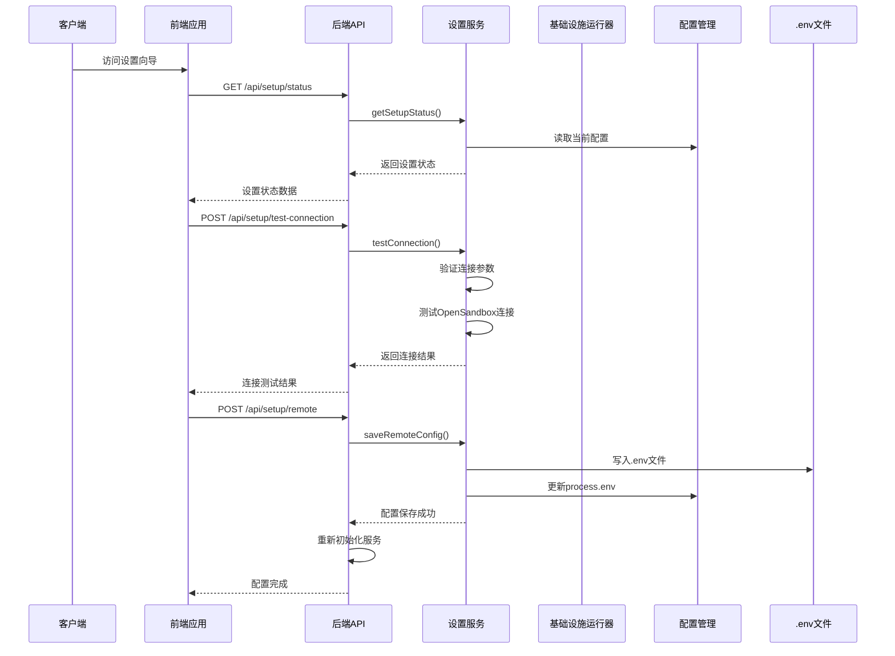
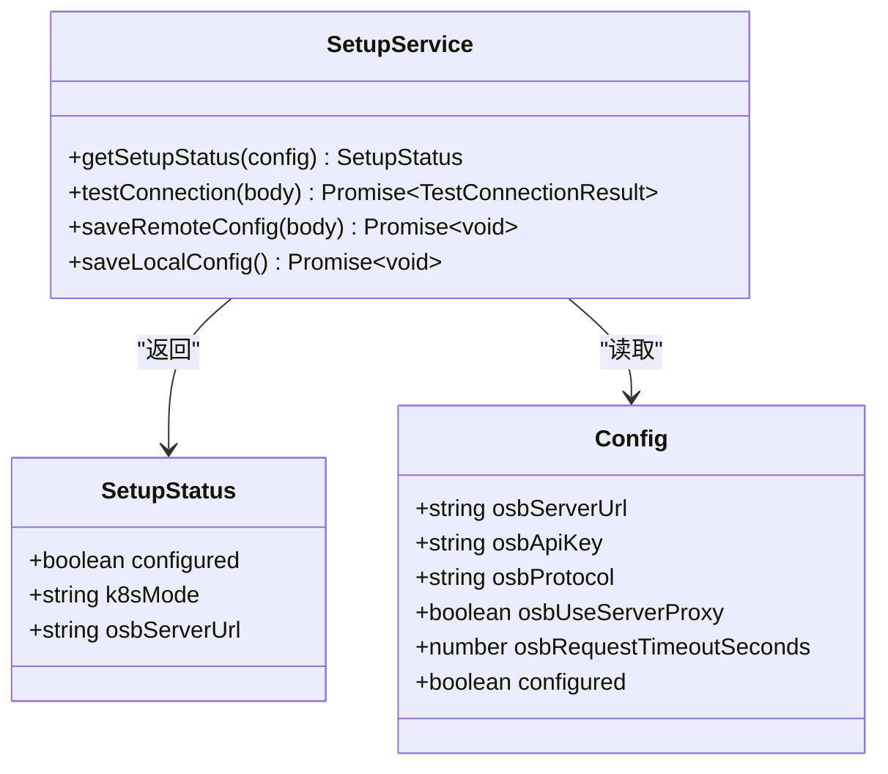
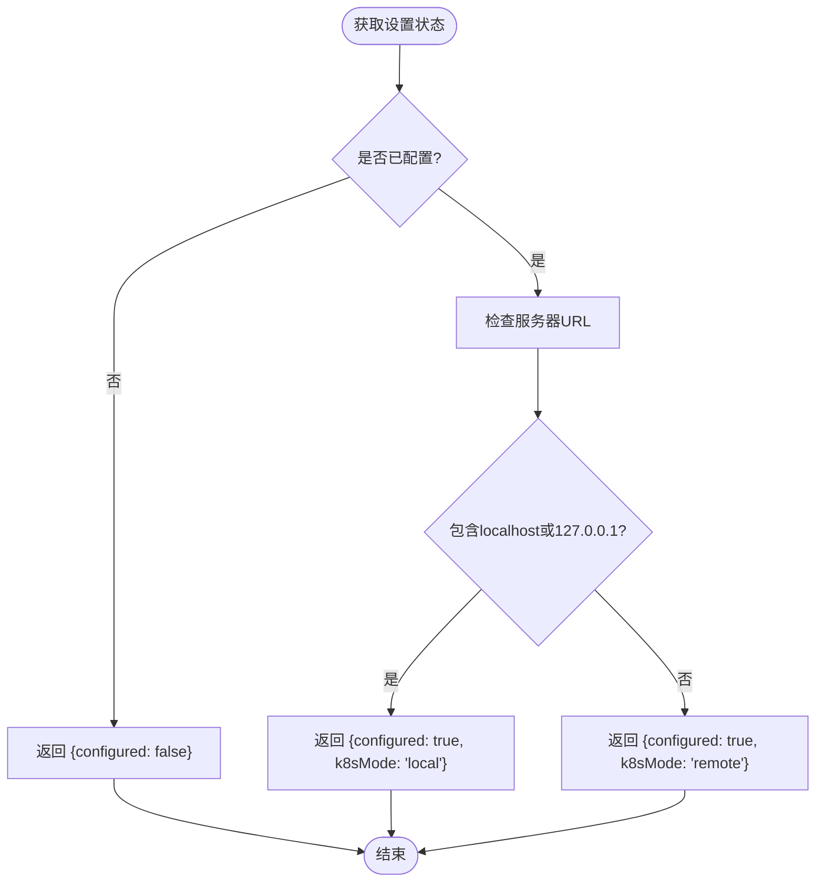
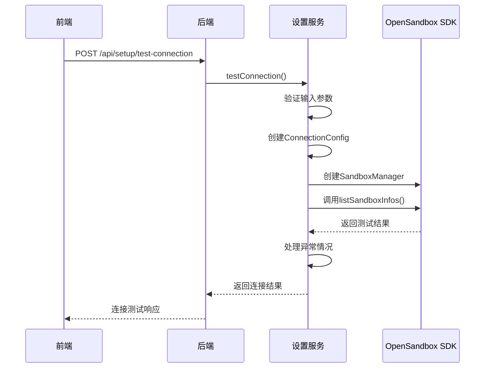
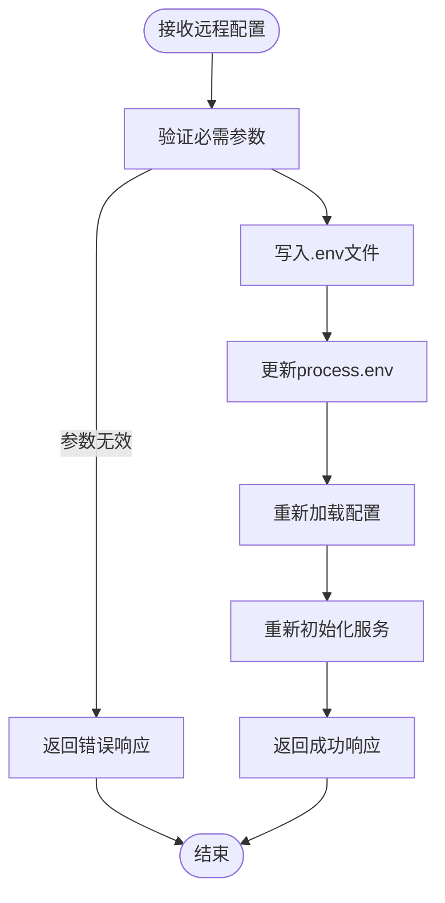
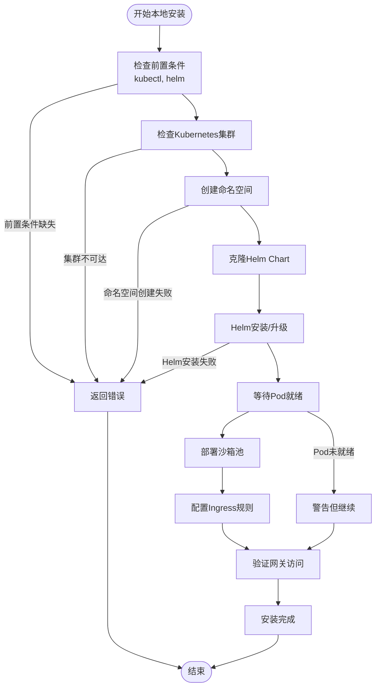
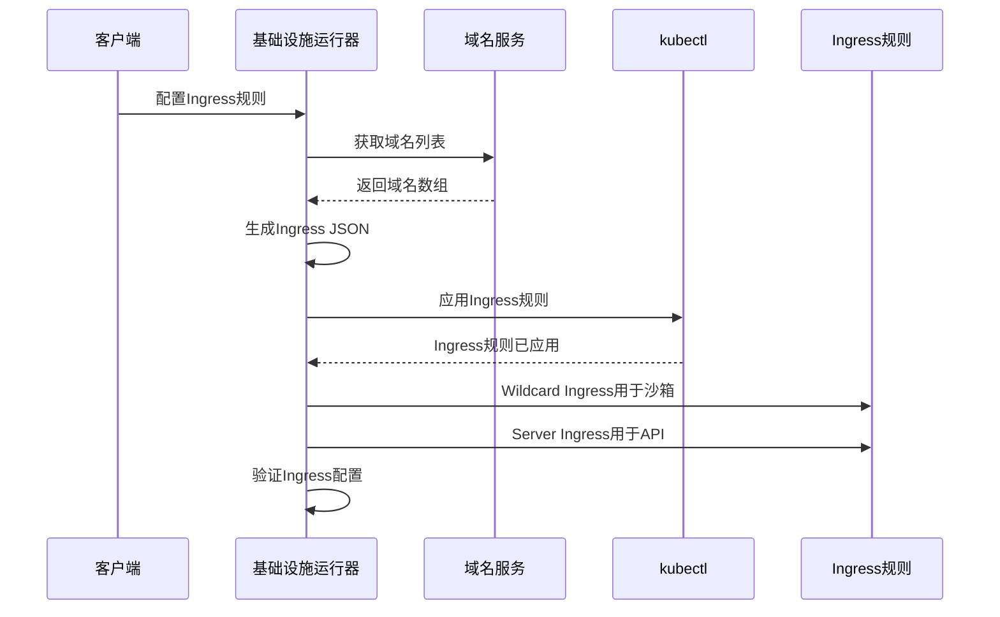
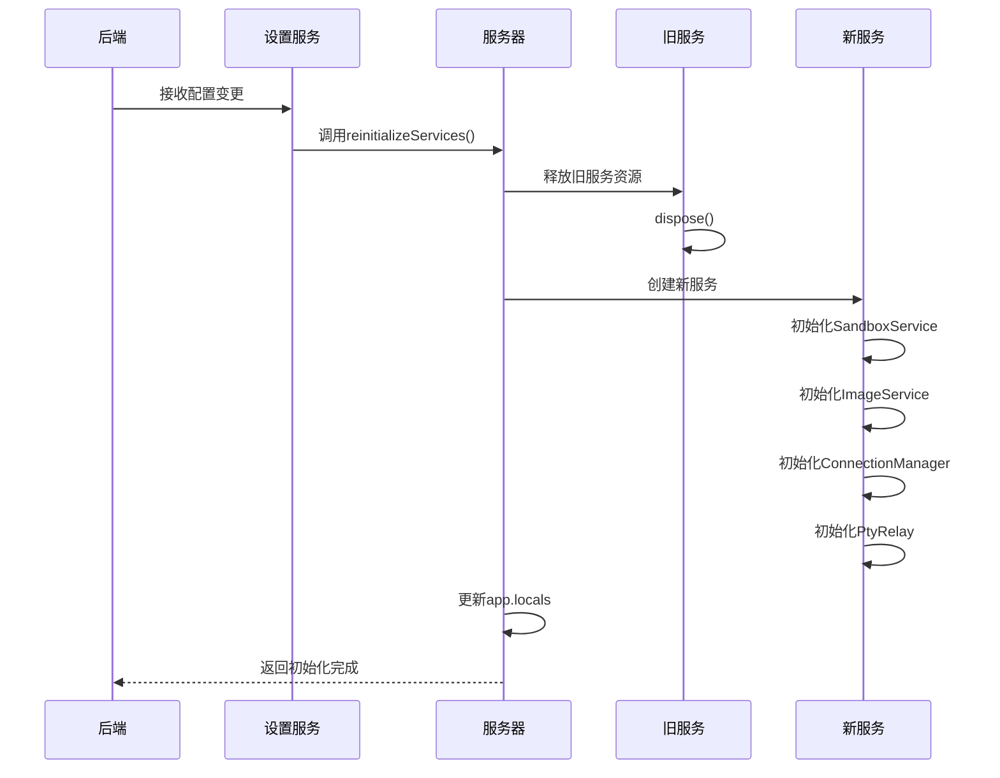
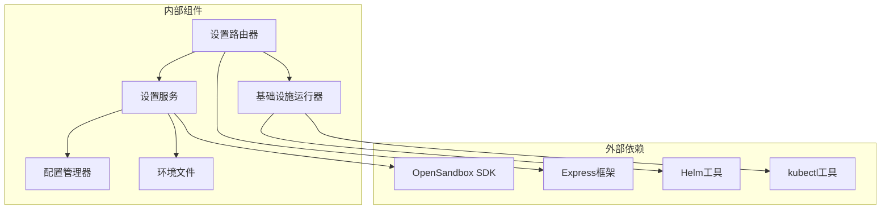

# 系统设置API

<cite>
**本文档引用的文件**
- [apps/backend/src/routes/setup.ts](file://apps/backend/src/routes/setup.ts)
- [apps/backend/src/services/setupService.ts](file://apps/backend/src/services/setupService.ts)
- [apps/backend/src/config.ts](file://apps/backend/src/config.ts)
- [apps/backend/src/services/infraRunner.ts](file://apps/backend/src/services/infraRunner.ts)
- [apps/backend/src/server.ts](file://apps/backend/src/server.ts)
- [apps/frontend/src/api/setup.ts](file://apps/frontend/src/api/setup.ts)
- [apps/frontend/src/api/types.ts](file://apps/frontend/src/api/types.ts)
- [apps/frontend/src/stores/setupStore.ts](file://apps/frontend/src/stores/setupStore.ts)
- [apps/frontend/src/pages/SetupWizardPage.tsx](file://apps/frontend/src/pages/SetupWizardPage.tsx)
- [apps/frontend/src/components/setup/K8sModeCard.tsx](file://apps/frontend/src/components/setup/K8sModeCard.tsx)
- [apps/frontend/src/components/setup/ProgressTimeline.tsx](file://apps/frontend/src/components/setup/ProgressTimeline.tsx)
- [apps/frontend/src/components/setup/RemoteConnectionForm.tsx](file://apps/frontend/src/components/setup/RemoteConnectionForm.tsx)
- [apps/backend/src/types/index.ts](file://apps/backend/src/types/index.ts)
- [infra/helm/sandbox-platform/values.yaml](file://infra/helm/sandbox-platform/values.yaml)
- [infra/opensandbox/values-dev.yaml](file://infra/opensandbox/values-dev.yaml)
- [README.md](file://README.md)
</cite>

## 更新摘要
**变更内容**
- 移除了本地Kubernetes端口转发系统的相关文档
- 更新了基础设施初始化流程的描述
- 简化了本地安装过程的说明
- 更新了配置管理和部署模式的相关内容

## 目录
1. [简介](#简介)
2. [项目结构](#项目结构)
3. [核心组件](#核心组件)
4. [架构概览](#架构概览)
5. [详细组件分析](#详细组件分析)
6. [依赖关系分析](#依赖关系分析)
7. [性能考虑](#性能考虑)
8. [故障排除指南](#故障排除指南)
9. [结论](#结论)

## 简介

系统设置API是OpenSandbox沙箱管理平台的核心配置接口，负责管理OpenSandbox连接配置、环境变量管理和部署模式设置。该API提供了完整的设置向导功能，支持本地Kubernetes集群和远程OpenSandbox实例两种部署模式。

系统设置API主要包含以下功能：
- 获取当前设置状态
- 更新OpenSandbox连接配置
- 测试OpenSandbox连接
- 本地Kubernetes集群一键安装
- 设置变更后的服务重新初始化

## 项目结构

系统设置API位于后端Express应用中，采用模块化设计，主要文件组织如下：

**图表来源**
- [apps/backend/src/routes/setup.ts:1-151](file://apps/backend/src/routes/setup.ts#L1-L151)
- [apps/backend/src/services/setupService.ts:1-152](file://apps/backend/src/services/setupService.ts#L1-L152)
- [apps/frontend/src/api/setup.ts:1-73](file://apps/frontend/src/api/setup.ts#L1-L73)

**章节来源**
- [apps/backend/src/routes/setup.ts:1-151](file://apps/backend/src/routes/setup.ts#L1-L151)
- [apps/backend/src/services/setupService.ts:1-152](file://apps/backend/src/services/setupService.ts#L1-L152)
- [apps/frontend/src/api/setup.ts:1-73](file://apps/frontend/src/api/setup.ts#L1-L73)

## 核心组件

系统设置API由多个核心组件构成，每个组件都有明确的职责分工：

### 路由层组件
- **setupRouter**: 主要的设置API路由处理器
- **错误处理**: 统一的错误响应格式
- **并发控制**: 防止同时进行多个设置操作

### 服务层组件
- **SetupService**: 核心业务逻辑处理
- **InfraRunner**: 本地Kubernetes基础设施安装
- **配置持久化**: .env文件写入和环境变量管理

### 前端集成组件
- **API客户端**: 类型安全的HTTP请求封装
- **状态管理**: Zustand状态存储
- **设置向导**: 用户界面组件

**章节来源**
- [apps/backend/src/routes/setup.ts:17-151](file://apps/backend/src/routes/setup.ts#L17-L151)
- [apps/backend/src/services/setupService.ts:58-152](file://apps/backend/src/services/setupService.ts#L58-L152)
- [apps/frontend/src/stores/setupStore.ts:41-157](file://apps/frontend/src/stores/setupStore.ts#L41-L157)

## 架构概览

系统设置API采用分层架构设计，确保了良好的关注点分离和可维护性：

**图表来源**
- [apps/backend/src/routes/setup.ts:18-73](file://apps/backend/src/routes/setup.ts#L18-L73)
- [apps/backend/src/services/setupService.ts:85-124](file://apps/backend/src/services/setupService.ts#L85-L124)
- [apps/backend/src/server.ts:96-118](file://apps/backend/src/server.ts#L96-L118)

## 详细组件分析

### 设置状态管理

设置状态管理是系统的核心功能之一，负责跟踪OpenSandbox的配置状态和部署模式。

#### 设置状态数据结构

**图表来源**
- [apps/backend/src/services/setupService.ts:6-80](file://apps/backend/src/services/setupService.ts#L6-L80)
- [apps/backend/src/config.ts:3-23](file://apps/backend/src/config.ts#L3-L23)

#### 设置状态判断逻辑

设置状态的判断基于OpenSandbox服务器URL的主机名：

**图表来源**
- [apps/backend/src/services/setupService.ts:71-80](file://apps/backend/src/services/setupService.ts#L71-L80)

**章节来源**
- [apps/backend/src/services/setupService.ts:68-80](file://apps/backend/src/services/setupService.ts#L68-L80)
- [apps/backend/src/config.ts:48-70](file://apps/backend/src/config.ts#L48-L70)

### 连接测试功能

连接测试功能允许用户验证OpenSandbox实例的连通性和认证信息的有效性。

#### 连接测试流程

**图表来源**
- [apps/backend/src/routes/setup.ts:25-43](file://apps/backend/src/routes/setup.ts#L25-L43)
- [apps/backend/src/services/setupService.ts:85-103](file://apps/backend/src/services/setupService.ts#L85-L103)

#### 连接测试参数验证

连接测试对输入参数有严格的验证规则：

| 参数 | 必需性 | 验证规则 | 默认值 |
|------|--------|----------|--------|
| serverUrl | 必需 | 非空字符串 | 无 |
| apiKey | 可选 | 字符串或空 | 空字符串 |
| protocol | 可选 | "http" \| "https" | "http" |

**章节来源**
- [apps/backend/src/routes/setup.ts:30-42](file://apps/backend/src/routes/setup.ts#L30-L42)
- [apps/backend/src/services/setupService.ts:12-16](file://apps/backend/src/services/setupService.ts#L12-L16)

### 远程配置管理

远程配置管理功能允许用户连接到现有的OpenSandbox实例。

#### 配置保存流程

**图表来源**
- [apps/backend/src/routes/setup.ts:45-73](file://apps/backend/src/routes/setup.ts#L45-L73)
- [apps/backend/src/services/setupService.ts:108-124](file://apps/backend/src/services/setupService.ts#L108-L124)

#### .env文件写入机制

SetupService实现了智能的.env文件写入机制：

1. **读取现有文件**: 如果.env文件存在，读取所有行
2. **更新现有键**: 匹配现有键并更新对应的值
3. **追加新键**: 将未匹配的新键追加到文件末尾
4. **保留注释**: 保持原有的注释和空行

**章节来源**
- [apps/backend/src/services/setupService.ts:27-56](file://apps/backend/src/services/setupService.ts#L27-L56)
- [apps/backend/src/services/setupService.ts:108-124](file://apps/backend/src/services/setupService.ts#L108-L124)

### 本地Kubernetes安装

**更新** 本地Kubernetes安装功能经过重大简化，移除了复杂的端口转发系统，采用了更直接的Ingress和域名解析方式。

#### 简化的安装步骤流程

**图表来源**
- [apps/backend/src/services/infraRunner.ts:155-188](file://apps/backend/src/services/infraRunner.ts#L155-L188)

#### Ingress配置机制

本地安装过程中使用了动态生成的Ingress规则：

**图表来源**
- [apps/backend/src/services/infraRunner.ts:22-87](file://apps/backend/src/services/infraRunner.ts#L22-L87)

#### 端口转发系统的移除

**重要更新** 本地Kubernetes端口转发系统已被完全移除，取而代之的是：

1. **直接Ingress访问**: 通过Nginx Ingress直接访问OpenSandbox服务
2. **域名解析**: 使用自定义域名和DNS配置
3. **简化配置**: 不再需要手动端口转发命令
4. **自动化验证**: 自动检查Ingress规则是否正确应用

**章节来源**
- [apps/backend/src/services/infraRunner.ts:190-542](file://apps/backend/src/services/infraRunner.ts#L190-L542)

### 服务重新初始化

设置变更后，系统需要重新初始化相关服务以应用新的配置。

#### 重新初始化流程

**图表来源**
- [apps/backend/src/server.ts:96-118](file://apps/backend/src/server.ts#L96-L118)

**章节来源**
- [apps/backend/src/server.ts:96-118](file://apps/backend/src/server.ts#L96-L118)

## 依赖关系分析

系统设置API的依赖关系清晰明确，遵循了依赖倒置原则：

**图表来源**
- [apps/backend/src/routes/setup.ts:1-6](file://apps/backend/src/routes/setup.ts#L1-L6)
- [apps/backend/src/services/setupService.ts:1-4](file://apps/backend/src/services/setupService.ts#L1-L4)

### 关键依赖特性

| 组件 | 依赖关系 | 作用 |
|------|----------|------|
| SetupRouter | Express Router | HTTP请求处理 |
| SetupService | OpenSandbox SDK | OpenSandbox连接管理 |
| InfraRunner | Helm, kubectl | 本地Kubernetes安装 |
| ConfigManager | process.env | 环境变量管理 |
| EnvFile | 文件系统 | 配置持久化 |

**章节来源**
- [apps/backend/src/routes/setup.ts:1-6](file://apps/backend/src/routes/setup.ts#L1-L6)
- [apps/backend/src/services/setupService.ts:1-4](file://apps/backend/src/services/setupService.ts#L1-L4)

## 性能考虑

系统设置API在设计时充分考虑了性能优化：

### 并发控制
- 使用`setupInProgress`标志防止同时进行多个设置操作
- 支持客户端断开连接时的优雅停止机制

### 连接优化
- OpenSandbox连接超时设置为10秒，避免长时间阻塞
- 端口转发进程具有自动重启机制，提高稳定性

### 资源管理
- 旧服务在重新初始化前正确释放资源
- 端口转发进程在断开连接时及时清理

## 故障排除指南

### 常见问题及解决方案

#### 连接测试失败
**症状**: 连接测试返回失败
**可能原因**:
- OpenSandbox服务器URL配置错误
- API密钥无效或过期
- 网络连接问题
- 服务器防火墙阻止

**解决步骤**:
1. 验证OpenSandbox服务器URL可达性
2. 检查API密钥格式和权限
3. 确认网络连接正常
4. 检查服务器防火墙设置

#### 本地安装失败
**症状**: 本地Kubernetes安装过程中断
**可能原因**:
- kubectl未正确安装或配置
- Helm未正确安装
- Kubernetes集群不可达
- 网络连接问题

**解决步骤**:
1. 确认kubectl版本和配置
2. 检查Helm安装状态
3. 验证Kubernetes集群状态
4. 检查网络连接和代理设置

#### Ingress配置问题
**症状**: 本地安装完成后无法访问OpenSandbox服务
**可能原因**:
- Ingress规则未正确应用
- DNS解析问题
- 域名配置错误
- Nginx Ingress控制器未正确安装

**解决步骤**:
1. 检查Ingress规则状态: `kubectl get ingress -n opensandbox-system`
2. 验证DNS配置和解析
3. 确认Nginx Ingress控制器运行正常
4. 检查Ingress控制器日志

#### 服务重新初始化失败
**症状**: 设置变更后服务无法正常工作
**可能原因**:
- 配置文件写入失败
- 环境变量更新异常
- 旧服务资源释放失败

**解决步骤**:
1. 检查.env文件写入权限
2. 验证环境变量更新
3. 查看服务日志获取详细错误信息

### 调试建议

1. **启用详细日志**: 设置`LOG_LEVEL=debug`获取更详细的调试信息
2. **检查网络连接**: 使用`curl`或`wget`测试OpenSandbox服务器连通性
3. **验证配置文件**: 检查`.env`文件中的配置项是否正确
4. **查看系统资源**: 监控CPU、内存和磁盘使用情况
5. **检查Ingress状态**: 使用`kubectl describe ingress`查看Ingress详细状态

**章节来源**
- [apps/backend/src/services/setupService.ts:98-102](file://apps/backend/src/services/setupService.ts#L98-L102)
- [apps/backend/src/services/infraRunner.ts:200-225](file://apps/backend/src/services/infraRunner.ts#L200-L225)

## 结论

系统设置API为OpenSandbox沙箱管理平台提供了完整而强大的配置管理功能。通过模块化的架构设计和完善的错误处理机制，该API能够满足从简单到复杂的各种部署场景需求。

### 主要优势

1. **多部署模式支持**: 同时支持本地Kubernetes和远程OpenSandbox实例
2. **简化的本地安装**: 移除了复杂的端口转发系统，采用更直接的Ingress方式
3. **完整的设置向导**: 提供直观的用户界面和流畅的操作体验
4. **健壮的错误处理**: 全面的错误检测和用户友好的错误提示
5. **灵活的配置管理**: 支持动态配置变更和热重载

### 最佳实践建议

1. **配置验证**: 在提交任何配置变更前先进行连接测试
2. **备份策略**: 在生产环境中进行重大配置变更前做好备份
3. **监控告警**: 建立完善的监控和告警机制
4. **文档维护**: 及时更新部署文档和配置说明
5. **Ingress检查**: 定期检查Ingress规则和域名解析状态

该API的设计充分体现了现代Web应用的最佳实践，为用户提供了可靠、易用且功能丰富的配置管理体验。