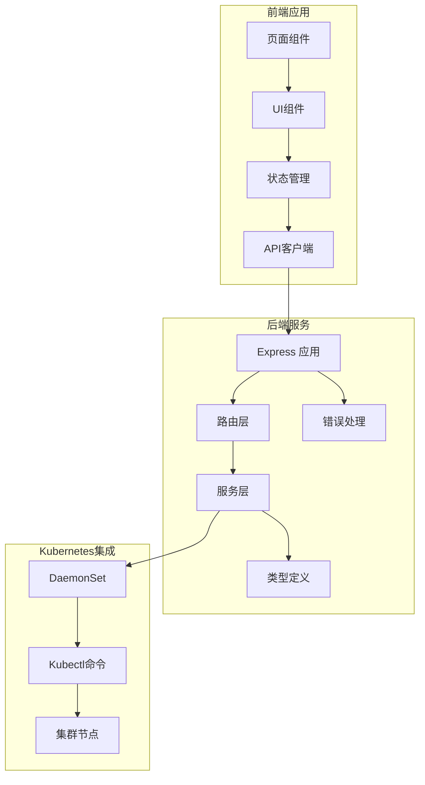
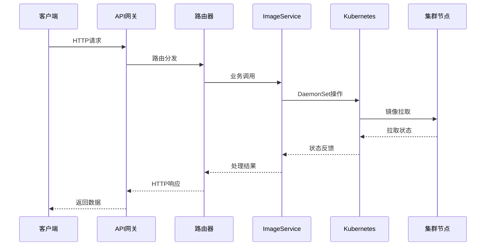
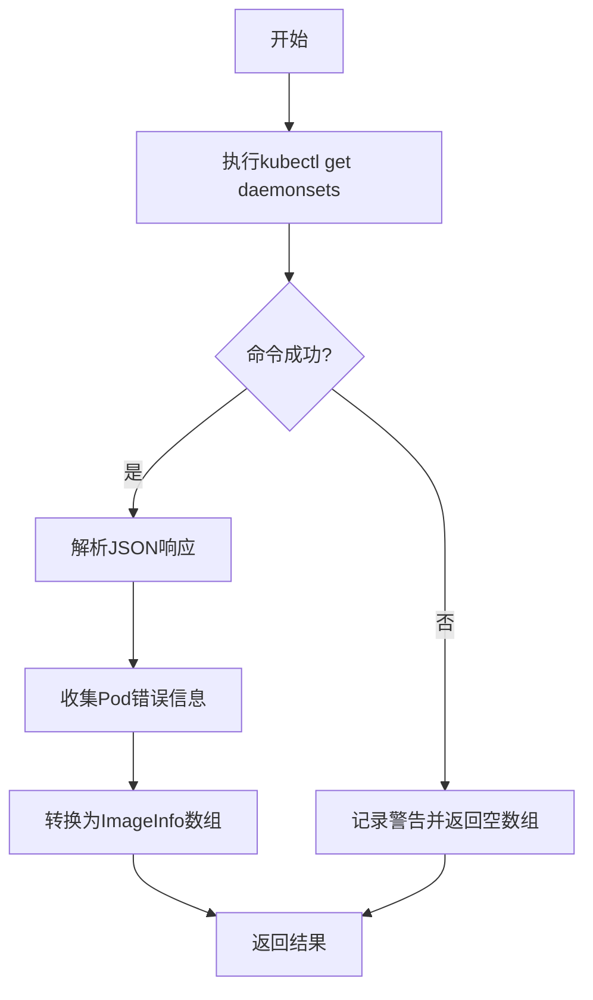
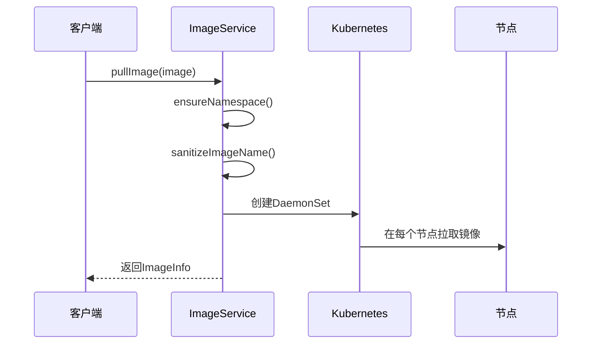
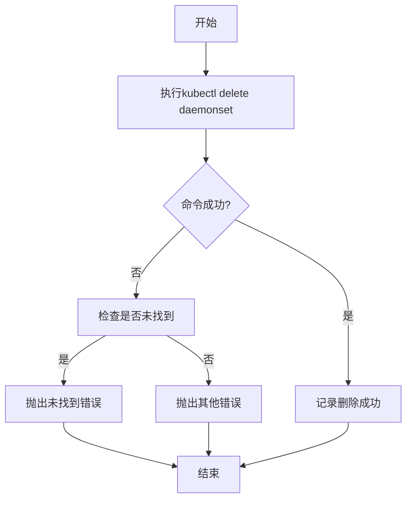
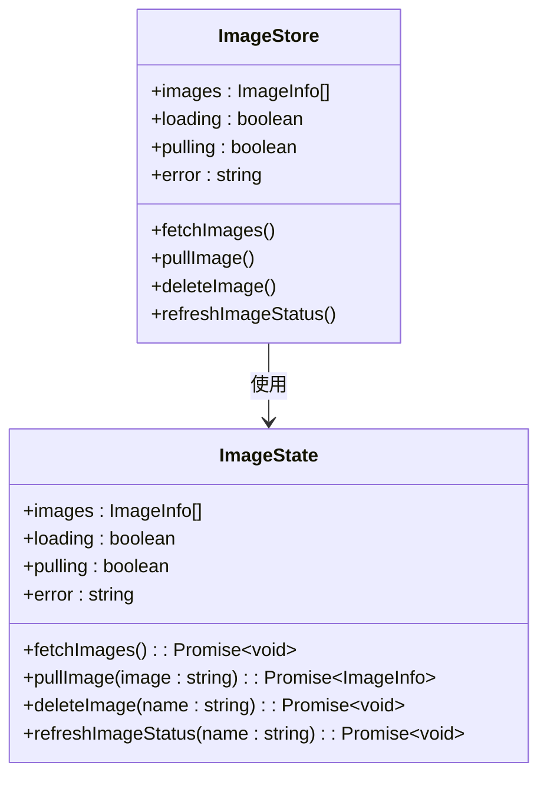
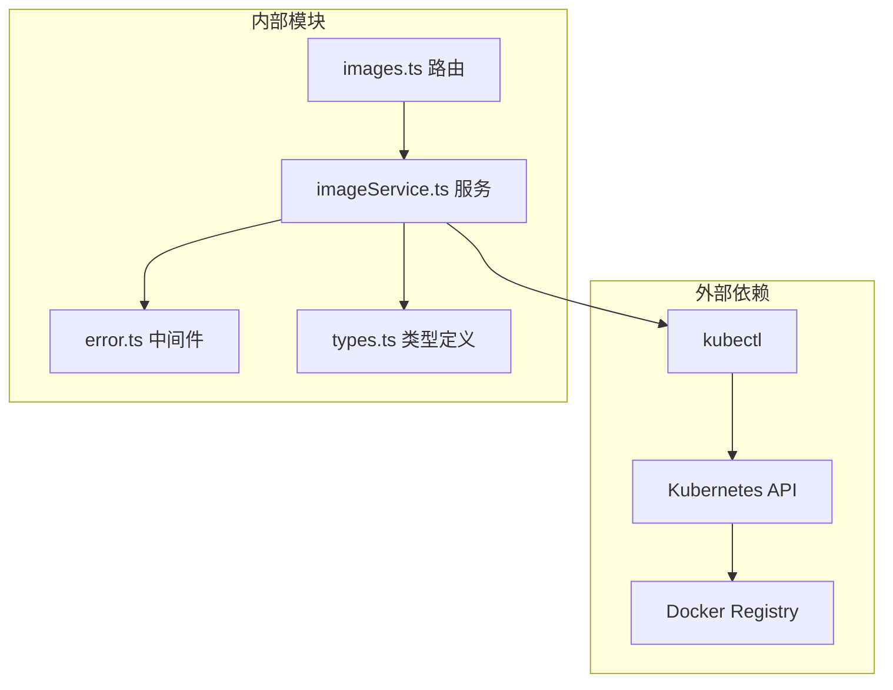
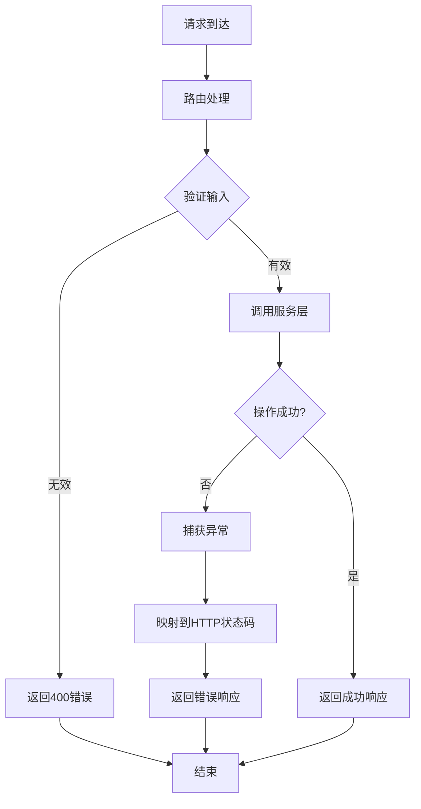

# 镜像管理API

<cite>
**本文档引用的文件**
- [apps/backend/src/routes/images.ts](file://apps/backend/src/routes/images.ts)
- [apps/backend/src/services/imageService.ts](file://apps/backend/src/services/imageService.ts)
- [apps/backend/src/types/index.ts](file://apps/backend/src/types/index.ts)
- [apps/backend/src/middleware/error.ts](file://apps/backend/src/middleware/error.ts)
- [apps/backend/src/server.ts](file://apps/backend/src/server.ts)
- [apps/frontend/src/api/images.ts](file://apps/frontend/src/api/images.ts)
- [apps/frontend/src/api/types.ts](file://apps/frontend/src/api/types.ts)
- [apps/frontend/src/stores/imageStore.ts](file://apps/frontend/src/stores/imageStore.ts)
- [apps/frontend/src/components/images/ImageList.tsx](file://apps/frontend/src/components/images/ImageList.tsx)
- [apps/frontend/src/components/images/PullImageModal.tsx](file://apps/frontend/src/components/images/PullImageModal.tsx)
- [apps/frontend/src/pages/ImagesPage.tsx](file://apps/frontend/src/pages/ImagesPage.tsx)
</cite>

## 目录
1. [简介](#简介)
2. [项目结构](#项目结构)
3. [核心组件](#核心组件)
4. [架构概览](#架构概览)
5. [详细组件分析](#详细组件分析)
6. [依赖关系分析](#依赖关系分析)
7. [性能考虑](#性能考虑)
8. [故障排除指南](#故障排除指南)
9. [结论](#结论)
10. [附录](#附录)

## 简介

镜像管理API是Sandbox Manager平台的核心功能之一，负责管理Kubernetes集群中的Docker镜像预缓存。该API允许用户列出已预缓存的镜像、拉取新镜像到所有集群节点、删除预缓存的镜像以及查看镜像的缓存状态。

该系统基于OpenSandbox技术栈，通过DaemonSet机制在所有集群节点上预缓存Docker镜像，从而确保沙箱创建时的快速启动。API设计遵循RESTful原则，提供清晰的HTTP端点和标准化的响应格式。

## 项目结构

镜像管理功能分布在前后端两个主要部分：



**图表来源**
- [apps/backend/src/server.ts:36-90](file://apps/backend/src/server.ts#L36-L90)
- [apps/backend/src/routes/images.ts:1-78](file://apps/backend/src/routes/images.ts#L1-L78)

**章节来源**
- [apps/backend/src/server.ts:1-119](file://apps/backend/src/server.ts#L1-L119)
- [apps/backend/src/routes/images.ts:1-78](file://apps/backend/src/routes/images.ts#L1-L78)

## 核心组件

### 后端服务架构

镜像管理API采用分层架构设计：

1. **路由层**：处理HTTP请求和响应
2. **服务层**：封装业务逻辑和Kubernetes集成
3. **类型系统**：定义数据结构和接口
4. **错误处理**：统一异常处理机制

### 前端集成架构

前端通过API客户端与后端通信，使用Zustand进行状态管理：

1. **API客户端**：封装HTTP请求
2. **状态管理**：管理镜像列表和操作状态
3. **UI组件**：提供用户交互界面

**章节来源**
- [apps/backend/src/services/imageService.ts:95-386](file://apps/backend/src/services/imageService.ts#L95-L386)
- [apps/frontend/src/stores/imageStore.ts:1-60](file://apps/frontend/src/stores/imageStore.ts#L1-L60)

## 架构概览



**图表来源**
- [apps/backend/src/routes/images.ts:25-53](file://apps/backend/src/routes/images.ts#L25-L53)
- [apps/backend/src/services/imageService.ts:227-294](file://apps/backend/src/services/imageService.ts#L227-L294)

## 详细组件分析

### API端点定义

#### 获取镜像列表
- **端点**：`GET /api/images`
- **功能**：返回所有已预缓存的镜像信息
- **响应**：`ApiResponse<ImageInfo[]>`
- **状态码**：200 OK

#### 拉取镜像
- **端点**：`POST /api/images`
- **功能**：在所有集群节点上预缓存指定镜像
- **请求体**：`{ image: string }`
- **响应**：`ApiResponse<ImageInfo>`
- **状态码**：202 Accepted

#### 获取镜像状态
- **端点**：`GET /api/images/:name/status`
- **功能**：查询特定镜像的拉取状态
- **参数**：`:name` (DaemonSet名称)
- **响应**：`ApiResponse<ImageInfo>`
- **状态码**：200 OK

#### 删除镜像
- **端点**：`DELETE /api/images/:name`
- **功能**：删除指定的预缓存镜像
- **参数**：`:name` (DaemonSet名称)
- **响应**：无内容
- **状态码**：204 No Content

#### 获取缓存镜像列表
- **端点**：`GET /api/images/cached`
- **功能**：返回所有节点上的缓存镜像信息
- **响应**：`ApiResponse<CachedImage[]>`
- **状态码**：200 OK

**章节来源**
- [apps/backend/src/routes/images.ts:14-77](file://apps/backend/src/routes/images.ts#L14-L77)
- [apps/backend/src/types/index.ts:67-89](file://apps/backend/src/types/index.ts#L67-L89)

### 数据模型

#### ImageInfo 结构
| 字段 | 类型 | 描述 |
|------|------|------|
| name | string | 显示名称 |
| image | string | 原始镜像名称 |
| status | "pulling" \| "ready" \| "error" | 当前状态 |
| daemonSetName | string | DaemonSet名称 |
| createdAt | string | 创建时间 |
| nodesReady | number | 已准备的节点数 |
| nodesTotal | number | 总节点数 |
| message | string | 状态消息 |

#### CachedImage 结构
| 字段 | 类型 | 描述 |
|------|------|------|
| image | string | 镜像名称 |
| node | string | 节点名称 |
| sizeBytes | number | 镜像大小（字节） |

**章节来源**
- [apps/backend/src/types/index.ts:69-88](file://apps/backend/src/types/index.ts#L69-L88)
- [apps/frontend/src/api/types.ts:100-115](file://apps/frontend/src/api/types.ts#L100-L115)

### 服务实现

#### ImageService 核心方法

##### 列表镜像


**图表来源**
- [apps/backend/src/services/imageService.ts:196-222](file://apps/backend/src/services/imageService.ts#L196-L222)

##### 拉取镜像


**图表来源**
- [apps/backend/src/services/imageService.ts:227-294](file://apps/backend/src/services/imageService.ts#L227-L294)

##### 删除镜像


**图表来源**
- [apps/backend/src/services/imageService.ts:322-339](file://apps/backend/src/services/imageService.ts#L322-L339)

**章节来源**
- [apps/backend/src/services/imageService.ts:95-386](file://apps/backend/src/services/imageService.ts#L95-L386)

### 前端集成

#### 状态管理


**图表来源**
- [apps/frontend/src/stores/imageStore.ts:5-15](file://apps/frontend/src/stores/imageStore.ts#L5-L15)

#### 用户界面
前端提供直观的镜像管理界面，包括：
- 镜像列表展示
- 拉取镜像模态框
- 实时状态更新
- 错误处理提示

**章节来源**
- [apps/frontend/src/components/images/ImageList.tsx:1-51](file://apps/frontend/src/components/images/ImageList.tsx#L1-L51)
- [apps/frontend/src/components/images/PullImageModal.tsx:1-99](file://apps/frontend/src/components/images/PullImageModal.tsx#L1-L99)

## 依赖关系分析



**图表来源**
- [apps/backend/src/server.ts:50-64](file://apps/backend/src/server.ts#L50-L64)
- [apps/backend/src/services/imageService.ts:105-116](file://apps/backend/src/services/imageService.ts#L105-L116)

### 关键依赖关系

1. **Kubernetes集成**：通过kubectl命令与集群交互
2. **DaemonSet管理**：使用DaemonSet确保镜像在所有节点上可用
3. **命名空间管理**：使用专用命名空间隔离镜像管理操作
4. **错误处理**：统一的错误处理机制

**章节来源**
- [apps/backend/src/services/imageService.ts:5-7](file://apps/backend/src/services/imageService.ts#L5-L7)
- [apps/backend/src/middleware/error.ts:1-48](file://apps/backend/src/middleware/error.ts#L1-L48)

## 性能考虑

### 镜像拉取优化

1. **并行拉取**：DaemonSet自动在所有节点上并行拉取镜像
2. **缓存策略**：预缓存避免重复下载
3. **资源限制**：initContainer使用最小资源开销
4. **命名规范**：优化的命名规则确保Kubernetes兼容性

### 状态查询优化

1. **批量查询**：支持一次性获取所有镜像状态
2. **增量更新**：仅更新变化的状态信息
3. **错误聚合**：合并多个节点的错误信息

### 存储管理

1. **镜像大小统计**：通过Kubernetes API获取准确的镜像大小
2. **节点分布**：监控镜像在不同节点上的分布情况
3. **清理机制**：提供删除功能释放存储空间

## 故障排除指南

### 常见错误及解决方案

#### 镜像拉取失败
- **症状**：状态显示为"error"
- **原因**：网络问题、认证失败、镜像不存在
- **解决**：检查镜像名称、网络连接、Docker Registry访问权限

#### DaemonSet创建失败
- **症状**：创建后立即失败
- **原因**：命名空间权限不足、资源配额限制
- **解决**：检查RBAC权限、增加资源配额

#### 状态查询超时
- **症状**：长时间无响应
- **原因**：kubectl命令超时、集群负载过高
- **解决**：增加超时时间、检查集群健康状况

### 错误处理机制



**图表来源**
- [apps/backend/src/middleware/error.ts:33-47](file://apps/backend/src/middleware/error.ts#L33-L47)

**章节来源**
- [apps/backend/src/middleware/error.ts:1-48](file://apps/backend/src/middleware/error.ts#L1-L48)

## 结论

镜像管理API提供了完整、可靠的Docker镜像预缓存解决方案。通过DaemonSet机制，系统能够在所有集群节点上高效地预缓存镜像，显著提升沙箱创建速度。

### 主要优势

1. **高可用性**：DaemonSet确保镜像在所有节点上可用
2. **可观测性**：详细的镜像状态和错误信息
3. **易用性**：简洁的REST API和直观的前端界面
4. **可扩展性**：模块化设计支持功能扩展

### 未来改进方向

1. **进度跟踪**：增强镜像拉取进度的实时反馈
2. **安全扫描**：集成镜像安全扫描功能
3. **合规检查**：添加镜像合规性验证
4. **性能监控**：提供更多性能指标和分析工具

## 附录

### API使用示例

#### 获取镜像列表
```bash
curl -X GET http://localhost:3000/api/images
```

#### 拉取镜像
```bash
curl -X POST http://localhost:3000/api/images \
  -H "Content-Type: application/json" \
  -d '{"image":"nginx:latest"}'
```

#### 删除镜像
```bash
curl -X DELETE http://localhost:3000/api/images/nginx-latest
```

### 配置选项

| 配置项 | 默认值 | 描述 |
|--------|--------|------|
| OPENSANDBOX_SERVER_URL | localhost:8080 | OpenSandbox Server地址 |
| OPENSANDBOX_API_KEY | (空) | API密钥 |
| PORT | 3000 | 服务端口 |
| CORS_ORIGIN | * | CORS允许来源 |