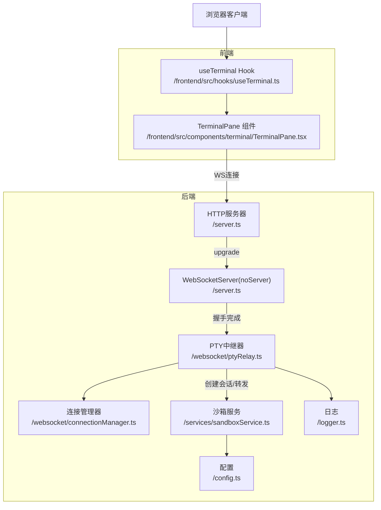
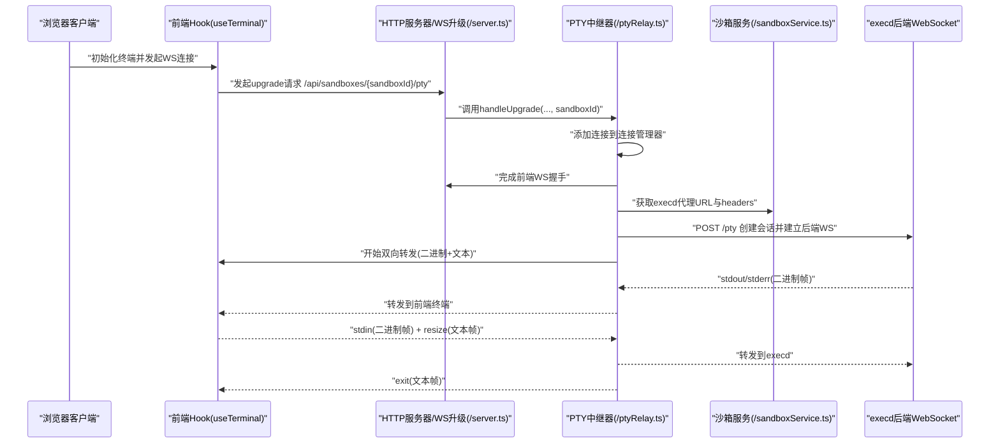
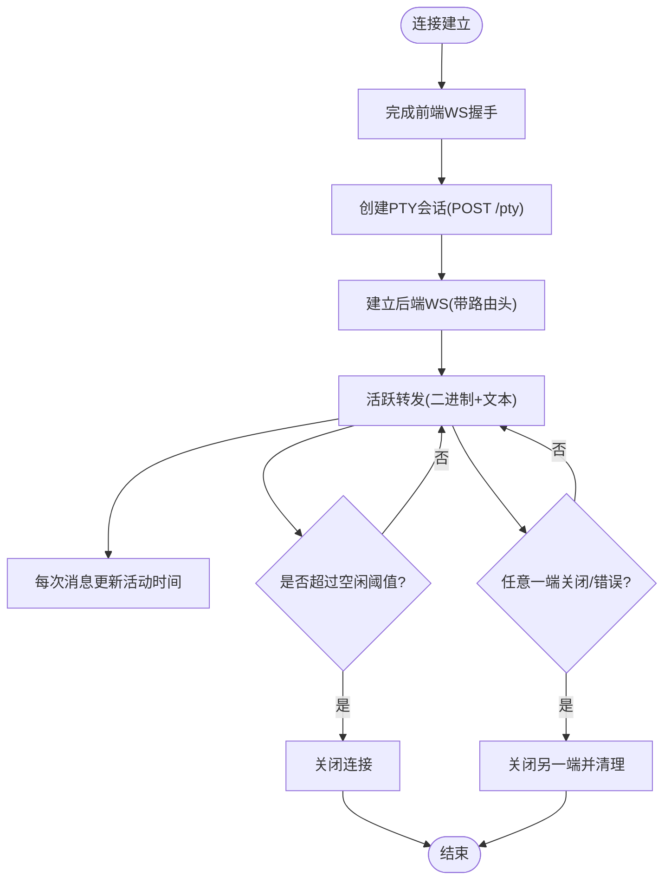
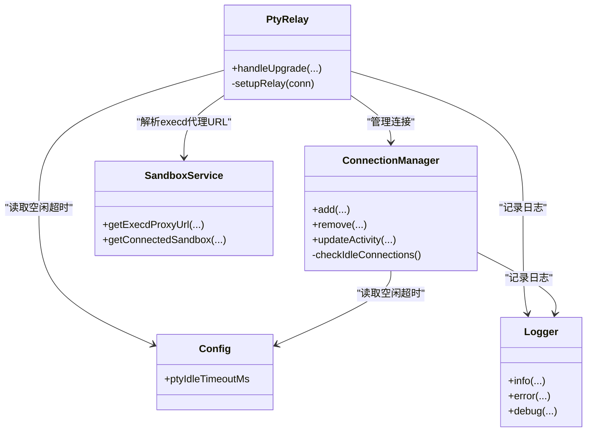

# WebSocket API规范

<cite>
**本文档引用的文件**
- [apps/backend/src/websocket/ptyRelay.ts](file://apps/backend/src/websocket/ptyRelay.ts)
- [apps/backend/src/websocket/connectionManager.ts](file://apps/backend/src/websocket/connectionManager.ts)
- [apps/backend/src/websocket/types.ts](file://apps/backend/src/websocket/types.ts)
- [apps/backend/src/server.ts](file://apps/backend/src/server.ts)
- [apps/backend/src/config.ts](file://apps/backend/src/config.ts)
- [apps/backend/src/services/sandboxService.ts](file://apps/backend/src/services/sandboxService.ts)
- [apps/frontend/src/hooks/useTerminal.ts](file://apps/frontend/src/hooks/useTerminal.ts)
- [apps/frontend/src/components/terminal/TerminalPane.tsx](file://apps/frontend/src/components/terminal/TerminalPane.tsx)
- [apps/backend/src/logger.ts](file://apps/backend/src/logger.ts)
- [apps/backend/package.json](file://apps/backend/package.json)
</cite>

## 目录
1. [简介](#简介)
2. [项目结构](#项目结构)
3. [核心组件](#核心组件)
4. [架构总览](#架构总览)
5. [详细组件分析](#详细组件分析)
6. [依赖关系分析](#依赖关系分析)
7. [性能考虑](#性能考虑)
8. [故障排查指南](#故障排查指南)
9. [结论](#结论)
10. [附录：客户端实现示例与最佳实践](#附录客户端实现示例与最佳实践)

## 简介
本规范定义了Sandbox Manager的WebSocket实时终端通信协议，覆盖以下方面：
- 实时终端连接建立流程（HTTP升级到WebSocket）
- 消息格式与事件类型（二进制帧透传、文本控制消息）
- 连接生命周期管理、自动重连策略与会话状态同步
- 终端数据流、窗口大小调整与字符编码处理
- 客户端实现要点（连接、收发、错误处理）
- 性能优化与连接监控建议

## 项目结构
后端通过Express + ws实现WebSocket服务，前端使用xterm.js + 自定义Hook完成终端渲染与交互。

图表来源
- [apps/backend/src/server.ts:72-87](file://apps/backend/src/server.ts#L72-L87)
- [apps/backend/src/websocket/ptyRelay.ts:40-118](file://apps/backend/src/websocket/ptyRelay.ts#L40-L118)
- [apps/backend/src/websocket/connectionManager.ts:30-46](file://apps/backend/src/websocket/connectionManager.ts#L30-L46)
- [apps/backend/src/services/sandboxService.ts:129-138](file://apps/backend/src/services/sandboxService.ts#L129-L138)
- [apps/frontend/src/hooks/useTerminal.ts:25-95](file://apps/frontend/src/hooks/useTerminal.ts#L25-L95)

章节来源
- [apps/backend/src/server.ts:36-89](file://apps/backend/src/server.ts#L36-L89)
- [apps/frontend/src/hooks/useTerminal.ts:12-179](file://apps/frontend/src/hooks/useTerminal.ts#L12-L179)

## 核心组件
- WebSocket中继器（PtyRelay）：负责HTTP升级、会话创建、双向透明转发、错误与关闭处理。
- 连接管理器（ConnectionManager）：维护连接映射、空闲检测、活动时间更新、清理资源。
- 配置（Config）：暴露PTY空闲超时等运行参数。
- 沙箱服务（SandboxService）：解析execd代理URL，构造后端WebSocket地址。
- 前端Hook（useTerminal）：封装WS连接、二进制帧解析、文本控制消息处理、自动重连与窗口调整。

章节来源
- [apps/backend/src/websocket/ptyRelay.ts:22-38](file://apps/backend/src/websocket/ptyRelay.ts#L22-L38)
- [apps/backend/src/websocket/connectionManager.ts:7-16](file://apps/backend/src/websocket/connectionManager.ts#L7-L16)
- [apps/backend/src/config.ts:3-23](file://apps/backend/src/config.ts#L3-L23)
- [apps/backend/src/services/sandboxService.ts:112-138](file://apps/backend/src/services/sandboxService.ts#L112-L138)
- [apps/frontend/src/hooks/useTerminal.ts:12-179](file://apps/frontend/src/hooks/useTerminal.ts#L12-L179)

## 架构总览
WebSocket路径与数据流如下：

图表来源
- [apps/backend/src/server.ts:75-87](file://apps/backend/src/server.ts#L75-L87)
- [apps/backend/src/websocket/ptyRelay.ts:40-118](file://apps/backend/src/websocket/ptyRelay.ts#L40-L118)
- [apps/backend/src/services/sandboxService.ts:129-138](file://apps/backend/src/services/sandboxService.ts#L129-L138)

## 详细组件分析

### WebSocket二进制帧透传机制
- 类型标识（首字节）：
  - 0x00：标准输入（stdin），客户端→后端
  - 0x01：标准输出（stdout），后端→客户端
  - 0x02：标准错误（stderr），后端→客户端
- 负载格式：UTF-8字符串（stdout/stderr解码显示；stdin按原字节发送）
- 字符编码：统一使用UTF-8，确保多语言字符正确传输
- 透明转发：中继器直接透传二进制帧，不做额外解析或修改

章节来源
- [apps/backend/src/websocket/ptyRelay.ts:15-21](file://apps/backend/src/websocket/ptyRelay.ts#L15-L21)
- [apps/backend/src/websocket/ptyRelay.ts:124-144](file://apps/backend/src/websocket/ptyRelay.ts#L124-L144)
- [apps/frontend/src/hooks/useTerminal.ts:51-76](file://apps/frontend/src/hooks/useTerminal.ts#L51-L76)

### 文本消息协议与控制消息
- resize 控制消息：用于通知后端调整PTY窗口大小
  - 结构：{"type":"resize","cols":N,"rows":N}
  - 触发时机：前端终端尺寸变化时发送
- exit 控制消息：后端通知进程退出
  - 结构：{"type":"exit","code":N}
  - 行为：前端在终端输出退出提示并标记断开

章节来源
- [apps/backend/src/websocket/ptyRelay.ts:20](file://apps/backend/src/websocket/ptyRelay.ts#L20)
- [apps/backend/src/websocket/types.ts:4-9](file://apps/backend/src/websocket/types.ts#L4-L9)
- [apps/frontend/src/hooks/useTerminal.ts:139-144](file://apps/frontend/src/hooks/useTerminal.ts#L139-L144)
- [apps/frontend/src/hooks/useTerminal.ts:64-76](file://apps/frontend/src/hooks/useTerminal.ts#L64-L76)

### 连接生命周期管理
- 建立阶段
  - 升级握手：HTTP upgrade → 完成WS握手 → 记录连接
  - 会话创建：调用execd的/pty接口创建会话，获得sessionId
  - 后端WS：基于execd代理URL与sessionId建立后端WS
- 活动维护
  - 双向转发时更新最后活动时间
  - 空闲检测：超过ptyIdleTimeoutMs未活动则主动关闭
- 关闭与清理
  - 任一侧关闭或出错，触发对侧关闭
  - 清理Map中的连接，停止空闲检查（当无连接）

图表来源
- [apps/backend/src/websocket/ptyRelay.ts:40-118](file://apps/backend/src/websocket/ptyRelay.ts#L40-L118)
- [apps/backend/src/websocket/connectionManager.ts:92-100](file://apps/backend/src/websocket/connectionManager.ts#L92-L100)
- [apps/backend/src/websocket/connectionManager.ts:48-66](file://apps/backend/src/websocket/connectionManager.ts#L48-L66)

章节来源
- [apps/backend/src/websocket/ptyRelay.ts:40-118](file://apps/backend/src/websocket/ptyRelay.ts#L40-L118)
- [apps/backend/src/websocket/connectionManager.ts:18-28](file://apps/backend/src/websocket/connectionManager.ts#L18-L28)
- [apps/backend/src/websocket/connectionManager.ts:80-83](file://apps/backend/src/websocket/connectionManager.ts#L80-L83)
- [apps/backend/src/websocket/connectionManager.ts:92-100](file://apps/backend/src/websocket/connectionManager.ts#L92-L100)

### 自动重连策略与会话状态同步
- 前端重连
  - 指数回退+抖动：delay = min(2^attempt × 1000, 30000) × [0.5, 1.5]
  - 正常关闭（code=1000）不重连
  - 错误时设置错误状态并在UI显示
- 会话状态同步
  - 连接成功后执行一次fit以适配容器尺寸
  - resize事件持续发送{"type":"resize",...}保持后端窗口一致

章节来源
- [apps/frontend/src/hooks/useTerminal.ts:79-95](file://apps/frontend/src/hooks/useTerminal.ts#L79-L95)
- [apps/frontend/src/hooks/useTerminal.ts:8-10](file://apps/frontend/src/hooks/useTerminal.ts#L8-L10)
- [apps/frontend/src/hooks/useTerminal.ts:139-144](file://apps/frontend/src/hooks/useTerminal.ts#L139-L144)
- [apps/frontend/src/hooks/useTerminal.ts:42-46](file://apps/frontend/src/hooks/useTerminal.ts#L42-L46)

### 终端数据流、窗口大小调整与字符编码
- 数据流
  - 输入：前端将用户输入编码为UTF-8，首字节0x00，发送至后端
  - 输出：后端返回0x01/0x02帧，前端解码后写入终端
- 窗口大小
  - 前端监听终端尺寸变化，发送{"type":"resize","cols","rows"}
  - 后端在创建会话时默认发送初始尺寸（如80×24）
- 字符编码
  - 统一采用UTF-8，避免乱码与多语言问题

章节来源
- [apps/backend/src/websocket/ptyRelay.ts:15-21](file://apps/backend/src/websocket/ptyRelay.ts#L15-L21)
- [apps/frontend/src/hooks/useTerminal.ts:127-144](file://apps/frontend/src/hooks/useTerminal.ts#L127-L144)
- [apps/backend/src/websocket/ptyRelay.ts:74-93](file://apps/backend/src/websocket/ptyRelay.ts#L74-L93)

### 事件类型与消息格式一览
- 二进制帧
  - 0x00 + UTF-8：stdin
  - 0x01 + bytes：stdout
  - 0x02 + bytes：stderr
- 文本帧
  - {"type":"resize","cols":N,"rows":N}
  - {"type":"exit","code":N}

章节来源
- [apps/backend/src/websocket/ptyRelay.ts:15-21](file://apps/backend/src/websocket/ptyRelay.ts#L15-L21)
- [apps/backend/src/websocket/types.ts:4-9](file://apps/backend/src/websocket/types.ts#L4-L9)

## 依赖关系分析

图表来源
- [apps/backend/src/websocket/ptyRelay.ts:22-38](file://apps/backend/src/websocket/ptyRelay.ts#L22-L38)
- [apps/backend/src/websocket/connectionManager.ts:7-16](file://apps/backend/src/websocket/connectionManager.ts#L7-L16)
- [apps/backend/src/services/sandboxService.ts:129-138](file://apps/backend/src/services/sandboxService.ts#L129-L138)
- [apps/backend/src/config.ts:21-23](file://apps/backend/src/config.ts#L21-L23)
- [apps/backend/src/logger.ts:3-14](file://apps/backend/src/logger.ts#L3-L14)

章节来源
- [apps/backend/src/websocket/ptyRelay.ts:22-38](file://apps/backend/src/websocket/ptyRelay.ts#L22-L38)
- [apps/backend/src/websocket/connectionManager.ts:7-16](file://apps/backend/src/websocket/connectionManager.ts#L7-L16)
- [apps/backend/src/services/sandboxService.ts:129-138](file://apps/backend/src/services/sandboxService.ts#L129-L138)
- [apps/backend/src/config.ts:21-23](file://apps/backend/src/config.ts#L21-L23)
- [apps/backend/src/logger.ts:3-14](file://apps/backend/src/logger.ts#L3-L14)

## 性能考虑
- 透明转发：中继器仅做透传，避免额外编解码开销
- 日志级别：生产环境建议使用info级别，避免debug高频日志影响性能
- 空闲超时：合理设置ptyIdleTimeoutMs，及时释放闲置连接
- 缓冲区与背压：前端xterm.js具备滚动缓冲与自适应能力，后端无需额外缓存
- 网络路径：后端WS直连execd，减少中间层延迟

章节来源
- [apps/backend/src/websocket/ptyRelay.ts:15-21](file://apps/backend/src/websocket/ptyRelay.ts#L15-L21)
- [apps/backend/src/logger.ts:3-14](file://apps/backend/src/logger.ts#L3-L14)
- [apps/backend/src/config.ts:68](file://apps/backend/src/config.ts#L68)

## 故障排查指南
- 常见错误与处理
  - OpenSandbox未配置：升级失败，返回错误并销毁socket
  - 握手超时：10秒内未完成握手则拒绝
  - 会话创建失败：HTTP非2xx响应，记录状态与正文
  - 任意一端关闭/错误：触发对侧关闭并清理连接
- 日志定位
  - 使用info/error/debug日志辅助定位问题
  - 中继器在消息转发前后记录调试信息
- 连接监控
  - 通过空闲检查与活动时间更新监控连接健康
  - 前端UI显示连接状态、重连中与错误提示

章节来源
- [apps/backend/src/websocket/ptyRelay.ts:49-66](file://apps/backend/src/websocket/ptyRelay.ts#L49-L66)
- [apps/backend/src/websocket/ptyRelay.ts:110-117](file://apps/backend/src/websocket/ptyRelay.ts#L110-L117)
- [apps/backend/src/websocket/ptyRelay.ts:146-166](file://apps/backend/src/websocket/ptyRelay.ts#L146-L166)
- [apps/backend/src/websocket/connectionManager.ts:92-100](file://apps/backend/src/websocket/connectionManager.ts#L92-L100)
- [apps/frontend/src/hooks/useTerminal.ts:17-33](file://apps/frontend/src/hooks/useTerminal.ts#L17-L33)

## 结论
该WebSocket API通过“二进制帧透传 + 文本控制消息”的简洁设计，实现了低延迟、高可靠、可扩展的实时终端体验。前端与后端职责清晰：前端专注渲染与交互，后端专注会话管理与转发。配合指数回退重连、空闲检测与日志监控，可在复杂网络环境下保持稳定运行。

## 附录：客户端实现示例与最佳实践
- 连接建立
  - 使用当前协议（http/https）拼接WS URL
  - 设置binaryType为arraybuffer
  - 连接成功后执行fit以适配容器
- 发送消息
  - stdin：TextEncoder编码后，首字节0x00，发送ArrayBuffer
  - resize：JSON.stringify({"type":"resize","cols","rows"})
- 接收消息
  - 二进制帧：首字节0x01/0x02，解码后写入终端
  - 文本帧：解析{"type":"exit","code":N}，输出提示并断开
- 错误处理
  - onerror设置错误状态
  - onclose根据code决定是否重连（1000除外）
  - 指数回退+抖动，上限不超过30秒
- 最佳实践
  - 在容器尺寸变化时及时发送resize
  - 避免在消息发送前进行不必要的字符串转换
  - 使用xterm的fit与web-links插件提升用户体验

章节来源
- [apps/frontend/src/hooks/useTerminal.ts:25-95](file://apps/frontend/src/hooks/useTerminal.ts#L25-L95)
- [apps/frontend/src/hooks/useTerminal.ts:127-144](file://apps/frontend/src/hooks/useTerminal.ts#L127-L144)
- [apps/frontend/src/hooks/useTerminal.ts:48-77](file://apps/frontend/src/hooks/useTerminal.ts#L48-L77)
- [apps/frontend/src/components/terminal/TerminalPane.tsx:8-37](file://apps/frontend/src/components/terminal/TerminalPane.tsx#L8-L37)