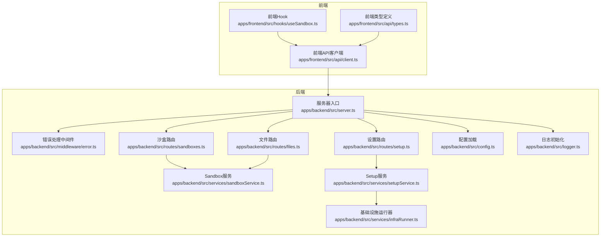
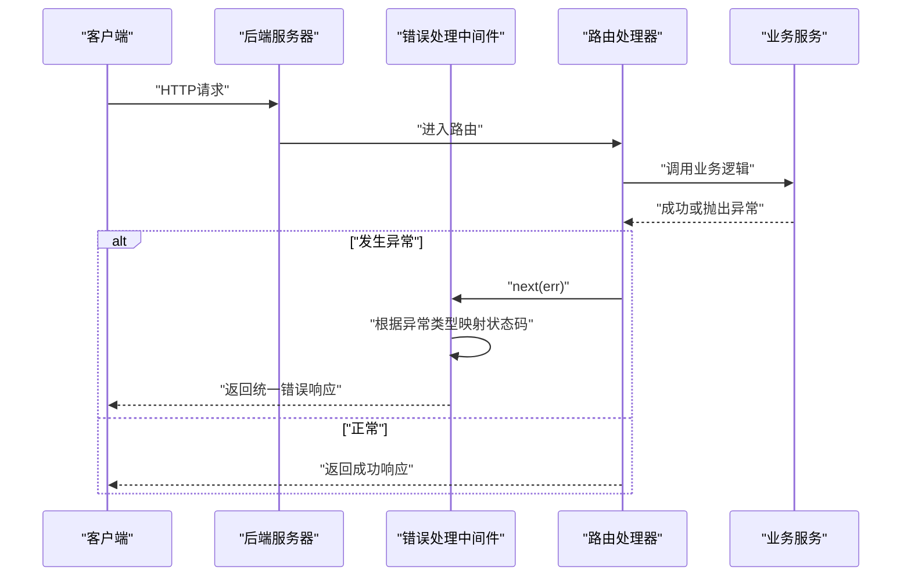
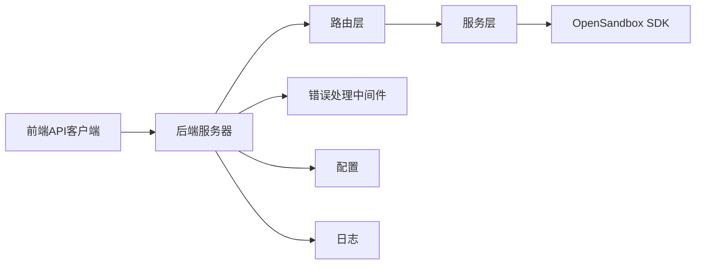

# 错误处理规范

<cite>
**本文引用的文件**
- [apps/backend/src/middleware/error.ts](file://apps/backend/src/middleware/error.ts)
- [apps/backend/src/routes/sandboxes.ts](file://apps/backend/src/routes/sandboxes.ts)
- [apps/backend/src/routes/files.ts](file://apps/backend/src/routes/files.ts)
- [apps/backend/src/routes/setup.ts](file://apps/backend/src/routes/setup.ts)
- [apps/backend/src/services/sandboxService.ts](file://apps/backend/src/services/sandboxService.ts)
- [apps/backend/src/services/setupService.ts](file://apps/backend/src/services/setupService.ts)
- [apps/backend/src/services/infraRunner.ts](file://apps/backend/src/services/infraRunner.ts)
- [apps/backend/src/types/index.ts](file://apps/backend/src/types/index.ts)
- [apps/backend/src/server.ts](file://apps/backend/src/server.ts)
- [apps/backend/src/config.ts](file://apps/backend/src/config.ts)
- [apps/backend/src/logger.ts](file://apps/backend/src/logger.ts)
- [apps/frontend/src/api/client.ts](file://apps/frontend/src/api/client.ts)
- [apps/frontend/src/api/types.ts](file://apps/frontend/src/api/types.ts)
- [apps/frontend/src/hooks/useSandbox.ts](file://apps/frontend/src/hooks/useSandbox.ts)
- [apps/frontend/src/api/files.ts](file://apps/frontend/src/api/files.ts)
- [infra/helm/sandbox-platform/templates/ingress.yaml](file://infra/helm/sandbox-platform/templates/ingress.yaml)
</cite>

## 目录
1. [简介](#简介)
2. [项目结构](#项目结构)
3. [核心组件](#核心组件)
4. [架构总览](#架构总览)
5. [详细组件分析](#详细组件分析)
6. [依赖关系分析](#依赖关系分析)
7. [性能考量](#性能考量)
8. [故障排查指南](#故障排查指南)
9. [结论](#结论)
10. [附录](#附录)

## 简介
本规范面向Sandbox Manager后端与前端，系统化定义错误处理策略与响应格式，覆盖通用错误结构、HTTP状态码映射、错误代码分类、OpenSandbox未配置错误、沙盒操作失败、文件系统错误等具体场景，并提供客户端错误处理最佳实践、用户体验优化建议、错误日志记录与监控告警配置方法，以及恢复策略与重试机制建议。

## 项目结构
后端采用Express + Pino日志 + 自定义中间件统一错误处理；前端通过统一请求封装捕获错误并进行用户提示与自动重试。关键模块包括：
- 中间件：统一错误处理与状态码映射
- 路由层：按功能划分（沙盒、文件、设置、镜像、健康）
- 服务层：业务编排（SandboxService、SetupService、InfraRunner）
- 类型定义：统一响应结构与错误字段
- 配置与日志：环境变量驱动配置与日志级别
- 前端：统一API客户端、类型定义与Hook

图表来源
- [apps/backend/src/server.ts:36-90](file://apps/backend/src/server.ts#L36-L90)
- [apps/backend/src/middleware/error.ts:5-31](file://apps/backend/src/middleware/error.ts#L5-L31)
- [apps/backend/src/routes/sandboxes.ts:9-59](file://apps/backend/src/routes/sandboxes.ts#L9-L59)
- [apps/backend/src/routes/files.ts:8-182](file://apps/backend/src/routes/files.ts#L8-L182)
- [apps/backend/src/routes/setup.ts:1-139](file://apps/backend/src/routes/setup.ts#L1-L139)
- [apps/backend/src/services/sandboxService.ts:11-47](file://apps/backend/src/services/sandboxService.ts#L11-L47)
- [apps/backend/src/services/setupService.ts:58-146](file://apps/backend/src/services/setupService.ts#L58-L146)
- [apps/backend/src/services/infraRunner.ts:26-188](file://apps/backend/src/services/infraRunner.ts#L26-L188)
- [apps/backend/src/config.ts:48-70](file://apps/backend/src/config.ts#L48-L70)
- [apps/backend/src/logger.ts:3-14](file://apps/backend/src/logger.ts#L3-L14)

章节来源
- [apps/backend/src/server.ts:36-90](file://apps/backend/src/server.ts#L36-L90)
- [apps/backend/src/middleware/error.ts:5-31](file://apps/backend/src/middleware/error.ts#L5-L31)
- [apps/backend/src/routes/sandboxes.ts:9-59](file://apps/backend/src/routes/sandboxes.ts#L9-L59)
- [apps/backend/src/routes/files.ts:8-182](file://apps/backend/src/routes/files.ts#L8-L182)
- [apps/backend/src/routes/setup.ts:1-139](file://apps/backend/src/routes/setup.ts#L1-L139)
- [apps/backend/src/services/sandboxService.ts:11-47](file://apps/backend/src/services/sandboxService.ts#L11-L47)
- [apps/backend/src/services/setupService.ts:58-146](file://apps/backend/src/services/setupService.ts#L58-L146)
- [apps/backend/src/services/infraRunner.ts:26-188](file://apps/backend/src/services/infraRunner.ts#L26-L188)
- [apps/backend/src/config.ts:48-70](file://apps/backend/src/config.ts#L48-L70)
- [apps/backend/src/logger.ts:3-14](file://apps/backend/src/logger.ts#L3-L14)

## 核心组件
- 统一错误响应结构
  - 字段：success（布尔）、data（可选）、error（可选对象）
  - error对象：code（字符串，错误代码）、message（字符串）、requestId（可选）
  - 参考路径：[apps/backend/src/types/index.ts:3-11](file://apps/backend/src/types/index.ts#L3-L11)
- 请求ID与日志
  - 后端在中间件中生成并注入x-request-id，错误日志包含该ID便于追踪
  - 参考路径：[apps/backend/src/server.ts:44-48](file://apps/backend/src/server.ts#L44-L48)、[apps/backend/src/middleware/error.ts:11-12](file://apps/backend/src/middleware/error.ts#L11-L12)
- 错误处理中间件
  - 将SDK异常、超时、参数解析失败等映射到标准HTTP状态码
  - 默认返回500内部错误
  - 参考路径：[apps/backend/src/middleware/error.ts:33-47](file://apps/backend/src/middleware/error.ts#L33-L47)
- 前端统一错误类
  - ApiError：封装后端错误code、message与HTTP状态码
  - 参考路径：[apps/frontend/src/api/client.ts:5-14](file://apps/frontend/src/api/client.ts#L5-L14)

章节来源
- [apps/backend/src/types/index.ts:3-11](file://apps/backend/src/types/index.ts#L3-L11)
- [apps/backend/src/server.ts:44-48](file://apps/backend/src/server.ts#L44-L48)
- [apps/backend/src/middleware/error.ts:11-12](file://apps/backend/src/middleware/error.ts#L11-L12)
- [apps/backend/src/middleware/error.ts:33-47](file://apps/backend/src/middleware/error.ts#L33-L47)
- [apps/frontend/src/api/client.ts:5-14](file://apps/frontend/src/api/client.ts#L5-L14)

## 架构总览
后端通过中间件统一拦截异常，结合SDK异常类型与自定义异常映射HTTP状态码；路由层在OpenSandbox未配置时直接返回503；前端通过统一请求封装捕获错误并进行用户提示与自动重试。

图表来源
- [apps/backend/src/server.ts:66-67](file://apps/backend/src/server.ts#L66-L67)
- [apps/backend/src/middleware/error.ts:5-31](file://apps/backend/src/middleware/error.ts#L5-L31)
- [apps/backend/src/routes/sandboxes.ts:96-105](file://apps/backend/src/routes/sandboxes.ts#L96-L105)

章节来源
- [apps/backend/src/server.ts:66-67](file://apps/backend/src/server.ts#L66-L67)
- [apps/backend/src/middleware/error.ts:5-31](file://apps/backend/src/middleware/error.ts#L5-L31)
- [apps/backend/src/routes/sandboxes.ts:96-105](file://apps/backend/src/routes/sandboxes.ts#L96-L105)

## 详细组件分析

### 通用错误结构与HTTP状态码映射
- 统一响应结构
  - 成功：success=true，data包含业务数据
  - 失败：success=false，error包含code、message、requestId
  - 参考路径：[apps/backend/src/types/index.ts:3-11](file://apps/backend/src/types/index.ts#L3-L11)
- HTTP状态码映射规则
  - SDK异常（含statusCode属性）：使用err.statusCode，缺省502
  - SandboxReadyTimeoutException：504
  - InvalidArgumentException：400
  - SandboxException/SandboxInternalException：502
  - Express JSON解析失败：400
  - 其他未识别异常：500
  - 参考路径：[apps/backend/src/middleware/error.ts:33-47](file://apps/backend/src/middleware/error.ts#L33-L47)

章节来源
- [apps/backend/src/types/index.ts:3-11](file://apps/backend/src/types/index.ts#L3-L11)
- [apps/backend/src/middleware/error.ts:33-47](file://apps/backend/src/middleware/error.ts#L33-L47)

### OpenSandbox未配置错误
- 触发条件
  - 后端启动时若未完成配置，sandboxService为null
  - 沙盒相关路由在进入业务逻辑前执行守卫，若未配置直接返回503
  - 参考路径：[apps/backend/src/server.ts:50-51](file://apps/backend/src/server.ts#L50-L51)、[apps/backend/src/routes/sandboxes.ts:34-45](file://apps/backend/src/routes/sandboxes.ts#L34-L45)
- 响应
  - HTTP 503，错误码NOT_CONFIGURED，message提示先完成设置
  - 参考路径：[apps/backend/src/routes/sandboxes.ts:38-41](file://apps/backend/src/routes/sandboxes.ts#L38-L41)

章节来源
- [apps/backend/src/server.ts:50-51](file://apps/backend/src/server.ts#L50-L51)
- [apps/backend/src/routes/sandboxes.ts:34-45](file://apps/backend/src/routes/sandboxes.ts#L34-L45)
- [apps/backend/src/routes/sandboxes.ts:38-41](file://apps/backend/src/routes/sandboxes.ts#L38-L41)

### 沙盒操作失败（创建/查询/删除/暂停/恢复/端点）
- 创建沙盒
  - 成功：202 Accepted，返回标准化后的沙盒信息
  - 异常：交由全局错误中间件映射状态码
  - 参考路径：[apps/backend/src/routes/sandboxes.ts:95-105](file://apps/backend/src/routes/sandboxes.ts#L95-L105)
- 查询沙盒
  - 成功：200 OK，返回标准化后的沙盒信息
  - 异常：交由全局错误中间件映射状态码
  - 参考路径：[apps/backend/src/routes/sandboxes.ts:107-116](file://apps/backend/src/routes/sandboxes.ts#L107-L116)
- 删除/暂停/恢复
  - 成功：删除204 No Content，暂停/恢复200 OK
  - 异常：交由全局错误中间件映射状态码
  - 参考路径：[apps/backend/src/routes/sandboxes.ts:118-149](file://apps/backend/src/routes/sandboxes.ts#L118-L149)
- 获取端点URL
  - 成功：200 OK，返回url、scheme、host、port
  - 异常：交由全局错误中间件映射状态码
  - 参考路径：[apps/backend/src/routes/sandboxes.ts:151-174](file://apps/backend/src/routes/sandboxes.ts#L151-L174)

章节来源
- [apps/backend/src/routes/sandboxes.ts:95-105](file://apps/backend/src/routes/sandboxes.ts#L95-L105)
- [apps/backend/src/routes/sandboxes.ts:107-116](file://apps/backend/src/routes/sandboxes.ts#L107-L116)
- [apps/backend/src/routes/sandboxes.ts:118-149](file://apps/backend/src/routes/sandboxes.ts#L118-L149)
- [apps/backend/src/routes/sandboxes.ts:151-174](file://apps/backend/src/routes/sandboxes.ts#L151-L174)

### 文件系统错误（列表/读取/写入/创建目录/移动/删除）
- 列目录
  - 优先使用搜索接口，失败回退至ls+stat
  - 返回400当路径无效或权限不足（示例：路径不存在但被当作目录处理）
  - 参考路径：[apps/backend/src/routes/files.ts:19-94](file://apps/backend/src/routes/files.ts#L19-L94)
- 读取文件
  - 返回二进制流；400当路径是目录
  - 参考路径：[apps/backend/src/routes/files.ts:83-94](file://apps/backend/src/routes/files.ts#L83-L94)
- 写入文件
  - 必填字段缺失返回400；成功返回200
  - 参考路径：[apps/backend/src/routes/files.ts:96-115](file://apps/backend/src/routes/files.ts#L96-L115)
- 创建目录
  - 必填字段缺失返回400；成功返回200
  - 参考路径：[apps/backend/src/routes/files.ts:117-136](file://apps/backend/src/routes/files.ts#L117-L136)
- 移动/重命名
  - 必填字段缺失返回400；成功返回200
  - 参考路径：[apps/backend/src/routes/files.ts:138-157](file://apps/backend/src/routes/files.ts#L138-L157)
- 删除文件/目录
  - 必填字段缺失返回400；成功返回204
  - 参考路径：[apps/backend/src/routes/files.ts:159-182](file://apps/backend/src/routes/files.ts#L159-L182)

章节来源
- [apps/backend/src/routes/files.ts:19-94](file://apps/backend/src/routes/files.ts#L19-L94)
- [apps/backend/src/routes/files.ts:83-94](file://apps/backend/src/routes/files.ts#L83-L94)
- [apps/backend/src/routes/files.ts:96-115](file://apps/backend/src/routes/files.ts#L96-L115)
- [apps/backend/src/routes/files.ts:117-136](file://apps/backend/src/routes/files.ts#L117-L136)
- [apps/backend/src/routes/files.ts:138-157](file://apps/backend/src/routes/files.ts#L138-L157)
- [apps/backend/src/routes/files.ts:159-182](file://apps/backend/src/routes/files.ts#L159-L182)

### 设置与连接测试（本地K8s安装、远程连接）
- 连接测试
  - 缺少serverUrl返回400，错误码MISSING_FIELD
  - 测试失败返回connected=false与错误信息
  - 参考路径：[apps/backend/src/routes/setup.ts:25-43](file://apps/backend/src/routes/setup.ts#L25-L43)、[apps/backend/src/services/setupService.ts:85-103](file://apps/backend/src/services/setupService.ts#L85-L103)
- 保存远程配置
  - 缺少必填字段返回400，错误码MISSING_FIELD
  - 成功后重新初始化服务，返回configured=true
  - 失败返回500，错误码SETUP_FAILED
  - 参考路径：[apps/backend/src/routes/setup.ts:45-67](file://apps/backend/src/routes/setup.ts#L45-L67)
- 本地K8s安装（SSE）
  - 并发保护：SETUP_IN_PROGRESS（409）
  - 客户端断开：停止端口转发
  - 步骤失败：事件error包含输出
  - 参考路径：[apps/backend/src/routes/setup.ts:69-120](file://apps/backend/src/routes/setup.ts#L69-L120)、[apps/backend/src/services/infraRunner.ts:155-188](file://apps/backend/src/services/infraRunner.ts#L155-L188)

章节来源
- [apps/backend/src/routes/setup.ts:25-43](file://apps/backend/src/routes/setup.ts#L25-L43)
- [apps/backend/src/services/setupService.ts:85-103](file://apps/backend/src/services/setupService.ts#L85-L103)
- [apps/backend/src/routes/setup.ts:45-67](file://apps/backend/src/routes/setup.ts#L45-L67)
- [apps/backend/src/routes/setup.ts:69-120](file://apps/backend/src/routes/setup.ts#L69-L120)
- [apps/backend/src/services/infraRunner.ts:155-188](file://apps/backend/src/services/infraRunner.ts#L155-L188)

### 业务逻辑错误与系统异常分类
- 业务逻辑错误
  - 参数校验失败：400，如缺少必要字段
  - 资源不存在或状态不合法：404或400
  - 权限不足或资源冲突：403或409
  - 示例：文件系统路由对必填字段进行显式校验
  - 参考路径：[apps/backend/src/routes/files.ts:103-106](file://apps/backend/src/routes/files.ts#L103-L106)、[apps/backend/src/routes/files.ts:124-127](file://apps/backend/src/routes/files.ts#L124-L127)
- 系统异常
  - SDK异常：映射为502（或自定义statusCode）
  - 准备超时：504
  - 解析失败：400
  - 其他未识别：500
  - 参考路径：[apps/backend/src/middleware/error.ts:33-47](file://apps/backend/src/middleware/error.ts#L33-L47)

章节来源
- [apps/backend/src/routes/files.ts:103-106](file://apps/backend/src/routes/files.ts#L103-L106)
- [apps/backend/src/routes/files.ts:124-127](file://apps/backend/src/routes/files.ts#L124-L127)
- [apps/backend/src/middleware/error.ts:33-47](file://apps/backend/src/middleware/error.ts#L33-L47)

### 特定场景错误处理
- OpenSandbox未配置
  - 路由守卫直接返回503，错误码NOT_CONFIGURED
  - 参考路径：[apps/backend/src/routes/sandboxes.ts:34-45](file://apps/backend/src/routes/sandboxes.ts#L34-L45)
- 沙盒操作失败
  - 使用SandboxService与Sandbox SDK交互；异常交由中间件映射
  - 参考路径：[apps/backend/src/services/sandboxService.ts:11-47](file://apps/backend/src/services/sandboxService.ts#L11-L47)
- 文件系统错误
  - 列表失败回退；路径判断与权限检查；缺失字段校验
  - 参考路径：[apps/backend/src/routes/files.ts:19-94](file://apps/backend/src/routes/files.ts#L19-L94)
- 设置流程错误
  - 连接测试失败返回错误信息；SSE并发保护与断开清理
  - 参考路径：[apps/backend/src/services/setupService.ts:85-103](file://apps/backend/src/services/setupService.ts#L85-L103)、[apps/backend/src/routes/setup.ts:69-120](file://apps/backend/src/routes/setup.ts#L69-L120)

章节来源
- [apps/backend/src/routes/sandboxes.ts:34-45](file://apps/backend/src/routes/sandboxes.ts#L34-L45)
- [apps/backend/src/services/sandboxService.ts:11-47](file://apps/backend/src/services/sandboxService.ts#L11-L47)
- [apps/backend/src/routes/files.ts:19-94](file://apps/backend/src/routes/files.ts#L19-L94)
- [apps/backend/src/services/setupService.ts:85-103](file://apps/backend/src/services/setupService.ts#L85-L103)
- [apps/backend/src/routes/setup.ts:69-120](file://apps/backend/src/routes/setup.ts#L69-L120)

### 客户端错误处理最佳实践与用户体验优化
- 前端统一错误类
  - ApiError封装后端错误码与消息，便于UI展示与埋点
  - 参考路径：[apps/frontend/src/api/client.ts:5-14](file://apps/frontend/src/api/client.ts#L5-L14)
- 请求封装
  - 对非204响应解析JSON，success=false时抛出ApiError
  - 参考路径：[apps/frontend/src/api/client.ts:36-43](file://apps/frontend/src/api/client.ts#L36-L43)
- Hook与页面级处理
  - useSandbox在加载/刷新时设置loading与error，避免缓存过期导致的误导
  - 参考路径：[apps/frontend/src/hooks/useSandbox.ts:12-39](file://apps/frontend/src/hooks/useSandbox.ts#L12-L39)
- 文件API
  - 单独处理内容读取的文本流与错误
  - 参考路径：[apps/frontend/src/api/files.ts:8-14](file://apps/frontend/src/api/files.ts#L8-L14)

章节来源
- [apps/frontend/src/api/client.ts:5-14](file://apps/frontend/src/api/client.ts#L5-L14)
- [apps/frontend/src/api/client.ts:36-43](file://apps/frontend/src/api/client.ts#L36-L43)
- [apps/frontend/src/hooks/useSandbox.ts:12-39](file://apps/frontend/src/hooks/useSandbox.ts#L12-L39)
- [apps/frontend/src/api/files.ts:8-14](file://apps/frontend/src/api/files.ts#L8-L14)

### 错误恢复策略与重试机制建议
- 重试策略
  - 对瞬时网络波动与5xx错误建议指数退避重试（如1s、2s、4s上限）
  - 对400/401/403等语义错误不建议重试，需提示用户修正
  - 对504网关超时可考虑缩短请求超时并重试
- 前端自动重试
  - useSandbox在沙盒状态为Creating/Pausing/Resuming时每3秒轮询刷新
  - 参考路径：[apps/frontend/src/hooks/useSandbox.ts:42-55](file://apps/frontend/src/hooks/useSandbox.ts#L42-L55)
- 后端幂等性
  - 文件写入、目录创建、移动等操作建议在业务层保证幂等，避免重复写入
- 连接与端口转发
  - InfraRunner对端口转发意外退出进行自动重启
  - 参考路径：[apps/backend/src/services/infraRunner.ts:112-125](file://apps/backend/src/services/infraRunner.ts#L112-L125)

章节来源
- [apps/frontend/src/hooks/useSandbox.ts:42-55](file://apps/frontend/src/hooks/useSandbox.ts#L42-L55)
- [apps/backend/src/services/infraRunner.ts:112-125](file://apps/backend/src/services/infraRunner.ts#L112-L125)

### 错误日志记录与监控告警配置
- 日志级别与格式
  - 支持通过环境变量控制日志级别；开发模式下使用pino-pretty美化输出
  - 参考路径：[apps/backend/src/logger.ts:3-14](file://apps/backend/src/logger.ts#L3-L14)
- 请求与错误日志
  - 中间件记录method、path、requestId、statusCode与错误详情
  - 参考路径：[apps/backend/src/middleware/error.ts:18-21](file://apps/backend/src/middleware/error.ts#L18-L21)
- 配置与部署
  - Helm Values中可配置日志级别与Ingress超时参数
  - 参考路径：[infra/helm/sandbox-platform/templates/ingress.yaml:8-11](file://infra/helm/sandbox-platform/templates/ingress.yaml#L8-L11)
- 告警建议
  - 关键指标：5xx错误率、P95/P99请求延迟、请求ID唯一性核验
  - 告警阈值：5xx错误率>1%持续5分钟；延迟P99>10s持续10分钟

章节来源
- [apps/backend/src/logger.ts:3-14](file://apps/backend/src/logger.ts#L3-L14)
- [apps/backend/src/middleware/error.ts:18-21](file://apps/backend/src/middleware/error.ts#L18-L21)
- [infra/helm/sandbox-platform/templates/ingress.yaml:8-11](file://infra/helm/sandbox-platform/templates/ingress.yaml#L8-L11)

## 依赖关系分析
- 路由依赖服务层，服务层依赖SDK与配置；错误处理中间件位于路由之后，统一兜底
- 前端通过统一客户端与后端约定的响应结构交互，错误类集中于前端

图表来源
- [apps/backend/src/server.ts:36-90](file://apps/backend/src/server.ts#L36-L90)
- [apps/backend/src/middleware/error.ts:5-31](file://apps/backend/src/middleware/error.ts#L5-L31)
- [apps/backend/src/routes/sandboxes.ts:9-59](file://apps/backend/src/routes/sandboxes.ts#L9-L59)
- [apps/backend/src/services/sandboxService.ts:11-47](file://apps/backend/src/services/sandboxService.ts#L11-L47)
- [apps/frontend/src/api/client.ts:16-43](file://apps/frontend/src/api/client.ts#L16-L43)

章节来源
- [apps/backend/src/server.ts:36-90](file://apps/backend/src/server.ts#L36-L90)
- [apps/backend/src/middleware/error.ts:5-31](file://apps/backend/src/middleware/error.ts#L5-L31)
- [apps/backend/src/routes/sandboxes.ts:9-59](file://apps/backend/src/routes/sandboxes.ts#L9-L59)
- [apps/backend/src/services/sandboxService.ts:11-47](file://apps/backend/src/services/sandboxService.ts#L11-L47)
- [apps/frontend/src/api/client.ts:16-43](file://apps/frontend/src/api/client.ts#L16-L43)

## 性能考量
- 超时与重试
  - 合理设置请求超时与重试间隔，避免雪崩效应
- 缓存与连接复用
  - Sandbox实例LRU缓存减少重复连接成本
  - 参考路径：[apps/backend/src/services/sandboxService.ts:35-44](file://apps/backend/src/services/sandboxService.ts#L35-L44)
- 日志开销
  - 生产环境避免过度调试日志；必要时使用采样

章节来源
- [apps/backend/src/services/sandboxService.ts:35-44](file://apps/backend/src/services/sandboxService.ts#L35-L44)

## 故障排查指南
- 常见问题定位步骤
  - 检查请求ID：后端日志包含requestId，前端ApiError携带HTTP状态码
  - 确认OpenSandbox配置：沙盒路由守卫会返回503
  - 文件操作：确认必填字段、路径合法性与权限
- 前端排查
  - 使用useSandbox观察状态轮询与错误提示
  - 参考路径：[apps/frontend/src/hooks/useSandbox.ts:12-39](file://apps/frontend/src/hooks/useSandbox.ts#L12-L39)
- 后端排查
  - 查看中间件日志：method、path、statusCode、err
  - 参考路径：[apps/backend/src/middleware/error.ts:18-21](file://apps/backend/src/middleware/error.ts#L18-L21)

章节来源
- [apps/frontend/src/hooks/useSandbox.ts:12-39](file://apps/frontend/src/hooks/useSandbox.ts#L12-L39)
- [apps/backend/src/middleware/error.ts:18-21](file://apps/backend/src/middleware/error.ts#L18-L21)

## 结论
本规范建立了统一的错误响应结构、明确的HTTP状态码映射与错误代码分类，覆盖了OpenSandbox未配置、沙盒操作、文件系统等关键场景，并提供了客户端错误处理最佳实践、恢复策略与日志监控建议。建议在生产环境中启用合理的超时与重试策略，完善告警阈值，确保用户体验与系统稳定性。

## 附录
- 错误代码清单（示例）
  - NOT_CONFIGURED：OpenSandbox未配置
  - MISSING_FIELD：请求缺少必要字段
  - IS_DIRECTORY：路径是目录而非文件
  - SETUP_IN_PROGRESS：设置流程正在执行
  - SETUP_FAILED：设置流程失败
  - HTTP_400/HTTP_500/HTTP_502/HTTP_504：SDK异常映射
- 前端类型参考
  - ApiErrorResponse、ApiSuccessResponse、Sandbox、FileEntry等
  - 参考路径：[apps/frontend/src/api/types.ts:49-61](file://apps/frontend/src/api/types.ts#L49-L61)、[apps/frontend/src/api/types.ts:1-47](file://apps/frontend/src/api/types.ts#L1-L47)

章节来源
- [apps/frontend/src/api/types.ts:49-61](file://apps/frontend/src/api/types.ts#L49-L61)
- [apps/frontend/src/api/types.ts:1-47](file://apps/frontend/src/api/types.ts#L1-L47)