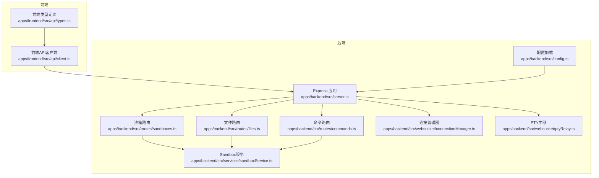
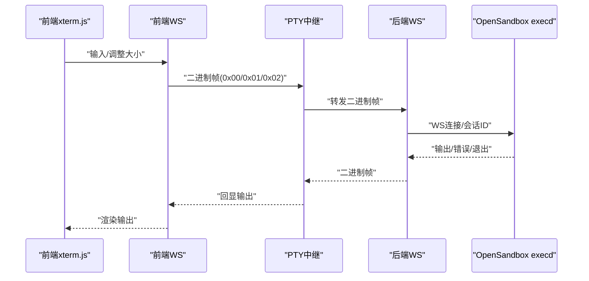
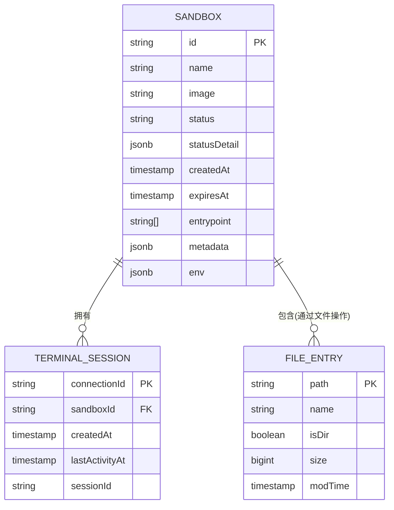
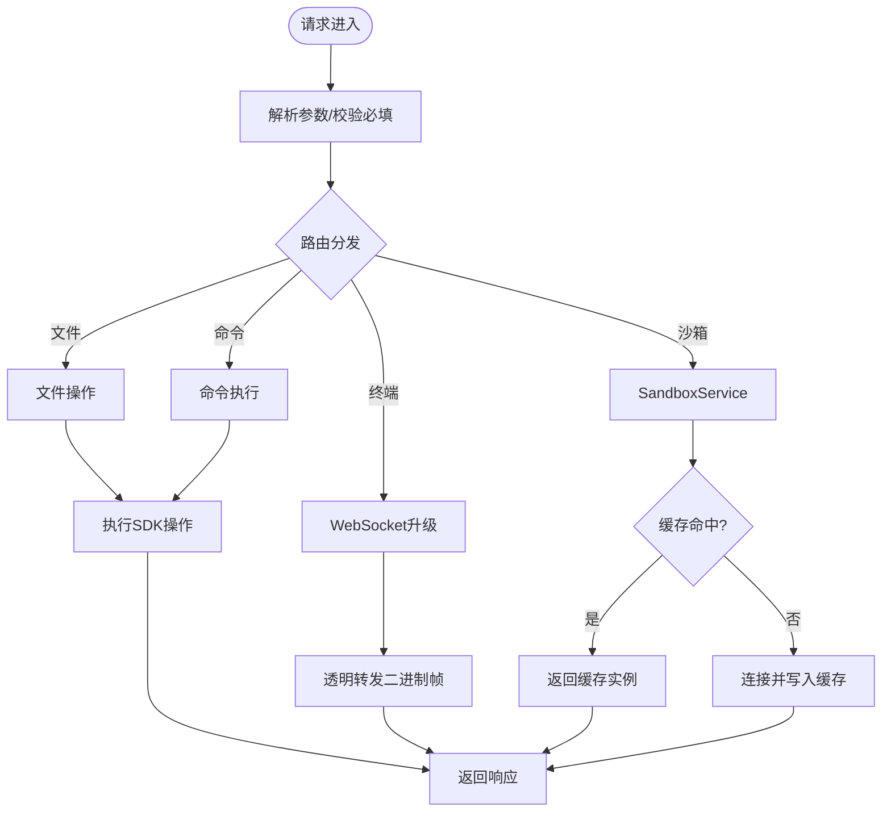
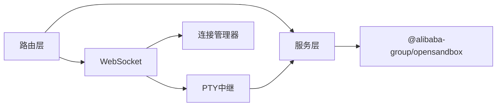

# 数据模型与接口

<cite>
**本文引用的文件**
- [apps/backend/src/types/index.ts](file://apps/backend/src/types/index.ts)
- [apps/backend/src/services/sandboxService.ts](file://apps/backend/src/services/sandboxService.ts)
- [apps/backend/src/websocket/connectionManager.ts](file://apps/backend/src/websocket/connectionManager.ts)
- [apps/backend/src/websocket/ptyRelay.ts](file://apps/backend/src/websocket/ptyRelay.ts)
- [apps/backend/src/websocket/types.ts](file://apps/backend/src/websocket/types.ts)
- [apps/backend/src/routes/sandboxes.ts](file://apps/backend/src/routes/sandboxes.ts)
- [apps/backend/src/routes/files.ts](file://apps/backend/src/routes/files.ts)
- [apps/backend/src/routes/commands.ts](file://apps/backend/src/routes/commands.ts)
- [apps/backend/src/config.ts](file://apps/backend/src/config.ts)
- [apps/backend/src/server.ts](file://apps/backend/src/server.ts)
- [apps/frontend/src/api/types.ts](file://apps/frontend/src/api/types.ts)
- [apps/frontend/src/api/client.ts](file://apps/frontend/src/api/client.ts)
- [README.md](file://README.md)
</cite>

## 目录
1. [简介](#简介)
2. [项目结构](#项目结构)
3. [核心组件](#核心组件)
4. [架构总览](#架构总览)
5. [详细组件分析](#详细组件分析)
6. [依赖分析](#依赖分析)
7. [性能考虑](#性能考虑)
8. [故障排查指南](#故障排查指南)
9. [结论](#结论)
10. [附录](#附录)

## 简介
本文件面向“Sandbox Manager”平台，聚焦于数据模型与接口规范，明确核心数据实体之间的关系与约束，覆盖字段定义、主键/外键关系、索引与约束设计、数据验证与业务规则、数据访问模式、缓存策略、性能考量、数据生命周期与归档策略、迁移与版本管理策略，以及数据安全与访问控制的设计要点。同时提供数据库模式图与示例数据结构，并给出API接口规范与数据交换格式说明。

## 项目结构
后端采用Express + WebSocket（ws）+ OpenSandbox SDK的架构，前端使用React + Zustand + xterm.js。核心数据流围绕“沙箱（Sandbox）—终端会话（TerminalSession）—文件条目（FileEntry）”展开，通过REST API与WebSocket双向中继实现透明的二进制帧透传。

图表来源
- [apps/backend/src/server.ts:36-89](file://apps/backend/src/server.ts#L36-L89)
- [apps/backend/src/config.ts:48-70](file://apps/backend/src/config.ts#L48-L70)
- [apps/backend/src/routes/sandboxes.ts:1-175](file://apps/backend/src/routes/sandboxes.ts#L1-L175)
- [apps/backend/src/routes/files.ts:1-327](file://apps/backend/src/routes/files.ts#L1-L327)
- [apps/backend/src/routes/commands.ts:1-95](file://apps/backend/src/routes/commands.ts#L1-L95)
- [apps/backend/src/services/sandboxService.ts:1-148](file://apps/backend/src/services/sandboxService.ts#L1-L148)
- [apps/backend/src/websocket/connectionManager.ts:1-102](file://apps/backend/src/websocket/connectionManager.ts#L1-L102)
- [apps/backend/src/websocket/ptyRelay.ts:1-171](file://apps/backend/src/websocket/ptyRelay.ts#L1-L171)
- [apps/frontend/src/api/client.ts:1-45](file://apps/frontend/src/api/client.ts#L1-L45)
- [apps/frontend/src/api/types.ts:1-116](file://apps/frontend/src/api/types.ts#L1-L116)

章节来源
- [README.md:114-188](file://README.md#L114-L188)
- [apps/backend/src/server.ts:36-89](file://apps/backend/src/server.ts#L36-L89)

## 核心组件
- 沙箱（Sandbox）
  - 字段：id（字符串）、name（可选）、image（字符串）、status（字符串）、statusDetail（对象，含state/reason/message/lastTransitionAt）、createdAt/expiresAt（时间戳）、entrypoint（数组）、metadata/env（键值对）
  - 约束：id为主键；状态字段来自SDK状态对象；过滤逻辑会剔除已过期的沙箱
- 终端会话（TerminalSession）
  - 字段：connectionId（字符串）、sandboxId（字符串）、frontendWs/serverWs（WebSocket实例）、sessionId（字符串或null）、createdAt/lastActivityAt（时间戳）
  - 约束：connectionId为主键；sandboxId用于关联Sandbox；存在空闲检测与清理机制
- 文件条目（FileEntry）
  - 字段：name（字符串）、path（字符串）、isDir（布尔）、size（数值）、modTime（可选时间戳）
  - 约束：path唯一标识文件/目录；支持直接子项枚举与目录推断

章节来源
- [apps/backend/src/routes/sandboxes.ts:16-32](file://apps/backend/src/routes/sandboxes.ts#L16-L32)
- [apps/backend/src/websocket/types.ts:11-19](file://apps/backend/src/websocket/types.ts#L11-L19)
- [apps/backend/src/routes/files.ts:20-44](file://apps/backend/src/routes/files.ts#L20-L44)

## 架构总览
下图展示从Web终端到OpenSandbox执行守护进程（execd）的完整数据通路，强调二进制帧透传与控制消息格式。

图表来源
- [apps/backend/src/websocket/ptyRelay.ts:9-21](file://apps/backend/src/websocket/ptyRelay.ts#L9-L21)
- [apps/backend/src/websocket/ptyRelay.ts:40-118](file://apps/backend/src/websocket/ptyRelay.ts#L40-L118)
- [apps/backend/src/websocket/ptyRelay.ts:120-171](file://apps/backend/src/websocket/ptyRelay.ts#L120-L171)

## 详细组件分析

### 数据模型与关系
- 实体与属性
  - Sandbox：id（PK）、name、image、status、statusDetail、createdAt、expiresAt、entrypoint、metadata、env
  - TerminalSession：connectionId（PK）、sandboxId（FK）、frontendWs、serverWs、sessionId、createdAt、lastActivityAt
  - FileEntry：name、path（PK）、isDir、size、modTime
- 关系
  - 一对多：Sandbox.id → TerminalSession.sandboxId
  - 多对一：FileEntry.path → Sandbox（通过文件操作API间接关联）
- 索引与约束
  - Sandbox.id：主键；建议在查询状态/元数据/分页场景建立复合索引（如状态+创建时间）
  - TerminalSession.connectionId：主键；sandboxId上建立索引以加速按沙箱查询
  - FileEntry.path：主键；建议在isDir上建立索引以优化目录/文件区分查询
- 数据验证与业务规则
  - 沙箱列表过滤：过期时间小于当前时间的记录被过滤
  - 文件操作：写入/移动/删除需提供有效路径；读取前校验是否为文件
  - 终端会话：空闲超时清理；握手超时保护

图表来源
- [apps/backend/src/routes/sandboxes.ts:16-32](file://apps/backend/src/routes/sandboxes.ts#L16-L32)
- [apps/backend/src/websocket/types.ts:11-19](file://apps/backend/src/websocket/types.ts#L11-L19)
- [apps/backend/src/routes/files.ts:20-44](file://apps/backend/src/routes/files.ts#L20-L44)

章节来源
- [apps/backend/src/routes/sandboxes.ts:82-86](file://apps/backend/src/routes/sandboxes.ts#L82-L86)
- [apps/backend/src/routes/files.ts:47-69](file://apps/backend/src/routes/files.ts#L47-L69)
- [apps/backend/src/websocket/connectionManager.ts:92-100](file://apps/backend/src/websocket/connectionManager.ts#L92-L100)

### 数据访问模式与缓存策略
- 缓存
  - SandboxService使用LRU缓存保存已连接的Sandbox实例，默认容量50，TTL 10分钟；淘汰时尝试关闭连接并记录日志
- 访问模式
  - REST路由负责参数解析与业务校验，调用SandboxService进行SDK交互
  - 文件路由支持搜索+回退两种目录枚举策略，确保在不同环境下的兼容性
  - 终端路由通过HTTP升级建立WebSocket，随后透明转发二进制帧

图表来源
- [apps/backend/src/services/sandboxService.ts:17-47](file://apps/backend/src/services/sandboxService.ts#L17-L47)
- [apps/backend/src/services/sandboxService.ts:112-123](file://apps/backend/src/services/sandboxService.ts#L112-L123)
- [apps/backend/src/routes/files.ts:19-44](file://apps/backend/src/routes/files.ts#L19-L44)
- [apps/backend/src/websocket/ptyRelay.ts:40-118](file://apps/backend/src/websocket/ptyRelay.ts#L40-L118)

章节来源
- [apps/backend/src/services/sandboxService.ts:17-47](file://apps/backend/src/services/sandboxService.ts#L17-L47)
- [apps/backend/src/routes/files.ts:213-275](file://apps/backend/src/routes/files.ts#L213-L275)

### API接口规范与数据交换格式
- 通用响应格式
  - 成功：{ success: true, data: T }
  - 失败：{ success: false, error: { code, message, requestId? } }
- 沙箱相关
  - GET /api/sandboxes：分页列出沙箱，过滤过期项
  - POST /api/sandboxes：创建沙箱（请求体包含镜像、名称、超时、环境变量、元数据、资源配额、网络策略）
  - GET /api/sandboxes/:id：获取沙箱详情
  - DELETE /api/sandboxes/:id：删除沙箱
  - POST /api/sandboxes/:id/pause：暂停沙箱
  - POST /api/sandboxes/:id/resume：恢复沙箱
  - GET /api/sandboxes/:id/endpoints/:port：获取端点URL（scheme/host/port拆解）
- 文件相关
  - GET /api/sandboxes/:id/files：目录枚举（优先搜索API，失败回退ls+stat）
  - GET /api/sandboxes/:id/files/content：读取文本文件
  - GET /api/sandboxes/:id/files/download：下载二进制文件
  - POST /api/sandboxes/:id/files/write：写入文件
  - POST /api/sandboxes/:id/files/mkdir：创建目录
  - POST /api/sandboxes/:id/files/move：批量移动/重命名
  - DELETE /api/sandboxes/:id/files/files：删除文件
  - DELETE /api/sandboxes/:id/files/directories：删除目录
- 命令相关
  - POST /api/sandboxes/:id/commands：执行命令（聚合输出）
  - POST /api/sandboxes/:id/commands/session：创建bash会话
  - POST /api/sandboxes/:id/commands/session/:sessionId/run：在会话内执行命令
  - DELETE /api/sandboxes/:id/commands/session/:sessionId：删除会话
- 终端相关
  - WS /api/sandboxes/:id/pty：建立终端会话，二进制帧透传，JSON控制消息（resize/exit）

章节来源
- [apps/backend/src/routes/sandboxes.ts:61-175](file://apps/backend/src/routes/sandboxes.ts#L61-L175)
- [apps/backend/src/routes/files.ts:19-327](file://apps/backend/src/routes/files.ts#L19-L327)
- [apps/backend/src/routes/commands.ts:12-95](file://apps/backend/src/routes/commands.ts#L12-L95)
- [apps/backend/src/websocket/ptyRelay.ts:9-21](file://apps/backend/src/websocket/ptyRelay.ts#L9-L21)
- [apps/frontend/src/api/types.ts:1-116](file://apps/frontend/src/api/types.ts#L1-L116)
- [apps/frontend/src/api/client.ts:16-44](file://apps/frontend/src/api/client.ts#L16-L44)

### 示例数据结构
- Sandbox
  - 字段：id、name、image、status、statusDetail、createdAt、expiresAt、entrypoint、metadata、env
  - 示例：包含状态对象、镜像对象扁平化后的结构
- FileEntry
  - 字段：name、path、isDir、size、modTime
  - 示例：目录直接子项与深层路径推断的组合结果
- TerminalSession
  - 字段：connectionId、sandboxId、createdAt、lastActivityAt、sessionId
  - 示例：前端WS与后端WS均已建立，会话ID已创建

章节来源
- [apps/backend/src/routes/sandboxes.ts:16-32](file://apps/backend/src/routes/sandboxes.ts#L16-L32)
- [apps/backend/src/routes/files.ts:213-275](file://apps/backend/src/routes/files.ts#L213-L275)
- [apps/backend/src/websocket/types.ts:11-19](file://apps/backend/src/websocket/types.ts#L11-L19)

## 依赖分析
- 组件耦合
  - 路由层仅依赖服务层接口，降低与SDK的直接耦合
  - WebSocket中继依赖SandboxService与连接管理器，形成清晰职责边界
- 外部依赖
  - OpenSandbox SDK：提供沙箱生命周期与文件/命令操作能力
  - ws：提供WebSocket服务端能力
  - lru-cache：提供Sandbox实例缓存
- 循环依赖
  - 未发现循环依赖；各模块职责单一且通过接口解耦

图表来源
- [apps/backend/src/server.ts:50-56](file://apps/backend/src/server.ts#L50-L56)
- [apps/backend/src/services/sandboxService.ts:1-148](file://apps/backend/src/services/sandboxService.ts#L1-L148)
- [apps/backend/src/websocket/connectionManager.ts:1-102](file://apps/backend/src/websocket/connectionManager.ts#L1-L102)
- [apps/backend/src/websocket/ptyRelay.ts:1-171](file://apps/backend/src/websocket/ptyRelay.ts#L1-L171)

章节来源
- [apps/backend/src/server.ts:50-56](file://apps/backend/src/server.ts#L50-L56)

## 性能考虑
- 缓存策略
  - Sandbox实例LRU缓存：减少重复连接开销；TTL避免长时间占用资源
  - 建议：根据并发峰值调整容量与TTL；监控淘汰事件与关闭异常
- I/O与网络
  - 文件枚举优先使用SDK搜索API，失败回退至ls+stat，兼顾性能与兼容性
  - WebSocket二进制帧透传，避免额外序列化开销
- 超时与限流
  - PTY空闲超时默认5分钟；建议结合业务场景动态配置
  - 请求体限制1MB；建议对大文件上传采用分块或临时链接方案
- 查询优化
  - 对状态、创建时间、元数据建立索引；分页查询避免全表扫描

[本节为通用性能指导，不直接分析具体文件]

## 故障排查指南
- 常见错误码
  - MISSING_PATH/IS_DIRECTORY/MISSING_FIELDS/MISSING_ENTRIES/MISSING_COMMAND：参数缺失或类型不符
  - NOT_CONFIGURED：OpenSandbox未配置
- 排查步骤
  - 检查后端日志中的请求ID，定位具体错误上下文
  - 确认OpenSandbox服务连通性与API密钥
  - 检查WebSocket握手与会话创建阶段的错误信息
  - 校验文件路径合法性与权限

章节来源
- [apps/backend/src/routes/files.ts:53-62](file://apps/backend/src/routes/files.ts#L53-L62)
- [apps/backend/src/routes/files.ts:103-106](file://apps/backend/src/routes/files.ts#L103-L106)
- [apps/backend/src/routes/commands.ts:19-22](file://apps/backend/src/routes/commands.ts#L19-L22)
- [apps/backend/src/routes/sandboxes.ts:34-45](file://apps/backend/src/routes/sandboxes.ts#L34-L45)

## 结论
本平台以“Sandbox—TerminalSession—FileEntry”为核心数据域，通过REST与WebSocket双通道实现终端与文件操作的高保真交互。通过明确的字段定义、约束规则与缓存策略，既保证了易用性也兼顾了性能与可维护性。建议在生产环境中进一步完善索引设计、接入监控告警，并制定数据生命周期与迁移策略。

[本节为总结性内容，不直接分析具体文件]

## 附录

### 数据生命周期、保留策略与归档规则
- 生命周期
  - 沙箱：按expiresAt过滤过期项；支持暂停/恢复；删除时释放资源
  - 终端会话：空闲超时自动清理；关闭时同步释放两端WS
  - 文件：按路径唯一存储；删除操作不可逆，建议配合备份策略
- 保留策略
  - 建议对历史沙箱与会话日志设置保留周期（如30天），到期清理
- 归档规则
  - 对长期无访问的沙箱与会话生成归档快照，降低在线数据规模

[本节为通用指导，不直接分析具体文件]

### 数据迁移路径与版本管理策略
- 版本管理
  - 使用语义化版本（如0.1.0）管理后端发布；前端通过API客户端适配新旧接口
- 迁移路径
  - 字段新增：向后兼容；旧客户端忽略未知字段
  - 字段变更：提供过渡期的兼容层；逐步引导前端更新
  - 删除字段：先标记废弃，再在后续版本移除

[本节为通用指导，不直接分析具体文件]

### 数据安全与访问控制设计
- 安全要点
  - OpenSandbox API密钥通过环境变量注入；禁止在日志中打印敏感信息
  - WebSocket升级路径严格校验沙箱ID；失败直接拒绝
  - CORS允许来源可通过配置项控制
- 访问控制
  - 建议在网关层引入鉴权中间件；对敏感操作（删除/写入）增加二次确认
  - 对文件与命令操作增加白名单与配额限制

章节来源
- [apps/backend/src/config.ts:48-70](file://apps/backend/src/config.ts#L48-L70)
- [apps/backend/src/server.ts:76-87](file://apps/backend/src/server.ts#L76-L87)