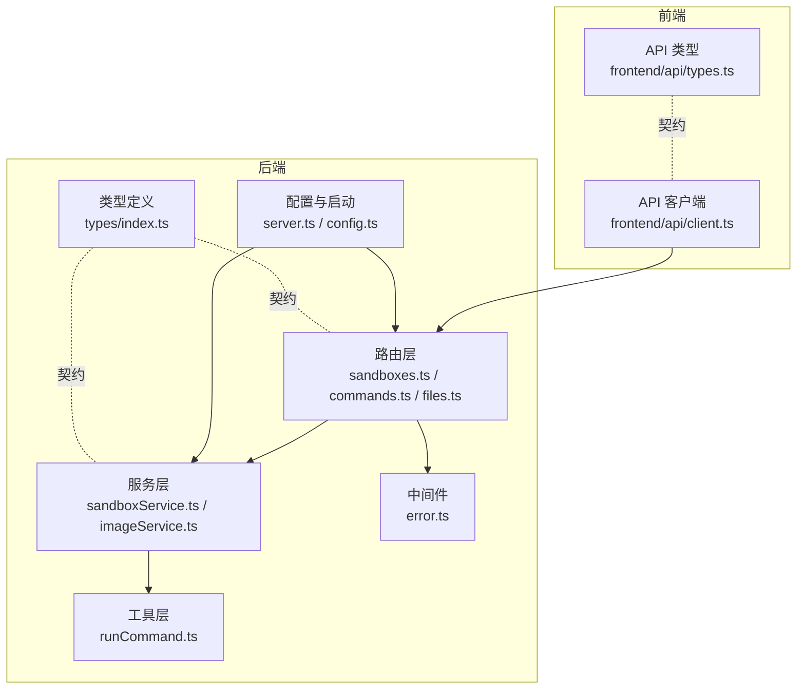
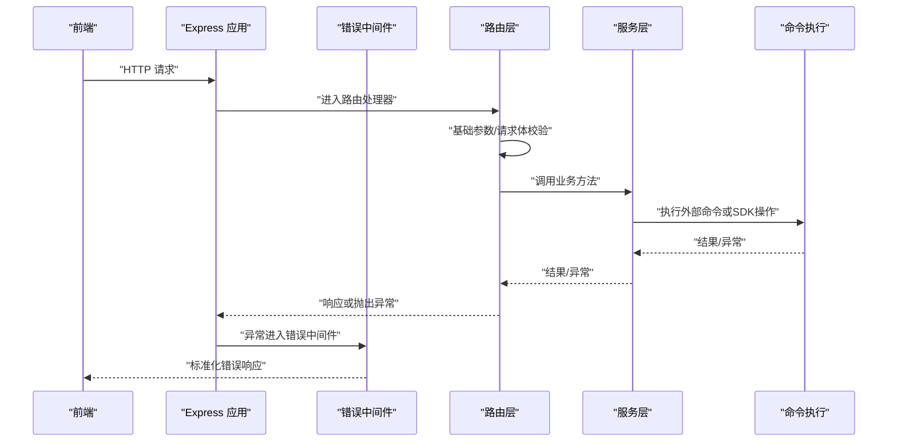
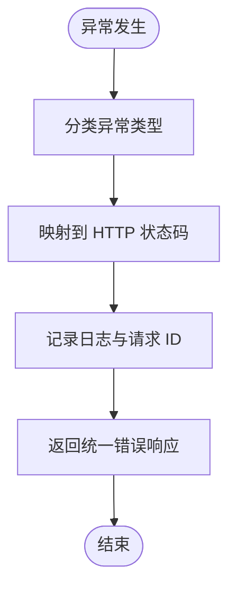
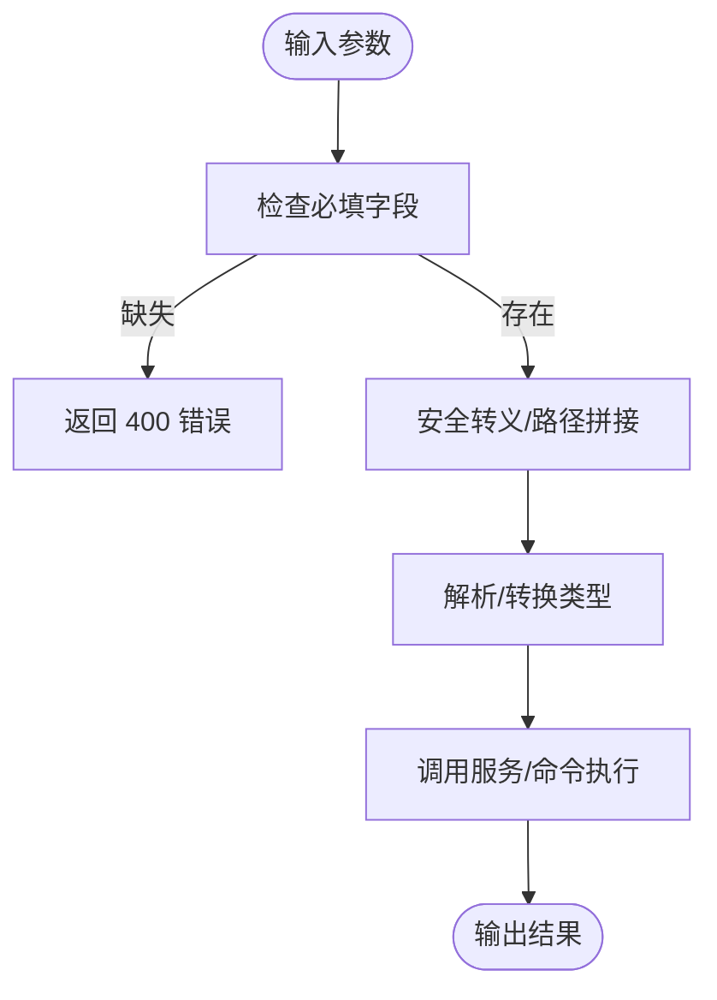
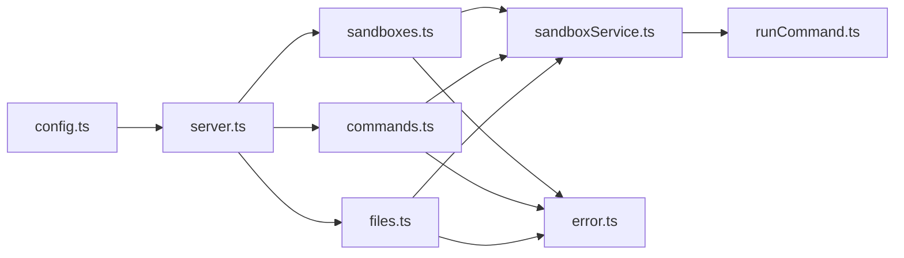

# 数据验证与约束

<cite>
**本文引用的文件**
- [apps/backend/src/types/index.ts](file://apps/backend/src/types/index.ts)
- [apps/backend/src/routes/sandboxes.ts](file://apps/backend/src/routes/sandboxes.ts)
- [apps/backend/src/routes/commands.ts](file://apps/backend/src/routes/commands.ts)
- [apps/backend/src/routes/files.ts](file://apps/backend/src/routes/files.ts)
- [apps/backend/src/services/sandboxService.ts](file://apps/backend/src/services/sandboxService.ts)
- [apps/backend/src/services/imageService.ts](file://apps/backend/src/services/imageService.ts)
- [apps/backend/src/middleware/error.ts](file://apps/backend/src/middleware/error.ts)
- [apps/backend/src/server.ts](file://apps/backend/src/server.ts)
- [apps/backend/src/config.ts](file://apps/backend/src/config.ts)
- [apps/backend/src/utils/runCommand.ts](file://apps/backend/src/utils/runCommand.ts)
- [apps/frontend/src/api/types.ts](file://apps/frontend/src/api/types.ts)
- [apps/frontend/src/api/client.ts](file://apps/frontend/src/api/client.ts)
</cite>

## 目录
1. [引言](#引言)
2. [项目结构](#项目结构)
3. [核心组件](#核心组件)
4. [架构总览](#架构总览)
5. [详细组件分析](#详细组件分析)
6. [依赖关系分析](#依赖关系分析)
7. [性能考量](#性能考量)
8. [故障排查指南](#故障排查指南)
9. [结论](#结论)
10. [附录](#附录)

## 引言
本文件聚焦于 Sandbox Manager 后端在“数据验证与约束”方面的设计与实现，覆盖输入数据的验证逻辑（字段类型、长度、格式、业务规则）、约束设计（唯一性、外键、完整性）、错误处理与异常策略、数据清理与转换（空值、格式标准化、安全过滤）、以及数据质量与一致性的保障措施。文档同时给出关键流程的时序图与类图，帮助读者快速理解并落地最佳实践。

## 项目结构
后端采用 Express + TypeScript 架构，按职责分层组织：路由层负责请求接入与基础校验；服务层封装业务逻辑与外部 SDK 调用；中间件负责统一错误映射；工具层提供命令执行等通用能力；类型定义统一前后端契约。

图表来源
- [apps/backend/src/routes/sandboxes.ts:1-175](file://apps/backend/src/routes/sandboxes.ts#L1-L175)
- [apps/backend/src/routes/commands.ts:1-95](file://apps/backend/src/routes/commands.ts#L1-L95)
- [apps/backend/src/routes/files.ts:1-327](file://apps/backend/src/routes/files.ts#L1-L327)
- [apps/backend/src/services/sandboxService.ts:1-148](file://apps/backend/src/services/sandboxService.ts#L1-L148)
- [apps/backend/src/services/imageService.ts:1-386](file://apps/backend/src/services/imageService.ts#L1-L386)
- [apps/backend/src/middleware/error.ts:1-48](file://apps/backend/src/middleware/error.ts#L1-L48)
- [apps/backend/src/server.ts:1-119](file://apps/backend/src/server.ts#L1-L119)
- [apps/backend/src/config.ts:1-71](file://apps/backend/src/config.ts#L1-L71)
- [apps/backend/src/utils/runCommand.ts:1-54](file://apps/backend/src/utils/runCommand.ts#L1-L54)
- [apps/backend/src/types/index.ts:1-89](file://apps/backend/src/types/index.ts#L1-L89)
- [apps/frontend/src/api/types.ts:1-116](file://apps/frontend/src/api/types.ts#L1-L116)
- [apps/frontend/src/api/client.ts:1-45](file://apps/frontend/src/api/client.ts#L1-L45)

章节来源
- [apps/backend/src/server.ts:36-90](file://apps/backend/src/server.ts#L36-L90)
- [apps/backend/src/config.ts:48-71](file://apps/backend/src/config.ts#L48-L71)

## 核心组件
- 类型系统：通过 TypeScript 接口定义请求体与响应体，明确字段类型、可选性与默认行为，作为“契约”指导验证与约束。
- 路由层：对路径参数、查询参数与请求体进行基础校验（如必填字段、格式），并将错误以统一结构返回。
- 服务层：调用外部 SDK 或本地命令执行，负责业务规则与资源约束的实现。
- 中间件：统一捕获异常，映射到标准 HTTP 状态码与错误结构。
- 配置与启动：集中加载环境变量，确保运行期约束条件满足。

章节来源
- [apps/backend/src/types/index.ts:1-89](file://apps/backend/src/types/index.ts#L1-L89)
- [apps/backend/src/routes/sandboxes.ts:95-105](file://apps/backend/src/routes/sandboxes.ts#L95-L105)
- [apps/backend/src/middleware/error.ts:5-47](file://apps/backend/src/middleware/error.ts#L5-L47)
- [apps/backend/src/config.ts:48-71](file://apps/backend/src/config.ts#L48-L71)

## 架构总览
下图展示从请求进入至响应返回的关键路径，以及各层的验证与约束职责。

图表来源
- [apps/backend/src/server.ts:36-90](file://apps/backend/src/server.ts#L36-L90)
- [apps/backend/src/middleware/error.ts:5-47](file://apps/backend/src/middleware/error.ts#L5-L47)
- [apps/backend/src/routes/sandboxes.ts:95-105](file://apps/backend/src/routes/sandboxes.ts#L95-L105)
- [apps/backend/src/routes/commands.ts:13-35](file://apps/backend/src/routes/commands.ts#L13-L35)
- [apps/backend/src/routes/files.ts:97-115](file://apps/backend/src/routes/files.ts#L97-L115)
- [apps/backend/src/utils/runCommand.ts:7-54](file://apps/backend/src/utils/runCommand.ts#L7-L54)

## 详细组件分析

### 输入数据验证与约束设计
- 字段类型检查
  - 使用 TypeScript 接口定义请求体与响应体，确保编译期类型安全。例如 CreateSandboxBody、RunCommandBody、WriteFileBody 等。
  - 路由层在运行时对关键字段进行存在性与类型检查（如必填字段、数值范围），并在失败时返回 400 错误。
- 长度限制
  - 路由层对路径参数与查询参数进行解析与长度判断（如端口号解析），避免非法输入导致后续处理异常。
- 格式验证
  - 对端口字符串进行解析（parseInt），若非有效数字则拒绝请求。
  - 文件路径与目录名通过命令执行与路径拼接进行安全化处理（如转义单引号）。
- 业务规则验证
  - 列表接口支持状态过滤、分页参数，服务层根据业务规则返回数据。
  - 创建沙箱时，服务层设置默认超时时间，避免未传参导致的资源占用风险。
  - 文件读取前检查是否为目录，防止对目录进行内容读取。
  - 删除接口要求必须提供路径参数，防止误删。

章节来源
- [apps/backend/src/types/index.ts:13-82](file://apps/backend/src/types/index.ts#L13-L82)
- [apps/backend/src/routes/sandboxes.ts:152-174](file://apps/backend/src/routes/sandboxes.ts#L152-L174)
- [apps/backend/src/routes/commands.ts:13-35](file://apps/backend/src/routes/commands.ts#L13-L35)
- [apps/backend/src/routes/files.ts:47-94](file://apps/backend/src/routes/files.ts#L47-L94)
- [apps/backend/src/services/sandboxService.ts:74-87](file://apps/backend/src/services/sandboxService.ts#L74-L87)

### 数据约束设计原则
- 唯一性约束
  - 通过外部 SDK 与集群资源命名规范实现唯一性（如 DaemonSet 名称清洗与截断）。
- 外键约束
  - 无传统数据库外键，但通过路径与资源标识符（sandboxId、sessionId）在运行时进行关联与校验。
- 完整性约束
  - 统一的错误响应结构与请求 ID 追踪，确保请求链路可审计。
  - 路由层与服务层分别承担“输入约束”和“业务约束”，共同保证数据完整性。

章节来源
- [apps/backend/src/services/imageService.ts:12-22](file://apps/backend/src/services/imageService.ts#L12-L22)
- [apps/backend/src/routes/sandboxes.ts:34-45](file://apps/backend/src/routes/sandboxes.ts#L34-L45)
- [apps/backend/src/middleware/error.ts:11-31](file://apps/backend/src/middleware/error.ts#L11-L31)

### 错误处理机制与异常策略
- 异常分类与映射
  - 将 SDK 异常、参数异常、解析异常等映射到标准 HTTP 状态码（400、404、502、504 等）。
- 统一错误响应
  - 返回结构包含 success=false、错误码、消息与请求 ID，便于前端与日志追踪。
- 日志记录
  - 记录请求方法、路径、状态码与请求 ID，便于问题定位。

图表来源
- [apps/backend/src/middleware/error.ts:5-47](file://apps/backend/src/middleware/error.ts#L5-L47)

章节来源
- [apps/backend/src/middleware/error.ts:5-47](file://apps/backend/src/middleware/error.ts#L5-L47)

### 数据清理与转换
- 空值处理
  - 路由层对必填字段进行显式检查，缺失时直接返回 400。
- 格式标准化
  - 端口解析为整数；路径标准化为字符串；时间戳统一为 ISO 字符串。
- 安全过滤
  - 在执行 shell 命令前对路径进行单引号转义，降低注入风险。
  - 严格区分“目录”与“文件”，避免对目录执行读取或写入操作。

图表来源
- [apps/backend/src/routes/files.ts:321-326](file://apps/backend/src/routes/files.ts#L321-L326)
- [apps/backend/src/routes/commands.ts:13-35](file://apps/backend/src/routes/commands.ts#L13-L35)
- [apps/backend/src/routes/files.ts:97-115](file://apps/backend/src/routes/files.ts#L97-L115)

章节来源
- [apps/backend/src/routes/files.ts:321-326](file://apps/backend/src/routes/files.ts#L321-L326)
- [apps/backend/src/routes/commands.ts:13-35](file://apps/backend/src/routes/commands.ts#L13-L35)
- [apps/backend/src/routes/files.ts:97-115](file://apps/backend/src/routes/files.ts#L97-L115)

### 数据质量保证与一致性维护
- 前端类型契约
  - 前端使用强类型接口对接后端 API，减少不一致数据传递。
- 后端类型契约
  - 通过接口定义统一请求/响应结构，避免运行时类型错误。
- 运行时校验
  - 路由层与服务层双重校验，确保业务规则与资源约束得到遵守。
- 可观测性
  - 请求 ID 与日志结合，便于回溯与审计。

章节来源
- [apps/frontend/src/api/types.ts:1-116](file://apps/frontend/src/api/types.ts#L1-L116)
- [apps/frontend/src/api/client.ts:1-45](file://apps/frontend/src/api/client.ts#L1-L45)
- [apps/backend/src/types/index.ts:1-89](file://apps/backend/src/types/index.ts#L1-L89)

## 依赖关系分析
- 路由依赖服务层，服务层依赖工具层与外部 SDK。
- 中间件独立于业务逻辑，统一处理异常。
- 配置驱动运行期行为（如超时、协议、代理开关）。

图表来源
- [apps/backend/src/routes/sandboxes.ts:1-175](file://apps/backend/src/routes/sandboxes.ts#L1-L175)
- [apps/backend/src/routes/commands.ts:1-95](file://apps/backend/src/routes/commands.ts#L1-L95)
- [apps/backend/src/routes/files.ts:1-327](file://apps/backend/src/routes/files.ts#L1-L327)
- [apps/backend/src/services/sandboxService.ts:1-148](file://apps/backend/src/services/sandboxService.ts#L1-L148)
- [apps/backend/src/utils/runCommand.ts:1-54](file://apps/backend/src/utils/runCommand.ts#L1-L54)
- [apps/backend/src/middleware/error.ts:1-48](file://apps/backend/src/middleware/error.ts#L1-L48)
- [apps/backend/src/server.ts:1-119](file://apps/backend/src/server.ts#L1-L119)
- [apps/backend/src/config.ts:1-71](file://apps/backend/src/config.ts#L1-L71)

章节来源
- [apps/backend/src/server.ts:36-90](file://apps/backend/src/server.ts#L36-L90)

## 性能考量
- 路由层与服务层分离：路由层仅做轻量校验与参数解析，复杂逻辑下沉至服务层，有利于缓存与复用。
- 缓存策略：服务层对连接实例使用 LRU 缓存，减少重复连接开销。
- 超时控制：配置与命令执行均设置超时，避免长时间阻塞。
- 日志与监控：统一请求 ID 与错误日志，便于定位性能瓶颈。

章节来源
- [apps/backend/src/services/sandboxService.ts:17-47](file://apps/backend/src/services/sandboxService.ts#L17-L47)
- [apps/backend/src/config.ts:68-69](file://apps/backend/src/config.ts#L68-L69)
- [apps/backend/src/utils/runCommand.ts:13-54](file://apps/backend/src/utils/runCommand.ts#L13-L54)

## 故障排查指南
- 常见错误码与含义
  - 400：参数缺失或格式错误（如缺少命令、路径为空）。
  - 404：资源不存在（如删除/查询的目标不存在）。
  - 502：外部服务异常（如 OpenSandbox 服务不可达）。
  - 504：等待就绪超时。
- 定位步骤
  - 查看响应中的错误码与消息。
  - 检查请求 ID 并在后端日志中检索对应条目。
  - 确认配置项（如协议、超时、代理）是否正确。
- 建议
  - 前端在收到错误时显示具体错误码与消息，并允许用户重试或调整参数。

章节来源
- [apps/backend/src/middleware/error.ts:33-47](file://apps/backend/src/middleware/error.ts#L33-L47)
- [apps/backend/src/routes/commands.ts:19-22](file://apps/backend/src/routes/commands.ts#L19-L22)
- [apps/backend/src/routes/files.ts:53-62](file://apps/backend/src/routes/files.ts#L53-L62)

## 结论
本项目通过“类型契约 + 路由层校验 + 服务层约束 + 统一错误中间件”的组合，实现了清晰、可维护且可扩展的数据验证与约束体系。配合缓存、超时与可观测性机制，整体具备良好的性能与可靠性。建议在新增功能时遵循现有模式，保持验证与约束的一致性。

## 附录
- 关键流程示例（路径）
  - 创建沙箱：[apps/backend/src/routes/sandboxes.ts:95-105](file://apps/backend/src/routes/sandboxes.ts#L95-L105)
  - 执行命令：[apps/backend/src/routes/commands.ts:13-35](file://apps/backend/src/routes/commands.ts#L13-L35)
  - 写入文件：[apps/backend/src/routes/files.ts:97-115](file://apps/backend/src/routes/files.ts#L97-L115)
  - 获取端点：[apps/backend/src/routes/sandboxes.ts:152-174](file://apps/backend/src/routes/sandboxes.ts#L152-L174)
- 最佳实践
  - 明确区分“输入约束”与“业务约束”，前者在路由层完成，后者在服务层完成。
  - 对外部命令执行进行参数转义与路径校验，避免注入与误操作。
  - 使用统一错误响应结构与请求 ID，提升可观测性与排障效率。