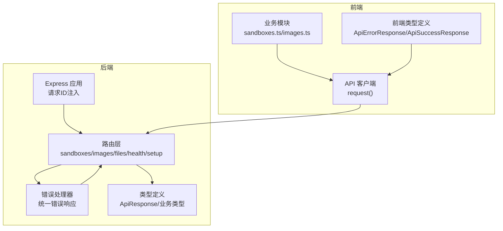
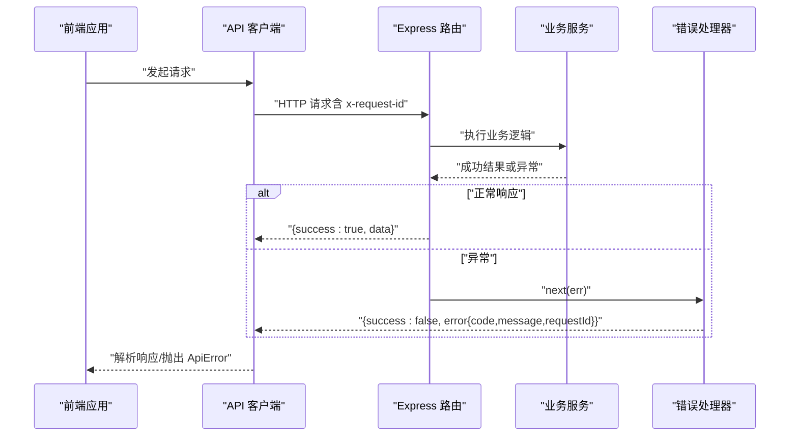
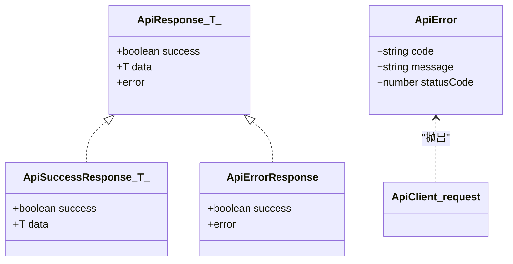
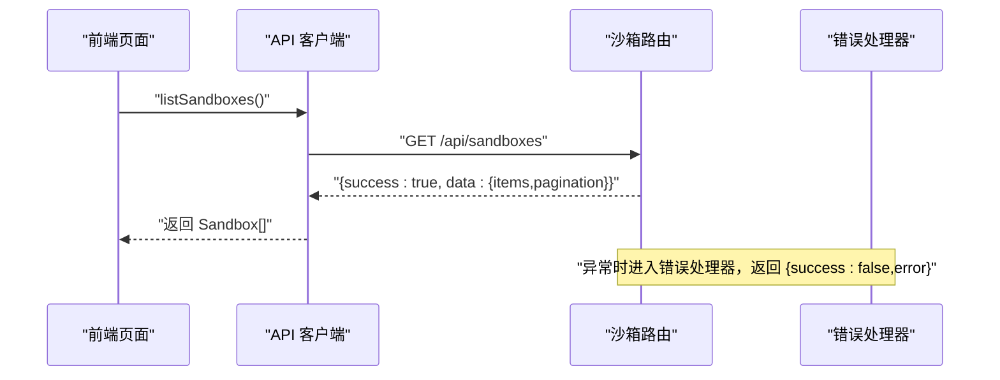
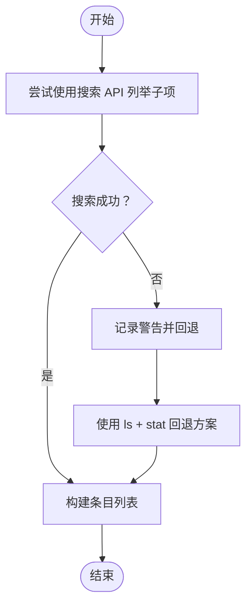
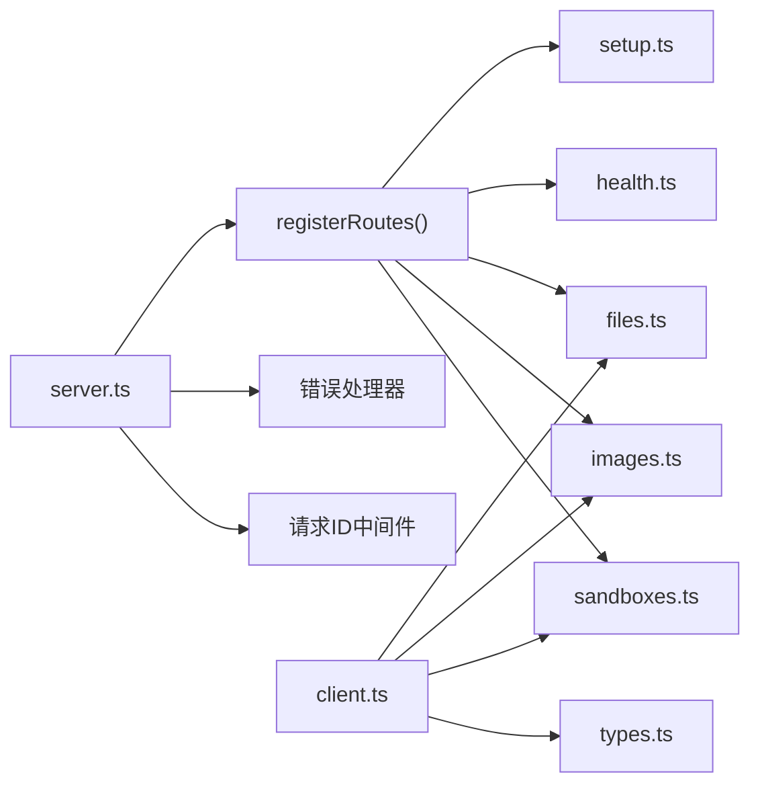

# API响应模型

<cite>
**本文引用的文件**
- [apps/backend/src/types/index.ts](file://apps/backend/src/types/index.ts)
- [apps/backend/src/middleware/error.ts](file://apps/backend/src/middleware/error.ts)
- [apps/backend/src/server.ts](file://apps/backend/src/server.ts)
- [apps/backend/src/routes/index.ts](file://apps/backend/src/routes/index.ts)
- [apps/backend/src/routes/sandboxes.ts](file://apps/backend/src/routes/sandboxes.ts)
- [apps/backend/src/routes/health.ts](file://apps/backend/src/routes/health.ts)
- [apps/backend/src/routes/images.ts](file://apps/backend/src/routes/images.ts)
- [apps/backend/src/routes/files.ts](file://apps/backend/src/routes/files.ts)
- [apps/backend/src/routes/setup.ts](file://apps/backend/src/routes/setup.ts)
- [apps/frontend/src/api/types.ts](file://apps/frontend/src/api/types.ts)
- [apps/frontend/src/api/client.ts](file://apps/frontend/src/api/client.ts)
- [apps/frontend/src/api/sandboxes.ts](file://apps/frontend/src/api/sandboxes.ts)
- [apps/frontend/src/api/images.ts](file://apps/frontend/src/api/images.ts)
</cite>

## 目录
1. [简介](#简介)
2. [项目结构](#项目结构)
3. [核心组件](#核心组件)
4. [架构总览](#架构总览)
5. [详细组件分析](#详细组件分析)
6. [依赖分析](#依赖分析)
7. [性能考虑](#性能考虑)
8. [故障排查指南](#故障排查指南)
9. [结论](#结论)
10. [附录](#附录)

## 简介
本文件系统性地梳理 Sandbox Manager 的 API 响应模型与统一结构，围绕后端 ApiResponse 泛型接口、错误码与错误消息格式、请求 ID 追踪机制、各端点响应数据结构与状态码映射、序列化与类型安全、以及版本控制与兼容性策略进行说明，并提供面向前端的调用示例路径与最佳实践。

## 项目结构
后端采用 Express 应用，通过中间件注入请求 ID 并在路由层返回统一 ApiResponse 结构；前端通过通用请求封装对响应进行解析与错误抛出，确保一致的类型安全体验。

图表来源
- [apps/backend/src/server.ts:44-48](file://apps/backend/src/server.ts#L44-L48)
- [apps/backend/src/routes/index.ts:9-15](file://apps/backend/src/routes/index.ts#L9-L15)
- [apps/backend/src/middleware/error.ts:5-31](file://apps/backend/src/middleware/error.ts#L5-L31)
- [apps/backend/src/types/index.ts:3-11](file://apps/backend/src/types/index.ts#L3-L11)
- [apps/frontend/src/api/client.ts:16-44](file://apps/frontend/src/api/client.ts#L16-L44)
- [apps/frontend/src/api/types.ts:49-61](file://apps/frontend/src/api/types.ts#L49-L61)
- [apps/frontend/src/api/sandboxes.ts:1-40](file://apps/frontend/src/api/sandboxes.ts#L1-L40)
- [apps/frontend/src/api/images.ts:1-23](file://apps/frontend/src/api/images.ts#L1-L23)

章节来源
- [apps/backend/src/server.ts:36-90](file://apps/backend/src/server.ts#L36-L90)
- [apps/backend/src/routes/index.ts:1-18](file://apps/backend/src/routes/index.ts#L1-L18)

## 核心组件
- 统一响应结构：后端通过 ApiResponse<T> 返回统一结构，包含 success、data（可选）与 error（可选）。前端对应 ApiErrorResponse 与 ApiSuccessResponse 类型，用于编译期约束与运行时校验。
- 错误处理：全局错误处理器将异常映射为 HTTP 状态码并返回统一错误体，同时记录请求 ID 以便追踪。
- 请求 ID：中间件在每个请求上生成或复用 x-request-id 头部，贯穿日志与错误响应，便于端到端追踪。
- 端点响应：各路由根据业务返回 data 或 204 空响应，错误时通过 next(err) 进入错误处理器。

章节来源
- [apps/backend/src/types/index.ts:3-11](file://apps/backend/src/types/index.ts#L3-L11)
- [apps/frontend/src/api/types.ts:49-61](file://apps/frontend/src/api/types.ts#L49-L61)
- [apps/backend/src/middleware/error.ts:5-31](file://apps/backend/src/middleware/error.ts#L5-L31)
- [apps/backend/src/server.ts:44-48](file://apps/backend/src/server.ts#L44-L48)

## 架构总览
下图展示了从请求进入、路由处理、错误捕获到响应返回的全链路流程，以及前后端类型约束如何协同工作。

图表来源
- [apps/backend/src/server.ts:44-48](file://apps/backend/src/server.ts#L44-L48)
- [apps/backend/src/routes/sandboxes.ts:96-105](file://apps/backend/src/routes/sandboxes.ts#L96-L105)
- [apps/backend/src/middleware/error.ts:5-31](file://apps/backend/src/middleware/error.ts#L5-L31)
- [apps/frontend/src/api/client.ts:16-44](file://apps/frontend/src/api/client.ts#L16-L44)

## 详细组件分析

### 统一响应结构与类型安全
- 后端 ApiResponse<T> 字段
  - success: 布尔值，表示请求是否成功
  - data: 可选载荷，泛型 T 表示具体业务数据
  - error: 可选错误对象，包含 code、message、requestId
- 前端类型 ApiErrorResponse 与 ApiSuccessResponse
  - 成功时返回 { success: true, data: T }
  - 失败时返回 { success: false, error: { code, message, requestId? } }
- 客户端 request() 函数
  - 对 204 做特殊处理（无主体）
  - 对非 ok 或 data.success === false 抛出 ApiError（包含 code、message、statusCode）
  - 正常时返回 data.data

章节来源
- [apps/backend/src/types/index.ts:3-11](file://apps/backend/src/types/index.ts#L3-L11)
- [apps/frontend/src/api/types.ts:49-61](file://apps/frontend/src/api/types.ts#L49-L61)
- [apps/frontend/src/api/client.ts:16-44](file://apps/frontend/src/api/client.ts#L16-L44)

### 错误码定义与错误消息格式
- 错误码来源
  - HTTP_前缀：当未匹配到特定异常类型时，错误码为 "HTTP_{statusCode}"（如 "HTTP_500"）
  - 业务自定义：如 "NOT_CONFIGURED"、"INVALID_ARGUMENT"、"SETUP_IN_PROGRESS" 等
- 错误消息格式
  - error.message 为字符串，描述错误详情
  - requestId 为可选，用于跨服务追踪
- 异常分类与状态码映射（节选）
  - SandboxApiException 或带 statusCode 属性：默认 502
  - SandboxReadyTimeoutException：504
  - InvalidArgumentException：400
  - SandboxException / SandboxInternalException：502
  - Express 解析失败：400
  - 其他：500

章节来源
- [apps/backend/src/middleware/error.ts:5-31](file://apps/backend/src/middleware/error.ts#L5-L31)
- [apps/backend/src/middleware/error.ts:33-47](file://apps/backend/src/middleware/error.ts#L33-L47)
- [apps/backend/src/routes/sandboxes.ts:35-45](file://apps/backend/src/routes/sandboxes.ts#L35-L45)
- [apps/backend/src/routes/images.ts:40-46](file://apps/backend/src/routes/images.ts#L40-L46)
- [apps/backend/src/routes/setup.ts:71-74](file://apps/backend/src/routes/setup.ts#L71-L74)

### 请求 ID 追踪机制
- 生成与注入
  - 中间件在每次请求时设置或复用 x-request-id 头部
  - 日志中记录该 ID，便于定位问题
- 错误响应携带
  - 错误处理器将 requestId 写入 error 对象
- 建议
  - 前端在请求头中透传 x-request-id，便于后端日志关联

章节来源
- [apps/backend/src/server.ts:44-48](file://apps/backend/src/server.ts#L44-L48)
- [apps/backend/src/middleware/error.ts:12](file://apps/backend/src/middleware/error.ts#L12)
- [apps/backend/src/middleware/error.ts:28](file://apps/backend/src/middleware/error.ts#L28)

### 各端点响应数据结构与状态码映射
- 沙箱管理（/api/sandboxes）
  - GET / 列表：返回 { items: Sandbox[], pagination }，状态码 200
  - POST / 创建：返回单个 Sandbox，状态码 202
  - GET /:id 获取详情：返回单个 Sandbox，状态码 200
  - DELETE /:id 删除：状态码 204
  - POST /:id/pause 暂停：状态码 200
  - POST /:id/resume 恢复：状态码 200
  - GET /:id/endpoints/:port 获取端点：返回 { url, scheme, host, port }，状态码 200
- 镜像管理（/api/images）
  - GET /cached 列表缓存镜像：状态码 200
  - GET / 列表预拉取镜像：状态码 200
  - POST / 拉取镜像：返回 ImageInfo，状态码 202
  - GET /:name/status 查询状态：状态码 200
  - DELETE /:name 删除镜像：状态码 204
- 文件操作（/api/sandboxes/:sandboxId/files）
  - GET / 列目录：返回文件条目数组，状态码 200
  - GET /content 读文本：返回纯文本，状态码 200 或 400
  - GET /download 二进制下载：返回字节流，状态码 200 或 400
  - POST /write 写文件：状态码 200 或 400
  - POST /mkdir 创建目录：状态码 200 或 400
  - POST /move 移动/重命名：状态码 200 或 400
  - DELETE /files 删除文件：状态码 204 或 400
  - DELETE /directories 删除目录：状态码 204 或 400
- 健康检查（/api/health）
  - GET / 返回健康状态与配置信息，状态码 200
- 设置流程（/api/setup）
  - GET /status 返回配置状态，状态码 200
  - POST /test-connection 测试连接，状态码 200
  - POST /remote 保存远端配置并重初始化服务，状态码 200 或 500
  - GET /local-k8s/stream SSE 流，事件进度/完成/错误
  - POST /complete 完成本地 K8s 设置，状态码 200 或 500

章节来源
- [apps/backend/src/routes/sandboxes.ts:62-175](file://apps/backend/src/routes/sandboxes.ts#L62-L175)
- [apps/backend/src/routes/images.ts:14-78](file://apps/backend/src/routes/images.ts#L14-L78)
- [apps/backend/src/routes/files.ts:19-327](file://apps/backend/src/routes/files.ts#L19-L327)
- [apps/backend/src/routes/health.ts:6-52](file://apps/backend/src/routes/health.ts#L6-L52)
- [apps/backend/src/routes/setup.ts:17-139](file://apps/backend/src/routes/setup.ts#L17-L139)

### 序列化、反序列化与类型安全
- 后端
  - 使用 res.json() 序列化 ApiResponse 对象
  - 通过类型断言确保返回结构符合 ApiResponse<T>
- 前端
  - request() 使用 fetch 接收 JSON 并解析
  - 通过 ApiErrorResponse/ApiSuccessResponse 在编译期约束响应结构
  - 对 204 特判，避免解析空响应导致异常

章节来源
- [apps/backend/src/routes/sandboxes.ts:89](file://apps/backend/src/routes/sandboxes.ts#L89)
- [apps/backend/src/routes/images.ts:19](file://apps/backend/src/routes/images.ts#L19)
- [apps/frontend/src/api/client.ts:34-44](file://apps/frontend/src/api/client.ts#L34-L44)

### API 版本控制、兼容性与向后兼容策略
- 当前实现
  - 后端未显式引入版本号前缀（如 /api/v1），所有路由均位于 /api 下
  - 响应结构保持稳定：统一 success/data/error 字段
- 建议策略
  - 引入版本前缀（如 /api/v1），新功能在 v2 提供，旧版保持兼容过渡
  - 通过 Content-Type 或 Accept 头部扩展版本协商
  - 严格遵循语义化版本，变更 error.code 与 data 结构时仅在大版本升级
  - 保留旧端点一段时间并发出 deprecation 警告，逐步迁移

章节来源
- [apps/backend/src/routes/index.ts:9-15](file://apps/backend/src/routes/index.ts#L9-L15)
- [apps/backend/src/types/index.ts:3-11](file://apps/backend/src/types/index.ts#L3-L11)

### 响应模型类图

图表来源
- [apps/backend/src/types/index.ts:3-11](file://apps/backend/src/types/index.ts#L3-L11)
- [apps/frontend/src/api/types.ts:49-61](file://apps/frontend/src/api/types.ts#L49-L61)
- [apps/frontend/src/api/client.ts:5-14](file://apps/frontend/src/api/client.ts#L5-L14)

### 端到端调用序列（沙箱列表）

图表来源
- [apps/frontend/src/api/sandboxes.ts:4-15](file://apps/frontend/src/api/sandboxes.ts#L4-L15)
- [apps/backend/src/routes/sandboxes.ts:62-93](file://apps/backend/src/routes/sandboxes.ts#L62-L93)
- [apps/frontend/src/api/client.ts:38-44](file://apps/frontend/src/api/client.ts#L38-L44)

### 复杂逻辑流程（文件列表回退策略）

图表来源
- [apps/backend/src/routes/files.ts:20-44](file://apps/backend/src/routes/files.ts#L20-L44)
- [apps/backend/src/routes/files.ts:213-275](file://apps/backend/src/routes/files.ts#L213-L275)
- [apps/backend/src/routes/files.ts:281-313](file://apps/backend/src/routes/files.ts#L281-L313)

## 依赖分析
- 后端
  - server.ts 注入请求 ID 中间件与错误处理器，注册路由
  - 各路由依赖类型定义与服务层，返回统一 ApiResponse
  - 错误处理器依赖异常类型映射与日志
- 前端
  - client.ts 作为统一请求入口，依赖 types.ts 的类型定义
  - sandboxes.ts/images.ts 等模块封装具体端点调用

图表来源
- [apps/backend/src/server.ts:36-90](file://apps/backend/src/server.ts#L36-L90)
- [apps/backend/src/routes/index.ts:9-15](file://apps/backend/src/routes/index.ts#L9-L15)
- [apps/frontend/src/api/client.ts:16-44](file://apps/frontend/src/api/client.ts#L16-L44)
- [apps/frontend/src/api/types.ts:49-61](file://apps/frontend/src/api/types.ts#L49-L61)

章节来源
- [apps/backend/src/server.ts:36-90](file://apps/backend/src/server.ts#L36-L90)
- [apps/backend/src/routes/index.ts:1-18](file://apps/backend/src/routes/index.ts#L1-L18)
- [apps/frontend/src/api/client.ts:16-44](file://apps/frontend/src/api/client.ts#L16-L44)

## 性能考虑
- 响应体积
  - 统一结构增加少量字段，但显著提升可观测性与前端处理一致性
- 错误处理
  - 将异常映射为明确 HTTP 状态码，减少前端分支判断复杂度
- 缓存与连接
  - 沙箱连接采用 LRU 缓存，降低重复连接开销（与响应模型配合使用更佳）

章节来源
- [apps/backend/src/services/sandboxService.ts:17-47](file://apps/backend/src/services/sandboxService.ts#L17-L47)

## 故障排查指南
- 如何定位一次请求
  - 检查后端日志中的 x-request-id，结合错误响应中的 requestId 核对
  - 关注错误处理器输出的 method/path/statusCode
- 常见错误场景
  - 未配置：沙箱路由在未配置时返回 "NOT_CONFIGURED"
  - 参数缺失：镜像拉取/文件操作等端点对必填字段进行校验并返回相应错误码
  - 连接超时/内部异常：根据异常类型映射到 502/504 等状态码
- 前端处理
  - request() 对非成功响应抛出 ApiError，前端可根据 code/message 快速提示用户

章节来源
- [apps/backend/src/middleware/error.ts:18-31](file://apps/backend/src/middleware/error.ts#L18-L31)
- [apps/backend/src/routes/sandboxes.ts:35-45](file://apps/backend/src/routes/sandboxes.ts#L35-L45)
- [apps/backend/src/routes/images.ts:40-46](file://apps/backend/src/routes/images.ts#L40-L46)
- [apps/frontend/src/api/client.ts:38-41](file://apps/frontend/src/api/client.ts#L38-L41)

## 结论
Sandbox Manager 的 API 响应模型通过统一的 ApiResponse<T> 结构实现了清晰、一致且类型安全的契约，结合请求 ID 追踪与完善的错误映射，显著提升了可观测性与可维护性。建议在未来引入版本控制与兼容策略，以支持持续演进与平滑迁移。

## 附录
- 成功响应示例（路径）
  - 沙箱列表：[apps/backend/src/routes/sandboxes.ts:89](file://apps/backend/src/routes/sandboxes.ts#L89)
  - 镜像列表：[apps/backend/src/routes/images.ts:30](file://apps/backend/src/routes/images.ts#L30)
  - 健康检查：[apps/backend/src/routes/health.ts:27](file://apps/backend/src/routes/health.ts#L27)
- 错误响应示例（路径）
  - 未配置：[apps/backend/src/routes/sandboxes.ts:40](file://apps/backend/src/routes/sandboxes.ts#L40)
  - 参数缺失：[apps/backend/src/routes/images.ts:43](file://apps/backend/src/routes/images.ts#L43)
  - 设置中：[apps/backend/src/routes/setup.ts:72](file://apps/backend/src/routes/setup.ts#L72)
- 前端调用示例（路径）
  - 列表沙箱：[apps/frontend/src/api/sandboxes.ts:8](file://apps/frontend/src/api/sandboxes.ts#L8)
  - 拉取镜像：[apps/frontend/src/api/images.ts:8](file://apps/frontend/src/api/images.ts#L8)
  - 通用请求封装：[apps/frontend/src/api/client.ts:16](file://apps/frontend/src/api/client.ts#L16)