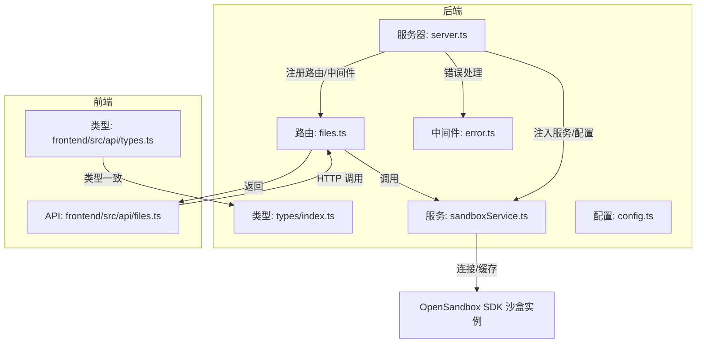
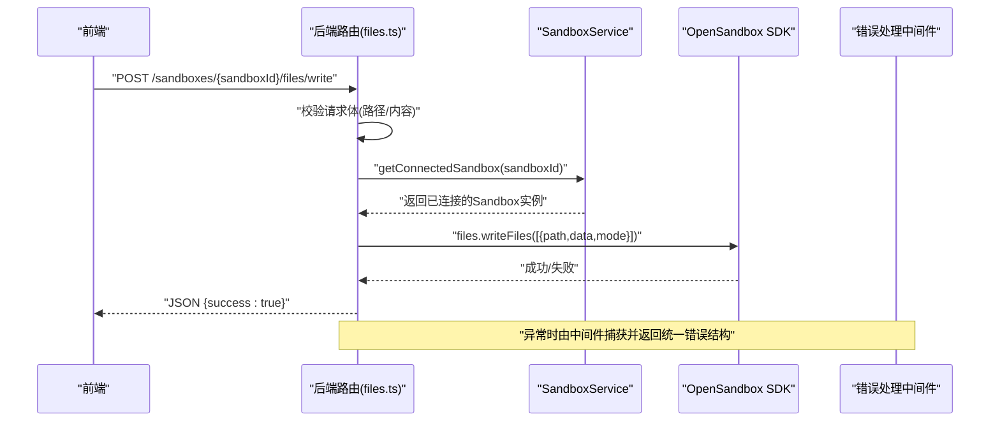
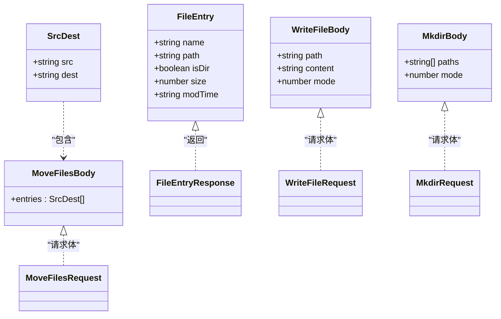
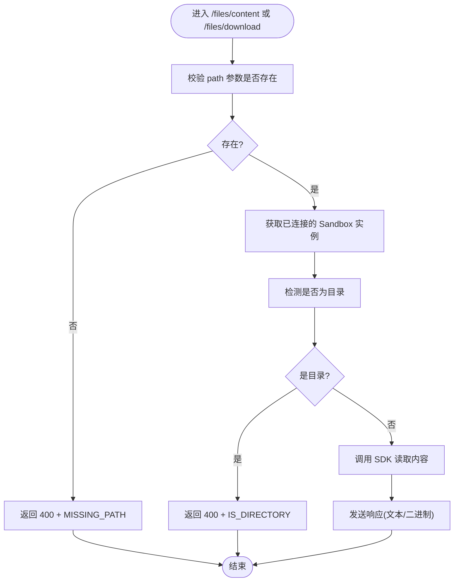
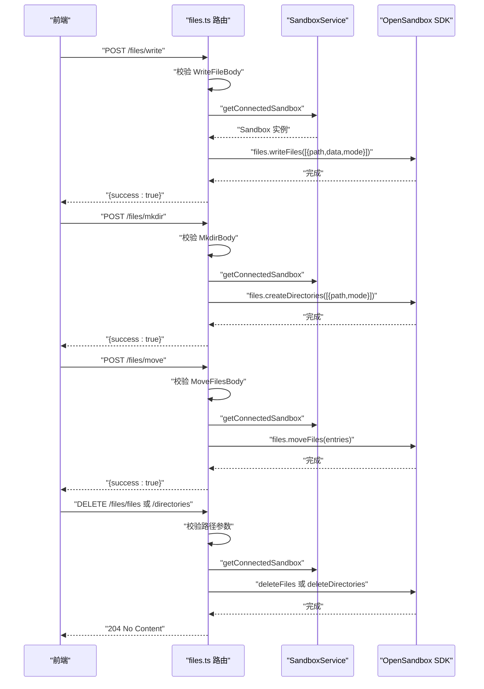
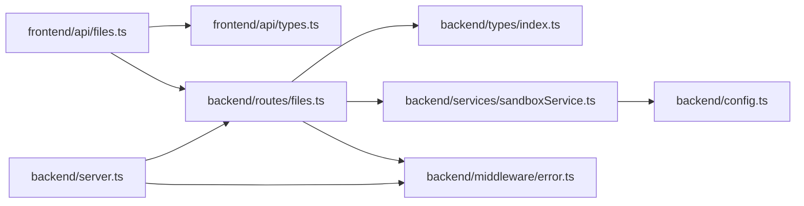

# 文件操作模型

<cite>
**本文引用的文件**
- [apps/backend/src/routes/files.ts](file://apps/backend/src/routes/files.ts)
- [apps/backend/src/types/index.ts](file://apps/backend/src/types/index.ts)
- [apps/backend/src/services/sandboxService.ts](file://apps/backend/src/services/sandboxService.ts)
- [apps/backend/src/middleware/error.ts](file://apps/backend/src/middleware/error.ts)
- [apps/backend/src/server.ts](file://apps/backend/src/server.ts)
- [apps/backend/src/config.ts](file://apps/backend/src/config.ts)
- [apps/frontend/src/api/files.ts](file://apps/frontend/src/api/files.ts)
- [apps/frontend/src/api/types.ts](file://apps/frontend/src/api/types.ts)
</cite>

## 目录
1. [简介](#简介)
2. [项目结构](#项目结构)
3. [核心组件](#核心组件)
4. [架构总览](#架构总览)
5. [详细组件分析](#详细组件分析)
6. [依赖关系分析](#依赖关系分析)
7. [性能考量](#性能考量)
8. [故障排查指南](#故障排查指南)
9. [结论](#结论)
10. [附录](#附录)

## 简介
本文件面向Sandbox Manager的“文件操作模型”，系统性说明后端路由层如何对接OpenSandbox SDK执行文件系统操作，并在前端通过API进行文件读写、目录创建、文件移动与删除等操作。重点覆盖：
- FileEntry实体的字段与语义（名称、路径、是否目录、大小、修改时间）
- 请求体模型WriteFileBody、MkdirBody、MoveFilesBody的字段定义与校验规则
- 安全策略、权限检查与路径验证机制
- 文件内容编码、模式设置与批量操作的实现逻辑
- 文件操作与沙盒文件系统的交互方式与错误处理策略
- 提供具体调用流程图与类图，帮助读者快速理解

## 项目结构
后端采用Express路由组织文件操作接口，类型定义集中在统一的类型模块中；前端通过API模块封装REST调用，类型定义与后端保持一致。

图表来源
- [apps/backend/src/routes/files.ts:1-327](file://apps/backend/src/routes/files.ts#L1-L327)
- [apps/backend/src/types/index.ts:1-89](file://apps/backend/src/types/index.ts#L1-L89)
- [apps/backend/src/services/sandboxService.ts:1-148](file://apps/backend/src/services/sandboxService.ts#L1-L148)
- [apps/backend/src/middleware/error.ts:1-48](file://apps/backend/src/middleware/error.ts#L1-L48)
- [apps/backend/src/server.ts:1-119](file://apps/backend/src/server.ts#L1-L119)
- [apps/frontend/src/api/files.ts:1-31](file://apps/frontend/src/api/files.ts#L1-L31)
- [apps/frontend/src/api/types.ts:1-146](file://apps/frontend/src/api/types.ts#L1-L146)

章节来源
- [apps/backend/src/routes/files.ts:1-327](file://apps/backend/src/routes/files.ts#L1-L327)
- [apps/backend/src/types/index.ts:1-89](file://apps/backend/src/types/index.ts#L1-L89)
- [apps/backend/src/server.ts:1-119](file://apps/backend/src/server.ts#L1-L119)

## 核心组件
- FileEntry：后端返回给前端的文件系统条目，包含名称、路径、是否目录、大小、修改时间等字段。
- 请求体模型：
  - WriteFileBody：写入文件的请求体，包含目标路径、内容与可选的权限模式。
  - MkdirBody：创建目录的请求体，包含路径数组与可选的权限模式。
  - MoveFilesBody：移动/重命名文件的请求体，包含源到目标的映射数组。
- 路由层filesRouter：提供列出目录、读取文本/二进制、写入、创建目录、移动、删除文件/目录等接口。
- SandboxService：负责与OpenSandbox SDK建立连接、管理连接缓存、提供沙盒实例。
- 错误处理中间件：将SDK异常映射为HTTP响应码与统一错误结构。

章节来源
- [apps/backend/src/types/index.ts:27-46](file://apps/backend/src/types/index.ts#L27-L46)
- [apps/backend/src/routes/files.ts:19-207](file://apps/backend/src/routes/files.ts#L19-L207)
- [apps/backend/src/services/sandboxService.ts:112-123](file://apps/backend/src/services/sandboxService.ts#L112-L123)
- [apps/backend/src/middleware/error.ts:4-47](file://apps/backend/src/middleware/error.ts#L4-L47)

## 架构总览
文件操作从HTTP请求进入，经路由层解析参数与请求体，再通过SandboxService获取已连接的沙盒实例，最终调用OpenSandbox SDK的文件子系统完成操作。错误通过统一中间件转换为标准响应格式。

图表来源
- [apps/backend/src/routes/files.ts:96-115](file://apps/backend/src/routes/files.ts#L96-L115)
- [apps/backend/src/services/sandboxService.ts:112-123](file://apps/backend/src/services/sandboxService.ts#L112-L123)
- [apps/backend/src/middleware/error.ts:4-47](file://apps/backend/src/middleware/error.ts#L4-L47)

## 详细组件分析

### FileEntry 实体
- 字段定义
  - name：条目名称（字符串）
  - path：完整路径（字符串）
  - isDir：是否为目录（布尔）
  - size：文件大小（数字，字节）
  - modTime：修改时间（ISO字符串或未定义）
- 用途
  - 列表目录时作为条目返回，用于前端文件树渲染与交互。
- 复杂度
  - 列表算法包含两次遍历与集合操作，整体复杂度与结果数量线性相关。

章节来源
- [apps/frontend/src/api/types.ts:27-33](file://apps/frontend/src/api/types.ts#L27-L33)
- [apps/backend/src/routes/files.ts:213-275](file://apps/backend/src/routes/files.ts#L213-L275)

### 请求体模型与校验规则
- WriteFileBody
  - 字段：path（字符串）、content（字符串）、mode（可选数字）
  - 校验：必须提供path与content；否则返回400及错误码“MISSING_FIELDS”
  - 执行：调用SDK的writeFiles，传入单元素数组
- MkdirBody
  - 字段：paths（字符串数组）、mode（可选数字）
  - 校验：必须提供非空paths数组；否则返回400及错误码“MISSING_PATHS”
  - 执行：将每个路径包装为{path, mode}并调用SDK的createDirectories
- MoveFilesBody
  - 字段：entries（数组），每项包含src与dest两个字符串
  - 校验：必须提供非空entries数组；否则返回400及错误码“MISSING_ENTRIES”
  - 执行：直接调用SDK的moveFiles(entries)

章节来源
- [apps/backend/src/types/index.ts:33-46](file://apps/backend/src/types/index.ts#L33-L46)
- [apps/backend/src/routes/files.ts:96-157](file://apps/backend/src/routes/files.ts#L96-L157)

### 文件列表与目录读取
- 列表目录
  - 优先使用SDK搜索API，过滤出直接子项；若失败则回退到ls命令解析
  - 返回值为FileEntry数组
- 读取文件
  - 文本：/content，若路径是目录则返回400（IS_DIRECTORY）
  - 二进制：/download，若路径是目录则返回400（IS_DIRECTORY）

章节来源
- [apps/backend/src/routes/files.ts:19-44](file://apps/backend/src/routes/files.ts#L19-L44)
- [apps/backend/src/routes/files.ts:46-94](file://apps/backend/src/routes/files.ts#L46-L94)
- [apps/backend/src/routes/files.ts:213-313](file://apps/backend/src/routes/files.ts#L213-L313)

### 删除操作
- 删除文件：/files，支持多路径查询参数（数组或单值）
- 删除目录：/directories，支持多路径查询参数（数组或单值）
- 校验：至少提供一个路径；否则返回400（MISSING_PATH）
- 执行：调用SDK的deleteFiles或deleteDirectories

章节来源
- [apps/backend/src/routes/files.ts:159-207](file://apps/backend/src/routes/files.ts#L159-L207)

### 类关系与数据模型

图表来源
- [apps/frontend/src/api/types.ts:27-33](file://apps/frontend/src/api/types.ts#L27-L33)
- [apps/backend/src/types/index.ts:33-46](file://apps/backend/src/types/index.ts#L33-L46)

### 文件读取流程（文本/二进制）

图表来源
- [apps/backend/src/routes/files.ts:46-94](file://apps/backend/src/routes/files.ts#L46-L94)

### 写入/创建/移动/删除序列

图表来源
- [apps/backend/src/routes/files.ts:96-207](file://apps/backend/src/routes/files.ts#L96-L207)
- [apps/backend/src/services/sandboxService.ts:112-123](file://apps/backend/src/services/sandboxService.ts#L112-L123)

## 依赖关系分析
- 路由层依赖类型模块中的请求体定义与统一响应结构
- 路由层通过SandboxService获取Sandbox实例，避免重复连接
- 错误处理中间件统一捕获SDK异常并映射为HTTP状态码
- 前端API模块与类型模块与后端保持一致，确保契约稳定

图表来源
- [apps/frontend/src/api/files.ts:1-31](file://apps/frontend/src/api/files.ts#L1-L31)
- [apps/frontend/src/api/types.ts:1-146](file://apps/frontend/src/api/types.ts#L1-L146)
- [apps/backend/src/routes/files.ts:1-327](file://apps/backend/src/routes/files.ts#L1-L327)
- [apps/backend/src/types/index.ts:1-89](file://apps/backend/src/types/index.ts#L1-L89)
- [apps/backend/src/services/sandboxService.ts:1-148](file://apps/backend/src/services/sandboxService.ts#L1-L148)
- [apps/backend/src/middleware/error.ts:1-48](file://apps/backend/src/middleware/error.ts#L1-L48)
- [apps/backend/src/server.ts:1-119](file://apps/backend/src/server.ts#L1-L119)
- [apps/backend/src/config.ts:1-71](file://apps/backend/src/config.ts#L1-L71)

章节来源
- [apps/backend/src/server.ts:1-119](file://apps/backend/src/server.ts#L1-L119)
- [apps/backend/src/middleware/error.ts:4-47](file://apps/backend/src/middleware/error.ts#L4-L47)

## 性能考量
- 连接缓存：SandboxService使用LRU缓存保存已连接的Sandbox实例，默认容量50，超时10分钟，减少重复连接开销
- 列表目录：优先使用SDK搜索API，失败时回退到ls命令；限制输出行数以避免过大响应
- 请求体大小：后端启用JSON解析上限（1MB），防止大体积请求导致内存压力
- 并发控制：当前实现按请求串行处理，如需高并发可在上层引入队列或限流

章节来源
- [apps/backend/src/services/sandboxService.ts:17-44](file://apps/backend/src/services/sandboxService.ts#L17-L44)
- [apps/backend/src/server.ts:40-41](file://apps/backend/src/server.ts#L40-L41)
- [apps/backend/src/routes/files.ts:281-313](file://apps/backend/src/routes/files.ts#L281-L313)

## 故障排查指南
- 常见错误码
  - MISSING_PATH：缺少路径参数
  - MISSING_FIELDS：缺少必要字段（写入时）
  - MISSING_PATHS：缺少路径数组（创建目录时）
  - MISSING_ENTRIES：缺少entries数组（移动时）
  - IS_DIRECTORY：目标是目录而非文件
- 异常映射
  - SDK异常映射为HTTP状态码：如SandboxApiException映射502，SandboxReadyTimeoutException映射504，InvalidArgumentException映射400
- 日志与追踪
  - 请求携带x-request-id，便于跨服务追踪
  - 中间件记录错误详情与状态码，便于定位问题

章节来源
- [apps/backend/src/routes/files.ts:53-156](file://apps/backend/src/routes/files.ts#L53-L156)
- [apps/backend/src/middleware/error.ts:33-47](file://apps/backend/src/middleware/error.ts#L33-L47)
- [apps/backend/src/server.ts:44-48](file://apps/backend/src/server.ts#L44-L48)

## 结论
该文件操作模型通过明确的类型契约、严格的请求体校验与统一的错误处理，实现了对OpenSandbox SDK文件子系统的安全、可控访问。结合连接缓存与回退策略，既保证了易用性也兼顾了性能与稳定性。建议在生产环境中配合限流、鉴权与审计日志进一步强化安全与可观测性。

## 附录

### API定义概览
- 列出目录：GET /sandboxes/{sandboxId}/files?path={dirPath}
- 读取文件（文本）：GET /sandboxes/{sandboxId}/files/content?path={filePath}
- 读取文件（二进制）：GET /sandboxes/{sandboxId}/files/download?path={filePath}
- 写入文件：POST /sandboxes/{sandboxId}/files/write
- 创建目录：POST /sandboxes/{sandboxId}/files/mkdir
- 移动/重命名：POST /sandboxes/{sandboxId}/files/move
- 删除文件：DELETE /sandboxes/{sandboxId}/files/files?path={filePath}
- 删除目录：DELETE /sandboxes/{sandboxId}/files/directories?path={dirPath}

章节来源
- [apps/backend/src/routes/files.ts:19-207](file://apps/backend/src/routes/files.ts#L19-L207)