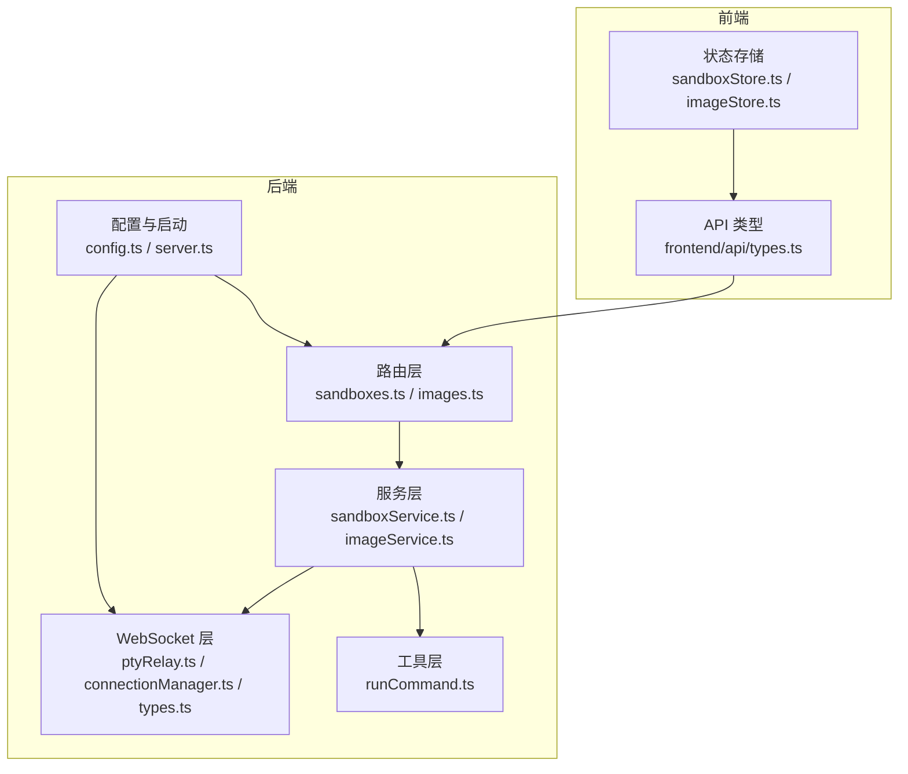
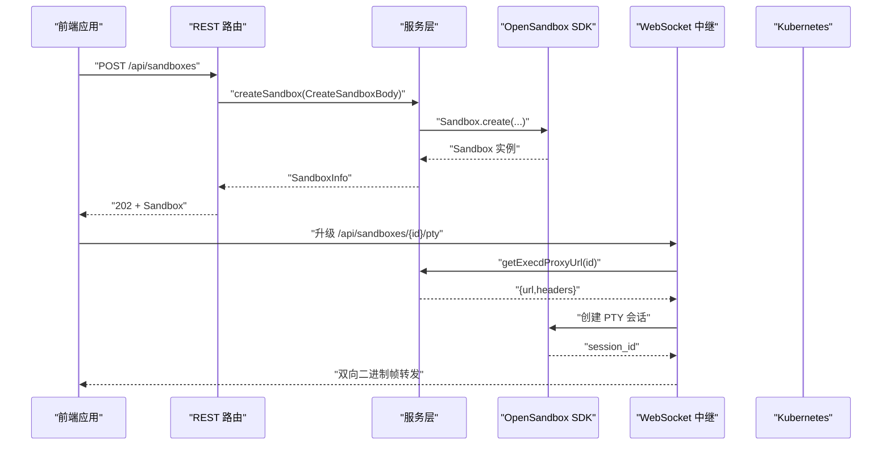
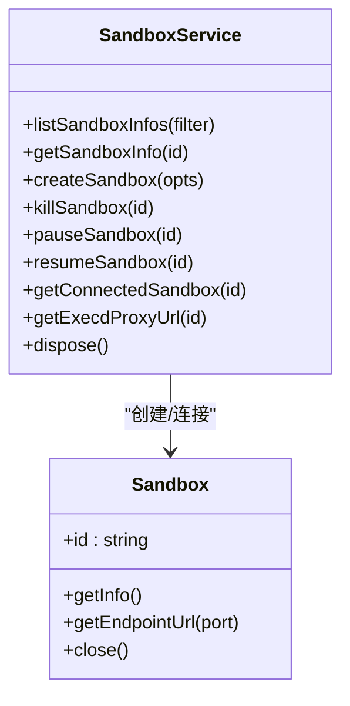
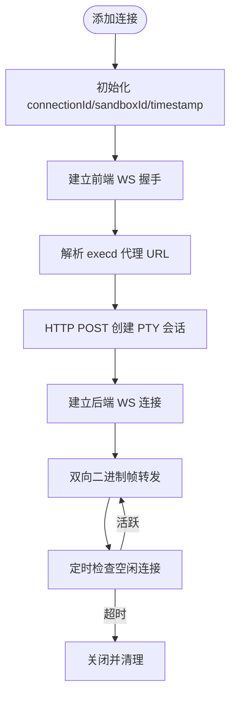
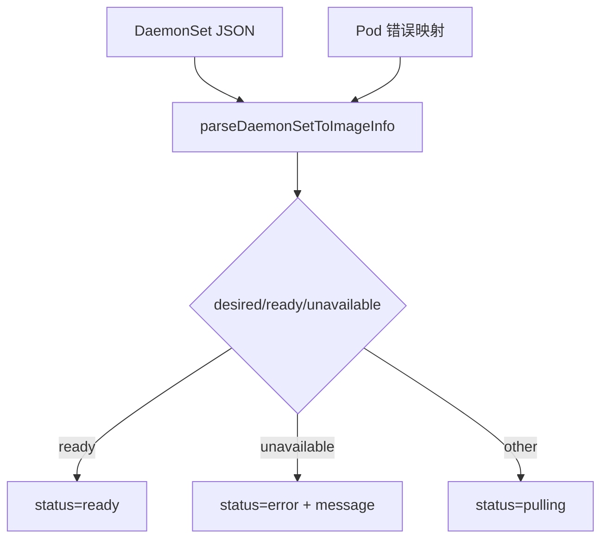
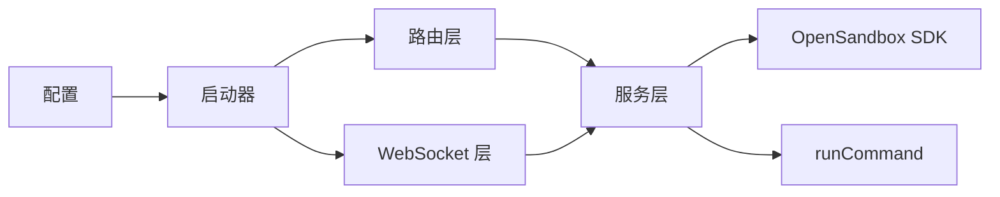

# 核心数据模型

<cite>
**本文引用的文件**
- [apps/backend/src/types/index.ts](file://apps/backend/src/types/index.ts)
- [apps/backend/src/services/sandboxService.ts](file://apps/backend/src/services/sandboxService.ts)
- [apps/backend/src/services/imageService.ts](file://apps/backend/src/services/imageService.ts)
- [apps/backend/src/routes/sandboxes.ts](file://apps/backend/src/routes/sandboxes.ts)
- [apps/backend/src/routes/images.ts](file://apps/backend/src/routes/images.ts)
- [apps/backend/src/websocket/types.ts](file://apps/backend/src/websocket/types.ts)
- [apps/backend/src/websocket/connectionManager.ts](file://apps/backend/src/websocket/connectionManager.ts)
- [apps/backend/src/websocket/ptyRelay.ts](file://apps/backend/src/websocket/ptyRelay.ts)
- [apps/backend/src/config.ts](file://apps/backend/src/config.ts)
- [apps/backend/src/server.ts](file://apps/backend/src/server.ts)
- [apps/backend/src/utils/runCommand.ts](file://apps/backend/src/utils/runCommand.ts)
- [apps/frontend/src/api/types.ts](file://apps/frontend/src/api/types.ts)
- [apps/frontend/src/stores/sandboxStore.ts](file://apps/frontend/src/stores/sandboxStore.ts)
- [apps/frontend/src/stores/imageStore.ts](file://apps/frontend/src/stores/imageStore.ts)
</cite>

## 目录
1. [简介](#简介)
2. [项目结构](#项目结构)
3. [核心组件](#核心组件)
4. [架构总览](#架构总览)
5. [详细组件分析](#详细组件分析)
6. [依赖分析](#依赖分析)
7. [性能考虑](#性能考虑)
8. [故障排查指南](#故障排查指南)
9. [结论](#结论)
10. [附录](#附录)

## 简介
本文件系统性梳理 Sandbox Manager 的核心数据模型与相关请求体模型，覆盖后端类型定义、服务层模型、前端类型映射以及 WebSocket 会话模型。重点说明：
- 实体模型：Sandbox、TerminalSession（通过 WebSocket 类型体现）、FileEntry（文件树节点）等字段、类型与约束
- 请求体模型：CreateSandboxBody、RunCommandBody、WriteFileBody、MkdirBody、MoveFilesBody、CreateSessionBody、RunInSessionBody 等结构与用途
- 镜像相关模型：ImageInfo、CachedImage 的设计理念与状态机
- 模型间关系：主键/外键关系、索引设计与约束规则
- 数据验证与业务规则：参数校验、状态转换、超时与错误处理
- 生命周期管理与数据转换：从请求到响应的完整流程

## 项目结构
后端采用分层架构：Express 路由负责 REST 接口，服务层封装业务逻辑，WebSocket 层负责终端会话中继，工具层封装外部命令执行；前端通过 API 客户端与状态存储与后端交互。

图表来源
- [apps/backend/src/routes/sandboxes.ts:1-175](file://apps/backend/src/routes/sandboxes.ts#L1-L175)
- [apps/backend/src/routes/images.ts:1-78](file://apps/backend/src/routes/images.ts#L1-L78)
- [apps/backend/src/services/sandboxService.ts:1-148](file://apps/backend/src/services/sandboxService.ts#L1-L148)
- [apps/backend/src/services/imageService.ts:1-386](file://apps/backend/src/services/imageService.ts#L1-L386)
- [apps/backend/src/websocket/ptyRelay.ts:1-171](file://apps/backend/src/websocket/ptyRelay.ts#L1-L171)
- [apps/backend/src/websocket/connectionManager.ts:1-102](file://apps/backend/src/websocket/connectionManager.ts#L1-L102)
- [apps/backend/src/websocket/types.ts:1-20](file://apps/backend/src/websocket/types.ts#L1-L20)
- [apps/backend/src/utils/runCommand.ts:1-54](file://apps/backend/src/utils/runCommand.ts#L1-L54)
- [apps/backend/src/config.ts:1-71](file://apps/backend/src/config.ts#L1-L71)
- [apps/backend/src/server.ts:1-119](file://apps/backend/src/server.ts#L1-L119)
- [apps/frontend/src/api/types.ts:1-116](file://apps/frontend/src/api/types.ts#L1-L116)
- [apps/frontend/src/stores/sandboxStore.ts:1-63](file://apps/frontend/src/stores/sandboxStore.ts#L1-L63)
- [apps/frontend/src/stores/imageStore.ts:1-60](file://apps/frontend/src/stores/imageStore.ts#L1-L60)

章节来源
- [apps/backend/src/server.ts:36-90](file://apps/backend/src/server.ts#L36-L90)
- [apps/backend/src/config.ts:48-71](file://apps/backend/src/config.ts#L48-L71)

## 核心组件
本节聚焦核心数据模型与请求体模型的字段定义、类型与约束。

- Sandbox（后端类型）
  - 字段与类型：id(string)、name(string?)、image(string)、status("Creating"|"Running"|"Paused"|"Error"|"Deleting"|string)、statusDetail({state:string,reason:string,message:string,lastTransitionAt:string}?)、createdAt(string?)、expiresAt(string?)、timeout(number?)、env(Record<string,string>?)、metadata(Record<string,string>?)、entrypoint(string[]?)
  - 约束与规则：statusDetail 为 SDK 返回的复杂状态对象，前端统一归一化为扁平格式；expiresAt 用于过滤过期沙箱；metadata/env 用于标识与资源限制
  - 参考路径：[apps/backend/src/routes/sandboxes.ts:16-32](file://apps/backend/src/routes/sandboxes.ts#L16-L32)、[apps/frontend/src/api/types.ts:1-17](file://apps/frontend/src/api/types.ts#L1-L17)

- FileEntry（文件条目）
  - 字段与类型：name(string)、path(string)、isDir(boolean)、size(number)、modTime(string?)
  - 约束与规则：用于文件树渲染与操作；isDir 控制是否可展开；size 与 modTime 提供元信息
  - 参考路径：[apps/frontend/src/api/types.ts:27-33](file://apps/frontend/src/api/types.ts#L27-L33)

- CreateSandboxBody（创建沙箱请求体）
  - 字段与类型：image(string)、name(string?)、timeoutSeconds(number?)、env(Record<string,string>?)、metadata(Record<string,string>?)、resource({cpu?:string,memory?:string})、networkPolicy({defaultAction:string,egress?:Array<{action:string,target:string}>})
  - 约束与规则：resource 与 networkPolicy 透传至底层 OpenSandbox；timeoutSeconds 默认值在服务层设置；env/metadata 作为标签与环境注入
  - 参考路径：[apps/backend/src/types/index.ts:13-24](file://apps/backend/src/types/index.ts#L13-L24)

- RunCommandBody（运行命令请求体）
  - 字段与类型：command(string)、cwd(string?)、timeoutSeconds(number?)、envs(Record<string,string>?)
  - 约束与规则：cwd 为工作目录；envs 注入环境变量；timeoutSeconds 控制执行超时
  - 参考路径：[apps/backend/src/types/index.ts:26-31](file://apps/backend/src/types/index.ts#L26-L31)

- WriteFileBody（写文件请求体）
  - 字段与类型：path(string)、content(string)、mode(number?)
  - 约束与规则：mode 为文件权限；content 为文本内容
  - 参考路径：[apps/backend/src/types/index.ts:33-37](file://apps/backend/src/types/index.ts#L33-L37)

- MkdirBody（创建目录请求体）
  - 字段与类型：paths(string[])、mode(number?)
  - 约束与规则：批量创建目录；mode 为权限
  - 参考路径：[apps/backend/src/types/index.ts:39-42](file://apps/backend/src/types/index.ts#L39-L42)

- MoveFilesBody（移动文件请求体）
  - 字段与类型：entries(Array<{src:string,dest:string}>)
  - 约束与规则：批量移动；src/dest 为源与目标路径
  - 参考路径：[apps/backend/src/types/index.ts:44-46](file://apps/backend/src/types/index.ts#L44-L46)

- CreateSessionBody（创建会话请求体）
  - 字段与类型：workingDirectory(string?)、envs(Record<string,string>?)
  - 约束与规则：会话级工作目录与环境变量
  - 参考路径：[apps/backend/src/types/index.ts:48-51](file://apps/backend/src/types/index.ts#L48-L51)

- RunInSessionBody（在会话内运行命令请求体）
  - 字段与类型：command(string)、cwd(string?)、timeoutSeconds(number?)、envs(Record<string,string>?)
  - 约束与规则：与 RunCommandBody 类似，但作用于已建立的会话
  - 参考路径：[apps/backend/src/types/index.ts:53-58](file://apps/backend/src/types/index.ts#L53-L58)

- ImageInfo（镜像信息）
  - 字段与类型：name(string)、image(string)、status("pulling"|"ready"|"error")、daemonSetName(string)、createdAt(string)、nodesReady(number)、nodesTotal(number)、message(string?)
  - 设计理念：将 Kubernetes DaemonSet 状态映射为统一的镜像状态视图；message 用于错误详情
  - 参考路径：[apps/backend/src/types/index.ts:69-78](file://apps/backend/src/types/index.ts#L69-L78)、[apps/backend/src/services/imageService.ts:38-93](file://apps/backend/src/services/imageService.ts#L38-L93)

- CachedImage（节点缓存镜像）
  - 字段与类型：image(string)、node(string)、sizeBytes(number?)
  - 设计理念：列出集群节点上已存在的镜像，便于预热与诊断
  - 参考路径：[apps/backend/src/types/index.ts:84-88](file://apps/backend/src/types/index.ts#L84-L88)、[apps/backend/src/services/imageService.ts:344-384](file://apps/backend/src/services/imageService.ts#L344-L384)

- 终端会话模型（ActivePtyConnection）
  - 字段与类型：connectionId(string)、sandboxId(string)、frontendWs(WebSocket)、serverWs(WebSocket|null)、sessionId(string|null)、createdAt(number)、lastActivityAt(number)
  - 设计理念：记录前端 WebSocket、后端 WebSocket、会话 ID 与活动时间，支持空闲检测与清理
  - 参考路径：[apps/backend/src/websocket/types.ts:11-19](file://apps/backend/src/websocket/types.ts#L11-L19)、[apps/backend/src/websocket/connectionManager.ts:30-46](file://apps/backend/src/websocket/connectionManager.ts#L30-L46)

章节来源
- [apps/backend/src/types/index.ts:13-88](file://apps/backend/src/types/index.ts#L13-L88)
- [apps/frontend/src/api/types.ts:1-116](file://apps/frontend/src/api/types.ts#L1-L116)
- [apps/backend/src/websocket/types.ts:11-19](file://apps/backend/src/websocket/types.ts#L11-L19)

## 架构总览
后端通过路由层接收请求，服务层进行业务处理，WebSocket 层负责终端会话中继，工具层封装外部命令执行。前端通过 API 客户端与状态存储与后端交互。

图表来源
- [apps/backend/src/routes/sandboxes.ts:96-105](file://apps/backend/src/routes/sandboxes.ts#L96-L105)
- [apps/backend/src/services/sandboxService.ts:75-87](file://apps/backend/src/services/sandboxService.ts#L75-L87)
- [apps/backend/src/websocket/ptyRelay.ts:78-93](file://apps/backend/src/websocket/ptyRelay.ts#L78-L93)
- [apps/backend/src/server.ts:75-87](file://apps/backend/src/server.ts#L75-L87)

## 详细组件分析

### Sandbox 实体模型
- 字段与类型
  - id: string（唯一标识）
  - name: string?（可选名称）
  - image: string（镜像 URI）
  - status: "Creating"|"Running"|"Paused"|"Error"|"Deleting"|string（状态字符串）
  - statusDetail: {state,reason,message,lastTransitionAt}?
  - createdAt/expiresAt: string?
  - timeout: number?
  - env: Record<string,string>?
  - metadata: Record<string,string>?
  - entrypoint: string[]?
- 约束与规则
  - 前端统一归一化：将 SDK 的复杂状态对象扁平化为字符串状态与明细对象
  - 过滤过期沙箱：列表接口会根据 expiresAt 过滤已过期实例
  - 缓存策略：SandboxService 使用 LRU 缓存连接实例，提升频繁操作性能
- 生命周期管理
  - 创建：Sandbox.create(...)，返回 SandboxInfo
  - 连接：Sandbox.connect(...)，从缓存或新建连接
  - 暂停/恢复/终止：pause/resume/kill
  - 清理：LRU 回收时自动关闭连接
- 数据转换
  - 路由层 normalizeSandbox 将 SDK 输出转为前端期望格式
  - Endpoint 解析：根据 URL 协议与端口生成 scheme/host/port
- 代码示例路径
  - 创建沙箱：[apps/backend/src/routes/sandboxes.ts:96-105](file://apps/backend/src/routes/sandboxes.ts#L96-L105)
  - 获取沙箱信息：[apps/backend/src/routes/sandboxes.ts:108-116](file://apps/backend/src/routes/sandboxes.ts#L108-L116)
  - 列表过滤过期：[apps/backend/src/routes/sandboxes.ts:82-86](file://apps/backend/src/routes/sandboxes.ts#L82-L86)
  - 缓存连接：[apps/backend/src/services/sandboxService.ts:112-123](file://apps/backend/src/services/sandboxService.ts#L112-L123)

图表来源
- [apps/backend/src/services/sandboxService.ts:11-148](file://apps/backend/src/services/sandboxService.ts#L11-L148)

章节来源
- [apps/backend/src/routes/sandboxes.ts:16-32](file://apps/backend/src/routes/sandboxes.ts#L16-L32)
- [apps/backend/src/routes/sandboxes.ts:82-86](file://apps/backend/src/routes/sandboxes.ts#L82-L86)
- [apps/backend/src/services/sandboxService.ts:112-123](file://apps/backend/src/services/sandboxService.ts#L112-L123)

### 终端会话模型（ActivePtyConnection）
- 字段与类型
  - connectionId: string（会话唯一标识）
  - sandboxId: string（所属沙箱）
  - frontendWs/serverWs: WebSocket（前后端 WebSocket）
  - sessionId: string?（会话 ID）
  - createdAt/lastActivityAt: number（时间戳）
- 约束与规则
  - 空闲检测：基于 lastActivityAt 与配置的空闲超时进行清理
  - 双向转发：透明中继二进制帧与控制消息
  - 并发管理：按 sandboxId 聚合连接，支持多会话
- 生命周期管理
  - 添加：add(...) 分配 UUID，初始化时间戳
  - 更新：updateActivity(...) 更新最后活跃时间
  - 清理：checkIdleConnections() 扫描并关闭超时连接
- 代码示例路径
  - 添加连接：[apps/backend/src/websocket/connectionManager.ts:30-46](file://apps/backend/src/websocket/connectionManager.ts#L30-L46)
  - 空闲检测：[apps/backend/src/websocket/connectionManager.ts:92-100](file://apps/backend/src/websocket/connectionManager.ts#L92-L100)
  - 中继转发：[apps/backend/src/websocket/ptyRelay.ts:120-169](file://apps/backend/src/websocket/ptyRelay.ts#L120-L169)

图表来源
- [apps/backend/src/websocket/connectionManager.ts:30-46](file://apps/backend/src/websocket/connectionManager.ts#L30-L46)
- [apps/backend/src/websocket/ptyRelay.ts:78-93](file://apps/backend/src/websocket/ptyRelay.ts#L78-L93)
- [apps/backend/src/websocket/ptyRelay.ts:120-169](file://apps/backend/src/websocket/ptyRelay.ts#L120-L169)

章节来源
- [apps/backend/src/websocket/types.ts:11-19](file://apps/backend/src/websocket/types.ts#L11-L19)
- [apps/backend/src/websocket/connectionManager.ts:92-100](file://apps/backend/src/websocket/connectionManager.ts#L92-L100)
- [apps/backend/src/websocket/ptyRelay.ts:120-169](file://apps/backend/src/websocket/ptyRelay.ts#L120-L169)

### 文件操作模型（FileEntry）
- 字段与类型
  - name: string、path: string、isDir: boolean、size: number、modTime: string?
- 约束与规则
  - isDir 决定是否可展开；size 与 modTime 提供排序与显示信息
- 代码示例路径
  - FileEntry 定义：[apps/frontend/src/api/types.ts:27-33](file://apps/frontend/src/api/types.ts#L27-L33)

章节来源
- [apps/frontend/src/api/types.ts:27-33](file://apps/frontend/src/api/types.ts#L27-L33)

### 请求体模型（CreateSandboxBody、RunCommandBody、WriteFileBody 等）
- CreateSandboxBody
  - 字段：image、name、timeoutSeconds、env、metadata、resource、networkPolicy
  - 用途：创建沙箱时的输入参数，resource/networkPolicy 透传到底层
  - 代码示例路径：[apps/backend/src/types/index.ts:13-24](file://apps/backend/src/types/index.ts#L13-L24)
- RunCommandBody
  - 字段：command、cwd、timeoutSeconds、envs
  - 用途：在沙箱内执行命令
  - 代码示例路径：[apps/backend/src/types/index.ts:26-31](file://apps/backend/src/types/index.ts#L26-L31)
- WriteFileBody
  - 字段：path、content、mode
  - 用途：写入文件内容
  - 代码示例路径：[apps/backend/src/types/index.ts:33-37](file://apps/backend/src/types/index.ts#L33-L37)
- MkdirBody
  - 字段：paths、mode
  - 用途：批量创建目录
  - 代码示例路径：[apps/backend/src/types/index.ts:39-42](file://apps/backend/src/types/index.ts#L39-L42)
- MoveFilesBody
  - 字段：entries([{src,dest}])
  - 用途：批量移动文件
  - 代码示例路径：[apps/backend/src/types/index.ts:44-46](file://apps/backend/src/types/index.ts#L44-L46)
- CreateSessionBody / RunInSessionBody
  - 字段：workingDirectory/envs 或 command/cwd/timeoutSeconds/envs
  - 用途：会话级工作目录与环境变量，或在会话内执行命令
  - 代码示例路径：[apps/backend/src/types/index.ts:48-58](file://apps/backend/src/types/index.ts#L48-L58)

章节来源
- [apps/backend/src/types/index.ts:13-58](file://apps/backend/src/types/index.ts#L13-L58)

### 镜像相关模型（ImageInfo、CachedImage）
- ImageInfo
  - 字段：name、image、status、daemonSetName、createdAt、nodesReady、nodesTotal、message
  - 状态机：pulling/ready/error；ready 条件为 desired == ready；error 条件来自 Pod 状态或 DaemonSet 条件
  - 代码示例路径：[apps/backend/src/types/index.ts:69-78](file://apps/backend/src/types/index.ts#L69-L78)、[apps/backend/src/services/imageService.ts:38-93](file://apps/backend/src/services/imageService.ts#L38-L93)
- CachedImage
  - 字段：image、node、sizeBytes
  - 用途：列出节点上已存在的镜像，便于预热与诊断
  - 代码示例路径：[apps/backend/src/types/index.ts:84-88](file://apps/backend/src/types/index.ts#L84-L88)、[apps/backend/src/services/imageService.ts:344-384](file://apps/backend/src/services/imageService.ts#L344-L384)

图表来源
- [apps/backend/src/services/imageService.ts:38-93](file://apps/backend/src/services/imageService.ts#L38-L93)

章节来源
- [apps/backend/src/services/imageService.ts:38-93](file://apps/backend/src/services/imageService.ts#L38-L93)
- [apps/backend/src/services/imageService.ts:344-384](file://apps/backend/src/services/imageService.ts#L344-L384)

## 依赖分析
- 后端依赖链
  - 路由层依赖服务层；服务层依赖 OpenSandbox SDK 与工具层；WebSocket 层依赖服务层与连接管理器
  - 配置驱动：config.ts 提供环境变量加载与默认值，server.ts 在启动时根据配置初始化服务
- 前后端类型映射
  - 后端类型 index.ts 与前端类型 api/types.ts 存在一一对应关系，确保接口一致性
- 外部依赖
  - runCommand 工具封装子进程调用，用于与 Kubernetes CLI 交互
  - WebSocket 中继负责透明转发二进制帧与控制消息

图表来源
- [apps/backend/src/server.ts:36-90](file://apps/backend/src/server.ts#L36-L90)
- [apps/backend/src/services/sandboxService.ts:1-148](file://apps/backend/src/services/sandboxService.ts#L1-L148)
- [apps/backend/src/utils/runCommand.ts:1-54](file://apps/backend/src/utils/runCommand.ts#L1-L54)

章节来源
- [apps/backend/src/server.ts:36-90](file://apps/backend/src/server.ts#L36-L90)
- [apps/backend/src/config.ts:48-71](file://apps/backend/src/config.ts#L48-L71)

## 性能考虑
- 缓存策略
  - SandboxService 使用 LRU 缓存连接实例，减少重复连接开销；TTL 与容量可调
- 空闲检测
  - ConnectionManager 定时扫描空闲连接，避免资源泄漏
- 超时控制
  - runCommand 支持超时与回调输出；服务层与配置层共同控制请求超时
- 建议
  - 对高频操作（如文件读写、命令执行）建议复用会话与连接
  - 合理设置 PTY 空闲超时，平衡资源占用与用户体验

## 故障排查指南
- OpenSandbox 未配置
  - 现象：沙箱路由返回 503
  - 处理：完成 setup 流程，确保配置项齐全
  - 参考路径：[apps/backend/src/routes/sandboxes.ts:34-45](file://apps/backend/src/routes/sandboxes.ts#L34-L45)
- PTY 会话创建失败
  - 现象：日志报错“PTY session creation failed”
  - 处理：检查 execd 代理 URL 与网络连通性；确认 API Key 与协议配置
  - 参考路径：[apps/backend/src/websocket/ptyRelay.ts:87-89](file://apps/backend/src/websocket/ptyRelay.ts#L87-L89)
- 镜像拉取异常
  - 现象：status=error，message 包含镜像拉取错误
  - 处理：查看 Pod 等待原因；修正镜像名或网络策略
  - 参考路径：[apps/backend/src/services/imageService.ts:54-81](file://apps/backend/src/services/imageService.ts#L54-L81)
- 连接清理
  - 现象：空闲连接未释放
  - 处理：确认 idle 检测定时器运行；检查 lastActivityAt 是否更新
  - 参考路径：[apps/backend/src/websocket/connectionManager.ts:92-100](file://apps/backend/src/websocket/connectionManager.ts#L92-L100)

章节来源
- [apps/backend/src/routes/sandboxes.ts:34-45](file://apps/backend/src/routes/sandboxes.ts#L34-L45)
- [apps/backend/src/websocket/ptyRelay.ts:87-89](file://apps/backend/src/websocket/ptyRelay.ts#L87-L89)
- [apps/backend/src/services/imageService.ts:54-81](file://apps/backend/src/services/imageService.ts#L54-L81)
- [apps/backend/src/websocket/connectionManager.ts:92-100](file://apps/backend/src/websocket/connectionManager.ts#L92-L100)

## 结论
本文档系统化梳理了 Sandbox Manager 的核心数据模型与请求体模型，明确了字段定义、类型约束、状态机与生命周期管理，并通过架构图与序列图展示了关键流程。建议在实际开发中：
- 严格遵循类型定义与约束
- 关注缓存与空闲检测策略
- 在镜像管理与终端会话中做好错误与超时处理
- 保持前后端类型一致，确保接口稳定

## 附录
- 常用代码示例路径
  - 创建沙箱：[apps/backend/src/routes/sandboxes.ts:96-105](file://apps/backend/src/routes/sandboxes.ts#L96-L105)
  - 运行命令：[apps/backend/src/types/index.ts:26-31](file://apps/backend/src/types/index.ts#L26-L31)
  - 写文件：[apps/backend/src/types/index.ts:33-37](file://apps/backend/src/types/index.ts#L33-L37)
  - 拉取镜像：[apps/backend/src/routes/images.ts:36-53](file://apps/backend/src/routes/images.ts#L36-L53)
  - PTY 中继：[apps/backend/src/websocket/ptyRelay.ts:78-93](file://apps/backend/src/websocket/ptyRelay.ts#L78-L93)