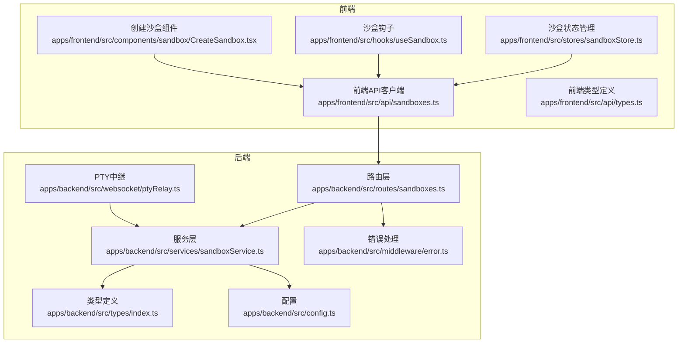
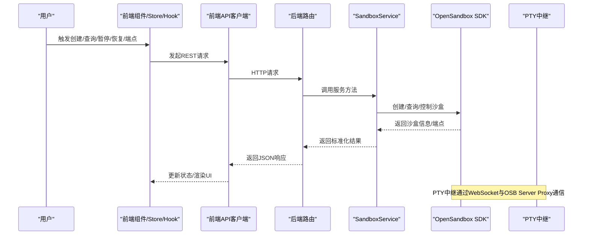
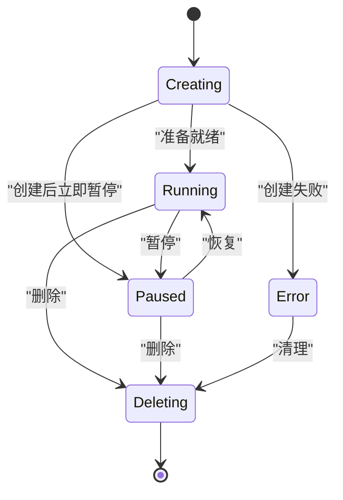
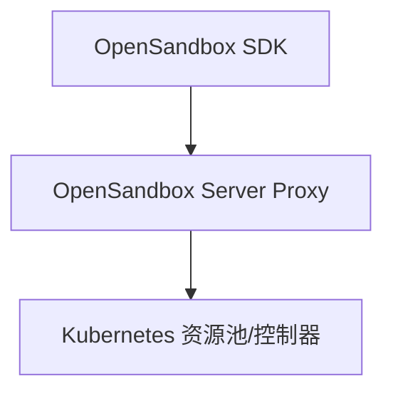
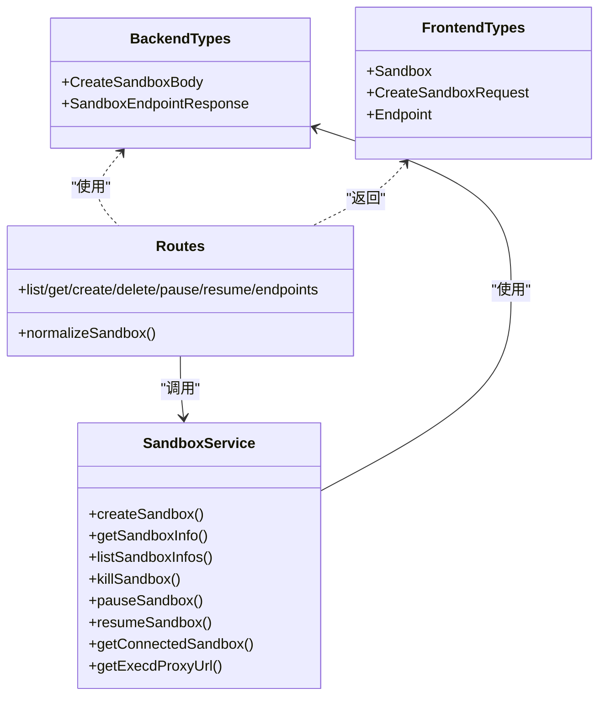

# 沙盒实体模型

<cite>
**本文引用的文件**
- [apps/backend/src/types/index.ts](file://apps/backend/src/types/index.ts)
- [apps/backend/src/services/sandboxService.ts](file://apps/backend/src/services/sandboxService.ts)
- [apps/backend/src/routes/sandboxes.ts](file://apps/backend/src/routes/sandboxes.ts)
- [apps/backend/src/config.ts](file://apps/backend/src/config.ts)
- [apps/backend/src/websocket/ptyRelay.ts](file://apps/backend/src/websocket/ptyRelay.ts)
- [apps/frontend/src/api/types.ts](file://apps/frontend/src/api/types.ts)
- [apps/frontend/src/api/sandboxes.ts](file://apps/frontend/src/api/sandboxes.ts)
- [apps/frontend/src/stores/sandboxStore.ts](file://apps/frontend/src/stores/sandboxStore.ts)
- [apps/frontend/src/hooks/useSandbox.ts](file://apps/frontend/src/hooks/useSandbox.ts)
- [apps/frontend/src/components/sandbox/CreateSandbox.tsx](file://apps/frontend/src/components/sandbox/CreateSandbox.tsx)
- [apps/backend/src/middleware/error.ts](file://apps/backend/src/middleware/error.ts)
</cite>

## 目录
1. [简介](#简介)
2. [项目结构](#项目结构)
3. [核心组件](#核心组件)
4. [架构总览](#架构总览)
5. [详细组件分析](#详细组件分析)
6. [依赖分析](#依赖分析)
7. [性能考虑](#性能考虑)
8. [故障排查指南](#故障排查指南)
9. [结论](#结论)
10. [附录](#附录)

## 简介
本文件聚焦于Sandbox Manager中的“沙盒实体模型”，系统性阐述：
- 沙盒对象的完整结构：标识符、名称、状态、资源限制、网络策略等核心字段
- CreateSandboxBody请求体模型的字段定义、验证规则与使用场景
- SandboxEndpointResponse响应模型的URL构建逻辑与端点信息
- 沙盒生命周期状态转换、资源配额管理与网络策略配置
- 沙盒创建、状态查询与配置更新的完整流程
- 沙盒与Kubernetes资源的映射关系与数据转换过程

## 项目结构
后端采用Express + OpenSandbox SDK封装，前端使用React + Zustand进行状态管理。沙盒实体模型在前后端类型定义中保持一致，并通过REST API与WebSocket进行交互。

图表来源
- [apps/frontend/src/api/sandboxes.ts:1-40](file://apps/frontend/src/api/sandboxes.ts#L1-L40)
- [apps/frontend/src/api/types.ts:1-146](file://apps/frontend/src/api/types.ts#L1-L146)
- [apps/frontend/src/stores/sandboxStore.ts:1-63](file://apps/frontend/src/stores/sandboxStore.ts#L1-L63)
- [apps/frontend/src/hooks/useSandbox.ts:1-59](file://apps/frontend/src/hooks/useSandbox.ts#L1-L59)
- [apps/frontend/src/components/sandbox/CreateSandbox.tsx:1-180](file://apps/frontend/src/components/sandbox/CreateSandbox.tsx#L1-L180)
- [apps/backend/src/routes/sandboxes.ts:1-175](file://apps/backend/src/routes/sandboxes.ts#L1-L175)
- [apps/backend/src/services/sandboxService.ts:1-148](file://apps/backend/src/services/sandboxService.ts#L1-L148)
- [apps/backend/src/types/index.ts:1-89](file://apps/backend/src/types/index.ts#L1-L89)
- [apps/backend/src/config.ts:1-71](file://apps/backend/src/config.ts#L1-L71)
- [apps/backend/src/websocket/ptyRelay.ts:1-171](file://apps/backend/src/websocket/ptyRelay.ts#L1-L171)
- [apps/backend/src/middleware/error.ts:1-48](file://apps/backend/src/middleware/error.ts#L1-L48)

章节来源
- [apps/backend/src/routes/sandboxes.ts:1-175](file://apps/backend/src/routes/sandboxes.ts#L1-L175)
- [apps/backend/src/services/sandboxService.ts:1-148](file://apps/backend/src/services/sandboxService.ts#L1-L148)
- [apps/backend/src/types/index.ts:1-89](file://apps/backend/src/types/index.ts#L1-L89)
- [apps/frontend/src/api/types.ts:1-146](file://apps/frontend/src/api/types.ts#L1-L146)

## 核心组件
- 沙盒实体模型（后端）：在类型定义中声明了沙盒对象的字段与CreateSandboxBody、SandboxEndpointResponse等请求/响应模型。
- 沙盒服务层：封装OpenSandbox SDK，负责沙盒生命周期操作、缓存与端点解析。
- 路由层：暴露REST API，统一返回格式，执行参数校验与状态归一化。
- 前端类型与API：定义与后端一致的前端模型，提供沙盒列表、创建、暂停/恢复、端点查询等接口。
- PTY中继：通过WebSocket与OpenSandbox Server Proxy建立双向透传通道，支持终端交互。

章节来源
- [apps/backend/src/types/index.ts:13-65](file://apps/backend/src/types/index.ts#L13-L65)
- [apps/backend/src/services/sandboxService.ts:11-147](file://apps/backend/src/services/sandboxService.ts#L11-L147)
- [apps/backend/src/routes/sandboxes.ts:16-32](file://apps/backend/src/routes/sandboxes.ts#L16-L32)
- [apps/frontend/src/api/types.ts:1-61](file://apps/frontend/src/api/types.ts#L1-L61)
- [apps/backend/src/websocket/ptyRelay.ts:22-171](file://apps/backend/src/websocket/ptyRelay.ts#L22-L171)

## 架构总览
下图展示了从用户操作到OpenSandbox底层的调用链路，以及沙盒实体模型在各层的流转。

图表来源
- [apps/frontend/src/api/sandboxes.ts:17-39](file://apps/frontend/src/api/sandboxes.ts#L17-L39)
- [apps/backend/src/routes/sandboxes.ts:95-174](file://apps/backend/src/routes/sandboxes.ts#L95-L174)
- [apps/backend/src/services/sandboxService.ts:62-138](file://apps/backend/src/services/sandboxService.ts#L62-L138)
- [apps/backend/src/websocket/ptyRelay.ts:40-118](file://apps/backend/src/websocket/ptyRelay.ts#L40-L118)

## 详细组件分析

### 沙盒实体模型与请求/响应类型
- 沙盒对象字段（后端类型定义）：
  - 标识符：id
  - 名称：name（可选）
  - 镜像：image（字符串形式）
  - 状态：status（字符串；SDK返回包含状态对象，路由层归一化）
  - 状态详情：statusDetail（包含状态、原因、消息、最后转换时间）
  - 时间戳：createdAt、expiresAt
  - 入口命令：entrypoint（数组）
  - 元数据：metadata（键值对）
  - 环境变量：env（键值对）
- CreateSandboxBody请求体：
  - image：必需，镜像名称
  - name：可选，沙盒名称
  - timeoutSeconds：可选，默认值在服务层设置
  - env：可选，环境变量键值对
  - metadata：可选，元数据键值对
  - resource：可选，CPU/Memory资源限制
  - networkPolicy：可选，网络策略（默认动作与出站规则）
- SandboxEndpointResponse响应：
  - url：完整URL
  - scheme：http/https
  - host：主机部分
  - port：端口（http为80，https为443）

章节来源
- [apps/backend/src/types/index.ts:13-65](file://apps/backend/src/types/index.ts#L13-L65)
- [apps/backend/src/routes/sandboxes.ts:16-32](file://apps/backend/src/routes/sandboxes.ts#L16-L32)
- [apps/frontend/src/api/types.ts:1-61](file://apps/frontend/src/api/types.ts#L1-L61)

### CreateSandboxBody字段定义、验证规则与使用场景
- 字段定义与默认值：
  - image：必填，用于指定容器镜像
  - name：可选，便于识别
  - timeoutSeconds：可选，默认在服务层设置为固定秒数
  - env/metadata/resource/networkPolicy：可选，分别用于注入环境变量、附加元数据、资源限制与网络策略
- 验证规则：
  - 路由层未做显式字段校验，主要依赖SDK内部校验
  - 前端组件在提交前对镜像必填、环境变量格式进行简单校验
- 使用场景：
  - 创建沙盒：POST /api/sandboxes
  - 前端创建表单：CreateSandbox组件负责收集字段并调用API

章节来源
- [apps/backend/src/routes/sandboxes.ts:95-105](file://apps/backend/src/routes/sandboxes.ts#L95-L105)
- [apps/backend/src/services/sandboxService.ts:62-88](file://apps/backend/src/services/sandboxService.ts#L62-L88)
- [apps/frontend/src/components/sandbox/CreateSandbox.tsx:40-71](file://apps/frontend/src/components/sandbox/CreateSandbox.tsx#L40-L71)

### SandboxEndpointResponse的URL构建逻辑
- 后端根据沙盒端口向SDK查询端点URL，随后解析scheme/host/port：
  - scheme：根据URL前缀判断http/https
  - host：去除协议前缀后的主机部分
  - port：http为80，https为443
- 前端接收该结构后可直接用于WebSocket连接或HTTP访问

章节来源
- [apps/backend/src/routes/sandboxes.ts:151-174](file://apps/backend/src/routes/sandboxes.ts#L151-L174)
- [apps/frontend/src/api/types.ts:35-40](file://apps/frontend/src/api/types.ts#L35-L40)

### 沙盒生命周期状态转换
- 状态枚举（前端类型）：Creating、Running、Paused、Error、Deleting
- 路由层对SDK返回的状态对象进行归一化，统一为字符串状态
- 前端在沙盒创建、暂停/恢复时采用轮询策略，自动刷新直到稳定
- 状态转换流程：
  - 创建：POST /api/sandboxes -> 返回Creating
  - 暂停：POST /api/sandboxes/:id/pause -> 返回Pausing（前端Store临时标记）
  - 恢复：POST /api/sandboxes/:id/resume -> 返回Resuming（前端Store临时标记）
  - 查询：GET /api/sandboxes/:id -> 返回最终稳定状态

图表来源
- [apps/frontend/src/hooks/useSandbox.ts:41-55](file://apps/frontend/src/hooks/useSandbox.ts#L41-L55)
- [apps/frontend/src/stores/sandboxStore.ts:45-61](file://apps/frontend/src/stores/sandboxStore.ts#L45-L61)
- [apps/backend/src/routes/sandboxes.ts:129-149](file://apps/backend/src/routes/sandboxes.ts#L129-L149)

### 资源配额管理
- 资源限制字段：resource.cpu、resource.memory（字符串形式）
- 在服务层创建沙盒时透传给SDK，具体解析与生效由OpenSandbox控制器处理
- 前端未提供资源配额编辑界面，仅在创建时通过表单传递

章节来源
- [apps/backend/src/types/index.ts:19](file://apps/backend/src/types/index.ts#L19)
- [apps/backend/src/services/sandboxService.ts:75-82](file://apps/backend/src/services/sandboxService.ts#L75-L82)
- [apps/frontend/src/components/sandbox/CreateSandbox.tsx:149-175](file://apps/frontend/src/components/sandbox/CreateSandbox.tsx#L149-L175)

### 网络策略配置
- 网络策略字段：networkPolicy.defaultAction、networkPolicy.egress（数组）
- 在服务层创建沙盒时透传给SDK，具体策略由OpenSandbox控制器落地
- 前端未提供网络策略编辑界面，仅在创建时通过表单传递

章节来源
- [apps/backend/src/types/index.ts:20-23](file://apps/backend/src/types/index.ts#L20-L23)
- [apps/backend/src/services/sandboxService.ts:69-82](file://apps/backend/src/services/sandboxService.ts#L69-L82)

### 沙盒与Kubernetes资源的映射关系与数据转换
- OpenSandbox通过Kubernetes资源池（Pool CRD）调度沙盒实例，后端通过SDK与Server Proxy交互
- 路由层将SDK返回的复杂状态对象归一化为前端期望的扁平结构
- PTY中继通过WebSocket与Server Proxy建立透明二进制帧通道，支持终端交互

图表来源
- [apps/backend/src/services/sandboxService.ts:31-33](file://apps/backend/src/services/sandboxService.ts#L31-L33)
- [apps/backend/src/websocket/ptyRelay.ts:96-105](file://apps/backend/src/websocket/ptyRelay.ts#L96-L105)

## 依赖分析
- 类型一致性：前端类型与后端类型严格对应，确保跨层数据契约一致
- 服务层依赖：SandboxService封装SDK，提供缓存与端点解析能力
- 路由层依赖：统一返回格式、参数提取与状态归一化
- 错误处理：中间件将SDK异常映射为HTTP状态码

图表来源
- [apps/backend/src/types/index.ts:13-65](file://apps/backend/src/types/index.ts#L13-L65)
- [apps/frontend/src/api/types.ts:1-61](file://apps/frontend/src/api/types.ts#L1-L61)
- [apps/backend/src/services/sandboxService.ts:11-147](file://apps/backend/src/services/sandboxService.ts#L11-L147)
- [apps/backend/src/routes/sandboxes.ts:16-32](file://apps/backend/src/routes/sandboxes.ts#L16-L32)

章节来源
- [apps/backend/src/types/index.ts:13-65](file://apps/backend/src/types/index.ts#L13-L65)
- [apps/frontend/src/api/types.ts:1-61](file://apps/frontend/src/api/types.ts#L1-L61)
- [apps/backend/src/services/sandboxService.ts:11-147](file://apps/backend/src/services/sandboxService.ts#L11-L147)
- [apps/backend/src/routes/sandboxes.ts:16-32](file://apps/backend/src/routes/sandboxes.ts#L16-L32)

## 性能考虑
- LRU缓存：SandboxService对已连接的Sandbox实例进行LRU缓存，减少重复连接开销
- 超时与重试：配置层提供请求超时参数，避免长时间阻塞
- PTY空闲超时：配置层提供PTY空闲超时，防止资源泄露
- 端点解析：通过SDK查询端点，避免硬编码，提升灵活性

章节来源
- [apps/backend/src/services/sandboxService.ts:17-44](file://apps/backend/src/services/sandboxService.ts#L17-L44)
- [apps/backend/src/config.ts:22-23](file://apps/backend/src/config.ts#L22-L23)
- [apps/backend/src/websocket/ptyRelay.ts:96-105](file://apps/backend/src/websocket/ptyRelay.ts#L96-L105)

## 故障排查指南
- OpenSandbox未配置：路由层在中间件中拦截并返回503错误，提示先完成初始化
- SDK异常映射：错误中间件将SDK异常映射为HTTP状态码，便于前端识别
- PTY连接失败：中继层记录握手超时、会话创建失败等日志，便于定位问题
- 状态不一致：前端在Creating/Pausing/Resuming状态下定时轮询，直至稳定

章节来源
- [apps/backend/src/routes/sandboxes.ts:34-45](file://apps/backend/src/routes/sandboxes.ts#L34-L45)
- [apps/backend/src/middleware/error.ts:33-47](file://apps/backend/src/middleware/error.ts#L33-L47)
- [apps/backend/src/websocket/ptyRelay.ts:58-66](file://apps/backend/src/websocket/ptyRelay.ts#L58-L66)
- [apps/frontend/src/hooks/useSandbox.ts:41-55](file://apps/frontend/src/hooks/useSandbox.ts#L41-L55)

## 结论
本文档系统梳理了Sandbox Manager的沙盒实体模型，覆盖字段定义、请求/响应结构、生命周期状态、资源与网络策略、端点解析与Kubernetes映射关系，并结合前后端实现给出流程图与依赖关系图。通过LRU缓存、统一错误映射与PTY中继机制，系统在易用性与稳定性之间取得平衡。

## 附录

### 沙盒创建、状态查询与配置更新的完整流程（路径指引）
- 创建沙盒
  - 前端：CreateSandbox组件收集字段并调用API
    - [apps/frontend/src/components/sandbox/CreateSandbox.tsx:40-71](file://apps/frontend/src/components/sandbox/CreateSandbox.tsx#L40-L71)
    - [apps/frontend/src/api/sandboxes.ts:21-23](file://apps/frontend/src/api/sandboxes.ts#L21-L23)
  - 后端：路由接收请求并调用服务层创建
    - [apps/backend/src/routes/sandboxes.ts:95-105](file://apps/backend/src/routes/sandboxes.ts#L95-L105)
    - [apps/backend/src/services/sandboxService.ts:62-88](file://apps/backend/src/services/sandboxService.ts#L62-L88)
- 状态查询
  - 前端：useSandbox钩子定时轮询
    - [apps/frontend/src/hooks/useSandbox.ts:12-39](file://apps/frontend/src/hooks/useSandbox.ts#L12-L39)
    - [apps/frontend/src/api/sandboxes.ts:17-19](file://apps/frontend/src/api/sandboxes.ts#L17-L19)
  - 后端：路由调用服务层获取信息并归一化
    - [apps/backend/src/routes/sandboxes.ts:107-116](file://apps/backend/src/routes/sandboxes.ts#L107-L116)
    - [apps/backend/src/routes/sandboxes.ts:16-32](file://apps/backend/src/routes/sandboxes.ts#L16-L32)
- 配置更新（暂停/恢复）
  - 前端：调用暂停/恢复API并更新本地状态
    - [apps/frontend/src/api/sandboxes.ts:29-35](file://apps/frontend/src/api/sandboxes.ts#L29-L35)
    - [apps/frontend/src/stores/sandboxStore.ts:45-61](file://apps/frontend/src/stores/sandboxStore.ts#L45-L61)
  - 后端：路由调用服务层执行暂停/恢复
    - [apps/backend/src/routes/sandboxes.ts:129-149](file://apps/backend/src/routes/sandboxes.ts#L129-L149)
- 端点查询
  - 后端：解析端点URL并拆分scheme/host/port
    - [apps/backend/src/routes/sandboxes.ts:151-174](file://apps/backend/src/routes/sandboxes.ts#L151-L174)
  - 前端：接收Endpoint结构用于连接
    - [apps/frontend/src/api/types.ts:35-40](file://apps/frontend/src/api/types.ts#L35-L40)