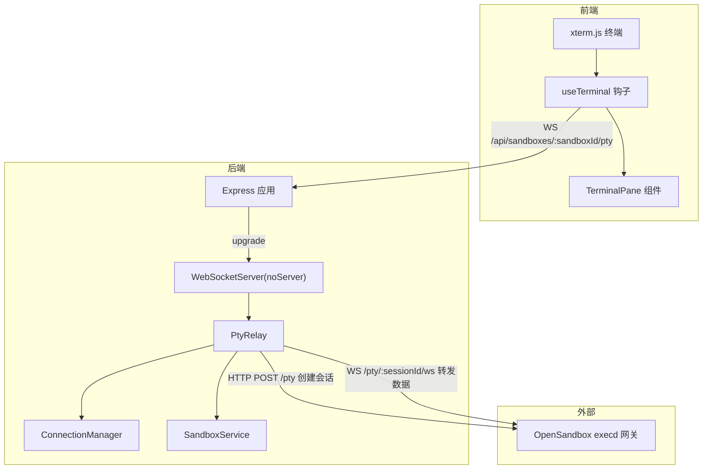
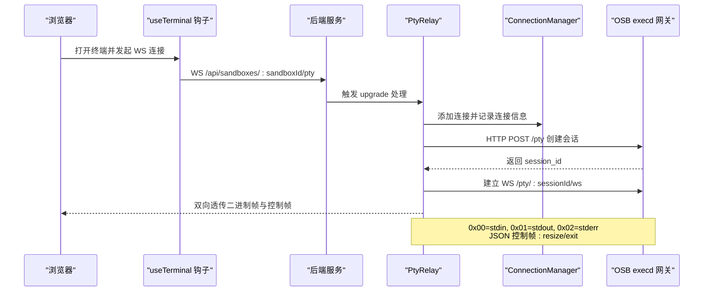
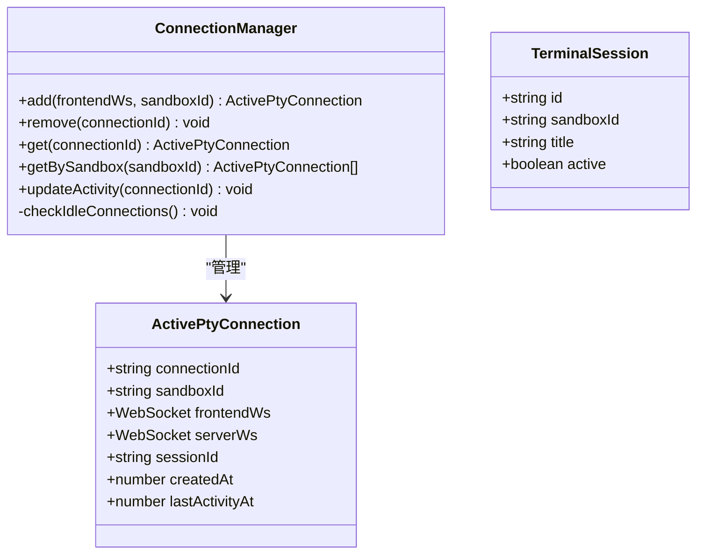
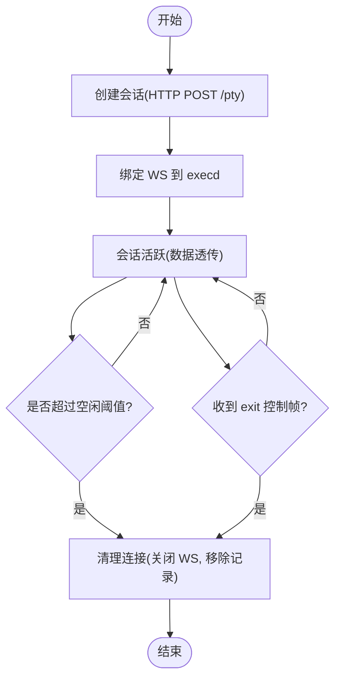
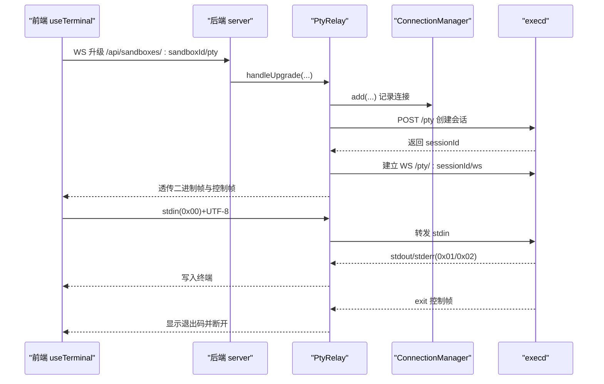
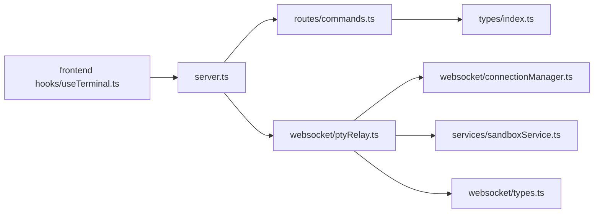

# 终端会话模型

<cite>
**本文引用的文件**
- [apps/backend/src/types/index.ts](file://apps/backend/src/types/index.ts)
- [apps/backend/src/websocket/types.ts](file://apps/backend/src/websocket/types.ts)
- [apps/backend/src/websocket/connectionManager.ts](file://apps/backend/src/websocket/connectionManager.ts)
- [apps/backend/src/websocket/ptyRelay.ts](file://apps/backend/src/websocket/ptyRelay.ts)
- [apps/backend/src/routes/commands.ts](file://apps/backend/src/routes/commands.ts)
- [apps/backend/src/services/sandboxService.ts](file://apps/backend/src/services/sandboxService.ts)
- [apps/backend/src/server.ts](file://apps/backend/src/server.ts)
- [apps/backend/src/config.ts](file://apps/backend/src/config.ts)
- [apps/frontend/src/hooks/useTerminal.ts](file://apps/frontend/src/hooks/useTerminal.ts)
- [apps/frontend/src/components/terminal/TerminalPane.tsx](file://apps/frontend/src/components/terminal/TerminalPane.tsx)
- [apps/frontend/src/stores/terminalStore.ts](file://apps/frontend/src/stores/terminalStore.ts)
</cite>

## 目录
1. [引言](#引言)
2. [项目结构](#项目结构)
3. [核心组件](#核心组件)
4. [架构总览](#架构总览)
5. [详细组件分析](#详细组件分析)
6. [依赖关系分析](#依赖关系分析)
7. [性能考量](#性能考量)
8. [故障排查指南](#故障排查指南)
9. [结论](#结论)
10. [附录](#附录)

## 引言
本文件系统性梳理 Sandbox Manager 的终端会话模型，围绕以下目标展开：  
- 深入解释 TerminalSession 数据结构的字段定义与状态管理  
- 详细说明 CreateSessionBody 与 RunInSessionBody 请求体模型的参数与使用场景  
- 阐述会话生命周期管理、超时机制与自动清理策略  
- 解释工作目录设置、环境变量传递与命令执行上下文  
- 提供终端会话创建、命令执行与状态监控的完整流程示例（以路径引用代替具体代码）  
- 描述 WebSocket 连接与终端会话的绑定关系与数据流处理机制  

## 项目结构
后端采用 Express + ws 的架构，通过自定义 WebSocket 升级处理实现 PTY 通道；前端使用 xterm.js 与 WebSocket 交互，形成“浏览器终端 → 后端中继 → OSB execd”的链路。

图表来源
- [apps/backend/src/server.ts:72-87](file://apps/backend/src/server.ts#L72-L87)
- [apps/backend/src/websocket/ptyRelay.ts:40-118](file://apps/backend/src/websocket/ptyRelay.ts#L40-L118)
- [apps/backend/src/websocket/connectionManager.ts:30-46](file://apps/backend/src/websocket/connectionManager.ts#L30-L46)
- [apps/backend/src/services/sandboxService.ts:129-138](file://apps/backend/src/services/sandboxService.ts#L129-L138)

章节来源
- [apps/backend/src/server.ts:36-90](file://apps/backend/src/server.ts#L36-L90)
- [apps/backend/src/websocket/ptyRelay.ts:9-21](file://apps/backend/src/websocket/ptyRelay.ts#L9-L21)

## 核心组件
- 终端会话数据结构与请求体模型
  - CreateSessionBody：用于在沙箱内创建交互式 Bash 会话，支持可选的工作目录参数
  - RunInSessionBody：在已存在的会话中执行命令，支持 cwd、timeoutSeconds、envs
  - TerminalSession（前端状态）：记录会话标识、所属沙箱、标题与激活状态
- WebSocket 连接与中继
  - ActivePtyConnection：后端对一次前端到 execd 的 PTY 连接的抽象，包含连接标识、沙箱标识、前后端 WebSocket、会话标识、创建与最后活跃时间等
  - ConnectionManager：维护连接表、空闲检测与清理、活动更新
  - PtyRelay：完成握手、会话创建、双向转发、错误与关闭处理
- 命令路由
  - /api/sandboxes/:sandboxId/commands/session：创建会话
  - /api/sandboxes/:sandboxId/commands/session/:sessionId/run：在会话中运行命令
  - /api/sandboxes/:sandboxId/commands/session/:sessionId/delete：删除会话
- 配置
  - ptyIdleTimeoutMs：PTy 连接空闲超时阈值，超过则自动清理

章节来源
- [apps/backend/src/types/index.ts:48-58](file://apps/backend/src/types/index.ts#L48-L58)
- [apps/backend/src/websocket/types.ts:11-19](file://apps/backend/src/websocket/types.ts#L11-L19)
- [apps/backend/src/websocket/connectionManager.ts:7-101](file://apps/backend/src/websocket/connectionManager.ts#L7-L101)
- [apps/backend/src/websocket/ptyRelay.ts:22-171](file://apps/backend/src/websocket/ptyRelay.ts#L22-L171)
- [apps/backend/src/routes/commands.ts:37-94](file://apps/backend/src/routes/commands.ts#L37-L94)
- [apps/backend/src/config.ts:21-23](file://apps/backend/src/config.ts#L21-L23)

## 架构总览
终端会话的端到端数据流如下：

图表来源
- [apps/backend/src/server.ts:75-87](file://apps/backend/src/server.ts#L75-L87)
- [apps/backend/src/websocket/ptyRelay.ts:40-118](file://apps/backend/src/websocket/ptyRelay.ts#L40-L118)
- [apps/backend/src/websocket/connectionManager.ts:30-46](file://apps/backend/src/websocket/connectionManager.ts#L30-L46)

## 详细组件分析

### 终端会话数据结构与状态管理
- TerminalSession（前端）
  - 字段：id、sandboxId、title、active
  - 状态管理：通过 Zustand store 维护会话列表，支持新增、删除、激活切换、按沙箱筛选、重命名
- ActivePtyConnection（后端）
  - 字段：connectionId、sandboxId、frontendWs、serverWs、sessionId、createdAt、lastActivityAt
  - 状态管理：由 ConnectionManager 维护 Map，提供添加、移除、按沙箱查询、更新活动时间、空闲检查与清理

图表来源
- [apps/backend/src/websocket/types.ts:11-19](file://apps/backend/src/websocket/types.ts#L11-L19)
- [apps/backend/src/websocket/connectionManager.ts:7-101](file://apps/backend/src/websocket/connectionManager.ts#L7-L101)
- [apps/frontend/src/stores/terminalStore.ts:4-18](file://apps/frontend/src/stores/terminalStore.ts#L4-L18)

章节来源
- [apps/frontend/src/stores/terminalStore.ts:20-67](file://apps/frontend/src/stores/terminalStore.ts#L20-L67)
- [apps/backend/src/websocket/types.ts:11-19](file://apps/backend/src/websocket/types.ts#L11-L19)
- [apps/backend/src/websocket/connectionManager.ts:30-100](file://apps/backend/src/websocket/connectionManager.ts#L30-L100)

### 请求体模型与使用场景
- CreateSessionBody
  - 参数：workingDirectory（可选），envs（可选）
  - 使用场景：在沙箱内创建交互式 Bash 会话，便于后续多次命令执行
  - 路径参考：[apps/backend/src/routes/commands.ts:37-53](file://apps/backend/src/routes/commands.ts#L37-L53)
- RunInSessionBody
  - 参数：command（必填）、cwd（可选）、timeoutSeconds（可选）、envs（可选）
  - 使用场景：在已存在会话中执行命令，适合长会话下的多命令交互
  - 路径参考：[apps/backend/src/routes/commands.ts:55-78](file://apps/backend/src/routes/commands.ts#L55-L78)

章节来源
- [apps/backend/src/types/index.ts:48-58](file://apps/backend/src/types/index.ts#L48-L58)
- [apps/backend/src/routes/commands.ts:37-78](file://apps/backend/src/routes/commands.ts#L37-L78)

### 会话生命周期管理、超时机制与自动清理
- 生命周期阶段
  - 创建：后端通过 SandboxService 获取 execd 代理地址，调用 /pty 创建会话并返回 sessionId
  - 绑定：后端建立到 execd 的 WS，并将 sessionId 关联到当前连接
  - 传输：前端通过 WS 发送 stdin（0x00）与控制帧（resize/exit），接收 stdout/stderr（0x01/0x02）
  - 结束：收到 execd 的 exit 控制帧或用户主动关闭，后端清理连接
- 超时与清理
  - 空闲超时：ConnectionManager 定期扫描 lastActivityAt 与 ptyIdleTimeoutMs，超时则移除连接
  - 握手超时：WebSocket 握手 10 秒未完成则失败
  - 资源回收：PtyRelay 在异常与关闭事件中确保两端 WS 关闭与连接移除
- 删除会话
  - 支持通过 DELETE /api/sandboxes/:sandboxId/commands/session/:sessionId 触发

图表来源
- [apps/backend/src/websocket/ptyRelay.ts:74-118](file://apps/backend/src/websocket/ptyRelay.ts#L74-L118)
- [apps/backend/src/websocket/connectionManager.ts:92-100](file://apps/backend/src/websocket/connectionManager.ts#L92-L100)
- [apps/backend/src/config.ts:68](file://apps/backend/src/config.ts#L68)

章节来源
- [apps/backend/src/websocket/ptyRelay.ts:40-118](file://apps/backend/src/websocket/ptyRelay.ts#L40-L118)
- [apps/backend/src/websocket/connectionManager.ts:18-28](file://apps/backend/src/websocket/connectionManager.ts#L18-L28)
- [apps/backend/src/websocket/connectionManager.ts:92-100](file://apps/backend/src/websocket/connectionManager.ts#L92-L100)
- [apps/backend/src/routes/commands.ts:80-94](file://apps/backend/src/routes/commands.ts#L80-L94)

### 工作目录、环境变量与命令执行上下文
- 工作目录
  - CreateSessionBody.workingDirectory：创建会话时指定初始工作目录
  - RunInSessionBody.cwd：在会话中执行命令时覆盖工作目录
- 环境变量
  - CreateSessionBody.envs：创建会话时注入环境变量
  - RunInSessionBody.envs：在会话中执行命令时叠加或覆盖环境变量
- 上下文传递
  - 后端通过 SandboxService 与 execd 交互，最终由 execd 在容器内启动 shell 并应用上述上下文

章节来源
- [apps/backend/src/types/index.ts:48-58](file://apps/backend/src/types/index.ts#L48-L58)
- [apps/backend/src/routes/commands.ts:37-78](file://apps/backend/src/routes/commands.ts#L37-L78)
- [apps/backend/src/services/sandboxService.ts:129-138](file://apps/backend/src/services/sandboxService.ts#L129-L138)

### WebSocket 连接与数据流处理
- 前端
  - useTerminal：建立 WS，监听 onopen/onmessage/onclose/onerror，发送 stdin（0x00+UTF-8）、resize 控制帧，接收 stdout/stderr 文本与 exit 控制帧
  - TerminalPane：渲染终端容器与连接状态指示
- 后端
  - server.ts：注册 upgrade 事件处理器，匹配 /api/sandboxes/:sandboxId/pty
  - PtyRelay.handleUpgrade：完成握手、解析 execd 代理地址、创建会话、建立到 execd 的 WS、设置双向转发
  - ConnectionManager：维护连接、空闲检测与清理

图表来源
- [apps/backend/src/server.ts:75-87](file://apps/backend/src/server.ts#L75-L87)
- [apps/backend/src/websocket/ptyRelay.ts:40-118](file://apps/backend/src/websocket/ptyRelay.ts#L40-L118)
- [apps/frontend/src/hooks/useTerminal.ts:25-95](file://apps/frontend/src/hooks/useTerminal.ts#L25-L95)

章节来源
- [apps/backend/src/server.ts:72-87](file://apps/backend/src/server.ts#L72-L87)
- [apps/backend/src/websocket/ptyRelay.ts:120-169](file://apps/backend/src/websocket/ptyRelay.ts#L120-L169)
- [apps/frontend/src/hooks/useTerminal.ts:127-144](file://apps/frontend/src/hooks/useTerminal.ts#L127-L144)

### 典型使用流程（路径指引）
- 创建会话
  - 步骤：调用 POST /api/sandboxes/{sandboxId}/commands/session，携带 CreateSessionBody
  - 返回：包含 sessionId
  - 路径参考：[apps/backend/src/routes/commands.ts:37-53](file://apps/backend/src/routes/commands.ts#L37-L53)
- 在会话中执行命令
  - 步骤：调用 POST /api/sandboxes/{sandboxId}/commands/session/{sessionId}/run，携带 RunInSessionBody
  - 返回：包含命令执行结果（退出码、stdout、stderr、耗时）
  - 路径参考：[apps/backend/src/routes/commands.ts:55-78](file://apps/backend/src/routes/commands.ts#L55-L78)
- 删除会话
  - 步骤：调用 DELETE /api/sandboxes/{sandboxId}/commands/session/{sessionId}
  - 路径参考：[apps/backend/src/routes/commands.ts:80-94](file://apps/backend/src/routes/commands.ts#L80-L94)
- 前端连接与显示
  - 步骤：TerminalPane 接收 sandboxId 与 sessionId，useTerminal 建立 WS 并渲染终端
  - 路径参考：[apps/frontend/src/components/terminal/TerminalPane.tsx:8-37](file://apps/frontend/src/components/terminal/TerminalPane.tsx#L8-L37), [apps/frontend/src/hooks/useTerminal.ts:12-95](file://apps/frontend/src/hooks/useTerminal.ts#L12-L95)

## 依赖关系分析
- 组件耦合
  - server.ts 将路由、WebSocket 升级、服务实例注入 app.locals，PtyRelay 依赖 SandboxService 与 ConnectionManager
  - PtyRelay 与 ConnectionManager 通过 ActivePtyConnection 协同，前者负责网络层，后者负责生命周期与空闲清理
- 外部依赖
  - OpenSandbox execd：作为会话执行与数据转发的网关
  - xterm.js：前端终端渲染与输入输出处理

图表来源
- [apps/backend/src/server.ts:50-64](file://apps/backend/src/server.ts#L50-L64)
- [apps/backend/src/routes/commands.ts:1-6](file://apps/backend/src/routes/commands.ts#L1-L6)
- [apps/backend/src/websocket/ptyRelay.ts:22-38](file://apps/backend/src/websocket/ptyRelay.ts#L22-L38)
- [apps/backend/src/websocket/connectionManager.ts:7-16](file://apps/backend/src/websocket/connectionManager.ts#L7-L16)
- [apps/backend/src/services/sandboxService.ts:11-47](file://apps/backend/src/services/sandboxService.ts#L11-L47)
- [apps/backend/src/types/index.ts:1-89](file://apps/backend/src/types/index.ts#L1-L89)

章节来源
- [apps/backend/src/server.ts:50-64](file://apps/backend/src/server.ts#L50-L64)
- [apps/backend/src/websocket/ptyRelay.ts:22-38](file://apps/backend/src/websocket/ptyRelay.ts#L22-L38)
- [apps/backend/src/websocket/connectionManager.ts:7-16](file://apps/backend/src/websocket/connectionManager.ts#L7-L16)
- [apps/backend/src/services/sandboxService.ts:11-47](file://apps/backend/src/services/sandboxService.ts#L11-L47)
- [apps/backend/src/types/index.ts:1-89](file://apps/backend/src/types/index.ts#L1-L89)

## 性能考量
- 透明转发：PtyRelay 对二进制帧进行透传，避免额外编码/解码开销
- 空闲清理：定期扫描与阈值控制降低无效连接占用
- 终端适配：前端使用 FitAddon 动态适配容器尺寸，减少重绘与滚动抖动
- 超时与重连：前端指数退避重连，避免风暴式重试

## 故障排查指南
- WebSocket 握手失败
  - 现象：后端日志出现握手超时或升级失败
  - 排查：确认 URL 匹配 /api/sandboxes/:sandboxId/pty，检查后端 upgrade 处理逻辑
  - 路径参考：[apps/backend/src/server.ts:75-87](file://apps/backend/src/server.ts#L75-L87), [apps/backend/src/websocket/ptyRelay.ts:58-66](file://apps/backend/src/websocket/ptyRelay.ts#L58-L66)
- 会话创建失败
  - 现象：HTTP POST /pty 返回非 2xx
  - 排查：检查 SandboxService.getExecdProxyUrl 返回的 URL 与 headers，确认 execd 网关可达
  - 路径参考：[apps/backend/src/websocket/ptyRelay.ts:70-89](file://apps/backend/src/websocket/ptyRelay.ts#L70-L89), [apps/backend/src/services/sandboxService.ts:129-138](file://apps/backend/src/services/sandboxService.ts#L129-L138)
- 连接被空闲清理
  - 现象：长时间无输入输出后连接断开
  - 排查：调整 ptyIdleTimeoutMs，或在前端持续发送 resize 帧保持活跃
  - 路径参考：[apps/backend/src/websocket/connectionManager.ts:92-100](file://apps/backend/src/websocket/connectionManager.ts#L92-L100), [apps/backend/src/config.ts:68](file://apps/backend/src/config.ts#L68)
- 前端无法连接
  - 现象：onerror 或反复重连
  - 排查：确认协议（ws/wss）、主机与端口，检查 CORS 配置
  - 路径参考：[apps/frontend/src/hooks/useTerminal.ts:25-95](file://apps/frontend/src/hooks/useTerminal.ts#L25-L95)

章节来源
- [apps/backend/src/server.ts:75-87](file://apps/backend/src/server.ts#L75-L87)
- [apps/backend/src/websocket/ptyRelay.ts:70-118](file://apps/backend/src/websocket/ptyRelay.ts#L70-L118)
- [apps/backend/src/websocket/connectionManager.ts:92-100](file://apps/backend/src/websocket/connectionManager.ts#L92-L100)
- [apps/frontend/src/hooks/useTerminal.ts:25-95](file://apps/frontend/src/hooks/useTerminal.ts#L25-L95)

## 结论
Sandbox Manager 的终端会话模型通过“前端 xterm.js + 后端 PtyRelay + OpenSandbox execd”的组合，实现了低延迟、高透明度的交互式终端体验。后端以 ConnectionManager 与 ActivePtyConnection 管理连接生命周期，结合空闲超时与自动清理，保障资源健康；前端通过 useTerminal 提供稳定的连接、重连与渲染能力。CreateSessionBody 与 RunInSessionBody 为会话创建与命令执行提供了清晰的上下文控制点，满足多样化使用场景。

## 附录
- 关键配置项
  - ptyIdleTimeoutMs：PTy 连接空闲超时（毫秒）
  - 路径参考：[apps/backend/src/config.ts:68](file://apps/backend/src/config.ts#L68)
- 请求体模型定义
  - CreateSessionBody：workingDirectory、envs
  - RunInSessionBody：command、cwd、timeoutSeconds、envs
  - 路径参考：[apps/backend/src/types/index.ts:48-58](file://apps/backend/src/types/index.ts#L48-L58)