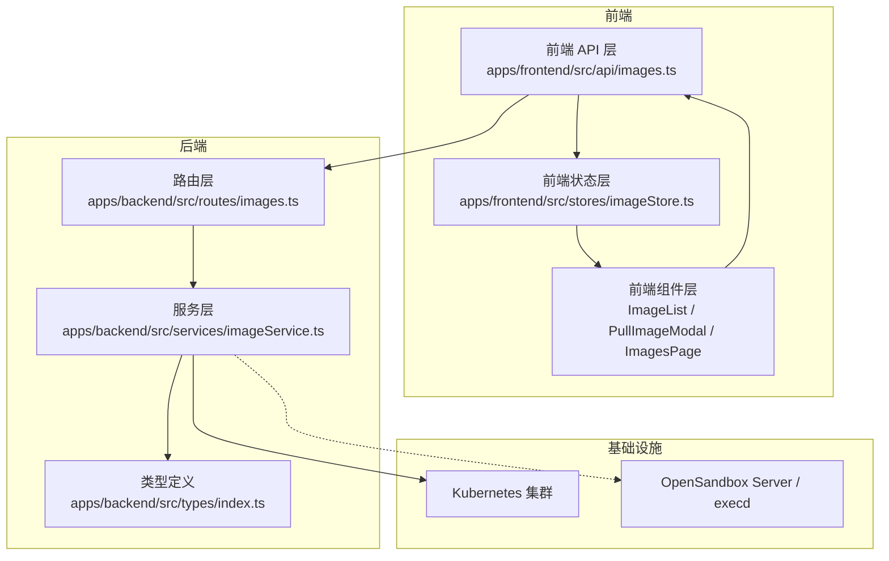
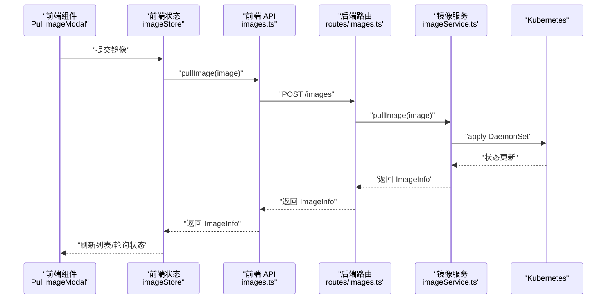
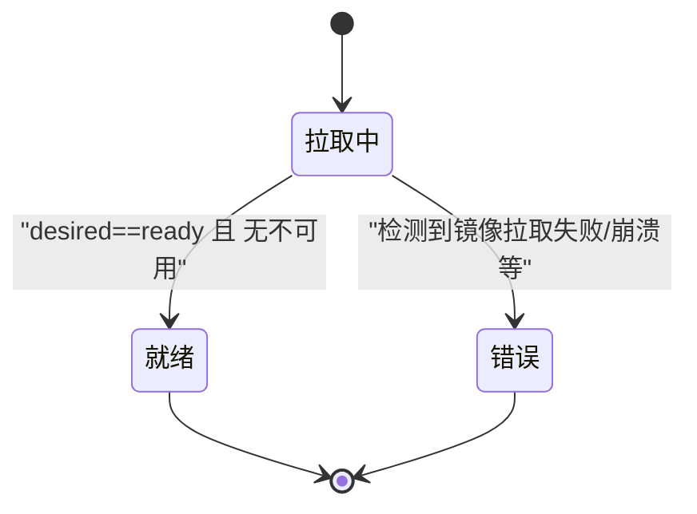
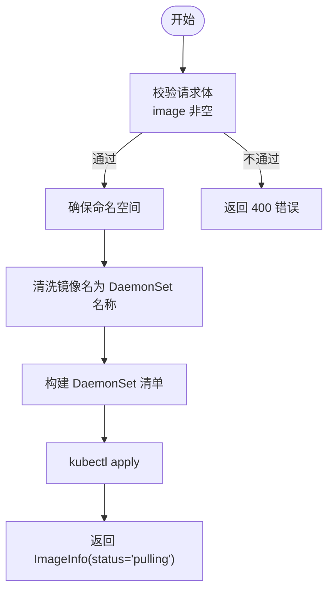
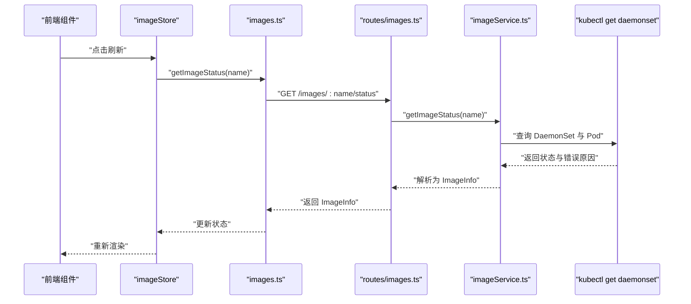
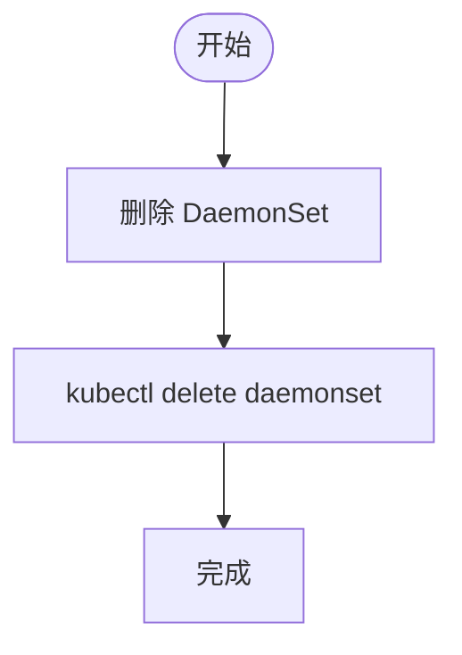
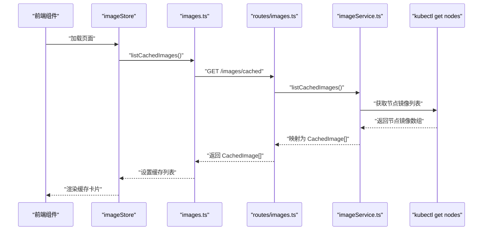
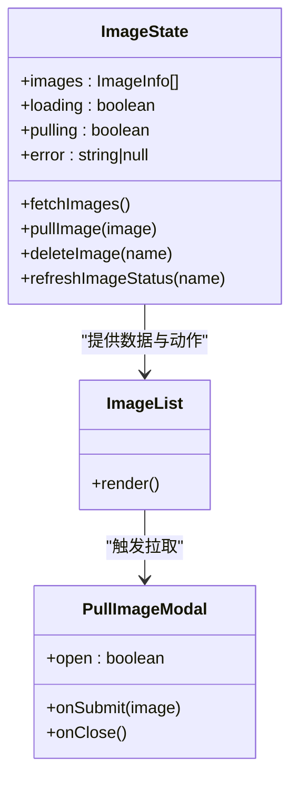
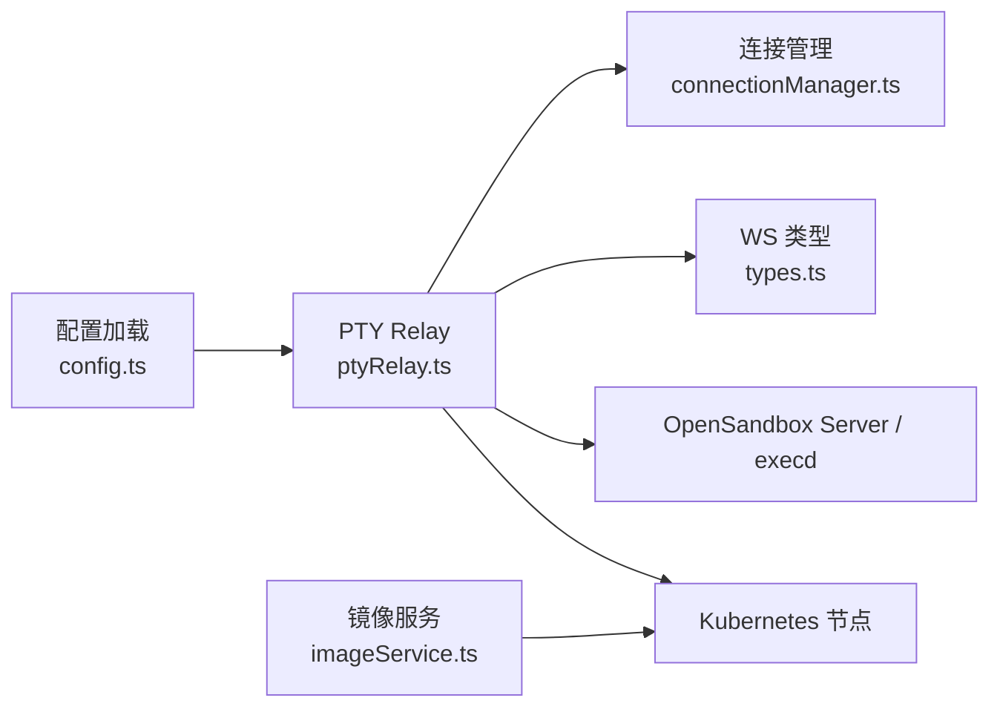
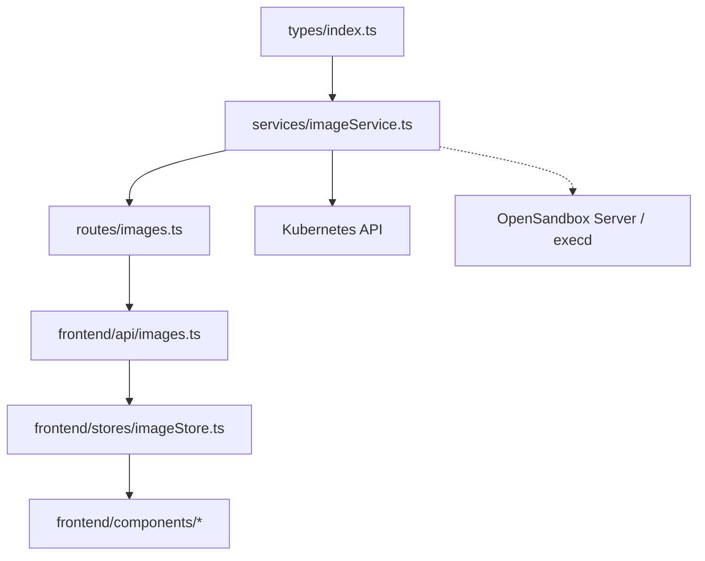

# 镜像管理模型

<cite>
**本文引用的文件**
- [apps/backend/src/types/index.ts](file://apps/backend/src/types/index.ts)
- [apps/backend/src/services/imageService.ts](file://apps/backend/src/services/imageService.ts)
- [apps/backend/src/routes/images.ts](file://apps/backend/src/routes/images.ts)
- [apps/frontend/src/api/images.ts](file://apps/frontend/src/api/images.ts)
- [apps/frontend/src/stores/imageStore.ts](file://apps/frontend/src/stores/imageStore.ts)
- [apps/frontend/src/api/types.ts](file://apps/frontend/src/api/types.ts)
- [apps/frontend/src/components/images/ImageList.tsx](file://apps/frontend/src/components/images/ImageList.tsx)
- [apps/frontend/src/components/images/PullImageModal.tsx](file://apps/frontend/src/components/images/PullImageModal.tsx)
- [apps/frontend/src/pages/ImagesPage.tsx](file://apps/frontend/src/pages/ImagesPage.tsx)
- [apps/backend/src/config.ts](file://apps/backend/src/config.ts)
- [apps/backend/src/websocket/ptyRelay.ts](file://apps/backend/src/websocket/ptyRelay.ts)
- [apps/backend/src/websocket/connectionManager.ts](file://apps/backend/src/websocket/connectionManager.ts)
- [apps/backend/src/websocket/types.ts](file://apps/backend/src/websocket/types.ts)
- [infra/opensandbox/values-production.yaml](file://infra/opensandbox/values-production.yaml)
</cite>

## 目录
1. [简介](#简介)
2. [项目结构](#项目结构)
3. [核心组件](#核心组件)
4. [架构总览](#架构总览)
5. [详细组件分析](#详细组件分析)
6. [依赖关系分析](#依赖关系分析)
7. [性能考量](#性能考量)
8. [故障排查指南](#故障排查指南)
9. [结论](#结论)
10. [附录](#附录)

## 简介
本文件系统性梳理 Sandbox Manager 的镜像管理模型，围绕以下目标展开：
- 深入解释 ImageInfo 实体的完整结构（镜像名称、状态、节点分布、消息字段）
- 详述 CachedImage 模型的节点缓存信息与大小统计
- 解释 PullImageBody 请求体的镜像拉取配置与进度跟踪机制
- 阐述镜像状态管理、节点亲和性与缓存策略的实现逻辑
- 提供镜像拉取、状态查询与缓存清理的端到端流程图与路径指引
- 描述镜像与 OpenSandbox SDK 的集成方式及与 Kubernetes 节点的协调机制

## 项目结构
镜像管理功能横跨后端服务层、前端 API 层与前端 UI 层，并通过 Kubernetes DaemonSet 实现节点级缓存预热。关键模块如下：
- 后端类型定义：定义 ImageInfo、PullImageBody、CachedImage 等数据模型
- 后端服务层：ImageService 封装镜像拉取、状态查询、缓存列表与删除等操作
- 后端路由层：暴露 /images 及其子路径的 REST 接口
- 前端 API 层：封装对后端接口的调用
- 前端状态与组件：使用 Zustand 管理镜像状态，组件负责展示与交互
- OpenSandbox 集成：通过 execd 与 OpenSandbox Server 协作，支持终端会话与工作负载运行

**图表来源**
- [apps/frontend/src/api/images.ts:1-23](file://apps/frontend/src/api/images.ts#L1-L23)
- [apps/frontend/src/stores/imageStore.ts:1-60](file://apps/frontend/src/stores/imageStore.ts#L1-L60)
- [apps/frontend/src/components/images/ImageList.tsx:1-51](file://apps/frontend/src/components/images/ImageList.tsx#L1-L51)
- [apps/frontend/src/components/images/PullImageModal.tsx:1-99](file://apps/frontend/src/components/images/PullImageModal.tsx#L1-L99)
- [apps/frontend/src/pages/ImagesPage.tsx:1-44](file://apps/frontend/src/pages/ImagesPage.tsx#L1-L44)
- [apps/backend/src/routes/images.ts:1-78](file://apps/backend/src/routes/images.ts#L1-L78)
- [apps/backend/src/services/imageService.ts:1-386](file://apps/backend/src/services/imageService.ts#L1-L386)
- [apps/backend/src/types/index.ts:67-89](file://apps/backend/src/types/index.ts#L67-L89)

**章节来源**
- [apps/backend/src/types/index.ts:67-89](file://apps/backend/src/types/index.ts#L67-L89)
- [apps/backend/src/services/imageService.ts:95-385](file://apps/backend/src/services/imageService.ts#L95-L385)
- [apps/backend/src/routes/images.ts:1-78](file://apps/backend/src/routes/images.ts#L1-L78)
- [apps/frontend/src/api/images.ts:1-23](file://apps/frontend/src/api/images.ts#L1-L23)
- [apps/frontend/src/stores/imageStore.ts:1-60](file://apps/frontend/src/stores/imageStore.ts#L1-L60)
- [apps/frontend/src/components/images/ImageList.tsx:1-51](file://apps/frontend/src/components/images/ImageList.tsx#L1-L51)
- [apps/frontend/src/components/images/PullImageModal.tsx:1-99](file://apps/frontend/src/components/images/PullImageModal.tsx#L1-L99)
- [apps/frontend/src/pages/ImagesPage.tsx:1-44](file://apps/frontend/src/pages/ImagesPage.tsx#L1-L44)

## 核心组件
本节聚焦镜像管理的关键数据模型与服务方法。

- ImageInfo 实体
  - 字段说明
    - name：显示名称（从镜像引用推导）
    - image：原始镜像引用（含仓库/标签）
    - status：镜像状态，取值为 pulling、ready、error
    - daemonSetName：用于标识该镜像的 DaemonSet 名称
    - createdAt：资源创建时间
    - nodesReady：就绪节点数
    - nodesTotal：期望调度节点总数
    - message：可选错误或进度信息
  - 用途：用于前端展示镜像拉取进度与状态，以及节点覆盖情况

- PullImageBody 请求体
  - 字段说明
    - image：待拉取的镜像引用
  - 用途：POST /images 接口接收该请求体，触发后端创建对应 DaemonSet 进行全节点预拉取

- CachedImage 模型
  - 字段说明
    - image：节点上存在的镜像名称
    - node：所在节点名
    - sizeBytes：镜像占用字节数（可选）
  - 用途：列出集群各节点已缓存的镜像清单，便于运维观察与容量评估

- ImageService 关键方法
  - ensureNamespace：确保命名空间存在
  - listImages：列出所有受管的预拉取镜像（基于 DaemonSet）
  - pullImage：创建 DaemonSet 触发全节点拉取
  - getImageStatus：查询指定 DaemonSet 的状态
  - deleteImage：删除指定 DaemonSet
  - listCachedImages：收集各节点镜像缓存信息

**章节来源**
- [apps/backend/src/types/index.ts:69-88](file://apps/backend/src/types/index.ts#L69-L88)
- [apps/backend/src/services/imageService.ts:95-385](file://apps/backend/src/services/imageService.ts#L95-L385)

## 架构总览
镜像管理采用“后端服务 + Kubernetes DaemonSet + 前端 UI”的协作模式：
- 后端通过 kubectl 操作 DaemonSet，实现镜像在所有节点的预拉取
- 前端通过 API 层与状态层驱动 UI 行为，轮询状态并展示节点覆盖
- OpenSandbox 侧通过 execd 与 Server 协同，支撑容器化沙箱运行；镜像预拉取提升后续创建工作负载时的启动速度

**图表来源**
- [apps/frontend/src/components/images/PullImageModal.tsx:20-41](file://apps/frontend/src/components/images/PullImageModal.tsx#L20-L41)
- [apps/frontend/src/stores/imageStore.ts:33-44](file://apps/frontend/src/stores/imageStore.ts#L33-L44)
- [apps/frontend/src/api/images.ts:8-10](file://apps/frontend/src/api/images.ts#L8-L10)
- [apps/backend/src/routes/images.ts:36-53](file://apps/backend/src/routes/images.ts#L36-L53)
- [apps/backend/src/services/imageService.ts:227-294](file://apps/backend/src/services/imageService.ts#L227-L294)

## 详细组件分析

### 数据模型与状态机
- ImageInfo 状态机
  - 初始：pulling（创建 DaemonSet 后立即返回）
  - 进行中：根据 DaemonSet 状态与 Pod 容器等待原因判断
  - 结束态：ready 或 error（包含错误消息）

**图表来源**
- [apps/backend/src/services/imageService.ts:38-93](file://apps/backend/src/services/imageService.ts#L38-L93)

**章节来源**
- [apps/backend/src/services/imageService.ts:38-93](file://apps/backend/src/services/imageService.ts#L38-L93)

### 镜像拉取流程（PullImageBody 与 DaemonSet 创建）
- 请求体解析：后端路由校验 image 字段非空
- 命名规范：镜像引用经清洗生成合法的 DaemonSet 名称
- 资源创建：构造 DaemonSet 清单（initContainer 仅用于触发拉取），应用至命名空间
- 返回结构：立即返回 ImageInfo（status=pulling，nodesReady=0）

**图表来源**
- [apps/backend/src/routes/images.ts:36-53](file://apps/backend/src/routes/images.ts#L36-L53)
- [apps/backend/src/services/imageService.ts:105-116](file://apps/backend/src/services/imageService.ts#L105-L116)
- [apps/backend/src/services/imageService.ts:227-294](file://apps/backend/src/services/imageService.ts#L227-L294)

**章节来源**
- [apps/backend/src/routes/images.ts:36-53](file://apps/backend/src/routes/images.ts#L36-L53)
- [apps/backend/src/services/imageService.ts:12-22](file://apps/backend/src/services/imageService.ts#L12-L22)
- [apps/backend/src/services/imageService.ts:227-294](file://apps/backend/src/services/imageService.ts#L227-L294)

### 状态查询与节点覆盖
- 查询入口：GET /images/:name/status
- 状态解析：读取 DaemonSet 状态，结合 Pod 容器等待原因与条件消息，判定 ready/error
- 覆盖统计：nodesReady 与 nodesTotal 来自 DaemonSet 状态字段

**图表来源**
- [apps/frontend/src/stores/imageStore.ts:51-58](file://apps/frontend/src/stores/imageStore.ts#L51-L58)
- [apps/frontend/src/api/images.ts:12-14](file://apps/frontend/src/api/images.ts#L12-L14)
- [apps/backend/src/routes/images.ts:55-65](file://apps/backend/src/routes/images.ts#L55-L65)
- [apps/backend/src/services/imageService.ts:299-317](file://apps/backend/src/services/imageService.ts#L299-L317)

**章节来源**
- [apps/frontend/src/stores/imageStore.ts:51-58](file://apps/frontend/src/stores/imageStore.ts#L51-L58)
- [apps/frontend/src/api/images.ts:12-14](file://apps/frontend/src/api/images.ts#L12-L14)
- [apps/backend/src/routes/images.ts:55-65](file://apps/backend/src/routes/images.ts#L55-L65)
- [apps/backend/src/services/imageService.ts:299-317](file://apps/backend/src/services/imageService.ts#L299-L317)

### 缓存清理与节点亲和性
- 删除镜像：DELETE /images/:name，删除对应的 DaemonSet
- 节点亲和性：DaemonSet 使用默认调度，自动在所有符合条件的节点上创建 Pod，从而实现节点亲和
- 缓存清理：删除 DaemonSet 后，节点上的镜像缓存由底层运行时按策略回收

**图表来源**
- [apps/backend/src/routes/images.ts:67-77](file://apps/backend/src/routes/images.ts#L67-L77)
- [apps/backend/src/services/imageService.ts:322-339](file://apps/backend/src/services/imageService.ts#L322-L339)

**章节来源**
- [apps/backend/src/routes/images.ts:67-77](file://apps/backend/src/routes/images.ts#L67-L77)
- [apps/backend/src/services/imageService.ts:322-339](file://apps/backend/src/services/imageService.ts#L322-L339)

### 节点缓存信息与大小统计
- 列表接口：GET /images/cached
- 数据来源：kubectl get nodes -o json，遍历每个节点的 status.images，提取 names 与 sizeBytes
- 输出格式：数组项为 CachedImage，包含 image、node、sizeBytes

**图表来源**
- [apps/frontend/src/api/images.ts:20-22](file://apps/frontend/src/api/images.ts#L20-L22)
- [apps/frontend/src/stores/imageStore.ts:1-60](file://apps/frontend/src/stores/imageStore.ts#L1-L60)
- [apps/backend/src/routes/images.ts:14-23](file://apps/backend/src/routes/images.ts#L14-L23)
- [apps/backend/src/services/imageService.ts:344-384](file://apps/backend/src/services/imageService.ts#L344-L384)

**章节来源**
- [apps/frontend/src/api/images.ts:20-22](file://apps/frontend/src/api/images.ts#L20-L22)
- [apps/backend/src/routes/images.ts:14-23](file://apps/backend/src/routes/images.ts#L14-L23)
- [apps/backend/src/services/imageService.ts:344-384](file://apps/backend/src/services/imageService.ts#L344-L384)

### 前端交互与状态管理
- 页面入口：ImagesPage 负责加载镜像列表与弹窗控制
- 弹窗组件：PullImageModal 支持预设镜像与自定义输入
- 列表组件：ImageList 展示镜像卡片，支持删除与刷新
- 状态层：imageStore 统一管理 images、loading、pulling、error，并提供 fetchImages、pullImage、deleteImage、refreshImageStatus

**图表来源**
- [apps/frontend/src/stores/imageStore.ts:5-15](file://apps/frontend/src/stores/imageStore.ts#L5-L15)
- [apps/frontend/src/components/images/ImageList.tsx:4-50](file://apps/frontend/src/components/images/ImageList.tsx#L4-L50)
- [apps/frontend/src/components/images/PullImageModal.tsx:20-41](file://apps/frontend/src/components/images/PullImageModal.tsx#L20-L41)

**章节来源**
- [apps/frontend/src/pages/ImagesPage.tsx:9-43](file://apps/frontend/src/pages/ImagesPage.tsx#L9-L43)
- [apps/frontend/src/components/images/ImageList.tsx:4-50](file://apps/frontend/src/components/images/ImageList.tsx#L4-L50)
- [apps/frontend/src/components/images/PullImageModal.tsx:20-41](file://apps/frontend/src/components/images/PullImageModal.tsx#L20-L41)
- [apps/frontend/src/stores/imageStore.ts:17-59](file://apps/frontend/src/stores/imageStore.ts#L17-L59)

### 与 OpenSandbox SDK 的集成与 Kubernetes 协调
- OpenSandbox 配置：通过环境变量加载 OPENSANDBOX_* 配置，决定协议、超时与代理行为
- execd 通道：PTY Relay 通过 OpenSandbox Server 获取 execd 代理地址，建立双向 WebSocket，转发二进制帧与控制消息
- 镜像与工作负载：镜像预拉取提升后续沙箱创建的启动速度；OpenSandbox 在 Kubernetes 上以 batchsandbox 等方式编排工作负载

**图表来源**
- [apps/backend/src/config.ts:48-70](file://apps/backend/src/config.ts#L48-L70)
- [apps/backend/src/websocket/ptyRelay.ts:22-171](file://apps/backend/src/websocket/ptyRelay.ts#L22-L171)
- [apps/backend/src/websocket/connectionManager.ts:7-102](file://apps/backend/src/websocket/connectionManager.ts#L7-L102)
- [apps/backend/src/websocket/types.ts:4-20](file://apps/backend/src/websocket/types.ts#L4-L20)
- [apps/backend/src/services/imageService.ts:95-385](file://apps/backend/src/services/imageService.ts#L95-L385)

**章节来源**
- [apps/backend/src/config.ts:48-70](file://apps/backend/src/config.ts#L48-L70)
- [apps/backend/src/websocket/ptyRelay.ts:22-171](file://apps/backend/src/websocket/ptyRelay.ts#L22-L171)
- [apps/backend/src/websocket/connectionManager.ts:7-102](file://apps/backend/src/websocket/connectionManager.ts#L7-L102)
- [apps/backend/src/websocket/types.ts:4-20](file://apps/backend/src/websocket/types.ts#L4-L20)
- [apps/backend/src/services/imageService.ts:95-385](file://apps/backend/src/services/imageService.ts#L95-L385)

## 依赖关系分析
- 类型依赖
  - 后端类型定义被服务层与路由层共同引用
- 服务依赖
  - ImageService 依赖 runCommand 执行 kubectl 操作
  - 前端 API 依赖统一的 request 封装
- UI 依赖
  - 组件依赖状态层，状态层依赖 API 层
- 基础设施依赖
  - 镜像缓存与状态查询依赖 Kubernetes API
  - OpenSandbox 集成依赖 Server 代理与 execd

**图表来源**
- [apps/backend/src/types/index.ts:67-89](file://apps/backend/src/types/index.ts#L67-L89)
- [apps/backend/src/services/imageService.ts:1-4](file://apps/backend/src/services/imageService.ts#L1-L4)
- [apps/backend/src/routes/images.ts:1-7](file://apps/backend/src/routes/images.ts#L1-L7)
- [apps/frontend/src/api/images.ts:1-2](file://apps/frontend/src/api/images.ts#L1-L2)
- [apps/frontend/src/stores/imageStore.ts:1-3](file://apps/frontend/src/stores/imageStore.ts#L1-L3)
- [apps/frontend/src/components/images/ImageList.tsx:1-2](file://apps/frontend/src/components/images/ImageList.tsx#L1-L2)
- [apps/frontend/src/components/images/PullImageModal.tsx:1-3](file://apps/frontend/src/components/images/PullImageModal.tsx#L1-L3)

**章节来源**
- [apps/backend/src/types/index.ts:67-89](file://apps/backend/src/types/index.ts#L67-L89)
- [apps/backend/src/services/imageService.ts:1-4](file://apps/backend/src/services/imageService.ts#L1-L4)
- [apps/backend/src/routes/images.ts:1-7](file://apps/backend/src/routes/images.ts#L1-L7)
- [apps/frontend/src/api/images.ts:1-2](file://apps/frontend/src/api/images.ts#L1-L2)
- [apps/frontend/src/stores/imageStore.ts:1-3](file://apps/frontend/src/stores/imageStore.ts#L1-L3)
- [apps/frontend/src/components/images/ImageList.tsx:1-2](file://apps/frontend/src/components/images/ImageList.tsx#L1-L2)
- [apps/frontend/src/components/images/PullImageModal.tsx:1-3](file://apps/frontend/src/components/images/PullImageModal.tsx#L1-L3)

## 性能考量
- DaemonSet 并发拉取：全节点拉取可能产生网络与存储压力，建议在业务低峰期执行
- 状态轮询：前端应避免过于频繁地轮询 /images/:name/status，可在 UI 中加入节流或基于事件的增量更新
- 缓存列表开销：listCachedImages 需要访问所有节点状态，建议限制刷新频率或分页展示
- 日志与可观测性：服务层记录关键步骤与错误，便于定位问题与优化性能

## 故障排查指南
- 镜像拉取失败
  - 现象：status=error，message 包含镜像拉取相关错误
  - 排查：检查镜像名称是否正确、镜像仓库可达性、认证配置
  - 参考路径：[apps/backend/src/services/imageService.ts:54-81](file://apps/backend/src/services/imageService.ts#L54-L81)
- DaemonSet 不存在
  - 现象：查询状态时报 NotFound
  - 排查：确认镜像名称与 daemonSetName 是否一致
  - 参考路径：[apps/backend/src/services/imageService.ts:307-312](file://apps/backend/src/services/imageService.ts#L307-L312)
- 删除失败
  - 现象：删除报 NotFound 或权限不足
  - 排查：确认命名空间与 RBAC 权限
  - 参考路径：[apps/backend/src/services/imageService.ts:331-336](file://apps/backend/src/services/imageService.ts#L331-L336)
- 前端无数据
  - 现象：列表为空或缓存列表为空
  - 排查：确认后端路由与 API 调用链路正常
  - 参考路径：[apps/frontend/src/api/images.ts:4-22](file://apps/frontend/src/api/images.ts#L4-L22)

**章节来源**
- [apps/backend/src/services/imageService.ts:54-81](file://apps/backend/src/services/imageService.ts#L54-L81)
- [apps/backend/src/services/imageService.ts:307-312](file://apps/backend/src/services/imageService.ts#L307-L312)
- [apps/backend/src/services/imageService.ts:331-336](file://apps/backend/src/services/imageService.ts#L331-L336)
- [apps/frontend/src/api/images.ts:4-22](file://apps/frontend/src/api/images.ts#L4-L22)

## 结论
Sandbox Manager 的镜像管理模型以 Kubernetes DaemonSet 为核心，实现了全节点镜像预拉取与状态可视化。通过清晰的数据模型（ImageInfo、PullImageBody、CachedImage）与稳健的服务层实现（ImageService），配合前端的状态与组件层，提供了完整的镜像生命周期管理能力。同时，与 OpenSandbox SDK 的集成确保了后续沙箱创建的高效启动与稳定运行。

## 附录
- 端到端流程参考路径
  - 拉取镜像：[apps/frontend/src/components/images/PullImageModal.tsx:20-41](file://apps/frontend/src/components/images/PullImageModal.tsx#L20-L41) → [apps/frontend/src/stores/imageStore.ts:33-44](file://apps/frontend/src/stores/imageStore.ts#L33-L44) → [apps/frontend/src/api/images.ts:8-10](file://apps/frontend/src/api/images.ts#L8-L10) → [apps/backend/src/routes/images.ts:36-53](file://apps/backend/src/routes/images.ts#L36-L53) → [apps/backend/src/services/imageService.ts:227-294](file://apps/backend/src/services/imageService.ts#L227-L294)
  - 查询状态：[apps/frontend/src/stores/imageStore.ts:51-58](file://apps/frontend/src/stores/imageStore.ts#L51-L58) → [apps/frontend/src/api/images.ts:12-14](file://apps/frontend/src/api/images.ts#L12-L14) → [apps/backend/src/routes/images.ts:55-65](file://apps/backend/src/routes/images.ts#L55-L65) → [apps/backend/src/services/imageService.ts:299-317](file://apps/backend/src/services/imageService.ts#L299-L317)
  - 缓存清理：[apps/backend/src/routes/images.ts:67-77](file://apps/backend/src/routes/images.ts#L67-L77) → [apps/backend/src/services/imageService.ts:322-339](file://apps/backend/src/services/imageService.ts#L322-L339)
  - 节点缓存列表：[apps/frontend/src/api/images.ts:20-22](file://apps/frontend/src/api/images.ts#L20-L22) → [apps/backend/src/routes/images.ts:14-23](file://apps/backend/src/routes/images.ts#L14-L23) → [apps/backend/src/services/imageService.ts:344-384](file://apps/backend/src/services/imageService.ts#L344-L384)
- OpenSandbox 集成参考
  - 配置加载：[apps/backend/src/config.ts:48-70](file://apps/backend/src/config.ts#L48-L70)
  - execd 通道：[apps/backend/src/websocket/ptyRelay.ts:22-171](file://apps/backend/src/websocket/ptyRelay.ts#L22-L171)
  - 工作负载编排：[infra/opensandbox/values-production.yaml:25-28](file://infra/opensandbox/values-production.yaml#L25-L28)