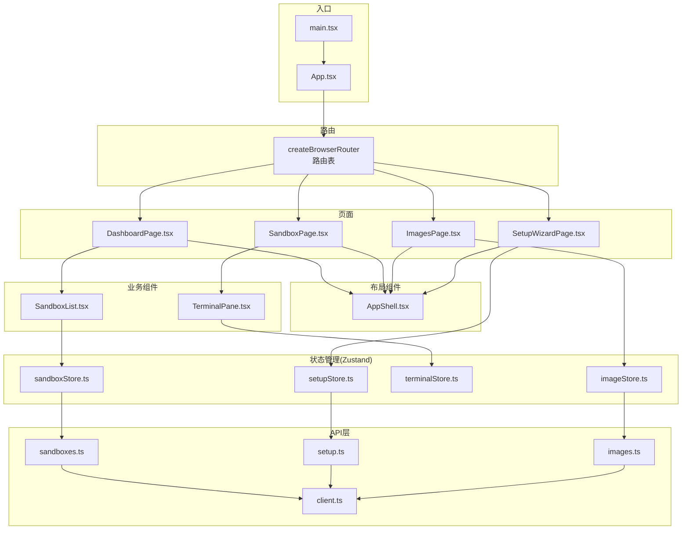
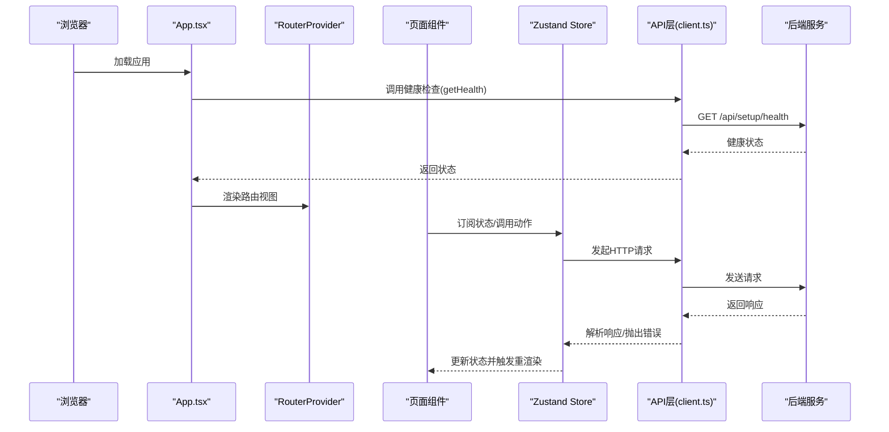
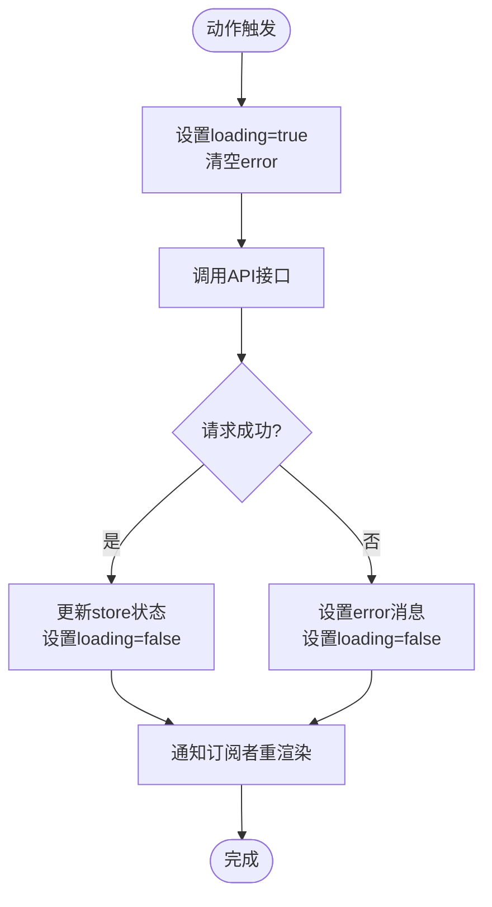
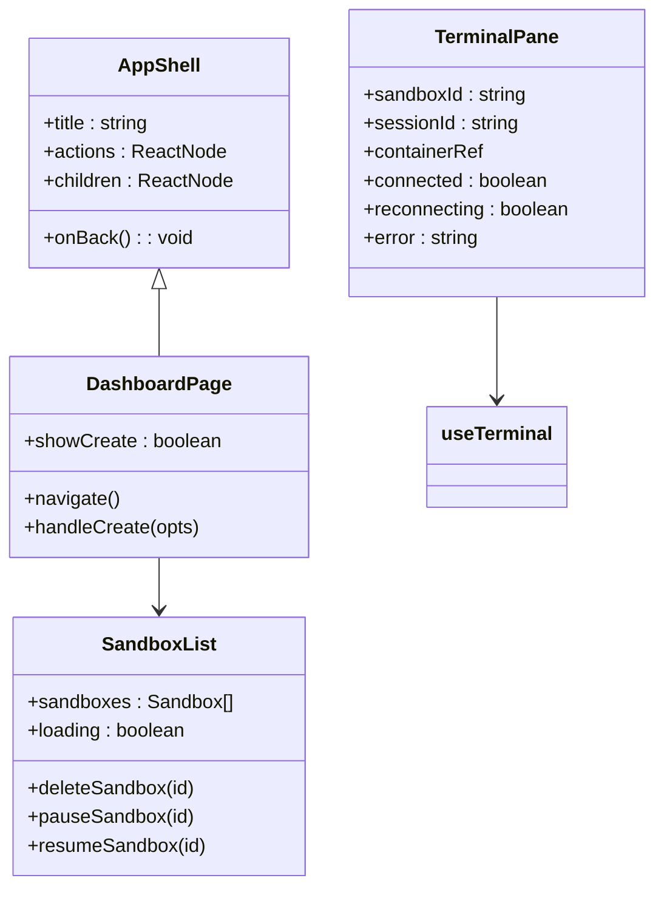
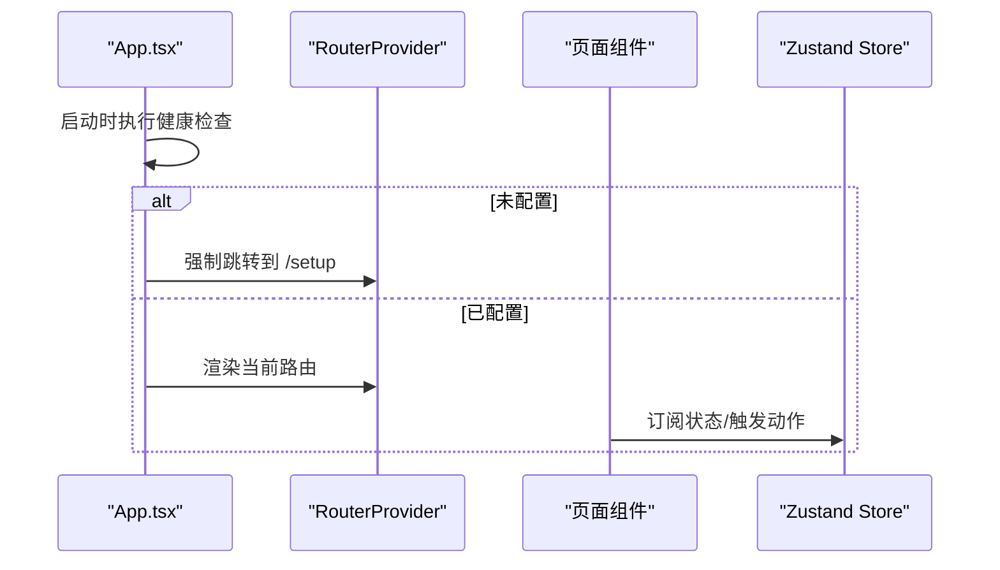
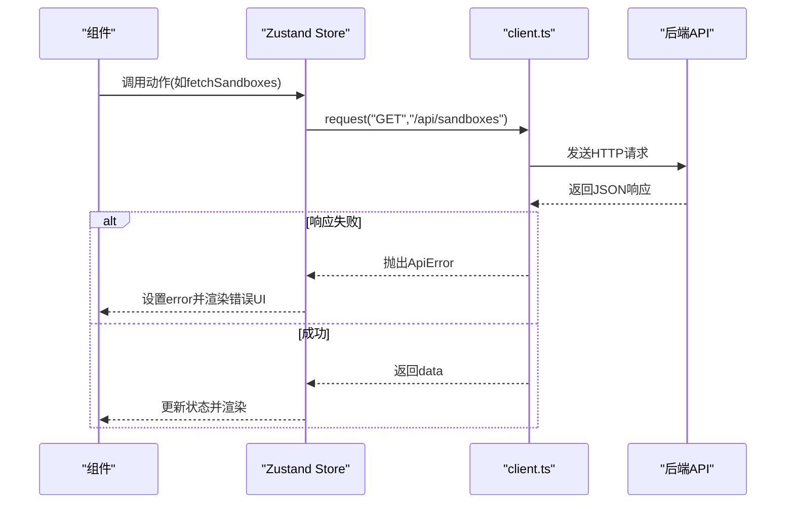
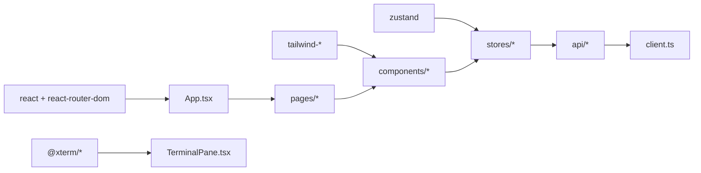

# 前端架构设计

<cite>
**本文档引用的文件**
- [apps/frontend/src/App.tsx](file://apps/frontend/src/App.tsx)
- [apps/frontend/src/main.tsx](file://apps/frontend/src/main.tsx)
- [apps/frontend/package.json](file://apps/frontend/package.json)
- [apps/frontend/tsconfig.json](file://apps/frontend/tsconfig.json)
- [apps/frontend/vite.config.ts](file://apps/frontend/vite.config.ts)
- [apps/frontend/src/components/layout/AppShell.tsx](file://apps/frontend/src/components/layout/AppShell.tsx)
- [apps/frontend/src/stores/sandboxStore.ts](file://apps/frontend/src/stores/sandboxStore.ts)
- [apps/frontend/src/stores/imageStore.ts](file://apps/frontend/src/stores/imageStore.ts)
- [apps/frontend/src/stores/terminalStore.ts](file://apps/frontend/src/stores/terminalStore.ts)
- [apps/frontend/src/stores/setupStore.ts](file://apps/frontend/src/stores/setupStore.ts)
- [apps/frontend/src/api/client.ts](file://apps/frontend/src/api/client.ts)
- [apps/frontend/src/pages/DashboardPage.tsx](file://apps/frontend/src/pages/DashboardPage.tsx)
- [apps/frontend/src/components/sandbox/SandboxList.tsx](file://apps/frontend/src/components/sandbox/SandboxList.tsx)
- [apps/frontend/src/components/terminal/TerminalPane.tsx](file://apps/frontend/src/components/terminal/TerminalPane.tsx)
- [apps/frontend/src/hooks/useSandbox.ts](file://apps/frontend/src/hooks/useSandbox.ts)
</cite>

## 目录
1. [简介](#简介)
2. [项目结构](#项目结构)
3. [核心组件](#核心组件)
4. [架构总览](#架构总览)
5. [详细组件分析](#详细组件分析)
6. [依赖关系分析](#依赖关系分析)
7. [性能考虑](#性能考虑)
8. [故障排除指南](#故障排除指南)
9. [结论](#结论)

## 简介
本文件面向Sandbox Manager前端架构，系统性阐述基于React + TypeScript的前端设计理念与实现细节。重点覆盖以下方面：
- 组件化设计：以布局组件（AppShell）为核心，业务组件（SandboxList、TerminalPane等）分层组织
- 状态管理模式：采用Zustand进行轻量级状态管理，按功能域拆分store，统一数据流与副作用处理
- 路由系统：使用react-router-dom v7的createBrowserRouter，结合健康检查与引导流程
- API交互：统一的HTTP请求封装与错误处理策略
- 数据流与依赖关系：通过store驱动组件渲染，API层解耦业务逻辑

## 项目结构
前端采用模块化目录组织，围绕“页面-组件-存储-API”分层：
- 页面层：DashboardPage、SandboxPage、ImagesPage、SetupWizardPage
- 组件层：layout（AppShell/Header）、sandbox、files、images、terminal、common
- 存储层：sandboxStore、imageStore、terminalStore、setupStore
- API层：client.ts统一请求封装，各模块API文件（sandboxes.ts、images.ts、setup.ts）
- 工具与配置：hooks、lib/utils.ts、vite.config.ts、tsconfig.json、package.json

图表来源
- [apps/frontend/src/main.tsx:1-12](file://apps/frontend/src/main.tsx#L1-L12)
- [apps/frontend/src/App.tsx:1-114](file://apps/frontend/src/App.tsx#L1-L114)
- [apps/frontend/src/pages/DashboardPage.tsx:1-54](file://apps/frontend/src/pages/DashboardPage.tsx#L1-L54)
- [apps/frontend/src/components/layout/AppShell.tsx:1-19](file://apps/frontend/src/components/layout/AppShell.tsx#L1-L19)
- [apps/frontend/src/components/sandbox/SandboxList.tsx:1-53](file://apps/frontend/src/components/sandbox/SandboxList.tsx#L1-L53)
- [apps/frontend/src/components/terminal/TerminalPane.tsx:1-38](file://apps/frontend/src/components/terminal/TerminalPane.tsx#L1-L38)
- [apps/frontend/src/stores/sandboxStore.ts:1-63](file://apps/frontend/src/stores/sandboxStore.ts#L1-L63)
- [apps/frontend/src/stores/imageStore.ts:1-60](file://apps/frontend/src/stores/imageStore.ts#L1-L60)
- [apps/frontend/src/stores/terminalStore.ts:1-68](file://apps/frontend/src/stores/terminalStore.ts#L1-L68)
- [apps/frontend/src/stores/setupStore.ts:1-157](file://apps/frontend/src/stores/setupStore.ts#L1-L157)
- [apps/frontend/src/api/client.ts:1-45](file://apps/frontend/src/api/client.ts#L1-L45)

章节来源
- [apps/frontend/src/main.tsx:1-12](file://apps/frontend/src/main.tsx#L1-L12)
- [apps/frontend/src/App.tsx:1-114](file://apps/frontend/src/App.tsx#L1-L114)
- [apps/frontend/vite.config.ts:1-22](file://apps/frontend/vite.config.ts#L1-L22)
- [apps/frontend/tsconfig.json:1-15](file://apps/frontend/tsconfig.json#L1-L15)
- [apps/frontend/package.json:1-32](file://apps/frontend/package.json#L1-L32)

## 核心组件
- 应用入口与初始化
  - main.tsx负责挂载根组件，引入全局样式
  - App.tsx承担应用启动阶段的健康检查与路由控制
- 路由系统
  - 使用createBrowserRouter定义路由表，包含/dashboard、/sandbox/:id、/images、/setup等路径
  - 首页重定向至/dashboard；根据后端健康状态决定渲染内容或跳转到setup
- 布局组件
  - AppShell提供统一头部与主内容区容器，支持标题、返回按钮与操作区
- 页面组件
  - DashboardPage整合沙箱列表与创建表单，协调store与导航
  - 其他页面（SandboxPage、ImagesPage、SetupWizardPage）分别承载对应业务场景

章节来源
- [apps/frontend/src/main.tsx:1-12](file://apps/frontend/src/main.tsx#L1-L12)
- [apps/frontend/src/App.tsx:1-114](file://apps/frontend/src/App.tsx#L1-L114)
- [apps/frontend/src/components/layout/AppShell.tsx:1-19](file://apps/frontend/src/components/layout/AppShell.tsx#L1-L19)
- [apps/frontend/src/pages/DashboardPage.tsx:1-54](file://apps/frontend/src/pages/DashboardPage.tsx#L1-L54)

## 架构总览
前端采用“页面-组件-存储-API”的分层架构，数据自下而上流动：
- API层：client.ts封装fetch请求，统一处理响应与错误
- 存储层：Zustand store集中管理状态与副作用，暴露动作函数
- 组件层：页面与业务组件订阅store，触发动作并渲染UI
- 路由层：App.tsx在启动时进行健康检查，随后交由RouterProvider管理导航

图表来源
- [apps/frontend/src/App.tsx:1-114](file://apps/frontend/src/App.tsx#L1-L114)
- [apps/frontend/src/api/client.ts:1-45](file://apps/frontend/src/api/client.ts#L1-L45)
- [apps/frontend/src/stores/sandboxStore.ts:1-63](file://apps/frontend/src/stores/sandboxStore.ts#L1-L63)
- [apps/frontend/src/stores/imageStore.ts:1-60](file://apps/frontend/src/stores/imageStore.ts#L1-L60)
- [apps/frontend/src/stores/setupStore.ts:1-157](file://apps/frontend/src/stores/setupStore.ts#L1-L157)

## 详细组件分析

### Zustand状态管理设计与实现
- 设计理念
  - 按功能域拆分store：sandboxStore、imageStore、terminalStore、setupStore
  - 将副作用（异步API调用）集中在store内部，组件仅订阅状态与触发动作
  - 使用create函数创建store，支持同步与异步动作，内置状态更新与错误处理
- 数据流管理
  - 动作函数负责设置loading/error、调用API、更新本地状态
  - 对于需要实时反馈的操作（如暂停/恢复沙箱），先局部更新状态，再异步提交
  - 对于需要全局刷新的操作（如创建沙箱），动作完成后主动刷新列表
- 错误处理
  - store内捕获异常并设置error字段，组件根据error与loading渲染不同UI
  - setupStore对远程连接测试与本地K8s安装流式事件进行聚合与错误上报

图表来源
- [apps/frontend/src/stores/sandboxStore.ts:1-63](file://apps/frontend/src/stores/sandboxStore.ts#L1-L63)
- [apps/frontend/src/stores/imageStore.ts:1-60](file://apps/frontend/src/stores/imageStore.ts#L1-L60)
- [apps/frontend/src/stores/setupStore.ts:1-157](file://apps/frontend/src/stores/setupStore.ts#L1-L157)

章节来源
- [apps/frontend/src/stores/sandboxStore.ts:1-63](file://apps/frontend/src/stores/sandboxStore.ts#L1-L63)
- [apps/frontend/src/stores/imageStore.ts:1-60](file://apps/frontend/src/stores/imageStore.ts#L1-L60)
- [apps/frontend/src/stores/terminalStore.ts:1-68](file://apps/frontend/src/stores/terminalStore.ts#L1-L68)
- [apps/frontend/src/stores/setupStore.ts:1-157](file://apps/frontend/src/stores/setupStore.ts#L1-L157)

### 组件层次结构与职责
- 布局组件（AppShell）
  - 提供统一头部与主内容区，支持标题、返回按钮与操作区
  - 作为页面容器，承载业务组件
- 业务组件
  - SandboxList：消费沙箱store，渲染沙箱卡片列表，支持删除、暂停/恢复
  - TerminalPane：终端会话容器，显示连接状态与错误信息，通过hook建立终端连接
- 页面组件
  - DashboardPage：组合SandboxList与CreateSandbox，负责沙箱创建与导航
  - 其他页面（SandboxPage、ImagesPage、SetupWizardPage）分别承载对应业务场景

图表来源
- [apps/frontend/src/components/layout/AppShell.tsx:1-19](file://apps/frontend/src/components/layout/AppShell.tsx#L1-L19)
- [apps/frontend/src/components/sandbox/SandboxList.tsx:1-53](file://apps/frontend/src/components/sandbox/SandboxList.tsx#L1-L53)
- [apps/frontend/src/components/terminal/TerminalPane.tsx:1-38](file://apps/frontend/src/components/terminal/TerminalPane.tsx#L1-L38)
- [apps/frontend/src/pages/DashboardPage.tsx:1-54](file://apps/frontend/src/pages/DashboardPage.tsx#L1-L54)

章节来源
- [apps/frontend/src/components/layout/AppShell.tsx:1-19](file://apps/frontend/src/components/layout/AppShell.tsx#L1-L19)
- [apps/frontend/src/components/sandbox/SandboxList.tsx:1-53](file://apps/frontend/src/components/sandbox/SandboxList.tsx#L1-L53)
- [apps/frontend/src/components/terminal/TerminalPane.tsx:1-38](file://apps/frontend/src/components/terminal/TerminalPane.tsx#L1-L38)
- [apps/frontend/src/pages/DashboardPage.tsx:1-54](file://apps/frontend/src/pages/DashboardPage.tsx#L1-L54)

### 路由系统与状态同步
- 路由定义
  - 使用createBrowserRouter定义多页面路由，支持动态参数（如/sandbox/:id）
  - 首页自动重定向到/dashboard
- 启动阶段健康检查
  - App.tsx在首次渲染时调用健康检查接口，根据返回的配置状态决定：
    - 未配置：强制跳转到/setup
    - 已配置：进入仪表盘，允许后台服务尚未就绪的情况
    - 后端不可达：在非/setup页面显示错误提示，允许在/setup页面继续配置
- 状态同步机制
  - 页面组件通过useEffect在挂载时拉取初始数据
  - store内的动作函数负责在变更后刷新缓存或更新本地状态
  - 终端会话通过store维护会话列表与激活态，确保跨组件状态一致

图表来源
- [apps/frontend/src/App.tsx:1-114](file://apps/frontend/src/App.tsx#L1-L114)
- [apps/frontend/src/pages/DashboardPage.tsx:1-54](file://apps/frontend/src/pages/DashboardPage.tsx#L1-L54)
- [apps/frontend/src/stores/sandboxStore.ts:1-63](file://apps/frontend/src/stores/sandboxStore.ts#L1-L63)

章节来源
- [apps/frontend/src/App.tsx:1-114](file://apps/frontend/src/App.tsx#L1-L114)
- [apps/frontend/src/pages/DashboardPage.tsx:1-54](file://apps/frontend/src/pages/DashboardPage.tsx#L1-L54)

### 前端与后端API交互模式
- 请求封装
  - client.ts提供request函数，统一处理URL拼接、请求头、JSON序列化与响应解析
  - 支持204无内容响应与success字段的统一错误提取
- 错误处理策略
  - 自定义ApiError类，携带code、message、statusCode
  - store内捕获异常并设置error，页面根据error与loading渲染占位符或错误提示
- 终端与WebSocket
  - 终端组件通过hook建立与后端的终端会话连接，显示连接状态与重连提示
  - store中的会话管理保证同一沙箱的多个终端标签页状态一致

图表来源
- [apps/frontend/src/api/client.ts:1-45](file://apps/frontend/src/api/client.ts#L1-L45)
- [apps/frontend/src/stores/sandboxStore.ts:1-63](file://apps/frontend/src/stores/sandboxStore.ts#L1-L63)
- [apps/frontend/src/stores/imageStore.ts:1-60](file://apps/frontend/src/stores/imageStore.ts#L1-L60)
- [apps/frontend/src/stores/setupStore.ts:1-157](file://apps/frontend/src/stores/setupStore.ts#L1-L157)
- [apps/frontend/src/components/terminal/TerminalPane.tsx:1-38](file://apps/frontend/src/components/terminal/TerminalPane.tsx#L1-L38)

章节来源
- [apps/frontend/src/api/client.ts:1-45](file://apps/frontend/src/api/client.ts#L1-L45)
- [apps/frontend/src/stores/sandboxStore.ts:1-63](file://apps/frontend/src/stores/sandboxStore.ts#L1-L63)
- [apps/frontend/src/stores/imageStore.ts:1-60](file://apps/frontend/src/stores/imageStore.ts#L1-L60)
- [apps/frontend/src/stores/setupStore.ts:1-157](file://apps/frontend/src/stores/setupStore.ts#L1-L157)
- [apps/frontend/src/components/terminal/TerminalPane.tsx:1-38](file://apps/frontend/src/components/terminal/TerminalPane.tsx#L1-L38)

## 依赖关系分析
- 外部依赖
  - React 19、react-router-dom 7、zustand 5、@xterm/*、tailwind相关工具链
- 内部依赖
  - 组件依赖store与API层，store依赖API层，API层依赖client.ts
  - 页面组件依赖布局组件与业务组件，业务组件依赖store
- 代理与开发环境
  - Vite配置将/api前缀代理到本地后端，支持WebSocket升级

图表来源
- [apps/frontend/package.json:1-32](file://apps/frontend/package.json#L1-L32)
- [apps/frontend/vite.config.ts:1-22](file://apps/frontend/vite.config.ts#L1-L22)
- [apps/frontend/src/App.tsx:1-114](file://apps/frontend/src/App.tsx#L1-L114)
- [apps/frontend/src/stores/sandboxStore.ts:1-63](file://apps/frontend/src/stores/sandboxStore.ts#L1-L63)
- [apps/frontend/src/api/client.ts:1-45](file://apps/frontend/src/api/client.ts#L1-L45)

章节来源
- [apps/frontend/package.json:1-32](file://apps/frontend/package.json#L1-L32)
- [apps/frontend/vite.config.ts:1-22](file://apps/frontend/vite.config.ts#L1-L22)

## 性能考虑
- 组件渲染优化
  - 列表组件在加载时使用骨架屏占位，减少空白时间
  - 通过store集中状态，避免重复渲染与不必要的props传递
- 状态更新策略
  - 对于高频状态更新（如终端重连状态），采用局部更新与最小化重渲染
- 数据获取策略
  - useSandbox对沙箱详情采用“总是获取最新”策略，避免陈旧缓存导致的错误状态
  - 对于持续状态变化的资源（如沙箱创建/暂停/恢复），采用定时轮询直到稳定

## 故障排除指南
- 后端不可达
  - 现象：非/setup页面显示错误提示，包含启动命令与重试按钮
  - 处理：确保后端服务已启动，或在/setup页面继续配置
- 远程连接测试失败
  - 现象：setupStore中testResult显示连接失败，error字段包含错误信息
  - 处理：检查serverUrl、apiKey与协议配置，确认网络可达
- 终端连接异常
  - 现象：TerminalPane右上角显示错误或重连状态
  - 处理：检查后端WebSocket服务与沙箱状态，等待自动重连或手动刷新

章节来源
- [apps/frontend/src/App.tsx:84-110](file://apps/frontend/src/App.tsx#L84-L110)
- [apps/frontend/src/stores/setupStore.ts:106-122](file://apps/frontend/src/stores/setupStore.ts#L106-L122)
- [apps/frontend/src/components/terminal/TerminalPane.tsx:17-33](file://apps/frontend/src/components/terminal/TerminalPane.tsx#L17-L33)

## 结论
Sandbox Manager前端采用清晰的分层架构与Zustand轻量状态管理，实现了组件化、可维护且高性能的用户体验。通过统一的API封装与路由健康检查机制，系统在复杂业务场景下仍保持良好的稳定性与扩展性。建议后续可在以下方向持续演进：
- 将常用状态抽取为通用Hook，提升复用性
- 引入缓存策略与离线兜底，增强弱网体验
- 完善类型体系与API契约，强化开发效率与安全性