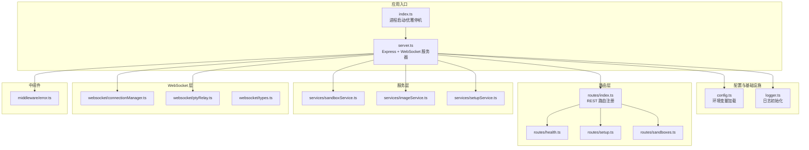
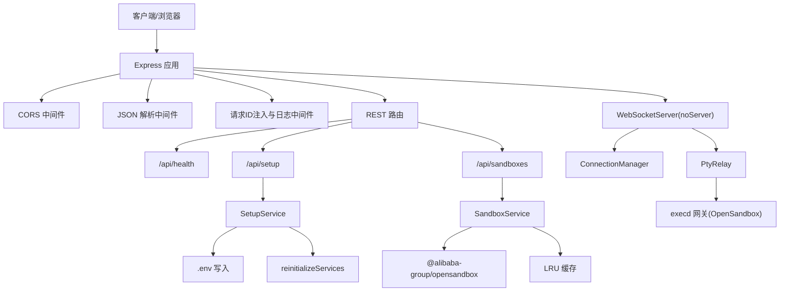
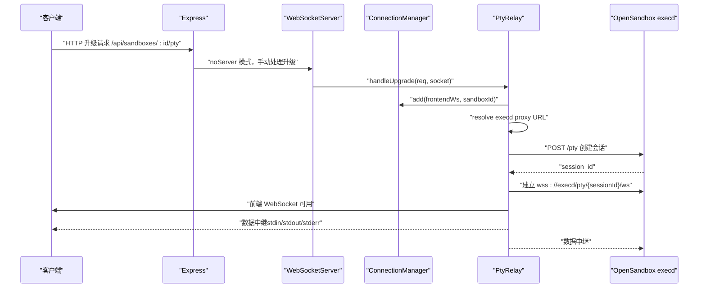
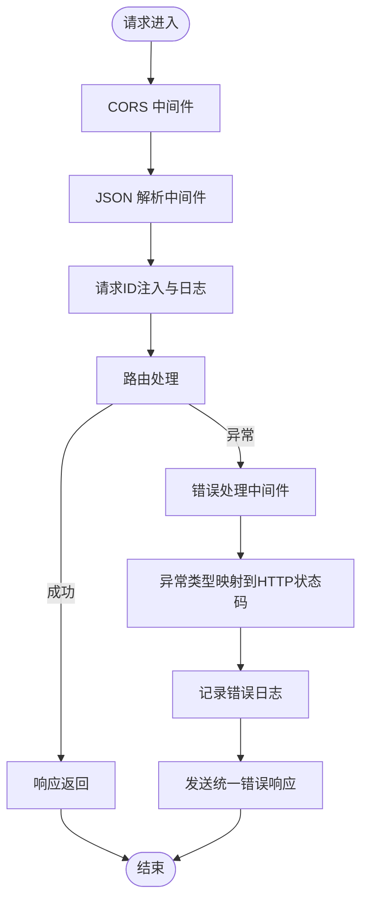
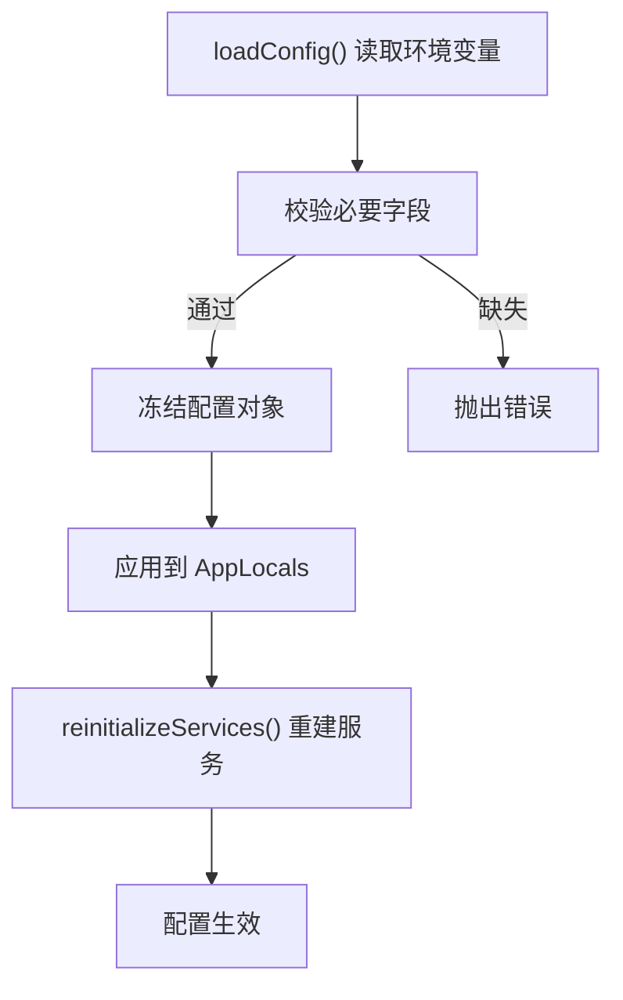
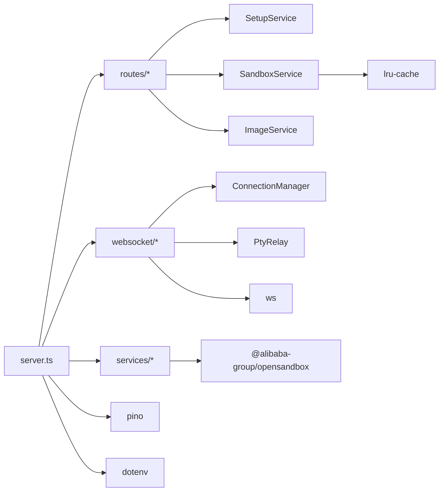

# 后端架构设计

<cite>
**本文档引用的文件**
- [apps/backend/src/index.ts](file://apps/backend/src/index.ts)
- [apps/backend/src/server.ts](file://apps/backend/src/server.ts)
- [apps/backend/src/config.ts](file://apps/backend/src/config.ts)
- [apps/backend/src/logger.ts](file://apps/backend/src/logger.ts)
- [apps/backend/src/middleware/error.ts](file://apps/backend/src/middleware/error.ts)
- [apps/backend/src/routes/index.ts](file://apps/backend/src/routes/index.ts)
- [apps/backend/src/routes/sandboxes.ts](file://apps/backend/src/routes/sandboxes.ts)
- [apps/backend/src/routes/setup.ts](file://apps/backend/src/routes/setup.ts)
- [apps/backend/src/routes/health.ts](file://apps/backend/src/routes/health.ts)
- [apps/backend/src/services/sandboxService.ts](file://apps/backend/src/services/sandboxService.ts)
- [apps/backend/src/services/imageService.ts](file://apps/backend/src/services/imageService.ts)
- [apps/backend/src/services/setupService.ts](file://apps/backend/src/services/setupService.ts)
- [apps/backend/src/websocket/connectionManager.ts](file://apps/backend/src/websocket/connectionManager.ts)
- [apps/backend/src/websocket/ptyRelay.ts](file://apps/backend/src/websocket/ptyRelay.ts)
- [apps/backend/src/websocket/types.ts](file://apps/backend/src/websocket/types.ts)
- [apps/backend/src/types/index.ts](file://apps/backend/src/types/index.ts)
- [apps/backend/package.json](file://apps/backend/package.json)
</cite>

## 目录
1. [简介](#简介)
2. [项目结构](#项目结构)
3. [核心组件](#核心组件)
4. [架构总览](#架构总览)
5. [详细组件分析](#详细组件分析)
6. [依赖关系分析](#依赖关系分析)
7. [性能考虑](#性能考虑)
8. [故障排除指南](#故障排除指南)
9. [结论](#结论)

## 简介
本文件为 Sandbox Manager 后端架构的详细技术文档，基于 Express + TypeScript 的实现，采用模块化设计与分层架构（MVC 风格的服务层），结合中间件体系实现横切关注点（CORS、日志、错误处理）。后端同时支持 REST API 路由与 WebSocket 路由（PTY 终端会话），通过服务层封装对 OpenSandbox 平台的访问，并提供图像预拉取、沙箱生命周期管理、连接池与缓存等能力。

## 项目结构
后端采用按功能域划分的目录组织方式：
- 根入口与服务器：index.ts、server.ts
- 配置与日志：config.ts、logger.ts
- 中间件：middleware/error.ts
- 路由层：routes/*（health、sandboxes、setup、images 等）
- 服务层：services/*（sandboxService、imageService、setupService、infraRunner）
- WebSocket 层：websocket/*（connectionManager、ptyRelay、types）
- 类型定义：types/index.ts
- 包配置：package.json



图表来源
- [apps/backend/src/index.ts:1-66](file://apps/backend/src/index.ts#L1-L66)
- [apps/backend/src/server.ts:36-90](file://apps/backend/src/server.ts#L36-L90)
- [apps/backend/src/routes/index.ts:8-13](file://apps/backend/src/routes/index.ts#L8-L13)

章节来源
- [apps/backend/src/index.ts:1-66](file://apps/backend/src/index.ts#L1-L66)
- [apps/backend/src/server.ts:36-90](file://apps/backend/src/server.ts#L36-L90)
- [apps/backend/src/config.ts:48-71](file://apps/backend/src/config.ts#L48-L71)
- [apps/backend/src/logger.ts:1-17](file://apps/backend/src/logger.ts#L1-L17)
- [apps/backend/src/middleware/error.ts:1-48](file://apps/backend/src/middleware/error.ts#L1-L48)
- [apps/backend/src/routes/index.ts:1-16](file://apps/backend/src/routes/index.ts#L1-L16)

## 核心组件
- 应用入口与服务器
  - 入口负责加载配置、初始化日志、创建服务器并处理优雅停机；在本地 K8s 模式下自动建立端口转发。
  - 服务器负责：
    - 初始化 Express 应用与中间件（CORS、JSON 解析、请求 ID 注入、日志记录）
    - 构建服务层实例（SandboxService、ImageService、ConnectionManager、PtyRelay）
    - 注册 REST 路由与全局错误处理器
    - 创建独立的 WebSocketServer，手动处理 PTY 升级握手
    - 提供 reinitializeServices 以在配置变更后重建服务

- 配置管理
  - 从环境变量加载配置项，包含端口、OpenSandbox 服务器地址与密钥、协议、代理使用、超时、CORS 来源、日志级别、PTY 空闲超时等
  - 支持运行时检测配置状态（configured）

- 日志系统
  - 基于 pino，支持彩色输出与时间格式化，便于开发调试

- 错误处理中间件
  - 将 SDK 异常映射为 HTTP 状态码，统一返回结构化响应，包含请求 ID 以便追踪

- 服务层
  - SandboxService：封装 OpenSandbox SDK，提供沙箱列表、创建、暂停/恢复、删除、连接缓存与 execd 端点解析
  - ImageService：基于 kubectl/DaemonSet 实现镜像预拉取、状态查询、节点缓存镜像枚举
  - SetupService：提供设置向导状态查询、远程连接测试、配置写入 .env 与本地 K8s 默认配置保存

- WebSocket 层
  - ConnectionManager：维护前端 WebSocket 连接、空闲监控、活动时间更新、清理
  - PtyRelay：透明中继 PTY 数据流，完成前端 WebSocket 握手、创建 execd 会话、双向转发、错误处理与连接关闭

章节来源
- [apps/backend/src/index.ts:10-46](file://apps/backend/src/index.ts#L10-L46)
- [apps/backend/src/server.ts:36-90](file://apps/backend/src/server.ts#L36-L90)
- [apps/backend/src/config.ts:3-23](file://apps/backend/src/config.ts#L3-L23)
- [apps/backend/src/logger.ts:1-17](file://apps/backend/src/logger.ts#L1-L17)
- [apps/backend/src/middleware/error.ts:4-47](file://apps/backend/src/middleware/error.ts#L4-L47)
- [apps/backend/src/services/sandboxService.ts:11-147](file://apps/backend/src/services/sandboxService.ts#L11-L147)
- [apps/backend/src/services/imageService.ts:95-385](file://apps/backend/src/services/imageService.ts#L95-L385)
- [apps/backend/src/services/setupService.ts:58-146](file://apps/backend/src/services/setupService.ts#L58-L146)
- [apps/backend/src/websocket/connectionManager.ts:7-101](file://apps/backend/src/websocket/connectionManager.ts#L7-L101)
- [apps/backend/src/websocket/ptyRelay.ts:22-171](file://apps/backend/src/websocket/ptyRelay.ts#L22-L171)

## 架构总览
后端采用“入口 → 服务器 → 路由 → 服务 → 外部系统”的分层架构，REST API 与 WebSocket 在同一进程中运行，通过不同的升级路径分离：



图表来源
- [apps/backend/src/server.ts:36-90](file://apps/backend/src/server.ts#L36-L90)
- [apps/backend/src/routes/index.ts:8-13](file://apps/backend/src/routes/index.ts#L8-L13)
- [apps/backend/src/services/setupService.ts:108-146](file://apps/backend/src/services/setupService.ts#L108-L146)
- [apps/backend/src/services/sandboxService.ts:20-47](file://apps/backend/src/services/sandboxService.ts#L20-L47)
- [apps/backend/src/websocket/ptyRelay.ts:40-118](file://apps/backend/src/websocket/ptyRelay.ts#L40-L118)

## 详细组件分析

### 服务层架构与设计模式
- SandboxService
  - 设计模式：工厂 + 连接缓存（LRU）+ 资源释放
  - 关键职责：连接配置构建、沙箱生命周期管理、execd 端点解析、连接缓存与回收
  - 性能特性：LRU 缓存减少重复连接开销，定时回收避免资源泄漏

- ImageService
  - 设计模式：命令执行 + 结果解析 + 资源管理
  - 关键职责：命名空间确保、DaemonSet 预拉取、状态解析、节点镜像枚举
  - 复杂度：列表与状态查询为 O(n)（n 为集群节点数），错误收集为 O(n) 容器遍历

- SetupService
  - 设计模式：配置写入 + 运行时重载
  - 关键职责：远程连接测试、.env 写入、本地 K8s 默认配置、触发服务重建

```mermaid
classDiagram
class SandboxService {
    -manager
    -cache
    +listSandboxInfos()
    +createSandbox()
    +killSandbox()
    +pauseSandbox()
    +resumeSandbox()
    +getConnectedSandbox()
    +getExecdProxyUrl()
    +dispose()
}
class ImageService {
    +ensureNamespace()
    +listImages()
    +pullImage()
    +getImageStatus()
    +deleteImage()
    +listCachedImages()
}
class SetupService {
    +getSetupStatus()
    +testConnection()
    +saveRemoteConfig()
    +saveLocalConfig()
}
SandboxService --> "alibaba_group_opensandbox" : "使用"
ImageService --> "kubectl" : "执行命令"
```

图表来源
- [apps/backend/src/services/sandboxService.ts:11-147](file://apps/backend/src/services/sandboxService.ts#L11-L147)
- [apps/backend/src/services/imageService.ts:95-385](file://apps/backend/src/services/imageService.ts#L95-L385)
- [apps/backend/src/services/setupService.ts:58-146](file://apps/backend/src/services/setupService.ts#L58-L146)

章节来源
- [apps/backend/src/services/sandboxService.ts:11-147](file://apps/backend/src/services/sandboxService.ts#L11-L147)
- [apps/backend/src/services/imageService.ts:95-385](file://apps/backend/src/services/imageService.ts#L95-L385)
- [apps/backend/src/services/setupService.ts:58-146](file://apps/backend/src/services/setupService.ts#L58-L146)

### 路由系统设计（REST API 与 WebSocket 分离）
- REST 路由注册
  - routes/index.ts 将 /api/health、/api/setup、/api/sandboxes、/api/images 等路由挂载到 Express 应用
  - sandboxes 路由进一步细分为子路由（如 /:sandboxId/files、/:sandboxId/commands）

- 中间件守卫
  - sandboxes 路由在进入具体操作前检查配置状态，未配置则返回 503

- WebSocket 路由
  - 服务器监听 HTTP upgrade 事件，匹配 /api/sandboxes/:id/pty 路径
  - 交由 PtyRelay 完成握手、会话创建、双向中继与清理



图表来源
- [apps/backend/src/server.ts:75-87](file://apps/backend/src/server.ts#L75-L87)
- [apps/backend/src/websocket/ptyRelay.ts:40-118](file://apps/backend/src/websocket/ptyRelay.ts#L40-L118)
- [apps/backend/src/websocket/connectionManager.ts:30-46](file://apps/backend/src/websocket/connectionManager.ts#L30-L46)

章节来源
- [apps/backend/src/routes/index.ts:8-13](file://apps/backend/src/routes/index.ts#L8-L13)
- [apps/backend/src/routes/sandboxes.ts:34-45](file://apps/backend/src/routes/sandboxes.ts#L34-L45)
- [apps/backend/src/server.ts:75-87](file://apps/backend/src/server.ts#L75-L87)
- [apps/backend/src/websocket/ptyRelay.ts:40-118](file://apps/backend/src/websocket/ptyRelay.ts#L40-L118)

### 中间件体系（CORS、日志、错误处理）
- CORS 配置
  - 使用配置中的 corsOrigin 动态设置允许来源

- 请求日志
  - 自动生成 x-request-id，记录方法与路径，便于端到端追踪

- 错误处理
  - 将 SDK 异常映射为 HTTP 状态码，统一结构化响应，包含错误代码、消息与请求 ID



图表来源
- [apps/backend/src/server.ts:40-48](file://apps/backend/src/server.ts#L40-L48)
- [apps/backend/src/middleware/error.ts:4-47](file://apps/backend/src/middleware/error.ts#L4-L47)

章节来源
- [apps/backend/src/server.ts:40-48](file://apps/backend/src/server.ts#L40-L48)
- [apps/backend/src/middleware/error.ts:4-47](file://apps/backend/src/middleware/error.ts#L4-L47)

### 配置管理系统
- 环境变量驱动
  - 加载端口、节点环境、OpenSandbox 地址与密钥、协议、代理、超时、CORS、日志级别、PTY 空闲超时等
  - 通过 process.env 获取，缺失时抛出明确错误

- 运行时配置管理
  - SetupService 将新配置写入 .env 并更新 process.env
  - server.ts 提供 reinitializeServices，在配置变更后销毁旧服务并创建新服务，保证配置生效



图表来源
- [apps/backend/src/config.ts:48-71](file://apps/backend/src/config.ts#L48-L71)
- [apps/backend/src/services/setupService.ts:108-146](file://apps/backend/src/services/setupService.ts#L108-L146)
- [apps/backend/src/server.ts:96-118](file://apps/backend/src/server.ts#L96-L118)

章节来源
- [apps/backend/src/config.ts:3-23](file://apps/backend/src/config.ts#L3-L23)
- [apps/backend/src/config.ts:48-71](file://apps/backend/src/config.ts#L48-L71)
- [apps/backend/src/services/setupService.ts:108-146](file://apps/backend/src/services/setupService.ts#L108-L146)
- [apps/backend/src/server.ts:96-118](file://apps/backend/src/server.ts#L96-L118)

## 依赖关系分析
- 组件耦合
  - server.ts 作为装配中心，集中初始化服务与中间件，通过 app.locals 传递给路由与 WebSocket
  - 路由层仅依赖 app.locals 中的服务接口，降低耦合
  - WebSocket 层依赖 ConnectionManager 与 SandboxService，保持清晰边界

- 外部依赖
  - @alibaba-group/opensandbox：沙箱管理与 execd 访问
  - ws：WebSocket 服务器与客户端
  - lru-cache：SandboxService 连接缓存
  - pino：日志
  - dotenv：.env 加载



图表来源
- [apps/backend/src/server.ts:50-56](file://apps/backend/src/server.ts#L50-L56)
- [apps/backend/src/routes/index.ts:8-13](file://apps/backend/src/routes/index.ts#L8-L13)
- [apps/backend/package.json:11-31](file://apps/backend/package.json#L11-L31)

章节来源
- [apps/backend/src/server.ts:50-56](file://apps/backend/src/server.ts#L50-L56)
- [apps/backend/package.json:11-31](file://apps/backend/package.json#L11-L31)

## 性能考虑
- 连接复用与缓存
  - SandboxService 使用 LRU 缓存连接，减少重复连接成本；缓存 TTL 与回收逻辑避免资源泄漏
- PTY 空闲清理
  - ConnectionManager 周期性检查空闲连接，超过阈值自动关闭，降低资源占用
- 请求限流与大小限制
  - JSON 解析限制为 1MB，避免过大负载
- 日志级别控制
  - 开发环境启用彩色与时间格式化，生产环境保持简洁输出

## 故障排除指南
- 常见错误分类与处理
  - SDK 异常映射：根据异常类型映射为 4xx/5xx，便于前端识别
  - 解析失败：JSON 解析错误映射为 400
  - 超时与不可达：特定异常映射为 504 或 502
- 排查步骤
  - 查看请求 ID 定位日志
  - 检查配置是否正确（OPENSANDBOX_* 环境变量）
  - 确认 OpenSandbox 服务可达与密钥有效
  - 对于 PTY 问题，确认 execd 端点与会话创建成功

章节来源
- [apps/backend/src/middleware/error.ts:33-47](file://apps/backend/src/middleware/error.ts#L33-L47)
- [apps/backend/src/routes/health.ts:6-51](file://apps/backend/src/routes/health.ts#L6-L51)

## 结论
该后端架构以 Express + TypeScript 为基础，采用清晰的分层与模块化设计，通过服务层抽象外部系统访问，配合中间件体系实现横切关注点，REST 与 WebSocket 分离提升可维护性与扩展性。配置驱动与运行时重载机制使系统具备良好的可运维性；缓存与空闲清理策略保障了性能与稳定性。建议后续可引入健康检查、指标采集与更细粒度的速率限制等增强措施。