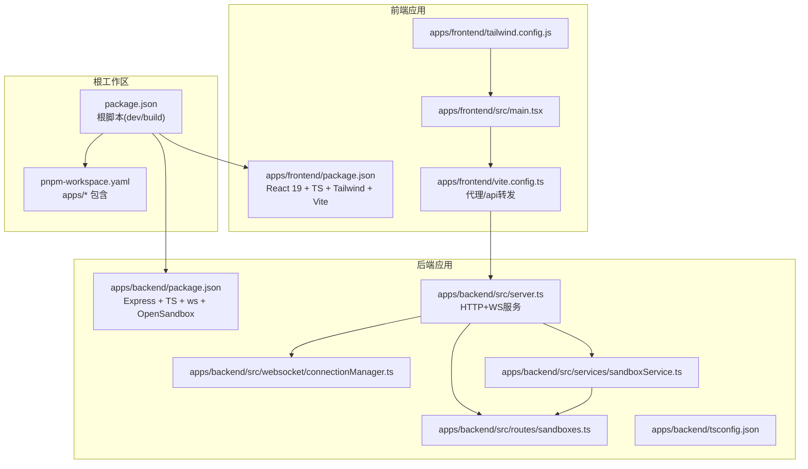
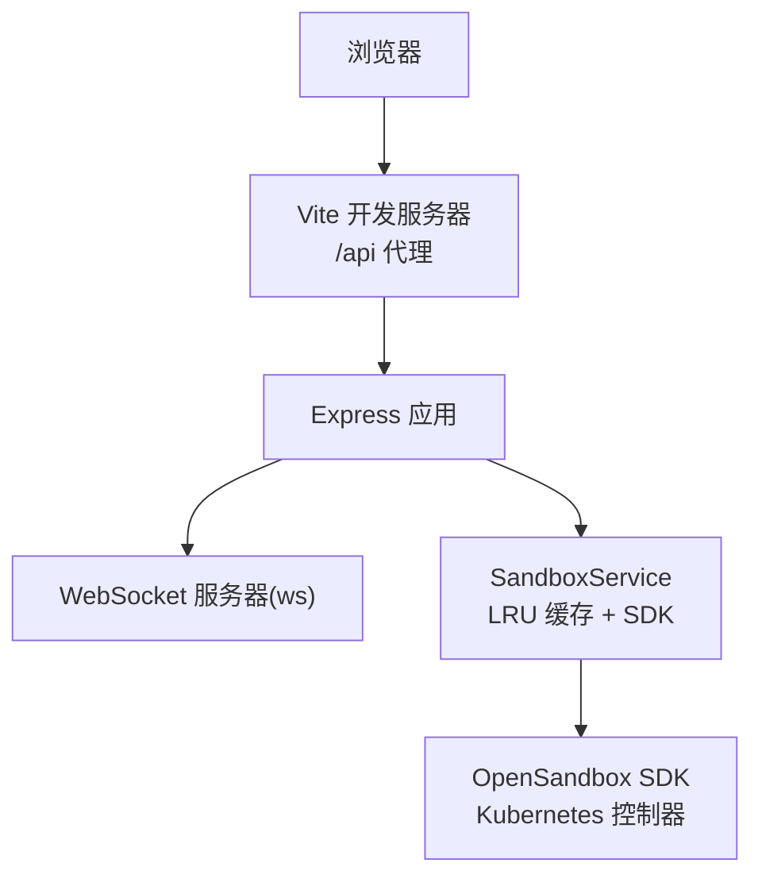
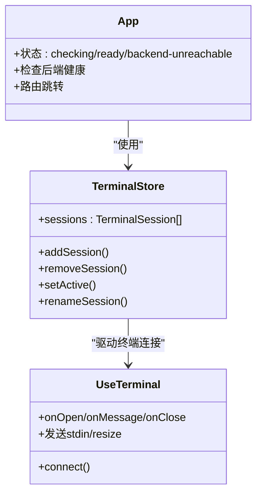
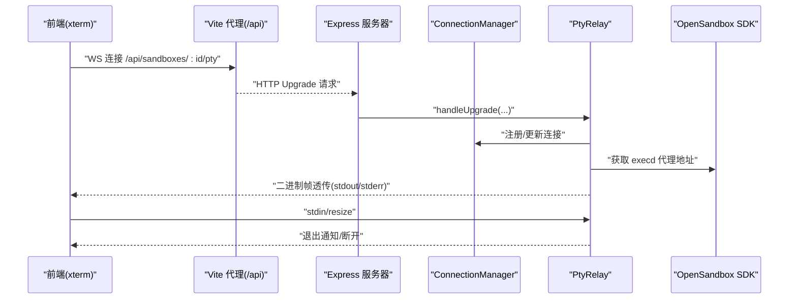
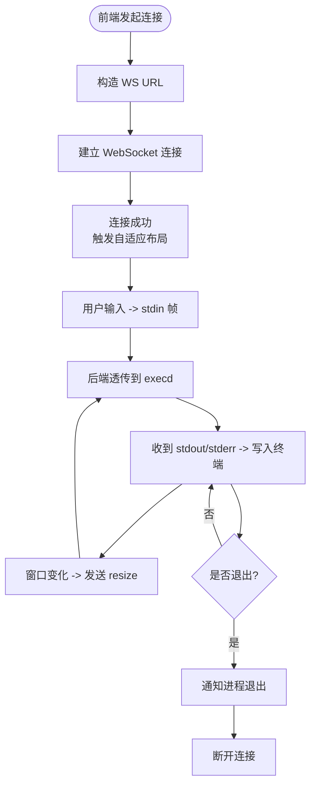
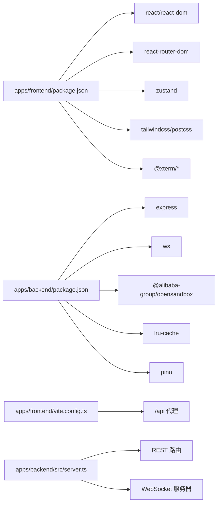
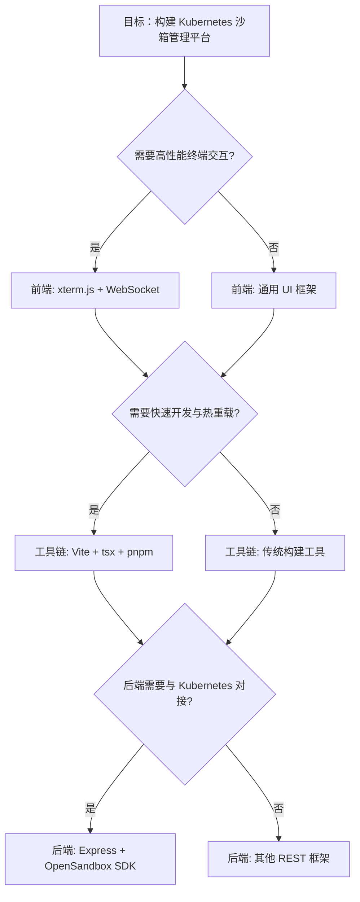

# 技术栈选型

<cite>
**本文引用的文件**
- [README.md](file://README.md)
- [package.json](file://package.json)
- [pnpm-workspace.yaml](file://pnpm-workspace.yaml)
- [apps/backend/package.json](file://apps/backend/package.json)
- [apps/frontend/package.json](file://apps/frontend/package.json)
- [apps/frontend/vite.config.ts](file://apps/frontend/vite.config.ts)
- [apps/frontend/tailwind.config.js](file://apps/frontend/tailwind.config.js)
- [apps/backend/src/server.ts](file://apps/backend/src/server.ts)
- [apps/backend/src/websocket/connectionManager.ts](file://apps/backend/src/websocket/connectionManager.ts)
- [apps/backend/src/services/sandboxService.ts](file://apps/backend/src/services/sandboxService.ts)
- [apps/backend/src/routes/sandboxes.ts](file://apps/backend/src/routes/sandboxes.ts)
- [apps/frontend/src/App.tsx](file://apps/frontend/src/App.tsx)
- [apps/frontend/src/main.tsx](file://apps/frontend/src/main.tsx)
- [apps/frontend/src/stores/terminalStore.ts](file://apps/frontend/src/stores/terminalStore.ts)
- [apps/frontend/src/hooks/useTerminal.ts](file://apps/frontend/src/hooks/useTerminal.ts)
- [apps/backend/tsconfig.json](file://apps/backend/tsconfig.json)
</cite>

## 目录
1. [引言](#引言)
2. [项目结构](#项目结构)
3. [核心组件](#核心组件)
4. [架构总览](#架构总览)
5. [详细组件分析](#详细组件分析)
6. [依赖关系分析](#依赖关系分析)
7. [性能考量](#性能考量)
8. [故障排查指南](#故障排查指南)
9. [结论](#结论)
10. [附录](#附录)

## 引言
本文件围绕 Sandbox Manager 的技术栈选型进行系统化梳理，重点解释前端 React 19、TypeScript、Tailwind CSS、Zustand，以及后端 Express、WebSocket、OpenSandbox SDK 等技术的应用场景与协同机制；同时给出开发工具链（pnpm monorepo、Vite、tsx）的角色定位，以及在性能、可维护性、团队技能等方面的权衡考量。

## 项目结构
项目采用 pnpm workspace 的 monorepo 结构，前后端分包独立开发与构建，根级脚本统一协调 dev/build 流程。前端以 Vite 作为开发服务器与构建工具，后端以 tsx 支持热重载开发，TypeScript 提供类型安全。

**图示来源**
- [package.json:1-20](file://package.json#L1-L20)
- [pnpm-workspace.yaml:1-3](file://pnpm-workspace.yaml#L1-L3)
- [apps/frontend/package.json:1-32](file://apps/frontend/package.json#L1-L32)
- [apps/frontend/vite.config.ts:1-22](file://apps/frontend/vite.config.ts#L1-L22)
- [apps/frontend/tailwind.config.js:1-9](file://apps/frontend/tailwind.config.js#L1-L9)
- [apps/backend/package.json:1-32](file://apps/backend/package.json#L1-L32)
- [apps/backend/src/server.ts:1-119](file://apps/backend/src/server.ts#L1-L119)
- [apps/backend/src/websocket/connectionManager.ts:1-102](file://apps/backend/src/websocket/connectionManager.ts#L1-L102)
- [apps/backend/src/services/sandboxService.ts:1-148](file://apps/backend/src/services/sandboxService.ts#L1-L148)
- [apps/backend/src/routes/sandboxes.ts:1-175](file://apps/backend/src/routes/sandboxes.ts#L1-L175)
- [apps/backend/tsconfig.json:1-13](file://apps/backend/tsconfig.json#L1-L13)

**章节来源**
- [README.md:114-140](file://README.md#L114-L140)
- [package.json:1-20](file://package.json#L1-L20)
- [pnpm-workspace.yaml:1-3](file://pnpm-workspace.yaml#L1-L3)

## 核心组件
- 前端：React 19 + TypeScript + Tailwind CSS + Zustand + xterm.js，负责页面路由、状态管理、UI 组件与终端交互。
- 后端：Express + WebSocket(ws) + OpenSandbox SDK，负责 REST API、WebSocket PTY 中继、缓存与日志。
- 工具链：pnpm monorepo + Vite + tsx，提供包管理、开发服务器、热重载与类型编译。

**章节来源**
- [README.md:5-13](file://README.md#L5-L13)
- [apps/frontend/package.json:11-30](file://apps/frontend/package.json#L11-L30)
- [apps/backend/package.json:11-30](file://apps/backend/package.json#L11-L30)

## 架构总览
前端通过 Vite 代理将 /api 请求转发至后端，后端提供 REST 接口与 WebSocket PTY 连接。后端通过 OpenSandbox SDK 与 Kubernetes/OpenSandbox 控制器交互，实现沙箱生命周期管理与文件/命令操作。

**图示来源**
- [apps/frontend/vite.config.ts:12-20](file://apps/frontend/vite.config.ts#L12-L20)
- [apps/backend/src/server.ts:36-89](file://apps/backend/src/server.ts#L36-L89)
- [apps/backend/src/services/sandboxService.ts:20-47](file://apps/backend/src/services/sandboxService.ts#L20-L47)

## 详细组件分析

### 前端技术栈与应用
- React 19：用于声明式 UI 构建与组件化组织，结合 react-router-dom 实现页面路由与导航。
- TypeScript：提供类型安全与更好的开发体验，配合 Vite 与 Tailwind 使用。
- Tailwind CSS：实用优先的样式框架，通过 tailwind.config.js 指定内容扫描路径，快速构建界面。
- Zustand：轻量状态管理，用于终端会话等前端状态的集中管理。
- xterm.js：Web 终端渲染与交互，支持链接识别、自适应布局与二进制帧透传。

**图示来源**
- [apps/frontend/src/App.tsx:34-113](file://apps/frontend/src/App.tsx#L34-L113)
- [apps/frontend/src/stores/terminalStore.ts:20-67](file://apps/frontend/src/stores/terminalStore.ts#L20-L67)
- [apps/frontend/src/hooks/useTerminal.ts:25-95](file://apps/frontend/src/hooks/useTerminal.ts#L25-L95)

**章节来源**
- [apps/frontend/src/App.tsx:1-114](file://apps/frontend/src/App.tsx#L1-L114)
- [apps/frontend/src/main.tsx:1-12](file://apps/frontend/src/main.tsx#L1-L12)
- [apps/frontend/src/stores/terminalStore.ts:1-68](file://apps/frontend/src/stores/terminalStore.ts#L1-L68)
- [apps/frontend/src/hooks/useTerminal.ts:1-180](file://apps/frontend/src/hooks/useTerminal.ts#L1-L180)
- [apps/frontend/tailwind.config.js:1-9](file://apps/frontend/tailwind.config.js#L1-L9)

### 后端技术栈与应用
- Express：提供 REST API 路由与中间件，支持 CORS、JSON 解析与请求日志。
- WebSocket(ws)：手动升级处理 /api/sandboxes/:id/pty，实现 PTY 二进制帧透传。
- OpenSandbox SDK：封装沙箱生命周期管理、端点获取与连接配置，配合 LRU 缓存提升性能。
- LRU 缓存：减少重复连接开销，定时清理与关闭失效连接。
- 类型系统：TypeScript 保证接口一致性与错误早发现。

**图示来源**
- [apps/backend/src/server.ts:75-87](file://apps/backend/src/server.ts#L75-L87)
- [apps/backend/src/websocket/connectionManager.ts:30-46](file://apps/backend/src/websocket/connectionManager.ts#L30-L46)
- [apps/backend/src/services/sandboxService.ts:129-138](file://apps/backend/src/services/sandboxService.ts#L129-L138)
- [apps/frontend/src/hooks/useTerminal.ts:25-95](file://apps/frontend/src/hooks/useTerminal.ts#L25-L95)

**章节来源**
- [apps/backend/src/server.ts:1-119](file://apps/backend/src/server.ts#L1-L119)
- [apps/backend/src/websocket/connectionManager.ts:1-102](file://apps/backend/src/websocket/connectionManager.ts#L1-L102)
- [apps/backend/src/services/sandboxService.ts:1-148](file://apps/backend/src/services/sandboxService.ts#L1-L148)
- [apps/backend/src/routes/sandboxes.ts:1-175](file://apps/backend/src/routes/sandboxes.ts#L1-L175)

### 数据流与处理逻辑
- 终端数据流：前端将用户输入编码为二进制帧（stdin），后端透传到 OpenSandbox 的 execd；后端从 execd 读取输出并按类型写入前端终端。
- 文件与命令：REST 路由通过 SandboxService 调用 SDK，返回扁平化数据给前端展示与操作。
- 端点获取：后端根据沙箱端口动态查询端点 URL，前端据此生成访问链接。

**图示来源**
- [apps/frontend/src/hooks/useTerminal.ts:25-95](file://apps/frontend/src/hooks/useTerminal.ts#L25-L95)
- [apps/backend/src/websocket/connectionManager.ts:30-46](file://apps/backend/src/websocket/connectionManager.ts#L30-L46)

**章节来源**
- [apps/frontend/src/hooks/useTerminal.ts:1-180](file://apps/frontend/src/hooks/useTerminal.ts#L1-L180)
- [apps/backend/src/websocket/connectionManager.ts:1-102](file://apps/backend/src/websocket/connectionManager.ts#L1-L102)

## 依赖关系分析
- 前端依赖：React 19、react-router-dom、Zustand、Tailwind CSS、xterm.js 及其插件。
- 后端依赖：Express、ws、OpenSandbox SDK、LRU 缓存、Pino 日志。
- 工具链：Vite、tsx、TypeScript、PostCSS、Tailwind。

**图示来源**
- [apps/frontend/package.json:11-30](file://apps/frontend/package.json#L11-L30)
- [apps/backend/package.json:11-30](file://apps/backend/package.json#L11-L30)
- [apps/frontend/vite.config.ts:12-20](file://apps/frontend/vite.config.ts#L12-L20)
- [apps/backend/src/server.ts:36-89](file://apps/backend/src/server.ts#L36-L89)

**章节来源**
- [apps/frontend/package.json:1-32](file://apps/frontend/package.json#L1-L32)
- [apps/backend/package.json:1-32](file://apps/backend/package.json#L1-L32)
- [apps/frontend/vite.config.ts:1-22](file://apps/frontend/vite.config.ts#L1-L22)
- [apps/backend/src/server.ts:1-119](file://apps/backend/src/server.ts#L1-L119)

## 性能考量
- 终端性能：xterm.js 插件（fit、web-links）优化显示与交互；前端对 resize 事件节流与二进制帧透传降低延迟。
- 后端缓存：SandboxService 使用 LRU 缓存已连接的 Sandbox 实例，减少重复连接成本；空闲连接监控定期清理。
- 构建与开发：Vite 提供快速冷启动与热更新；tsx 在后端提供即时重启能力；TypeScript 编译与源码映射提升调试效率。
- 网络与并发：WebSocket 二进制帧直连 execd，避免额外序列化开销；后端按需获取端点 URL，减少中间层转换。

**章节来源**
- [apps/frontend/src/hooks/useTerminal.ts:102-144](file://apps/frontend/src/hooks/useTerminal.ts#L102-L144)
- [apps/backend/src/services/sandboxService.ts:35-44](file://apps/backend/src/services/sandboxService.ts#L35-L44)
- [apps/backend/src/websocket/connectionManager.ts:18-28](file://apps/backend/src/websocket/connectionManager.ts#L18-L28)
- [apps/backend/src/server.ts:75-87](file://apps/backend/src/server.ts#L75-L87)

## 故障排查指南
- 后端未启动：前端检测到后端不可达时提示“后端服务器不可达”，建议先启动后端再刷新。
- 端口转发：OpenSandbox Server 需要本地端口转发，确保端口映射正确。
- WebSocket 断线重连：前端实现指数退避与抖动的重连策略，观察“正在重连”状态。
- 环境变量：核对 OPENSANDBOX_*、CORS_ORIGIN、LOG_LEVEL 等配置项。

**章节来源**
- [apps/frontend/src/App.tsx:84-110](file://apps/frontend/src/App.tsx#L84-L110)
- [apps/frontend/src/hooks/useTerminal.ts:79-95](file://apps/frontend/src/hooks/useTerminal.ts#L79-L95)
- [README.md:177-188](file://README.md#L177-L188)

## 结论
该技术栈在功能与工程化之间取得平衡：前端以 React 19 + TypeScript + Tailwind + Zustand 实现高可维护的 UI 与状态管理；后端以 Express + WebSocket + OpenSandbox SDK 提供稳定的服务与高性能的终端交互；工具链以 pnpm monorepo + Vite + tsx 提升开发效率与构建质量。整体方案满足 Kubernetes 环境下 AI 沙箱管理的复杂需求。

## 附录

### 技术栈对比与选型理由
- 前端
  - React 19：组件化与生态成熟，适合复杂 UI 与路由管理。
  - TypeScript：强类型保障，提升协作与可维护性。
  - Tailwind CSS：实用类快速样式，减少样式文件体积。
  - Zustand：轻量状态管理，避免过度设计。
  - xterm.js：成熟的 Web 终端解决方案，支持二进制帧与插件扩展。
- 后端
  - Express：简单易用的 Web 框架，便于快速迭代。
  - WebSocket(ws)：原生支持二进制帧透传，满足 PTY 需求。
  - OpenSandbox SDK：直接对接 Kubernetes/OpenSandbox，降低集成复杂度。
  - LRU 缓存：提升频繁操作的响应速度。
- 工具链
  - pnpm monorepo：统一依赖与脚本，便于多包协作。
  - Vite：更快的开发体验与更小的打包体积。
  - tsx：无需 tsconfig 的即时执行，提升后端开发效率。

### 选型决策树（概念示意）
