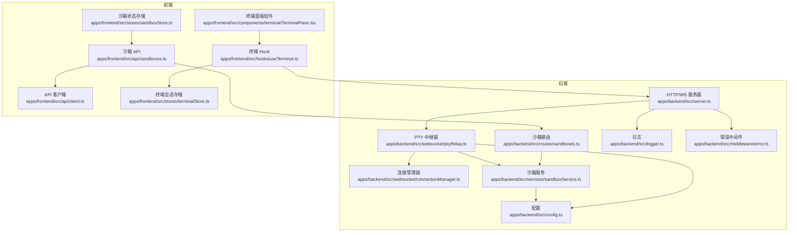
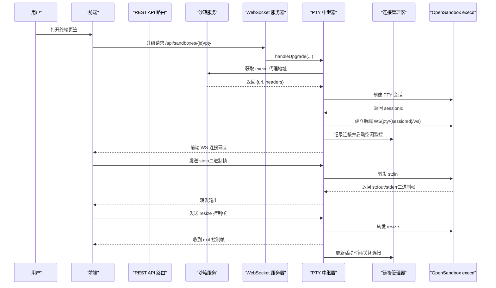
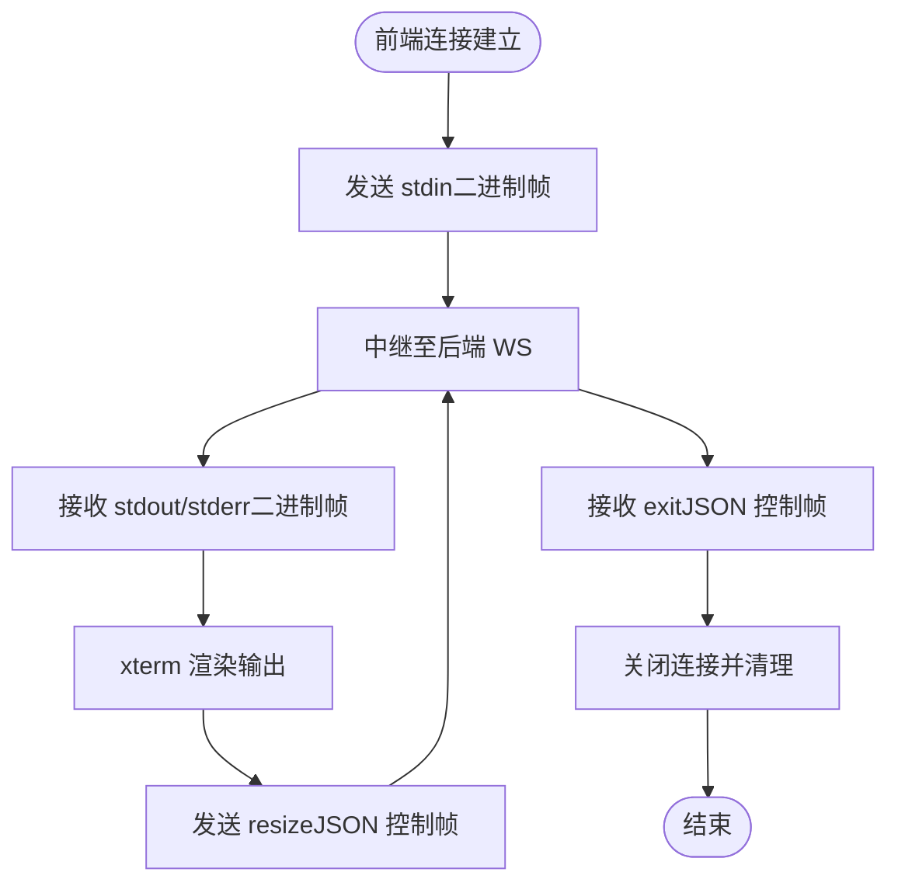
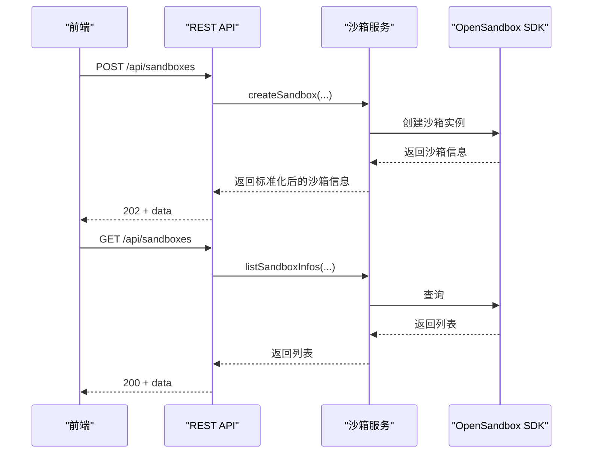
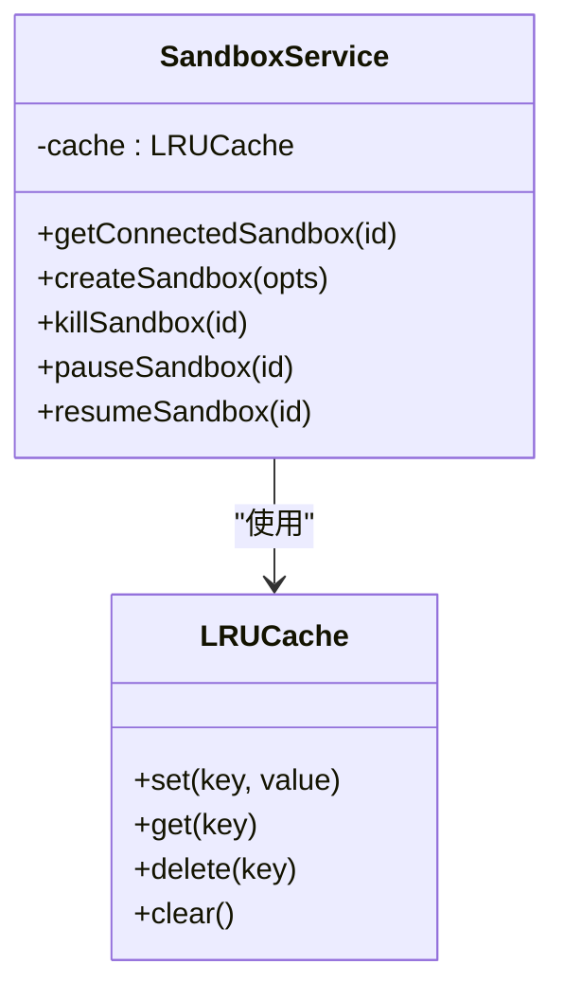
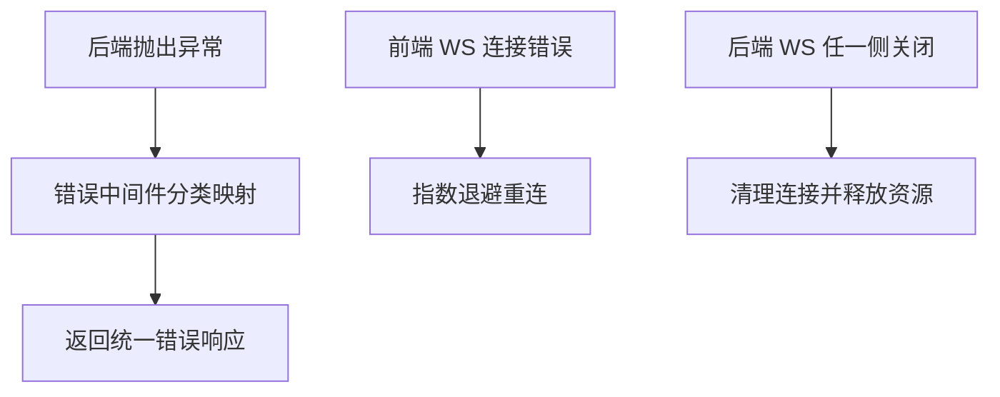
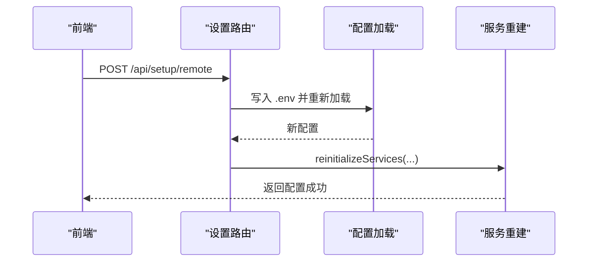
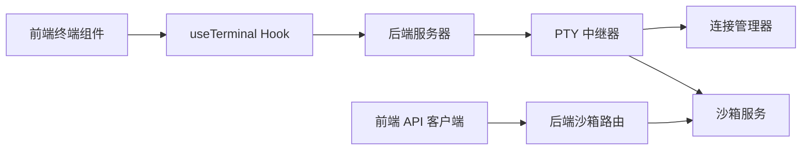

# 数据流设计

<cite>
**本文引用的文件**
- [apps/backend/src/websocket/ptyRelay.ts](file://apps/backend/src/websocket/ptyRelay.ts)
- [apps/backend/src/websocket/connectionManager.ts](file://apps/backend/src/websocket/connectionManager.ts)
- [apps/backend/src/websocket/types.ts](file://apps/backend/src/websocket/types.ts)
- [apps/backend/src/services/sandboxService.ts](file://apps/backend/src/services/sandboxService.ts)
- [apps/backend/src/routes/sandboxes.ts](file://apps/backend/src/routes/sandboxes.ts)
- [apps/backend/src/server.ts](file://apps/backend/src/server.ts)
- [apps/backend/src/config.ts](file://apps/backend/src/config.ts)
- [apps/backend/src/middleware/error.ts](file://apps/backend/src/middleware/error.ts)
- [apps/backend/src/logger.ts](file://apps/backend/src/logger.ts)
- [apps/frontend/src/hooks/useTerminal.ts](file://apps/frontend/src/hooks/useTerminal.ts)
- [apps/frontend/src/stores/terminalStore.ts](file://apps/frontend/src/stores/terminalStore.ts)
- [apps/frontend/src/components/terminal/TerminalPane.tsx](file://apps/frontend/src/components/terminal/TerminalPane.tsx)
- [apps/frontend/src/api/client.ts](file://apps/frontend/src/api/client.ts)
- [apps/frontend/src/api/sandboxes.ts](file://apps/frontend/src/api/sandboxes.ts)
- [apps/frontend/src/stores/sandboxStore.ts](file://apps/frontend/src/stores/sandboxStore.ts)
- [apps/backend/src/routes/setup.ts](file://apps/backend/src/routes/setup.ts)
- [apps/backend/src/services/setupService.ts](file://apps/backend/src/services/setupService.ts)
</cite>

## 目录
1. [引言](#引言)
2. [项目结构](#项目结构)
3. [核心组件](#核心组件)
4. [架构总览](#架构总览)
5. [详细组件分析](#详细组件分析)
6. [依赖关系分析](#依赖关系分析)
7. [性能考量](#性能考量)
8. [故障排查指南](#故障排查指南)
9. [结论](#结论)
10. [附录](#附录)

## 引言
本文件围绕 Sandbox Manager 的数据流设计进行系统化说明，覆盖从前端用户操作到后端处理与 WebSocket 实时数据转发的完整链路；重点阐述：
- 实时数据流：WebSocket 帧格式、PTY 中继机制、会话状态管理
- 异步数据处理：事件驱动的状态更新与同步机制
- 缓存策略与一致性：LRU 缓存在 Sandbox 连接中的应用与数据刷新策略
- 错误传播与异常处理：错误状态的传递与恢复机制
- 关键业务场景的数据流图与时序图

## 项目结构
系统由前后端两部分组成，后端负责 REST API、WebSocket 升级与 PTY 中继，前端负责终端交互、状态存储与 API 调用。

图表来源
- [apps/backend/src/server.ts:36-90](file://apps/backend/src/server.ts#L36-L90)
- [apps/backend/src/websocket/ptyRelay.ts:22-38](file://apps/backend/src/websocket/ptyRelay.ts#L22-L38)
- [apps/backend/src/websocket/connectionManager.ts:7-16](file://apps/backend/src/websocket/connectionManager.ts#L7-L16)
- [apps/backend/src/services/sandboxService.ts:11-47](file://apps/backend/src/services/sandboxService.ts#L11-L47)
- [apps/backend/src/routes/sandboxes.ts:9-55](file://apps/backend/src/routes/sandboxes.ts#L9-L55)
- [apps/frontend/src/hooks/useTerminal.ts:25-95](file://apps/frontend/src/hooks/useTerminal.ts#L25-L95)
- [apps/frontend/src/stores/terminalStore.ts:20-67](file://apps/frontend/src/stores/terminalStore.ts#L20-L67)
- [apps/frontend/src/api/client.ts:16-44](file://apps/frontend/src/api/client.ts#L16-L44)

章节来源
- [apps/backend/src/server.ts:36-90](file://apps/backend/src/server.ts#L36-L90)
- [apps/frontend/src/hooks/useTerminal.ts:25-95](file://apps/frontend/src/hooks/useTerminal.ts#L25-L95)

## 核心组件
- 后端服务器与路由：负责 REST API 注册、错误处理与 WebSocket 升级入口
- PTY 中继器：完成前端 WebSocket 与 execd 之间的透明二进制中继，并处理控制帧
- 连接管理器：维护前端/后端 WebSocket 的映射、空闲检测与清理
- 沙箱服务：封装 OpenSandbox SDK，提供 LRU 缓存与连接复用
- 前端终端 Hook：负责 xterm.js 与 WebSocket 的双向数据传输与重连逻辑
- 前端状态存储：管理沙箱列表与终端会话状态

章节来源
- [apps/backend/src/server.ts:36-90](file://apps/backend/src/server.ts#L36-L90)
- [apps/backend/src/websocket/ptyRelay.ts:22-38](file://apps/backend/src/websocket/ptyRelay.ts#L22-L38)
- [apps/backend/src/websocket/connectionManager.ts:7-16](file://apps/backend/src/websocket/connectionManager.ts#L7-L16)
- [apps/backend/src/services/sandboxService.ts:11-47](file://apps/backend/src/services/sandboxService.ts#L11-L47)
- [apps/frontend/src/hooks/useTerminal.ts:25-95](file://apps/frontend/src/hooks/useTerminal.ts#L25-L95)
- [apps/frontend/src/stores/terminalStore.ts:20-67](file://apps/frontend/src/stores/terminalStore.ts#L20-L67)

## 架构总览
下图展示了从用户在前端发起请求到后端处理与 WebSocket 实时数据转发的整体流程。

图表来源
- [apps/backend/src/server.ts:75-87](file://apps/backend/src/server.ts#L75-L87)
- [apps/backend/src/websocket/ptyRelay.ts:40-118](file://apps/backend/src/websocket/ptyRelay.ts#L40-L118)
- [apps/backend/src/websocket/connectionManager.ts:18-28](file://apps/backend/src/websocket/connectionManager.ts#L18-L28)
- [apps/backend/src/services/sandboxService.ts:129-138](file://apps/backend/src/services/sandboxService.ts#L129-L138)

## 详细组件分析

### 组件一：WebSocket 与 PTY 实时数据流
- 帧格式
  - 二进制帧：首位字节标识类型，0x00 为 stdin，0x01 为 stdout，0x02 为 stderr
  - 文本帧：JSON 控制消息，如 resize 与 exit
- 中继机制
  - 前端 WS → 后端 WS：透明转发二进制与文本帧
  - 后端 WS → 前端 WS：透明转发二进制与文本帧
- 会话状态管理
  - 连接建立：分配 connectionId，记录 sandboxId 与创建时间
  - 活动更新：每次消息到达更新 lastActivityAt
  - 空闲清理：超过 ptyIdleTimeoutMs 自动关闭
  - 异常关闭：任一侧 close/error 触发清理

图表来源
- [apps/backend/src/websocket/ptyRelay.ts:120-169](file://apps/backend/src/websocket/ptyRelay.ts#L120-L169)
- [apps/backend/src/websocket/connectionManager.ts:80-100](file://apps/backend/src/websocket/connectionManager.ts#L80-L100)
- [apps/frontend/src/hooks/useTerminal.ts:127-144](file://apps/frontend/src/hooks/useTerminal.ts#L127-L144)

章节来源
- [apps/backend/src/websocket/ptyRelay.ts:9-21](file://apps/backend/src/websocket/ptyRelay.ts#L9-L21)
- [apps/backend/src/websocket/ptyRelay.ts:120-169](file://apps/backend/src/websocket/ptyRelay.ts#L120-L169)
- [apps/backend/src/websocket/connectionManager.ts:7-16](file://apps/backend/src/websocket/connectionManager.ts#L7-L16)
- [apps/backend/src/websocket/connectionManager.ts:80-100](file://apps/backend/src/websocket/connectionManager.ts#L80-L100)
- [apps/frontend/src/hooks/useTerminal.ts:127-144](file://apps/frontend/src/hooks/useTerminal.ts#L127-L144)

### 组件二：REST API 与状态同步
- 路由层
  - 提供沙箱列表、创建、查询、删除、暂停/恢复等接口
  - 对未配置 OpenSandbox 的环境返回 503
- 前端状态
  - 使用 Zustand 存储沙箱列表与加载/错误状态
  - 创建成功后主动刷新列表，暂停/恢复时前端先置“过渡态”，再等待后端持久化

图表来源
- [apps/backend/src/routes/sandboxes.ts:95-149](file://apps/backend/src/routes/sandboxes.ts#L95-L149)
- [apps/backend/src/services/sandboxService.ts:62-88](file://apps/backend/src/services/sandboxService.ts#L62-L88)
- [apps/frontend/src/stores/sandboxStore.ts:21-31](file://apps/frontend/src/stores/sandboxStore.ts#L21-L31)

章节来源
- [apps/backend/src/routes/sandboxes.ts:34-45](file://apps/backend/src/routes/sandboxes.ts#L34-L45)
- [apps/backend/src/routes/sandboxes.ts:95-149](file://apps/backend/src/routes/sandboxes.ts#L95-L149)
- [apps/frontend/src/stores/sandboxStore.ts:21-31](file://apps/frontend/src/stores/sandboxStore.ts#L21-L31)

### 组件三：缓存策略与数据一致性
- LRU 缓存
  - 最大容量：50；TTL：10 分钟；逐出时尝试关闭底层连接
  - 用于缓存已连接的 Sandbox 实例，避免重复握手
- 数据刷新策略
  - 列表过滤：后端移除过期沙箱；前端创建/暂停/恢复后主动刷新
  - PTY 会话：通过 sessionId 映射到具体 execd 通道，确保会话唯一性

图表来源
- [apps/backend/src/services/sandboxService.ts:17-44](file://apps/backend/src/services/sandboxService.ts#L17-L44)
- [apps/backend/src/services/sandboxService.ts:112-123](file://apps/backend/src/services/sandboxService.ts#L112-L123)

章节来源
- [apps/backend/src/services/sandboxService.ts:17-44](file://apps/backend/src/services/sandboxService.ts#L17-L44)
- [apps/backend/src/routes/sandboxes.ts:82-86](file://apps/backend/src/routes/sandboxes.ts#L82-L86)

### 组件四：错误传播与异常处理
- HTTP 错误映射
  - 将 SDK 异常映射为合适的 HTTP 状态码（如 502/504），统一通过中间件返回
- WebSocket 错误
  - 前端实现指数退避重连，区分正常关闭与异常关闭
  - 后端在任一侧错误或关闭时清理连接并停止空闲监控
- 日志与追踪
  - 请求携带 x-request-id，便于跨服务定位问题

图表来源
- [apps/backend/src/middleware/error.ts:4-31](file://apps/backend/src/middleware/error.ts#L4-L31)
- [apps/frontend/src/hooks/useTerminal.ts:79-95](file://apps/frontend/src/hooks/useTerminal.ts#L79-L95)
- [apps/backend/src/websocket/ptyRelay.ts:146-166](file://apps/backend/src/websocket/ptyRelay.ts#L146-L166)

章节来源
- [apps/backend/src/middleware/error.ts:33-47](file://apps/backend/src/middleware/error.ts#L33-L47)
- [apps/frontend/src/hooks/useTerminal.ts:79-95](file://apps/frontend/src/hooks/useTerminal.ts#L79-L95)
- [apps/backend/src/websocket/ptyRelay.ts:146-166](file://apps/backend/src/websocket/ptyRelay.ts#L146-L166)

### 组件五：设置与配置变更的动态生效
- 设置流程
  - 远程配置：保存到 .env 并重新加载配置，动态重建服务
  - 本地 K8s：SSE 流式反馈安装进度，完成后写入默认配置并重建服务
- 动态服务重建
  - 释放旧服务，创建新服务（含新的 SandboxService、ConnectionManager、PtyRelay）

图表来源
- [apps/backend/src/routes/setup.ts:45-67](file://apps/backend/src/routes/setup.ts#L45-L67)
- [apps/backend/src/server.ts:96-118](file://apps/backend/src/server.ts#L96-L118)
- [apps/backend/src/services/setupService.ts:108-123](file://apps/backend/src/services/setupService.ts#L108-L123)

章节来源
- [apps/backend/src/routes/setup.ts:45-67](file://apps/backend/src/routes/setup.ts#L45-L67)
- [apps/backend/src/server.ts:96-118](file://apps/backend/src/server.ts#L96-L118)
- [apps/backend/src/services/setupService.ts:108-123](file://apps/backend/src/services/setupService.ts#L108-L123)

## 依赖关系分析
- 后端模块耦合
  - server.ts 作为入口，聚合各服务并注册路由与 WebSocket 升级
  - ptyRelay 依赖 sandboxService 与 connectionManager
  - routes/sandboxes 依赖 sandboxService
- 前端模块耦合
  - 终端组件依赖 useTerminal Hook，Hook 依赖 WebSocket
  - API 层统一封装 fetch，错误统一转换为 ApiError

图表来源
- [apps/backend/src/server.ts:50-64](file://apps/backend/src/server.ts#L50-L64)
- [apps/backend/src/websocket/ptyRelay.ts:22-38](file://apps/backend/src/websocket/ptyRelay.ts#L22-L38)
- [apps/frontend/src/api/client.ts:16-44](file://apps/frontend/src/api/client.ts#L16-L44)

章节来源
- [apps/backend/src/server.ts:50-64](file://apps/backend/src/server.ts#L50-L64)
- [apps/frontend/src/api/client.ts:16-44](file://apps/frontend/src/api/client.ts#L16-L44)

## 性能考量
- 透明中继：PTY 中继器不做解析，仅透传二进制帧，降低 CPU 开销
- LRU 缓存：减少重复连接与握手，提升并发创建/访问效率
- 空闲超时：及时释放长时间无活动的连接，避免资源泄漏
- 前端重连退避：指数退避+抖动，缓解瞬时网络波动带来的风暴效应
- 日志级别：生产环境建议使用 info 或更高级别，避免 debug 造成 IO 压力

## 故障排查指南
- WebSocket 无法升级
  - 检查 URL 是否匹配 /api/sandboxes/{id}/pty
  - 查看后端日志中的升级请求与超时信息
- PTY 会话创建失败
  - 核查 OpenSandbox 配置与鉴权头是否正确传递
  - 关注后端日志中的 execd 代理地址解析与会话创建响应
- 输出不显示或卡顿
  - 确认前端二进制帧类型位与后端中继逻辑一致
  - 检查 resize 控制帧是否正确发送
- 连接频繁断开
  - 前端检查重连策略与关闭码（1000 表示正常）
  - 后端检查空闲超时配置与连接清理逻辑
- 错误响应不明确
  - 查看错误中间件映射与请求 ID，定位具体异常类型

章节来源
- [apps/backend/src/server.ts:75-87](file://apps/backend/src/server.ts#L75-L87)
- [apps/backend/src/websocket/ptyRelay.ts:110-118](file://apps/backend/src/websocket/ptyRelay.ts#L110-L118)
- [apps/frontend/src/hooks/useTerminal.ts:79-95](file://apps/frontend/src/hooks/useTerminal.ts#L79-L95)
- [apps/backend/src/websocket/connectionManager.ts:92-100](file://apps/backend/src/websocket/connectionManager.ts#L92-L100)
- [apps/backend/src/middleware/error.ts:14-31](file://apps/backend/src/middleware/error.ts#L14-L31)

## 结论
Sandbox Manager 的数据流以“REST API + WebSocket 中继”为核心，结合 LRU 缓存与事件驱动的状态更新，实现了低延迟、可扩展且可观测的沙箱终端体验。通过清晰的错误传播与动态配置生效机制，系统在复杂环境中仍能保持稳定与可维护性。

## 附录
- 关键配置项
  - OpenSandbox 服务地址、协议、API Key、请求超时
  - CORS 允许域、日志级别、PTY 空闲超时
- 前端终端特性
  - 自适应布局、链接识别、滚动回放、自动重连与退避策略

章节来源
- [apps/backend/src/config.ts:3-23](file://apps/backend/src/config.ts#L3-L23)
- [apps/frontend/src/hooks/useTerminal.ts:102-150](file://apps/frontend/src/hooks/useTerminal.ts#L102-L150)