# 整体架构概览

<cite>
**本文档引用的文件**
- [README.md](file://README.md)
- [docs/system-architecture.md](file://docs/system-architecture.md)
- [pnpm-workspace.yaml](file://pnpm-workspace.yaml)
- [package.json](file://package.json)
- [apps/backend/src/server.ts](file://apps/backend/src/server.ts)
- [apps/backend/src/index.ts](file://apps/backend/src/index.ts)
- [apps/backend/src/config.ts](file://apps/backend/src/config.ts)
- [apps/backend/src/routes/index.ts](file://apps/backend/src/routes/index.ts)
- [apps/backend/src/services/sandboxService.ts](file://apps/backend/src/services/sandboxService.ts)
- [apps/backend/src/websocket/connectionManager.ts](file://apps/backend/src/websocket/connectionManager.ts)
- [apps/backend/src/websocket/ptyRelay.ts](file://apps/backend/src/websocket/ptyRelay.ts)
- [apps/backend/src/services/infraRunner.ts](file://apps/backend/src/services/infraRunner.ts)
- [apps/backend/src/services/envCheckService.ts](file://apps/backend/src/services/envCheckService.ts)
- [apps/frontend/src/main.tsx](file://apps/frontend/src/main.tsx)
- [apps/frontend/src/App.tsx](file://apps/frontend/src/App.tsx)
- [apps/frontend/src/api/client.ts](file://apps/frontend/src/api/client.ts)
- [apps/frontend/vite.config.ts](file://apps/frontend/vite.config.ts)
- [infra/helm/sandbox-platform/templates/ingress.yaml](file://infra/helm/sandbox-platform/templates/ingress.yaml)
- [infra/opensandbox/sandbox-ingress.yaml](file://infra/opensandbox/sandbox-ingress.yaml)
- [infra/opensandbox/server-ingress.yaml](file://infra/opensandbox/server-ingress.yaml)
</cite>

## 更新摘要
**所做更改**
- 新增完整的系统架构文档，包含详细的架构图和请求流程说明
- 更新架构总览部分，整合新增的系统架构信息
- 新增 DNS 解析流程和三条 Ingress 路由的详细说明
- 新增典型请求链路的完整序列图
- 更新基础设施部署相关的配置和服务说明

## 目录
1. [引言](#引言)
2. [项目结构](#项目结构)
3. [核心组件](#核心组件)
4. [架构总览](#架构总览)
5. [DNS 解析与 Ingress 路由](#dns-解析与-ingress-路由)
6. [典型请求流程](#典型请求流程)
7. [详细组件分析](#详细组件分析)
8. [基础设施与部署](#基础设施与部署)
9. [依赖关系分析](#依赖关系分析)
10. [性能考虑](#性能考虑)
11. [故障排除指南](#故障排除指南)
12. [结论](#结论)

## 引言
本项目是一个基于 OpenSandbox 的 Kubernetes AI 沙箱管理平台，提供 Web UI 来创建、管理和交互式访问隔离的沙箱环境。系统采用 monorepo 工作区组织前后端代码，后端以 Express 提供 REST API 与 WebSocket 支持，前端使用 React 19 + TypeScript 构建用户界面并通过 xterm.js 实现实时终端交互。

系统的关键设计理念包括：
- 分层架构：清晰分离前端应用层、后端服务层与底层基础设施层
- 微服务思想：后端服务模块化，便于独立演进与扩展
- 事件驱动架构：通过 WebSocket 实现 PTY 终端的双向实时通信
- 前后端分离：前端通过代理访问后端 API，降低耦合度
- 多域名路由：通过 Ingress Controller 实现多域名和多路由的统一入口管理

## 项目结构
项目采用 pnpm monorepo 结构，根目录通过 workspace 管理多个包。前端与后端分别位于 apps/frontend 与 apps/backend，各自拥有独立的构建配置与依赖。

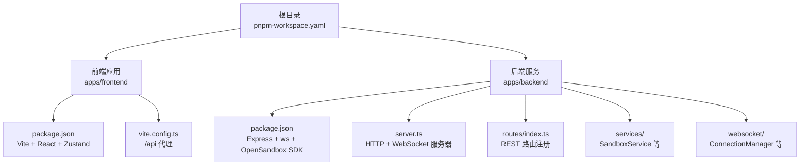

**图表来源**
- [pnpm-workspace.yaml:1-3](file://pnpm-workspace.yaml#L1-L3)
- [apps/frontend/package.json:1-32](file://apps/frontend/package.json#L1-L32)
- [apps/backend/package.json:1-32](file://apps/backend/package.json#L1-L32)
- [apps/frontend/vite.config.ts:1-22](file://apps/frontend/vite.config.ts#L1-L22)
- [apps/backend/src/server.ts:1-119](file://apps/backend/src/server.ts#L1-L119)
- [apps/backend/src/routes/index.ts:1-16](file://apps/backend/src/routes/index.ts#L1-L16)

**章节来源**
- [README.md:202-228](file://README.md#L202-L228)
- [pnpm-workspace.yaml:1-6](file://pnpm-workspace.yaml#L1-L6)
- [package.json:1-20](file://package.json#L1-L20)

## 核心组件
- 前端应用（React + TypeScript）：负责用户界面渲染、状态管理（Zustand）、路由导航与 API 客户端封装
- 后端服务（Express + WebSocket）：提供 REST API 与 WebSocket 通道，封装 OpenSandbox SDK，管理沙箱生命周期与 PTY 会话
- WebSocket 通信层：实现 PTY 二进制帧透传，维护连接状态与空闲检测
- 服务层（SandboxService）：基于 LRU 缓存连接沙箱实例，提供创建、暂停、恢复、终止等操作
- 配置与日志：集中管理环境变量与日志级别，支持动态重载
- 基础设施运行器（InfraRunner）：自动化部署 OpenSandbox 基础设施和 Ingress 资源
- 环境检查服务（EnvCheckService）：提供 DNS、Ingress Nginx 等环境检查和安装指导

**章节来源**
- [apps/frontend/src/main.tsx:1-12](file://apps/frontend/src/main.tsx#L1-L12)
- [apps/frontend/src/App.tsx:1-114](file://apps/frontend/src/App.tsx#L1-L114)
- [apps/backend/src/server.ts:1-119](file://apps/backend/src/server.ts#L1-L119)
- [apps/backend/src/services/sandboxService.ts:1-148](file://apps/backend/src/services/sandboxService.ts#L1-L148)
- [apps/backend/src/websocket/connectionManager.ts:1-102](file://apps/backend/src/websocket/connectionManager.ts#L1-L102)
- [apps/backend/src/config.ts:1-71](file://apps/backend/src/config.ts#L1-L71)
- [apps/backend/src/services/infraRunner.ts:1-555](file://apps/backend/src/services/infraRunner.ts#L1-L555)
- [apps/backend/src/services/envCheckService.ts:1-415](file://apps/backend/src/services/envCheckService.ts#L1-L415)

## 架构总览
系统采用"前端应用 + 后端服务 + 实时通信层 + 基础设施层"的四层架构，结合 OpenSandbox 基础设施实现沙箱管理与终端交互。所有流量统一经过 K8s Nginx Ingress Controller，通过 HTTP Host 头进行路由分发。

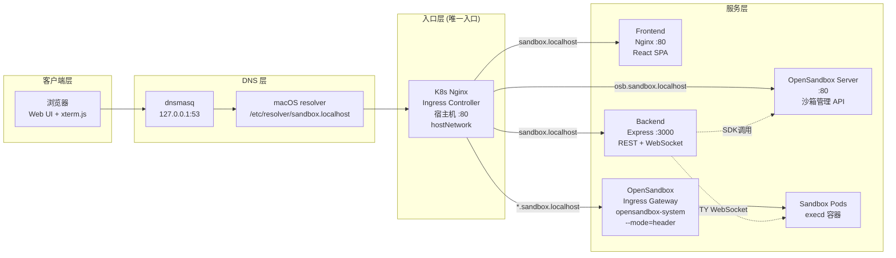

**图表来源**
- [docs/system-architecture.md:5-40](file://docs/system-architecture.md#L5-L40)
- [apps/backend/src/server.ts:1-119](file://apps/backend/src/server.ts#L1-L119)
- [apps/backend/src/services/sandboxService.ts:1-148](file://apps/backend/src/services/sandboxService.ts#L1-L148)
- [apps/backend/src/websocket/connectionManager.ts:1-102](file://apps/backend/src/websocket/connectionManager.ts#L1-L102)
- [apps/frontend/vite.config.ts:1-22](file://apps/frontend/vite.config.ts#L1-L22)

## DNS 解析与 Ingress 路由

### DNS 解析流程
系统使用 dnsmasq 和 macOS resolver 实现自定义域名解析，所有沙箱域名都解析到 127.0.0.1，然后由 Ingress Controller 根据 Host 头进行路由分发。

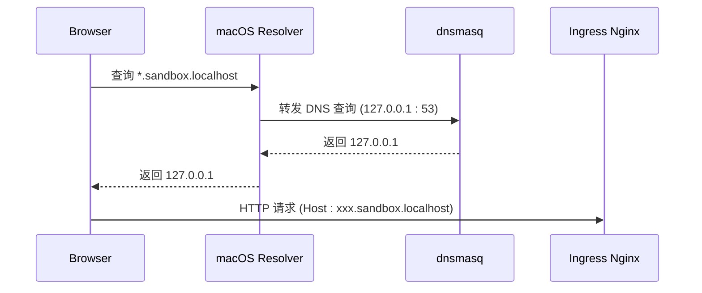

**图表来源**
- [docs/system-architecture.md:44-56](file://docs/system-architecture.md#L44-L56)

### 三条 Ingress 路由
所有流量统一经过 K8s Nginx Ingress Controller，通过 HTTP Host 头匹配分发到不同的后端服务：

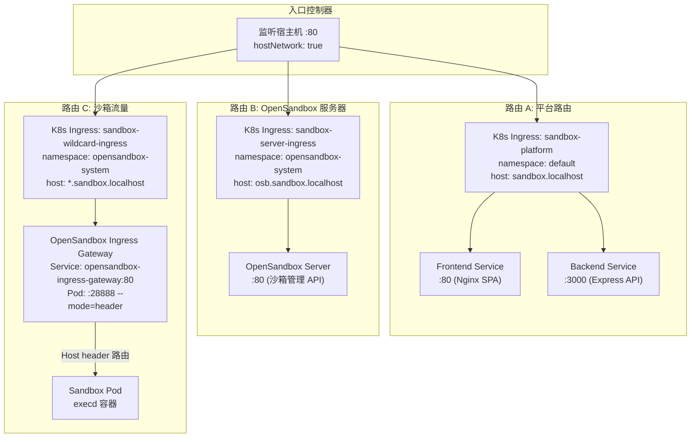

**图表来源**
- [docs/system-architecture.md:77-110](file://docs/system-architecture.md#L77-L110)

### 路由对照表
| Host 匹配 | K8s Ingress 资源 | Namespace | 后端 Service | 用途 |
|-----------|------------------|-----------|--------------|------|
| `sandbox.localhost` | `sandbox-platform` | default | Frontend(:80) + Backend(:3000) | Web UI + REST API + WebSocket |
| `osb.sandbox.localhost` | `sandbox-server-ingress` | opensandbox-system | opensandbox-server(:80) | 沙箱管理 API (SDK 调用) |
| `*.sandbox.localhost` | `sandbox-wildcard-ingress` | opensandbox-system | opensandbox-ingress-gateway(:80) → Sandbox Pods | 沙箱 Web 服务访问 |

**章节来源**
- [docs/system-architecture.md:112-132](file://docs/system-architecture.md#L112-L132)

## 典型请求流程

### 1. Web UI 访问流程
用户通过浏览器访问平台 Web UI 的完整流程：

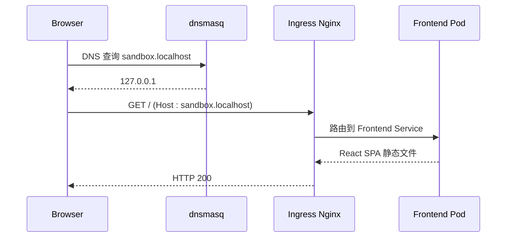

**图表来源**
- [docs/system-architecture.md:151-164](file://docs/system-architecture.md#L151-L164)

### 2. API 调用流程
REST API 调用通过 OpenSandbox SDK 与后端服务交互：

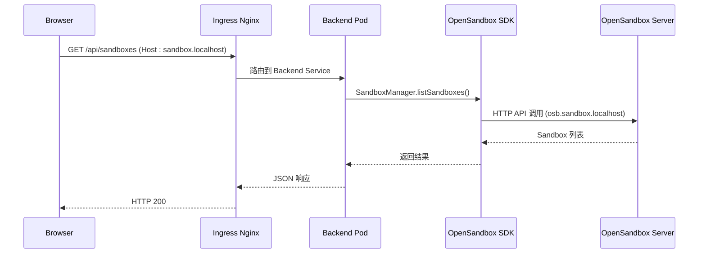

**图表来源**
- [docs/system-architecture.md:168-184](file://docs/system-architecture.md#L168-L184)

### 3. PTY WebSocket 终端流程
实时终端交互通过 WebSocket 实现双向数据传输：

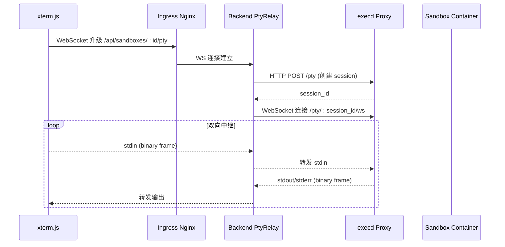

**图表来源**
- [docs/system-architecture.md:188-207](file://docs/system-architecture.md#L188-L207)

### 4. Sandbox Web 服务访问流程
沙箱内部 Web 服务通过 OpenSandbox Gateway 进行路由：

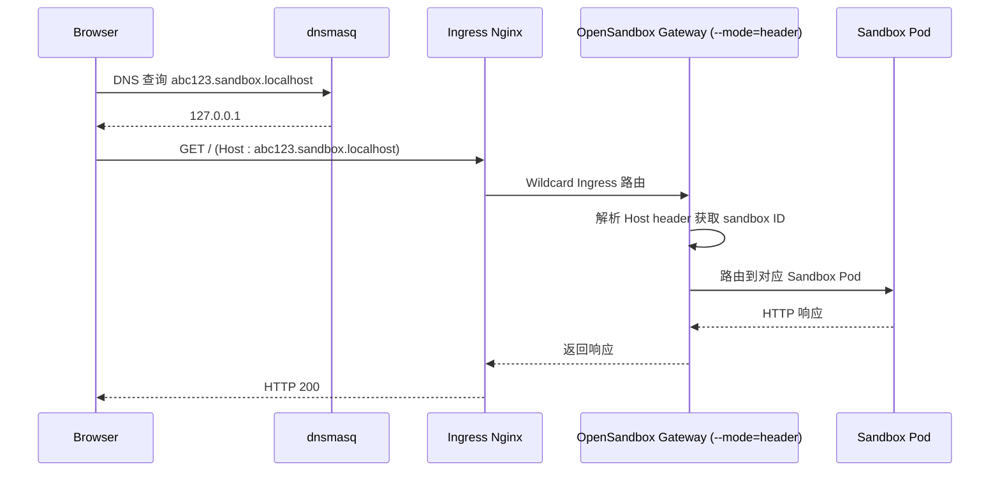

**图表来源**
- [docs/system-architecture.md:211-228](file://docs/system-architecture.md#L211-L228)

**章节来源**
- [docs/system-architecture.md:147-228](file://docs/system-architecture.md#L147-L228)

## 详细组件分析

### 前端应用（React + TypeScript）
- 路由与页面：使用 React Router DOM 管理页面导航，包含仪表盘、沙箱详情、镜像管理与设置向导
- 状态管理：采用 Zustand 管理沙箱、镜像、终端等状态
- API 客户端：统一的请求封装，支持错误处理与响应解析
- 开发体验：Vite 提供热更新与代理，将 /api 请求转发至后端

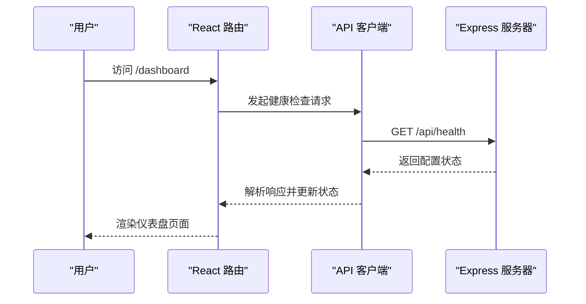

**图表来源**
- [apps/frontend/src/App.tsx:1-114](file://apps/frontend/src/App.tsx#L1-L114)
- [apps/frontend/src/api/client.ts:1-45](file://apps/frontend/src/api/client.ts#L1-L45)
- [apps/backend/src/routes/index.ts:1-16](file://apps/backend/src/routes/index.ts#L1-L16)

**章节来源**
- [apps/frontend/src/main.tsx:1-12](file://apps/frontend/src/main.tsx#L1-L12)
- [apps/frontend/src/App.tsx:1-114](file://apps/frontend/src/App.tsx#L1-L114)
- [apps/frontend/src/api/client.ts:1-45](file://apps/frontend/src/api/client.ts#L1-L45)
- [apps/frontend/vite.config.ts:1-22](file://apps/frontend/vite.config.ts#L1-L22)

### 后端服务（Express + WebSocket）
- 服务器初始化：创建 Express 应用，注册中间件、服务实例与路由；同时启动 WebSocket 服务器
- 升级处理：对 /api/sandboxes/:id/pty 路径进行手动升级，建立 PTY 会话
- 服务注入：将 SandboxService、ImageService、ConnectionManager 等服务注入到 app.locals，供路由使用
- 动态重载：支持在配置变更后重新初始化服务

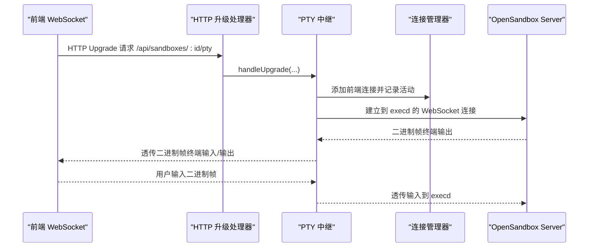

**图表来源**
- [apps/backend/src/server.ts:75-87](file://apps/backend/src/server.ts#L75-L87)
- [apps/backend/src/websocket/connectionManager.ts:30-46](file://apps/backend/src/websocket/connectionManager.ts#L30-L46)
- [apps/backend/src/services/sandboxService.ts:129-138](file://apps/backend/src/services/sandboxService.ts#L129-L138)

**章节来源**
- [apps/backend/src/server.ts:1-119](file://apps/backend/src/server.ts#L1-L119)
- [apps/backend/src/index.ts:1-34](file://apps/backend/src/index.ts#L1-L34)
- [apps/backend/src/config.ts:1-71](file://apps/backend/src/config.ts#L1-L71)

### 服务层（SandboxService）
- LRU 缓存：缓存已连接的 Sandbox 实例，减少重复连接开销
- 生命周期管理：提供创建、暂停、恢复、终止沙箱的能力
- 连接复用：通过缓存复用已连接实例，提升性能
- 端点获取：返回 execd 代理地址与必要头部，供 PTY 中继使用

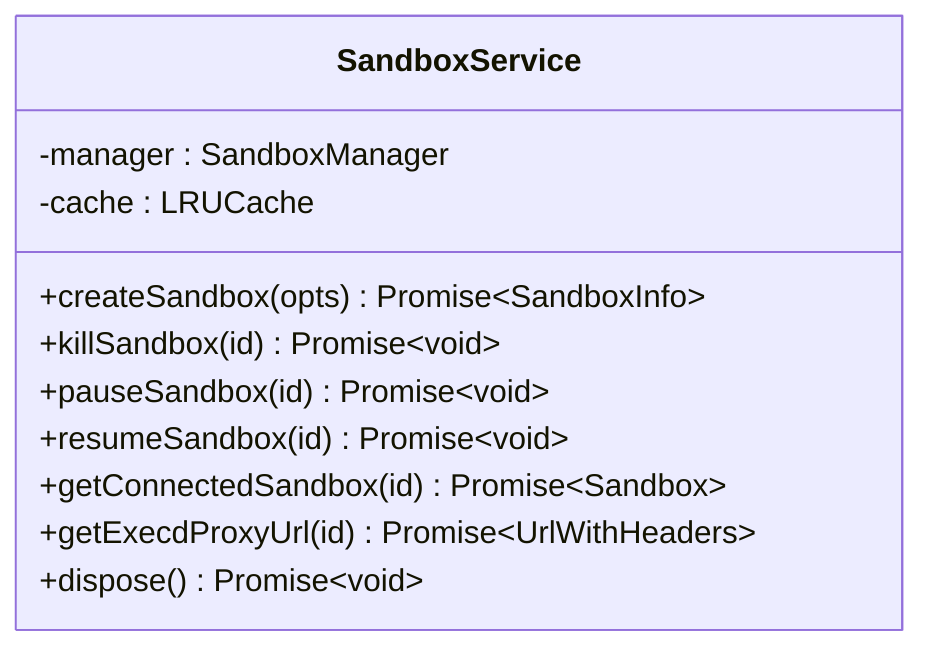

**图表来源**
- [apps/backend/src/services/sandboxService.ts:1-148](file://apps/backend/src/services/sandboxService.ts#L1-L148)

**章节来源**
- [apps/backend/src/services/sandboxService.ts:1-148](file://apps/backend/src/services/sandboxService.ts#L1-L148)

### WebSocket 通信层（ConnectionManager）
- 连接跟踪：维护前端 WebSocket 与后端 execd 连接的映射关系
- 活动监控：定期清理空闲连接，避免资源泄露
- 生命周期管理：支持添加、移除、查询与关闭所有连接

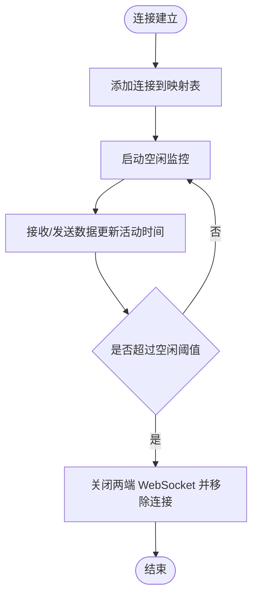

**图表来源**
- [apps/backend/src/websocket/connectionManager.ts:18-100](file://apps/backend/src/websocket/connectionManager.ts#L18-L100)

**章节来源**
- [apps/backend/src/websocket/connectionManager.ts:1-102](file://apps/backend/src/websocket/connectionManager.ts#L1-L102)

### 基础设施运行器（InfraRunner）
- 自动化部署：执行完整的 OpenSandbox 基础设施安装流程
- Ingress 资源管理：动态生成和应用 K8s Ingress 资源
- 网关配置：自动修复 OpenSandbox Ingress Gateway 的路由模式
- 进度监控：提供详细的安装进度事件流

**章节来源**
- [apps/backend/src/services/infraRunner.ts:1-555](file://apps/backend/src/services/infraRunner.ts#L1-L555)

### 环境检查服务（EnvCheckService）
- DNS 配置检查：验证 dnsmasq 和 macOS resolver 配置
- Ingress Nginx 检查：检查 Kubernetes Ingress Nginx Controller 状态
- 自动安装指导：提供详细的安装和配置命令
- 状态报告：生成完整的环境检查报告

**章节来源**
- [apps/backend/src/services/envCheckService.ts:1-415](file://apps/backend/src/services/envCheckService.ts#L1-L415)

## 基础设施与部署

### Helm Chart 配置
系统通过 Helm Chart 实现生产环境的标准化部署：

| 文件路径 | 作用 |
|----------|------|
| `infra/helm/sandbox-platform/templates/ingress.yaml` | K8s Ingress `sandbox-platform` 定义 (default ns) |
| `infra/opensandbox/sandbox-ingress.yaml` | K8s Ingress `sandbox-wildcard-ingress` 参考模板 (opensandbox-system ns) |
| `infra/opensandbox/server-ingress.yaml` | K8s Ingress `sandbox-server-ingress` 参考模板 (opensandbox-system ns) |
| `apps/backend/src/services/infraRunner.ts` | 动态生成 `sandbox-server-ingress` + `sandbox-wildcard-ingress` 资源 |
| `apps/backend/src/services/envCheckService.ts` | dnsmasq 配置生成 |
| `apps/backend/src/websocket/ptyRelay.ts` | PTY WebSocket 双向中继 |
| `apps/frontend/Dockerfile` | 前端 Nginx 代理配置 (生产模式) |
| `apps/frontend/vite.config.ts` | 前端 Vite dev proxy (开发模式) |

### OpenSandbox Ingress Gateway 说明
OpenSandbox Ingress Gateway 是项目提供的沙箱流量网关组件：

| 属性 | 值 |
|------|-----|
| **部署位置** | `opensandbox-system` namespace |
| **Service** | `opensandbox-ingress-gateway:80`（容器实际端口 :28888） |
| **路由模式** | `--mode=header`，通过解析 HTTP Host header 中的 sandbox ID 路由到对应 Pod |
| **作用** | 作为 K8s Ingress Nginx 的第二层路由，在多个 Sandbox Pod 间分发流量 |

**章节来源**
- [docs/system-architecture.md:134-146](file://docs/system-architecture.md#L134-L146)
- [apps/backend/src/services/infraRunner.ts:390-418](file://apps/backend/src/services/infraRunner.ts#L390-L418)

## 依赖关系分析
- 前端依赖 React、React Router DOM、Zustand、Tailwind CSS 与 xterm.js，构建工具为 Vite
- 后端依赖 Express、ws、OpenSandbox SDK、LRU 缓存与 Pino 日志
- 前端通过 /api 代理访问后端，避免跨域问题
- 后端通过 OpenSandbox SDK 与 Kubernetes 控制器交互
- 基础设施通过 Helm Chart 和脚本自动化部署

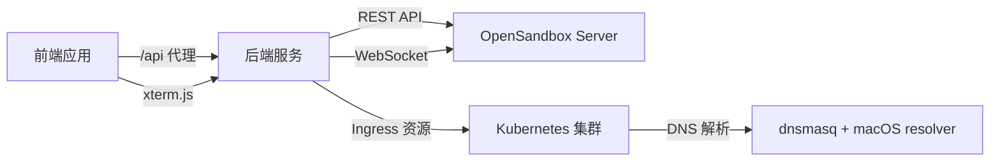

**图表来源**
- [apps/frontend/vite.config.ts:13-19](file://apps/frontend/vite.config.ts#L13-L19)
- [apps/backend/src/server.ts:75-87](file://apps/backend/src/server.ts#L75-L87)
- [apps/backend/src/services/sandboxService.ts:129-138](file://apps/backend/src/services/sandboxService.ts#L129-L138)

**章节来源**
- [apps/frontend/package.json:1-32](file://apps/frontend/package.json#L1-L32)
- [apps/backend/package.json:1-32](file://apps/backend/package.json#L1-L32)
- [apps/frontend/vite.config.ts:1-22](file://apps/frontend/vite.config.ts#L1-L22)

## 性能考虑
- LRU 缓存：SandboxService 使用 LRU 缓存连接实例，减少重复连接与握手开销
- 空闲连接清理：ConnectionManager 定期扫描并关闭长时间无活动的 PTY 连接，释放资源
- 请求限制：Express 中间件设置 JSON 负载上限，防止过大请求导致内存压力
- 日志级别：通过环境变量控制日志级别，平衡可观测性与性能
- Ingress 优化：WebSocket 支持和长连接超时配置确保实时通信性能

## 故障排除指南
- 后端未启动：前端会在无法访问后端时提示错误并引导启动后端服务
- OpenSandbox 未配置：首次访问会自动跳转到设置向导页面
- 端口转发失败：本地 K8s 模式下若端口转发失败，需检查集群状态与权限
- WebSocket 连接异常：检查 PTY 空闲超时配置与网络连通性
- DNS 解析问题：验证 dnsmasq 配置和 macOS resolver 设置
- Ingress 路由问题：检查三条 Ingress 资源的状态和配置

**章节来源**
- [apps/frontend/src/App.tsx:84-110](file://apps/frontend/src/App.tsx#L84-L110)
- [apps/backend/src/index.ts:21-34](file://apps/backend/src/index.ts#L21-L34)
- [apps/backend/src/config.ts:68](file://apps/backend/src/config.ts#L68)

## 结论
本项目通过清晰的分层架构与模块化设计，实现了从 UI 到基础设施的完整沙箱管理能力。新增的系统架构文档详细展示了基于 Ingress Controller 的多域名路由架构，以及完整的请求流程。前端与后端的分离提升了开发效率与可维护性，而 WebSocket 的引入则保证了终端交互的实时性与低延迟。结合 LRU 缓存与空闲连接清理等优化策略，系统在功能完整性与性能表现之间取得了良好平衡。

通过自动化基础设施部署和环境检查服务，系统大大降低了部署复杂度，为生产环境提供了可靠的基础设施支撑。多域名路由架构确保了系统的可扩展性和灵活性，能够支持复杂的多租户和多环境场景。