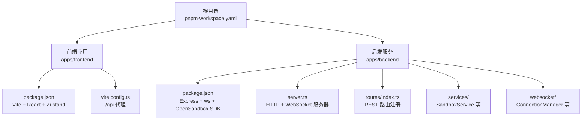
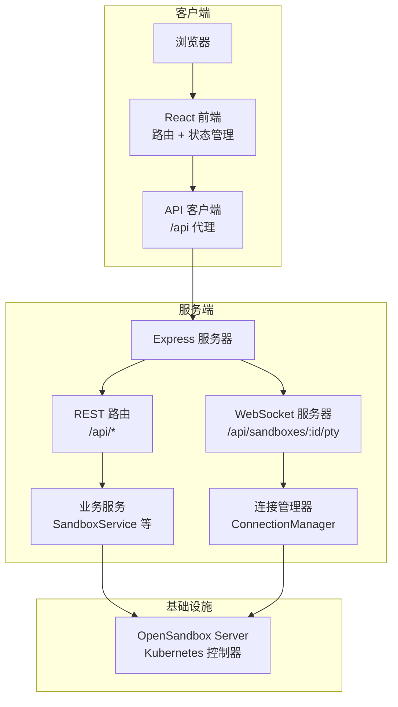
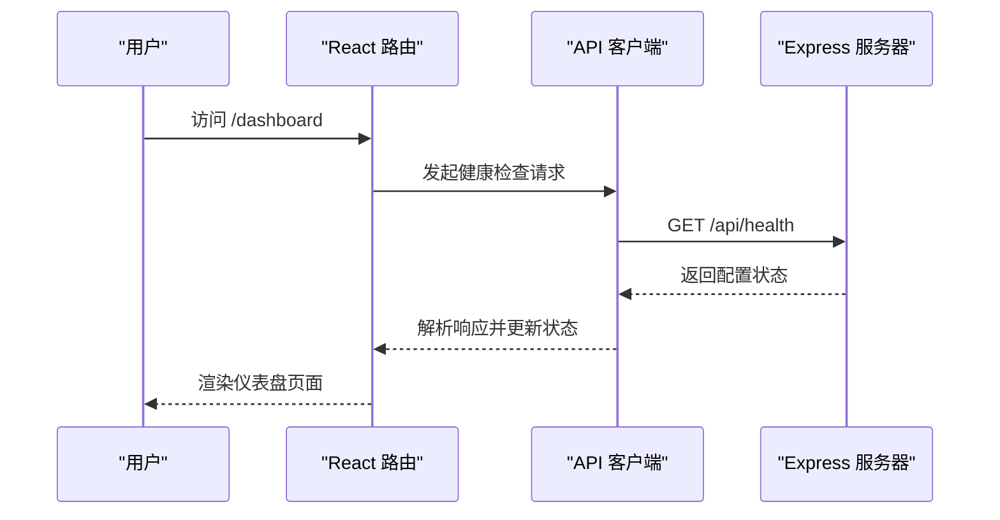
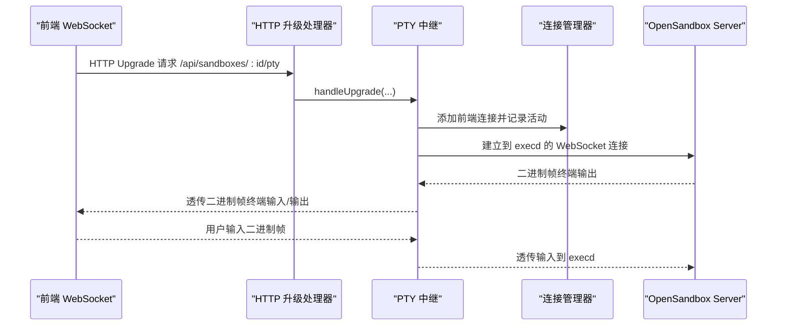
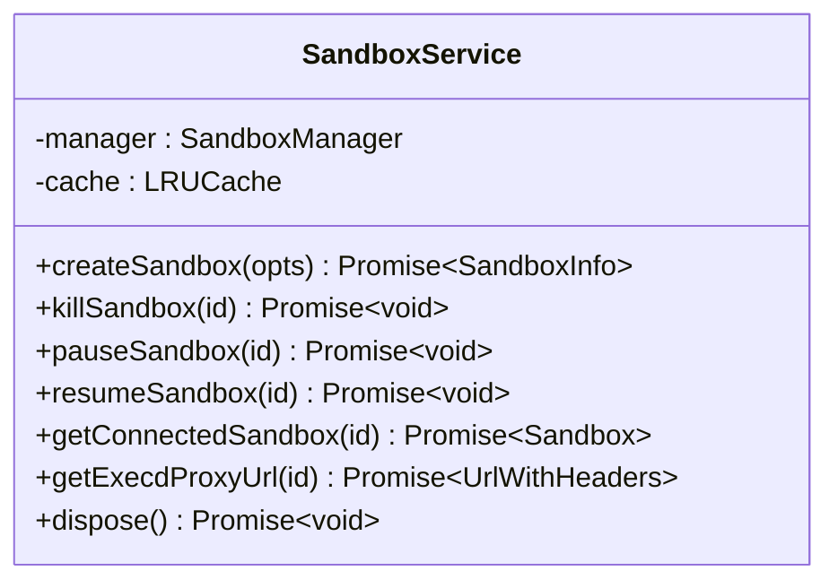
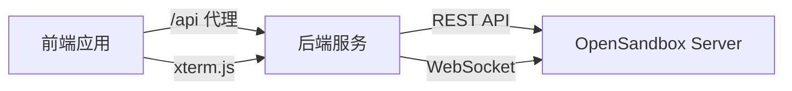

# 整体架构概览

<cite>
**本文档引用的文件**
- [README.md](file://README.md)
- [package.json](file://package.json)
- [pnpm-workspace.yaml](file://pnpm-workspace.yaml)
- [apps/backend/src/server.ts](file://apps/backend/src/server.ts)
- [apps/backend/src/index.ts](file://apps/backend/src/index.ts)
- [apps/backend/src/config.ts](file://apps/backend/src/config.ts)
- [apps/backend/src/routes/index.ts](file://apps/backend/src/routes/index.ts)
- [apps/backend/src/services/sandboxService.ts](file://apps/backend/src/services/sandboxService.ts)
- [apps/backend/src/websocket/connectionManager.ts](file://apps/backend/src/websocket/connectionManager.ts)
- [apps/frontend/src/main.tsx](file://apps/frontend/src/main.tsx)
- [apps/frontend/src/App.tsx](file://apps/frontend/src/App.tsx)
- [apps/frontend/src/api/client.ts](file://apps/frontend/src/api/client.ts)
- [apps/frontend/vite.config.ts](file://apps/frontend/vite.config.ts)
</cite>

## 目录
1. [引言](#引言)
2. [项目结构](#项目结构)
3. [核心组件](#核心组件)
4. [架构总览](#架构总览)
5. [详细组件分析](#详细组件分析)
6. [依赖关系分析](#依赖关系分析)
7. [性能考虑](#性能考虑)
8. [故障排除指南](#故障排除指南)
9. [结论](#结论)

## 引言
本项目是一个基于 OpenSandbox 的 Kubernetes AI 沙箱管理平台，提供 Web UI 来创建、管理和交互式访问隔离的沙箱环境。系统采用 monorepo 工作区组织前后端代码，后端以 Express 提供 REST API 与 WebSocket 支持，前端使用 React 19 + TypeScript 构建用户界面并通过 xterm.js 实现实时终端交互。

系统的关键设计理念包括：
- 分层架构：清晰分离前端应用层、后端服务层与底层基础设施层
- 微服务思想：后端服务模块化，便于独立演进与扩展
- 事件驱动架构：通过 WebSocket 实现 PTY 终端的双向实时通信
- 前后端分离：前端通过代理访问后端 API，降低耦合度

## 项目结构
项目采用 pnpm monorepo 结构，根目录通过 workspace 管理多个包。前端与后端分别位于 apps/frontend 与 apps/backend，各自拥有独立的构建配置与依赖。

图表来源
- [pnpm-workspace.yaml:1-3](file://pnpm-workspace.yaml#L1-L3)
- [apps/frontend/package.json:1-32](file://apps/frontend/package.json#L1-L32)
- [apps/backend/package.json:1-32](file://apps/backend/package.json#L1-L32)
- [apps/frontend/vite.config.ts:1-22](file://apps/frontend/vite.config.ts#L1-L22)
- [apps/backend/src/server.ts:1-119](file://apps/backend/src/server.ts#L1-L119)
- [apps/backend/src/routes/index.ts:1-16](file://apps/backend/src/routes/index.ts#L1-L16)

章节来源
- [README.md:114-140](file://README.md#L114-L140)
- [pnpm-workspace.yaml:1-3](file://pnpm-workspace.yaml#L1-L3)
- [package.json:1-20](file://package.json#L1-L20)

## 核心组件
- 前端应用（React + TypeScript）：负责用户界面渲染、状态管理（Zustand）、路由导航与 API 客户端封装
- 后端服务（Express + WebSocket）：提供 REST API 与 WebSocket 通道，封装 OpenSandbox SDK，管理沙箱生命周期与 PTY 会话
- WebSocket 通信层：实现 PTY 二进制帧透传，维护连接状态与空闲检测
- 服务层（SandboxService）：基于 LRU 缓存连接沙箱实例，提供创建、暂停、恢复、终止等操作
- 配置与日志：集中管理环境变量与日志级别，支持动态重载

章节来源
- [apps/frontend/src/main.tsx:1-12](file://apps/frontend/src/main.tsx#L1-L12)
- [apps/frontend/src/App.tsx:1-114](file://apps/frontend/src/App.tsx#L1-L114)
- [apps/backend/src/server.ts:1-119](file://apps/backend/src/server.ts#L1-L119)
- [apps/backend/src/services/sandboxService.ts:1-148](file://apps/backend/src/services/sandboxService.ts#L1-L148)
- [apps/backend/src/websocket/connectionManager.ts:1-102](file://apps/backend/src/websocket/connectionManager.ts#L1-L102)
- [apps/backend/src/config.ts:1-71](file://apps/backend/src/config.ts#L1-L71)

## 架构总览
系统采用“前端应用 + 后端服务 + 实时通信层”的三层架构，结合 OpenSandbox 基础设施实现沙箱管理与终端交互。

图表来源
- [apps/backend/src/server.ts:1-119](file://apps/backend/src/server.ts#L1-L119)
- [apps/backend/src/routes/index.ts:1-16](file://apps/backend/src/routes/index.ts#L1-L16)
- [apps/backend/src/services/sandboxService.ts:1-148](file://apps/backend/src/services/sandboxService.ts#L1-L148)
- [apps/backend/src/websocket/connectionManager.ts:1-102](file://apps/backend/src/websocket/connectionManager.ts#L1-L102)
- [apps/frontend/vite.config.ts:1-22](file://apps/frontend/vite.config.ts#L1-L22)

## 详细组件分析

### 前端应用（React + TypeScript）
- 路由与页面：使用 React Router DOM 管理页面导航，包含仪表盘、沙箱详情、镜像管理与设置向导
- 状态管理：采用 Zustand 管理沙箱、镜像、终端等状态
- API 客户端：统一的请求封装，支持错误处理与响应解析
- 开发体验：Vite 提供热更新与代理，将 /api 请求转发至后端

图表来源
- [apps/frontend/src/App.tsx:1-114](file://apps/frontend/src/App.tsx#L1-L114)
- [apps/frontend/src/api/client.ts:1-45](file://apps/frontend/src/api/client.ts#L1-L45)
- [apps/backend/src/routes/index.ts:1-16](file://apps/backend/src/routes/index.ts#L1-L16)

章节来源
- [apps/frontend/src/main.tsx:1-12](file://apps/frontend/src/main.tsx#L1-L12)
- [apps/frontend/src/App.tsx:1-114](file://apps/frontend/src/App.tsx#L1-L114)
- [apps/frontend/src/api/client.ts:1-45](file://apps/frontend/src/api/client.ts#L1-L45)
- [apps/frontend/vite.config.ts:1-22](file://apps/frontend/vite.config.ts#L1-L22)

### 后端服务（Express + WebSocket）
- 服务器初始化：创建 Express 应用，注册中间件、服务实例与路由；同时启动 WebSocket 服务器
- 升级处理：对 /api/sandboxes/:id/pty 路径进行手动升级，建立 PTY 会话
- 服务注入：将 SandboxService、ImageService、ConnectionManager 等服务注入到 app.locals，供路由使用
- 动态重载：支持在配置变更后重新初始化服务

图表来源
- [apps/backend/src/server.ts:75-87](file://apps/backend/src/server.ts#L75-L87)
- [apps/backend/src/websocket/connectionManager.ts:30-46](file://apps/backend/src/websocket/connectionManager.ts#L30-L46)
- [apps/backend/src/services/sandboxService.ts:129-138](file://apps/backend/src/services/sandboxService.ts#L129-L138)

章节来源
- [apps/backend/src/server.ts:1-119](file://apps/backend/src/server.ts#L1-L119)
- [apps/backend/src/index.ts:1-66](file://apps/backend/src/index.ts#L1-L66)
- [apps/backend/src/config.ts:1-71](file://apps/backend/src/config.ts#L1-L71)

### 服务层（SandboxService）
- LRU 缓存：缓存已连接的 Sandbox 实例，减少重复连接开销
- 生命周期管理：提供创建、暂停、恢复、终止沙箱的能力
- 连接复用：通过缓存复用已连接实例，提升性能
- 端点获取：返回 execd 代理地址与必要头部，供 PTY 中继使用

图表来源
- [apps/backend/src/services/sandboxService.ts:1-148](file://apps/backend/src/services/sandboxService.ts#L1-L148)

章节来源
- [apps/backend/src/services/sandboxService.ts:1-148](file://apps/backend/src/services/sandboxService.ts#L1-L148)

### WebSocket 通信层（ConnectionManager）
- 连接跟踪：维护前端 WebSocket 与后端 execd 连接的映射关系
- 活动监控：定期清理空闲连接，避免资源泄露
- 生命周期管理：支持添加、移除、查询与关闭所有连接

图表来源
- [apps/backend/src/websocket/connectionManager.ts:18-100](file://apps/backend/src/websocket/connectionManager.ts#L18-L100)

章节来源
- [apps/backend/src/websocket/connectionManager.ts:1-102](file://apps/backend/src/websocket/connectionManager.ts#L1-L102)

### 配置与部署
- 环境变量：集中定义后端端口、OpenSandbox 服务器地址、API Key、日志级别与 PTY 空闲超时等
- 本地模式：当 OpenSandbox Server 地址指向本地时，自动启动端口转发以访问集群内服务
- 生产部署：通过 Helm Chart 部署前端与后端服务，配合 Ingress 对外暴露

章节来源
- [apps/backend/src/config.ts:1-71](file://apps/backend/src/config.ts#L1-L71)
- [apps/backend/src/index.ts:17-46](file://apps/backend/src/index.ts#L17-L46)
- [README.md:142-151](file://README.md#L142-L151)

## 依赖关系分析
- 前端依赖 React、React Router DOM、Zustand、Tailwind CSS 与 xterm.js，构建工具为 Vite
- 后端依赖 Express、ws、OpenSandbox SDK、LRU 缓存与 Pino 日志
- 前端通过 /api 代理访问后端，避免跨域问题
- 后端通过 OpenSandbox SDK 与 Kubernetes 控制器交互

图表来源
- [apps/frontend/vite.config.ts:13-19](file://apps/frontend/vite.config.ts#L13-L19)
- [apps/backend/src/server.ts:75-87](file://apps/backend/src/server.ts#L75-L87)
- [apps/backend/src/services/sandboxService.ts:129-138](file://apps/backend/src/services/sandboxService.ts#L129-L138)

章节来源
- [apps/frontend/package.json:1-32](file://apps/frontend/package.json#L1-L32)
- [apps/backend/package.json:1-32](file://apps/backend/package.json#L1-L32)
- [apps/frontend/vite.config.ts:1-22](file://apps/frontend/vite.config.ts#L1-L22)

## 性能考虑
- LRU 缓存：SandboxService 使用 LRU 缓存连接实例，减少重复连接与握手开销
- 空闲连接清理：ConnectionManager 定期扫描并关闭长时间无活动的 PTY 连接，释放资源
- 请求限制：Express 中间件设置 JSON 负载上限，防止过大请求导致内存压力
- 日志级别：通过环境变量控制日志级别，平衡可观测性与性能

## 故障排除指南
- 后端未启动：前端会在无法访问后端时提示错误并引导启动后端服务
- OpenSandbox 未配置：首次访问会自动跳转到设置向导页面
- 端口转发失败：本地 K8s 模式下若端口转发失败，需检查集群状态与权限
- WebSocket 连接异常：检查 PTY 空闲超时配置与网络连通性

章节来源
- [apps/frontend/src/App.tsx:84-110](file://apps/frontend/src/App.tsx#L84-L110)
- [apps/backend/src/index.ts:38-44](file://apps/backend/src/index.ts#L38-L44)
- [apps/backend/src/config.ts:68](file://apps/backend/src/config.ts#L68)

## 结论
本项目通过清晰的分层架构与模块化设计，实现了从 UI 到基础设施的完整沙箱管理能力。前端与后端的分离提升了开发效率与可维护性，而 WebSocket 的引入则保证了终端交互的实时性与低延迟。结合 LRU 缓存与空闲连接清理等优化策略，系统在功能完整性与性能表现之间取得了良好平衡。