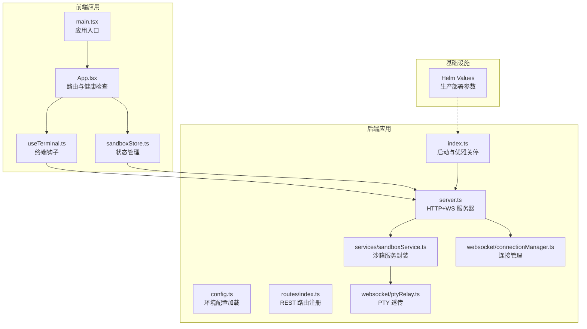
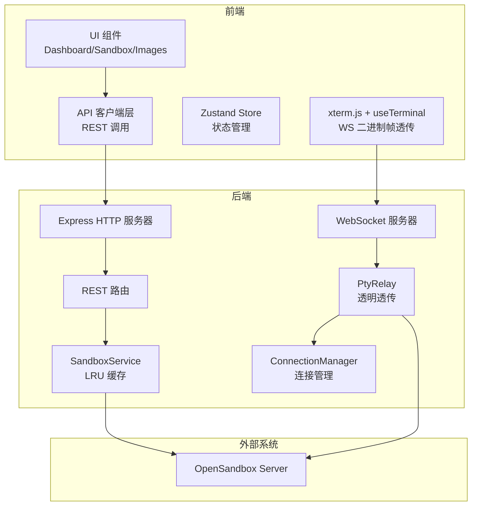
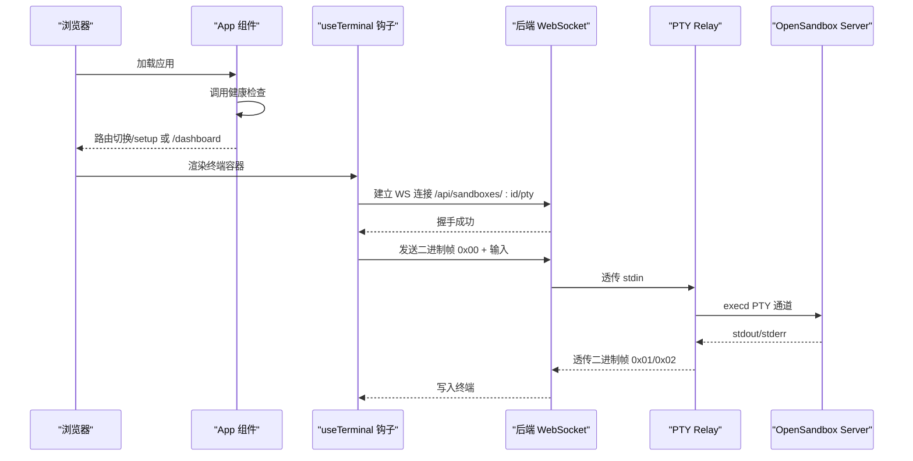
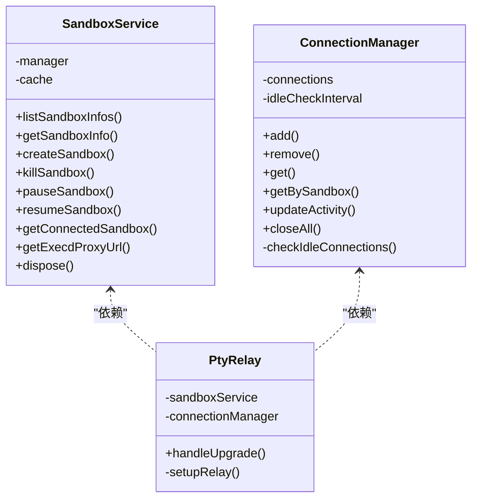
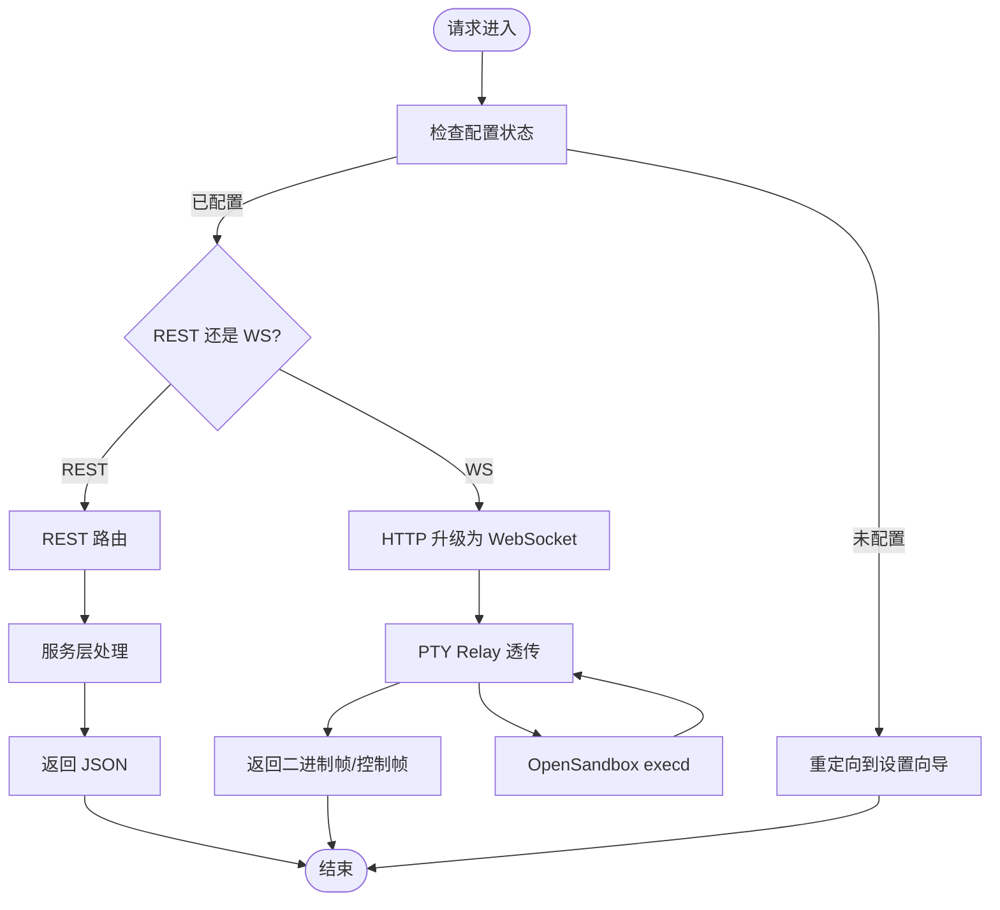
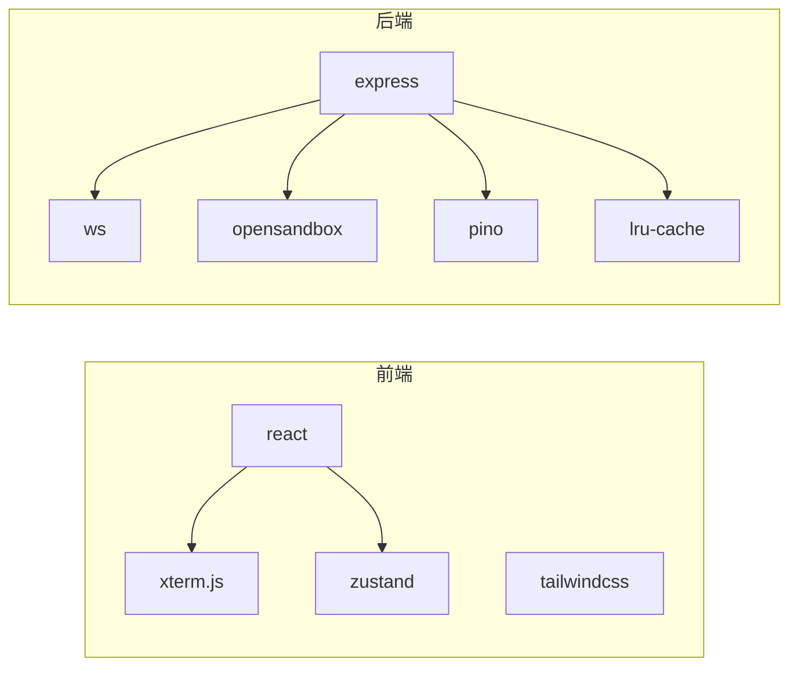

# 系统架构设计

<cite>
**本文档引用的文件**
- [README.md](file://README.md)
- [apps/backend/src/index.ts](file://apps/backend/src/index.ts)
- [apps/backend/src/server.ts](file://apps/backend/src/server.ts)
- [apps/backend/src/config.ts](file://apps/backend/src/config.ts)
- [apps/backend/src/routes/index.ts](file://apps/backend/src/routes/index.ts)
- [apps/backend/src/services/sandboxService.ts](file://apps/backend/src/services/sandboxService.ts)
- [apps/backend/src/websocket/connectionManager.ts](file://apps/backend/src/websocket/connectionManager.ts)
- [apps/backend/src/websocket/ptyRelay.ts](file://apps/backend/src/websocket/ptyRelay.ts)
- [apps/backend/package.json](file://apps/backend/package.json)
- [apps/frontend/src/main.tsx](file://apps/frontend/src/main.tsx)
- [apps/frontend/src/App.tsx](file://apps/frontend/src/App.tsx)
- [apps/frontend/src/hooks/useTerminal.ts](file://apps/frontend/src/hooks/useTerminal.ts)
- [apps/frontend/src/stores/sandboxStore.ts](file://apps/frontend/src/stores/sandboxStore.ts)
- [apps/frontend/package.json](file://apps/frontend/package.json)
- [infra/helm/sandbox-platform/values.yaml](file://infra/helm/sandbox-platform/values.yaml)
</cite>

## 目录
1. [引言](#引言)
2. [项目结构](#项目结构)
3. [核心组件](#核心组件)
4. [架构总览](#架构总览)
5. [详细组件分析](#详细组件分析)
6. [依赖关系分析](#依赖关系分析)
7. [性能考量](#性能考量)
8. [故障排查指南](#故障排查指南)
9. [结论](#结论)
10. [附录](#附录)

## 引言
本系统是一个基于 OpenSandbox 的 Kubernetes AI 沙箱管理平台，提供 Web UI 用于创建、管理和交互式访问隔离的沙箱环境。系统采用前后端分离架构：前端使用 React 19 + TypeScript + Zustand，后端使用 Express + WebSocket；终端交互通过 xterm.js 与后端 WebSocket 二进制帧透传实现。系统支持本地 Kubernetes 模式下的端口转发与远程集群模式，具备可扩展的 Helm 生产部署拓扑。

## 项目结构
项目采用 pnpm monorepo 结构，分为前端与后端两个独立包，共享根级工作区配置。基础设施通过 Helm Chart 提供生产级部署模板，OpenSandbox 控制器与资源池通过独立脚本安装。

**图表来源**
- [apps/frontend/src/main.tsx:1-12](file://apps/frontend/src/main.tsx#L1-L12)
- [apps/frontend/src/App.tsx:1-114](file://apps/frontend/src/App.tsx#L1-L114)
- [apps/frontend/src/hooks/useTerminal.ts:1-180](file://apps/frontend/src/hooks/useTerminal.ts#L1-L180)
- [apps/frontend/src/stores/sandboxStore.ts:1-63](file://apps/frontend/src/stores/sandboxStore.ts#L1-L63)
- [apps/backend/src/index.ts:1-66](file://apps/backend/src/index.ts#L1-L66)
- [apps/backend/src/server.ts:1-119](file://apps/backend/src/server.ts#L1-L119)
- [apps/backend/src/config.ts:1-71](file://apps/backend/src/config.ts#L1-L71)
- [apps/backend/src/routes/index.ts:1-16](file://apps/backend/src/routes/index.ts#L1-L16)
- [apps/backend/src/services/sandboxService.ts:1-148](file://apps/backend/src/services/sandboxService.ts#L1-L148)
- [apps/backend/src/websocket/ptyRelay.ts:1-171](file://apps/backend/src/websocket/ptyRelay.ts#L1-L171)
- [apps/backend/src/websocket/connectionManager.ts:1-102](file://apps/backend/src/websocket/connectionManager.ts#L1-L102)
- [infra/helm/sandbox-platform/values.yaml:1-44](file://infra/helm/sandbox-platform/values.yaml#L1-L44)

**章节来源**
- [README.md:114-140](file://README.md#L114-L140)
- [apps/backend/src/index.ts:1-66](file://apps/backend/src/index.ts#L1-L66)
- [apps/frontend/src/main.tsx:1-12](file://apps/frontend/src/main.tsx#L1-L12)

## 核心组件
- 前端组件
  - 应用入口与路由：负责初始化应用、健康检查与页面路由跳转。
  - 终端钩子：封装 xterm.js 与 WebSocket 的连接、消息收发与重连逻辑。
  - 状态管理：Zustand store 管理沙箱列表与操作状态。
- 后端组件
  - 服务器：Express + HTTP + WebSocket 一体化服务，统一处理 REST 与 WS 升级。
  - 配置：集中加载环境变量并校验必要项。
  - 服务层：SandboxService 封装 OpenSandbox SDK，LRU 缓存连接实例。
  - WebSocket 层：ConnectionManager 管理连接生命周期，PtyRelay 实现透明二进制帧透传。
- 基础设施
  - Helm Chart：定义镜像、资源、Ingress 与 Secrets 参数，支持生产部署。

**章节来源**
- [apps/frontend/src/App.tsx:1-114](file://apps/frontend/src/App.tsx#L1-L114)
- [apps/frontend/src/hooks/useTerminal.ts:1-180](file://apps/frontend/src/hooks/useTerminal.ts#L1-L180)
- [apps/frontend/src/stores/sandboxStore.ts:1-63](file://apps/frontend/src/stores/sandboxStore.ts#L1-L63)
- [apps/backend/src/server.ts:1-119](file://apps/backend/src/server.ts#L1-L119)
- [apps/backend/src/config.ts:1-71](file://apps/backend/src/config.ts#L1-L71)
- [apps/backend/src/services/sandboxService.ts:1-148](file://apps/backend/src/services/sandboxService.ts#L1-L148)
- [apps/backend/src/websocket/connectionManager.ts:1-102](file://apps/backend/src/websocket/connectionManager.ts#L1-L102)
- [apps/backend/src/websocket/ptyRelay.ts:1-171](file://apps/backend/src/websocket/ptyRelay.ts#L1-L171)
- [infra/helm/sandbox-platform/values.yaml:1-44](file://infra/helm/sandbox-platform/values.yaml#L1-L44)

## 架构总览
系统采用分层架构与事件驱动相结合的设计：
- 分层架构：前端 UI 层、API 客户端层、服务层；后端路由层、服务层、WebSocket 层。
- 微服务模式：后端以模块化服务封装（SandboxService、ImageService），便于替换与扩展。
- 事件驱动：WebSocket 升级与消息事件驱动终端交互，ConnectionManager 通过定时任务清理空闲连接。

**图表来源**
- [apps/frontend/src/App.tsx:1-114](file://apps/frontend/src/App.tsx#L1-L114)
- [apps/frontend/src/hooks/useTerminal.ts:1-180](file://apps/frontend/src/hooks/useTerminal.ts#L1-L180)
- [apps/backend/src/server.ts:1-119](file://apps/backend/src/server.ts#L1-L119)
- [apps/backend/src/services/sandboxService.ts:1-148](file://apps/backend/src/services/sandboxService.ts#L1-L148)
- [apps/backend/src/websocket/ptyRelay.ts:1-171](file://apps/backend/src/websocket/ptyRelay.ts#L1-L171)
- [apps/backend/src/websocket/connectionManager.ts:1-102](file://apps/backend/src/websocket/connectionManager.ts#L1-L102)

## 详细组件分析

### 前端架构与交互
- 应用入口与路由：应用入口负责渲染根节点；App 组件在挂载时进行后端健康检查，根据配置状态决定是否跳转至设置向导。
- 终端交互：useTerminal 钩子建立与后端的 WebSocket 连接，发送二进制帧（stdin）与 JSON 控制帧（resize），接收 stdout/stderr 文本流；内置指数退避重连与资源清理。
- 状态管理：sandboxStore 封装沙箱 CRUD 操作，统一处理加载状态与错误信息。

**图表来源**
- [apps/frontend/src/App.tsx:1-114](file://apps/frontend/src/App.tsx#L1-L114)
- [apps/frontend/src/hooks/useTerminal.ts:1-180](file://apps/frontend/src/hooks/useTerminal.ts#L1-L180)
- [apps/backend/src/server.ts:75-87](file://apps/backend/src/server.ts#L75-L87)
- [apps/backend/src/websocket/ptyRelay.ts:40-118](file://apps/backend/src/websocket/ptyRelay.ts#L40-L118)

**章节来源**
- [apps/frontend/src/App.tsx:1-114](file://apps/frontend/src/App.tsx#L1-L114)
- [apps/frontend/src/hooks/useTerminal.ts:1-180](file://apps/frontend/src/hooks/useTerminal.ts#L1-L180)
- [apps/frontend/src/stores/sandboxStore.ts:1-63](file://apps/frontend/src/stores/sandboxStore.ts#L1-L63)

### 后端架构与服务层
- 服务器创建：Express 应用注册 CORS、JSON 中间件与请求日志；初始化服务实例并注入 app.locals；注册 REST 路由；最后创建 HTTP 服务器并启动 WebSocket 升级处理。
- 配置加载：从环境变量加载端口、OpenSandbox 地址、API Key、CORS、日志级别与 PTY 空闲超时等参数。
- 服务封装：SandboxService 使用 LRU 缓存连接实例，避免频繁握手；提供沙箱生命周期管理与 execd 代理 URL 解析。
- WebSocket 透传：PtyRelay 在升级阶段完成前端 WS 握手、解析 execd 代理地址、创建 PTY 会话、建立后端 WS 并双向透传二进制帧；ConnectionManager 负责连接生命周期与空闲检测。

**图表来源**
- [apps/backend/src/services/sandboxService.ts:1-148](file://apps/backend/src/services/sandboxService.ts#L1-L148)
- [apps/backend/src/websocket/connectionManager.ts:1-102](file://apps/backend/src/websocket/connectionManager.ts#L1-L102)
- [apps/backend/src/websocket/ptyRelay.ts:1-171](file://apps/backend/src/websocket/ptyRelay.ts#L1-L171)

**章节来源**
- [apps/backend/src/server.ts:1-119](file://apps/backend/src/server.ts#L1-L119)
- [apps/backend/src/config.ts:1-71](file://apps/backend/src/config.ts#L1-L71)
- [apps/backend/src/services/sandboxService.ts:1-148](file://apps/backend/src/services/sandboxService.ts#L1-L148)
- [apps/backend/src/websocket/connectionManager.ts:1-102](file://apps/backend/src/websocket/connectionManager.ts#L1-L102)
- [apps/backend/src/websocket/ptyRelay.ts:1-171](file://apps/backend/src/websocket/ptyRelay.ts#L1-L171)

### 数据流与控制流
- REST 数据流：前端通过 API 客户端调用后端 REST 接口（沙箱列表、创建、暂停/恢复、删除、文件与命令接口），后端路由将请求委派给对应服务层。
- WebSocket 数据流：前端终端通过二进制帧发送用户输入，后端 PtyRelay 透传至 OpenSandbox execd；标准输出与错误输出以二进制帧返回，退出码通过 JSON 控制帧通知。
- 配置变更流程：后端在配置更新时重新初始化服务与连接管理器，确保新配置生效。

**图表来源**
- [apps/backend/src/server.ts:63-87](file://apps/backend/src/server.ts#L63-L87)
- [apps/backend/src/routes/index.ts:1-16](file://apps/backend/src/routes/index.ts#L1-L16)
- [apps/backend/src/websocket/ptyRelay.ts:40-118](file://apps/backend/src/websocket/ptyRelay.ts#L40-L118)

**章节来源**
- [apps/backend/src/server.ts:1-119](file://apps/backend/src/server.ts#L1-L119)
- [apps/backend/src/routes/index.ts:1-16](file://apps/backend/src/routes/index.ts#L1-L16)
- [apps/backend/src/websocket/ptyRelay.ts:1-171](file://apps/backend/src/websocket/ptyRelay.ts#L1-L171)

## 依赖关系分析
- 前端依赖：React 19、xterm.js、Tailwind CSS、Zustand、react-router-dom。
- 后端依赖：Express、ws、@alibaba-group/opensandbox、lru-cache、pino。
- 构建工具：pnpm monorepo、Vite、tsx、TypeScript。

**图表来源**
- [apps/frontend/package.json:11-20](file://apps/frontend/package.json#L11-L20)
- [apps/backend/package.json:11-21](file://apps/backend/package.json#L11-L21)

**章节来源**
- [apps/frontend/package.json:1-32](file://apps/frontend/package.json#L1-L32)
- [apps/backend/package.json:1-32](file://apps/backend/package.json#L1-L32)

## 性能考量
- 终端性能：xterm.js 通过 FitAddon 动态适配容器尺寸，减少不必要的重绘；二进制帧透传避免文本编码开销。
- 连接复用：SandboxService 使用 LRU 缓存连接实例，降低频繁握手成本；ConnectionManager 定期清理空闲连接，释放资源。
- 超时与重试：后端 PTY 会话创建与握手设置超时；前端 WebSocket 使用指数退避重连策略，提升网络波动下的稳定性。
- 资源限制：Helm Values 中为前后端设置了 CPU 与内存请求，便于在 Kubernetes 上进行资源调度与扩缩容。

**章节来源**
- [apps/backend/src/services/sandboxService.ts:35-44](file://apps/backend/src/services/sandboxService.ts#L35-L44)
- [apps/backend/src/websocket/connectionManager.ts:18-28](file://apps/backend/src/websocket/connectionManager.ts#L18-L28)
- [apps/backend/src/websocket/ptyRelay.ts:64-66](file://apps/backend/src/websocket/ptyRelay.ts#L64-L66)
- [apps/frontend/src/hooks/useTerminal.ts:86-89](file://apps/frontend/src/hooks/useTerminal.ts#L86-L89)
- [infra/helm/sandbox-platform/values.yaml:10-25](file://infra/helm/sandbox-platform/values.yaml#L10-L25)

## 故障排查指南
- 后端不可达：前端在无法访问后端时显示错误提示并允许重试；检查后端进程与端口映射。
- 未配置 OpenSandbox：后端启动时若未配置，将进入设置模式；前端自动跳转至设置向导。
- PTY 连接失败：检查 OpenSandbox Server 地址与 API Key；查看后端日志中的握手与会话创建错误；确认 execd 代理 URL 解析正确。
- 空闲断开：若长时间无活动，连接会被清理；适当调整 PTY 空闲超时配置。

**章节来源**
- [apps/frontend/src/App.tsx:34-114](file://apps/frontend/src/App.tsx#L34-L114)
- [apps/backend/src/index.ts:23-45](file://apps/backend/src/index.ts#L23-L45)
- [apps/backend/src/websocket/ptyRelay.ts:110-118](file://apps/backend/src/websocket/ptyRelay.ts#L110-L118)
- [apps/backend/src/websocket/connectionManager.ts:92-100](file://apps/backend/src/websocket/connectionManager.ts#L92-L100)

## 结论
本系统通过清晰的分层架构与模块化服务，实现了前端与后端的解耦与高内聚。Express + WebSocket 的组合满足了实时终端交互需求，而 LRU 缓存与连接管理提升了性能与稳定性。结合 Helm 部署模板，系统具备良好的可扩展性与生产可用性。建议在生产环境中强化安全与监控策略，并完善灾难恢复方案。

## 附录
- 系统边界
  - 外部依赖：OpenSandbox Server（execd 代理与沙箱管理）、Kubernetes 集群。
  - 内部边界：前端应用、后端服务、WebSocket 透传层。
- 部署拓扑
  - 开发：本地 Docker Desktop + Kubernetes，后端通过 port-forward 访问 OpenSandbox Server。
  - 生产：Helm Chart 部署，Ingress 暴露服务，Secrets 管理敏感配置。
- 关键技术决策
  - 前端：React + TypeScript + Zustand 提供类型安全与轻量状态管理；xterm.js + WebSocket 实现低延迟终端体验。
  - 后端：Express + ws 提供高性能 HTTP/WS 服务；SandboxService 封装 SDK 并引入 LRU 缓存；PtyRelay 采用透明二进制帧透传保证一致性。
- 跨领域关注点
  - 安全：通过 API Key 与 HTTPS 协议保护 OpenSandbox 通信；CORS 配置限制来源；Secrets 管理密钥。
  - 监控：后端使用 pino 输出结构化日志；建议集成指标与告警系统。
  - 灾难恢复：Helm Chart 支持副本数与滚动更新；建议对关键数据与会话状态进行备份与恢复演练。

**章节来源**
- [README.md:5-13](file://README.md#L5-L13)
- [apps/backend/src/config.ts:48-71](file://apps/backend/src/config.ts#L48-L71)
- [apps/backend/src/server.ts:36-90](file://apps/backend/src/server.ts#L36-L90)
- [infra/helm/sandbox-platform/values.yaml:1-44](file://infra/helm/sandbox-platform/values.yaml#L1-L44)