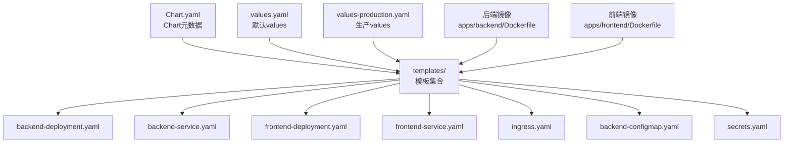
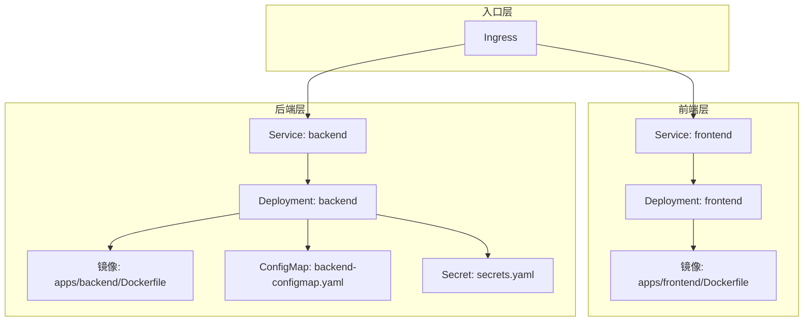
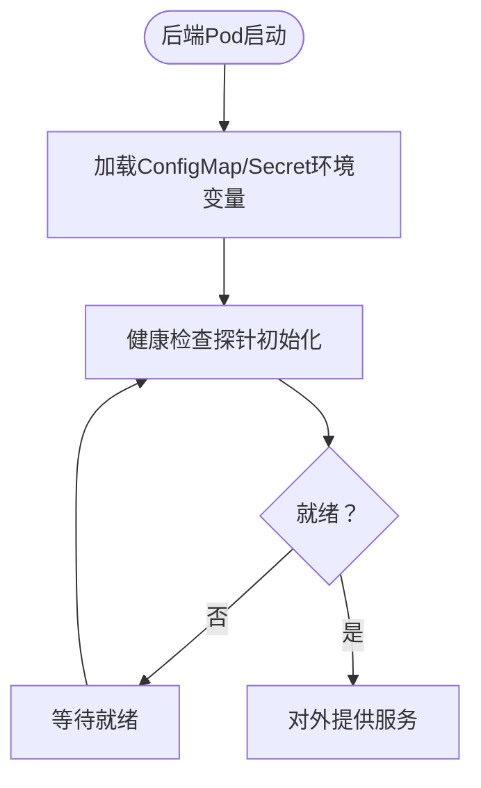
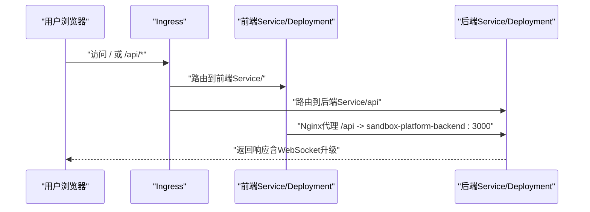
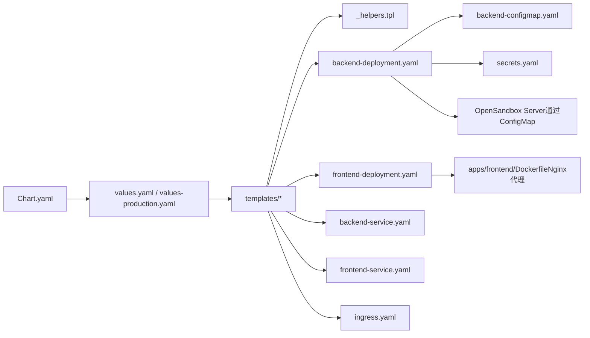

# Kubernetes部署

<cite>
**本文引用的文件**
- [Chart.yaml](file://infra/helm/sandbox-platform/Chart.yaml)
- [values.yaml](file://infra/helm/sandbox-platform/values.yaml)
- [values-production.yaml](file://infra/helm/sandbox-platform/values-production.yaml)
- [_helpers.tpl](file://infra/helm/sandbox-platform/templates/_helpers.tpl)
- [backend-deployment.yaml](file://infra/helm/sandbox-platform/templates/backend-deployment.yaml)
- [backend-service.yaml](file://infra/helm/sandbox-platform/templates/backend-service.yaml)
- [frontend-deployment.yaml](file://infra/helm/sandbox-platform/templates/frontend-deployment.yaml)
- [frontend-service.yaml](file://infra/helm/sandbox-platform/templates/frontend-service.yaml)
- [ingress.yaml](file://infra/helm/sandbox-platform/templates/ingress.yaml)
- [secrets.yaml](file://infra/helm/sandbox-platform/templates/secrets.yaml)
- [backend-configmap.yaml](file://infra/helm/sandbox-platform/templates/backend-configmap.yaml)
- [Dockerfile（后端）](file://apps/backend/Dockerfile)
- [Dockerfile（前端）](file://apps/frontend/Dockerfile)
- [package.json（后端）](file://apps/backend/package.json)
- [package.json（前端）](file://apps/frontend/package.json)
- [README.md](file://README.md)
</cite>

## 目录
1. [简介](#简介)
2. [项目结构](#项目结构)
3. [核心组件](#核心组件)
4. [架构总览](#架构总览)
5. [详细组件分析](#详细组件分析)
6. [依赖关系分析](#依赖关系分析)
7. [性能考虑](#性能考虑)
8. [故障排查指南](#故障排查指南)
9. [结论](#结论)
10. [附录](#附录)

## 简介
本文件面向Sandbox Manager平台的Kubernetes生产与开发部署，围绕Helm Chart进行系统化说明，覆盖Chart元数据、values.yaml参数、模板结构以及关键资源（Deployment、Service、Ingress、ConfigMap、Secret）的配置要点。文档同时给出生产与开发两套values差异、kubectl与Helm安装流程、命名空间与RBAC建议、安全上下文、滚动更新与健康检查策略、部署验证方法及常见问题排查路径。

## 项目结构
Sandbox Manager采用多模块仓库，Kubernetes部署位于infra/helm/sandbox-platform目录，包含Chart元数据、values配置与模板清单。前端与后端分别有独立Dockerfile与构建产物，前端容器内集成Nginx反向代理，将/api前缀转发至后端服务。

图示来源
- [Chart.yaml:1-7](file://infra/helm/sandbox-platform/Chart.yaml#L1-L7)
- [values.yaml:1-44](file://infra/helm/sandbox-platform/values.yaml#L1-L44)
- [values-production.yaml:1-26](file://infra/helm/sandbox-platform/values-production.yaml#L1-L26)
- [backend-deployment.yaml:1-42](file://infra/helm/sandbox-platform/templates/backend-deployment.yaml#L1-L42)
- [backend-service.yaml:1-14](file://infra/helm/sandbox-platform/templates/backend-service.yaml#L1-L14)
- [frontend-deployment.yaml:1-25](file://infra/helm/sandbox-platform/templates/frontend-deployment.yaml#L1-L25)
- [frontend-service.yaml:1-14](file://infra/helm/sandbox-platform/templates/frontend-service.yaml#L1-L14)
- [ingress.yaml:1-39](file://infra/helm/sandbox-platform/templates/ingress.yaml#L1-L39)
- [backend-configmap.yaml:1-12](file://infra/helm/sandbox-platform/templates/backend-configmap.yaml#L1-L12)
- [secrets.yaml:1-10](file://infra/helm/sandbox-platform/templates/secrets.yaml#L1-L10)
- [Dockerfile（后端）:1-25](file://apps/backend/Dockerfile#L1-L25)
- [Dockerfile（前端）:1-45](file://apps/frontend/Dockerfile#L1-L45)

章节来源
- [Chart.yaml:1-7](file://infra/helm/sandbox-platform/Chart.yaml#L1-L7)
- [values.yaml:1-44](file://infra/helm/sandbox-platform/values.yaml#L1-L44)
- [values-production.yaml:1-26](file://infra/helm/sandbox-platform/values-production.yaml#L1-L26)
- [README.md:1-188](file://README.md#L1-L188)

## 核心组件
- Chart元数据：定义Chart名称、版本、应用版本等基础信息，用于Helm发布与升级识别。
- values.yaml：定义默认部署参数，如副本数、镜像仓库与标签、资源请求、服务端口、Ingress主机与TLS、Secret与ConfigMap中的关键配置项。
- values-production.yaml：覆盖生产环境的关键参数，如副本数、资源请求、Ingress域名与TLS、HPA自动扩缩容。
- 模板集合：包含后端与前端的Deployment、Service、Ingress，以及后端ConfigMap与全局Secret。

章节来源
- [Chart.yaml:1-7](file://infra/helm/sandbox-platform/Chart.yaml#L1-L7)
- [values.yaml:1-44](file://infra/helm/sandbox-platform/values.yaml#L1-L44)
- [values-production.yaml:1-26](file://infra/helm/sandbox-platform/values-production.yaml#L1-L26)
- [backend-deployment.yaml:1-42](file://infra/helm/sandbox-platform/templates/backend-deployment.yaml#L1-L42)
- [frontend-deployment.yaml:1-25](file://infra/helm/sandbox-platform/templates/frontend-deployment.yaml#L1-L25)
- [backend-service.yaml:1-14](file://infra/helm/sandbox-platform/templates/backend-service.yaml#L1-L14)
- [frontend-service.yaml:1-14](file://infra/helm/sandbox-platform/templates/frontend-service.yaml#L1-L14)
- [ingress.yaml:1-39](file://infra/helm/sandbox-platform/templates/ingress.yaml#L1-L39)
- [backend-configmap.yaml:1-12](file://infra/helm/sandbox-platform/templates/backend-configmap.yaml#L1-L12)
- [secrets.yaml:1-10](file://infra/helm/sandbox-platform/templates/secrets.yaml#L1-L10)

## 架构总览
下图展示Sandbox Manager在Kubernetes中的部署拓扑：前端通过Nginx反向代理将/api请求转发至后端；Ingress统一接入流量，支持WebSocket长连接；后端与前端分别以Deployment方式运行，通过Service暴露；后端通过ConfigMap注入运行时配置，通过Secret注入敏感信息。

图示来源
- [ingress.yaml:1-39](file://infra/helm/sandbox-platform/templates/ingress.yaml#L1-L39)
- [frontend-service.yaml:1-14](file://infra/helm/sandbox-platform/templates/frontend-service.yaml#L1-L14)
- [frontend-deployment.yaml:1-25](file://infra/helm/sandbox-platform/templates/frontend-deployment.yaml#L1-L25)
- [backend-service.yaml:1-14](file://infra/helm/sandbox-platform/templates/backend-service.yaml#L1-L14)
- [backend-deployment.yaml:1-42](file://infra/helm/sandbox-platform/templates/backend-deployment.yaml#L1-L42)
- [backend-configmap.yaml:1-12](file://infra/helm/sandbox-platform/templates/backend-configmap.yaml#L1-L12)
- [secrets.yaml:1-10](file://infra/helm/sandbox-platform/templates/secrets.yaml#L1-L10)
- [Dockerfile（前端）:1-45](file://apps/frontend/Dockerfile#L1-L45)
- [Dockerfile（后端）:1-25](file://apps/backend/Dockerfile#L1-L25)

## 详细组件分析

### Chart元数据与模板约定
- Chart元数据：定义Chart名称、类型、版本与应用版本，便于Helm管理与升级。
- 模板约定：通过_helpers.tpl定义命名规范，确保资源名称在不同命名空间与Release中保持一致且不超长。

章节来源
- [Chart.yaml:1-7](file://infra/helm/sandbox-platform/Chart.yaml#L1-L7)
- [_helpers.tpl:1-4](file://infra/helm/sandbox-platform/templates/_helpers.tpl#L1-L4)

### values.yaml 参数详解
- 基本参数
  - replicaCount：默认副本数，用于后端与前端Deployment的replicas字段。
- 后端配置
  - image：仓库、标签、拉取策略。
  - service.port：后端服务端口。
  - resources.requests：CPU与内存请求。
- 前端配置
  - image：仓库、标签、拉取策略。
  - service.port：前端服务端口。
  - resources.requests：CPU与内存请求。
- Ingress配置
  - enabled：是否启用Ingress。
  - className：Ingress类名。
  - host：域名。
  - tls.enabled/tls.secretName：TLS开关与证书密钥名称。
- Secrets
  - jwtSecret：JWT密钥（开发默认值，生产需替换）。
  - opensandboxApiKey：OpenSandbox API Key。
- Config
  - opensandboxServerUrl：OpenSandbox Server地址。
  - port：后端监听端口。
  - corsOrigin：CORS允许来源。
  - logLevel：日志级别。

章节来源
- [values.yaml:1-44](file://infra/helm/sandbox-platform/values.yaml#L1-L44)

### values-production.yaml 生产差异化
- 副本数提升至2，增强高可用性。
- 资源请求上调，满足生产负载。
- Ingress host切换为生产域名，开启TLS并指定证书密钥。
- 启用HPA自动扩缩容，设置最小/最大副本与CPU利用率阈值。

章节来源
- [values-production.yaml:1-26](file://infra/helm/sandbox-platform/values-production.yaml#L1-L26)

### 后端Deployment与Service
- Deployment
  - 使用values.yaml中的镜像与资源请求。
  - 通过ConfigMap与Secret注入环境变量。
  - 配置健康检查探针（/api/health），用于存活与就绪判断。
- Service
  - ClusterIP类型，将ClusterIP:port映射到容器端口3000。

图示来源
- [backend-deployment.yaml:1-42](file://infra/helm/sandbox-platform/templates/backend-deployment.yaml#L1-L42)
- [backend-service.yaml:1-14](file://infra/helm/sandbox-platform/templates/backend-service.yaml#L1-L14)
- [backend-configmap.yaml:1-12](file://infra/helm/sandbox-platform/templates/backend-configmap.yaml#L1-L12)
- [secrets.yaml:1-10](file://infra/helm/sandbox-platform/templates/secrets.yaml#L1-L10)

章节来源
- [backend-deployment.yaml:1-42](file://infra/helm/sandbox-platform/templates/backend-deployment.yaml#L1-L42)
- [backend-service.yaml:1-14](file://infra/helm/sandbox-platform/templates/backend-service.yaml#L1-L14)
- [backend-configmap.yaml:1-12](file://infra/helm/sandbox-platform/templates/backend-configmap.yaml#L1-L12)
- [secrets.yaml:1-10](file://infra/helm/sandbox-platform/templates/secrets.yaml#L1-L10)

### 前端Deployment与Service
- Deployment
  - 使用values.yaml中的镜像与资源请求。
  - 容器端口80。
- Service
  - ClusterIP类型，将ClusterIP:port映射到容器端口80。
- Nginx反向代理
  - 将/api前缀转发至后端Service（sandbox-platform-backend:3000）。
  - 支持WebSocket升级头与长连接超时配置。

图示来源
- [ingress.yaml:1-39](file://infra/helm/sandbox-platform/templates/ingress.yaml#L1-L39)
- [frontend-deployment.yaml:1-25](file://infra/helm/sandbox-platform/templates/frontend-deployment.yaml#L1-L25)
- [frontend-service.yaml:1-14](file://infra/helm/sandbox-platform/templates/frontend-service.yaml#L1-L14)
- [backend-service.yaml:1-14](file://infra/helm/sandbox-platform/templates/backend-service.yaml#L1-L14)
- [Dockerfile（前端）:1-45](file://apps/frontend/Dockerfile#L1-L45)

章节来源
- [frontend-deployment.yaml:1-25](file://infra/helm/sandbox-platform/templates/frontend-deployment.yaml#L1-L25)
- [frontend-service.yaml:1-14](file://infra/helm/sandbox-platform/templates/frontend-service.yaml#L1-L14)
- [ingress.yaml:1-39](file://infra/helm/sandbox-platform/templates/ingress.yaml#L1-L39)
- [Dockerfile（前端）:1-45](file://apps/frontend/Dockerfile#L1-L45)

### Ingress配置与网络策略
- Ingress类名与规则：根据className与host生成规则，将/api前缀路由到后端Service，根路径路由到前端Service。
- TLS：当tls.enabled为true时，为指定host配置tls段与secretName。
- 注解：启用WebSocket支持与长连接超时配置，确保终端交互稳定。

章节来源
- [ingress.yaml:1-39](file://infra/helm/sandbox-platform/templates/ingress.yaml#L1-L39)

### ConfigMap与Secret
- ConfigMap（后端）
  - 注入运行时配置：OpenSandbox Server地址、端口、CORS来源、日志级别。
- Secret（全局）
  - 注入敏感配置：OpenSandbox API Key。

章节来源
- [backend-configmap.yaml:1-12](file://infra/helm/sandbox-platform/templates/backend-configmap.yaml#L1-L12)
- [secrets.yaml:1-10](file://infra/helm/sandbox-platform/templates/secrets.yaml#L1-L10)

### 滚动更新策略与健康检查
- 滚动更新
  - Deployment默认滚动更新策略适用于大多数场景；生产建议结合HPA与PodDisruptionBudget控制变更节奏。
- 健康检查
  - 存活探针与就绪探针均指向后端健康接口，初始延迟与周期可根据负载调优。

章节来源
- [backend-deployment.yaml:28-39](file://infra/helm/sandbox-platform/templates/backend-deployment.yaml#L28-L39)

## 依赖关系分析
- Chart对模板的依赖：Chart.yaml声明应用类型，values.yaml与values-production.yaml驱动模板渲染。
- 模板间依赖：_helpers.tpl提供命名约定；Ingress依赖前后端Service名称；Deployment依赖ConfigMap与Secret。
- 外部依赖：前端Nginx依赖后端Service名称；后端依赖OpenSandbox Server可达性与API Key正确性。

图示来源
- [Chart.yaml:1-7](file://infra/helm/sandbox-platform/Chart.yaml#L1-L7)
- [values.yaml:1-44](file://infra/helm/sandbox-platform/values.yaml#L1-L44)
- [values-production.yaml:1-26](file://infra/helm/sandbox-platform/values-production.yaml#L1-L26)
- [_helpers.tpl:1-4](file://infra/helm/sandbox-platform/templates/_helpers.tpl#L1-L4)
- [backend-deployment.yaml:1-42](file://infra/helm/sandbox-platform/templates/backend-deployment.yaml#L1-L42)
- [frontend-deployment.yaml:1-25](file://infra/helm/sandbox-platform/templates/frontend-deployment.yaml#L1-L25)
- [backend-service.yaml:1-14](file://infra/helm/sandbox-platform/templates/backend-service.yaml#L1-L14)
- [frontend-service.yaml:1-14](file://infra/helm/sandbox-platform/templates/frontend-service.yaml#L1-L14)
- [ingress.yaml:1-39](file://infra/helm/sandbox-platform/templates/ingress.yaml#L1-L39)
- [backend-configmap.yaml:1-12](file://infra/helm/sandbox-platform/templates/backend-configmap.yaml#L1-L12)
- [secrets.yaml:1-10](file://infra/helm/sandbox-platform/templates/secrets.yaml#L1-L10)
- [Dockerfile（前端）:1-45](file://apps/frontend/Dockerfile#L1-L45)

## 性能考虑
- 资源请求与限制：生产values中已提高CPU与内存请求；建议结合HPA与监控指标进一步优化。
- 副本数：生产默认2副本，提升可用性；可按业务峰值调整。
- 探针参数：根据实例规模与网络状况调整initialDelaySeconds与periodSeconds。
- Ingress超时：前端Nginx已配置长连接超时，确保WebSocket稳定；如需更高并发可评估Ingress控制器参数。

## 故障排查指南
- 健康检查失败
  - 检查后端健康接口是否可达，确认探针路径与端口一致。
  - 查看Pod日志与事件，定位启动异常或依赖不可达问题。
- Ingress无法访问
  - 确认Ingress类名、Host与TLS配置正确。
  - 检查Ingress控制器状态与后端Service端口映射。
- WebSocket断连
  - 确认Ingress注解已启用WebSocket支持与长连接超时。
  - 检查Nginx代理头与后端WS路由。
- 配置错误
  - 确认ConfigMap中的OpenSandbox Server地址与端口正确。
  - 确认Secret中的API Key与后端环境变量一致。

章节来源
- [backend-deployment.yaml:28-39](file://infra/helm/sandbox-platform/templates/backend-deployment.yaml#L28-L39)
- [ingress.yaml:8-11](file://infra/helm/sandbox-platform/templates/ingress.yaml#L8-L11)
- [Dockerfile（前端）:21-41](file://apps/frontend/Dockerfile#L21-L41)
- [backend-configmap.yaml:7-11](file://infra/helm/sandbox-platform/templates/backend-configmap.yaml#L7-L11)
- [secrets.yaml:8-9](file://infra/helm/sandbox-platform/templates/secrets.yaml#L8-L9)

## 结论
Sandbox Manager的Helm Chart通过清晰的values分层与模板化资源，实现了前后端一体化部署与Ingress统一入口。生产环境通过更高的副本数、资源请求与HPA策略保障稳定性；开发环境以简洁配置快速迭代。配合健康检查、WebSocket支持与合理的命名空间/Secret管理，可实现从开发到生产的平滑过渡。

## 附录

### 命名空间与RBAC建议
- 命名空间
  - 建议在独立命名空间中部署，便于资源隔离与权限控制。
- RBAC
  - 如需集群范围资源访问，建议为Release创建ServiceAccount并绑定相应Role/ClusterRole，避免使用默认权限。

### 安全上下文与Secret管理
- Secret
  - 使用Kubernetes Secret管理敏感信息，避免硬编码在values中。
- 安全上下文
  - 前端容器以非root用户运行更佳；后端容器可按需设置安全上下文。

### 滚动更新与故障恢复
- 滚动更新
  - 使用Helm升级时结合maxSurge与maxUnavailable参数控制滚动节奏。
- 故障恢复
  - 配置HPA与PDB，结合探针与重试策略提升自愈能力。

### kubectl与Helm安装流程
- 安装OpenSandbox基础设施（首次部署）
  - 使用提供的安装脚本完成命名空间、控制器与Server部署。
- 部署Sandbox Manager
  - 使用Helm安装Chart，选择values或values-production作为参数源。
  - 若需要Ingress，请确保Ingress控制器已就绪并可解析域名。
- 验证
  - 通过kubectl查看Pod、Service与Ingress状态。
  - 访问Ingress域名，确认前端与后端健康接口均可访问。

章节来源
- [README.md:28-98](file://README.md#L28-L98)
- [ingress.yaml:1-39](file://infra/helm/sandbox-platform/templates/ingress.yaml#L1-L39)