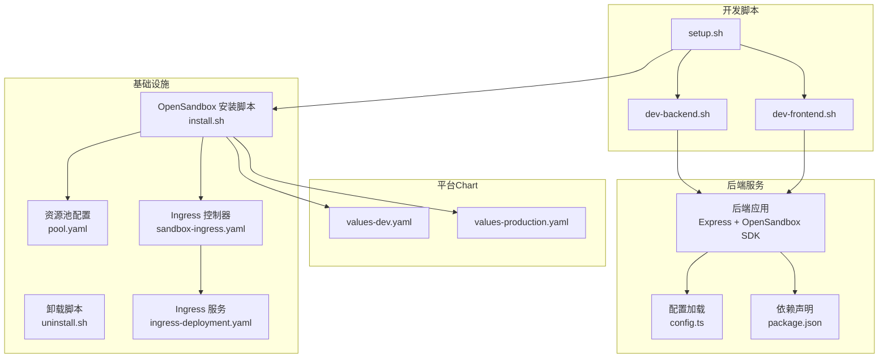
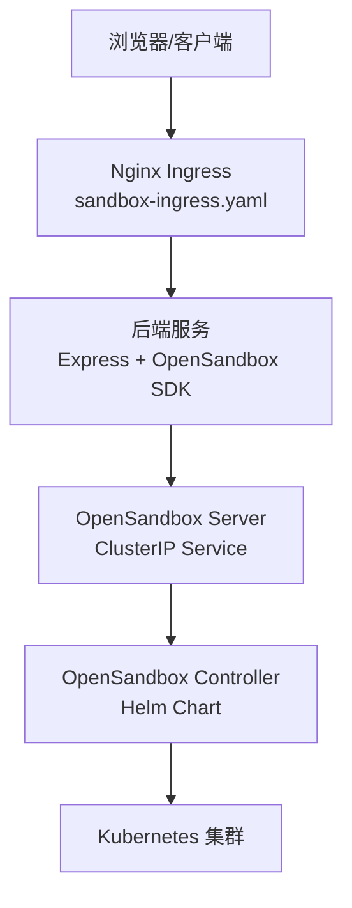
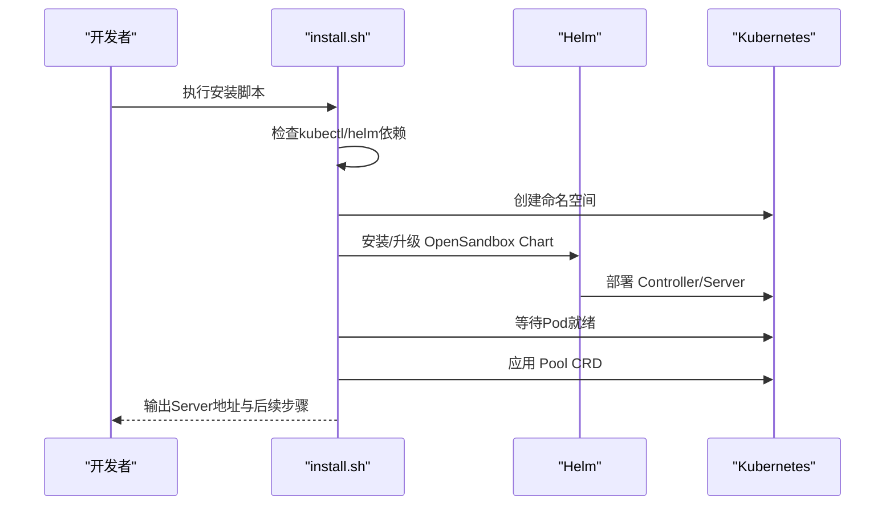
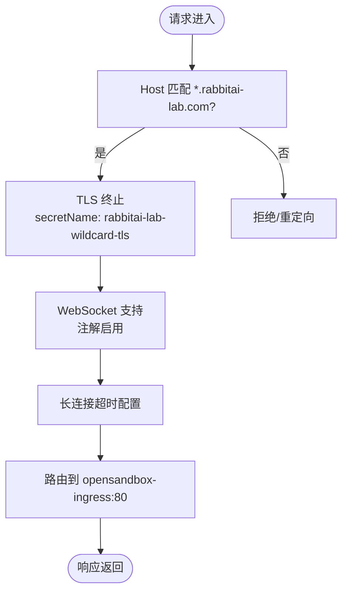
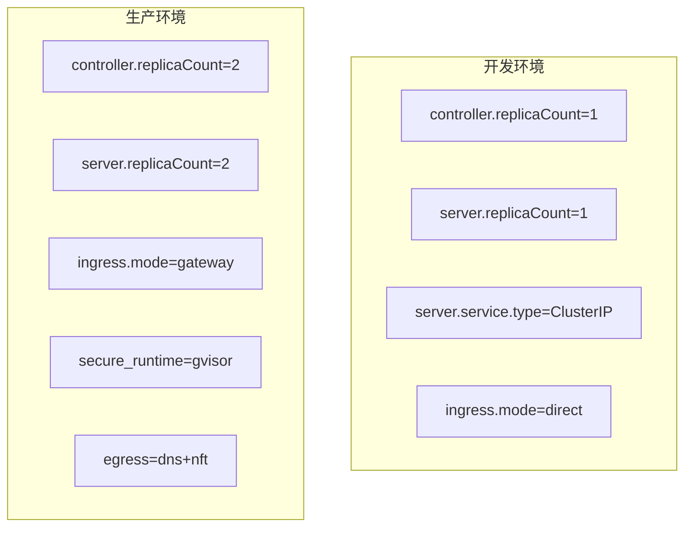
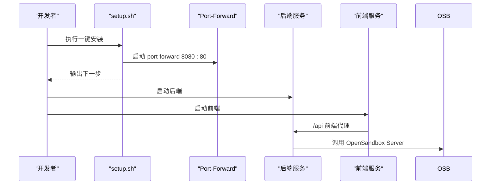
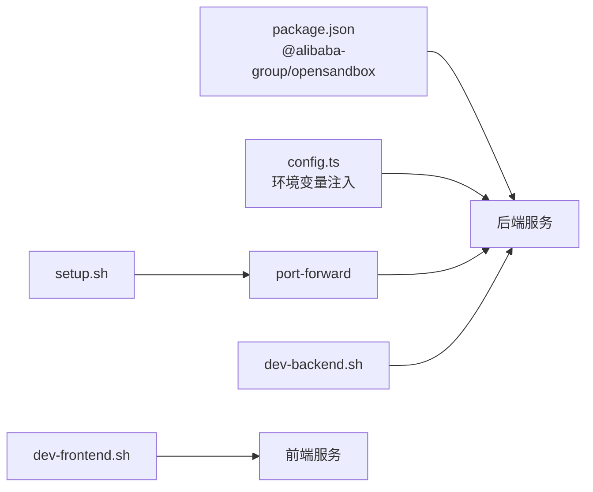

# OpenSandbox集成

<cite>
**本文引用的文件**
- [README.md](file://README.md)
- [install.sh](file://infra/opensandbox/install.sh)
- [uninstall.sh](file://infra/opensandbox/uninstall.sh)
- [pool.yaml](file://infra/opensandbox/pool.yaml)
- [values-dev.yaml](file://infra/opensandbox/values-dev.yaml)
- [values-production.yaml](file://infra/opensandbox/values-production.yaml)
- [sandbox-ingress.yaml](file://infra/opensandbox/sandbox-ingress.yaml)
- [ingress-deployment.yaml](file://infra/opensandbox/ingress-deployment.yaml)
- [config.ts](file://apps/backend/src/config.ts)
- [setup.sh](file://scripts/setup.sh)
- [dev-backend.sh](file://scripts/dev-backend.sh)
- [dev-frontend.sh](file://scripts/dev-frontend.sh)
- [values.yaml](file://infra/helm/sandbox-platform/values.yaml)
- [values-production.yaml](file://infra/helm/sandbox-platform/values-production.yaml)
- [package.json](file://apps/backend/package.json)
</cite>

## 目录
1. [简介](#简介)
2. [项目结构](#项目结构)
3. [核心组件](#核心组件)
4. [架构总览](#架构总览)
5. [详细组件分析](#详细组件分析)
6. [依赖关系分析](#依赖关系分析)
7. [性能考虑](#性能考虑)
8. [故障排除指南](#故障排除指南)
9. [结论](#结论)
10. [附录](#附录)

## 简介
本文件面向Sandbox Manager的OpenSandbox集成，提供从基础设施安装、配置到部署运维的完整指南。内容覆盖：
- OpenSandbox基础设施安装与卸载流程（install.sh、uninstall.sh）
- 资源池配置（pools.yaml）与Ingress控制器部署
- 沙盒网络策略、端口转发与负载均衡
- 不同环境（dev vs production）的配置差异与最佳实践
- OpenSandbox Controller与Server的部署步骤及依赖服务
- 故障排除、性能调优与监控建议

## 项目结构
该仓库采用monorepo结构，包含前端React应用、后端Express服务以及OpenSandbox基础设施脚本与Helm Chart。OpenSandbox集成相关的关键位置如下：
- infra/opensandbox：OpenSandbox安装脚本、配置与Ingress定义
- infra/helm/sandbox-platform：平台自身Helm Chart（用于生产部署）
- apps/backend：后端服务，封装OpenSandbox SDK并与前端交互
- scripts：本地开发一键脚本

**图表来源**
- [install.sh:1-132](file://infra/opensandbox/install.sh#L1-L132)
- [uninstall.sh:1-13](file://infra/opensandbox/uninstall.sh#L1-L13)
- [pool.yaml:1-17](file://infra/opensandbox/pool.yaml#L1-L17)
- [sandbox-ingress.yaml:1-27](file://infra/opensandbox/sandbox-ingress.yaml#L1-L27)
- [ingress-deployment.yaml:1-39](file://infra/opensandbox/ingress-deployment.yaml#L1-L39)
- [values-dev.yaml:1-34](file://infra/opensandbox/values-dev.yaml#L1-L34)
- [values-production.yaml:1-44](file://infra/opensandbox/values-production.yaml#L1-L44)
- [config.ts:1-71](file://apps/backend/src/config.ts#L1-L71)
- [package.json:1-32](file://apps/backend/package.json#L1-L32)
- [setup.sh:1-52](file://scripts/setup.sh#L1-L52)
- [dev-backend.sh:1-17](file://scripts/dev-backend.sh#L1-L17)
- [dev-frontend.sh:1-17](file://scripts/dev-frontend.sh#L1-L17)

**章节来源**
- [README.md:114-140](file://README.md#L114-L140)

## 核心组件
- OpenSandbox Controller与Server：通过Helm Chart安装，负责沙箱生命周期管理与执行代理。
- 资源池（Pool CRD）：定义沙箱模板与容量参数，控制池化资源的最小/最大数量与缓冲区大小。
- Ingress控制器：提供WebSocket支持与长连接超时设置，支持通配符域名与TLS。
- 后端服务：封装OpenSandbox SDK，提供REST API与WebSocket终端连接，读取环境变量进行配置。

**章节来源**
- [install.sh:33-84](file://infra/opensandbox/install.sh#L33-L84)
- [pool.yaml:1-17](file://infra/opensandbox/pool.yaml#L1-L17)
- [sandbox-ingress.yaml:1-27](file://infra/opensandbox/sandbox-ingress.yaml#L1-L27)
- [config.ts:48-70](file://apps/backend/src/config.ts#L48-L70)

## 架构总览
下图展示OpenSandbox集成的整体架构：客户端通过Ingress访问后端，后端经OpenSandbox Server与Controller交互，最终在Kubernetes中调度沙箱工作负载。

**图表来源**
- [sandbox-ingress.yaml:1-27](file://infra/opensandbox/sandbox-ingress.yaml#L1-L27)
- [ingress-deployment.yaml:1-39](file://infra/opensandbox/ingress-deployment.yaml#L1-L39)
- [values-dev.yaml:15-34](file://infra/opensandbox/values-dev.yaml#L15-L34)
- [values-production.yaml:15-44](file://infra/opensandbox/values-production.yaml#L15-L44)

## 详细组件分析

### OpenSandbox基础设施安装与卸载
- 安装流程要点
  - 检查kubectl与helm依赖，若缺失则提示或尝试brew安装
  - 创建命名空间opensandbox-system与opensandbox
  - 通过Helm安装OpenSandbox Controller与Server，优先使用GitHub克隆的Chart，回退到本地Chart
  - 支持values-dev.yaml或默认值；若已存在则升级而非重新安装
  - 等待Pod就绪，部署Pool CRD（等待CRD注册后再应用）
  - 输出Server ClusterIP与下一步操作（端口转发、启动开发）

- 卸载流程要点
  - 提示确认后卸载Helm release、删除Pool CRD、删除命名空间

**图表来源**
- [install.sh:15-132](file://infra/opensandbox/install.sh#L15-L132)

**章节来源**
- [install.sh:15-132](file://infra/opensandbox/install.sh#L15-L132)
- [uninstall.sh:1-13](file://infra/opensandbox/uninstall.sh#L1-L13)

### 资源池配置（pools.yaml）
- 关键字段
  - template.spec：定义沙箱容器镜像等模板
  - capacitySpec：控制池容量，包括bufferMin/bufferMax与poolMin/poolMax
- 使用方式
  - 安装脚本在CRD注册完成后应用该Pool资源

**章节来源**
- [pool.yaml:1-17](file://infra/opensandbox/pool.yaml#L1-L17)
- [install.sh:95-112](file://infra/opensandbox/install.sh#L95-L112)

### Ingress控制器与沙盒网络配置
- Ingress定义
  - 类名nginx，通配符TLS，指向opensandbox-ingress服务
  - 注解开启WebSocket与长连接超时
- Ingress服务
  - Deployment副本数2，容器暴露28888端口
  - Service将80端口映射到容器28888端口

**图表来源**
- [sandbox-ingress.yaml:6-26](file://infra/opensandbox/sandbox-ingress.yaml#L6-L26)

**章节来源**
- [sandbox-ingress.yaml:1-27](file://infra/opensandbox/sandbox-ingress.yaml#L1-L27)
- [ingress-deployment.yaml:1-39](file://infra/opensandbox/ingress-deployment.yaml#L1-L39)

### OpenSandbox Controller与Server部署
- 开发环境（values-dev.yaml）
  - controller与server副本数均为1
  - server服务类型为ClusterIP
  - server配置包含host/port、API Key、runtime与kubernetes参数、ingress模式为direct
- 生产环境（values-production.yaml）
  - controller与server副本数为2
  - 启用安全运行时（gVisor）、Egress镜像与DNS+NFT模式
  - ingress模式为gateway，配置通配符地址与路由模式

**图表来源**
- [values-dev.yaml:1-34](file://infra/opensandbox/values-dev.yaml#L1-L34)
- [values-production.yaml:1-44](file://infra/opensandbox/values-production.yaml#L1-L44)

**章节来源**
- [values-dev.yaml:1-34](file://infra/opensandbox/values-dev.yaml#L1-L34)
- [values-production.yaml:1-44](file://infra/opensandbox/values-production.yaml#L1-L44)

### 环境差异与最佳实践
- 开发（dev）
  - 使用values-dev.yaml，API Key便于调试
  - ClusterIP服务+本地port-forward，适合本地联调
  - ingress.direct模式简化网络路径
- 生产（production）
  - 使用values-production.yaml，启用gVisor与Egress
  - ingress.gateway模式配合通配符域名与证书
  - 副本数与资源请求提升高可用与稳定性
- 最佳实践
  - 生产环境必须设置强API Key与TLS
  - 为ingress与server配置合适的资源请求与限制
  - 使用Gateway模式时确保DNS与证书正确配置

**章节来源**
- [values-dev.yaml:15-34](file://infra/opensandbox/values-dev.yaml#L15-L34)
- [values-production.yaml:15-44](file://infra/opensandbox/values-production.yaml#L15-L44)
- [README.md:67-67](file://README.md#L67-L67)

### 后端配置与开发流程
- 配置加载
  - 从环境变量读取OpenSandbox Server地址、API Key、协议、超时等
  - 支持CORS、日志级别与PTY空闲超时
- 开发脚本
  - setup.sh：一键安装OpenSandbox基础设施、安装依赖、创建.env、启动port-forward
  - dev-backend.sh：检查port-forward连通性后启动后端
  - dev-frontend.sh：检查后端健康后启动前端

**图表来源**
- [setup.sh:14-51](file://scripts/setup.sh#L14-L51)
- [dev-backend.sh:8-16](file://scripts/dev-backend.sh#L8-L16)
- [dev-frontend.sh:8-16](file://scripts/dev-frontend.sh#L8-L16)
- [config.ts:48-70](file://apps/backend/src/config.ts#L48-L70)

**章节来源**
- [config.ts:48-70](file://apps/backend/src/config.ts#L48-L70)
- [setup.sh:14-51](file://scripts/setup.sh#L14-L51)
- [dev-backend.sh:1-17](file://scripts/dev-backend.sh#L1-L17)
- [dev-frontend.sh:1-17](file://scripts/dev-frontend.sh#L1-L17)

## 依赖关系分析
- 后端对OpenSandbox SDK的依赖通过package.json声明
- 后端配置通过config.ts从环境变量注入
- 开发脚本依赖kubectl与pnpm，安装脚本依赖helm与git

**图表来源**
- [package.json:11-21](file://apps/backend/package.json#L11-L21)
- [config.ts:48-70](file://apps/backend/src/config.ts#L48-L70)
- [setup.sh:32-41](file://scripts/setup.sh#L32-L41)
- [dev-backend.sh:14-16](file://scripts/dev-backend.sh#L14-L16)
- [dev-frontend.sh:14-16](file://scripts/dev-frontend.sh#L14-L16)

**章节来源**
- [package.json:11-21](file://apps/backend/package.json#L11-L21)
- [config.ts:48-70](file://apps/backend/src/config.ts#L48-L70)
- [setup.sh:10-21](file://scripts/setup.sh#L10-L21)

## 性能考虑
- 资源分配
  - 生产环境建议提升controller与server副本数与资源请求，以应对高并发
- Ingress优化
  - 启用WebSocket与长连接超时，避免频繁断开
  - 在Gateway模式下合理配置通配符域名与证书，减少解析延迟
- 网络与安全
  - gVisor与Egress模式提升安全性，但可能带来额外开销，需结合业务权衡
- 监控与日志
  - 后端支持日志级别配置，建议在生产环境调整至info或更高
  - 结合Kubernetes指标与Ingress控制器日志进行性能观测

[本节为通用指导，无需特定文件引用]

## 故障排除指南
- 连接失败
  - 确认OpenSandbox Server可达：使用dev-backend.sh中的连通性检查
  - 若不可达，检查port-forward是否运行，或手动执行端口转发命令
- 资源不足
  - 检查values-production.yaml中的副本数与资源请求是否过低
  - 调整后重新应用Helm配置
- 网络问题
  - 确认Ingress类名与TLS配置正确
  - 检查通配符域名与证书是否匹配
- 卸载清理
  - 使用uninstall.sh卸载后，确认命名空间与资源均已删除

**章节来源**
- [dev-backend.sh:8-12](file://scripts/dev-backend.sh#L8-L12)
- [values-production.yaml:1-44](file://infra/opensandbox/values-production.yaml#L1-L44)
- [sandbox-ingress.yaml:11-15](file://infra/opensandbox/sandbox-ingress.yaml#L11-L15)
- [uninstall.sh:1-13](file://infra/opensandbox/uninstall.sh#L1-L13)

## 结论
通过本集成文档，您可以在本地快速搭建OpenSandbox基础设施，并在开发与生产环境中按需配置资源池、Ingress与安全策略。建议在生产环境启用Gateway模式、gVisor与Egress，并合理规划副本数与资源，结合监控与日志持续优化性能与稳定性。

[本节为总结性内容，无需特定文件引用]

## 附录

### 环境变量参考（后端）
- OPENSANDBOX_SERVER_URL：OpenSandbox Server地址
- OPENSANDBOX_API_KEY：API密钥
- OPENSANDBOX_PROTOCOL：协议（http/https）
- PORT：后端监听端口
- CORS_ORIGIN：CORS允许来源
- LOG_LEVEL：日志级别
- PTY_IDLE_TIMEOUT_MS：PTY空闲超时（毫秒）

**章节来源**
- [config.ts:48-70](file://apps/backend/src/config.ts#L48-L70)
- [README.md:177-187](file://README.md#L177-L187)

### 平台Chart（生产）关键项
- ingress.host：生产域名
- ingress.tls.enabled：启用TLS
- autoscaling：HPA配置（可选）
- secrets：JWT与OpenSandbox API Key

**章节来源**
- [values.yaml:15-44](file://infra/helm/sandbox-platform/values.yaml#L15-L44)
- [values-production.yaml:15-26](file://infra/helm/sandbox-platform/values-production.yaml#L15-L26)