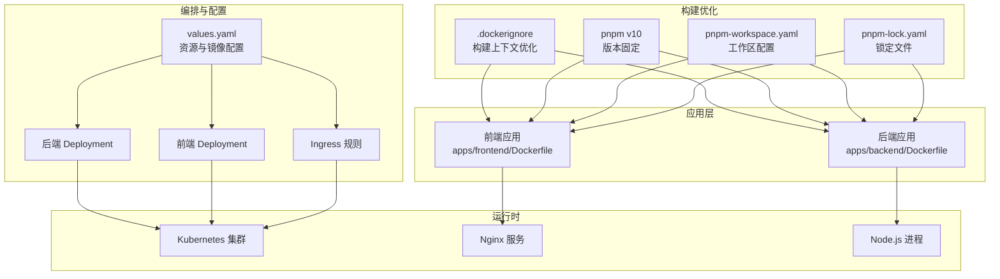
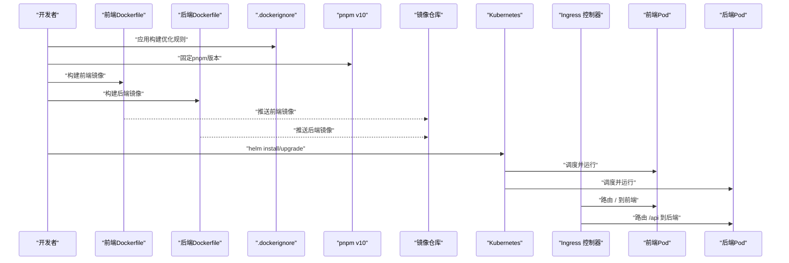
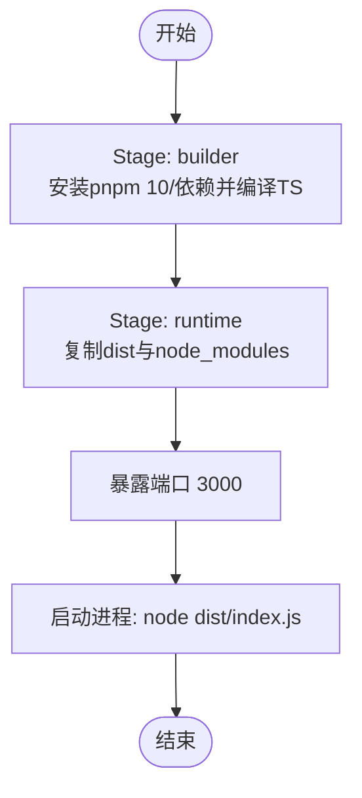
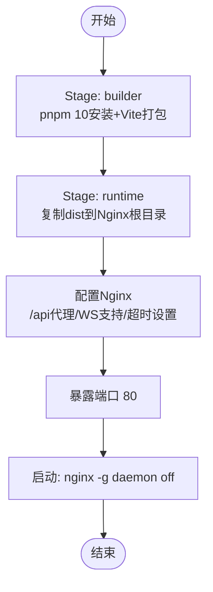
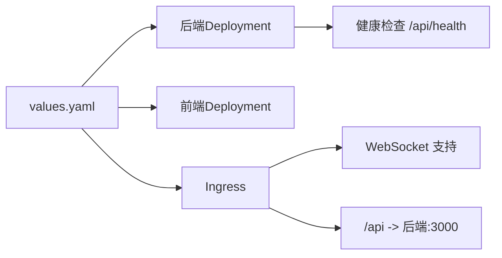

# 容器化与Docker

<cite>
**本文引用的文件**
- [.dockerignore](file://.dockerignore)
- [apps/backend/Dockerfile](file://apps/backend/Dockerfile)
- [apps/frontend/Dockerfile](file://apps/frontend/Dockerfile)
- [pnpm-workspace.yaml](file://pnpm-workspace.yaml)
- [pnpm-lock.yaml](file://pnpm-lock.yaml)
- [package.json](file://package.json)
- [apps/backend/package.json](file://apps/backend/package.json)
- [apps/frontend/package.json](file://apps/frontend/package.json)
- [.github/workflows/build-and-push.yml](file://.github/workflows/build-and-push.yml)
- [infra/helm/sandbox-platform/values.yaml](file://infra/helm/sandbox-platform/values.yaml)
- [infra/helm/sandbox-platform/templates/backend-deployment.yaml](file://infra/helm/sandbox-platform/templates/backend-deployment.yaml)
- [infra/helm/sandbox-platform/templates/frontend-deployment.yaml](file://infra/helm/sandbox-platform/templates/frontend-deployment.yaml)
- [infra/helm/sandbox-platform/templates/ingress.yaml](file://infra/helm/sandbox-platform/templates/ingress.yaml)
- [scripts/setup.sh](file://scripts/setup.sh)
- [scripts/dev-backend.sh](file://scripts/dev-backend.sh)
- [README.md](file://README.md)
</cite>

## 更新摘要
**变更内容**
- 新增 Docker 构建优化配置（.dockerignore 文件）
- 固定 pnpm v10 版本以确保构建一致性
- 更新 pnpm 工作区配置以支持 v10 兼容性
- 增强 Dockerfile 中的依赖管理策略

## 目录
1. [简介](#简介)
2. [项目结构](#项目结构)
3. [核心组件](#核心组件)
4. [架构总览](#架构总览)
5. [详细组件分析](#详细组件分析)
6. [依赖关系分析](#依赖关系分析)
7. [性能考量](#性能考量)
8. [故障排除指南](#故障排除指南)
9. [结论](#结论)
10. [附录](#附录)

## 简介
本文件面向Sandbox Manager的容器化与Docker实践，围绕后端与前端应用的镜像构建策略、多阶段优化、运行时配置、资源与网络规划、容器编排与集成、镜像安全扫描、调试与监控、以及CI/CD流水线中的构建与推送策略进行系统性说明。目标是帮助开发者与运维人员快速理解并落地容器化方案。

**更新** 本次更新重点加强了Docker构建优化和pnpm v10兼容性配置，确保构建过程的一致性和可重复性。

## 项目结构
Sandbox Manager采用monorepo结构，后端与前端分别位于apps/backend与apps/frontend，均提供独立的Dockerfile用于容器化；平台通过Helm Chart进行Kubernetes部署，定义了后端与前端的Deployment、Service与Ingress等资源。

**图表来源**
- [apps/frontend/Dockerfile:1-45](file://apps/frontend/Dockerfile#L1-L45)
- [apps/backend/Dockerfile:1-25](file://apps/backend/Dockerfile#L1-L25)
- [.dockerignore:1-15](file://.dockerignore#L1-L15)
- [pnpm-workspace.yaml:1-6](file://pnpm-workspace.yaml#L1-L6)
- [pnpm-lock.yaml:1-800](file://pnpm-lock.yaml#L1-L800)
- [infra/helm/sandbox-platform/values.yaml:1-44](file://infra/helm/sandbox-platform/values.yaml#L1-L44)
- [infra/helm/sandbox-platform/templates/backend-deployment.yaml:1-42](file://infra/helm/sandbox-platform/templates/backend-deployment.yaml#L1-L42)
- [infra/helm/sandbox-platform/templates/frontend-deployment.yaml:1-25](file://infra/helm/sandbox-platform/templates/frontend-deployment.yaml#L1-L25)
- [infra/helm/sandbox-platform/templates/ingress.yaml:1-39](file://infra/helm/sandbox-platform/templates/ingress.yaml#L1-L39)

**章节来源**
- [pnpm-workspace.yaml:1-6](file://pnpm-workspace.yaml#L1-L6)
- [package.json:1-20](file://package.json#L1-L20)
- [apps/backend/package.json:1-32](file://apps/backend/package.json#L1-L32)
- [apps/frontend/package.json:1-32](file://apps/frontend/package.json#L1-L32)

## 核心组件
- 后端容器镜像：基于Node.js 22 Alpine，采用多阶段构建，先在builder阶段安装pnpm 10与依赖并编译TypeScript，再复制产物至运行时镜像，最终以Node启动。
- 前端容器镜像：基于Nginx Alpine，多阶段构建中先安装pnpm 10与依赖并打包静态资源，再将dist目录拷贝至Nginx默认站点目录；同时在运行时配置Nginx反向代理/api请求到后端服务。
- Docker构建优化：通过.dockerignore文件排除不必要的文件和目录，缩小构建上下文，提升构建效率并减少安全风险。
- pnpm v10兼容性：固定pnpm版本为10，确保构建过程的一致性和可重复性，解决pnpm v10的新特性兼容性问题。

**更新** 新增了Docker构建优化和pnpm v10兼容性配置，显著提升了构建稳定性和效率。

**章节来源**
- [apps/backend/Dockerfile:1-25](file://apps/backend/Dockerfile#L1-L25)
- [apps/frontend/Dockerfile:1-45](file://apps/frontend/Dockerfile#L1-L45)
- [.dockerignore:1-15](file://.dockerignore#L1-L15)
- [pnpm-workspace.yaml:1-6](file://pnpm-workspace.yaml#L1-L6)

## 架构总览
下图展示从本地开发到Kubernetes集群的容器化与编排路径，涵盖镜像构建、服务暴露与流量转发。

**图表来源**
- [apps/frontend/Dockerfile:1-45](file://apps/frontend/Dockerfile#L1-L45)
- [apps/backend/Dockerfile:1-25](file://apps/backend/Dockerfile#L1-L25)
- [.dockerignore:1-15](file://.dockerignore#L1-L15)
- [pnpm-workspace.yaml:1-6](file://pnpm-workspace.yaml#L1-L6)
- [infra/helm/sandbox-platform/values.yaml:1-44](file://infra/helm/sandbox-platform/values.yaml#L1-L44)
- [infra/helm/sandbox-platform/templates/ingress.yaml:1-39](file://infra/helm/sandbox-platform/templates/ingress.yaml#L1-L39)

## 详细组件分析

### Docker构建优化配置
- **.dockerignore文件**：排除node_modules、dist、.git、logs、coverage等目录，以及.env.local和*.log文件，显著缩小构建上下文。
- **构建上下文优化**：通过排除不必要的文件和目录，减少Docker构建时间，提升构建缓存命中率，并降低安全风险。
- **文件排除策略**：排除开发时产生的临时文件、构建产物、版本控制信息和日志文件，确保只包含必要的构建材料。

**更新** 新增的.dockerignore文件是本次更新的重要改进，显著提升了构建效率和安全性。

**章节来源**
- [.dockerignore:1-15](file://.dockerignore#L1-L15)

### pnpm v10兼容性修复
- **版本固定**：在Dockerfile中使用`corepack prepare pnpm@10 --activate`固定pnpm版本为10，确保构建过程的一致性。
- **工作区配置**：pnpm-workspace.yaml配置了onlyBuiltDependencies: ['esbuild']，优化构建性能并减少不必要的依赖安装。
- **锁定文件管理**：pnpm-lock.yaml确保所有环境使用相同的依赖版本，避免版本冲突和构建差异。

**更新** pnpm v10兼容性修复是本次更新的核心内容，解决了新版本pnpm的兼容性问题。

**章节来源**
- [apps/backend/Dockerfile:3](file://apps/backend/Dockerfile#L3)
- [apps/frontend/Dockerfile:3](file://apps/frontend/Dockerfile#L3)
- [pnpm-workspace.yaml:1-6](file://pnpm-workspace.yaml#L1-L6)
- [pnpm-lock.yaml:1-800](file://pnpm-lock.yaml#L1-L800)

### 后端容器镜像（Node.js 多阶段构建）
- 基础镜像：使用Node.js 22 Alpine，体积小且适合容器运行。
- 构建策略：
  - builder阶段：启用Corepack与pnpm 10，复制工作区与包配置，执行安装与TypeScript编译。
  - 运行时阶段：仅复制编译产物与必要依赖，减少运行时镜像体积。
- 运行时配置：暴露3000端口，以Node启动编译后的入口文件。
- 优势：最小化运行时依赖，缩短镜像体积，提升启动速度与安全性。

**图表来源**
- [apps/backend/Dockerfile:1-25](file://apps/backend/Dockerfile#L1-L25)

**章节来源**
- [apps/backend/Dockerfile:1-25](file://apps/backend/Dockerfile#L1-L25)

### 前端容器镜像（Nginx 多阶段构建）
- 基础镜像：Nginx Alpine，轻量Web服务器。
- 构建策略：
  - builder阶段：启用pnpm 10，安装依赖并打包静态资源。
  - 运行时阶段：将dist目录复制到Nginx默认站点目录。
- 运行时配置：
  - 配置Nginx监听80端口；
  - /api前缀代理到后端服务（sandbox-platform-backend:3000）；
  - 支持WebSocket升级头；
  - 设置长连接超时以适配终端会话。
- 优势：静态资源高效分发，反向代理简化跨域与路由。

**图表来源**
- [apps/frontend/Dockerfile:1-45](file://apps/frontend/Dockerfile#L1-L45)

**章节来源**
- [apps/frontend/Dockerfile:1-45](file://apps/frontend/Dockerfile#L1-L45)

### Helm 部署与资源限制
- 镜像与标签：通过values.yaml统一管理后端/前端镜像仓库、标签与拉取策略。
- 资源请求：后端CPU/内存请求高于前端，符合其计算与I/O需求。
- 探针：后端配置HTTP健康检查，作为存活与就绪探针，保障滚动更新期间的稳定性。
- Ingress：启用Nginx Ingress，配置WebSocket支持与长超时，将/api路由到后端，/路由到前端。

**图表来源**
- [infra/helm/sandbox-platform/values.yaml:1-44](file://infra/helm/sandbox-platform/values.yaml#L1-L44)
- [infra/helm/sandbox-platform/templates/backend-deployment.yaml:1-42](file://infra/helm/sandbox-platform/templates/backend-deployment.yaml#L1-L42)
- [infra/helm/sandbox-platform/templates/frontend-deployment.yaml:1-25](file://infra/helm/sandbox-platform/templates/frontend-deployment.yaml#L1-L25)
- [infra/helm/sandbox-platform/templates/ingress.yaml:1-39](file://infra/helm/sandbox-platform/templates/ingress.yaml#L1-L39)

**章节来源**
- [infra/helm/sandbox-platform/values.yaml:1-44](file://infra/helm/sandbox-platform/values.yaml#L1-L44)
- [infra/helm/sandbox-platform/templates/backend-deployment.yaml:1-42](file://infra/helm/sandbox-platform/templates/backend-deployment.yaml#L1-L42)
- [infra/helm/sandbox-platform/templates/frontend-deployment.yaml:1-25](file://infra/helm/sandbox-platform/templates/frontend-deployment.yaml#L1-L25)
- [infra/helm/sandbox-platform/templates/ingress.yaml:1-39](file://infra/helm/sandbox-platform/templates/ingress.yaml#L1-L39)

### 开发与本地联调脚本
- setup.sh：安装OpenSandbox基础设施、安装依赖、生成.env、启动端口转发，便于本地联调。
- dev-backend.sh：校验端口转发可达性后启动后端开发服务器，配合前端代理访问后端API。

**章节来源**
- [scripts/setup.sh:1-52](file://scripts/setup.sh#L1-L52)
- [scripts/dev-backend.sh:1-17](file://scripts/dev-backend.sh#L1-L17)
- [README.md:1-188](file://README.md#L1-L188)

## 依赖关系分析
- monorepo组织：根package.json与pnpm-workspace.yaml定义工作区，后端/前端各自有独立的package.json与构建脚本。
- 依赖安装：Docker构建阶段使用pnpm 10与锁定文件确保依赖一致性；运行时镜像仅保留必要依赖，降低攻击面。
- 运行时依赖：后端依赖Express、WebSocket、日志库等；前端依赖React、Tailwind、Vite等。
- pnpm v10兼容性：通过固定pnpm版本和工作区配置，确保新版本pnpm的兼容性和构建稳定性。

**更新** 新增了pnpm v10兼容性配置，解决了新版本pnpm的潜在兼容性问题。

**章节来源**
- [package.json:1-20](file://package.json#L1-L20)
- [pnpm-workspace.yaml:1-6](file://pnpm-workspace.yaml#L1-L6)
- [apps/backend/package.json:1-32](file://apps/backend/package.json#L1-L32)
- [apps/frontend/package.json:1-32](file://apps/frontend/package.json#L1-L32)

## 性能考量
- 镜像体积优化：多阶段构建仅复制编译产物与必要依赖，避免将构建工具与源码带入运行时。
- 运行时镜像选择：Alpine Linux减小体积与攻击面；Nginx直接托管静态资源，减少后端压力。
- 资源分配：根据业务负载合理设置requests/limits，避免资源争抢；后端探针与健康检查保障滚动更新稳定性。
- 网络与超时：Ingress对WebSocket与长连接进行专门配置，保证终端会话稳定。
- **构建优化**：.dockerignore文件显著缩小构建上下文，提升构建速度和缓存效率。
- **版本固定**：pnpm v10版本固定确保构建过程的一致性，避免版本差异导致的构建失败。

**更新** 新增了构建优化和版本固定策略，进一步提升了整体性能和稳定性。

## 故障排除指南
- 端口转发不可达：本地开发时若后端无法访问OpenSandbox Server，检查端口转发是否运行，必要时重新启动。
- 健康检查失败：查看后端探针路径与端口，确认服务已监听对应端口且返回健康状态。
- 前端静态资源异常：确认Nginx配置正确，dist目录已复制到站点根目录；检查代理/api路径指向正确的后端服务。
- Ingress不生效：核对Ingress类名、主机名与TLS配置；确认后端Service端口与Ingress后端一致。
- **pnpm版本冲突**：如果遇到pnpm版本相关的问题，检查Dockerfile中的pnpm版本固定配置，确保使用v10版本。
- **构建上下文过大**：如果Docker构建缓慢，检查.dockerignore文件配置，确保排除了不必要的文件和目录。

**更新** 新增了pnpm版本冲突和构建上下文相关的故障排除指导。

**章节来源**
- [scripts/dev-backend.sh:1-17](file://scripts/dev-backend.sh#L1-L17)
- [infra/helm/sandbox-platform/templates/backend-deployment.yaml:1-42](file://infra/helm/sandbox-platform/templates/backend-deployment.yaml#L1-L42)
- [infra/helm/sandbox-platform/templates/ingress.yaml:1-39](file://infra/helm/sandbox-platform/templates/ingress.yaml#L1-L39)
- [apps/frontend/Dockerfile:1-45](file://apps/frontend/Dockerfile#L1-L45)
- [.dockerignore:1-15](file://.dockerignore#L1-L15)

## 结论
Sandbox Manager的容器化方案通过多阶段构建与精简运行时镜像实现了体积与安全性的平衡；Helm部署提供了标准化的资源与网络配置，结合Ingress的WebSocket支持与长超时设置，满足终端与API场景的需求。**本次更新**通过新增Docker构建优化配置和pnpm v10兼容性修复，进一步提升了构建效率、稳定性和安全性。建议在生产环境中进一步完善镜像签名、漏洞扫描与CI/CD自动化流程，以提升交付质量与安全性。

**更新** 本次更新显著增强了容器化方案的可靠性和维护性，为长期项目发展奠定了坚实基础。

## 附录

### 镜像构建流程与版本管理
- 构建步骤
  - 前端：builder阶段安装pnpm 10与依赖并打包；runtime阶段复制dist到Nginx根目录；最终以Nginx启动。
  - 后端：builder阶段安装pnpm 10与依赖并编译TS；runtime阶段复制dist与node_modules；最终以Node启动。
- 版本管理
  - 使用values.yaml中的tag字段统一管理镜像版本；建议采用语义化版本或Git SHA作为tag，便于回溯与审计。
- **构建优化**
  - 使用.dockerignore排除不必要的文件和目录，缩小构建上下文。
  - 通过pnpm v10版本固定确保构建过程的一致性和可重复性。
- **依赖管理**
  - pnpm-workspace.yaml配置onlyBuiltDependencies优化构建性能。
  - pnpm-lock.yaml确保依赖版本一致性。

**更新** 新增了构建优化和依赖管理策略，提升了整体构建质量。

**章节来源**
- [apps/frontend/Dockerfile:1-45](file://apps/frontend/Dockerfile#L1-L45)
- [apps/backend/Dockerfile:1-25](file://apps/backend/Dockerfile#L1-L25)
- [infra/helm/sandbox-platform/values.yaml:1-44](file://infra/helm/sandbox-platform/values.yaml#L1-L44)
- [.dockerignore:1-15](file://.dockerignore#L1-L15)
- [pnpm-workspace.yaml:1-6](file://pnpm-workspace.yaml#L1-L6)
- [pnpm-lock.yaml:1-800](file://pnpm-lock.yaml#L1-L800)

### 容器运行时配置要点
- 资源限制：在values.yaml中为后端/前端设置requests与limits，避免资源争用。
- 网络配置：Ingress启用WebSocket支持与长超时；/api代理到后端Service。
- 存储卷挂载：当前方案未使用持久化卷；如需持久化日志或数据，可在Deployment中添加卷声明与挂载。

**章节来源**
- [infra/helm/sandbox-platform/values.yaml:1-44](file://infra/helm/sandbox-platform/values.yaml#L1-L44)
- [infra/helm/sandbox-platform/templates/ingress.yaml:1-39](file://infra/helm/sandbox-platform/templates/ingress.yaml#L1-L39)

### 容器编排与集成方案
- Helm Chart：通过values.yaml集中管理镜像、资源与配置；模板定义Deployment、Service与Ingress。
- 服务发现：后端Service名称与Ingress后端一致，前端通过/api代理到后端。
- 扩展性：可通过调整replicaCount与资源配额扩展高可用与性能。

**章节来源**
- [infra/helm/sandbox-platform/values.yaml:1-44](file://infra/helm/sandbox-platform/values.yaml#L1-L44)
- [infra/helm/sandbox-platform/templates/backend-deployment.yaml:1-42](file://infra/helm/sandbox-platform/templates/backend-deployment.yaml#L1-L42)
- [infra/helm/sandbox-platform/templates/frontend-deployment.yaml:1-25](file://infra/helm/sandbox-platform/templates/frontend-deployment.yaml#L1-L25)
- [infra/helm/sandbox-platform/templates/ingress.yaml:1-39](file://infra/helm/sandbox-platform/templates/ingress.yaml#L1-L39)

### 镜像安全扫描与漏洞检测
- 建议流程
  - 在CI中使用支持SBOM与漏洞扫描的工具链（如Trivy、Clair、Snyk等）对构建产物镜像进行扫描。
  - 对Alpine基础镜像与第三方依赖进行定期更新与补丁管理。
  - 引入镜像签名与拉取策略（如RequireSigned）以增强供应链安全。
- 关注点
  - Node与Nginx运行时依赖的安全公告；
  - pnpm与Vite生态的依赖漏洞；
  - 生产环境禁用不必要的包与工具链。

### 容器调试技巧与故障排除
- 调试技巧
  - 使用kubectl exec进入Pod查看进程与日志；临时增加日志级别定位问题。
  - 通过kubectl port-forward临时暴露服务进行本地验证。
  - 检查Ingress控制器日志与后端探针状态。
- 常见问题
  - 健康检查失败：确认探针路径与端口；检查后端监听与CORS配置。
  - WebSocket断连：确认Ingress注解与超时设置；检查后端WS连接数与空闲超时。
  - **pnpm版本问题**：检查Dockerfile中的pnpm版本固定配置，确保使用v10版本。
  - **构建上下文问题**：检查.dockerignore配置，确保排除了不必要的文件。

**更新** 新增了pnpm版本和构建上下文相关的调试指导。

**章节来源**
- [infra/helm/sandbox-platform/templates/backend-deployment.yaml:1-42](file://infra/helm/sandbox-platform/templates/backend-deployment.yaml#L1-L42)
- [infra/helm/sandbox-platform/templates/ingress.yaml:1-39](file://infra/helm/sandbox-platform/templates/ingress.yaml#L1-L39)

### 监控与日志收集
- 日志
  - 后端使用结构化日志库输出JSON格式日志，便于集中采集与检索。
  - 前端Nginx访问日志可用于分析静态资源与API访问模式。
- 监控
  - 在Deployment中配置指标导出与告警规则；结合Ingress控制器指标评估流量与延迟。
  - 对关键端点（/api/health、/api/sandboxes等）设置成功率与延迟阈值告警。

### CI/CD流水线中的容器构建与推送策略
- 构建与推送
  - 在CI中按顺序执行前端与后端构建，使用多阶段Dockerfile产出镜像。
  - 为镜像打上语义化版本或Git SHA标签并推送到私有仓库。
  - **构建优化**：利用.dockerignore缩小构建上下文，提升CI构建速度。
  - **版本固定**：确保CI环境使用pnpm v10版本，保持构建一致性。
- 部署与发布
  - 使用Helm对生产环境进行发布，通过values-production.yaml覆盖生产参数。
  - 在发布前执行健康检查与灰度策略，确保变更平滑上线。
- **自动化测试**
  - 在构建过程中集成单元测试和集成测试，确保代码质量。
  - 使用pnpm v10的工作区功能执行跨包测试。

**更新** 新增了构建优化和版本固定的CI/CD最佳实践。

**章节来源**
- [.github/workflows/build-and-push.yml:1-80](file://.github/workflows/build-and-push.yml#L1-L80)
- [.dockerignore:1-15](file://.dockerignore#L1-L15)
- [pnpm-workspace.yaml:1-6](file://pnpm-workspace.yaml#L1-L6)