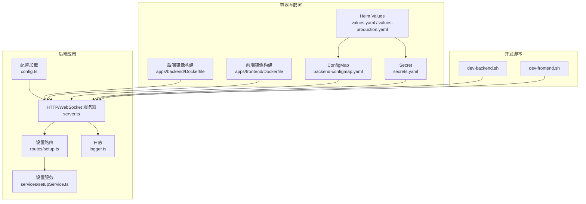
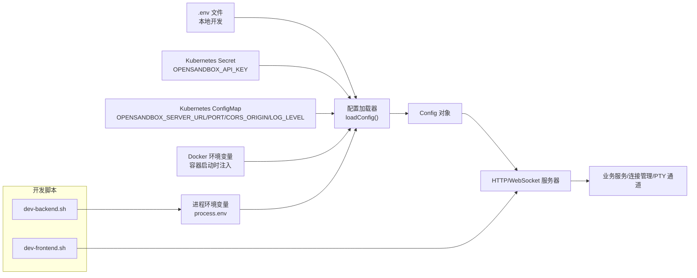
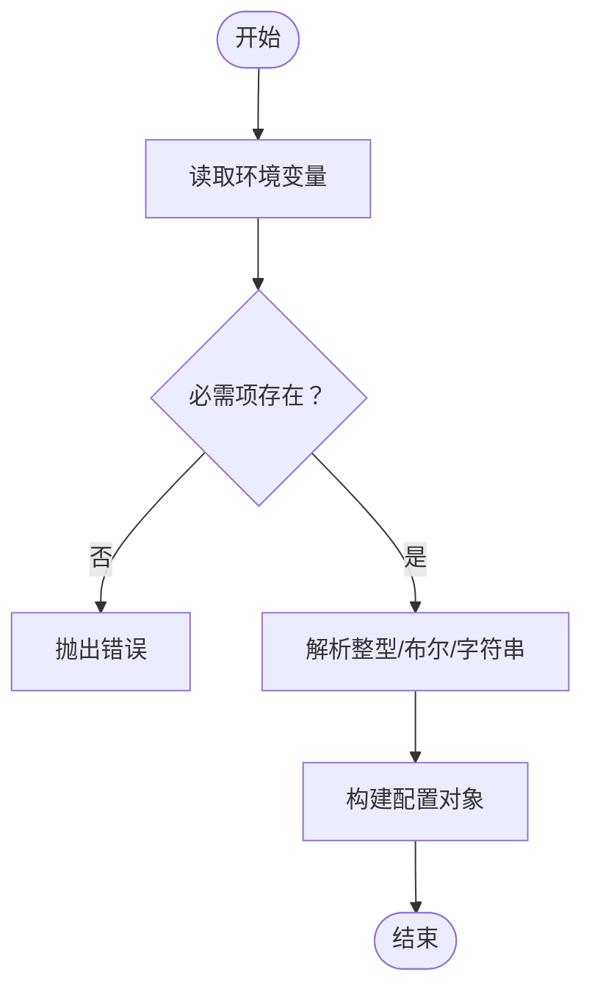
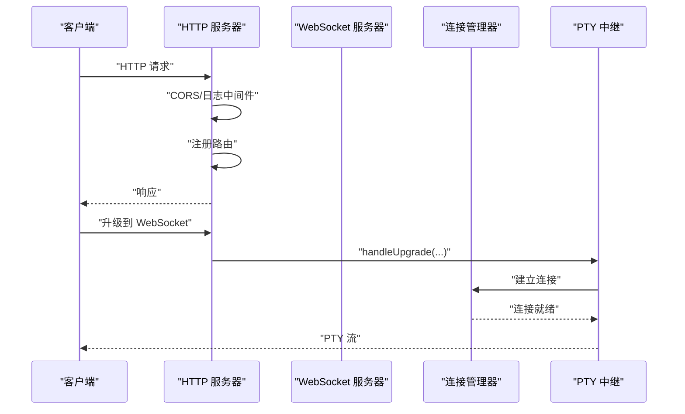
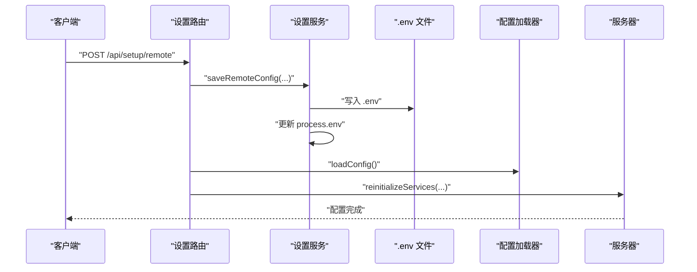
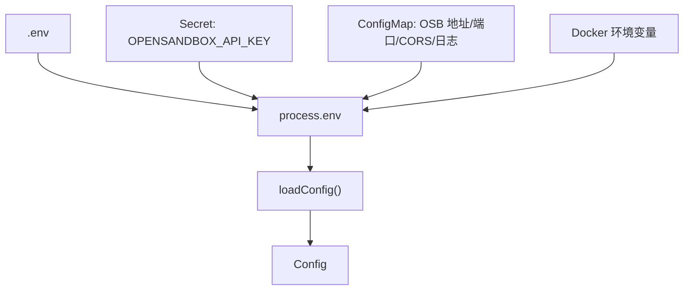

# 环境配置

<cite>
**本文引用的文件**
- [apps/backend/src/config.ts](file://apps/backend/src/config.ts)
- [apps/backend/src/server.ts](file://apps/backend/src/server.ts)
- [apps/backend/src/routes/setup.ts](file://apps/backend/src/routes/setup.ts)
- [apps/backend/src/services/setupService.ts](file://apps/backend/src/services/setupService.ts)
- [apps/backend/src/logger.ts](file://apps/backend/src/logger.ts)
- [apps/backend/Dockerfile](file://apps/backend/Dockerfile)
- [apps/frontend/Dockerfile](file://apps/frontend/Dockerfile)
- [infra/helm/sandbox-platform/values.yaml](file://infra/helm/sandbox-platform/values.yaml)
- [infra/helm/sandbox-platform/values-production.yaml](file://infra/helm/sandbox-platform/values-production.yaml)
- [infra/helm/sandbox-platform/templates/backend-configmap.yaml](file://infra/helm/sandbox-platform/templates/backend-configmap.yaml)
- [infra/helm/sandbox-platform/templates/secrets.yaml](file://infra/helm/sandbox-platform/templates/secrets.yaml)
- [scripts/dev-backend.sh](file://scripts/dev-backend.sh)
- [scripts/dev-frontend.sh](file://scripts/dev-frontend.sh)
</cite>

## 目录
1. [简介](#简介)
2. [项目结构](#项目结构)
3. [核心组件](#核心组件)
4. [架构总览](#架构总览)
5. [详细组件分析](#详细组件分析)
6. [依赖关系分析](#依赖关系分析)
7. [性能配置](#性能配置)
8. [故障排查指南](#故障排查指南)
9. [结论](#结论)
10. [附录](#附录)

## 简介
本文件为 Sandbox Manager 的“环境配置”专题文档，聚焦后端服务的环境变量配置与管理，覆盖开发、测试、生产三类环境的差异；解释 .env 文件、Docker 环境变量与 Kubernetes ConfigMap/Secret 的优先级与协同方式；详述数据库连接、API 密钥与第三方服务认证设置；提供 HTTPS、CORS 安全配置建议；阐述性能参数（内存、并发、超时）与配置验证、热更新策略，并给出配置模板与最佳实践。

## 项目结构
围绕环境配置的关键位置如下：
- 后端配置加载与类型定义：apps/backend/src/config.ts
- 服务启动与热更新：apps/backend/src/server.ts
- 设置流程与配置持久化：apps/backend/src/routes/setup.ts、apps/backend/src/services/setupService.ts
- 日志级别与输出：apps/backend/src/logger.ts
- 镜像构建与运行时暴露端口：apps/backend/Dockerfile、apps/frontend/Dockerfile
- Helm Values 与 ConfigMap/Secret 渲染：infra/helm/sandbox-platform/values.yaml、values-production.yaml、templates/*.yaml
- 开发脚本：scripts/dev-backend.sh、scripts/dev-frontend.sh

图表来源
- [apps/backend/src/config.ts:1-71](file://apps/backend/src/config.ts#L1-L71)
- [apps/backend/src/server.ts:1-119](file://apps/backend/src/server.ts#L1-L119)
- [apps/backend/src/routes/setup.ts:1-139](file://apps/backend/src/routes/setup.ts#L1-L139)
- [apps/backend/src/services/setupService.ts:1-147](file://apps/backend/src/services/setupService.ts#L1-L147)
- [apps/backend/src/logger.ts:1-17](file://apps/backend/src/logger.ts#L1-L17)
- [apps/backend/Dockerfile:1-25](file://apps/backend/Dockerfile#L1-L25)
- [apps/frontend/Dockerfile:1-45](file://apps/frontend/Dockerfile#L1-L45)
- [infra/helm/sandbox-platform/values.yaml:1-44](file://infra/helm/sandbox-platform/values.yaml#L1-L44)
- [infra/helm/sandbox-platform/templates/backend-configmap.yaml:1-12](file://infra/helm/sandbox-platform/templates/backend-configmap.yaml#L1-L12)
- [infra/helm/sandbox-platform/templates/secrets.yaml:1-10](file://infra/helm/sandbox-platform/templates/secrets.yaml#L1-L10)
- [scripts/dev-backend.sh:1-17](file://scripts/dev-backend.sh#L1-L17)
- [scripts/dev-frontend.sh:1-17](file://scripts/dev-frontend.sh#L1-L17)

章节来源
- [apps/backend/src/config.ts:1-71](file://apps/backend/src/config.ts#L1-L71)
- [apps/backend/src/server.ts:1-119](file://apps/backend/src/server.ts#L1-L119)
- [apps/backend/src/routes/setup.ts:1-139](file://apps/backend/src/routes/setup.ts#L1-L139)
- [apps/backend/src/services/setupService.ts:1-147](file://apps/backend/src/services/setupService.ts#L1-L147)
- [apps/backend/src/logger.ts:1-17](file://apps/backend/src/logger.ts#L1-L17)
- [apps/backend/Dockerfile:1-25](file://apps/backend/Dockerfile#L1-L25)
- [apps/frontend/Dockerfile:1-45](file://apps/frontend/Dockerfile#L1-L45)
- [infra/helm/sandbox-platform/values.yaml:1-44](file://infra/helm/sandbox-platform/values.yaml#L1-L44)
- [infra/helm/sandbox-platform/values-production.yaml:1-26](file://infra/helm/sandbox-platform/values-production.yaml#L1-L26)
- [infra/helm/sandbox-platform/templates/backend-configmap.yaml:1-12](file://infra/helm/sandbox-platform/templates/backend-configmap.yaml#L1-L12)
- [infra/helm/sandbox-platform/templates/secrets.yaml:1-10](file://infra/helm/sandbox-platform/templates/secrets.yaml#L1-L10)
- [scripts/dev-backend.sh:1-17](file://scripts/dev-backend.sh#L1-L17)
- [scripts/dev-frontend.sh:1-17](file://scripts/dev-frontend.sh#L1-L17)

## 核心组件
- 配置接口与加载器
  - 定义了后端所需的核心配置项，包括端口、运行环境、OpenSandbox 服务地址与密钥、协议、代理开关、请求超时、CORS 来源、日志级别、PTY 空闲超时等。
  - 加载逻辑从进程环境变量读取，缺失必需项会抛出错误；整型字段提供默认值并进行校验。
- 服务器与热更新
  - 通过 createServer 初始化 Express 应用、CORS 中间件、日志中间件、服务实例与路由注册；在升级到 PTY WebSocket 时进行路径匹配与处理。
  - 提供 reinitializeServices 支持在配置变更后重新初始化服务与连接管理器，实现“热更新”效果。
- 设置流程与持久化
  - 提供设置状态查询、远程连接测试、保存远程配置到 .env 并即时更新进程环境变量，随后重新加载配置并热更新服务。
  - 本地 K8s 模式下写入 .env 并可选择是否启用服务端代理。
- 日志系统
  - 基于 Pino，支持按日志级别切换彩色输出与时间格式化，便于开发调试与生产可观测性。

章节来源
- [apps/backend/src/config.ts:3-71](file://apps/backend/src/config.ts#L3-L71)
- [apps/backend/src/server.ts:36-119](file://apps/backend/src/server.ts#L36-L119)
- [apps/backend/src/routes/setup.ts:17-139](file://apps/backend/src/routes/setup.ts#L17-L139)
- [apps/backend/src/services/setupService.ts:27-147](file://apps/backend/src/services/setupService.ts#L27-L147)
- [apps/backend/src/logger.ts:3-17](file://apps/backend/src/logger.ts#L3-L17)

## 架构总览
下图展示环境配置在不同运行时的来源与优先级关系，以及如何影响后端服务行为。

图表来源
- [apps/backend/src/config.ts:48-71](file://apps/backend/src/config.ts#L48-L71)
- [apps/backend/src/server.ts:36-90](file://apps/backend/src/server.ts#L36-L90)
- [apps/backend/src/services/setupService.ts:108-145](file://apps/backend/src/services/setupService.ts#L108-L145)
- [infra/helm/sandbox-platform/templates/backend-configmap.yaml:7-12](file://infra/helm/sandbox-platform/templates/backend-configmap.yaml#L7-L12)
- [infra/helm/sandbox-platform/templates/secrets.yaml:8-10](file://infra/helm/sandbox-platform/templates/secrets.yaml#L8-L10)
- [scripts/dev-backend.sh:14-16](file://scripts/dev-backend.sh#L14-L16)

## 详细组件分析

### 配置接口与加载器
- 关键配置项
  - 运行与网络：端口、运行环境、CORS 来源
  - OpenSandbox：服务地址、API Key、协议、是否使用服务端代理、请求超时
  - 日志：日志级别
  - PTY：空闲超时
- 加载策略
  - 必需项缺失将报错；整型字段若未提供则采用默认值；布尔字符串比较区分大小写。
  - 通过 process.env 与默认值组合生成最终配置对象。

图表来源
- [apps/backend/src/config.ts:32-71](file://apps/backend/src/config.ts#L32-L71)

章节来源
- [apps/backend/src/config.ts:3-71](file://apps/backend/src/config.ts#L3-L71)

### 服务器与热更新
- CORS 与中间件
  - 使用配置中的 CORS 来源初始化中间件；请求中注入请求 ID 并记录调试日志。
- 升级处理
  - 在 HTTP 服务器上监听 upgrade 事件，对 PTY WebSocket 路径进行匹配与转发。
- 服务热更新
  - 通过 reinitializeServices 释放旧服务、创建新服务并替换 app.locals，实现配置变更后的平滑重启。

图表来源
- [apps/backend/src/server.ts:36-90](file://apps/backend/src/server.ts#L36-L90)

章节来源
- [apps/backend/src/server.ts:36-119](file://apps/backend/src/server.ts#L36-L119)

### 设置流程与配置持久化
- 设置状态查询：返回当前配置是否已配置、K8s 模式（本地/远程）、服务地址。
- 远程连接测试：构造连接配置并调用 OpenSandbox SDK 进行连通性测试。
- 保存远程配置：将服务地址、API Key、协议写入 .env，同时更新进程环境变量，随后重新加载配置并热更新服务。
- 保存本地 K8s 配置：写入本地地址、默认 API Key、禁用服务端代理等。

图表来源
- [apps/backend/src/routes/setup.ts:45-67](file://apps/backend/src/routes/setup.ts#L45-L67)
- [apps/backend/src/services/setupService.ts:108-145](file://apps/backend/src/services/setupService.ts#L108-L145)
- [apps/backend/src/server.ts:96-118](file://apps/backend/src/server.ts#L96-L118)

章节来源
- [apps/backend/src/routes/setup.ts:17-139](file://apps/backend/src/routes/setup.ts#L17-L139)
- [apps/backend/src/services/setupService.ts:68-147](file://apps/backend/src/services/setupService.ts#L68-L147)

### 日志与可观测性
- 日志级别由配置决定；在 debug 级别下启用彩色输出与本地时间格式化，便于开发调试。
- 服务器中间件在每个请求进入时记录方法与路径，有助于追踪请求链路。

章节来源
- [apps/backend/src/logger.ts:3-17](file://apps/backend/src/logger.ts#L3-L17)
- [apps/backend/src/server.ts:44-48](file://apps/backend/src/server.ts#L44-L48)

## 依赖关系分析
- 环境变量来源与优先级
  - .env 文件：本地开发持久化配置，用于保存远程或本地 K8s 的 OpenSandbox 配置。
  - Kubernetes Secret：存放 API Key，注入到 Pod 环境变量。
  - Kubernetes ConfigMap：存放服务地址、端口、CORS 来源、日志级别等非敏感配置。
  - Docker 环境变量：容器启动时通过 Dockerfile 或编排工具注入。
  - 进程环境变量：process.env 最终决定运行时配置。
- 配置加载顺序
  - 优先使用进程环境变量；若未提供，则回退到默认值；若缺少必需项则直接失败。
- 容器与部署
  - 后端镜像暴露 3000 端口；前端镜像基于 Nginx，反向代理到后端服务。
  - Helm Values 控制资源、Ingress 主机与 TLS、自动扩缩容等；ConfigMap/Secret 渲染为环境变量。

图表来源
- [apps/backend/src/config.ts:48-71](file://apps/backend/src/config.ts#L48-L71)
- [apps/backend/src/services/setupService.ts:108-145](file://apps/backend/src/services/setupService.ts#L108-L145)
- [infra/helm/sandbox-platform/templates/backend-configmap.yaml:7-12](file://infra/helm/sandbox-platform/templates/backend-configmap.yaml#L7-L12)
- [infra/helm/sandbox-platform/templates/secrets.yaml:8-10](file://infra/helm/sandbox-platform/templates/secrets.yaml#L8-L10)
- [apps/backend/Dockerfile:23-24](file://apps/backend/Dockerfile#L23-L24)
- [apps/frontend/Dockerfile:27-35](file://apps/frontend/Dockerfile#L27-L35)

章节来源
- [apps/backend/src/config.ts:48-71](file://apps/backend/src/config.ts#L48-L71)
- [apps/backend/src/services/setupService.ts:108-145](file://apps/backend/src/services/setupService.ts#L108-L145)
- [apps/backend/Dockerfile:23-24](file://apps/backend/Dockerfile#L23-L24)
- [apps/frontend/Dockerfile:27-35](file://apps/frontend/Dockerfile#L27-L35)
- [infra/helm/sandbox-platform/templates/backend-configmap.yaml:7-12](file://infra/helm/sandbox-platform/templates/backend-configmap.yaml#L7-L12)
- [infra/helm/sandbox-platform/templates/secrets.yaml:8-10](file://infra/helm/sandbox-platform/templates/secrets.yaml#L8-L10)

## 性能配置
- 资源请求与限制
  - Helm Values 中定义了 CPU 与内存请求；生产环境提供副本数量与自动扩缩容配置，以提升可用性与弹性。
- 超时与并发
  - OpenSandbox 请求超时可通过环境变量配置；日志级别影响输出开销；CORS 来源与请求体大小限制影响跨域与上传能力。
- 端口与网络
  - 后端暴露 3000；前端通过 Nginx 反代 /api/ 到后端；Ingress 主机与 TLS 在生产环境中启用。

章节来源
- [infra/helm/sandbox-platform/values.yaml:10-14](file://infra/helm/sandbox-platform/values.yaml#L10-L14)
- [infra/helm/sandbox-platform/values-production.yaml:21-26](file://infra/helm/sandbox-platform/values-production.yaml#L21-L26)
- [apps/backend/src/config.ts:60-61](file://apps/backend/src/config.ts#L60-L61)
- [apps/backend/src/server.ts:40-41](file://apps/backend/src/server.ts#L40-L41)
- [apps/backend/Dockerfile:23](file://apps/backend/Dockerfile#L23)
- [apps/frontend/Dockerfile:27-35](file://apps/frontend/Dockerfile#L27-L35)
- [infra/helm/sandbox-platform/values.yaml:27-34](file://infra/helm/sandbox-platform/values.yaml#L27-L34)

## 故障排查指南
- 缺失必需环境变量
  - 现象：启动即报错。
  - 排查：确认 OPENSANDBOX_SERVER_URL、OPENSANDBOX_API_KEY 是否存在；检查 .env、Kubernetes Secret、Helm Values 与 Docker 注入。
- CORS 不生效
  - 现象：浏览器跨域失败。
  - 排查：核对 CORS_ORIGIN 是否允许前端来源；确认服务器中间件已正确初始化。
- OpenSandbox 连接失败
  - 现象：设置阶段测试连接失败。
  - 排查：使用“测试连接”接口验证；检查协议（http/https）、服务地址可达性、API Key 正确性与超时设置。
- 热更新不生效
  - 现象：修改配置后服务未感知。
  - 排查：确认通过设置流程写入 .env 并调用 reinitializeServices；检查进程环境变量是否同步更新。

章节来源
- [apps/backend/src/config.ts:32-38](file://apps/backend/src/config.ts#L32-L38)
- [apps/backend/src/server.ts:40](file://apps/backend/src/server.ts#L40)
- [apps/backend/src/routes/setup.ts:25-43](file://apps/backend/src/routes/setup.ts#L25-L43)
- [apps/backend/src/services/setupService.ts:85-103](file://apps/backend/src/services/setupService.ts#L85-L103)
- [apps/backend/src/server.ts:96-118](file://apps/backend/src/server.ts#L96-L118)

## 结论
本项目通过统一的配置加载器与明确的优先级策略，将 .env、Kubernetes ConfigMap/Secret、Docker 环境变量与进程环境变量整合为一致的运行时配置来源。配合设置流程与热更新机制，实现了从开发到生产的无缝配置管理。建议在生产中严格分离敏感与非敏感配置，启用 HTTPS 与最小权限原则，并结合自动扩缩容与健康检查保障稳定性。

## 附录

### 环境变量清单与用途
- OPENSANDBOX_SERVER_URL：OpenSandbox 服务地址（必填）
- OPENSANDBOX_API_KEY：OpenSandbox API Key（必填）
- OPENSANDBOX_PROTOCOL：协议（http/https，默认 http）
- OPENSANDBOX_USE_SERVER_PROXY：是否使用服务端代理（默认 true）
- OPENSANDBOX_REQUEST_TIMEOUT_SECONDS：请求超时秒数（默认 300）
- PORT：后端服务端口（默认 3000）
- NODE_ENV：运行环境（默认 development）
- CORS_ORIGIN：CORS 允许来源（默认 *）
- LOG_LEVEL：日志级别（默认 info）
- PTY_IDLE_TIMEOUT_MS：PTY 空闲超时毫秒（默认 300000）

章节来源
- [apps/backend/src/config.ts:48-71](file://apps/backend/src/config.ts#L48-L71)

### 开发/测试/生产环境差异建议
- 开发（本地）
  - 使用 .env 持久化配置；OPENSANDBOX_SERVER_URL 指向本地端口转发；CORS_ORIGIN 设为前端开发域名；日志级别设为 debug。
  - 参考：scripts/dev-backend.sh、apps/backend/Dockerfile。
- 测试（集群）
  - 使用 ConfigMap 注入非敏感配置；Secret 注入 API Key；开启 TLS 与最小权限 RBAC。
- 生产（集群）
  - 使用 values-production.yaml 的资源与自动扩缩容；启用 Ingress TLS；严格限制 CORS 来源；日志级别设为 info 或更高。

章节来源
- [scripts/dev-backend.sh:14-16](file://scripts/dev-backend.sh#L14-L16)
- [apps/backend/Dockerfile:23-24](file://apps/backend/Dockerfile#L23-L24)
- [infra/helm/sandbox-platform/values-production.yaml:15-26](file://infra/helm/sandbox-platform/values-production.yaml#L15-L26)
- [infra/helm/sandbox-platform/values.yaml:27-34](file://infra/helm/sandbox-platform/values.yaml#L27-L34)

### 配置验证方法
- 启动前检查：确保所有必填项存在且类型正确。
- 运行时检查：访问 /api/setup/status 获取当前配置状态；使用 /api/setup/test-connection 验证远端连通性。
- 日志验证：通过 LOG_LEVEL 与请求 ID 追踪请求链路。

章节来源
- [apps/backend/src/config.ts:32-38](file://apps/backend/src/config.ts#L32-L38)
- [apps/backend/src/routes/setup.ts:17-43](file://apps/backend/src/routes/setup.ts#L17-L43)
- [apps/backend/src/server.ts:44-48](file://apps/backend/src/server.ts#L44-L48)

### 配置热更新策略
- 写入 .env 并更新 process.env。
- 调用 loadConfig() 重新加载配置。
- 调用 reinitializeServices() 释放旧服务并创建新服务，替换 app.locals。
- 适用于 OpenSandbox 服务地址、协议、代理与超时等配置变更。

章节来源
- [apps/backend/src/services/setupService.ts:108-145](file://apps/backend/src/services/setupService.ts#L108-L145)
- [apps/backend/src/server.ts:96-118](file://apps/backend/src/server.ts#L96-L118)

### 安全配置指南
- HTTPS
  - 生产环境启用 Ingress TLS；证书由 Secret 提供；后端与前端均应通过 HTTPS 访问。
- CORS
  - 明确指定允许来源，避免使用通配符；仅在开发环境临时放宽。
- 敏感信息保护
  - API Key 存放于 Secret；避免硬编码在 ConfigMap 或 .env；定期轮换密钥。
- 端口与代理
  - 后端仅暴露必要端口；在本地模式下可禁用服务端代理以减少中间层风险。

章节来源
- [infra/helm/sandbox-platform/values-production.yaml:15-20](file://infra/helm/sandbox-platform/values-production.yaml#L15-L20)
- [apps/backend/src/config.ts:60-61](file://apps/backend/src/config.ts#L60-L61)
- [apps/backend/src/server.ts:40](file://apps/backend/src/server.ts#L40)
- [apps/backend/src/services/setupService.ts:131-142](file://apps/backend/src/services/setupService.ts#L131-L142)

### 配置模板与最佳实践
- .env 模板（本地开发）
  - OPENSANDBOX_SERVER_URL=your-opensandbox-host:port
  - OPENSANDBOX_API_KEY=your-api-key
  - OPENSANDBOX_PROTOCOL=http
  - OPENSANDBOX_USE_SERVER_PROXY=true
  - OPENSANDBOX_REQUEST_TIMEOUT_SECONDS=300
  - PORT=3000
  - NODE_ENV=development
  - CORS_ORIGIN=http://localhost:5173
  - LOG_LEVEL=debug
  - PTY_IDLE_TIMEOUT_MS=300000
- Kubernetes Secret（生产）
  - OPENSANDBOX_API_KEY: <your-secure-key>
- Kubernetes ConfigMap（生产）
  - OPENSANDBOX_SERVER_URL: https://your-prod-opensandbox.example.com
  - PORT: "3000"
  - CORS_ORIGIN: https://your-domain.com
  - LOG_LEVEL: info
- 最佳实践
  - 分离敏感与非敏感配置；使用 Secret 管理密钥；最小权限原则；启用 TLS；限制 CORS 来源；定期审计配置变更。

章节来源
- [apps/backend/src/services/setupService.ts:108-145](file://apps/backend/src/services/setupService.ts#L108-L145)
- [infra/helm/sandbox-platform/templates/secrets.yaml:8-10](file://infra/helm/sandbox-platform/templates/secrets.yaml#L8-L10)
- [infra/helm/sandbox-platform/templates/backend-configmap.yaml:7-12](file://infra/helm/sandbox-platform/templates/backend-configmap.yaml#L7-L12)