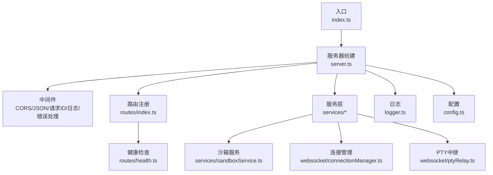
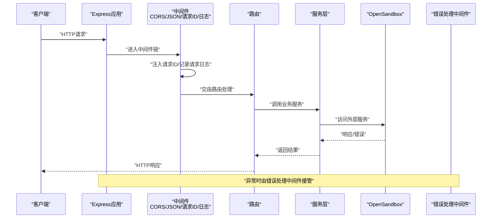
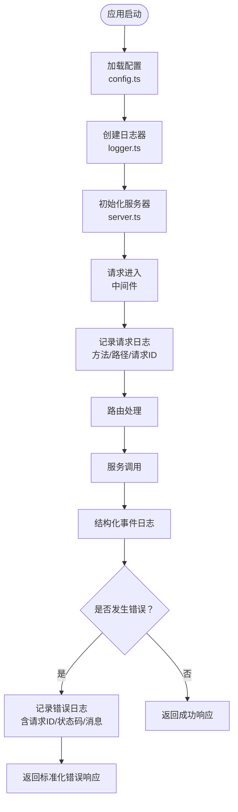
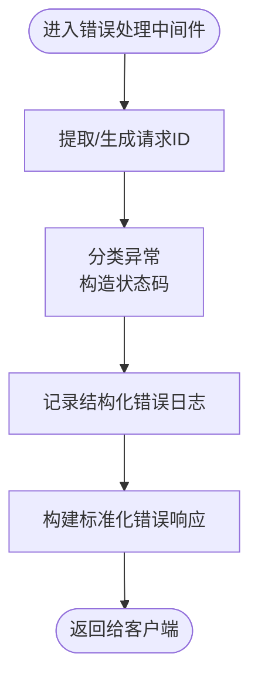
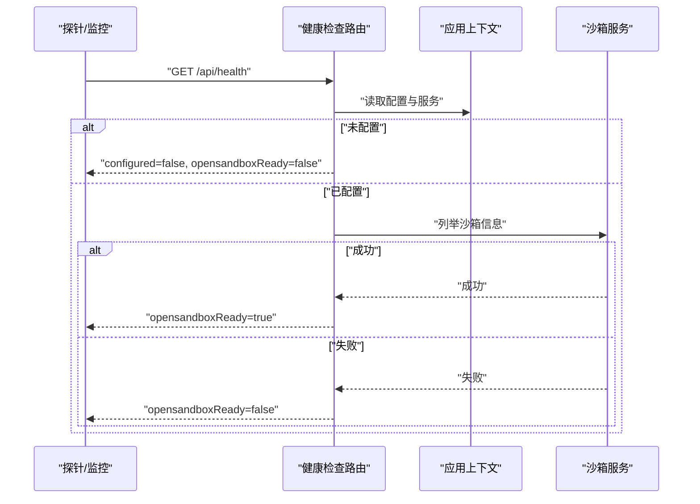
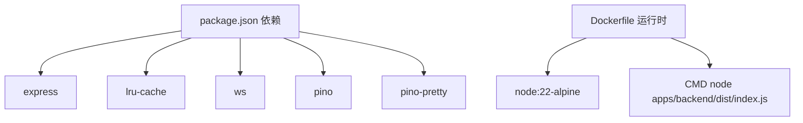

# 监控与日志

<cite>
**本文引用的文件**
- [apps/backend/src/logger.ts](file://apps/backend/src/logger.ts)
- [apps/backend/src/config.ts](file://apps/backend/src/config.ts)
- [apps/backend/src/index.ts](file://apps/backend/src/index.ts)
- [apps/backend/src/server.ts](file://apps/backend/src/server.ts)
- [apps/backend/src/middleware/error.ts](file://apps/backend/src/middleware/error.ts)
- [apps/backend/src/routes/health.ts](file://apps/backend/src/routes/health.ts)
- [apps/backend/src/routes/index.ts](file://apps/backend/src/routes/index.ts)
- [apps/backend/src/services/sandboxService.ts](file://apps/backend/src/services/sandboxService.ts)
- [apps/backend/src/websocket/connectionManager.ts](file://apps/backend/src/websocket/connectionManager.ts)
- [apps/backend/src/websocket/ptyRelay.ts](file://apps/backend/src/websocket/ptyRelay.ts)
- [apps/backend/src/services/profileService.ts](file://apps/backend/src/services/profileService.ts)
- [apps/backend/package.json](file://apps/backend/package.json)
- [apps/backend/Dockerfile](file://apps/backend/Dockerfile)
</cite>

## 目录
1. [简介](#简介)
2. [项目结构](#项目结构)
3. [核心组件](#核心组件)
4. [架构总览](#架构总览)
5. [详细组件分析](#详细组件分析)
6. [依赖关系分析](#依赖关系分析)
7. [性能考虑](#性能考虑)
8. [故障排查指南](#故障排查指南)
9. [结论](#结论)
10. [附录](#附录)

## 简介
本文件面向Sandbox Manager后端服务，系统性梳理其监控与日志体系，覆盖以下主题：
- 日志系统：结构化日志记录、日志级别管理、日志输出格式与可读性优化
- 错误处理：中间件实现、异常分类与HTTP状态码映射、请求ID关联
- 健康检查：API实现、依赖可达性检测、返回字段与语义
- 性能监控：关键指标建议、响应时间与资源使用观测点
- 分布式追踪与链路监控：请求ID传播、关键路径日志标注
- 告警与通知：当前未内置，提供对接建议（邮件、Slack、微信）
- 日志分析与可视化：集成方案建议
- 故障诊断与瓶颈定位：基于现有日志与错误处理的实践
- 监控仪表板：指标采集与展示建议

## 项目结构
后端采用Express + Pino日志 + WebSocket PTY中继的架构。核心模块包括：
- 配置加载与启动：从环境变量读取配置，初始化日志与服务，监听端口
- 路由注册：健康检查、沙箱、镜像、设置、配置文件等
- 中间件：CORS、JSON解析、请求ID注入、结构化日志、错误处理
- 服务层：沙箱服务、镜像服务、连接管理、PTY中继
- 日志：Pino结构化日志，支持调试模式下的美化输出

图表来源
- [apps/backend/src/index.ts:1-66](file://apps/backend/src/index.ts#L1-L66)
- [apps/backend/src/server.ts:36-90](file://apps/backend/src/server.ts#L36-L90)
- [apps/backend/src/routes/index.ts:9-15](file://apps/backend/src/routes/index.ts#L9-L15)
- [apps/backend/src/routes/health.ts:6-51](file://apps/backend/src/routes/health.ts#L6-L51)
- [apps/backend/src/services/sandboxService.ts:11-47](file://apps/backend/src/services/sandboxService.ts#L11-L47)
- [apps/backend/src/websocket/connectionManager.ts:7-28](file://apps/backend/src/websocket/connectionManager.ts#L7-L28)
- [apps/backend/src/websocket/ptyRelay.ts:22-38](file://apps/backend/src/websocket/ptyRelay.ts#L22-L38)
- [apps/backend/src/logger.ts:3-14](file://apps/backend/src/logger.ts#L3-L14)
- [apps/backend/src/config.ts:48-70](file://apps/backend/src/config.ts#L48-L70)

章节来源
- [apps/backend/src/index.ts:1-66](file://apps/backend/src/index.ts#L1-L66)
- [apps/backend/src/server.ts:36-90](file://apps/backend/src/server.ts#L36-L90)
- [apps/backend/src/routes/index.ts:9-15](file://apps/backend/src/routes/index.ts#L9-L15)

## 核心组件
- 结构化日志：通过Pino创建日志器，支持按级别输出；在debug级别启用美化传输，便于本地开发
- 请求ID与中间件：中间件为每个请求生成唯一ID，并在请求进入时记录调试日志
- 错误处理：统一错误处理器，根据异常类型映射HTTP状态码，记录结构化错误日志并返回标准化错误响应
- 健康检查：返回服务状态、配置状态、OpenSandbox可达性、进程运行时长等
- 服务与连接：沙箱服务负责与OpenSandbox交互；连接管理维护前端WS与后端execd WS之间的映射；PTY中继完成双向数据转发

章节来源
- [apps/backend/src/logger.ts:3-14](file://apps/backend/src/logger.ts#L3-L14)
- [apps/backend/src/server.ts:43-48](file://apps/backend/src/server.ts#L43-L48)
- [apps/backend/src/middleware/error.ts:5-31](file://apps/backend/src/middleware/error.ts#L5-L31)
- [apps/backend/src/routes/health.ts:6-51](file://apps/backend/src/routes/health.ts#L6-L51)
- [apps/backend/src/services/sandboxService.ts:11-47](file://apps/backend/src/services/sandboxService.ts#L11-L47)
- [apps/backend/src/websocket/connectionManager.ts:7-28](file://apps/backend/src/websocket/connectionManager.ts#L7-L28)
- [apps/backend/src/websocket/ptyRelay.ts:22-38](file://apps/backend/src/websocket/ptyRelay.ts#L22-L38)

## 架构总览
下图展示了请求从进入后端到路由处理、服务调用与错误处理的整体流程。

图表来源
- [apps/backend/src/server.ts:36-90](file://apps/backend/src/server.ts#L36-L90)
- [apps/backend/src/middleware/error.ts:5-31](file://apps/backend/src/middleware/error.ts#L5-L31)
- [apps/backend/src/routes/index.ts:9-15](file://apps/backend/src/routes/index.ts#L9-L15)
- [apps/backend/src/services/sandboxService.ts:54-56](file://apps/backend/src/services/sandboxService.ts#L54-L56)

## 详细组件分析

### 日志系统与配置
- 日志器创建：根据配置的日志级别创建Pino实例；当级别为debug时启用美化传输，提升本地可读性
- 请求级日志：中间件在每次请求进入时记录方法、路径与请求ID，便于串联链路
- 统一日志：错误处理中间件在记录错误时包含请求ID、状态码、路径与方法，形成可检索的结构化事件
- 运行期日志：服务层与连接管理在关键生命周期（创建、销毁、缓存淘汰）记录结构化日志，便于问题定位

图表来源
- [apps/backend/src/config.ts:48-70](file://apps/backend/src/config.ts#L48-L70)
- [apps/backend/src/logger.ts:3-14](file://apps/backend/src/logger.ts#L3-L14)
- [apps/backend/src/server.ts:43-48](file://apps/backend/src/server.ts#L43-L48)
- [apps/backend/src/middleware/error.ts:18-31](file://apps/backend/src/middleware/error.ts#L18-L31)
- [apps/backend/src/services/sandboxService.ts:74-88](file://apps/backend/src/services/sandboxService.ts#L74-L88)

章节来源
- [apps/backend/src/logger.ts:3-14](file://apps/backend/src/logger.ts#L3-L14)
- [apps/backend/src/server.ts:43-48](file://apps/backend/src/server.ts#L43-L48)
- [apps/backend/src/middleware/error.ts:18-31](file://apps/backend/src/middleware/error.ts#L18-L31)
- [apps/backend/src/services/sandboxService.ts:74-88](file://apps/backend/src/services/sandboxService.ts#L74-L88)

### 错误处理中间件与异常捕获
- 异常分类：根据异常构造函数名或属性映射HTTP状态码，覆盖SDK异常、超时、参数错误、JSON解析失败等场景
- 请求ID关联：从请求头提取或生成请求ID，贯穿日志与响应，确保跨组件可追踪
- 结构化错误日志：记录异常对象、方法、路径、请求ID与状态码，便于审计与检索
- 标准化响应：统一返回success=false与包含错误码、消息与请求ID的结构

图表来源
- [apps/backend/src/middleware/error.ts:5-31](file://apps/backend/src/middleware/error.ts#L5-L31)
- [apps/backend/src/middleware/error.ts:33-47](file://apps/backend/src/middleware/error.ts#L33-L47)

章节来源
- [apps/backend/src/middleware/error.ts:5-31](file://apps/backend/src/middleware/error.ts#L5-L31)
- [apps/backend/src/middleware/error.ts:33-47](file://apps/backend/src/middleware/error.ts#L33-L47)

### 健康检查API
- 路由挂载：在根路径注册健康检查路由
- 状态判定：
  - 未配置：返回configured=false，opensandboxReady=false
  - 已配置：尝试调用沙箱服务列举信息，成功则opensandboxReady=true，否则false
- 返回字段：包含状态、配置状态、OpenSandbox可达性、时间戳与进程运行时长
- 用途：用于容器编排健康探针、运维监控面板与自动化巡检

图表来源
- [apps/backend/src/routes/index.ts:10](file://apps/backend/src/routes/index.ts#L10)
- [apps/backend/src/routes/health.ts:6-51](file://apps/backend/src/routes/health.ts#L6-L51)
- [apps/backend/src/server.ts:51](file://apps/backend/src/server.ts#L51)

章节来源
- [apps/backend/src/routes/health.ts:6-51](file://apps/backend/src/routes/health.ts#L6-L51)
- [apps/backend/src/routes/index.ts:10](file://apps/backend/src/routes/index.ts#L10)

### 性能监控与资源使用
- 关键观测点：
  - 请求级指标：请求ID、方法、路径、状态码、耗时（可在中间件中埋点）
  - 服务级指标：沙箱创建/销毁、连接数、空闲连接清理频率
  - 外部依赖：OpenSandbox请求耗时与成功率
- 建议采集项（概念性）：
  - 指标名称：http_requests_total、http_request_duration_seconds、service_sandbox_create_total、ws_connections_active、idle_cleanup_total
  - 维度过滤：method、path、status_code、sandbox_id、connection_id
- 资源监控：结合容器平台的CPU/内存/网络统计，结合日志中的关键事件进行关联分析

章节来源
- [apps/backend/src/server.ts:43-48](file://apps/backend/src/server.ts#L43-L48)
- [apps/backend/src/websocket/connectionManager.ts:18-28](file://apps/backend/src/websocket/connectionManager.ts#L18-L28)
- [apps/backend/src/websocket/connectionManager.ts:92-100](file://apps/backend/src/websocket/connectionManager.ts#L92-L100)
- [apps/backend/src/services/sandboxService.ts:74-88](file://apps/backend/src/services/sandboxService.ts#L74-L88)

### 分布式追踪与链路监控
- 请求ID传播：中间件为每个请求注入请求ID，错误处理与各服务均记录该ID，形成端到端追踪线索
- 关键路径标注：在路由、服务、连接管理与PTY中继的关键节点记录结构化日志，包含请求ID与上下文信息
- 建议增强（概念性）：在上游网关/反向代理与下游OpenSandbox之间传递请求ID，结合APM工具（如Jaeger/OpenTelemetry）进行链路聚合

章节来源
- [apps/backend/src/server.ts:43-48](file://apps/backend/src/server.ts#L43-L48)
- [apps/backend/src/middleware/error.ts:11-21](file://apps/backend/src/middleware/error.ts#L11-L21)
- [apps/backend/src/websocket/ptyRelay.ts:120-169](file://apps/backend/src/websocket/ptyRelay.ts#L120-L169)

### 告警与通知（当前未内置）
- 当前实现：未发现内置邮件、Slack或微信告警通道
- 建议方案（概念性）：
  - 在错误处理中间件或健康检查失败时触发告警钩子
  - 使用外部告警平台（如Prometheus Alertmanager、钉钉机器人、Slack Webhook、邮箱SMTP）作为扩展
  - 将告警与请求ID、错误码、时间戳关联，便于快速定位

章节来源
- [apps/backend/src/middleware/error.ts:18-31](file://apps/backend/src/middleware/error.ts#L18-L31)
- [apps/backend/src/routes/health.ts:38-50](file://apps/backend/src/routes/health.ts#L38-L50)

### 日志分析与可视化（集成方案）
- 日志采集：容器标准输出（stdout）由平台收集；建议配合日志库的多输出（如文件/HTTP）以满足不同场景
- 可视化：结合日志平台（如ELK/EFK、Grafana Loki、Cloud Logging）进行查询与仪表板构建
- 指标化：将常见结构化字段（如请求ID、状态码、路径、沙箱ID）抽取为标签，支持聚合与告警

章节来源
- [apps/backend/src/logger.ts:3-14](file://apps/backend/src/logger.ts#L3-L14)
- [apps/backend/src/server.ts:43-48](file://apps/backend/src/server.ts#L43-L48)

### 故障诊断与性能瓶颈识别
- 常见问题定位：
  - OpenSandbox不可达：健康检查返回configured=true但opensandboxReady=false；检查网络、代理与超时配置
  - PTY连接异常：前端WS关闭或后端execd WS错误；查看PTY中继日志中的错误事件与连接ID
  - 缓存与连接泄漏：沙箱缓存淘汰与连接空闲清理；关注服务与连接管理的日志
- 性能瓶颈识别：
  - 高错误率与慢响应：结合错误处理中间件日志与路由处理日志，定位异常与耗时热点
  - 连接积压：观察连接管理的活动时间与空闲清理频率，调整空闲阈值

章节来源
- [apps/backend/src/routes/health.ts:24-50](file://apps/backend/src/routes/health.ts#L24-L50)
- [apps/backend/src/websocket/ptyRelay.ts:110-118](file://apps/backend/src/websocket/ptyRelay.ts#L110-L118)
- [apps/backend/src/websocket/connectionManager.ts:92-100](file://apps/backend/src/websocket/connectionManager.ts#L92-L100)
- [apps/backend/src/services/sandboxService.ts:35-44](file://apps/backend/src/services/sandboxService.ts#L35-L44)

## 依赖关系分析
- 后端依赖：Express、Pino、WS、LRU缓存、UUID等
- 部署镜像：基于Node官方Alpine镜像，构建产物dist目录运行

图表来源
- [apps/backend/package.json:11-20](file://apps/backend/package.json#L11-L20)
- [apps/backend/Dockerfile:14-24](file://apps/backend/Dockerfile#L14-L24)

章节来源
- [apps/backend/package.json:11-20](file://apps/backend/package.json#L11-L20)
- [apps/backend/Dockerfile:14-24](file://apps/backend/Dockerfile#L14-L24)

## 性能考虑
- 日志级别：生产环境建议使用info或更高，避免debug带来的I/O开销
- 请求ID与日志：保持轻量结构化字段，避免过大payload
- 连接与缓存：LRU缓存与空闲清理策略需结合实际负载调优
- 外部依赖：合理设置OpenSandbox请求超时，避免阻塞线程

章节来源
- [apps/backend/src/config.ts:66](file://apps/backend/src/config.ts#L66)
- [apps/backend/src/websocket/connectionManager.ts:18-28](file://apps/backend/src/websocket/connectionManager.ts#L18-L28)
- [apps/backend/src/websocket/connectionManager.ts:92-100](file://apps/backend/src/websocket/connectionManager.ts#L92-L100)
- [apps/backend/src/services/sandboxService.ts:35-44](file://apps/backend/src/services/sandboxService.ts#L35-L44)

## 故障排查指南
- 启动阶段：
  - 确认环境变量齐全（端口、环境、OpenSandbox地址与密钥），查看启动日志
  - 若未配置，服务将以设置模式启动，访问设置页面完成配置
- 运行阶段：
  - 使用健康检查确认配置与OpenSandbox可达性
  - 查看错误处理中间件日志，定位异常类型与状态码
  - 对PTY相关问题，关注连接管理与PTY中继的日志，核对连接ID与会话ID
- 关闭阶段：
  - 观察优雅停机流程，确保端口转发与连接清理

章节来源
- [apps/backend/src/index.ts:20-46](file://apps/backend/src/index.ts#L20-L46)
- [apps/backend/src/routes/health.ts:9-22](file://apps/backend/src/routes/health.ts#L9-L22)
- [apps/backend/src/middleware/error.ts:18-31](file://apps/backend/src/middleware/error.ts#L18-L31)
- [apps/backend/src/websocket/ptyRelay.ts:147-166](file://apps/backend/src/websocket/ptyRelay.ts#L147-L166)

## 结论
Sandbox Manager后端已具备完善的日志与错误处理基础：结构化日志、请求ID追踪、统一错误响应与健康检查。建议在此基础上补充：
- 性能指标采集与监控面板
- 分布式追踪与链路监控
- 告警与通知机制
- 日志分析与可视化集成

这些增强将显著提升可观测性与运维效率。

## 附录
- 环境变量与默认值：参考配置加载逻辑，确保关键变量（端口、环境、OpenSandbox地址、日志级别、PTY空闲超时等）正确设置
- 配置文件持久化：服务配置（如profiles）采用本地文件存储，注意权限与备份

章节来源
- [apps/backend/src/config.ts:48-70](file://apps/backend/src/config.ts#L48-L70)
- [apps/backend/src/services/profileService.ts:63-86](file://apps/backend/src/services/profileService.ts#L63-L86)