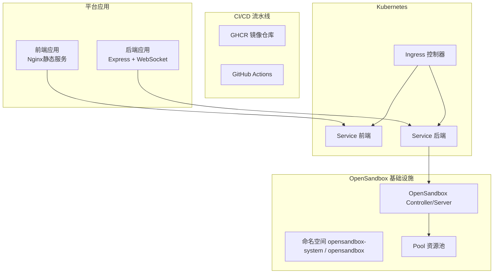
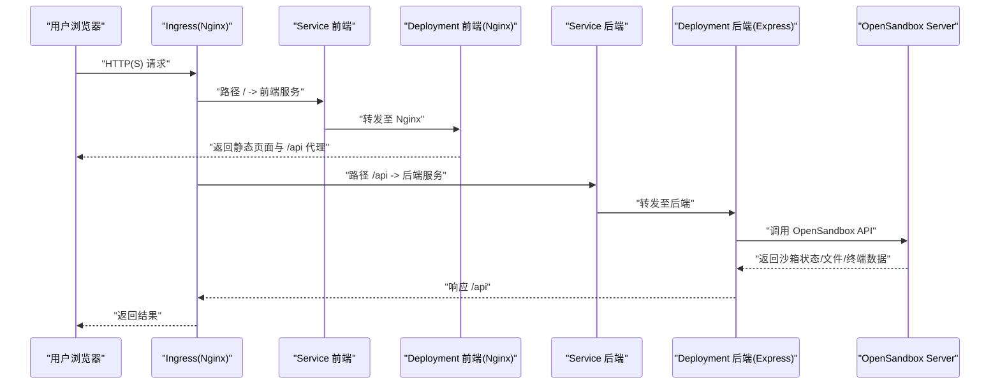
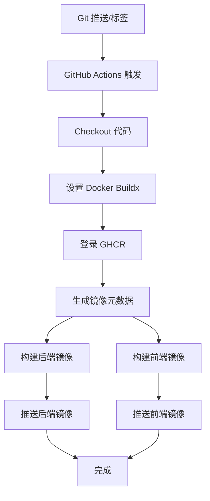
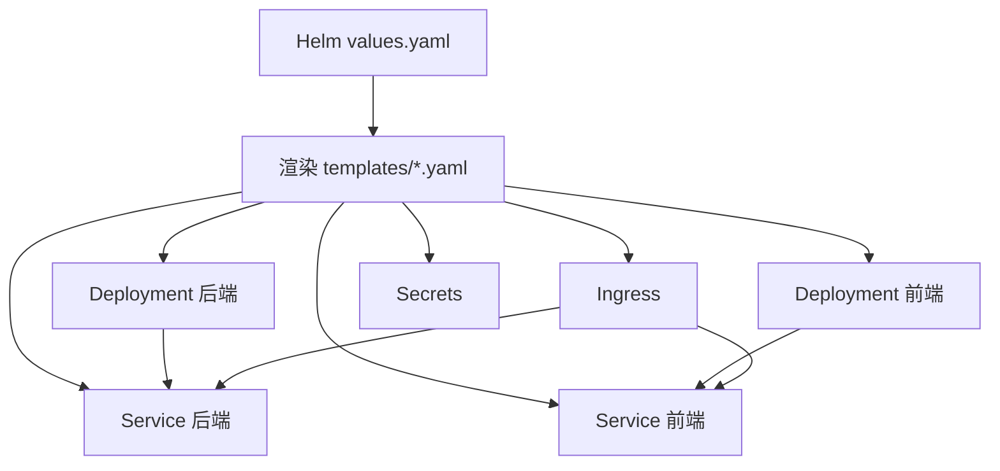
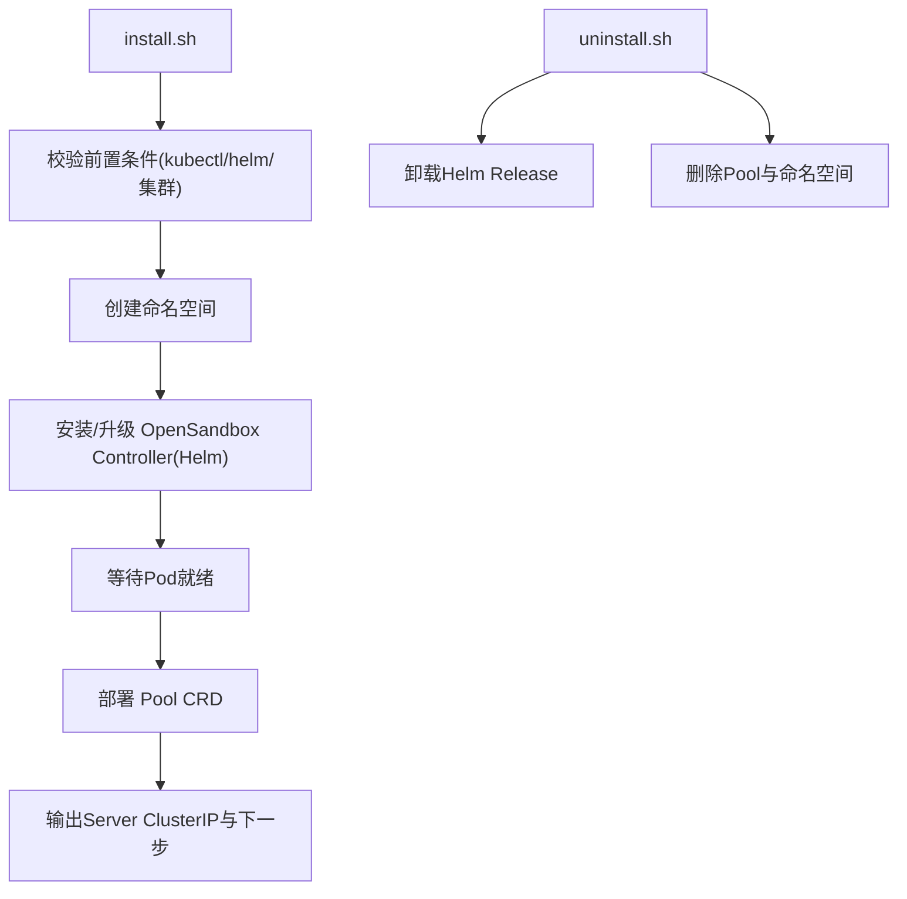
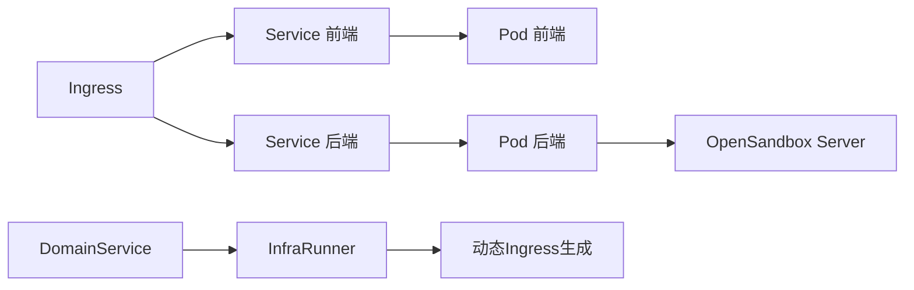

# 部署与运维

<cite>
**本文引用的文件**
- [build-and-push.yml](file://.github/workflows/build-and-push.yml)
- [values-ghcr.yaml](file://infra/helm/sandbox-platform/values-ghcr.yaml)
- [system-architecture.md](file://docs/system-architecture.md)
- [Chart.yaml](file://infra/helm/sandbox-platform/Chart.yaml)
- [values.yaml](file://infra/helm/sandbox-platform/values.yaml)
- [values-production.yaml](file://infra/helm/sandbox-platform/values-production.yaml)
- [backend-deployment.yaml](file://infra/helm/sandbox-platform/templates/backend-deployment.yaml)
- [backend-service.yaml](file://infra/helm/sandbox-platform/templates/backend-service.yaml)
- [frontend-deployment.yaml](file://infra/helm/sandbox-platform/templates/frontend-deployment.yaml)
- [frontend-service.yaml](file://infra/helm/sandbox-platform/templates/frontend-service.yaml)
- [ingress.yaml](file://infra/helm/sandbox-platform/templates/ingress.yaml)
- [secrets.yaml](file://infra/helm/sandbox-platform/templates/secrets.yaml)
- [install.sh](file://infra/opensandbox/install.sh)
- [uninstall.sh](file://infra/opensandbox/uninstall.sh)
- [pool.yaml](file://infra/opensandbox/pool.yaml)
- [sandbox-ingress.yaml](file://infra/opensandbox/sandbox-ingress.yaml)
- [server-ingress.yaml](file://infra/opensandbox/server-ingress.yaml)
- [Dockerfile（后端）](file://apps/backend/Dockerfile)
- [Dockerfile（前端）](file://apps/frontend/Dockerfile)
- [config.ts](file://apps/backend/src/config.ts)
- [infraRunner.ts](file://apps/backend/src/services/infraRunner.ts)
- [domainService.ts](file://apps/backend/src/services/domainService.ts)
- [ptyRelay.ts](file://apps/backend/src/websocket/ptyRelay.ts)
</cite>

## 更新摘要
**变更内容**
- 新增GitHub Actions CI/CD流水线配置，支持自动构建和推送镜像到GHCR
- 添加生产部署到GHCR的Helm配置文件
- 完整的系统架构文档，包含详细的DNS解析、Ingress路由和流量分发机制
- 动态生成的OpenSandbox Ingress资源和基础设施配置
- 增强的WebSocket终端中继和域名管理功能

## 目录
1. [简介](#简介)
2. [项目结构](#项目结构)
3. [核心组件](#核心组件)
4. [架构总览](#架构总览)
5. [详细组件分析](#详细组件分析)
6. [依赖关系分析](#依赖关系分析)
7. [性能考量](#性能考量)
8. [故障排除指南](#故障排除指南)
9. [结论](#结论)
10. [附录](#附录)

## 简介
本文件面向Sandbox Manager平台的部署与运维团队，覆盖Kubernetes生产级部署（Helm Chart）、Ingress与Service发现、OpenSandbox基础设施安装与资源池管理、环境配置最佳实践（生产、安全、性能）、容器化与镜像构建、监控与日志、性能基准测试与告警、CI/CD集成与自动化部署、故障排除、备份与灾备以及扩展与高可用设计。

**更新** 新增GitHub Actions CI/CD流水线配置和生产部署到GHCR的完整流程。

## 项目结构
- 平台由前后端双应用组成：后端Express服务负责REST API与WebSocket终端中继；前端React应用提供Web UI与终端交互。
- 基础设施层依赖OpenSandbox Controller/Server与Kubernetes集群，通过Helm Chart进行统一编排与发布。
- 开发与运维脚本位于scripts与infra目录，便于本地快速搭建与生产部署。
- **新增** GitHub Actions流水线自动处理镜像构建和推送。

**图表来源**
- [build-and-push.yml:1-80](file://.github/workflows/build-and-push.yml#L1-L80)
- [values-ghcr.yaml:1-12](file://infra/helm/sandbox-platform/values-ghcr.yaml#L1-L12)

**章节来源**
- [README.md:114-140](file://README.md#L114-L140)

## 核心组件
- 后端服务（Express + WebSocket）：提供沙箱生命周期管理、文件系统访问、命令执行、WebSocket PTY终端等能力。
- 前端服务（Nginx静态）：提供UI界面与API反向代理（/api -> 后端），支持单页应用路由。
- OpenSandbox基础设施：Controller/Server负责沙箱实例的调度与运行，Pool CRD定义资源池容量与模板。
- Helm Chart：统一打包后端与前端Deployment、Service、Ingress与Secrets，支持values定制与生产参数覆盖。
- **新增** GitHub Actions CI/CD流水线：自动构建后端和前端镜像并推送到GHCR。

**章节来源**
- [README.md:5-13](file://README.md#L5-L13)
- [Chart.yaml:1-7](file://infra/helm/sandbox-platform/Chart.yaml#L1-L7)
- [values.yaml:1-44](file://infra/helm/sandbox-platform/values.yaml#L1-L44)
- [values-production.yaml:1-26](file://infra/helm/sandbox-platform/values-production.yaml#L1-L26)
- [build-and-push.yml:1-80](file://.github/workflows/build-and-push.yml#L1-L80)

## 架构总览
下图展示从客户端到后端API再到OpenSandbox Server的整体链路，以及Ingress、Service与Pod之间的关系。

**图表来源**
- [ingress.yaml:20-37](file://infra/helm/sandbox-platform/templates/ingress.yaml#L20-L37)
- [backend-service.yaml:7-13](file://infra/helm/sandbox-platform/templates/backend-service.yaml#L7-L13)
- [frontend-service.yaml:7-13](file://infra/helm/sandbox-platform/templates/frontend-service.yaml#L7-L13)
- [backend-deployment.yaml:17-41](file://infra/helm/sandbox-platform/templates/backend-deployment.yaml#L17-L41)
- [frontend-deployment.yaml:17-24](file://infra/helm/sandbox-platform/templates/frontend-deployment.yaml#L17-L24)

## 详细组件分析

### GitHub Actions CI/CD流水线配置
**新增** 完整的自动化构建和部署流水线：

- **触发条件**：主分支推送、标签推送、手动触发
- **镜像仓库**：GHCR（GitHub Container Registry）
- **多阶段构建**：使用Docker Buildx进行多平台构建
- **自动标签**：基于分支、标签和提交SHA生成镜像标签
- **缓存优化**：使用GitHub Actions缓存加速构建
- **安全认证**：使用GITHUB_TOKEN进行镜像仓库认证

**图表来源**
- [build-and-push.yml:1-80](file://.github/workflows/build-and-push.yml#L1-L80)

**章节来源**
- [build-and-push.yml:1-80](file://.github/workflows/build-and-push.yml#L1-L80)

### 生产部署到GHCR的Helm配置
**新增** 针对GHCR的生产部署配置：

- **镜像仓库**：ghcr.io/rabbitai-lab/sandbox-manager/
- **镜像标签**：使用latest标签
- **拉取策略**：Always（确保使用最新镜像）
- **与本地部署对比**：本地使用sandbox-platform/前缀，GHCR使用ghcr.io仓库前缀

**章节来源**
- [values-ghcr.yaml:1-12](file://infra/helm/sandbox-platform/values-ghcr.yaml#L1-L12)

### Kubernetes 部署与Helm Chart
- Chart元信息与版本：应用名称、版本与应用版本定义清晰，适合CI/CD流水线标记。
- Values默认与生产覆盖：
  - 默认values包含镜像仓库/标签、副本数、探针、Ingress主机与TLS、Secrets与Config。
  - 生产values增加副本数、资源请求、Ingress TLS与HPA开关，便于弹性伸缩。
  - **新增** GHCR values文件专门用于生产环境部署。
- 模板组件：
  - 后端/前端Deployment：分别暴露端口、注入ConfigMap/Secret、配置存活与就绪探针。
  - Service：ClusterIP类型，前端80、后端3000。
  - Ingress：Nginx注解开启WebSocket、长连接超时；/api前缀转发至后端，/转发至前端。
  - Secrets：仅存放OpenSandbox API Key，避免硬编码。

**图表来源**
- [Chart.yaml:1-7](file://infra/helm/sandbox-platform/Chart.yaml#L1-L7)
- [values.yaml:1-44](file://infra/helm/sandbox-platform/values.yaml#L1-L44)
- [values-production.yaml:1-26](file://infra/helm/sandbox-platform/values-production.yaml#L1-L26)
- [values-ghcr.yaml:1-12](file://infra/helm/sandbox-platform/values-ghcr.yaml#L1-L12)

**章节来源**
- [Chart.yaml:1-7](file://infra/helm/sandbox-platform/Chart.yaml#L1-L7)
- [values.yaml:1-44](file://infra/helm/sandbox-platform/values.yaml#L1-L44)
- [values-production.yaml:1-26](file://infra/helm/sandbox-platform/values-production.yaml#L1-L26)
- [values-ghcr.yaml:1-12](file://infra/helm/sandbox-platform/values-ghcr.yaml#L1-L12)

### Ingress 控制器与Service发现
- Ingress类名与注解：通过className选择控制器，WebSocket与长连接超时注解确保终端稳定。
- 路由规则：/api前缀转发后端Service，/转发前端Service。
- Service发现：前端Service以ClusterIP暴露，Nginx通过Service DNS解析转发；后端Service同样以ClusterIP暴露，供Ingress与内部通信使用。
- **新增** 动态生成的OpenSandbox Ingress资源，支持通配符域名和多域名配置。

**章节来源**
- [ingress.yaml:13-37](file://infra/helm/sandbox-platform/templates/ingress.yaml#L13-L37)
- [backend-service.yaml:7-13](file://infra/helm/sandbox-platform/templates/backend-service.yaml#L7-L13)
- [frontend-service.yaml:7-13](file://infra/helm/sandbox-platform/templates/frontend-service.yaml#L7-L13)
- [sandbox-ingress.yaml:1-31](file://infra/opensandbox/sandbox-ingress.yaml#L1-L31)
- [server-ingress.yaml:1-28](file://infra/opensandbox/server-ingress.yaml#L1-L28)

### OpenSandbox 基础设施安装与配置
- 安装脚本职责：
  - 检查kubectl/helm与集群连通性。
  - 创建命名空间opensandbox-system与opensandbox。
  - 通过Helm安装/升级OpenSandbox Controller（优先使用GitHub克隆的Chart，回退到本地）。
  - 等待Pod就绪，部署Pool CRD资源池。
  - 输出Server ClusterIP与下一步指引。
- 卸载脚本：卸载Helm Release、删除Pool与命名空间，带交互确认。
- 资源池Pool：定义沙箱基础镜像、最小/最大池容量与缓冲区阈值，用于弹性供给。
- **新增** 动态生成的Ingress资源，支持多域名配置和通配符路由。

**图表来源**
- [install.sh:15-132](file://infra/opensandbox/install.sh#L15-L132)
- [uninstall.sh:1-13](file://infra/opensandbox/uninstall.sh#L1-L13)
- [pool.yaml:1-17](file://infra/opensandbox/pool.yaml#L1-L17)

**章节来源**
- [install.sh:15-132](file://infra/opensandbox/install.sh#L15-L132)
- [uninstall.sh:1-13](file://infra/opensandbox/uninstall.sh#L1-L13)
- [pool.yaml:1-17](file://infra/opensandbox/pool.yaml#L1-L17)

### 域名管理和动态Ingress生成
**新增** 完整的域名管理系统：

- **DomainService**：管理允许的域名列表，支持添加、删除、更新和激活域名
- **动态Ingress生成**：InfraRunner根据域名配置动态生成Kubernetes Ingress资源
- **多域名支持**：支持通配符域名和标准域名混合配置
- **路由规则**：
  - 通配符域名：`*.domain` → OpenSandbox Gateway
  - Server域名：`osb.domain` → OpenSandbox Server API
  - 平台域名：`domain` → 平台前端和后端服务

**章节来源**
- [domainService.ts:1-109](file://apps/backend/src/services/domainService.ts#L1-L109)
- [infraRunner.ts:22-89](file://apps/backend/src/services/infraRunner.ts#L22-L89)

### WebSocket终端中继机制
**新增** 完整的WebSocket PTY中继实现：

- **透明双向中继**：原始二进制帧在前端、后端和OpenSandbox Server之间透明传输
- **协议规范**：
  - 0x00 + UTF-8字节 = stdin（客户端→execd）
  - 0x01 + 字节 = stdout（execd→客户端）
  - 0x02 + 字节 = stderr（execd→客户端）
  - JSON文本帧用于控制：{"type":"resize","cols":N,"rows":N} 和 {"type":"exit","code":N}
- **连接管理**：自动处理连接建立、关闭和错误事件
- **超时处理**：握手超时10秒，代理超时3600秒

**章节来源**
- [ptyRelay.ts:1-171](file://apps/backend/src/websocket/ptyRelay.ts#L1-L171)

### 系统架构文档
**新增** 完整的系统架构设计：

- **整体架构概览**：包含DNS层、Ingress层、服务层和沙箱Pod层
- **DNS解析流程**：dnsmasq + macOS resolver的本地开发环境配置
- **三条Ingress路由**：
  - 路由A：`sandbox.localhost` → 平台Web UI和API
  - 路由B：`osb.sandbox.localhost` → OpenSandbox Server API
  - 路由C：`*.sandbox.localhost` → OpenSandbox Gateway + Sandbox Pods
- **流量分发机制**：通过Host头匹配和OpenSandbox Ingress Gateway的Header模式路由

**章节来源**
- [system-architecture.md:1-249](file://docs/system-architecture.md#L1-L249)

### 环境配置与最佳实践
- 环境变量加载：后端通过config.ts集中加载与校验环境变量，包含OpenSandbox地址/密钥/协议、CORS、日志级别、PTY空闲超时等。
- 生产环境建议：
  - 使用生产values覆盖副本数、资源请求、Ingress TLS与HPA。
  - 在Secrets中存储敏感信息（如API Key），避免明文注入。
  - 设置严格的CORS白名单，限制日志级别与超时参数。
  - **新增** 使用GHCR values文件进行生产部署。
- 安全配置：
  - 启用Ingress TLS与受信证书Secret。
  - 限制后端探针与健康检查路径仅对内网访问（如需）。
  - **新增** 使用GITHUB_TOKEN进行安全的镜像仓库认证。
- 性能调优：
  - 根据负载调整副本数与HPA阈值。
  - 合理设置PTY空闲超时与代理超时，避免资源泄露。

**章节来源**
- [config.ts:48-70](file://apps/backend/src/config.ts#L48-L70)
- [values-production.yaml:15-25](file://infra/helm/sandbox-platform/values-production.yaml#L15-L25)
- [ingress.yaml:8-11](file://infra/helm/sandbox-platform/templates/ingress.yaml#L8-L11)
- [values-ghcr.yaml:1-12](file://infra/helm/sandbox-platform/values-ghcr.yaml#L1-L12)

### Docker 容器化与镜像构建
- 后端镜像：
  - 多阶段构建：builder阶段安装依赖并编译，runtime阶段仅复制产物与依赖，最终以node启动。
  - 暴露3000端口，CMD直接运行编译入口。
- 前端镜像：
  - 多阶段构建：builder阶段构建静态资源，runtime阶段以nginx提供静态服务。
  - 配置Nginx将/api代理至后端Service，并设置长连接超时。
- **新增** CI/CD流水线中的镜像构建优化：
  - 使用Docker Buildx进行多平台构建
  - 自动缓存依赖和构建结果
  - 基于Git标签生成镜像版本
- 建议：
  - CI中缓存pnpm依赖，减少构建时间。
  - 使用只读根文件系统与非root用户（如需）增强安全性。

**章节来源**
- [Dockerfile（后端）:1-25](file://apps/backend/Dockerfile#L1-L25)
- [Dockerfile（前端）:1-45](file://apps/frontend/Dockerfile#L1-L45)
- [build-and-push.yml:57-79](file://.github/workflows/build-and-push.yml#L57-L79)

### 监控与日志、性能基准与告警
- 健康检查：后端Deployment已配置liveness/readiness探针，路径为/api/health。
- 日志：后端通过环境变量控制日志级别；建议结合Kubernetes日志收集（如Fluent Bit/Vector）与集中式日志系统（如ELK/Cloud Logging）。
- 性能基准：建议对以下场景做压测（JMeter/K6）：
  - 并发创建/销毁沙箱。
  - 多终端并发交互（WebSocket PTY）。
  - 文件读写与命令执行吞吐。
- 告警：基于Prometheus/Grafana设置CPU/内存/HPA指标与Ingress错误率告警。
- **新增** CI/CD监控：监控流水线执行状态和镜像构建质量。

**章节来源**
- [backend-deployment.yaml:28-39](file://infra/helm/sandbox-platform/templates/backend-deployment.yaml#L28-L39)
- [config.ts:66-68](file://apps/backend/src/config.ts#L66-L68)

### CI/CD 集成与自动化部署
**更新** 完整的自动化部署流程：

- **GitHub Actions流水线**：
  - 自动检测代码变更并触发构建
  - 分别构建后端与前端镜像并推送到GHCR
  - 使用生产values进行部署
  - 健康检查与回滚策略
- **镜像管理**：
  - 基于Git标签生成版本号
  - 支持分支和提交SHA的镜像标签
  - 使用GITHUB_TOKEN进行安全认证
- **部署策略**：
  - 支持多环境部署（开发、测试、生产）
  - 自动化的依赖管理和缓存优化
  - 健壮的错误处理和重试机制

**图表来源**
- [build-and-push.yml:16-80](file://.github/workflows/build-and-push.yml#L16-L80)

**章节来源**
- [build-and-push.yml:1-80](file://.github/workflows/build-and-push.yml#L1-L80)

### 故障排除指南
- OpenSandbox未就绪：
  - 检查命名空间与Pod状态，确认Helm安装成功且Pool CRD已注册。
  - 如需本地调试，使用kubectl port-forward暴露OpenSandbox Server。
- Ingress无法访问：
  - 校验Ingress类名、主机名与TLS配置；确认Service端口与后端端口一致。
  - **新增** 检查动态生成的Ingress资源是否正确应用。
- 后端404/502：
  - 检查Nginx代理配置与/api路径转发；确认后端探针健康。
- WebSocket断开：
  - 检查Ingress注解是否启用WebSocket与代理超时设置。
- **新增** CI/CD故障排除：
  - 检查GitHub Actions权限配置
  - 验证GITHUB_TOKEN的有效性
  - 确认镜像标签和仓库权限

**章节来源**
- [install.sh:86-93](file://infra/opensandbox/install.sh#L86-L93)
- [ingress.yaml:8-11](file://infra/helm/sandbox-platform/templates/ingress.yaml#L8-L11)
- [backend-deployment.yaml:28-39](file://infra/helm/sandbox-platform/templates/backend-deployment.yaml#L28-L39)

### 备份与灾备
- 备份对象：
  - OpenSandbox相关CRDs（Pool等）与命名空间配置。
  - Helm Release元数据（版本与values）。
  - **新增** GitHub Actions流水线配置和镜像仓库。
- 灾难恢复：
  - 重新执行install.sh或Helm安装脚本恢复基础设施。
  - 使用uninstall.sh清理后重装，确保命名空间与资源池重建。
  - **新增** 重新配置GitHub Actions流水线和镜像仓库权限。

**章节来源**
- [uninstall.sh:8-10](file://infra/opensandbox/uninstall.sh#L8-L10)
- [install.sh:71-82](file://infra/opensandbox/install.sh#L71-L82)

### 扩展性与高可用
- 副本与HPA：生产values启用副本与HPA，按CPU利用率动态扩缩。
- 服务拆分：后端与前端分离，独立扩缩容与资源配额。
- 存储与持久化：如需持久化用户工作区，可在沙箱模板中挂载PVC（需在OpenSandbox侧配置）。
- **新增** 多域名扩展：通过DomainService支持多个域名和通配符配置。
- **新增** CI/CD扩展：支持多环境部署和镜像版本管理。

**章节来源**
- [values-production.yaml:1-26](file://infra/helm/sandbox-platform/values-production.yaml#L1-L26)
- [domainService.ts:14-17](file://apps/backend/src/services/domainService.ts#L14-L17)

## 依赖关系分析
- 组件耦合：
  - 前端依赖后端API（/api）与WebSocket；后端依赖OpenSandbox Server。
  - Ingress作为统一入口，将流量分发至前后端Service。
  - **新增** 域名服务管理动态Ingress资源生成。
- 外部依赖：
  - Kubernetes API Server、Ingress控制器（Nginx）。
  - OpenSandbox Controller/Server与Pool CRD。
  - **新增** GHCR镜像仓库和GitHub Actions服务。

**图表来源**
- [ingress.yaml:20-37](file://infra/helm/sandbox-platform/templates/ingress.yaml#L20-L37)
- [backend-service.yaml:7-13](file://infra/helm/sandbox-platform/templates/backend-service.yaml#L7-L13)
- [frontend-service.yaml:7-13](file://infra/helm/sandbox-platform/templates/frontend-service.yaml#L7-L13)
- [backend-deployment.yaml:17-41](file://infra/helm/sandbox-platform/templates/backend-deployment.yaml#L17-L41)
- [frontend-deployment.yaml:17-24](file://infra/helm/sandbox-platform/templates/frontend-deployment.yaml#L17-L24)
- [domainService.ts:14-17](file://apps/backend/src/services/domainService.ts#L14-L17)
- [infraRunner.ts:426-437](file://apps/backend/src/services/infraRunner.ts#L426-L437)

## 性能考量
- 资源配额：生产环境按业务峰值设置CPU/内存requests与limits。
- 探针与延迟：合理设置探针初始延迟与周期，避免频繁重启。
- 网络与超时：Ingress注解保证WebSocket与长连接稳定；后端PTY空闲超时避免资源占用。
- 弹性伸缩：HPA目标CPU利用率建议70%，结合QPS与延迟指标优化。
- **新增** CI/CD性能优化：使用缓存和并行构建提升流水线效率。

**章节来源**
- [values-production.yaml:21-25](file://infra/helm/sandbox-platform/values-production.yaml#L21-L25)
- [ingress.yaml:8-11](file://infra/helm/sandbox-platform/templates/ingress.yaml#L8-L11)
- [config.ts:66-68](file://apps/backend/src/config.ts#L66-L68)

## 故障排除指南
- 快速定位：
  - 检查Ingress与Service状态、Pod日志与事件。
  - 验证环境变量与Secrets注入。
  - **新增** 检查GitHub Actions流水线执行日志。
- 常见问题：
  - OpenSandbox不可达：确认Server Service与ClusterIP、端口映射正确。
  - 前端空白：确认Nginx代理与SPA路由配置。
  - WebSocket断流：确认Ingress注解与代理超时。
  - **新增** CI/CD失败：检查镜像构建和推送权限。

**章节来源**
- [README.md:42-48](file://README.md#L42-L48)
- [ingress.yaml:8-11](file://infra/helm/sandbox-platform/templates/ingress.yaml#L8-L11)

## 结论
通过Helm Chart实现平台的标准化部署，结合OpenSandbox基础设施与资源池管理，可实现AI沙箱的弹性供给与高可用运行。**新增**的GitHub Actions CI/CD流水线提供了完整的自动化构建和部署能力，支持多环境部署和镜像版本管理。配合生产级配置、安全加固与监控告警体系，能够满足企业级交付与运维需求。

## 附录
- 快速开始与一键脚本：参阅README中的安装与启动步骤。
- API概览与环境变量参考：参阅README末尾表格。
- **新增** CI/CD最佳实践：配置GitHub Actions权限和镜像仓库访问。

**章节来源**
- [README.md:28-112](file://README.md#L28-L112)
- [README.md:153-188](file://README.md#L153-L188)