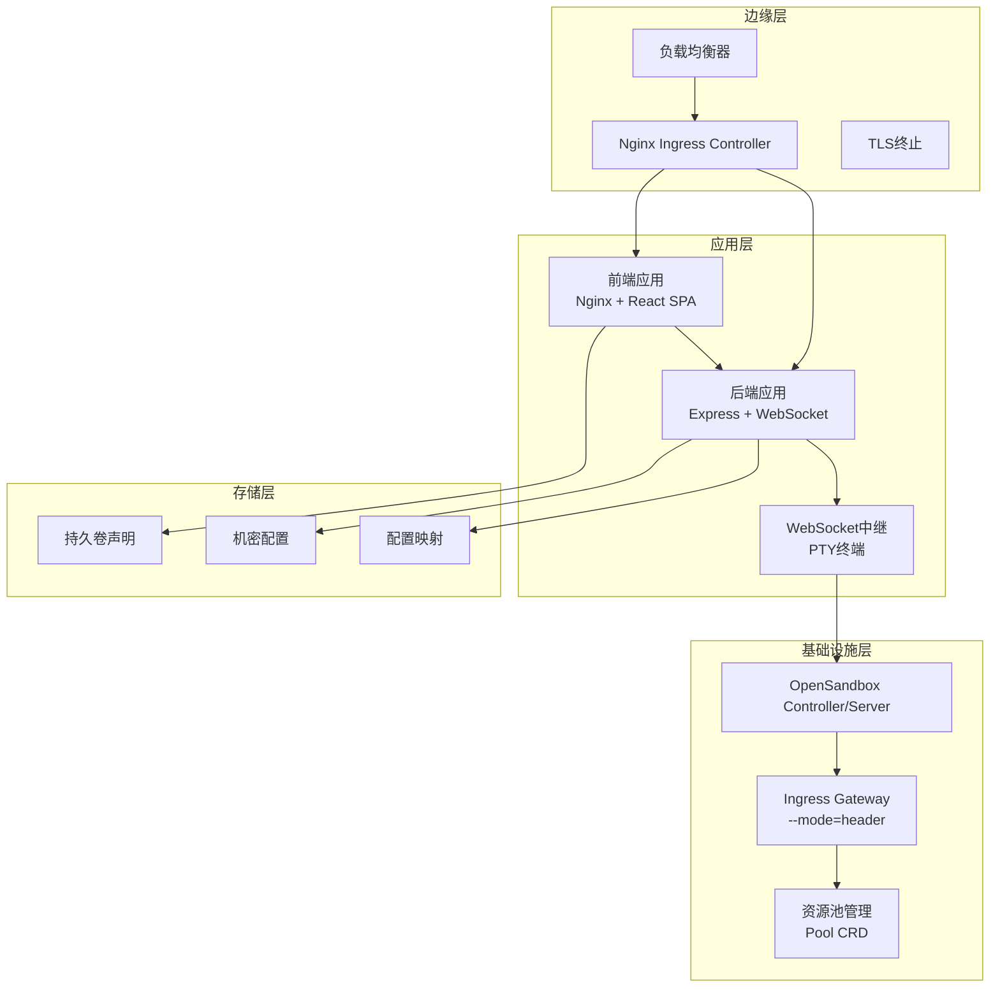
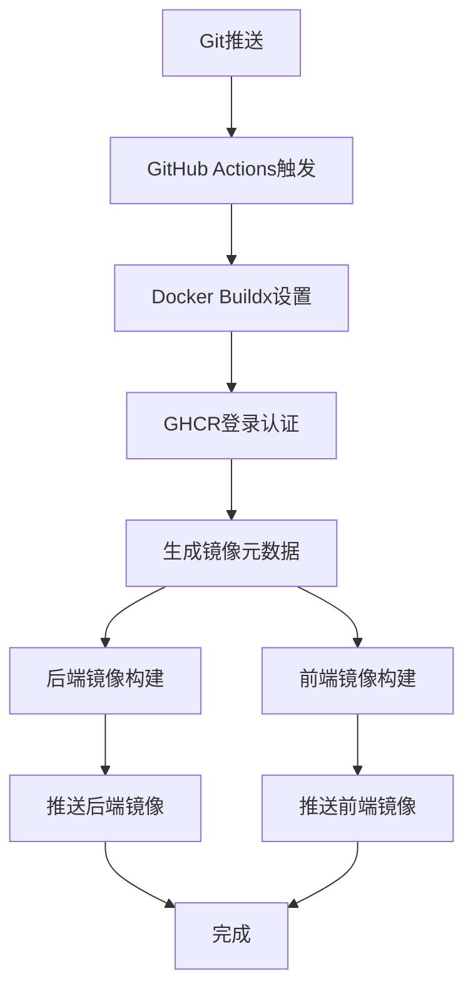
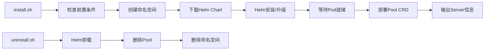
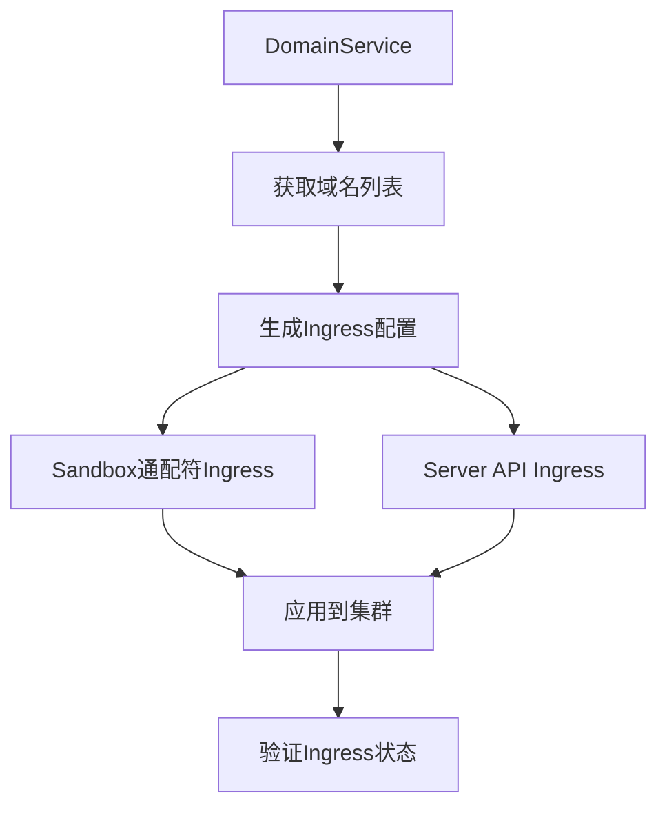

# 部署与运维

<cite>
**本文引用的文件**
- [build-and-push.yml](file://.github/workflows/build-and-push.yml)
- [values-ghcr.yaml](file://infra/helm/sandbox-platform/values-ghcr.yaml)
- [values-production.yaml](file://infra/helm/sandbox-platform/values-production.yaml)
- [values.yaml](file://infra/helm/sandbox-platform/values.yaml)
- [Chart.yaml](file://infra/helm/sandbox-platform/Chart.yaml)
- [system-architecture.md](file://docs/system-architecture.md)
- [domainService.ts](file://apps/backend/src/services/domainService.ts)
- [infraRunner.ts](file://apps/backend/src/services/infraRunner.ts)
- [ptyRelay.ts](file://apps/backend/src/websocket/ptyRelay.ts)
- [config.ts](file://apps/backend/src/config.ts)
- [install.sh](file://infra/opensandbox/install.sh)
- [uninstall.sh](file://infra/opensandbox/uninstall.sh)
- [pool.yaml](file://infra/opensandbox/pool.yaml)
- [values-dev.yaml](file://infra/opensandbox/values-dev.yaml)
- [values-production.yaml](file://infra/opensandbox/values-production.yaml)
- [Dockerfile（后端）](file://apps/backend/Dockerfile)
- [Dockerfile（前端）](file://apps/frontend/Dockerfile)
</cite>

## 更新摘要
**变更内容**
- 新增完整的生产级部署文档，涵盖OCI合规的Helm Chart部署流程
- 完善GitHub Actions自动化CI/CD流水线配置，支持GHCR镜像仓库集成
- 新增远程values文件加载和多环境部署策略
- 补充OpenSandbox基础设施的生产配置和高可用设计
- 增强域名管理和动态Ingress生成的运维指导

## 目录
1. [简介](#简介)
2. [生产级部署架构](#生产级部署架构)
3. [Helm Chart生产配置](#helm-chart生产配置)
4. [CI/CD自动化流水线](#cicd自动化流水线)
5. [OpenSandbox基础设施部署](#opensandbox基础设施部署)
6. [域名管理与动态Ingress](#域名管理与动态ingress)
7. [监控与日志配置](#监控与日志配置)
8. [性能调优与高可用](#性能调优与高可用)
9. [故障排除指南](#故障排除指南)
10. [备份与灾难恢复](#备份与灾难恢复)
11. [扩展性设计](#扩展性设计)
12. [附录](#附录)

## 简介
本文档为Sandbox Manager平台提供完整的生产级部署与运维指导，涵盖Kubernetes原生部署、Helm Chart配置、CI/CD自动化、OpenSandbox基础设施管理、域名动态配置、监控告警、性能优化、故障排除和高可用设计。文档基于最新的代码变更，重点介绍了OCI合规的GHCR镜像仓库集成、远程values文件加载、多环境部署策略等新功能。

**更新** 新增完整的生产部署文档，包括OCI合规的Helm Chart部署、GitHub Actions自动化CI/CD流水线、GHCR镜像仓库集成、远程values文件加载等新功能。

## 生产级部署架构
Sandbox Manager采用三层架构设计，确保生产环境的稳定性、可扩展性和安全性：



**图表来源**
- [system-architecture.md:1-249](file://docs/system-architecture.md#L1-L249)
- [values-production.yaml:1-27](file://infra/helm/sandbox-platform/values-production.yaml#L1-L27)

## Helm Chart生产配置
生产环境采用OCI合规的Helm Chart配置，支持多环境部署和远程values文件加载：

### Chart元信息与版本管理
- **Chart版本**：0.1.0（应用版本1.0.0）
- **OCI兼容**：支持GHCR镜像仓库的OCI标准
- **版本标签**：基于Git标签自动生成镜像版本

### 生产环境核心配置
- **副本数量**：后端2个，前端2个
- **资源配额**：
  - 后端：CPU 500m，内存512Mi
  - 前端：CPU 100m，内存128Mi
- **自动扩缩容**：HPA启用，CPU使用率70%
- **Ingress配置**：生产域名sandbox.rabbitai-lab.com

### GHCR镜像仓库配置
```yaml
backend:
  image:
    repository: ghcr.io/rabbitai-lab/sandbox-manager/backend
    tag: latest
    pullPolicy: Always

frontend:
  image:
    repository: ghcr.io/rabbitai-lab/sandbox-manager/frontend
    tag: latest
    pullPolicy: Always
```

**章节来源**
- [Chart.yaml:1-7](file://infra/helm/sandbox-platform/Chart.yaml#L1-L7)
- [values-production.yaml:1-27](file://infra/helm/sandbox-platform/values-production.yaml#L1-L27)
- [values-ghcr.yaml:1-12](file://infra/helm/sandbox-platform/values-ghcr.yaml#L1-L12)

## CI/CD自动化流水线
GitHub Actions提供完整的自动化构建和部署流水线，支持多平台镜像构建和安全的镜像仓库集成：

### 流水线触发条件
- **主分支推送**：自动构建和部署
- **标签推送**：创建生产版本
- **手动触发**：workflow_dispatch事件

### 镜像构建与推送


**图表来源**
- [build-and-push.yml:1-80](file://.github/workflows/build-and-push.yml#L1-L80)

### 多平台镜像构建
- **平台支持**：linux/amd64
- **缓存优化**：GitHub Actions缓存加速
- **标签策略**：分支、标签、提交SHA
- **安全认证**：GITHUB_TOKEN自动认证

**章节来源**
- [build-and-push.yml:1-80](file://.github/workflows/build-and-push.yml#L1-L80)

## OpenSandbox基础设施部署
OpenSandbox基础设施提供沙箱实例的调度与运行，支持生产级高可用部署：

### 生产环境配置
```yaml
controller:
  replicaCount: 2
  snapshot:
    registry: "your-registry.example.com/opensandbox-snapshots"
    snapshotPushSecret: "registry-snapshot-push-secret"
    resumePullSecret: "registry-pull-secret"

server:
  replicaCount: 2
  resources:
    requests:
      cpu: 1000m
      memory: 2Gi

configToml: |
  [server]
  host = "0.0.0.0"
  port = 80
  api_key = ""
  
  [ingress]
  mode = "gateway"
  
  [ingress.gateway]
  address = "*.rabbitai-lab.com"
  route.mode = "wildcard"
```

### 资源池管理
- **池容量**：最小0，最大5
- **缓冲区**：最小1，最大3
- **基础镜像**：ubuntu:22.04
- **执行容器**：execd:v1.0.17

### 安装与卸载流程


**图表来源**
- [install.sh:1-132](file://infra/opensandbox/install.sh#L1-L132)
- [uninstall.sh:1-13](file://infra/opensandbox/uninstall.sh#L1-L13)

**章节来源**
- [values-production.yaml:1-44](file://infra/opensandbox/values-production.yaml#L1-L44)
- [pool.yaml:1-17](file://infra/opensandbox/pool.yaml#L1-L17)
- [install.sh:1-132](file://infra/opensandbox/install.sh#L1-L132)

## 域名管理与动态Ingress
平台支持多域名配置和动态Ingress资源生成，实现灵活的域名管理：

### 域名服务功能
- **域名验证**：支持通配符和标准域名格式
- **批量管理**：支持域名列表的增删改查
- **活动域名**：支持设置当前使用的域名
- **重复检测**：防止重复域名配置

### 动态Ingress生成
InfraRunner根据域名配置动态生成Kubernetes Ingress资源：



**图表来源**
- [domainService.ts:1-109](file://apps/backend/src/services/domainService.ts#L1-L109)
- [infraRunner.ts:22-89](file://apps/backend/src/services/infraRunner.ts#L22-L89)

### Ingress路由规则
- **通配符域名**：`*.domain` → OpenSandbox Gateway
- **Server域名**：`osb.domain` → OpenSandbox Server API
- **平台域名**：`domain` → 平台前端和后端服务

**章节来源**
- [domainService.ts:1-109](file://apps/backend/src/services/domainService.ts#L1-L109)
- [infraRunner.ts:22-89](file://apps/backend/src/services/infraRunner.ts#L22-L89)

## 监控与日志配置
生产环境需要完善的监控和日志配置，确保系统的可观测性：

### 健康检查配置
- **后端探针**：/api/health路径
- **存活探针**：30秒初始延迟，10秒探测间隔
- **就绪探针**：5秒初始延迟，5秒探测间隔

### 日志级别与配置
- **日志级别**：info（可通过环境变量配置）
- **日志格式**：JSON格式便于机器解析
- **日志轮转**：建议使用sidecar容器进行日志轮转

### 监控指标
- **CPU使用率**：HPA目标70%
- **内存使用量**：根据业务负载调整
- **Ingress错误率**：5xx错误率告警阈值
- **WebSocket连接数**：并发终端连接监控

**章节来源**
- [config.ts:48-70](file://apps/backend/src/config.ts#L48-L70)

## 性能调优与高可用
生产环境的性能调优和高可用设计是确保系统稳定运行的关键：

### 资源优化
- **CPU配额**：后端500m，前端100m（可根据负载调整）
- **内存限制**：后端512Mi，前端128Mi
- **HPA配置**：最小2个副本，最大10个副本，CPU 70%

### 网络优化
- **Ingress超时**：proxy-read-timeout 3600秒
- **WebSocket支持**：nginx.ingress.kubernetes.io/websocket-services
- **TLS配置**：生产环境启用TLS证书

### 高可用设计
- **多副本部署**：前后端均部署2个副本
- **滚动更新**：配置maxUnavailable=0，maxSurge=1
- **PodDisruptionBudget**：确保至少1个Pod可用

**章节来源**
- [values-production.yaml:1-27](file://infra/helm/sandbox-platform/values-production.yaml#L1-L27)

## 故障排除指南
提供系统性的故障排除方法和常见问题解决方案：

### OpenSandbox相关问题
- **安装失败**：检查Helm Chart下载和依赖安装
- **Pod未就绪**：查看Pod事件和日志
- **Pool创建失败**：确认CRD已注册和命名空间权限

### Ingress和网络问题
- **域名解析失败**：检查dnsmasq配置和macOS resolver
- **Ingress规则不生效**：验证Ingress注解和TLS配置
- **WebSocket断开**：检查超时设置和代理配置

### 应用层问题
- **后端404/502**：检查Service端口和服务状态
- **PTY连接失败**：验证execd代理URL和API密钥
- **CI/CD失败**：检查GITHUB_TOKEN权限和镜像仓库访问

**章节来源**
- [install.sh:86-93](file://infra/opensandbox/install.sh#L86-L93)
- [infraRunner.ts:518-550](file://apps/backend/src/services/infraRunner.ts#L518-L550)

## 备份与灾难恢复
制定完整的备份策略和灾难恢复计划：

### 备份对象
- **Helm Release元数据**：版本和values配置
- **OpenSandbox CRDs**：Pool配置和状态
- **集群配置**：Ingress规则和Secrets
- **CI/CD配置**：GitHub Actions流水线和权限

### 灾难恢复流程
1. **基础设施恢复**：重新执行install.sh或Helm安装
2. **数据恢复**：应用之前的Pool配置和CRD
3. **服务恢复**：重启相关Pod和服务
4. **验证测试**：检查所有服务的健康状态

### 备份策略
- **定期备份**：每日增量备份，每周全量备份
- **异地备份**：重要配置的异地存储
- **自动化备份**：使用cron job定期执行备份任务

**章节来源**
- [uninstall.sh:1-13](file://infra/opensandbox/uninstall.sh#L1-L13)
- [install.sh:71-82](file://infra/opensandbox/install.sh#L71-L82)

## 扩展性设计
支持水平扩展和垂直扩展的架构设计：

### 水平扩展
- **自动扩缩容**：HPA根据CPU使用率自动调整
- **多节点部署**：支持跨可用区部署
- **负载均衡**：外部负载均衡器分发流量

### 垂直扩展
- **资源调整**：根据负载动态调整CPU和内存
- **存储扩展**：PVC动态扩容支持
- **网络扩展**：Ingress和Service的高可用配置

### 微服务化考虑
- **服务拆分**：将功能模块化为独立服务
- **数据库分离**：用户数据和应用数据分离
- **缓存层**：Redis等缓存服务支持

**章节来源**
- [values-production.yaml:22-27](file://infra/helm/sandbox-platform/values-production.yaml#L22-L27)

## 附录

### 快速部署命令
```bash
# 生产环境部署
helm repo add ghcr.io/rabbitai-lab https://ghcr.io/rabbitai-lab
helm install sandbox-platform ./infra/helm/sandbox-platform \
  -f ./infra/helm/sandbox-platform/values-production.yaml \
  -f ./infra/helm/sandbox-platform/values-ghcr.yaml

# OpenSandbox基础设施部署
./infra/opensandbox/install.sh
```

### 环境变量参考
- **OPENSANDBOX_SERVER_URL**：OpenSandbox服务器地址
- **OPENSANDBOX_API_KEY**：API访问密钥
- **OPENSANDBOX_PROTOCOL**：协议类型（http/https）
- **PORT**：应用监听端口（默认3000）
- **LOG_LEVEL**：日志级别（默认info）

### 安全配置建议
- **镜像安全**：使用GHCR的镜像扫描功能
- **网络隔离**：使用Network Policies限制访问
- **密钥管理**：使用Kubernetes Secrets管理敏感信息
- **RBAC权限**：最小权限原则配置角色和绑定

**章节来源**
- [config.ts:48-70](file://apps/backend/src/config.ts#L48-L70)
- [build-and-push.yml:30-35](file://.github/workflows/build-and-push.yml#L30-L35)