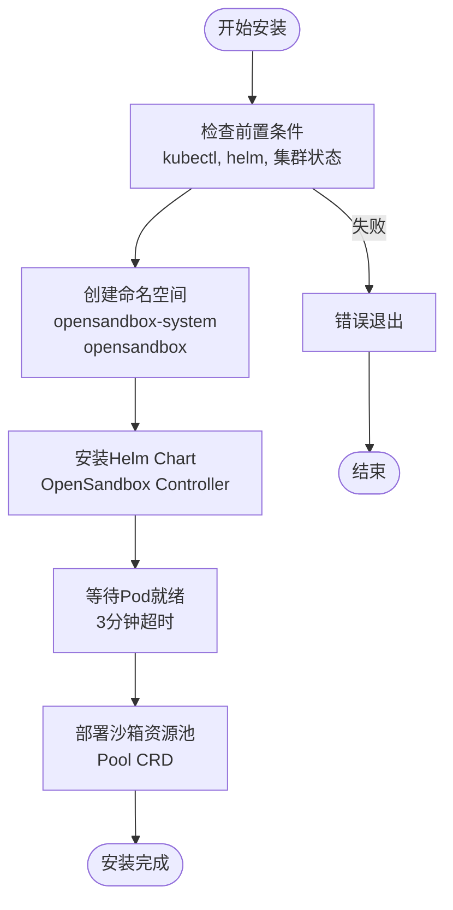
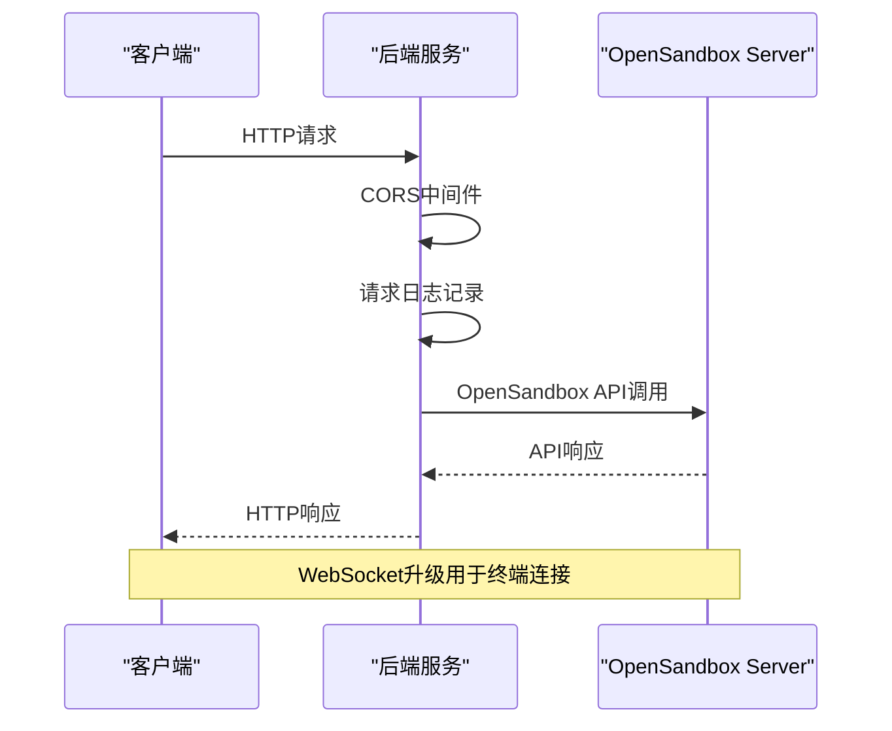
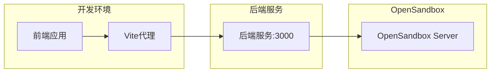
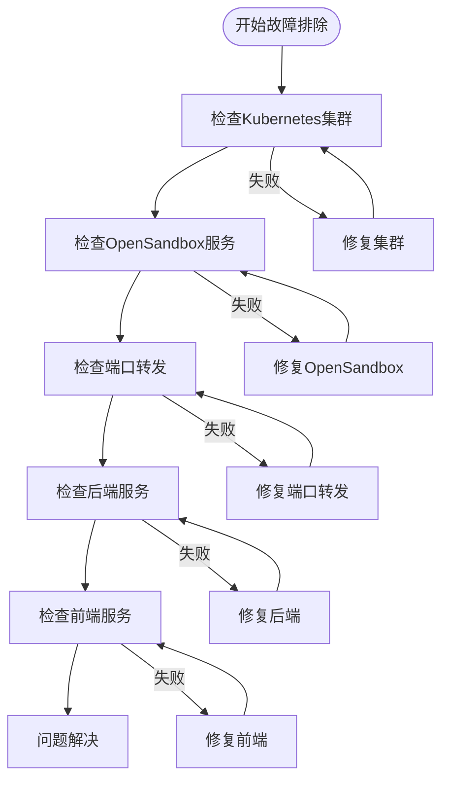
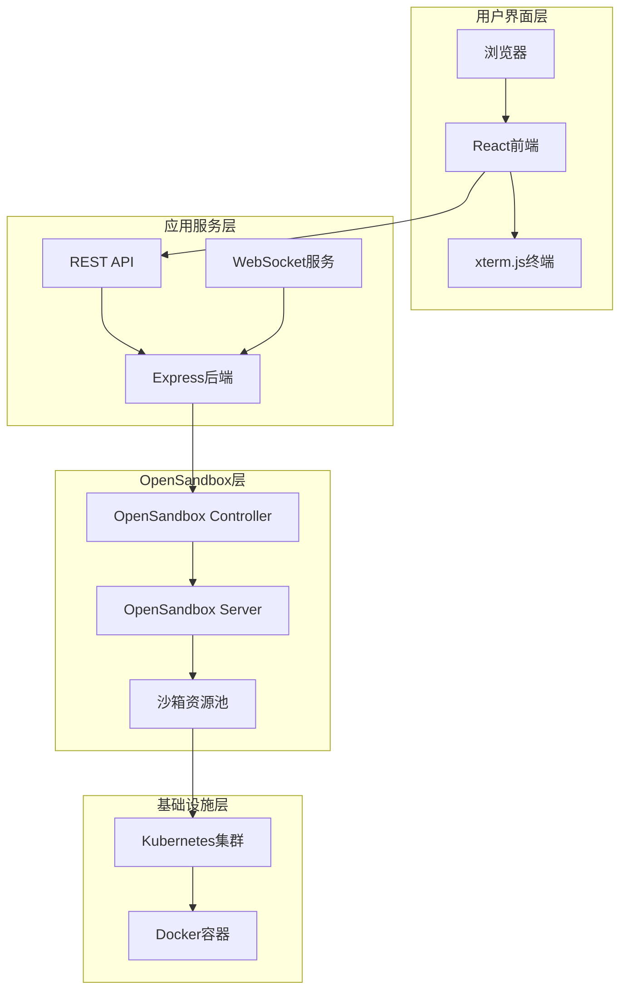
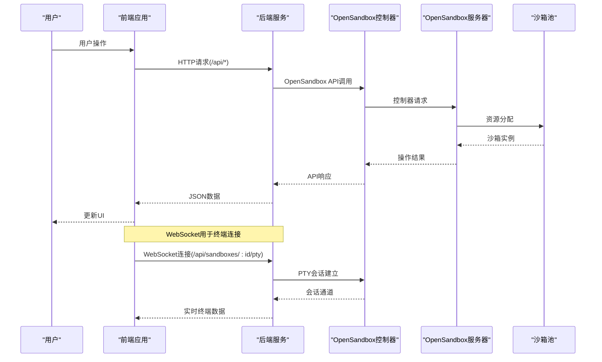
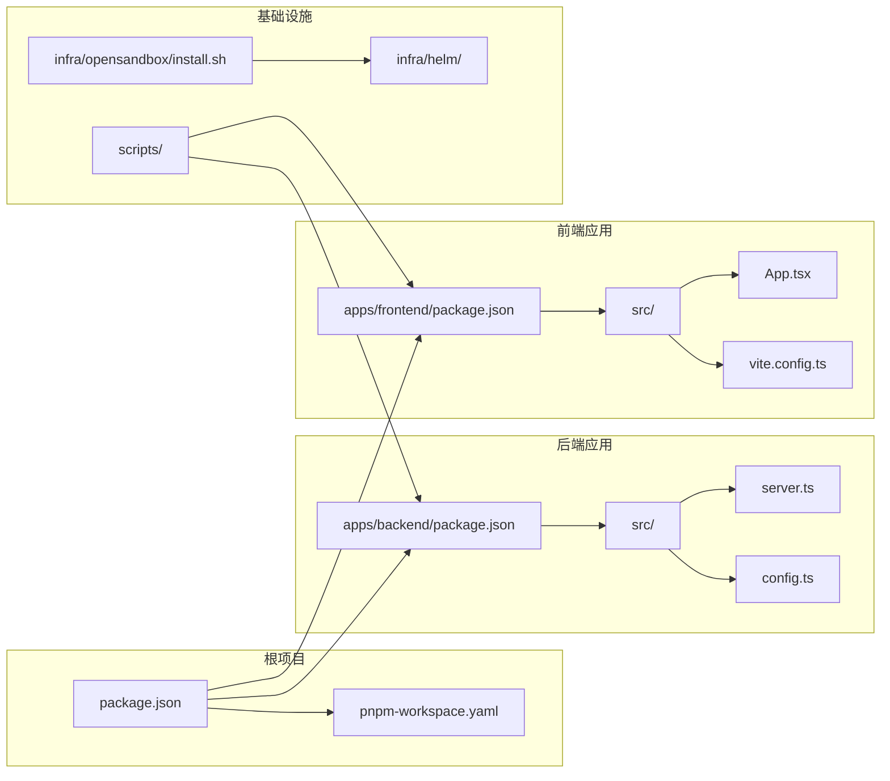

# 快速开始指南

<cite>
**本文档引用的文件**
- [README.md](file://README.md)
- [package.json](file://package.json)
- [pnpm-workspace.yaml](file://pnpm-workspace.yaml)
- [scripts/setup.sh](file://scripts/setup.sh)
- [scripts/dev-backend.sh](file://scripts/dev-backend.sh)
- [scripts/dev-frontend.sh](file://scripts/dev-frontend.sh)
- [apps/backend/package.json](file://apps/backend/package.json)
- [apps/frontend/package.json](file://apps/frontend/package.json)
- [apps/backend/src/config.ts](file://apps/backend/src/config.ts)
- [apps/backend/src/server.ts](file://apps/backend/src/server.ts)
- [apps/frontend/vite.config.ts](file://apps/frontend/vite.config.ts)
- [apps/frontend/src/App.tsx](file://apps/frontend/src/App.tsx)
- [infra/opensandbox/install.sh](file://infra/opensandbox/install.sh)
</cite>

## 目录
1. [简介](#简介)
2. [前置条件检查](#前置条件检查)
3. [安装OpenSandbox基础设施](#安装opensandbox基础设施)
4. [端口转发配置](#端口转发配置)
5. [依赖安装和环境变量设置](#依赖安装和环境变量设置)
6. [后端开发服务器启动](#后端开发服务器启动)
7. [前端开发服务器启动](#前端开发服务器启动)
8. [一键安装脚本使用](#一键安装脚本使用)
9. [常见问题解决](#常见问题解决)
10. [故障排除指南](#故障排除指南)
11. [自定义配置选项](#自定义配置选项)
12. [项目架构概览](#项目架构概览)

## 简介

Sandbox Manager是一个基于OpenSandbox的Kubernetes AI沙箱管理平台，通过Web UI创建、管理隔离的沙箱环境，并使用Web终端(xterm.js)实时交互。该项目采用现代化的技术栈，包括React 19 + TypeScript + Tailwind CSS + Zustand作为前端框架，Express + WebSocket + OpenSandbox SDK作为后端服务，以及Kubernetes + OpenSandbox Controller作为运行时环境。

## 前置条件检查

在开始安装之前，请确保您的系统满足以下前置条件：

### 系统要求
- **Node.js** >= 20
- **pnpm** >= 9
- **Docker Desktop** 并启用Kubernetes，或任意可用的K8s集群
- **kubectl** 和 **helm**

### 验证Kubernetes集群状态

```bash
kubectl cluster-info
```

**预期输出**：
```
Kubernetes master is running at https://kubernetes.docker.internal:6443
KubeDNS is running at https://kubernetes.docker.internal:6443/api/v1/namespaces/kube-system/services/kube-dns:dns/proxy
```

**章节来源**
- [README.md:15-26](file://README.md#L15-L26)

## 安装OpenSandbox基础设施

项目提供了自动化的安装脚本来简化OpenSandbox基础设施的部署过程。

### 执行安装脚本

```bash
bash infra/opensandbox/install.sh
```

该脚本会自动完成以下操作：
- 检查kubectl和helm依赖
- 创建`opensandbox-system`和`opensandbox`命名空间
- 通过Helm安装OpenSandbox Controller和Server
- 部署沙箱资源池(Pool CRD)

### 安装过程详解



**图表来源**
- [infra/opensandbox/install.sh:15-132](file://infra/opensandbox/install.sh#L15-L132)

**章节来源**
- [README.md:30-41](file://README.md#L30-L41)
- [infra/opensandbox/install.sh:15-84](file://infra/opensandbox/install.sh#L15-L84)

## 端口转发配置

安装完成后，需要建立端口转发以访问OpenSandbox Server。

### 启动端口转发

```bash
kubectl port-forward svc/opensandbox-server 8080:80 -n opensandbox-system
```

**预期输出**：
```
Forwarding from 127.0.0.1:8080 -> 10.1.1.10:80
Forwarding from [::1]:8080 -> [::1]:80
```

### 验证端口转发

```bash
curl -I http://localhost:8080
```

**预期输出**：
```
HTTP/1.1 200 OK
```

**章节来源**
- [README.md:42-48](file://README.md#L42-L48)

## 依赖安装和环境变量设置

### 安装项目依赖

```bash
pnpm install
```

### 配置环境变量

复制并编辑后端环境配置：

```bash
cp .env.example apps/backend/.env
```

编辑`apps/backend/.env`文件，确认以下配置与您的环境匹配：

| 环境变量 | 默认值 | 说明 |
|---------|--------|------|
| `OPENSANDBOX_SERVER_URL` | `localhost:8080` | OpenSandbox Server地址 |
| `OPENSANDBOX_API_KEY` | (空) | OpenSandbox API密钥 |
| `OPENSANDBOX_PROTOCOL` | `http` | 连接协议 |
| `PORT` | `3000` | 后端监听端口 |
| `CORS_ORIGIN` | `*` | CORS允许来源 |
| `LOG_LEVEL` | `info` | 日志级别(debug/info/warn/error) |
| `PTY_IDLE_TIMEOUT_MS` | `300000` | PTY空闲超时(毫秒) |

**章节来源**
- [README.md:50-65](file://README.md#L50-L65)
- [apps/backend/src/config.ts:48-70](file://apps/backend/src/config.ts#L48-L70)

## 后端开发服务器启动

### 启动后端服务

```bash
pnpm dev:backend
```

或者使用专用脚本：

```bash
./scripts/dev-backend.sh
```

### 验证后端服务

```bash
curl http://localhost:3000/api/health
```

**预期输出**：
```json
{
  "status": "healthy",
  "configured": true
}
```

### 后端服务架构



**图表来源**
- [apps/backend/src/server.ts:36-89](file://apps/backend/src/server.ts#L36-L89)

**章节来源**
- [README.md:69-79](file://README.md#L69-L79)
- [apps/backend/src/server.ts:36-89](file://apps/backend/src/server.ts#L36-L89)

## 前端开发服务器启动

### 启动前端服务

```bash
pnpm dev:frontend
```

或者使用专用脚本：

```bash
./scripts/dev-frontend.sh
```

### 验证前端服务

浏览器打开 `http://localhost:5173`，您将看到：

- 仪表板页面 - 查看沙箱列表
- 沙箱页面 - 创建新的沙箱
- 终端页面 - 使用Web终端交互
- 文件浏览页面 - 浏览沙箱文件系统

### 前端代理配置

前端开发服务器通过Vite代理将`/api`请求转发到后端：



**图表来源**
- [apps/frontend/vite.config.ts:12-21](file://apps/frontend/vite.config.ts#L12-L21)

**章节来源**
- [README.md:81-89](file://README.md#L81-L89)
- [apps/frontend/vite.config.ts:12-21](file://apps/frontend/vite.config.ts#L12-L21)

## 一键安装脚本使用

项目提供了便捷的一键安装脚本，可以自动化完成整个安装过程。

### 完整安装流程

```bash
bash scripts/setup.sh
```

该脚本执行以下步骤：
1. 检查kubectl和pnpm依赖
2. 安装OpenSandbox基础设施
3. 安装项目依赖
4. 创建环境配置文件
5. 启动端口转发

### 开发服务器启动

安装完成后，使用以下脚本分别启动后端和前端：

```bash
# 在新终端中启动后端
./scripts/dev-backend.sh

# 在新终端中启动前端  
./scripts/dev-frontend.sh
```

**章节来源**
- [README.md:99-112](file://README.md#L99-L112)
- [scripts/setup.sh:10-52](file://scripts/setup.sh#L10-L52)

## 常见问题解决

### 端口转发问题

**问题**：端口转发无法建立
**解决方案**：
1. 检查OpenSandbox Server服务状态
```bash
kubectl get svc opensandbox-server -n opensandbox-system
```
2. 确认端口未被占用
```bash
lsof -i :8080
```

### API密钥配置问题

**问题**：后端启动时报错缺少API密钥
**解决方案**：
1. 检查`apps/backend/.env`文件中的`OPENSANDBOX_API_KEY`
2. 确认使用的是正确的开发密钥
3. 重新加载环境变量

### 健康检查失败

**问题**：前端无法访问后端健康检查
**解决方案**：
1. 确认后端服务正在运行
```bash
pnpm dev:backend
```
2. 检查网络连接
```bash
curl http://localhost:3000/api/health
```

**章节来源**
- [scripts/dev-backend.sh:8-12](file://scripts/dev-backend.sh#L8-L12)
- [apps/frontend/src/App.tsx:84-110](file://apps/frontend/src/App.tsx#L84-L110)

## 故障排除指南

### 完整故障排除流程



### 详细排查步骤

#### 1. 集群状态检查
```bash
# 检查节点状态
kubectl get nodes

# 检查命名空间
kubectl get namespaces

# 检查Pod状态
kubectl get pods -A
```

#### 2. OpenSandbox服务检查
```bash
# 检查OpenSandbox相关Pod
kubectl get pods -n opensandbox-system

# 检查服务
kubectl get svc -n opensandbox-system

# 检查CRD
kubectl get crd | grep sandbox
```

#### 3. 端口转发验证
```bash
# 检查端口转发进程
ps aux | grep port-forward

# 检查本地端口
netstat -an | grep 8080

# 测试连接
telnet localhost 8080
```

#### 4. 后端服务诊断
```bash
# 检查后端日志
kubectl logs -n opensandbox-system -l app.kubernetes.io/name=opensandbox-controller

# 检查后端容器
kubectl logs -n opensandbox-system -l app.kubernetes.io/name=opensandbox-server

# 检查环境变量
kubectl exec -it -n opensandbox-system <pod-name> -- env | grep OPENSANDBOX
```

**章节来源**
- [scripts/setup.sh:32-41](file://scripts/setup.sh#L32-L41)
- [apps/backend/src/config.ts:32-38](file://apps/backend/src/config.ts#L32-L38)

## 自定义配置选项

### OpenSandbox配置

项目支持多种配置方式：

#### 1. 环境变量配置
在`apps/backend/.env`中设置：

```env
# OpenSandbox连接配置
OPENSANDBOX_SERVER_URL=localhost:8080
OPENSANDBOX_API_KEY=your-secret-key
OPENSANDBOX_PROTOCOL=http

# 应用配置
PORT=3000
CORS_ORIGIN=*
LOG_LEVEL=debug

# PTY配置
PTY_IDLE_TIMEOUT_MS=300000
```

#### 2. Helm Values定制
根据需要修改`infra/opensandbox/values-dev.yaml`：

```yaml
# 自定义资源限制
resources:
  limits:
    cpu: 500m
    memory: 512Mi
  requests:
    cpu: 250m
    memory: 256Mi

# 自定义镜像仓库
image:
  repository: your-registry/opensandbox
  tag: latest
```

#### 3. 前端代理配置
在`apps/frontend/vite.config.ts`中调整代理设置：

```typescript
proxy: {
  '/api': {
    target: 'http://localhost:3000',
    changeOrigin: true,
    ws: true,
    // 添加路径重写
    rewrite: (path) => path.replace(/^\/api/, ''),
  },
},
```

**章节来源**
- [apps/backend/src/config.ts:25-30](file://apps/backend/src/config.ts#L25-L30)
- [apps/frontend/vite.config.ts:12-21](file://apps/frontend/vite.config.ts#L12-L21)

## 项目架构概览

### 整体架构设计



### 数据流架构



**图表来源**
- [apps/backend/src/server.ts:75-87](file://apps/backend/src/server.ts#L75-L87)
- [apps/frontend/src/App.tsx:34-68](file://apps/frontend/src/App.tsx#L34-L68)

### 依赖关系图



**图表来源**
- [package.json:7-14](file://package.json#L7-L14)
- [pnpm-workspace.yaml:1-3](file://pnpm-workspace.yaml#L1-L3)
- [apps/backend/package.json:6-10](file://apps/backend/package.json#L6-L10)
- [apps/frontend/package.json:6-10](file://apps/frontend/package.json#L6-L10)

**章节来源**
- [README.md:114-140](file://README.md#L114-L140)
- [package.json:1-20](file://package.json#L1-L20)