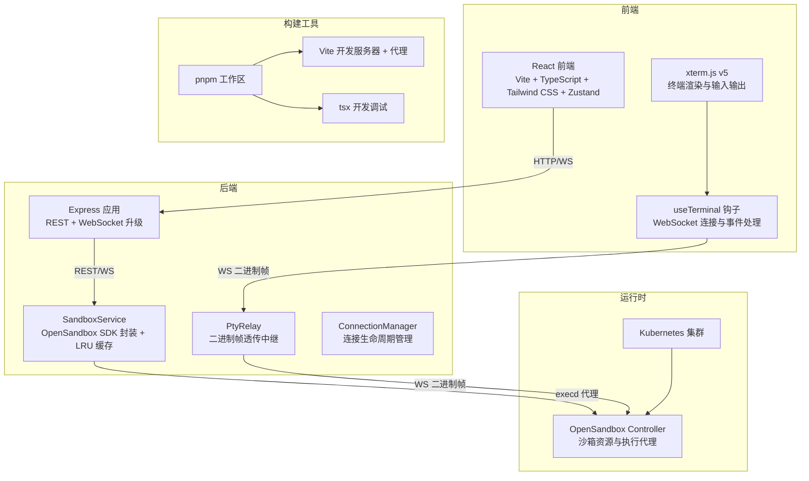
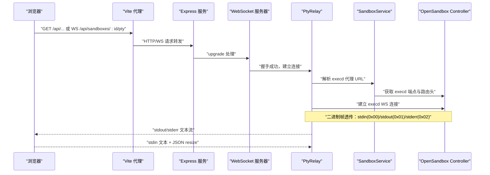
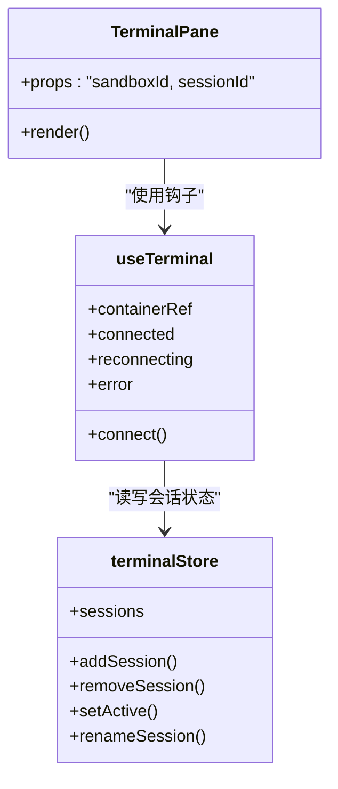
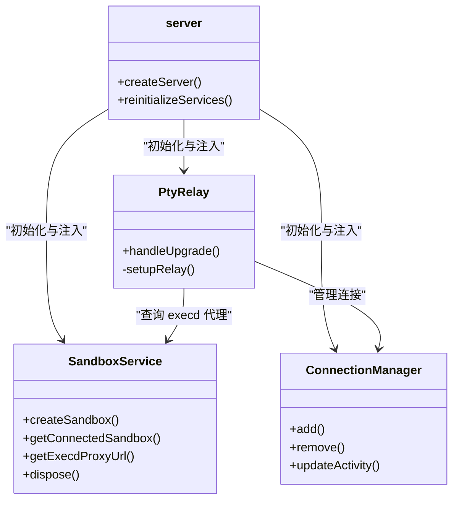
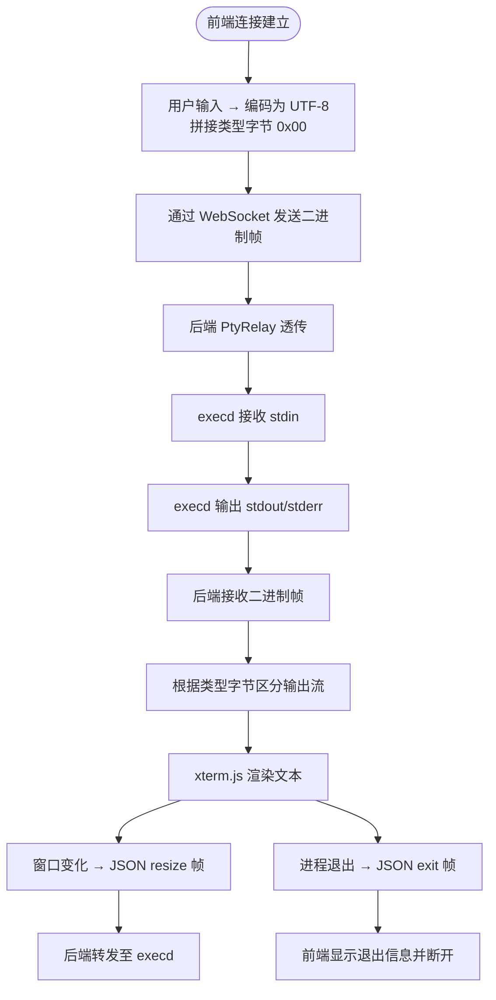
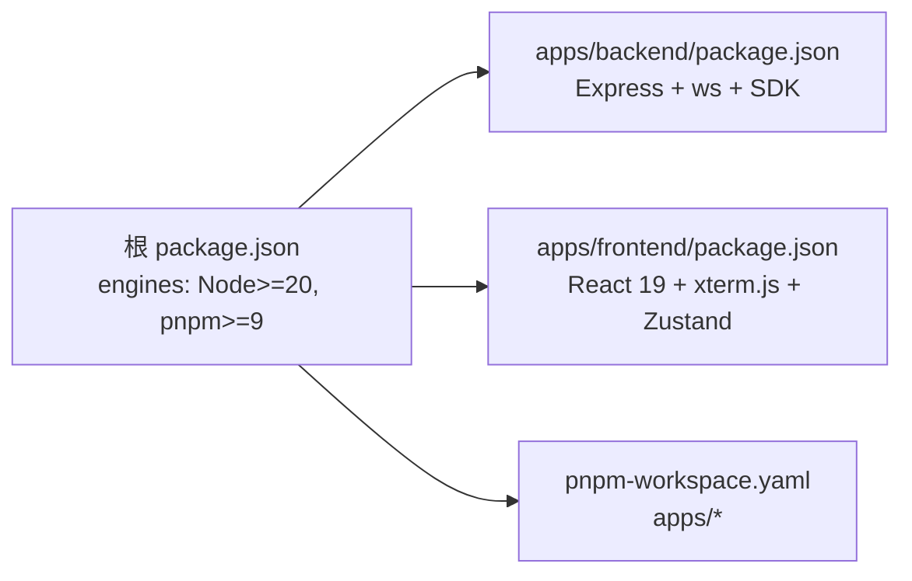

# 技术栈概览

<cite>
**本文档引用的文件**
- [README.md](file://README.md)
- [package.json](file://package.json)
- [pnpm-workspace.yaml](file://pnpm-workspace.yaml)
- [apps/backend/package.json](file://apps/backend/package.json)
- [apps/frontend/package.json](file://apps/frontend/package.json)
- [apps/backend/src/server.ts](file://apps/backend/src/server.ts)
- [apps/backend/src/websocket/ptyRelay.ts](file://apps/backend/src/websocket/ptyRelay.ts)
- [apps/backend/src/services/sandboxService.ts](file://apps/backend/src/services/sandboxService.ts)
- [apps/frontend/vite.config.ts](file://apps/frontend/vite.config.ts)
- [apps/frontend/tailwind.config.js](file://apps/frontend/tailwind.config.js)
- [apps/frontend/src/hooks/useTerminal.ts](file://apps/frontend/src/hooks/useTerminal.ts)
- [apps/frontend/src/stores/terminalStore.ts](file://apps/frontend/src/stores/terminalStore.ts)
- [apps/frontend/src/components/terminal/TerminalPane.tsx](file://apps/frontend/src/components/terminal/TerminalPane.tsx)
</cite>

## 目录
1. [引言](#引言)
2. [项目结构](#项目结构)
3. [核心组件](#核心组件)
4. [架构总览](#架构总览)
5. [详细组件分析](#详细组件分析)
6. [依赖关系分析](#依赖关系分析)
7. [性能考虑](#性能考虑)
8. [故障排除指南](#故障排除指南)
9. [结论](#结论)
10. [附录](#附录)

## 引言
本文件为 Sandbox Manager 项目的全面技术栈概览，围绕前端（React 19 + TypeScript + Tailwind CSS + Zustand）、终端（xterm.js v5 + WebSocket 二进制帧透传）、后端（Express + WebSocket + OpenSandbox SDK）、运行时（Kubernetes + OpenSandbox Controller）与构建工具（pnpm monorepo + Vite + tsx）进行系统化阐述。文档不仅解释各技术选择的原因与优势，还深入说明它们在项目中的协同工作机制、版本兼容性与升级路径建议，帮助开发者快速理解并高效迭代。

## 项目结构
Sandbox Manager 采用 pnpm monorepo 结构，根目录通过工作区定义统一管理前后端包。后端基于 Express 提供 REST API 与 WebSocket 升级能力；前端使用 React 19 + TypeScript + Tailwind CSS 构建 UI，并以 Zustand 管理状态；终端通过 xterm.js v5 与后端 WebSocket 二进制帧透传实现低延迟交互；后端通过 OpenSandbox SDK 与 Kubernetes 上的 OpenSandbox Controller 通信，完成沙箱生命周期管理与 PTY 通道中继。

**图表来源**
- [apps/backend/src/server.ts:36-90](file://apps/backend/src/server.ts#L36-L90)
- [apps/backend/src/websocket/ptyRelay.ts:22-171](file://apps/backend/src/websocket/ptyRelay.ts#L22-L171)
- [apps/backend/src/services/sandboxService.ts:11-148](file://apps/backend/src/services/sandboxService.ts#L11-L148)
- [apps/frontend/src/hooks/useTerminal.ts:12-180](file://apps/frontend/src/hooks/useTerminal.ts#L12-L180)
- [apps/frontend/vite.config.ts:5-22](file://apps/frontend/vite.config.ts#L5-L22)

**章节来源**
- [README.md:114-140](file://README.md#L114-L140)
- [package.json:1-20](file://package.json#L1-L20)
- [pnpm-workspace.yaml:1-3](file://pnpm-workspace.yaml#L1-L3)

## 核心组件
- 前端技术栈：React 19 + TypeScript + Tailwind CSS + Zustand。提供现代化 UI、类型安全与轻量状态管理，结合 Vite 实现快速开发与热更新。
- 终端技术：xterm.js v5 + WebSocket 二进制帧透传。实现真实 PTY 体验，支持二进制 stdin/stdout/stderr 与 JSON 控制帧。
- 后端技术栈：Express + WebSocket（ws）+ OpenSandbox SDK。提供 REST API 与 WebSocket 升级，封装 OpenSandbox SDK 并集成 LRU 缓存。
- 运行时环境：Kubernetes + OpenSandbox Controller。负责沙箱资源编排与 execd 代理路由，确保安全隔离与弹性伸缩。
- 构建工具：pnpm monorepo + Vite + tsx。统一依赖管理、快速构建与开发调试，提升团队协作效率。

**章节来源**
- [README.md:5-13](file://README.md#L5-L13)
- [apps/frontend/package.json:11-31](file://apps/frontend/package.json#L11-L31)
- [apps/backend/package.json:11-31](file://apps/backend/package.json#L11-L31)

## 架构总览
下图展示了从浏览器到 Kubernetes 的完整数据流：前端通过 Vite 代理访问后端 REST/WS；后端经 OpenSandbox SDK 解析 execd 代理地址并建立双向 WebSocket；xterm.js 以二进制帧透传方式实时传输终端输入输出，配合 JSON 控制帧实现窗口大小调整与进程退出通知。

**图表来源**
- [apps/backend/src/server.ts:75-87](file://apps/backend/src/server.ts#L75-L87)
- [apps/backend/src/websocket/ptyRelay.ts:40-118](file://apps/backend/src/websocket/ptyRelay.ts#L40-L118)
- [apps/backend/src/services/sandboxService.ts:129-138](file://apps/backend/src/services/sandboxService.ts#L129-L138)
- [apps/frontend/src/hooks/useTerminal.ts:25-95](file://apps/frontend/src/hooks/useTerminal.ts#L25-L95)

## 详细组件分析

### 前端组件：xterm.js + Zustand + Vite
- xterm.js v5：负责终端渲染、适配与链接识别，通过二进制帧透传实现真实交互体验。
- Zustand：轻量状态管理，维护多终端会话、标签页与激活状态，避免复杂状态同步。
- Vite：开发时提供代理（/api → 后端），构建时生成优化产物，Tailwind CSS 支持原子化样式。

**图表来源**
- [apps/frontend/src/components/terminal/TerminalPane.tsx:8-37](file://apps/frontend/src/components/terminal/TerminalPane.tsx#L8-L37)
- [apps/frontend/src/hooks/useTerminal.ts:12-180](file://apps/frontend/src/hooks/useTerminal.ts#L12-L180)
- [apps/frontend/src/stores/terminalStore.ts:20-67](file://apps/frontend/src/stores/terminalStore.ts#L20-L67)

**章节来源**
- [apps/frontend/src/hooks/useTerminal.ts:12-180](file://apps/frontend/src/hooks/useTerminal.ts#L12-L180)
- [apps/frontend/src/stores/terminalStore.ts:1-68](file://apps/frontend/src/stores/terminalStore.ts#L1-L68)
- [apps/frontend/src/components/terminal/TerminalPane.tsx:1-38](file://apps/frontend/src/components/terminal/TerminalPane.tsx#L1-L38)
- [apps/frontend/vite.config.ts:5-22](file://apps/frontend/vite.config.ts#L5-L22)
- [apps/frontend/tailwind.config.js:1-9](file://apps/frontend/tailwind.config.js#L1-L9)

### 后端组件：Express + WebSocket + OpenSandbox SDK
- Express：提供 REST API 与中间件（CORS、JSON、日志），统一错误处理。
- WebSocket：手动升级机制，仅对 PTY 路径放行，其余请求拒绝。
- SandboxService：封装 OpenSandbox SDK，提供沙箱生命周期管理与 execd 代理解析，内置 LRU 缓存降低重复连接成本。
- PtyRelay：核心中继组件，透明转发二进制帧与 JSON 控制帧，维护连接生命周期与活动时间戳。

**图表来源**
- [apps/backend/src/server.ts:36-118](file://apps/backend/src/server.ts#L36-L118)
- [apps/backend/src/websocket/ptyRelay.ts:22-171](file://apps/backend/src/websocket/ptyRelay.ts#L22-L171)
- [apps/backend/src/services/sandboxService.ts:11-148](file://apps/backend/src/services/sandboxService.ts#L11-L148)

**章节来源**
- [apps/backend/src/server.ts:36-90](file://apps/backend/src/server.ts#L36-L90)
- [apps/backend/src/websocket/ptyRelay.ts:22-171](file://apps/backend/src/websocket/ptyRelay.ts#L22-L171)
- [apps/backend/src/services/sandboxService.ts:11-148](file://apps/backend/src/services/sandboxService.ts#L11-L148)

### 终端数据流与协议
- 二进制帧协议：0x00 作为 stdin 输入，0x01 作为 stdout 输出，0x02 作为 stderr 输出；前端发送时在数据前添加类型字节。
- JSON 控制帧：{"type":"resize","cols":N,"rows":N} 用于窗口大小调整；{"type":"exit","code":N} 用于进程退出通知。
- 透传机制：后端 PtyRelay 直接转发原始二进制帧，保证字符编码与控制信号的完整性。

**图表来源**
- [apps/frontend/src/hooks/useTerminal.ts:128-144](file://apps/frontend/src/hooks/useTerminal.ts#L128-L144)
- [apps/backend/src/websocket/ptyRelay.ts:124-144](file://apps/backend/src/websocket/ptyRelay.ts#L124-L144)

**章节来源**
- [apps/frontend/src/hooks/useTerminal.ts:128-144](file://apps/frontend/src/hooks/useTerminal.ts#L128-L144)
- [apps/backend/src/websocket/ptyRelay.ts:120-171](file://apps/backend/src/websocket/ptyRelay.ts#L120-L171)

## 依赖关系分析
- 语言与运行时：Node.js >= 20，pnpm >= 9，满足现代 ES Module 与高性能包管理需求。
- 前端依赖：React 19 + TypeScript + Tailwind CSS + Zustand，结合 Vite 与 Tailwind 插件，形成现代化前端开发体验。
- 后端依赖：Express + ws + OpenSandbox SDK，提供 REST 与 WebSocket 能力，并通过 SDK 与 Kubernetes/OpenSandbox 生态对接。
- 构建与开发：pnpm monorepo 统一管理，Vite 代理简化跨域与联调，tsx 提供开发时热重载。

**图表来源**
- [package.json:15-18](file://package.json#L15-L18)
- [apps/backend/package.json:11-31](file://apps/backend/package.json#L11-L31)
- [apps/frontend/package.json:11-31](file://apps/frontend/package.json#L11-L31)
- [pnpm-workspace.yaml:1-3](file://pnpm-workspace.yaml#L1-L3)

**章节来源**
- [package.json:15-18](file://package.json#L15-L18)
- [apps/backend/package.json:11-31](file://apps/backend/package.json#L11-L31)
- [apps/frontend/package.json:11-31](file://apps/frontend/package.json#L11-L31)
- [pnpm-workspace.yaml:1-3](file://pnpm-workspace.yaml#L1-L3)

## 性能考虑
- LRU 缓存：后端 SandboxService 使用 LRU 缓存连接实例，减少重复连接开销，提高并发响应速度。
- 二进制帧透传：避免额外序列化/反序列化开销，降低网络与 CPU 压力，提升终端交互流畅度。
- 代理与构建：Vite 代理与按需加载插件减少开发时等待时间；Tailwind CSS 在构建阶段优化样式体积。
- 连接管理：后端 ConnectionManager 维护连接活动时间戳与超时策略，防止僵尸连接占用资源。

**章节来源**
- [apps/backend/src/services/sandboxService.ts:35-44](file://apps/backend/src/services/sandboxService.ts#L35-L44)
- [apps/backend/src/websocket/ptyRelay.ts:124-144](file://apps/backend/src/websocket/ptyRelay.ts#L124-L144)
- [apps/frontend/vite.config.ts:12-20](file://apps/frontend/vite.config.ts#L12-L20)

## 故障排除指南
- WebSocket 握手失败：检查后端 upgrade 路由是否正确匹配 PTY 路径，确认日志中连接 ID 与远端 IP。
- PTY 会话创建失败：确认 OpenSandbox Server 地址与 API Key 配置，检查 execd 代理 URL 解析结果与路由头。
- 终端无输出：确认前端二进制帧类型字节处理逻辑与后端透传链路，排查 JSON 控制帧是否被正确解析。
- 连接异常断开：关注后端日志中的关闭代码与原因，结合前端指数退避重连策略定位网络波动。

**章节来源**
- [apps/backend/src/server.ts:75-87](file://apps/backend/src/server.ts#L75-L87)
- [apps/backend/src/websocket/ptyRelay.ts:74-94](file://apps/backend/src/websocket/ptyRelay.ts#L74-L94)
- [apps/frontend/src/hooks/useTerminal.ts:79-95](file://apps/frontend/src/hooks/useTerminal.ts#L79-L95)

## 结论
Sandbox Manager 的技术栈围绕“现代化前端 + 高效后端 + 透明二进制透传 + Kubernetes 运行时”展开，既保证了开发体验与可维护性，又实现了低延迟、高保真的终端交互。通过 LRU 缓存、二进制帧透传与严格的连接管理，系统在功能与性能之间取得良好平衡。建议在生产环境中强化可观测性与安全策略，持续跟踪各组件版本演进，确保生态兼容与升级路径清晰。

## 附录

### 版本兼容性与升级路径建议
- Node.js：>= 20（满足 ES Module 与稳定性能）
- pnpm：>= 9（monorepo 与依赖管理稳定性）
- React：19（最新特性与性能优化）
- xterm.js：v5（成熟生态与二进制帧支持）
- Express：^4.21.x（长期支持与社区活跃）
- ws：^8.18.x（WebSocket 协议与稳定性）
- OpenSandbox SDK：^0.1.7（与控制器版本匹配）

升级建议：
- 逐步迁移：先升级次要版本，再进行补丁更新；后端与前端分别独立升级，避免跨包破坏性变更。
- 测试覆盖：完善 E2E 与 WebSocket 二进制帧测试，确保透传协议一致性。
- 观测性增强：引入链路追踪与指标埋点，监控 PTY 会话时延与错误率。

**章节来源**
- [package.json:15-18](file://package.json#L15-L18)
- [apps/backend/package.json:11-31](file://apps/backend/package.json#L11-L31)
- [apps/frontend/package.json:11-31](file://apps/frontend/package.json#L11-L31)
- [README.md:17-18](file://README.md#L17-L18)