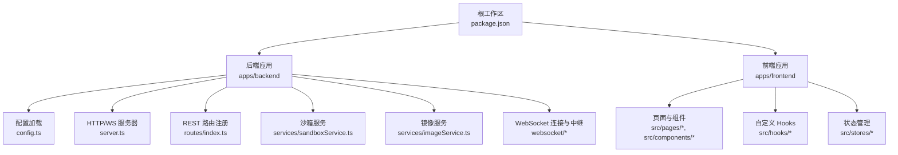
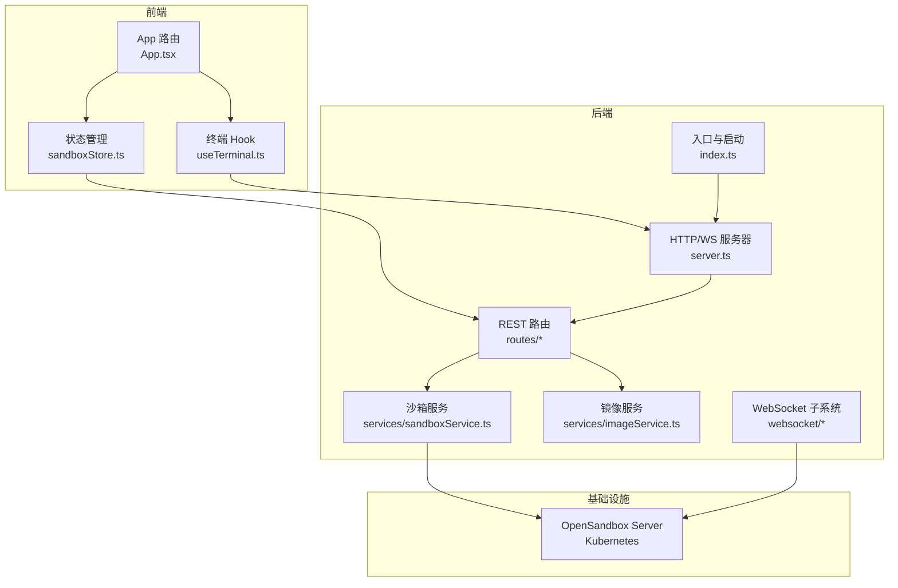
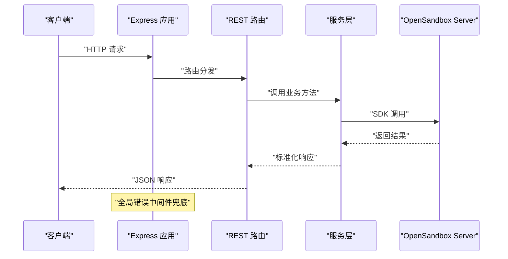
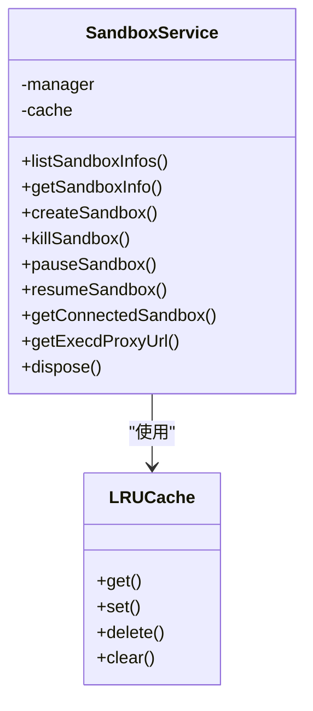
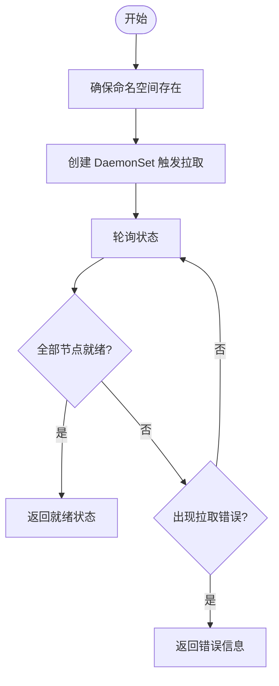
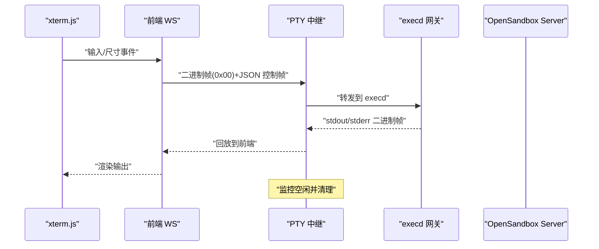
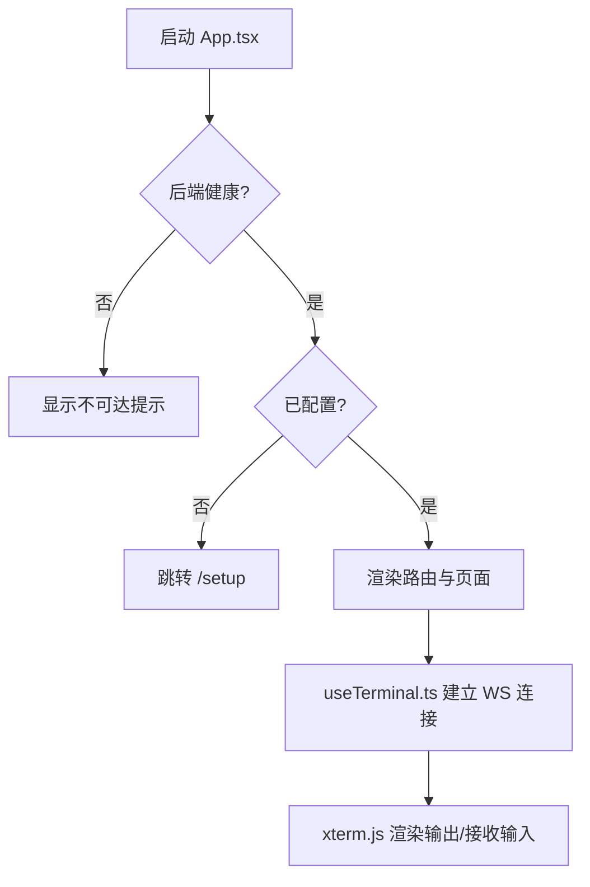
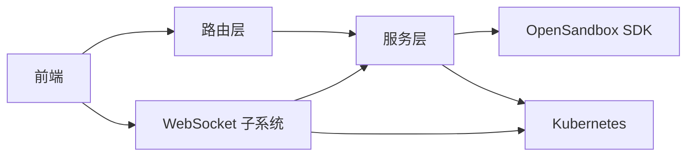

# 架构设计理念

<cite>
**本文引用的文件**
- [README.md](file://README.md)
- [package.json](file://package.json)
- [apps/backend/src/index.ts](file://apps/backend/src/index.ts)
- [apps/backend/src/server.ts](file://apps/backend/src/server.ts)
- [apps/backend/src/config.ts](file://apps/backend/src/config.ts)
- [apps/backend/src/middleware/error.ts](file://apps/backend/src/middleware/error.ts)
- [apps/backend/src/routes/index.ts](file://apps/backend/src/routes/index.ts)
- [apps/backend/src/routes/sandboxes.ts](file://apps/backend/src/routes/sandboxes.ts)
- [apps/backend/src/services/sandboxService.ts](file://apps/backend/src/services/sandboxService.ts)
- [apps/backend/src/services/imageService.ts](file://apps/backend/src/services/imageService.ts)
- [apps/backend/src/websocket/connectionManager.ts](file://apps/backend/src/websocket/connectionManager.ts)
- [apps/backend/src/websocket/ptyRelay.ts](file://apps/backend/src/websocket/ptyRelay.ts)
- [apps/frontend/src/App.tsx](file://apps/frontend/src/App.tsx)
- [apps/frontend/src/hooks/useTerminal.ts](file://apps/frontend/src/hooks/useTerminal.ts)
- [apps/frontend/src/stores/sandboxStore.ts](file://apps/frontend/src/stores/sandboxStore.ts)
</cite>

## 目录
1. [引言](#引言)
2. [项目结构](#项目结构)
3. [核心组件](#核心组件)
4. [架构总览](#架构总览)
5. [详细组件分析](#详细组件分析)
6. [依赖分析](#依赖分析)
7. [性能考量](#性能考量)
8. [故障排查指南](#故障排查指南)
9. [结论](#结论)
10. [附录](#附录)

## 引言
本项目围绕 OpenSandbox 在 Kubernetes 上的 AI 沙箱管理，提供 Web UI 的沙箱创建、管理和交互能力，并通过 WebSocket 实现实时终端（xterm.js）体验。整体采用前后端分离架构，后端以 Express + WebSocket 为核心，结合 LRU 缓存与连接管理策略，实现对 OpenSandbox SDK 的封装与高效调度；前端采用 React 19 + Zustand，提供状态管理与终端交互。架构设计强调可扩展性、可维护性与性能优化，支持本地与远程 Kubernetes 模式，并通过 Helm Chart 支持生产部署。

## 项目结构
项目采用 pnpm monorepo 工作区，按功能域划分为 backend 与 frontend 两个应用，根目录提供统一的开发与构建脚本。

图表来源
- [package.json:1-20](file://package.json#L1-L20)
- [apps/backend/src/config.ts:1-71](file://apps/backend/src/config.ts#L1-L71)
- [apps/backend/src/server.ts:1-119](file://apps/backend/src/server.ts#L1-L119)
- [apps/backend/src/routes/index.ts:1-18](file://apps/backend/src/routes/index.ts#L1-L18)
- [apps/backend/src/services/sandboxService.ts:1-148](file://apps/backend/src/services/sandboxService.ts#L1-L148)
- [apps/backend/src/services/imageService.ts:1-386](file://apps/backend/src/services/imageService.ts#L1-L386)
- [apps/backend/src/websocket/connectionManager.ts:1-102](file://apps/backend/src/websocket/connectionManager.ts#L1-L102)
- [apps/backend/src/websocket/ptyRelay.ts:1-171](file://apps/backend/src/websocket/ptyRelay.ts#L1-L171)
- [apps/frontend/src/App.tsx:1-114](file://apps/frontend/src/App.tsx#L1-L114)
- [apps/frontend/src/hooks/useTerminal.ts:1-180](file://apps/frontend/src/hooks/useTerminal.ts#L1-L180)
- [apps/frontend/src/stores/sandboxStore.ts:1-63](file://apps/frontend/src/stores/sandboxStore.ts#L1-L63)

章节来源
- [README.md:114-140](file://README.md#L114-L140)
- [package.json:7-13](file://package.json#L7-L13)

## 核心组件
- 配置与启动：后端入口负责加载环境变量、初始化日志与服务器，并在本地 Kubernetes 模式下自动建立端口转发。
- 服务器与中间件：Express 应用集成 CORS、JSON 解析、请求日志与全局错误处理；同时创建独立的 WebSocket 服务器用于 PTY 中继。
- 服务层：
  - 沙箱服务：封装 OpenSandbox SDK，提供沙箱生命周期管理与 LRU 缓存，加速频繁访问的连接。
  - 镜像服务：通过 DaemonSet 在集群节点预拉取镜像，提供镜像状态查询与缓存列表。
- WebSocket 子系统：
  - 连接管理器：维护前端 WebSocket 与后端 execd 之间的映射，周期性检测空闲连接并清理。
  - PTY 中继：透明转发二进制帧与控制帧，建立从 xterm.js 到 execd 的双向通道。
- 前端组件与状态：
  - 应用路由与健康检查：根据后端配置状态决定是否进入设置向导或仪表盘。
  - 终端 Hook：封装 xterm.js 与 WebSocket 的交互，处理输入、输出、尺寸调整与重连。
  - Zustand 状态：集中管理沙箱列表、创建/暂停/恢复等操作的状态更新。

章节来源
- [apps/backend/src/index.ts:1-66](file://apps/backend/src/index.ts#L1-L66)
- [apps/backend/src/server.ts:36-90](file://apps/backend/src/server.ts#L36-L90)
- [apps/backend/src/config.ts:48-71](file://apps/backend/src/config.ts#L48-L71)
- [apps/backend/src/services/sandboxService.ts:11-47](file://apps/backend/src/services/sandboxService.ts#L11-L47)
- [apps/backend/src/services/imageService.ts:95-116](file://apps/backend/src/services/imageService.ts#L95-L116)
- [apps/backend/src/websocket/connectionManager.ts:7-46](file://apps/backend/src/websocket/connectionManager.ts#L7-L46)
- [apps/backend/src/websocket/ptyRelay.ts:22-38](file://apps/backend/src/websocket/ptyRelay.ts#L22-L38)
- [apps/frontend/src/App.tsx:34-113](file://apps/frontend/src/App.tsx#L34-L113)
- [apps/frontend/src/hooks/useTerminal.ts:12-95](file://apps/frontend/src/hooks/useTerminal.ts#L12-L95)
- [apps/frontend/src/stores/sandboxStore.ts:16-62](file://apps/frontend/src/stores/sandboxStore.ts#L16-L62)

## 架构总览
整体架构采用“前后端分离 + 事件驱动”的组合模式：
- 前后端分离：前端通过 REST API 与 WebSocket 与后端交互；后端通过 OpenSandbox Server 提供底层能力。
- 事件驱动：后端使用 WebSocket 实现 PTY 实时数据流；前端使用 xterm.js 与 WebSocket 事件进行交互。
- 服务导向：后端将不同职责拆分为服务层（沙箱、镜像），路由层仅做参数校验与调用编排。
- 微服务理念：后端服务可独立演进，通过配置中心与环境变量解耦；前端通过 API 客户端与后端解耦。

图表来源
- [apps/backend/src/index.ts:10-46](file://apps/backend/src/index.ts#L10-L46)
- [apps/backend/src/server.ts:36-89](file://apps/backend/src/server.ts#L36-L89)
- [apps/backend/src/routes/sandboxes.ts:34-55](file://apps/backend/src/routes/sandboxes.ts#L34-L55)
- [apps/backend/src/services/sandboxService.ts:112-138](file://apps/backend/src/services/sandboxService.ts#L112-L138)
- [apps/frontend/src/hooks/useTerminal.ts:25-95](file://apps/frontend/src/hooks/useTerminal.ts#L25-L95)

## 详细组件分析

### 1) 服务器与路由层
- 服务器创建：Express 应用注入 CORS、JSON 解析与请求日志；创建独立 WebSocket 服务器用于升级处理。
- 路由注册：统一挂载健康检查、沙箱、镜像、设置等子路由。
- 错误处理：全局中间件将 SDK 异常映射为 HTTP 状态码，便于前端识别。

图表来源
- [apps/backend/src/server.ts:36-67](file://apps/backend/src/server.ts#L36-L67)
- [apps/backend/src/routes/index.ts:9-15](file://apps/backend/src/routes/index.ts#L9-L15)
- [apps/backend/src/middleware/error.ts:5-31](file://apps/backend/src/middleware/error.ts#L5-L31)

章节来源
- [apps/backend/src/server.ts:36-89](file://apps/backend/src/server.ts#L36-L89)
- [apps/backend/src/routes/index.ts:1-18](file://apps/backend/src/routes/index.ts#L1-L18)
- [apps/backend/src/middleware/error.ts:1-48](file://apps/backend/src/middleware/error.ts#L1-L48)

### 2) 沙箱服务与 LRU 缓存
- 设计要点：对频繁使用的 Sandbox 连接进行 LRU 缓存，提升并发场景下的响应速度；缓存项带 TTL，过期自动回收并关闭底层连接。
- 生命周期管理：创建、暂停、恢复、删除均会同步缓存状态，避免脏连接。
- 连接复用：通过 getConnectedSandbox 获取已连接实例，减少重复握手成本。

图表来源
- [apps/backend/src/services/sandboxService.ts:11-47](file://apps/backend/src/services/sandboxService.ts#L11-L47)
- [apps/backend/src/services/sandboxService.ts:112-123](file://apps/backend/src/services/sandboxService.ts#L112-L123)

章节来源
- [apps/backend/src/services/sandboxService.ts:17-47](file://apps/backend/src/services/sandboxService.ts#L17-L47)
- [apps/backend/src/services/sandboxService.ts:112-138](file://apps/backend/src/services/sandboxService.ts#L112-L138)

### 3) 镜像服务与 Kubernetes 集成
- 命名空间与标签：确保专用命名空间存在，使用标签与注解标识受控的 DaemonSet。
- 预拉取策略：通过 DaemonSet 在各节点拉取镜像，缩短首次启动时间。
- 状态解析：综合 DaemonSet 状态与 Pod 容器等待原因，判断镜像拉取状态与错误信息。
- 缓存查询：遍历节点镜像列表，汇总当前节点缓存情况。

图表来源
- [apps/backend/src/services/imageService.ts:105-116](file://apps/backend/src/services/imageService.ts#L105-L116)
- [apps/backend/src/services/imageService.ts:227-294](file://apps/backend/src/services/imageService.ts#L227-L294)
- [apps/backend/src/services/imageService.ts:344-384](file://apps/backend/src/services/imageService.ts#L344-L384)

章节来源
- [apps/backend/src/services/imageService.ts:95-116](file://apps/backend/src/services/imageService.ts#L95-L116)
- [apps/backend/src/services/imageService.ts:196-222](file://apps/backend/src/services/imageService.ts#L196-L222)
- [apps/backend/src/services/imageService.ts:344-384](file://apps/backend/src/services/imageService.ts#L344-L384)

### 4) WebSocket 与 PTY 实时中继
- 升级流程：HTTP 升级到 WebSocket，解析沙箱 ID，完成前端握手后解析 execd 代理地址并创建 PTY 会话。
- 透明中继：二进制帧类型区分 stdin/stdout/stderr，文本帧承载 resize/exit 等控制消息。
- 连接生命周期：记录连接活动时间，定期清理空闲连接；任一侧关闭或报错时联动清理。

图表来源
- [apps/backend/src/websocket/ptyRelay.ts:40-118](file://apps/backend/src/websocket/ptyRelay.ts#L40-L118)
- [apps/backend/src/websocket/connectionManager.ts:18-28](file://apps/backend/src/websocket/connectionManager.ts#L18-L28)
- [apps/frontend/src/hooks/useTerminal.ts:128-144](file://apps/frontend/src/hooks/useTerminal.ts#L128-L144)

章节来源
- [apps/backend/src/websocket/ptyRelay.ts:22-38](file://apps/backend/src/websocket/ptyRelay.ts#L22-L38)
- [apps/backend/src/websocket/ptyRelay.ts:120-169](file://apps/backend/src/websocket/ptyRelay.ts#L120-L169)
- [apps/backend/src/websocket/connectionManager.ts:7-46](file://apps/backend/src/websocket/connectionManager.ts#L7-L46)

### 5) 前端状态与交互
- 应用状态：启动时检查后端健康与配置状态，未配置则跳转设置向导，后端不可达时提示用户。
- 终端交互：封装 xterm.js 与 WebSocket，处理输入编码、尺寸调整、链接断线重连与异常展示。
- 状态管理：Zustand store 负责沙箱列表、创建/暂停/恢复等动作的本地状态与副作用。

图表来源
- [apps/frontend/src/App.tsx:34-68](file://apps/frontend/src/App.tsx#L34-L68)
- [apps/frontend/src/hooks/useTerminal.ts:25-95](file://apps/frontend/src/hooks/useTerminal.ts#L25-L95)
- [apps/frontend/src/stores/sandboxStore.ts:16-62](file://apps/frontend/src/stores/sandboxStore.ts#L16-L62)

章节来源
- [apps/frontend/src/App.tsx:34-113](file://apps/frontend/src/App.tsx#L34-L113)
- [apps/frontend/src/hooks/useTerminal.ts:12-95](file://apps/frontend/src/hooks/useTerminal.ts#L12-L95)
- [apps/frontend/src/stores/sandboxStore.ts:16-62](file://apps/frontend/src/stores/sandboxStore.ts#L16-L62)

## 依赖分析
- 组件内聚与耦合：
  - 服务层与路由层通过接口解耦，路由仅负责参数与响应格式编排。
  - WebSocket 子系统与服务层通过 SandboxService 的代理 URL 接口对接，降低直接依赖。
- 外部依赖：
  - OpenSandbox SDK：提供沙箱生命周期与端点管理能力。
  - Kubernetes：通过 DaemonSet 预拉取镜像，通过 execd 提供 PTY 通道。
- 可能的循环依赖：当前结构清晰，无明显循环依赖迹象。

图表来源
- [apps/backend/src/routes/sandboxes.ts:52-55](file://apps/backend/src/routes/sandboxes.ts#L52-L55)
- [apps/backend/src/services/sandboxService.ts:112-138](file://apps/backend/src/services/sandboxService.ts#L112-L138)
- [apps/backend/src/websocket/ptyRelay.ts:70-105](file://apps/backend/src/websocket/ptyRelay.ts#L70-L105)

章节来源
- [apps/backend/src/routes/sandboxes.ts:34-55](file://apps/backend/src/routes/sandboxes.ts#L34-L55)
- [apps/backend/src/services/sandboxService.ts:31-33](file://apps/backend/src/services/sandboxService.ts#L31-L33)
- [apps/backend/src/websocket/ptyRelay.ts:96-105](file://apps/backend/src/websocket/ptyRelay.ts#L96-L105)

## 性能考量
- LRU 缓存：沙箱连接缓存与 TTL，显著降低重复连接开销，适合高并发场景。
- 连接空闲清理：定时扫描空闲连接，避免资源泄露与内存膨胀。
- 二进制帧直通：WebSocket 中继不解析数据，仅做透明转发，降低 CPU 开销。
- 前端终端适配：FitAddon 动态适配容器尺寸，减少无效重绘。
- 端口转发优化：本地 Kubernetes 模式下自动端口转发，减少手动运维成本。

## 故障排查指南
- 后端未配置：当 OpenSandbox 未配置时，沙箱相关路由返回 503，需先完成设置向导。
- WebSocket 握手失败：检查 PTY 升级路径与 execd 代理 URL 解析逻辑，关注超时与权限头。
- 连接被清理：若长时间无活动，连接会被空闲监控清理，需重新建立。
- 前端不可达：前端启动后检查后端健康接口与代理配置，确保 /api 前缀代理正确。

章节来源
- [apps/backend/src/routes/sandboxes.ts:34-45](file://apps/backend/src/routes/sandboxes.ts#L34-L45)
- [apps/backend/src/websocket/ptyRelay.ts:58-66](file://apps/backend/src/websocket/ptyRelay.ts#L58-L66)
- [apps/backend/src/websocket/connectionManager.ts:92-100](file://apps/backend/src/websocket/connectionManager.ts#L92-L100)
- [apps/frontend/src/App.tsx:55-63](file://apps/frontend/src/App.tsx#L55-L63)

## 结论
本项目通过前后端分离与事件驱动的架构设计，结合 LRU 缓存与连接管理策略，在保证可维护性的同时提升了性能与用户体验。服务层以 OpenSandbox SDK 为中心，路由层承担编排职责，WebSocket 子系统提供低延迟的实时交互通道。整体设计具备良好的扩展性，可在不破坏现有契约的前提下引入新服务与特性。

## 附录
- 环境变量与默认值：后端通过环境变量驱动配置，包含 OpenSandbox 地址、协议、超时、日志级别与 PTY 空闲超时等。
- API 概览：REST 与 WebSocket 路径覆盖沙箱生命周期、文件与命令、镜像管理与健康检查。

章节来源
- [apps/backend/src/config.ts:48-71](file://apps/backend/src/config.ts#L48-L71)
- [README.md:153-188](file://README.md#L153-L188)