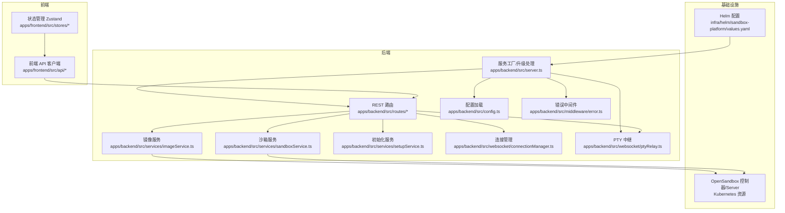
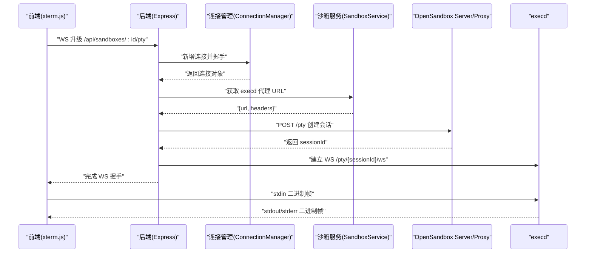
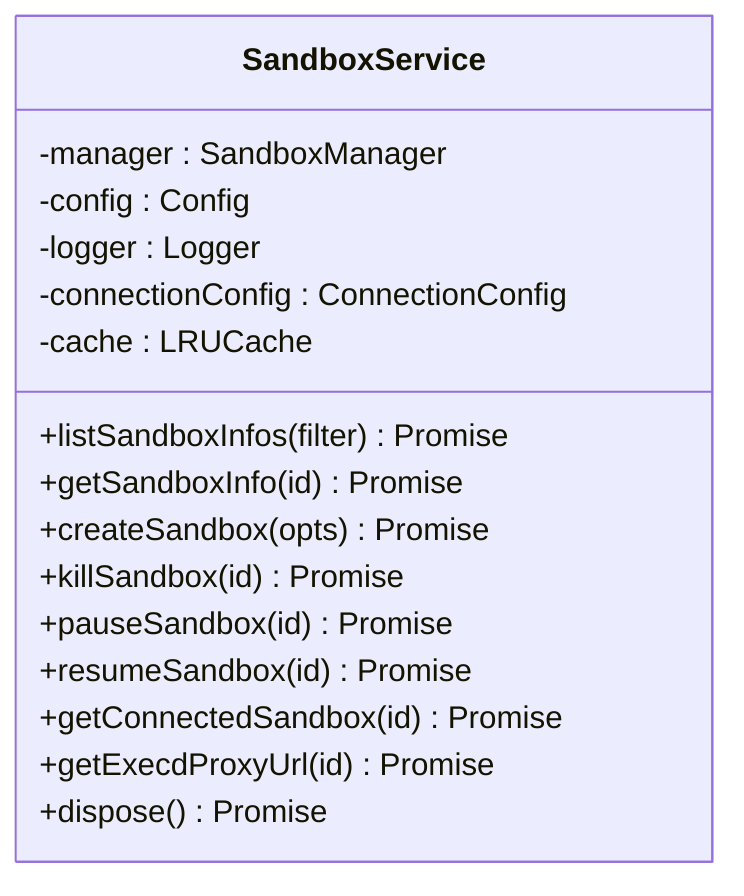
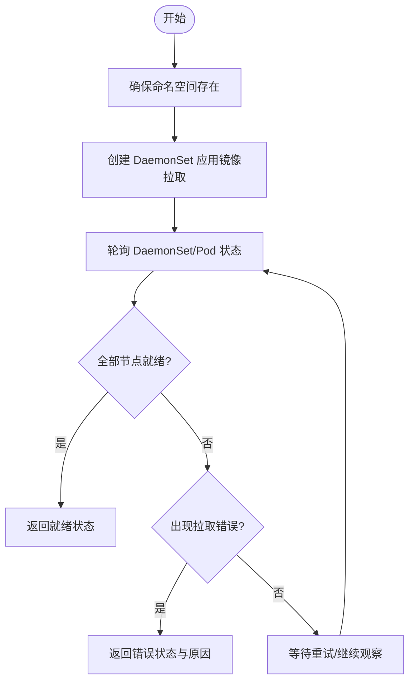
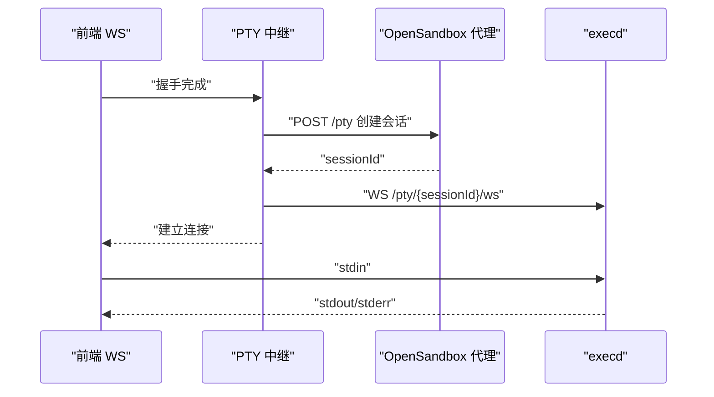
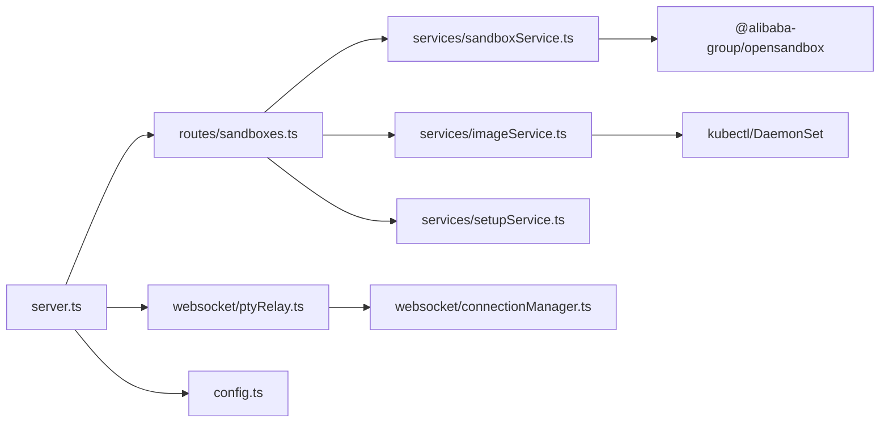

# 多用户资源管理

<cite>
**本文引用的文件**
- [apps/backend/src/services/sandboxService.ts](file://apps/backend/src/services/sandboxService.ts)
- [apps/backend/src/services/setupService.ts](file://apps/backend/src/services/setupService.ts)
- [apps/backend/src/routes/sandboxes.ts](file://apps/backend/src/routes/sandboxes.ts)
- [apps/backend/src/config.ts](file://apps/backend/src/config.ts)
- [apps/backend/src/types/index.ts](file://apps/backend/src/types/index.ts)
- [apps/backend/src/services/imageService.ts](file://apps/backend/src/services/imageService.ts)
- [apps/backend/src/websocket/connectionManager.ts](file://apps/backend/src/websocket/connectionManager.ts)
- [apps/backend/src/websocket/ptyRelay.ts](file://apps/backend/src/websocket/ptyRelay.ts)
- [apps/backend/src/middleware/error.ts](file://apps/backend/src/middleware/error.ts)
- [apps/backend/src/server.ts](file://apps/backend/src/server.ts)
- [apps/frontend/src/stores/sandboxStore.ts](file://apps/frontend/src/stores/sandboxStore.ts)
- [apps/frontend/src/api/sandboxes.ts](file://apps/frontend/src/api/sandboxes.ts)
- [infra/helm/sandbox-platform/values.yaml](file://infra/helm/sandbox-platform/values.yaml)
- [README.md](file://README.md)
</cite>

## 目录
1. [引言](#引言)
2. [项目结构](#项目结构)
3. [核心组件](#核心组件)
4. [架构总览](#架构总览)
5. [详细组件分析](#详细组件分析)
6. [依赖关系分析](#依赖关系分析)
7. [性能考量](#性能考量)
8. [故障排除指南](#故障排除指南)
9. [结论](#结论)
10. [附录](#附录)

## 引言
本文件面向多用户资源管理场景，围绕基于 OpenSandbox 的 Kubernetes 沙箱平台，系统性阐述多用户环境下的资源分配、隔离与管理机制，覆盖资源配额与 CPU/内存限制、存储空间管理、网络策略、用户权限与访问控制、安全隔离、资源使用监控与统计、成本分析、多租户设计与实现（命名空间隔离、网络策略、元数据管理）、配置项与调优参数（缓存策略、连接池与负载均衡），以及多用户场景的最佳实践与故障排除建议。

## 项目结构
后端采用 Express + WebSocket（ws）+ OpenSandbox SDK 的技术栈；前端使用 React 19 + TypeScript + Zustand + xterm.js；运行时依赖 Kubernetes 与 OpenSandbox Controller。平台通过 Helm Chart 提供生产级部署能力。

图表来源
- [apps/backend/src/server.ts:36-90](file://apps/backend/src/server.ts#L36-L90)
- [apps/backend/src/routes/sandboxes.ts:1-175](file://apps/backend/src/routes/sandboxes.ts#L1-L175)
- [apps/backend/src/services/sandboxService.ts:11-47](file://apps/backend/src/services/sandboxService.ts#L11-L47)
- [apps/backend/src/services/imageService.ts:95-100](file://apps/backend/src/services/imageService.ts#L95-L100)
- [apps/backend/src/websocket/ptyRelay.ts:22-38](file://apps/backend/src/websocket/ptyRelay.ts#L22-L38)
- [apps/backend/src/websocket/connectionManager.ts:7-16](file://apps/backend/src/websocket/connectionManager.ts#L7-L16)
- [apps/backend/src/config.ts:48-70](file://apps/backend/src/config.ts#L48-L70)
- [apps/backend/src/middleware/error.ts:4-31](file://apps/backend/src/middleware/error.ts#L4-L31)
- [apps/backend/src/services/setupService.ts:58-66](file://apps/backend/src/services/setupService.ts#L58-L66)
- [infra/helm/sandbox-platform/values.yaml:1-44](file://infra/helm/sandbox-platform/values.yaml#L1-L44)

章节来源
- [README.md:114-140](file://README.md#L114-L140)
- [apps/backend/src/server.ts:36-90](file://apps/backend/src/server.ts#L36-L90)

## 核心组件
- 沙箱服务（SandboxService）：封装 OpenSandbox SDK，负责沙箱生命周期管理、连接缓存、执行端点解析与 PTY 代理 URL 获取。
- 镜像服务（ImageService）：通过 Kubernetes DaemonSet 在集群节点上预拉取镜像，提供镜像状态查询与缓存列表。
- 初始化服务（SetupService）：提供本地/远程 OpenSandbox 连接测试、配置写入与更新。
- WebSocket 连接管理（ConnectionManager）：维护前端与后端之间的 PTY 连接，支持空闲检测与清理。
- PTY 中继（PtyRelay）：透明转发二进制帧，建立前端 xterm.js 与 OpenSandbox execd 的双向通道。
- REST 路由（sandboxesRouter）：统一暴露沙箱 CRUD、暂停/恢复、端点查询、子路由挂载（文件、命令）。
- 配置（Config）：从环境变量加载 OpenSandbox 连接参数、日志级别、CORS、PTY 空闲超时等。
- 错误处理（errorHandler）：将 SDK 异常映射为 HTTP 响应码，统一记录请求错误。

章节来源
- [apps/backend/src/services/sandboxService.ts:11-47](file://apps/backend/src/services/sandboxService.ts#L11-L47)
- [apps/backend/src/services/imageService.ts:95-100](file://apps/backend/src/services/imageService.ts#L95-L100)
- [apps/backend/src/services/setupService.ts:58-66](file://apps/backend/src/services/setupService.ts#L58-L66)
- [apps/backend/src/websocket/connectionManager.ts:7-16](file://apps/backend/src/websocket/connectionManager.ts#L7-L16)
- [apps/backend/src/websocket/ptyRelay.ts:22-38](file://apps/backend/src/websocket/ptyRelay.ts#L22-L38)
- [apps/backend/src/routes/sandboxes.ts:9-45](file://apps/backend/src/routes/sandboxes.ts#L9-L45)
- [apps/backend/src/config.ts:48-70](file://apps/backend/src/config.ts#L48-L70)
- [apps/backend/src/middleware/error.ts:4-31](file://apps/backend/src/middleware/error.ts#L4-L31)

## 架构总览
系统以“后端服务 + OpenSandbox 控制器/Server + Kubernetes”为核心，前端通过 REST 与 WebSocket 与后端交互。后端通过 SandboxService 与 OpenSandbox SDK 对接，实现沙箱生命周期与资源调度；通过 ImageService 与 Kubernetes 对接，实现镜像预热与缓存；通过 PTY 中继实现终端透明转发。

图表来源
- [apps/backend/src/server.ts:75-87](file://apps/backend/src/server.ts#L75-L87)
- [apps/backend/src/websocket/ptyRelay.ts:40-118](file://apps/backend/src/websocket/ptyRelay.ts#L40-L118)
- [apps/backend/src/websocket/connectionManager.ts:30-46](file://apps/backend/src/websocket/connectionManager.ts#L30-L46)
- [apps/backend/src/services/sandboxService.ts:129-138](file://apps/backend/src/services/sandboxService.ts#L129-L138)

## 详细组件分析

### 沙箱服务（SandboxService）
- 职责
  - 连接 OpenSandbox：通过 ConnectionConfig 构造连接参数，创建 SandboxManager。
  - 生命周期管理：创建、查询、删除、暂停、恢复沙箱。
  - 连接缓存：LRU 缓存已连接的 Sandbox 实例，提升频繁操作性能。
  - 端点解析：根据端口获取 execd 代理 URL 与头部信息，供 PTY 中继使用。
- 关键点
  - 资源与网络策略：支持在创建时传入资源限制与网络策略，交由 OpenSandbox 控制器落地。
  - 缓存 TTL 与驱逐：10 分钟未使用自动关闭并释放资源。
  - 与 SDK 的解耦：通过 Manager 与 Sandbox 类型抽象，便于替换底层实现。

图表来源
- [apps/backend/src/services/sandboxService.ts:11-47](file://apps/backend/src/services/sandboxService.ts#L11-L47)
- [apps/backend/src/services/sandboxService.ts:62-88](file://apps/backend/src/services/sandboxService.ts#L62-L88)
- [apps/backend/src/services/sandboxService.ts:112-138](file://apps/backend/src/services/sandboxService.ts#L112-L138)

章节来源
- [apps/backend/src/services/sandboxService.ts:11-47](file://apps/backend/src/services/sandboxService.ts#L11-L47)
- [apps/backend/src/types/index.ts:13-24](file://apps/backend/src/types/index.ts#L13-L24)

### 镜像服务（ImageService）
- 职责
  - 确保命名空间存在，用于托管镜像预拉取任务。
  - 通过 DaemonSet 在所有节点上拉取指定镜像，实现“预热”与就近缓存。
  - 解析 DaemonSet 状态，结合 Pod 容器状态推断镜像拉取进度与错误。
  - 支持查询节点镜像缓存列表，辅助容量规划。
- 多租户与命名空间
  - 使用独立命名空间隔离镜像预拉取任务，避免与业务命名空间冲突。
  - 通过标签与注解记录原始镜像名与来源，便于审计与追踪。

图表来源
- [apps/backend/src/services/imageService.ts:105-116](file://apps/backend/src/services/imageService.ts#L105-L116)
- [apps/backend/src/services/imageService.ts:227-294](file://apps/backend/src/services/imageService.ts#L227-L294)
- [apps/backend/src/services/imageService.ts:344-384](file://apps/backend/src/services/imageService.ts#L344-L384)

章节来源
- [apps/backend/src/services/imageService.ts:95-100](file://apps/backend/src/services/imageService.ts#L95-L100)
- [apps/backend/src/services/imageService.ts:196-222](file://apps/backend/src/services/imageService.ts#L196-L222)
- [apps/backend/src/services/imageService.ts:299-317](file://apps/backend/src/services/imageService.ts#L299-L317)

### 初始化服务（SetupService）
- 职责
  - 连通性测试：构造 ConnectionConfig 并尝试列举沙箱，验证远端 OpenSandbox 可达性。
  - 配置持久化：将远端/本地配置写入后端 .env 文件，并同步更新进程环境变量。
  - 状态判断：根据配置中的 serverUrl 推断本地/远程模式。
- 与部署的关系
  - Helm values 中提供默认的 OpenSandbox Server 地址与 API Key，便于生产部署快速启动。

章节来源
- [apps/backend/src/services/setupService.ts:58-66](file://apps/backend/src/services/setupService.ts#L58-L66)
- [apps/backend/src/services/setupService.ts:85-103](file://apps/backend/src/services/setupService.ts#L85-L103)
- [apps/backend/src/services/setupService.ts:108-123](file://apps/backend/src/services/setupService.ts#L108-L123)
- [apps/backend/src/services/setupService.ts:128-145](file://apps/backend/src/services/setupService.ts#L128-L145)
- [infra/helm/sandbox-platform/values.yaml:39-43](file://infra/helm/sandbox-platform/values.yaml#L39-L43)

### WebSocket 连接管理（ConnectionManager）
- 职责
  - 维护前端 WebSocket 与后端会话的映射关系，记录连接 ID、沙箱 ID、创建时间与最后活跃时间。
  - 空闲检测：周期扫描，超过阈值自动关闭并清理资源。
  - 清理策略：关闭前后端 WS，移除映射，停止定时器（无活动连接时）。
- 与 PTY 中继协作
  - PTY 中继在握手成功后将前端 WS 注册到连接管理器，以便中继转发与空闲回收。

章节来源
- [apps/backend/src/websocket/connectionManager.ts:7-16](file://apps/backend/src/websocket/connectionManager.ts#L7-L16)
- [apps/backend/src/websocket/connectionManager.ts:92-100](file://apps/backend/src/websocket/connectionManager.ts#L92-L100)

### PTY 中继（PtyRelay）
- 职责
  - 完成前端 WS 握手，解析 execd 代理 URL 与头部。
  - 通过 HTTP 创建 PTY 会话，随后建立后端到 execd 的 WebSocket。
  - 透明转发二进制帧（stdin/stdout/stderr）与 JSON 控制帧（resize/exit），并更新连接活跃度。
- 数据路径
  - xterm.js ↔ 前端 WS ↔ 后端中继 ↔ execd 代理 ↔ execd

图表来源
- [apps/backend/src/websocket/ptyRelay.ts:40-118](file://apps/backend/src/websocket/ptyRelay.ts#L40-L118)
- [apps/backend/src/websocket/ptyRelay.ts:120-169](file://apps/backend/src/websocket/ptyRelay.ts#L120-L169)

章节来源
- [apps/backend/src/websocket/ptyRelay.ts:22-38](file://apps/backend/src/websocket/ptyRelay.ts#L22-L38)
- [apps/backend/src/websocket/ptyRelay.ts:78-93](file://apps/backend/src/websocket/ptyRelay.ts#L78-L93)

### REST 路由（sandboxesRouter）
- 职责
  - 提供沙箱列表、创建、查询、删除、暂停/恢复、端点查询等接口。
  - 子路由挂载：文件与命令子路由，统一由路由层注入沙箱 ID。
  - 安全守卫：当 OpenSandbox 未配置时拒绝请求并返回明确错误。
- 前端对接
  - 前端通过 API 客户端发起请求，Zustand 状态管理负责刷新与展示。

章节来源
- [apps/backend/src/routes/sandboxes.ts:9-45](file://apps/backend/src/routes/sandboxes.ts#L9-L45)
- [apps/backend/src/routes/sandboxes.ts:61-93](file://apps/backend/src/routes/sandboxes.ts#L61-L93)
- [apps/backend/src/routes/sandboxes.ts:95-105](file://apps/backend/src/routes/sandboxes.ts#L95-L105)
- [apps/frontend/src/api/sandboxes.ts:1-40](file://apps/frontend/src/api/sandboxes.ts#L1-L40)
- [apps/frontend/src/stores/sandboxStore.ts:16-31](file://apps/frontend/src/stores/sandboxStore.ts#L16-L31)

### 配置（Config）
- 职责
  - 从环境变量加载 OpenSandbox 连接参数（URL、API Key、协议、是否使用服务端代理、请求超时）。
  - 加载 CORS、日志级别、PTY 空闲超时等运行时参数。
- 生产部署
  - Helm values 提供默认配置，便于在集群内稳定部署。

章节来源
- [apps/backend/src/config.ts:48-70](file://apps/backend/src/config.ts#L48-L70)
- [infra/helm/sandbox-platform/values.yaml:39-43](file://infra/helm/sandbox-platform/values.yaml#L39-L43)

### 错误处理（errorHandler）
- 职责
  - 将 SDK 异常映射为 HTTP 状态码（如 400、502、504），统一记录请求上下文与请求 ID。
  - 保证前端可感知的错误语义与可观测性。

章节来源
- [apps/backend/src/middleware/error.ts:4-31](file://apps/backend/src/middleware/error.ts#L4-L31)

## 依赖关系分析
- 组件耦合
  - server.ts 作为装配中心，负责实例化各服务并将它们注入 app.locals，供路由与 WS 升级使用。
  - sandboxService 与 OpenSandbox SDK 强耦合，但通过类型与方法抽象降低替换成本。
  - imageService 与 Kubernetes CLI 交互，需确保后端容器具备 kubectl 权限与上下文。
- 外部依赖
  - OpenSandbox Server/Proxy：提供沙箱生命周期与 execd 代理。
  - Kubernetes：DaemonSet、命名空间、节点镜像缓存等。
- 循环依赖
  - 未发现直接循环依赖；路由与服务通过 app.locals 解耦。

图表来源
- [apps/backend/src/server.ts:36-90](file://apps/backend/src/server.ts#L36-L90)
- [apps/backend/src/routes/sandboxes.ts:1-10](file://apps/backend/src/routes/sandboxes.ts#L1-L10)
- [apps/backend/src/websocket/ptyRelay.ts:22-38](file://apps/backend/src/websocket/ptyRelay.ts#L22-L38)
- [apps/backend/src/websocket/connectionManager.ts:7-16](file://apps/backend/src/websocket/connectionManager.ts#L7-L16)
- [apps/backend/src/services/sandboxService.ts:1-10](file://apps/backend/src/services/sandboxService.ts#L1-L10)
- [apps/backend/src/services/imageService.ts:1-3](file://apps/backend/src/services/imageService.ts#L1-L3)

章节来源
- [apps/backend/src/server.ts:36-90](file://apps/backend/src/server.ts#L36-L90)

## 性能考量
- 连接缓存与 LRU
  - SandboxService 使用 LRU 缓存最近使用的沙箱连接，默认容量与 TTL 已内置，减少重复连接开销。
- PTY 空闲回收
  - ConnectionManager 的空闲检测周期为 60 秒，空闲超时由环境变量控制，避免僵尸连接占用资源。
- 资源预热与就近缓存
  - ImageService 通过 DaemonSet 在节点侧预拉取镜像，显著降低首次启动延迟与网络带宽消耗。
- 负载均衡与伸缩
  - 后端与前端均提供 Helm values 中的资源请求，配合 Kubernetes HPA/扩缩容策略实现弹性。
- 网络策略
  - 支持在创建沙箱时设置网络策略（默认动作与出站规则），结合 Kubernetes NetworkPolicy 实现细粒度隔离。

章节来源
- [apps/backend/src/services/sandboxService.ts:35-44](file://apps/backend/src/services/sandboxService.ts#L35-L44)
- [apps/backend/src/websocket/connectionManager.ts:18-28](file://apps/backend/src/websocket/connectionManager.ts#L18-L28)
- [apps/backend/src/config.ts:68-68](file://apps/backend/src/config.ts#L68-L68)
- [apps/backend/src/services/imageService.ts:227-294](file://apps/backend/src/services/imageService.ts#L227-L294)
- [apps/backend/src/types/index.ts:20-23](file://apps/backend/src/types/index.ts#L20-L23)
- [infra/helm/sandbox-platform/values.yaml:10-25](file://infra/helm/sandbox-platform/values.yaml#L10-L25)

## 故障排除指南
- OpenSandbox 未配置
  - 现象：访问沙箱相关接口返回未配置错误。
  - 处理：通过初始化服务保存远程或本地配置，重启后端使新配置生效。
- 连接超时/握手失败
  - 现象：PTY 握手超时或 PTY 会话创建失败。
  - 处理：检查 OpenSandbox Server 地址、协议、API Key 与代理设置；确认网络连通性与防火墙策略。
- 镜像拉取失败
  - 现象：DaemonSet 不满足就绪数量或 Pod 出现镜像拉取错误。
  - 处理：查看 Pod 容器等待原因，修正镜像名称、仓库认证或网络策略。
- 资源不足
  - 现象：沙箱创建失败或节点资源紧张。
  - 处理：调整资源请求/限制、扩容节点或优化镜像大小与预热策略。
- 日志与追踪
  - 使用请求 ID（中间件自动生成）在后端日志中定位问题；错误中间件统一输出状态码与消息。

章节来源
- [apps/backend/src/routes/sandboxes.ts:34-45](file://apps/backend/src/routes/sandboxes.ts#L34-L45)
- [apps/backend/src/services/setupService.ts:85-103](file://apps/backend/src/services/setupService.ts#L85-L103)
- [apps/backend/src/websocket/ptyRelay.ts:64-66](file://apps/backend/src/websocket/ptyRelay.ts#L64-L66)
- [apps/backend/src/services/imageService.ts:122-191](file://apps/backend/src/services/imageService.ts#L122-L191)
- [apps/backend/src/middleware/error.ts:18-30](file://apps/backend/src/middleware/error.ts#L18-L30)

## 结论
本平台通过“后端服务 + OpenSandbox + Kubernetes”的组合，在多用户场景下实现了资源隔离、生命周期管理、网络策略与镜像预热等关键能力。通过 LRU 缓存、空闲回收、DaemonSet 预热与 Helm 资源请求，兼顾了性能与稳定性。建议在生产环境中结合 Kubernetes NetworkPolicy、资源配额与 HPA，持续优化成本与体验。

## 附录

### 多租户设计与实现要点
- 命名空间隔离
  - 镜像预拉取使用独立命名空间，避免与业务命名空间冲突。
- 网络策略
  - 在创建沙箱时传入网络策略，结合 Kubernetes NetworkPolicy 实施默认拒绝/允许与出站规则。
- 元数据管理
  - 通过 metadata 字段传递租户/项目标识，便于审计与计费。

章节来源
- [apps/backend/src/services/imageService.ts:105-116](file://apps/backend/src/services/imageService.ts#L105-L116)
- [apps/backend/src/types/index.ts:18-23](file://apps/backend/src/types/index.ts#L18-L23)

### 资源配额与限制
- CPU/内存限制
  - 在创建沙箱时通过 resource 参数传入 CPU 与内存限制，交由 OpenSandbox 控制器落地。
- 存储空间管理
  - 通过文件系统 API 与镜像预热策略间接影响存储占用；建议结合 PVC/StorageClass 与 CSI 策略进行扩展。

章节来源
- [apps/backend/src/types/index.ts:19-19](file://apps/backend/src/types/index.ts#L19-L19)
- [apps/backend/src/services/sandboxService.ts:62-88](file://apps/backend/src/services/sandboxService.ts#L62-L88)

### 用户权限与访问控制
- API Key 保护
  - 通过 OpenSandbox API Key 与后端配置进行鉴权。
- CORS 与前端代理
  - 后端启用 CORS，前端通过代理访问后端 API，避免跨域问题。

章节来源
- [apps/backend/src/config.ts:64-64](file://apps/backend/src/config.ts#L64-L64)
- [apps/backend/src/services/setupService.ts:111-121](file://apps/backend/src/services/setupService.ts#L111-L121)

### 监控、统计与成本分析
- 资源使用监控
  - 通过 Kubernetes 节点与 DaemonSet 状态观测镜像缓存与节点压力。
- 统计报告
  - 前端沙箱列表展示状态、到期时间等信息，辅助运营统计。
- 成本分析
  - 建议结合 DaemonSet 数量、节点规模与镜像体积估算存储与网络成本。

章节来源
- [apps/backend/src/services/imageService.ts:196-222](file://apps/backend/src/services/imageService.ts#L196-L222)
- [apps/frontend/src/stores/sandboxStore.ts:16-31](file://apps/frontend/src/stores/sandboxStore.ts#L16-L31)

### 配置选项与调优参数
- OpenSandbox 连接
  - OPENSANDBOX_SERVER_URL、OPENSANDBOX_API_KEY、OPENSANDBOX_PROTOCOL、OPENSANDBOX_USE_SERVER_PROXY、OPENSANDBOX_REQUEST_TIMEOUT_SECONDS
- 运行时
  - PORT、CORS_ORIGIN、LOG_LEVEL、PTY_IDLE_TIMEOUT_MS
- Helm 部署
  - 后端/前端镜像、Service 端口、Ingress 主机、Secrets、OpenSandbox Server 地址与 API Key

章节来源
- [apps/backend/src/config.ts:48-70](file://apps/backend/src/config.ts#L48-L70)
- [README.md:177-187](file://README.md#L177-L187)
- [infra/helm/sandbox-platform/values.yaml:1-44](file://infra/helm/sandbox-platform/values.yaml#L1-L44)

### 最佳实践
- 资源规划
  - 为后端与前端设置合理的 CPU/内存请求，结合 HPA 实现弹性。
- 网络安全
  - 为 OpenSandbox Server 配置 TLS 与最小权限 API Key；在集群内启用 NetworkPolicy。
- 镜像与存储
  - 使用 DaemonSet 预热常用镜像；定期清理不再使用的镜像 DaemonSet。
- 连接与会话
  - 合理设置 PTY 空闲超时，避免长时间闲置连接占用资源。

章节来源
- [apps/backend/src/config.ts:68-68](file://apps/backend/src/config.ts#L68-L68)
- [apps/backend/src/services/imageService.ts:227-294](file://apps/backend/src/services/imageService.ts#L227-L294)
- [apps/backend/src/websocket/connectionManager.ts:18-28](file://apps/backend/src/websocket/connectionManager.ts#L18-L28)