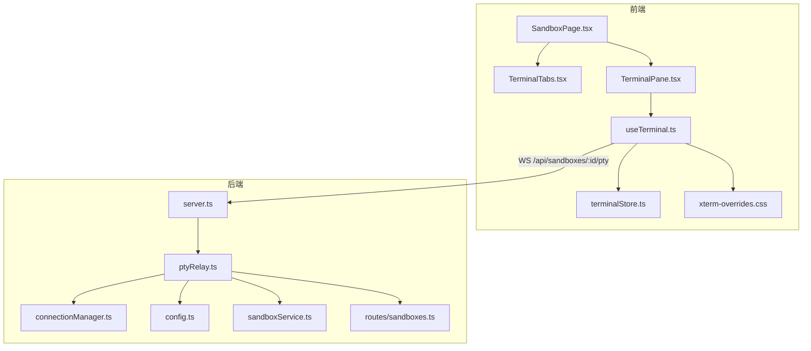
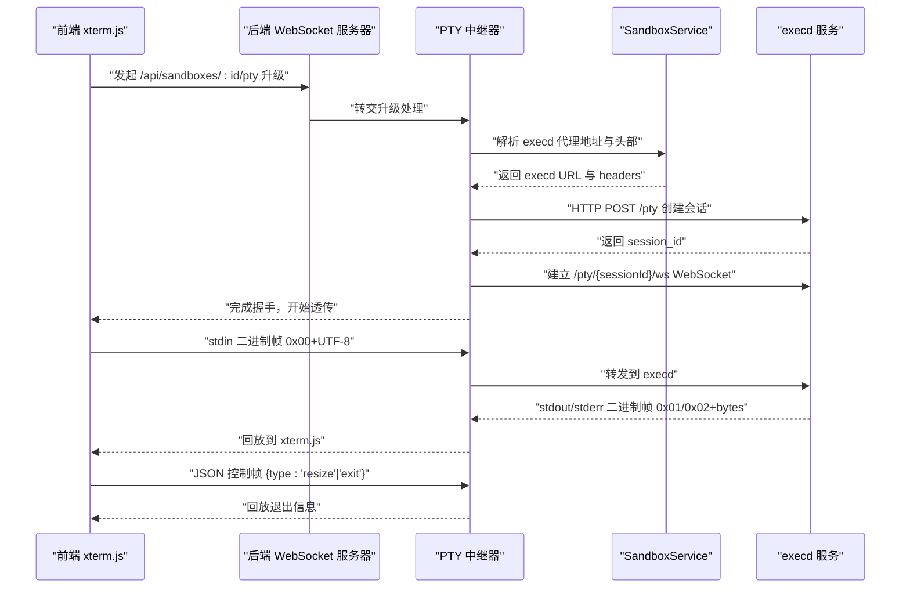
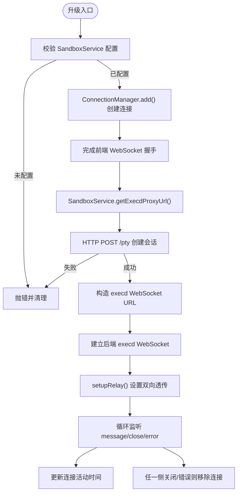
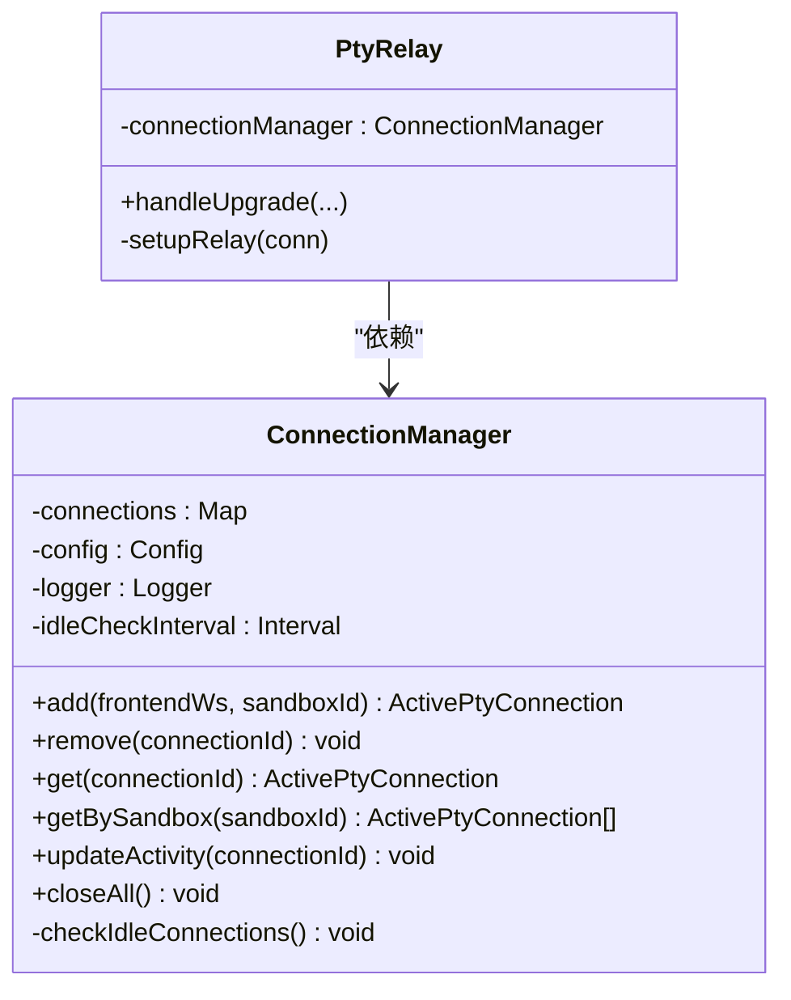
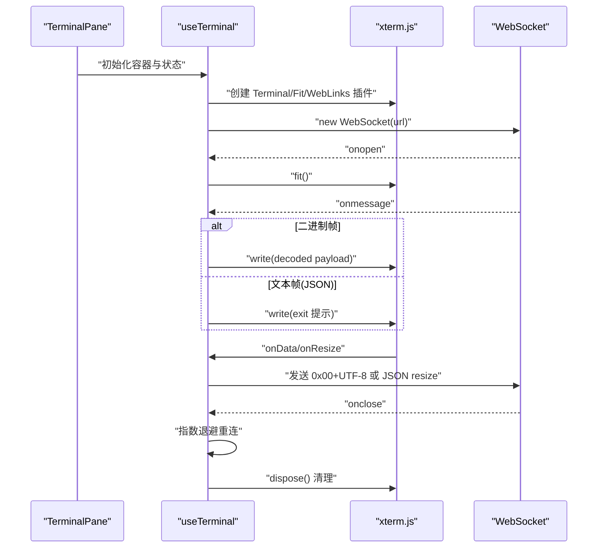
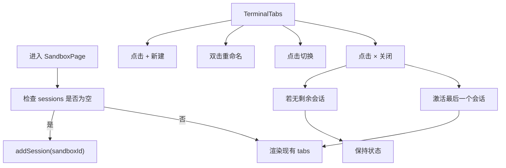
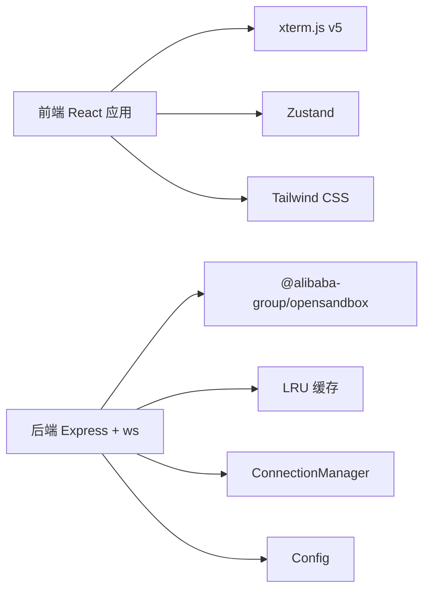

# 实时终端访问

<cite>
**本文引用的文件**
- [apps/backend/src/websocket/ptyRelay.ts](file://apps/backend/src/websocket/ptyRelay.ts)
- [apps/backend/src/websocket/connectionManager.ts](file://apps/backend/src/websocket/connectionManager.ts)
- [apps/backend/src/websocket/types.ts](file://apps/backend/src/websocket/types.ts)
- [apps/backend/src/server.ts](file://apps/backend/src/server.ts)
- [apps/backend/src/config.ts](file://apps/backend/src/config.ts)
- [apps/backend/src/services/sandboxService.ts](file://apps/backend/src/services/sandboxService.ts)
- [apps/backend/src/routes/sandboxes.ts](file://apps/backend/src/routes/sandboxes.ts)
- [apps/frontend/src/hooks/useTerminal.ts](file://apps/frontend/src/hooks/useTerminal.ts)
- [apps/frontend/src/components/terminal/TerminalPane.tsx](file://apps/frontend/src/components/terminal/TerminalPane.tsx)
- [apps/frontend/src/components/terminal/TerminalTabs.tsx](file://apps/frontend/src/components/terminal/TerminalTabs.tsx)
- [apps/frontend/src/stores/terminalStore.ts](file://apps/frontend/src/stores/terminalStore.ts)
- [apps/frontend/src/pages/SandboxPage.tsx](file://apps/frontend/src/pages/SandboxPage.tsx)
- [apps/frontend/src/styles/xterm-overrides.css](file://apps/frontend/src/styles/xterm-overrides.css)
- [README.md](file://README.md)
</cite>

## 目录
1. [简介](#简介)
2. [项目结构](#项目结构)
3. [核心组件](#核心组件)
4. [架构总览](#架构总览)
5. [详细组件分析](#详细组件分析)
6. [依赖关系分析](#依赖关系分析)
7. [性能考量](#性能考量)
8. [故障排除指南](#故障排除指南)
9. [结论](#结论)
10. [附录](#附录)

## 简介
本文件围绕“实时终端访问”能力进行系统化技术文档编写，重点覆盖：
- 基于 WebSocket 的二进制帧透传机制
- PTY（伪终端仿真）中继的工作原理与实现细节
- 多标签页终端支持、会话生命周期管理、自动重连与会话超时处理
- 前端 xterm.js v5 集成、终端渲染优化与用户体验设计
- WebSocket 连接建立、数据帧格式、错误处理与异常恢复策略
- 会话管理最佳实践：会话持久化、并发控制与资源清理
- 实际使用示例与故障排除指南

## 项目结构
本项目采用前后端分离的 Monorepo 结构，终端访问功能横跨前端 React 应用与后端 Express + ws 服务：
- 前端：React + xterm.js v5 + Zustand 状态管理，负责终端渲染、用户交互与自动重连
- 后端：Express + ws + OpenSandbox SDK，负责 PTY 会话创建、WebSocket 中继与空闲回收

图表来源
- [apps/frontend/src/pages/SandboxPage.tsx:1-165](file://apps/frontend/src/pages/SandboxPage.tsx#L1-L165)
- [apps/frontend/src/components/terminal/TerminalTabs.tsx:1-57](file://apps/frontend/src/components/terminal/TerminalTabs.tsx#L1-L57)
- [apps/frontend/src/components/terminal/TerminalPane.tsx:1-38](file://apps/frontend/src/components/terminal/TerminalPane.tsx#L1-L38)
- [apps/frontend/src/hooks/useTerminal.ts:1-180](file://apps/frontend/src/hooks/useTerminal.ts#L1-L180)
- [apps/frontend/src/stores/terminalStore.ts:1-68](file://apps/frontend/src/stores/terminalStore.ts#L1-L68)
- [apps/frontend/src/styles/xterm-overrides.css:1-14](file://apps/frontend/src/styles/xterm-overrides.css#L1-L14)
- [apps/backend/src/server.ts:1-119](file://apps/backend/src/server.ts#L1-L119)
- [apps/backend/src/websocket/ptyRelay.ts:1-171](file://apps/backend/src/websocket/ptyRelay.ts#L1-L171)
- [apps/backend/src/websocket/connectionManager.ts:1-102](file://apps/backend/src/websocket/connectionManager.ts#L1-L102)
- [apps/backend/src/config.ts:1-71](file://apps/backend/src/config.ts#L1-L71)
- [apps/backend/src/services/sandboxService.ts:1-148](file://apps/backend/src/services/sandboxService.ts#L1-L148)
- [apps/backend/src/routes/sandboxes.ts:1-175](file://apps/backend/src/routes/sandboxes.ts#L1-L175)

章节来源
- [README.md:1-188](file://README.md#L1-L188)

## 核心组件
- 后端 PTY 中继器：负责 WebSocket 握手、会话创建、双向二进制帧透传与事件处理
- 连接管理器：维护前端 WebSocket 与后端 execd WebSocket 的映射，记录活动时间并执行空闲回收
- 配置模块：集中管理 OpenSandbox 连接参数、日志级别与 PTY 空闲超时等
- 前端 useTerminal Hook：封装 xterm.js 实例、二进制帧编码/解码、自动重连与窗口自适应
- 终端标签页与状态：Zustand 管理多会话标签页，支持新建、重命名、切换与关闭

章节来源
- [apps/backend/src/websocket/ptyRelay.ts:1-171](file://apps/backend/src/websocket/ptyRelay.ts#L1-L171)
- [apps/backend/src/websocket/connectionManager.ts:1-102](file://apps/backend/src/websocket/connectionManager.ts#L1-L102)
- [apps/backend/src/websocket/types.ts:1-20](file://apps/backend/src/websocket/types.ts#L1-L20)
- [apps/backend/src/config.ts:1-71](file://apps/backend/src/config.ts#L1-L71)
- [apps/frontend/src/hooks/useTerminal.ts:1-180](file://apps/frontend/src/hooks/useTerminal.ts#L1-L180)
- [apps/frontend/src/stores/terminalStore.ts:1-68](file://apps/frontend/src/stores/terminalStore.ts#L1-L68)

## 架构总览
实时终端访问的数据通路如下：
- 前端 xterm.js 通过 WebSocket 与后端建立连接
- 后端完成握手后，向 OpenSandbox execd 服务请求创建 PTY 会话
- 后端再与 execd 的 PTY WebSocket 建立连接，形成“前端↔后端↔execd”的三段式链路
- 后端以透明中继方式转发二进制帧与 JSON 控制帧，实现低延迟的实时交互

图表来源
- [apps/backend/src/websocket/ptyRelay.ts:40-118](file://apps/backend/src/websocket/ptyRelay.ts#L40-L118)
- [apps/backend/src/services/sandboxService.ts:129-138](file://apps/backend/src/services/sandboxService.ts#L129-L138)
- [apps/backend/src/server.ts:75-87](file://apps/backend/src/server.ts#L75-L87)

## 详细组件分析

### 后端 PTY 中继器（PtyRelay）
- 功能职责
  - 处理 HTTP 升级，完成前端 WebSocket 握手
  - 通过 SandboxService 解析 execd 代理地址与认证头
  - 发起 HTTP 请求创建 PTY 会话，获取 session_id
  - 建立后端 execd WebSocket，设置双向消息转发
  - 监听关闭与错误事件，触发清理流程
- 数据帧格式
  - 二进制帧：0x00 表示 stdin（客户端→execd），0x01 表示 stdout（execd→客户端），0x02 表示 stderr（execd→客户端）
  - 文本帧：JSON 控制帧，如 {type:"resize", cols, rows} 与 {type:"exit", code}
- 关键流程
  - 握手超时保护（10 秒）
  - 会话创建失败时记录错误并清理
  - 双向透传时更新连接活动时间，用于空闲回收

图表来源
- [apps/backend/src/websocket/ptyRelay.ts:40-169](file://apps/backend/src/websocket/ptyRelay.ts#L40-L169)
- [apps/backend/src/websocket/connectionManager.ts:30-83](file://apps/backend/src/websocket/connectionManager.ts#L30-L83)
- [apps/backend/src/services/sandboxService.ts:129-138](file://apps/backend/src/services/sandboxService.ts#L129-L138)

章节来源
- [apps/backend/src/websocket/ptyRelay.ts:1-171](file://apps/backend/src/websocket/ptyRelay.ts#L1-L171)
- [apps/backend/src/websocket/types.ts:4-9](file://apps/backend/src/websocket/types.ts#L4-L9)

### 连接管理器（ConnectionManager）
- 负责
  - 存储前端 WebSocket 与后端 execd WebSocket 的映射
  - 记录连接创建时间与最后活动时间
  - 提供按 sandboxId 查询、更新活动时间、批量清理与空闲检测
- 空闲回收
  - 启动定时器每 60 秒扫描一次
  - 当 lastActivityAt 与当前时间差超过 ptyIdleTimeoutMs，则主动关闭并移除连接
  - 当连接数归零时停止定时器，避免资源浪费

图表来源
- [apps/backend/src/websocket/connectionManager.ts:1-102](file://apps/backend/src/websocket/connectionManager.ts#L1-L102)
- [apps/backend/src/websocket/ptyRelay.ts:22-38](file://apps/backend/src/websocket/ptyRelay.ts#L22-L38)

章节来源
- [apps/backend/src/websocket/connectionManager.ts:1-102](file://apps/backend/src/websocket/connectionManager.ts#L1-L102)
- [apps/backend/src/config.ts:21-23](file://apps/backend/src/config.ts#L21-L23)

### 前端 useTerminal Hook（xterm.js v5 集成）
- 终端实例与插件
  - 使用 @xterm/xterm、@xterm/addon-fit、@xterm/addon-web-links
  - 主题与字体配置，滚动回溯、光标闪烁、链接识别
- 连接与自动重连
  - 基于 window.location 协议选择 ws/wss
  - 连接成功后执行 FitAddon.fit()，确保终端尺寸正确
  - 断线指数退避 + 随机抖动，最大不超过 30 秒
- 帧格式处理
  - 接收二进制帧：0x00 丢弃；0x01/0x02 写入终端
  - 接收文本帧：解析 JSON 控制帧，exit 时提示并断开连接
  - 发送数据帧：0x00 + UTF-8 字节写入后端
  - 发送尺寸帧：JSON {type:"resize", cols, rows}
- 资源清理
  - 组件卸载时关闭 WebSocket、取消定时器、释放 ResizeObserver、销毁终端与插件

图表来源
- [apps/frontend/src/hooks/useTerminal.ts:25-176](file://apps/frontend/src/hooks/useTerminal.ts#L25-L176)
- [apps/frontend/src/components/terminal/TerminalPane.tsx:8-37](file://apps/frontend/src/components/terminal/TerminalPane.tsx#L8-L37)

章节来源
- [apps/frontend/src/hooks/useTerminal.ts:1-180](file://apps/frontend/src/hooks/useTerminal.ts#L1-L180)
- [apps/frontend/src/components/terminal/TerminalPane.tsx:1-38](file://apps/frontend/src/components/terminal/TerminalPane.tsx#L1-L38)
- [apps/frontend/src/styles/xterm-overrides.css:1-14](file://apps/frontend/src/styles/xterm-overrides.css#L1-L14)

### 多标签页终端支持与会话生命周期
- 终端标签页组件
  - 支持新建、重命名（双击）、切换与关闭
  - 关闭最后一个标签页后自动激活剩余会话
- 终端会话状态
  - Zustand 管理 sessions 数组，包含 id、sandboxId、title、active
  - 新建会话时生成唯一 id，标题默认为 “Terminal N”
- 页面布局
  - SandboxPage 在进入沙箱详情时自动创建首个会话
  - 左侧文件树与右侧终端区域，支持拖拽调整宽度

图表来源
- [apps/frontend/src/pages/SandboxPage.tsx:27-32](file://apps/frontend/src/pages/SandboxPage.tsx#L27-L32)
- [apps/frontend/src/components/terminal/TerminalTabs.tsx:7-56](file://apps/frontend/src/components/terminal/TerminalTabs.tsx#L7-L56)
- [apps/frontend/src/stores/terminalStore.ts:20-67](file://apps/frontend/src/stores/terminalStore.ts#L20-L67)

章节来源
- [apps/frontend/src/pages/SandboxPage.tsx:1-165](file://apps/frontend/src/pages/SandboxPage.tsx#L1-L165)
- [apps/frontend/src/components/terminal/TerminalTabs.tsx:1-57](file://apps/frontend/src/components/terminal/TerminalTabs.tsx#L1-L57)
- [apps/frontend/src/stores/terminalStore.ts:1-68](file://apps/frontend/src/stores/terminalStore.ts#L1-L68)

### 会话生命周期管理与自动重连机制
- 生命周期
  - 前端：useTerminal 在 mount 时创建 Terminal 与 WebSocket，卸载时统一清理
  - 后端：ConnectionManager 在连接建立时记录，空闲超时或异常关闭时移除
- 自动重连
  - 前端：断线后按 2^attempt × 随机抖动退避，上限 30 秒
  - 后端：无自动重连逻辑，依赖前端重连；但会通过空闲回收避免僵尸连接
- 会话超时
  - 后端空闲超时由 ptyIdleTimeoutMs 控制，默认 300000ms
  - 前端连接状态栏显示“正在重连”与“已连接”状态

章节来源
- [apps/backend/src/websocket/connectionManager.ts:92-100](file://apps/backend/src/websocket/connectionManager.ts#L92-L100)
- [apps/backend/src/config.ts:68-68](file://apps/backend/src/config.ts#L68-L68)
- [apps/frontend/src/hooks/useTerminal.ts:85-90](file://apps/frontend/src/hooks/useTerminal.ts#L85-L90)
- [apps/frontend/src/components/terminal/TerminalPane.tsx:17-33](file://apps/frontend/src/components/terminal/TerminalPane.tsx#L17-L33)

### 数据帧格式与错误处理
- 帧格式
  - 二进制帧：0x00（stdin）、0x01（stdout）、0x02（stderr）
  - 文本帧：JSON 控制帧（resize/exit）
- 错误处理
  - 前端：onerror 设置错误状态，onclose 触发重连；正常关闭（1000）不重连
  - 后端：握手超时、会话创建失败、WebSocket 错误均记录并清理连接
  - 异常恢复：前端指数退避重连；后端空闲回收释放资源

章节来源
- [apps/backend/src/websocket/ptyRelay.ts:16-21](file://apps/backend/src/websocket/ptyRelay.ts#L16-L21)
- [apps/frontend/src/hooks/useTerminal.ts:48-95](file://apps/frontend/src/hooks/useTerminal.ts#L48-L95)
- [apps/backend/src/websocket/ptyRelay.ts:110-118](file://apps/backend/src/websocket/ptyRelay.ts#L110-L118)

## 依赖关系分析
- 后端依赖
  - Express + ws：HTTP 升级与 WebSocket 服务
  - OpenSandbox SDK：沙箱连接、端点解析与 execd 代理
  - LRU 缓存：SandboxService 对已连接沙箱进行缓存与回收
- 前端依赖
  - xterm.js v5：终端渲染与插件生态
  - Zustand：轻量状态管理
  - Tailwind CSS：UI 样式与主题

图表来源
- [apps/backend/src/services/sandboxService.ts:1-148](file://apps/backend/src/services/sandboxService.ts#L1-L148)
- [apps/backend/src/config.ts:1-71](file://apps/backend/src/config.ts#L1-L71)
- [apps/frontend/src/hooks/useTerminal.ts:1-10](file://apps/frontend/src/hooks/useTerminal.ts#L1-L10)
- [apps/frontend/src/stores/terminalStore.ts:1-3](file://apps/frontend/src/stores/terminalStore.ts#L1-L3)

章节来源
- [apps/backend/src/services/sandboxService.ts:1-148](file://apps/backend/src/services/sandboxService.ts#L1-L148)
- [apps/backend/src/config.ts:1-71](file://apps/backend/src/config.ts#L1-L71)
- [README.md:9-13](file://README.md#L9-L13)

## 性能考量
- 二进制帧透传
  - 后端直接转发原始字节，避免额外编解码开销，降低延迟
- 终端渲染优化
  - FitAddon 自适应容器尺寸，ResizeObserver 监听布局变化
  - 滚动回溯与主题优化减少视觉卡顿
- 资源管理
  - 后端空闲回收与前端卸载清理，防止内存泄漏
  - LRU 缓存限制最大数量与 TTL，避免长时间占用连接

## 故障排除指南
- 无法建立 PTY 连接
  - 检查 OpenSandbox 配置是否正确（服务地址、API Key、协议）
  - 查看后端日志中的握手超时与会话创建失败信息
  - 确认 execd 代理地址与 headers 返回正常
- 终端无输出或输入无效
  - 确认前端二进制帧发送与后端透传逻辑正常
  - 检查 JSON 控制帧（resize/exit）是否被正确解析
- 自动重连频繁
  - 检查网络波动与防火墙策略
  - 调整前端退避参数与后端空闲超时配置
- 资源占用过高
  - 检查是否存在未清理的 WebSocket 连接
  - 确认 LRU 缓存与空闲回收机制正常工作

章节来源
- [apps/backend/src/websocket/ptyRelay.ts:58-66](file://apps/backend/src/websocket/ptyRelay.ts#L58-L66)
- [apps/backend/src/websocket/ptyRelay.ts:87-89](file://apps/backend/src/websocket/ptyRelay.ts#L87-L89)
- [apps/backend/src/websocket/connectionManager.ts:92-100](file://apps/backend/src/websocket/connectionManager.ts#L92-L100)
- [apps/frontend/src/hooks/useTerminal.ts:85-90](file://apps/frontend/src/hooks/useTerminal.ts#L85-L90)

## 结论
本方案通过“前端 xterm.js + 后端 ws 透明中继”的架构，实现了低延迟、高可靠的实时终端访问。配合多标签页管理、自动重连与空闲回收机制，既保证了用户体验，也兼顾了系统稳定性与资源效率。建议在生产环境中结合监控与告警，持续优化连接参数与缓存策略。

## 附录
- 使用示例
  - 在前端页面中打开沙箱详情，自动创建首个终端会话
  - 点击“+ New Terminal”或“+”按钮新建标签页
  - 输入命令并观察输出，调整窗口大小触发 resize 事件
- 最佳实践
  - 会话持久化：利用 Zustand 管理标签页状态，避免刷新丢失
  - 并发控制：限制同一 sandbox 的并发会话数量，必要时在后端增加配额
  - 资源清理：确保前端卸载与后端空闲回收协同工作
  - 错误恢复：统一错误上报与日志记录，便于定位问题