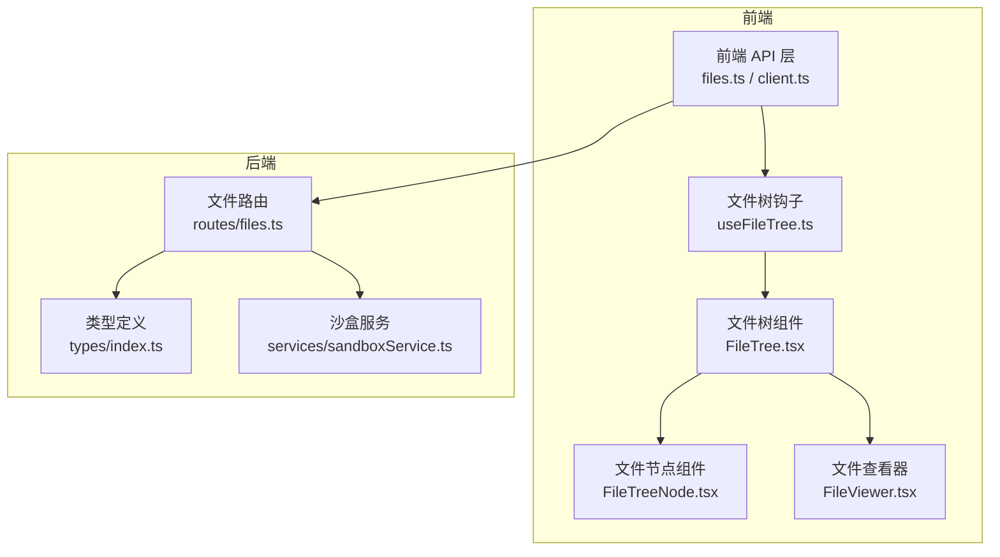
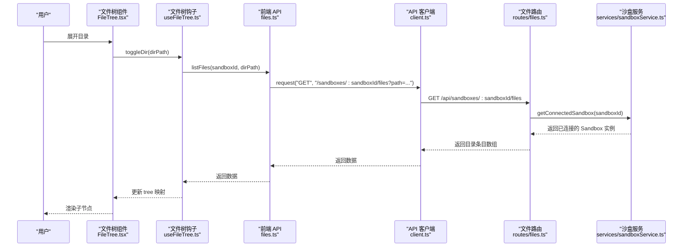
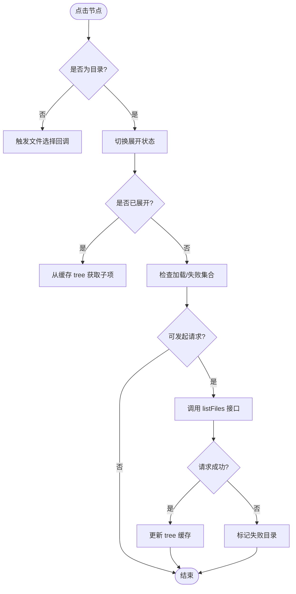
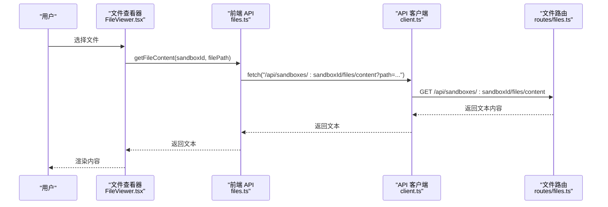
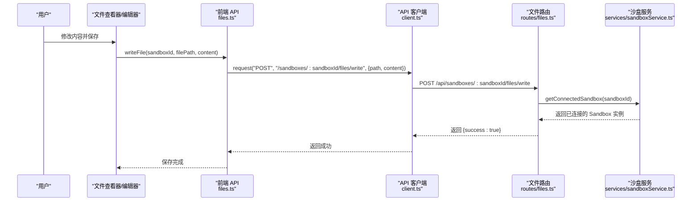
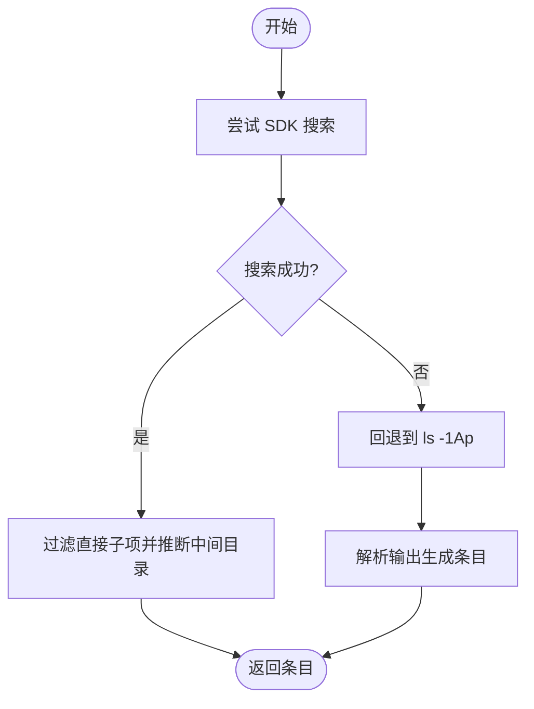
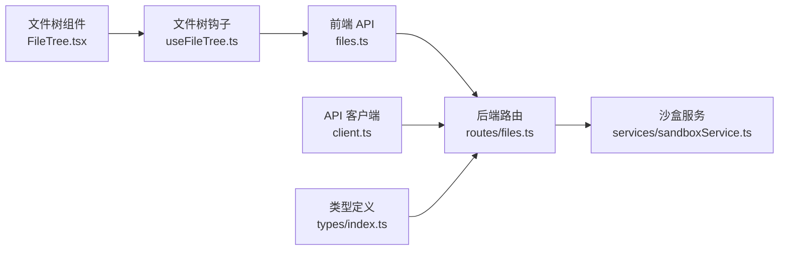

# 文件系统操作

<cite>
**本文引用的文件**
- [apps/backend/src/routes/files.ts](file://apps/backend/src/routes/files.ts)
- [apps/backend/src/types/index.ts](file://apps/backend/src/types/index.ts)
- [apps/backend/src/services/sandboxService.ts](file://apps/backend/src/services/sandboxService.ts)
- [apps/frontend/src/api/files.ts](file://apps/frontend/src/api/files.ts)
- [apps/frontend/src/api/client.ts](file://apps/frontend/src/api/client.ts)
- [apps/frontend/src/api/types.ts](file://apps/frontend/src/api/types.ts)
- [apps/frontend/src/components/files/FileTree.tsx](file://apps/frontend/src/components/files/FileTree.tsx)
- [apps/frontend/src/components/files/FileTreeNode.tsx](file://apps/frontend/src/components/files/FileTreeNode.tsx)
- [apps/frontend/src/hooks/useFileTree.ts](file://apps/frontend/src/hooks/useFileTree.ts)
- [apps/frontend/src/components/files/FileViewer.tsx](file://apps/frontend/src/components/files/FileViewer.tsx)
- [apps/frontend/src/pages/SandboxPage.tsx](file://apps/frontend/src/pages/SandboxPage.tsx)
</cite>

## 目录
1. [简介](#简介)
2. [项目结构](#项目结构)
3. [核心组件](#核心组件)
4. [架构总览](#架构总览)
5. [详细组件分析](#详细组件分析)
6. [依赖关系分析](#依赖关系分析)
7. [性能考量](#性能考量)
8. [故障排查指南](#故障排查指南)
9. [结论](#结论)
10. [附录：API 接口规范](#附录api-接口规范)

## 简介
本章节面向“沙盒内部文件系统”的浏览、编辑、上传与下载能力，系统性阐述以下主题：
- 文件树结构的递归加载、节点展开/折叠与懒加载机制
- 文件内容的读取、编辑、保存与版本管理（概念性说明）
- 文件上传/下载的进度跟踪、断点续传与大文件处理策略（概念性说明）
- 文件权限控制、编码处理与安全验证机制（概念性说明）
- 文件操作的 API 接口说明（RESTful URL 模式、请求/响应格式、错误码定义）
- 最佳实践与性能优化建议

## 项目结构
围绕文件系统操作，前后端涉及的关键模块如下：
- 后端路由层：提供文件列表、内容读取、二进制下载、写入、目录创建、移动/重命名、删除等接口
- 后端服务层：封装与 OpenSandbox 的连接与缓存，统一提供文件操作能力
- 前端 API 层：封装对后端接口的调用，统一错误处理
- 前端 UI 组件：文件树、文件节点、文件查看器与钩子，实现懒加载与交互

图表来源
- [apps/frontend/src/api/files.ts:1-32](file://apps/frontend/src/api/files.ts#L1-L32)
- [apps/frontend/src/api/client.ts:1-45](file://apps/frontend/src/api/client.ts#L1-L45)
- [apps/frontend/src/hooks/useFileTree.ts:1-62](file://apps/frontend/src/hooks/useFileTree.ts#L1-L62)
- [apps/frontend/src/components/files/FileTree.tsx:1-55](file://apps/frontend/src/components/files/FileTree.tsx#L1-L55)
- [apps/frontend/src/components/files/FileTreeNode.tsx:1-89](file://apps/frontend/src/components/files/FileTreeNode.tsx#L1-L89)
- [apps/frontend/src/components/files/FileViewer.tsx:1-68](file://apps/frontend/src/components/files/FileViewer.tsx#L1-L68)
- [apps/backend/src/routes/files.ts:1-327](file://apps/backend/src/routes/files.ts#L1-L327)
- [apps/backend/src/types/index.ts:1-89](file://apps/backend/src/types/index.ts#L1-L89)
- [apps/backend/src/services/sandboxService.ts:1-148](file://apps/backend/src/services/sandboxService.ts#L1-L148)

章节来源
- [apps/frontend/src/api/files.ts:1-32](file://apps/frontend/src/api/files.ts#L1-L32)
- [apps/frontend/src/api/client.ts:1-45](file://apps/frontend/src/api/client.ts#L1-L45)
- [apps/frontend/src/hooks/useFileTree.ts:1-62](file://apps/frontend/src/hooks/useFileTree.ts#L1-L62)
- [apps/frontend/src/components/files/FileTree.tsx:1-55](file://apps/frontend/src/components/files/FileTree.tsx#L1-L55)
- [apps/frontend/src/components/files/FileTreeNode.tsx:1-89](file://apps/frontend/src/components/files/FileTreeNode.tsx#L1-L89)
- [apps/frontend/src/components/files/FileViewer.tsx:1-68](file://apps/frontend/src/components/files/FileViewer.tsx#L1-L68)
- [apps/backend/src/routes/files.ts:1-327](file://apps/backend/src/routes/files.ts#L1-L327)
- [apps/backend/src/types/index.ts:1-89](file://apps/backend/src/types/index.ts#L1-L89)
- [apps/backend/src/services/sandboxService.ts:1-148](file://apps/backend/src/services/sandboxService.ts#L1-L148)

## 核心组件
- 后端文件路由：提供文件系统 CRUD 与查询接口，支持目录列表、文件读取、二进制下载、写入、创建目录、移动/重命名、删除
- 沙盒服务：负责与 OpenSandbox 连接、实例缓存与生命周期管理
- 前端 API 客户端：统一封装请求、响应与错误处理
- 前端文件树与查看器：实现懒加载、展开/折叠、选择与内容展示

章节来源
- [apps/backend/src/routes/files.ts:19-207](file://apps/backend/src/routes/files.ts#L19-L207)
- [apps/backend/src/services/sandboxService.ts:112-123](file://apps/backend/src/services/sandboxService.ts#L112-L123)
- [apps/frontend/src/api/client.ts:16-44](file://apps/frontend/src/api/client.ts#L16-L44)
- [apps/frontend/src/api/files.ts:4-31](file://apps/frontend/src/api/files.ts#L4-L31)

## 架构总览
文件系统操作在前端与后端之间的交互流程如下：

图表来源
- [apps/frontend/src/components/files/FileTree.tsx:11-54](file://apps/frontend/src/components/files/FileTree.tsx#L11-L54)
- [apps/frontend/src/hooks/useFileTree.ts:12-32](file://apps/frontend/src/hooks/useFileTree.ts#L12-L32)
- [apps/frontend/src/api/files.ts:4-6](file://apps/frontend/src/api/files.ts#L4-L6)
- [apps/frontend/src/api/client.ts:16-44](file://apps/frontend/src/api/client.ts#L16-L44)
- [apps/backend/src/routes/files.ts:20-44](file://apps/backend/src/routes/files.ts#L20-L44)
- [apps/backend/src/services/sandboxService.ts:112-123](file://apps/backend/src/services/sandboxService.ts#L112-L123)

## 详细组件分析

### 文件树与懒加载机制
- 展开/折叠状态：通过钩子维护展开集合与加载集合，避免重复请求
- 懒加载策略：仅在首次展开时请求子节点；成功后缓存到 Map 中
- 错误处理：失败目录记录在失败集合中，防止重复重试

图表来源
- [apps/frontend/src/hooks/useFileTree.ts:12-32](file://apps/frontend/src/hooks/useFileTree.ts#L12-L32)
- [apps/frontend/src/components/files/FileTree.tsx:11-54](file://apps/frontend/src/components/files/FileTree.tsx#L11-L54)
- [apps/frontend/src/components/files/FileTreeNode.tsx:15-35](file://apps/frontend/src/components/files/FileTreeNode.tsx#L15-L35)

章节来源
- [apps/frontend/src/hooks/useFileTree.ts:1-62](file://apps/frontend/src/hooks/useFileTree.ts#L1-L62)
- [apps/frontend/src/components/files/FileTree.tsx:1-55](file://apps/frontend/src/components/files/FileTree.tsx#L1-L55)
- [apps/frontend/src/components/files/FileTreeNode.tsx:1-89](file://apps/frontend/src/components/files/FileTreeNode.tsx#L1-L89)

### 文件内容读取与查看
- 前端通过独立接口读取文本内容，用于在查看器中展示
- 查看器组件负责加载状态、错误提示与内容渲染

图表来源
- [apps/frontend/src/components/files/FileViewer.tsx:9-31](file://apps/frontend/src/components/files/FileViewer.tsx#L9-L31)
- [apps/frontend/src/api/files.ts:8-14](file://apps/frontend/src/api/files.ts#L8-L14)
- [apps/frontend/src/api/client.ts:28-44](file://apps/frontend/src/api/client.ts#L28-L44)
- [apps/backend/src/routes/files.ts:47-69](file://apps/backend/src/routes/files.ts#L47-L69)

章节来源
- [apps/frontend/src/components/files/FileViewer.tsx:1-68](file://apps/frontend/src/components/files/FileViewer.tsx#L1-L68)
- [apps/frontend/src/api/files.ts:8-14](file://apps/frontend/src/api/files.ts#L8-L14)
- [apps/backend/src/routes/files.ts:47-69](file://apps/backend/src/routes/files.ts#L47-L69)

### 文件写入与保存
- 前端通过 POST 写入接口提交路径与内容
- 后端校验必填字段并调用沙盒文件写入能力

图表来源
- [apps/frontend/src/api/files.ts:16-21](file://apps/frontend/src/api/files.ts#L16-L21)
- [apps/frontend/src/api/client.ts:16-44](file://apps/frontend/src/api/client.ts#L16-L44)
- [apps/backend/src/routes/files.ts:97-115](file://apps/backend/src/routes/files.ts#L97-L115)
- [apps/backend/src/services/sandboxService.ts:112-123](file://apps/backend/src/services/sandboxService.ts#L112-L123)

章节来源
- [apps/frontend/src/api/files.ts:16-21](file://apps/frontend/src/api/files.ts#L16-L21)
- [apps/backend/src/routes/files.ts:97-115](file://apps/backend/src/routes/files.ts#L97-L115)

### 目录创建、移动/重命名与删除
- 创建目录：POST /files/mkdir，请求体包含路径数组与可选权限
- 移动/重命名：POST /files/move，请求体包含源/目标条目数组
- 删除文件/目录：DELETE /files 或 /directories，支持单个或多个路径

章节来源
- [apps/backend/src/routes/files.ts:118-207](file://apps/backend/src/routes/files.ts#L118-L207)
- [apps/frontend/src/api/files.ts:23-31](file://apps/frontend/src/api/files.ts#L23-L31)

### 目录列表的递归与回退策略
- 首选使用 SDK 搜索接口，过滤出直接子项，并推断中间目录
- 若搜索失败则回退到命令行 ls + stat 方案，解析输出构建条目

图表来源
- [apps/backend/src/routes/files.ts:213-275](file://apps/backend/src/routes/files.ts#L213-L275)
- [apps/backend/src/routes/files.ts:281-313](file://apps/backend/src/routes/files.ts#L281-L313)

章节来源
- [apps/backend/src/routes/files.ts:213-313](file://apps/backend/src/routes/files.ts#L213-L313)

### 类型与数据模型
- 响应统一包装：success、data、error(code/message/requestId)
- 文件条目：name、path、isDir、size、modTime
- 请求体：WriteFileBody、MkdirBody、MoveFilesBody

章节来源
- [apps/backend/src/types/index.ts:3-11](file://apps/backend/src/types/index.ts#L3-L11)
- [apps/frontend/src/api/types.ts:27-33](file://apps/frontend/src/api/types.ts#L27-L33)
- [apps/backend/src/types/index.ts:33-46](file://apps/backend/src/types/index.ts#L33-L46)

## 依赖关系分析
- 前端 API 层依赖后端路由层提供的 REST 接口
- 前端文件树组件依赖钩子进行状态管理与懒加载
- 后端路由层依赖沙盒服务以获取已连接的 Sandbox 实例
- 沙盒服务负责连接配置与实例缓存

图表来源
- [apps/frontend/src/api/files.ts:1-32](file://apps/frontend/src/api/files.ts#L1-L32)
- [apps/frontend/src/api/client.ts:1-45](file://apps/frontend/src/api/client.ts#L1-L45)
- [apps/frontend/src/hooks/useFileTree.ts:1-62](file://apps/frontend/src/hooks/useFileTree.ts#L1-L62)
- [apps/frontend/src/components/files/FileTree.tsx:1-55](file://apps/frontend/src/components/files/FileTree.tsx#L1-L55)
- [apps/backend/src/routes/files.ts:1-327](file://apps/backend/src/routes/files.ts#L1-L327)
- [apps/backend/src/services/sandboxService.ts:1-148](file://apps/backend/src/services/sandboxService.ts#L1-L148)
- [apps/backend/src/types/index.ts:1-89](file://apps/backend/src/types/index.ts#L1-L89)

章节来源
- [apps/frontend/src/api/files.ts:1-32](file://apps/frontend/src/api/files.ts#L1-L32)
- [apps/frontend/src/api/client.ts:1-45](file://apps/frontend/src/api/client.ts#L1-L45)
- [apps/backend/src/routes/files.ts:1-327](file://apps/backend/src/routes/files.ts#L1-L327)
- [apps/backend/src/services/sandboxService.ts:1-148](file://apps/backend/src/services/sandboxService.ts#L1-L148)

## 性能考量
- 懒加载与缓存：仅在首次展开时请求子节点，成功后缓存在内存映射中，减少重复网络请求
- 并发控制：加载集合避免同一目录并发请求
- 回退策略：当 SDK 搜索不可用时自动回退到命令行方案，保证可用性
- 实例缓存：后端对 Sandbox 连接采用 LRU 缓存，降低频繁连接成本
- 大文件读取：二进制下载接口适合大文件传输，避免一次性读取导致内存压力

章节来源
- [apps/frontend/src/hooks/useFileTree.ts:12-32](file://apps/frontend/src/hooks/useFileTree.ts#L12-L32)
- [apps/backend/src/services/sandboxService.ts:35-44](file://apps/backend/src/services/sandboxService.ts#L35-L44)
- [apps/backend/src/routes/files.ts:72-94](file://apps/backend/src/routes/files.ts#L72-L94)

## 故障排查指南
- 常见错误码
  - MISSING_PATH：缺少路径参数
  - IS_DIRECTORY：路径为目录而非文件
  - MISSING_FIELDS：缺少 path 或 content
  - MISSING_PATHS：缺少路径数组
  - MISSING_ENTRIES：缺少条目数组
- 前端错误处理
  - API 客户端统一捕获非 2xx 与 success=false 的响应，抛出自定义 ApiError
  - 文件树与查看器组件分别处理加载态与错误态显示
- 后端错误处理
  - 路由层对异常统一交由 next(err)，由全局错误中间件处理

章节来源
- [apps/backend/src/routes/files.ts:53-61](file://apps/backend/src/routes/files.ts#L53-L61)
- [apps/backend/src/routes/files.ts:78-86](file://apps/backend/src/routes/files.ts#L78-L86)
- [apps/backend/src/routes/files.ts:103-106](file://apps/backend/src/routes/files.ts#L103-L106)
- [apps/backend/src/routes/files.ts:124-127](file://apps/backend/src/routes/files.ts#L124-L127)
- [apps/backend/src/routes/files.ts:145-147](file://apps/backend/src/routes/files.ts#L145-L147)
- [apps/frontend/src/api/client.ts:38-41](file://apps/frontend/src/api/client.ts#L38-L41)
- [apps/frontend/src/components/files/FileTree.tsx:20-27](file://apps/frontend/src/components/files/FileTree.tsx#L20-L27)
- [apps/frontend/src/components/files/FileViewer.tsx:49-55](file://apps/frontend/src/components/files/FileViewer.tsx#L49-L55)

## 结论
本文件系统操作模块通过“前端懒加载 + 后端 SDK 搜索 + 命令行回退”的组合策略，实现了稳定高效的文件浏览体验；配合统一的错误处理与响应格式，提升了整体可用性与可观测性。后续可在以下方面持续优化：
- 版本管理与差异对比（概念性建议）
- 断点续传与分块上传（概念性建议）
- 编码检测与自动转换（概念性建议）
- 权限控制与访问审计（概念性建议）

## 附录：API 接口规范

- 列表目录
  - 方法与路径：GET /api/sandboxes/{sandboxId}/files?path={dirPath}
  - 请求参数：path 查询参数（默认根路径）
  - 响应：success、data（FileEntry 数组）、error
  - 典型错误码：MISSING_PATH
  - 参考
    - [apps/backend/src/routes/files.ts:20-44](file://apps/backend/src/routes/files.ts#L20-L44)
    - [apps/frontend/src/api/files.ts:4-6](file://apps/frontend/src/api/files.ts#L4-L6)

- 读取文件内容（文本）
  - 方法与路径：GET /api/sandboxes/{sandboxId}/files/content?path={filePath}
  - 请求参数：path 查询参数
  - 响应：纯文本内容
  - 典型错误码：MISSING_PATH、IS_DIRECTORY
  - 参考
    - [apps/backend/src/routes/files.ts:47-69](file://apps/backend/src/routes/files.ts#L47-L69)
    - [apps/frontend/src/api/files.ts:8-14](file://apps/frontend/src/api/files.ts#L8-L14)

- 下载文件（二进制）
  - 方法与路径：GET /api/sandboxes/{sandboxId}/files/download?path={filePath}
  - 请求参数：path 查询参数
  - 响应：application/octet-stream
  - 典型错误码：MISSING_PATH、IS_DIRECTORY
  - 参考
    - [apps/backend/src/routes/files.ts:72-94](file://apps/backend/src/routes/files.ts#L72-L94)

- 写入文件
  - 方法与路径：POST /api/sandboxes/{sandboxId}/files/write
  - 请求体：WriteFileBody（path、content、mode）
  - 响应：success
  - 典型错误码：MISSING_FIELDS
  - 参考
    - [apps/backend/src/routes/files.ts:97-115](file://apps/backend/src/routes/files.ts#L97-L115)
    - [apps/backend/src/types/index.ts:33-37](file://apps/backend/src/types/index.ts#L33-L37)
    - [apps/frontend/src/api/files.ts:16-21](file://apps/frontend/src/api/files.ts#L16-L21)

- 创建目录
  - 方法与路径：POST /api/sandboxes/{sandboxId}/files/mkdir
  - 请求体：MkdirBody（paths、mode）
  - 响应：success
  - 典型错误码：MISSING_PATHS
  - 参考
    - [apps/backend/src/routes/files.ts:118-136](file://apps/backend/src/routes/files.ts#L118-L136)
    - [apps/backend/src/types/index.ts:39-42](file://apps/backend/src/types/index.ts#L39-L42)
    - [apps/frontend/src/api/files.ts:27-31](file://apps/frontend/src/api/files.ts#L27-L31)

- 移动/重命名
  - 方法与路径：POST /api/sandboxes/{sandboxId}/files/move
  - 请求体：MoveFilesBody（entries 数组）
  - 响应：success
  - 典型错误码：MISSING_ENTRIES
  - 参考
    - [apps/backend/src/routes/files.ts:139-157](file://apps/backend/src/routes/files.ts#L139-L157)
    - [apps/backend/src/types/index.ts:44-46](file://apps/backend/src/types/index.ts#L44-L46)

- 删除文件
  - 方法与路径：DELETE /api/sandboxes/{sandboxId}/files/files?path={filePath}
  - 查询参数：path（可为数组）
  - 响应：204 No Content
  - 典型错误码：MISSING_PATH
  - 参考
    - [apps/backend/src/routes/files.ts:160-182](file://apps/backend/src/routes/files.ts#L160-L182)

- 删除目录
  - 方法与路径：DELETE /api/sandboxes/{sandboxId}/files/directories?path={dirPath}
  - 查询参数：path（可为数组）
  - 响应：204 No Content
  - 典型错误码：MISSING_PATH
  - 参考
    - [apps/backend/src/routes/files.ts:185-207](file://apps/backend/src/routes/files.ts#L185-L207)

- 统一响应与错误
  - 成功响应：{ success: true, data: ... }
  - 失败响应：{ success: false, error: { code, message, requestId? } }
  - 参考
    - [apps/backend/src/types/index.ts:3-11](file://apps/backend/src/types/index.ts#L3-L11)
    - [apps/frontend/src/api/client.ts:38-41](file://apps/frontend/src/api/client.ts#L38-L41)