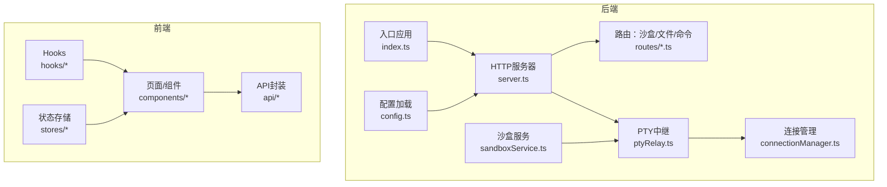
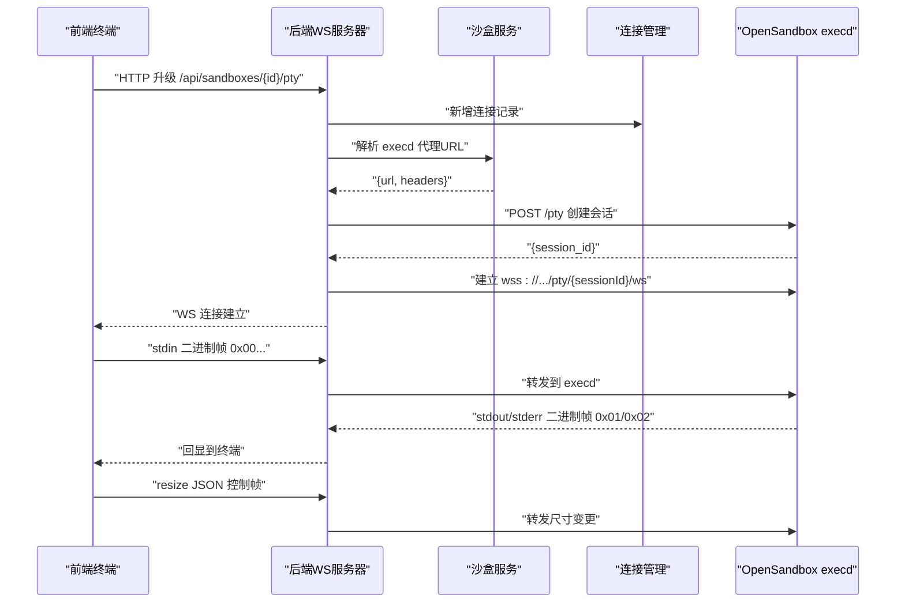
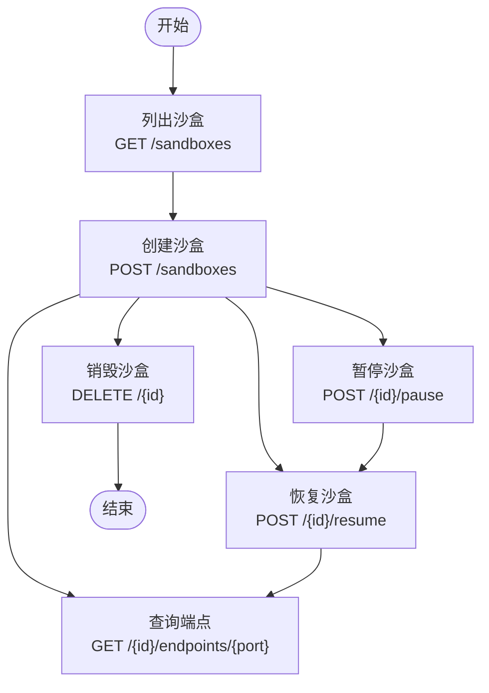
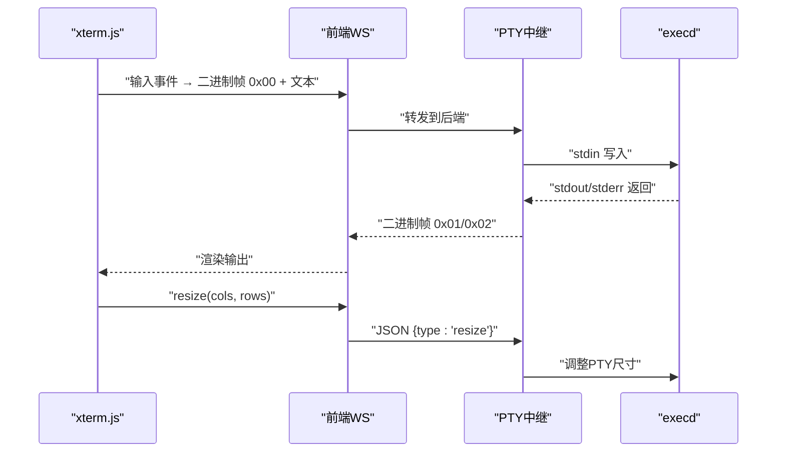
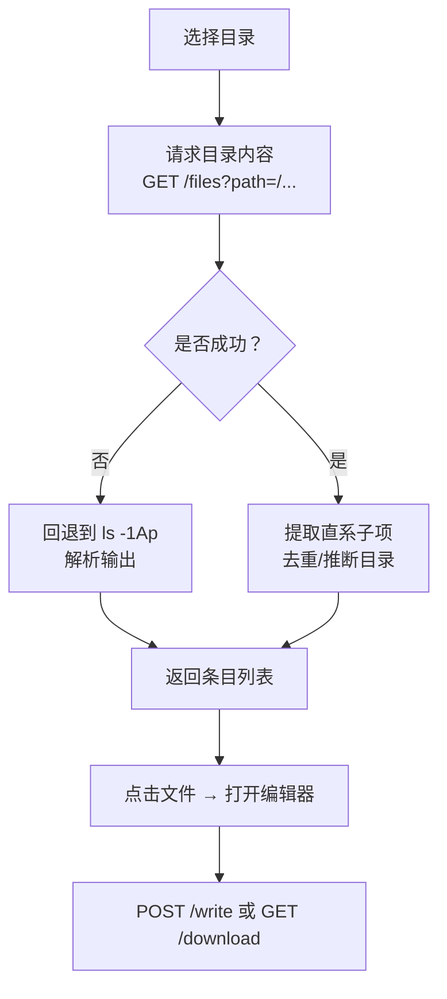
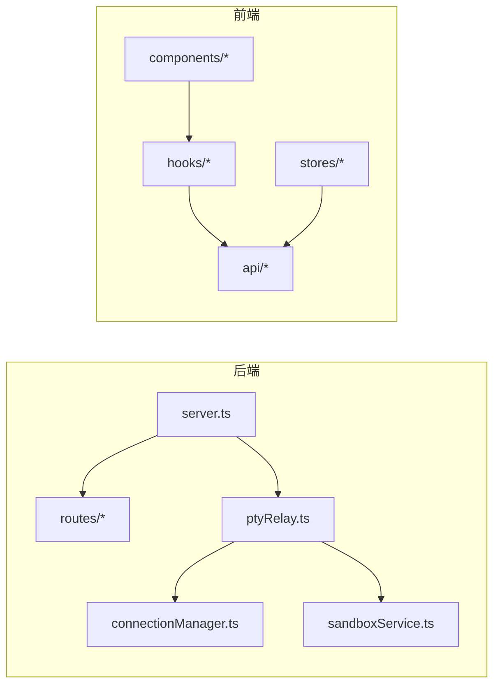

# 核心功能特性

<cite>
**本文引用的文件**
- [apps/backend/src/index.ts](file://apps/backend/src/index.ts)
- [apps/backend/src/server.ts](file://apps/backend/src/server.ts)
- [apps/backend/src/config.ts](file://apps/backend/src/config.ts)
- [apps/backend/src/services/sandboxService.ts](file://apps/backend/src/services/sandboxService.ts)
- [apps/backend/src/websocket/connectionManager.ts](file://apps/backend/src/websocket/connectionManager.ts)
- [apps/backend/src/websocket/ptyRelay.ts](file://apps/backend/src/websocket/ptyRelay.ts)
- [apps/backend/src/routes/sandboxes.ts](file://apps/backend/src/routes/sandboxes.ts)
- [apps/backend/src/routes/files.ts](file://apps/backend/src/routes/files.ts)
- [apps/frontend/src/components/sandbox/CreateSandbox.tsx](file://apps/frontend/src/components/sandbox/CreateSandbox.tsx)
- [apps/frontend/src/components/terminal/TerminalPane.tsx](file://apps/frontend/src/components/terminal/TerminalPane.tsx)
- [apps/frontend/src/hooks/useTerminal.ts](file://apps/frontend/src/hooks/useTerminal.ts)
- [apps/frontend/src/hooks/useFileTree.ts](file://apps/frontend/src/hooks/useFileTree.ts)
- [apps/frontend/src/components/files/FileTree.tsx](file://apps/frontend/src/components/files/FileTree.tsx)
- [apps/frontend/src/stores/sandboxStore.ts](file://apps/frontend/src/stores/sandboxStore.ts)
- [apps/frontend/src/api/sandboxes.ts](file://apps/frontend/src/api/sandboxes.ts)
</cite>

## 目录
1. [简介](#简介)
2. [项目结构](#项目结构)
3. [核心组件](#核心组件)
4. [架构总览](#架构总览)
5. [详细组件分析](#详细组件分析)
6. [依赖分析](#依赖分析)
7. [性能考虑](#性能考虑)
8. [故障排查指南](#故障排查指南)
9. [结论](#结论)
10. [附录](#附录)

## 简介
本文件面向Sandbox Manager项目的核心功能特性，围绕以下主题提供系统化说明与实操指导：
- 沙盒生命周期管理：创建、暂停、恢复、销毁
- 实时终端访问：WebSocket二进制帧透传、多标签页终端
- 文件系统操作：沙盒内文件浏览、编辑、上传下载
- 多用户资源管理：基于REST与WebSocket的服务编排

文档以“后端服务 + 前端交互”的视角，解释各功能的工作原理、使用场景、实现方式、协作关系与数据流，并给出最佳实践与故障排查建议。

## 项目结构
后端采用Express + WebSocket服务，通过中间件注册REST路由与WebSocket升级处理；前端使用React + Zustand状态管理，结合xterm.js实现终端与文件树交互。

图表来源
- [apps/backend/src/index.ts:1-66](file://apps/backend/src/index.ts#L1-L66)
- [apps/backend/src/server.ts:36-90](file://apps/backend/src/server.ts#L36-L90)
- [apps/backend/src/config.ts:48-71](file://apps/backend/src/config.ts#L48-L71)
- [apps/backend/src/services/sandboxService.ts:11-47](file://apps/backend/src/services/sandboxService.ts#L11-L47)
- [apps/backend/src/websocket/connectionManager.ts:7-46](file://apps/backend/src/websocket/connectionManager.ts#L7-L46)
- [apps/backend/src/websocket/ptyRelay.ts:22-38](file://apps/backend/src/websocket/ptyRelay.ts#L22-L38)
- [apps/backend/src/routes/sandboxes.ts:9-45](file://apps/backend/src/routes/sandboxes.ts#L9-L45)
- [apps/backend/src/routes/files.ts:8-17](file://apps/backend/src/routes/files.ts#L8-L17)
- [apps/frontend/src/components/sandbox/CreateSandbox.tsx:18-71](file://apps/frontend/src/components/sandbox/CreateSandbox.tsx#L18-L71)
- [apps/frontend/src/hooks/useTerminal.ts:12-95](file://apps/frontend/src/hooks/useTerminal.ts#L12-L95)
- [apps/frontend/src/hooks/useFileTree.ts:5-38](file://apps/frontend/src/hooks/useFileTree.ts#L5-L38)
- [apps/frontend/src/stores/sandboxStore.ts:16-62](file://apps/frontend/src/stores/sandboxStore.ts#L16-L62)
- [apps/frontend/src/api/sandboxes.ts:4-39](file://apps/frontend/src/api/sandboxes.ts#L4-L39)

章节来源
- [apps/backend/src/index.ts:1-66](file://apps/backend/src/index.ts#L1-L66)
- [apps/backend/src/server.ts:36-90](file://apps/backend/src/server.ts#L36-L90)
- [apps/backend/src/config.ts:48-71](file://apps/backend/src/config.ts#L48-L71)

## 核心组件
- 后端服务层
  - 配置加载：从环境变量读取OpenSandbox接入参数、日志级别、CORS、PTY空闲超时等。
  - 沙盒服务：封装OpenSandbox SDK，负责沙盒生命周期、缓存连接实例、解析execd代理URL。
  - 连接管理：维护前端WebSocket到后端execd会话的映射，空闲检测与清理。
  - PTY中继：透明转发二进制帧与JSON控制帧，建立前端→后端→OSB execd的双向通道。
  - 路由层：REST接口暴露沙盒列表/创建/删除/暂停/恢复/端点查询；挂载文件与命令子路由。
- 前端交互层
  - 终端：xterm.js + 插件，支持自适应布局、链接识别、输入/尺寸事件到WebSocket二进制帧转换。
  - 文件树：懒加载目录、展开/折叠、错误提示与重试策略。
  - 状态与API：Zustand状态管理沙盒列表，Axios封装REST调用。

章节来源
- [apps/backend/src/config.ts:3-23](file://apps/backend/src/config.ts#L3-L23)
- [apps/backend/src/services/sandboxService.ts:11-47](file://apps/backend/src/services/sandboxService.ts#L11-L47)
- [apps/backend/src/websocket/connectionManager.ts:7-46](file://apps/backend/src/websocket/connectionManager.ts#L7-L46)
- [apps/backend/src/websocket/ptyRelay.ts:22-38](file://apps/backend/src/websocket/ptyRelay.ts#L22-L38)
- [apps/backend/src/routes/sandboxes.ts:9-45](file://apps/backend/src/routes/sandboxes.ts#L9-L45)
- [apps/frontend/src/hooks/useTerminal.ts:12-95](file://apps/frontend/src/hooks/useTerminal.ts#L12-L95)
- [apps/frontend/src/hooks/useFileTree.ts:5-38](file://apps/frontend/src/hooks/useFileTree.ts#L5-L38)
- [apps/frontend/src/stores/sandboxStore.ts:16-62](file://apps/frontend/src/stores/sandboxStore.ts#L16-L62)
- [apps/frontend/src/api/sandboxes.ts:4-39](file://apps/frontend/src/api/sandboxes.ts#L4-L39)

## 架构总览
后端在HTTP升级阶段完成WS握手，随后通过沙盒服务解析execd代理地址并创建PTY会话，再建立后端到OSB的WS连接，最终在前端与OSB之间进行透明二进制帧透传。

图表来源
- [apps/backend/src/server.ts:75-87](file://apps/backend/src/server.ts#L75-L87)
- [apps/backend/src/websocket/ptyRelay.ts:40-118](file://apps/backend/src/websocket/ptyRelay.ts#L40-L118)
- [apps/backend/src/services/sandboxService.ts:129-138](file://apps/backend/src/services/sandboxService.ts#L129-L138)
- [apps/frontend/src/hooks/useTerminal.ts:25-95](file://apps/frontend/src/hooks/useTerminal.ts#L25-L95)

## 详细组件分析

### 沙盒生命周期管理
- 功能要点
  - 列表/详情：过滤状态、分页、过期过滤、标准化返回字段。
  - 创建：指定镜像、名称、超时、环境变量、资源配额、网络策略。
  - 暂停/恢复：更新状态并清理缓存连接。
  - 销毁：直接终止沙盒。
  - 端点查询：按端口生成可访问URL（http/https）。
- 数据流与协作
  - 前端通过REST调用后端路由，后端经沙盒服务与OpenSandbox交互。
  - 状态变更时，前端Store即时更新UI，避免轮询。
- 使用场景
  - 开发调试：快速创建沙盒，执行命令，查看输出。
  - 自动化测试：批量创建/销毁沙盒，隔离环境。
  - 资源回收：定时清理过期或闲置沙盒。

图表来源
- [apps/backend/src/routes/sandboxes.ts:61-175](file://apps/backend/src/routes/sandboxes.ts#L61-L175)
- [apps/frontend/src/api/sandboxes.ts:4-39](file://apps/frontend/src/api/sandboxes.ts#L4-L39)
- [apps/frontend/src/stores/sandboxStore.ts:16-62](file://apps/frontend/src/stores/sandboxStore.ts#L16-L62)

章节来源
- [apps/backend/src/routes/sandboxes.ts:61-175](file://apps/backend/src/routes/sandboxes.ts#L61-L175)
- [apps/frontend/src/api/sandboxes.ts:4-39](file://apps/frontend/src/api/sandboxes.ts#L4-L39)
- [apps/frontend/src/stores/sandboxStore.ts:16-62](file://apps/frontend/src/stores/sandboxStore.ts#L16-L62)

### 实时终端访问（WebSocket二进制帧透传）
- 工作原理
  - 前端xterm.js通过WebSocket发送二进制帧：0x00标识stdin，0x01/stderr标识stdout/stderr；同时发送JSON控制帧如resize与exit。
  - 后端PTY中继透明转发，不解析内容，仅做协议搬运。
  - 连接管理负责空闲检测与清理，避免资源泄露。
- 多标签页终端
  - 每个标签页独立建立WS连接，各自维护会话ID与连接对象，互不影响。
  - 断线自动指数退避重连，提升稳定性。
- 使用场景
  - 在线开发、运维排障、容器内调试、远程Shell。

图表来源
- [apps/frontend/src/hooks/useTerminal.ts:12-95](file://apps/frontend/src/hooks/useTerminal.ts#L12-L95)
- [apps/frontend/src/components/terminal/TerminalPane.tsx:8-37](file://apps/frontend/src/components/terminal/TerminalPane.tsx#L8-L37)
- [apps/backend/src/websocket/ptyRelay.ts:120-169](file://apps/backend/src/websocket/ptyRelay.ts#L120-L169)
- [apps/backend/src/websocket/connectionManager.ts:7-46](file://apps/backend/src/websocket/connectionManager.ts#L7-L46)

章节来源
- [apps/frontend/src/hooks/useTerminal.ts:12-95](file://apps/frontend/src/hooks/useTerminal.ts#L12-L95)
- [apps/frontend/src/components/terminal/TerminalPane.tsx:8-37](file://apps/frontend/src/components/terminal/TerminalPane.tsx#L8-L37)
- [apps/backend/src/websocket/ptyRelay.ts:120-169](file://apps/backend/src/websocket/ptyRelay.ts#L120-L169)
- [apps/backend/src/websocket/connectionManager.ts:7-46](file://apps/backend/src/websocket/connectionManager.ts#L7-L46)

### 文件系统操作（浏览、编辑、上传下载）
- 功能要点
  - 目录浏览：优先使用SDK搜索API，失败时回退到ls+stat命令组合。
  - 文件读写：支持文本内容读取与二进制下载；写入支持权限模式。
  - 移动/重命名：批量条目移动。
  - 删除：支持文件与目录批量删除。
- 数据流与协作
  - 前端通过API封装调用后端文件路由；后端获取已连接的沙盒实例，调用SDK文件能力。
  - 目录展开懒加载，失败重试，避免一次性拉取大量数据。
- 使用场景
  - 在线编辑器、日志查看、配置文件修改、打包下载。

图表来源
- [apps/backend/src/routes/files.ts:19-44](file://apps/backend/src/routes/files.ts#L19-L44)
- [apps/backend/src/routes/files.ts:213-275](file://apps/backend/src/routes/files.ts#L213-L275)
- [apps/backend/src/routes/files.ts:281-313](file://apps/backend/src/routes/files.ts#L281-L313)
- [apps/frontend/src/hooks/useFileTree.ts:12-38](file://apps/frontend/src/hooks/useFileTree.ts#L12-L38)
- [apps/frontend/src/components/files/FileTree.tsx:11-35](file://apps/frontend/src/components/files/FileTree.tsx#L11-L35)

章节来源
- [apps/backend/src/routes/files.ts:19-44](file://apps/backend/src/routes/files.ts#L19-L44)
- [apps/backend/src/routes/files.ts:213-275](file://apps/backend/src/routes/files.ts#L213-L275)
- [apps/backend/src/routes/files.ts:281-313](file://apps/backend/src/routes/files.ts#L281-L313)
- [apps/frontend/src/hooks/useFileTree.ts:12-38](file://apps/frontend/src/hooks/useFileTree.ts#L12-L38)
- [apps/frontend/src/components/files/FileTree.tsx:11-35](file://apps/frontend/src/components/files/FileTree.tsx#L11-L35)

### 多用户资源管理
- 设计思路
  - 后端通过LRU缓存复用已连接的沙盒实例，降低重复连接成本。
  - 连接管理对空闲连接进行周期性检查与清理，防止资源泄漏。
  - 前端Store集中管理沙盒状态，避免跨组件重复请求。
- 协作关系
  - 前端创建/销毁/暂停/恢复动作通过API触发后端路由，后端调用OpenSandbox SDK完成实际操作。
  - 文件与终端操作均依赖“已连接的沙盒实例”，确保一致性。
- 最佳实践
  - 合理设置PTy空闲超时，避免长时间无人使用的连接占用资源。
  - 对于大文件下载，建议使用二进制下载接口，避免文本编码问题。
  - 暂停/恢复用于节省资源，销毁用于彻底释放。

章节来源
- [apps/backend/src/services/sandboxService.ts:17-47](file://apps/backend/src/services/sandboxService.ts#L17-L47)
- [apps/backend/src/websocket/connectionManager.ts:18-100](file://apps/backend/src/websocket/connectionManager.ts#L18-L100)
- [apps/frontend/src/stores/sandboxStore.ts:16-62](file://apps/frontend/src/stores/sandboxStore.ts#L16-L62)

## 依赖分析
- 组件耦合
  - 后端：server.ts聚合路由、WS升级、服务初始化；ptyRelay依赖sandboxService与connectionManager；routes依赖services。
  - 前端：hooks封装WebSocket与文件树逻辑，components消费hooks结果，stores统一状态。
- 外部依赖
  - OpenSandbox SDK：提供沙盒生命周期与文件/命令能力。
  - xterm.js：终端渲染与交互。
  - ws：WebSocket服务端。
  - express/cors：HTTP服务与跨域。
- 循环依赖
  - 当前结构清晰，无明显循环依赖迹象。

图表来源
- [apps/backend/src/server.ts:36-90](file://apps/backend/src/server.ts#L36-L90)
- [apps/backend/src/websocket/ptyRelay.ts:22-38](file://apps/backend/src/websocket/ptyRelay.ts#L22-L38)
- [apps/backend/src/websocket/connectionManager.ts:7-46](file://apps/backend/src/websocket/connectionManager.ts#L7-L46)
- [apps/backend/src/services/sandboxService.ts:11-47](file://apps/backend/src/services/sandboxService.ts#L11-L47)
- [apps/frontend/src/hooks/useTerminal.ts:12-95](file://apps/frontend/src/hooks/useTerminal.ts#L12-L95)
- [apps/frontend/src/hooks/useFileTree.ts:5-38](file://apps/frontend/src/hooks/useFileTree.ts#L5-L38)
- [apps/frontend/src/stores/sandboxStore.ts:16-62](file://apps/frontend/src/stores/sandboxStore.ts#L16-L62)
- [apps/frontend/src/api/sandboxes.ts:4-39](file://apps/frontend/src/api/sandboxes.ts#L4-L39)

章节来源
- [apps/backend/src/server.ts:36-90](file://apps/backend/src/server.ts#L36-L90)
- [apps/frontend/src/hooks/useTerminal.ts:12-95](file://apps/frontend/src/hooks/useTerminal.ts#L12-L95)
- [apps/frontend/src/hooks/useFileTree.ts:5-38](file://apps/frontend/src/hooks/useFileTree.ts#L5-L38)
- [apps/frontend/src/stores/sandboxStore.ts:16-62](file://apps/frontend/src/stores/sandboxStore.ts#L16-L62)
- [apps/frontend/src/api/sandboxes.ts:4-39](file://apps/frontend/src/api/sandboxes.ts#L4-L39)

## 性能考虑
- 连接复用与缓存
  - 沙盒实例LRU缓存减少重复连接开销；默认容量与TTL可按环境调优。
- 空闲清理
  - 连接管理定期扫描空闲连接，避免僵尸连接堆积。
- I/O优化
  - 文件列表优先使用SDK搜索API，失败回退命令组合，兼顾准确性与性能。
- 前端体验
  - 终端自适应布局与链接识别，提升可用性；断线重连指数退避，避免风暴式重试。

## 故障排查指南
- OpenSandbox未配置
  - 现象：沙盒相关路由返回503。
  - 排查：确认环境变量OPENSANDBOX_SERVER_URL与OPENSANDBOX_API_KEY已正确设置。
- PTY连接失败
  - 现象：终端无法连接或报错。
  - 排查：检查后端日志中的execd代理URL解析与会话创建步骤；确认网络可达与API Key有效。
- 文件操作异常
  - 现象：目录加载失败或文件读写报错。
  - 排查：查看回退到ls命令的输出与错误；确认路径合法且有权限。
- 资源泄露
  - 现象：连接数持续增长。
  - 排查：检查空闲超时配置与连接管理清理逻辑；确认前端组件卸载时关闭WS。

章节来源
- [apps/backend/src/routes/sandboxes.ts:34-45](file://apps/backend/src/routes/sandboxes.ts#L34-L45)
- [apps/backend/src/websocket/ptyRelay.ts:110-118](file://apps/backend/src/websocket/ptyRelay.ts#L110-L118)
- [apps/backend/src/routes/files.ts:30-38](file://apps/backend/src/routes/files.ts#L30-L38)
- [apps/backend/src/websocket/connectionManager.ts:92-100](file://apps/backend/src/websocket/connectionManager.ts#L92-L100)

## 结论
Sandbox Manager通过清晰的后端服务与前端交互设计，实现了从沙盒生命周期到实时终端、文件系统的完整能力闭环。其关键优势在于：
- 透明的PTY二进制帧透传，保证终端体验流畅稳定；
- 基于SDK的文件操作与生命周期管理，简化复杂度；
- 前后端解耦的状态与API封装，便于扩展与维护。

建议在生产环境中结合监控与告警，合理配置资源与超时参数，确保高并发下的稳定性与可维护性。

## 附录
- 快速开始（概念流程）
  - 配置OpenSandbox接入参数后启动后端，进入设置向导完成初始化。
  - 前端创建沙盒，选择镜像与超时，进入沙盒管理界面。
  - 在终端页签中进行交互式命令执行；在文件页签中浏览/编辑/下载文件。
  - 根据需要暂停/恢复/销毁沙盒，释放资源。