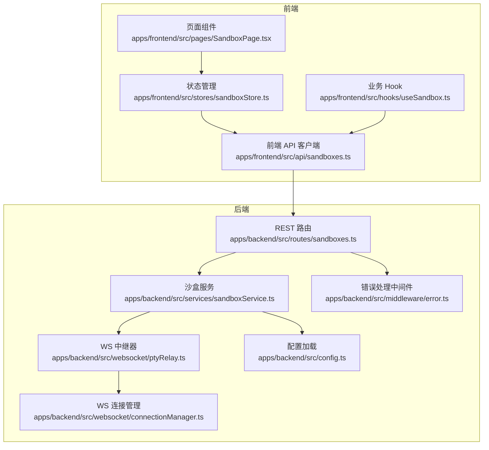
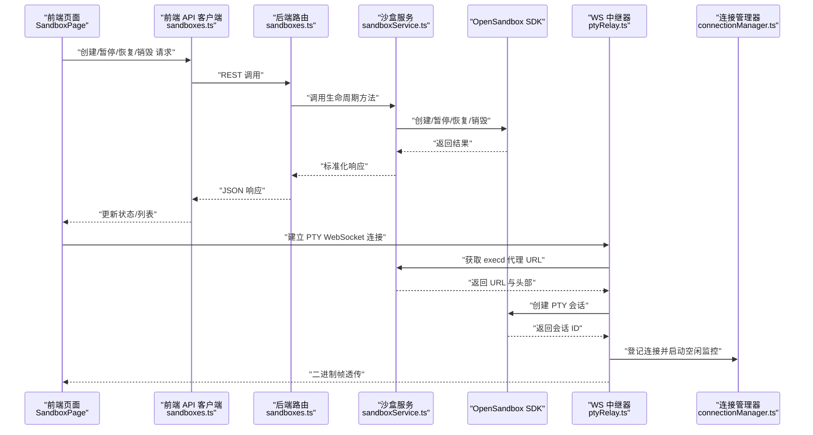
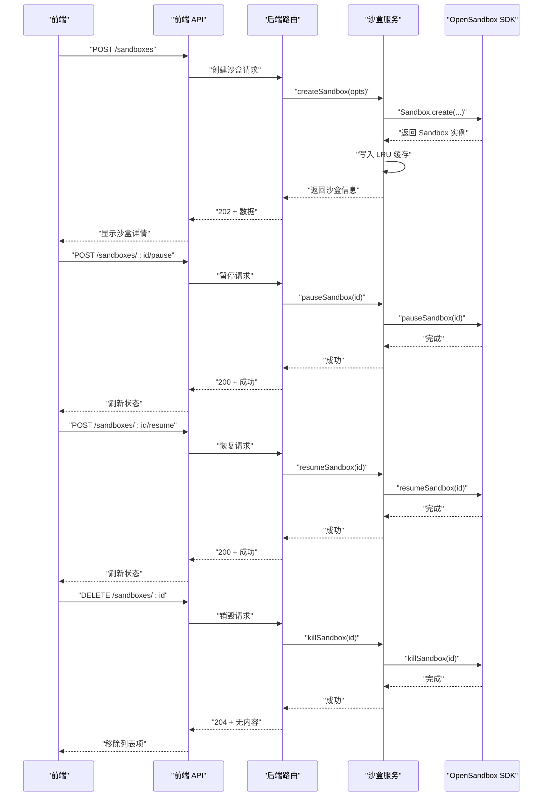
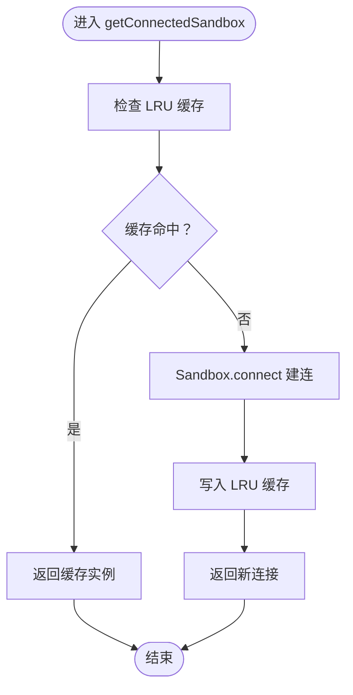
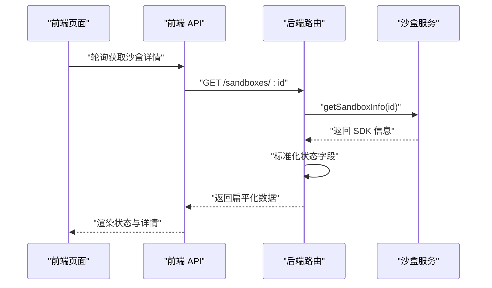
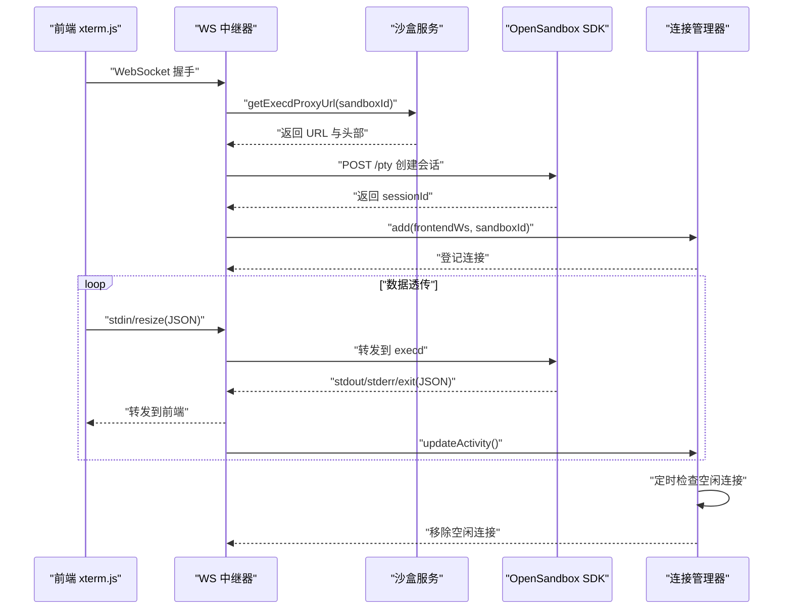
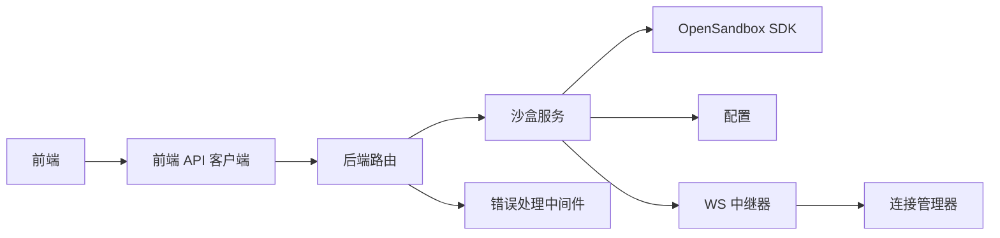

# 沙盒生命周期管理

<cite>
**本文引用的文件**
- [apps/backend/src/services/sandboxService.ts](file://apps/backend/src/services/sandboxService.ts)
- [apps/backend/src/routes/sandboxes.ts](file://apps/backend/src/routes/sandboxes.ts)
- [apps/backend/src/websocket/connectionManager.ts](file://apps/backend/src/websocket/connectionManager.ts)
- [apps/backend/src/websocket/ptyRelay.ts](file://apps/backend/src/websocket/ptyRelay.ts)
- [apps/backend/src/websocket/types.ts](file://apps/backend/src/websocket/types.ts)
- [apps/backend/src/types/index.ts](file://apps/backend/src/types/index.ts)
- [apps/backend/src/config.ts](file://apps/backend/src/config.ts)
- [apps/backend/src/middleware/error.ts](file://apps/backend/src/middleware/error.ts)
- [apps/frontend/src/api/sandboxes.ts](file://apps/frontend/src/api/sandboxes.ts)
- [apps/frontend/src/stores/sandboxStore.ts](file://apps/frontend/src/stores/sandboxStore.ts)
- [apps/frontend/src/hooks/useSandbox.ts](file://apps/frontend/src/hooks/useSandbox.ts)
- [apps/frontend/src/components/sandbox/CreateSandbox.tsx](file://apps/frontend/src/components/sandbox/CreateSandbox.tsx)
- [apps/frontend/src/pages/SandboxPage.tsx](file://apps/frontend/src/pages/SandboxPage.tsx)
- [README.md](file://README.md)
</cite>

## 目录
1. [简介](#简介)
2. [项目结构](#项目结构)
3. [核心组件](#核心组件)
4. [架构总览](#架构总览)
5. [详细组件分析](#详细组件分析)
6. [依赖关系分析](#依赖关系分析)
7. [性能考量](#性能考量)
8. [故障排查指南](#故障排查指南)
9. [结论](#结论)
10. [附录](#附录)

## 简介
本文件围绕“沙盒生命周期管理”主题，系统性阐述从创建、暂停、恢复到销毁的完整流程；解释 LRU 缓存在连接管理中的作用与 TTL 过期处理；说明状态监控、信息查询与元数据管理；并给出资源限制、网络策略与环境变量的实际配置路径与使用场景。同时覆盖与 OpenSandbox SDK 的集成方式与错误处理机制，帮助开发者快速上手并稳定运维。

## 项目结构
后端采用 Express + WebSocket（ws）+ OpenSandbox SDK 的技术栈，前端使用 React + Zustand + xterm.js，二者通过 REST/WS 接口交互。关键模块如下：
- 后端路由：负责 REST API 的入口与参数解析
- 服务层：封装 OpenSandbox SDK，提供沙盒生命周期与连接缓存能力
- WebSocket 层：实现 PTY 二进制帧透传与空闲检测
- 前端 API 层：统一调用后端接口
- 配置与中间件：环境变量驱动配置与统一错误处理

图表来源
- [apps/backend/src/routes/sandboxes.ts:1-175](file://apps/backend/src/routes/sandboxes.ts#L1-L175)
- [apps/backend/src/services/sandboxService.ts:1-148](file://apps/backend/src/services/sandboxService.ts#L1-L148)
- [apps/backend/src/websocket/ptyRelay.ts:1-171](file://apps/backend/src/websocket/ptyRelay.ts#L1-L171)
- [apps/backend/src/websocket/connectionManager.ts:1-102](file://apps/backend/src/websocket/connectionManager.ts#L1-L102)
- [apps/backend/src/config.ts:1-71](file://apps/backend/src/config.ts#L1-L71)
- [apps/backend/src/middleware/error.ts:1-48](file://apps/backend/src/middleware/error.ts#L1-L48)
- [apps/frontend/src/api/sandboxes.ts:1-40](file://apps/frontend/src/api/sandboxes.ts#L1-L40)
- [apps/frontend/src/stores/sandboxStore.ts:1-63](file://apps/frontend/src/stores/sandboxStore.ts#L1-L63)
- [apps/frontend/src/hooks/useSandbox.ts:1-59](file://apps/frontend/src/hooks/useSandbox.ts#L1-L59)
- [apps/frontend/src/pages/SandboxPage.tsx:1-165](file://apps/frontend/src/pages/SandboxPage.tsx#L1-L165)

章节来源
- [README.md:114-176](file://README.md#L114-L176)

## 核心组件
- 沙盒服务（SandboxService）
  - 负责创建、暂停、恢复、销毁沙盒实例
  - 使用 LRU 缓存维护已连接的 Sandbox 实例，支持 TTL 过期与驱逐回调关闭连接
  - 提供获取连接实例与 execd 代理 URL 的能力，用于 PTY 中继
- REST 路由（sandboxesRouter）
  - 对外暴露 /sandboxes 的 CRUD 与状态变更接口
  - 在请求前校验 OpenSandbox 是否已配置
  - 将 SDK 返回的复杂状态结构标准化为前端友好的扁平格式
- WebSocket 中继（PtyRelay）
  - 透明转发二进制帧与控制消息
  - 建立前端 WS 与 OpenSandbox Server Proxy 的双向通道
  - 结合连接管理器进行空闲检测与清理
- 连接管理器（ConnectionManager）
  - 维护活跃的 PTY 连接集合，记录创建时间与最后活动时间
  - 周期性检查空闲连接并主动关闭
- 错误处理中间件
  - 将 SDK 异常映射为合适的 HTTP 状态码，统一输出结构化错误响应

章节来源
- [apps/backend/src/services/sandboxService.ts:11-148](file://apps/backend/src/services/sandboxService.ts#L11-L148)
- [apps/backend/src/routes/sandboxes.ts:1-175](file://apps/backend/src/routes/sandboxes.ts#L1-L175)
- [apps/backend/src/websocket/ptyRelay.ts:1-171](file://apps/backend/src/websocket/ptyRelay.ts#L1-L171)
- [apps/backend/src/websocket/connectionManager.ts:1-102](file://apps/backend/src/websocket/connectionManager.ts#L1-L102)
- [apps/backend/src/middleware/error.ts:1-48](file://apps/backend/src/middleware/error.ts#L1-L48)

## 架构总览
下图展示从前端到后端再到 OpenSandbox Server 的端到端交互路径，重点体现 PTY 二进制帧透传与连接缓存的作用。

图表来源
- [apps/backend/src/routes/sandboxes.ts:95-175](file://apps/backend/src/routes/sandboxes.ts#L95-L175)
- [apps/backend/src/services/sandboxService.ts:112-138](file://apps/backend/src/services/sandboxService.ts#L112-L138)
- [apps/backend/src/websocket/ptyRelay.ts:40-171](file://apps/backend/src/websocket/ptyRelay.ts#L40-L171)
- [apps/backend/src/websocket/connectionManager.ts:18-100](file://apps/backend/src/websocket/connectionManager.ts#L18-L100)

## 详细组件分析

### 沙盒生命周期操作详解
- 创建沙盒（createSandbox）
  - 参数要点：镜像、名称、超时、环境变量、元数据、资源限制、网络策略
  - 执行流程：构造 ConnectionConfig → 通过 Sandbox.create 创建实例 → 写入 LRU 缓存 → 返回沙盒信息
  - 关键路径：[apps/backend/src/services/sandboxService.ts:62-88](file://apps/backend/src/services/sandboxService.ts#L62-L88)
- 暂停沙盒（pauseSandbox）
  - 执行流程：删除缓存中对应实例 → 调用 manager.pauseSandbox
  - 关键路径：[apps/backend/src/services/sandboxService.ts:96-100](file://apps/backend/src/services/sandboxService.ts#L96-L100)
- 恢复沙盒（resumeSandbox）
  - 执行流程：删除缓存中对应实例 → 调用 manager.resumeSandbox
  - 关键路径：[apps/backend/src/services/sandboxService.ts:102-106](file://apps/backend/src/services/sandboxService.ts#L102-L106)
- 销毁沙盒（killSandbox）
  - 执行流程：删除缓存中对应实例 → 调用 manager.killSandbox
  - 关键路径：[apps/backend/src/services/sandboxService.ts:90-94](file://apps/backend/src/services/sandboxService.ts#L90-L94)

图表来源
- [apps/backend/src/routes/sandboxes.ts:95-149](file://apps/backend/src/routes/sandboxes.ts#L95-L149)
- [apps/backend/src/services/sandboxService.ts:62-106](file://apps/backend/src/services/sandboxService.ts#L62-L106)

章节来源
- [apps/backend/src/services/sandboxService.ts:62-106](file://apps/backend/src/services/sandboxService.ts#L62-L106)
- [apps/backend/src/routes/sandboxes.ts:95-149](file://apps/backend/src/routes/sandboxes.ts#L95-L149)

### LRU 缓存机制与连接复用
- 缓存策略
  - 最大容量：50
  - TTL：10 分钟
  - 驱逐回调：自动关闭被驱逐的 Sandbox 连接，避免资源泄漏
- 连接复用
  - getConnectedSandbox：优先从缓存命中；未命中则通过 Sandbox.connect 建连并写入缓存
  - execd 代理 URL：通过 getExecdProxyUrl 获取，供 PTY 中继使用
- 关键路径：
  - 缓存初始化与驱逐：[apps/backend/src/services/sandboxService.ts:20-47](file://apps/backend/src/services/sandboxService.ts#L20-L47)
  - 连接获取与复用：[apps/backend/src/services/sandboxService.ts:112-123](file://apps/backend/src/services/sandboxService.ts#L112-L123)
  - execd 代理 URL 解析：[apps/backend/src/services/sandboxService.ts:129-138](file://apps/backend/src/services/sandboxService.ts#L129-L138)

图表来源
- [apps/backend/src/services/sandboxService.ts:112-123](file://apps/backend/src/services/sandboxService.ts#L112-L123)

章节来源
- [apps/backend/src/services/sandboxService.ts:17-47](file://apps/backend/src/services/sandboxService.ts#L17-L47)
- [apps/backend/src/services/sandboxService.ts:112-138](file://apps/backend/src/services/sandboxService.ts#L112-L138)

### 状态监控、信息查询与元数据管理
- 状态监控
  - 路由层对沙盒状态进行标准化：将 SDK 的复杂状态对象扁平化为字符串状态，便于前端展示
  - 前端 Hook 自动轮询“创建/暂停/恢复”过程中的状态变化，直到稳定
- 信息查询
  - listSandboxInfos：支持按状态过滤、分页
  - getSandboxInfo：获取单个沙盒详情
- 元数据管理
  - 支持 metadata 字段传递与查询，便于打标签与检索
- 关键路径：
  - 标准化函数：[apps/backend/src/routes/sandboxes.ts:16-32](file://apps/backend/src/routes/sandboxes.ts#L16-L32)
  - 轮询逻辑：[apps/frontend/src/hooks/useSandbox.ts:42-55](file://apps/frontend/src/hooks/useSandbox.ts#L42-L55)
  - 查询接口：[apps/backend/src/services/sandboxService.ts:49-60](file://apps/backend/src/services/sandboxService.ts#L49-L60)

图表来源
- [apps/backend/src/routes/sandboxes.ts:108-116](file://apps/backend/src/routes/sandboxes.ts#L108-L116)
- [apps/backend/src/services/sandboxService.ts:58-60](file://apps/backend/src/services/sandboxService.ts#L58-L60)

章节来源
- [apps/backend/src/routes/sandboxes.ts:16-32](file://apps/backend/src/routes/sandboxes.ts#L16-L32)
- [apps/backend/src/routes/sandboxes.ts:108-116](file://apps/backend/src/routes/sandboxes.ts#L108-L116)
- [apps/frontend/src/hooks/useSandbox.ts:42-55](file://apps/frontend/src/hooks/useSandbox.ts#L42-L55)
- [apps/backend/src/services/sandboxService.ts:49-60](file://apps/backend/src/services/sandboxService.ts#L49-L60)

### PTY 终端连接与空闲检测
- 二进制帧透传
  - 控制帧：JSON 文本帧（如 resize、exit）
  - 数据帧：二进制帧（stdin、stdout、stderr）
- 连接建立流程
  - 前端握手 → 后端解析 execd 代理 URL → 创建 PTY 会话 → 建立后端到 Server 的 WebSocket
- 空闲检测
  - 连接管理器周期性扫描 lastActivityAt 与配置的空闲阈值，主动关闭长时间无活动的连接
- 关键路径：
  - 中继握手与会话创建：[apps/backend/src/websocket/ptyRelay.ts:40-118](file://apps/backend/src/websocket/ptyRelay.ts#L40-L118)
  - 双向转发与事件处理：[apps/backend/src/websocket/ptyRelay.ts:120-171](file://apps/backend/src/websocket/ptyRelay.ts#L120-L171)
  - 连接登记与空闲检查：[apps/backend/src/websocket/connectionManager.ts:18-100](file://apps/backend/src/websocket/connectionManager.ts#L18-L100)

图表来源
- [apps/backend/src/websocket/ptyRelay.ts:40-171](file://apps/backend/src/websocket/ptyRelay.ts#L40-L171)
- [apps/backend/src/websocket/connectionManager.ts:18-100](file://apps/backend/src/websocket/connectionManager.ts#L18-L100)
- [apps/backend/src/services/sandboxService.ts:129-138](file://apps/backend/src/services/sandboxService.ts#L129-L138)

章节来源
- [apps/backend/src/websocket/ptyRelay.ts:9-21](file://apps/backend/src/websocket/ptyRelay.ts#L9-L21)
- [apps/backend/src/websocket/ptyRelay.ts:40-171](file://apps/backend/src/websocket/ptyRelay.ts#L40-L171)
- [apps/backend/src/websocket/connectionManager.ts:18-100](file://apps/backend/src/websocket/connectionManager.ts#L18-L100)
- [apps/backend/src/websocket/types.ts:1-20](file://apps/backend/src/websocket/types.ts#L1-L20)

### 参数配置、网络策略与环境变量
- 资源限制
  - 通过 resource.cpu 与 resource.memory 传递给 SDK
  - 关键路径：[apps/backend/src/types/index.ts:19-24](file://apps/backend/src/types/index.ts#L19-L24)
- 网络策略
  - networkPolicy.defaultAction 与 networkPolicy.egress 数组
  - 关键路径：[apps/backend/src/types/index.ts:20-24](file://apps/backend/src/types/index.ts#L20-L24)
- 环境变量
  - env 字段直接透传至 SDK
  - 关键路径：[apps/frontend/src/components/sandbox/CreateSandbox.tsx:46-54](file://apps/frontend/src/components/sandbox/CreateSandbox.tsx#L46-L54)
- 超时与连接配置
  - timeoutSeconds、requestTimeoutSeconds、useServerProxy 等
  - 关键路径：[apps/backend/src/config.ts:48-70](file://apps/backend/src/config.ts#L48-L70)

章节来源
- [apps/backend/src/types/index.ts:13-24](file://apps/backend/src/types/index.ts#L13-L24)
- [apps/frontend/src/components/sandbox/CreateSandbox.tsx:46-71](file://apps/frontend/src/components/sandbox/CreateSandbox.tsx#L46-L71)
- [apps/backend/src/config.ts:48-70](file://apps/backend/src/config.ts#L48-L70)

### 与 OpenSandbox SDK 的集成与错误处理
- SDK 集成
  - 通过 ConnectionConfig 注入 serverUrl、apiKey、protocol、proxy、超时等
  - 通过 SandboxManager.create 初始化管理器
  - 关键路径：[apps/backend/src/services/sandboxService.ts:20-34](file://apps/backend/src/services/sandboxService.ts#L20-L34)
- 错误处理
  - 将 SDK 异常映射为 HTTP 状态码（如 400、502、504），统一输出结构化错误体
  - 关键路径：[apps/backend/src/middleware/error.ts:33-47](file://apps/backend/src/middleware/error.ts#L33-L47)

章节来源
- [apps/backend/src/services/sandboxService.ts:20-34](file://apps/backend/src/services/sandboxService.ts#L20-L34)
- [apps/backend/src/middleware/error.ts:1-48](file://apps/backend/src/middleware/error.ts#L1-L48)

## 依赖关系分析
- 路由依赖服务层：REST 路由仅做参数解析与响应包装，具体逻辑委托给 SandboxService
- 服务层依赖 SDK 与配置：构造 ConnectionConfig，调用 SDK 生命周期方法
- WS 中继依赖服务层与连接管理器：获取 execd URL、登记连接、处理空闲
- 前端依赖后端 API：通过统一客户端发起请求，状态管理与 Hook 协同

图表来源
- [apps/backend/src/routes/sandboxes.ts:1-175](file://apps/backend/src/routes/sandboxes.ts#L1-L175)
- [apps/backend/src/services/sandboxService.ts:1-148](file://apps/backend/src/services/sandboxService.ts#L1-L148)
- [apps/backend/src/websocket/ptyRelay.ts:1-171](file://apps/backend/src/websocket/ptyRelay.ts#L1-L171)
- [apps/backend/src/websocket/connectionManager.ts:1-102](file://apps/backend/src/websocket/connectionManager.ts#L1-L102)
- [apps/backend/src/middleware/error.ts:1-48](file://apps/backend/src/middleware/error.ts#L1-L48)
- [apps/frontend/src/api/sandboxes.ts:1-40](file://apps/frontend/src/api/sandboxes.ts#L1-L40)

章节来源
- [apps/backend/src/routes/sandboxes.ts:1-175](file://apps/backend/src/routes/sandboxes.ts#L1-L175)
- [apps/backend/src/services/sandboxService.ts:1-148](file://apps/backend/src/services/sandboxService.ts#L1-L148)
- [apps/backend/src/websocket/ptyRelay.ts:1-171](file://apps/backend/src/websocket/ptyRelay.ts#L1-L171)
- [apps/backend/src/websocket/connectionManager.ts:1-102](file://apps/backend/src/websocket/connectionManager.ts#L1-L102)
- [apps/frontend/src/api/sandboxes.ts:1-40](file://apps/frontend/src/api/sandboxes.ts#L1-L40)

## 性能考量
- LRU 缓存
  - 降低重复连接开销，提升频繁操作（如 PTY、文件/命令）的响应速度
  - TTL 防止长期占用资源；驱逐回调确保连接被正确释放
- PTY 空闲检测
  - 定期清理长时间无活动的连接，避免内存与带宽浪费
- 请求超时与代理
  - 通过 requestTimeoutSeconds 与 useServerProxy 控制网络延迟与稳定性
- 前端轮询
  - “创建/暂停/恢复”阶段的自动轮询减少用户等待，但需注意频率与节流

章节来源
- [apps/backend/src/services/sandboxService.ts:35-44](file://apps/backend/src/services/sandboxService.ts#L35-L44)
- [apps/backend/src/websocket/connectionManager.ts:18-28](file://apps/backend/src/websocket/connectionManager.ts#L18-L28)
- [apps/backend/src/config.ts:48-70](file://apps/backend/src/config.ts#L48-L70)
- [apps/frontend/src/hooks/useSandbox.ts:42-55](file://apps/frontend/src/hooks/useSandbox.ts#L42-L55)

## 故障排查指南
- OpenSandbox 未配置
  - 现象：路由层直接返回 503，提示未完成设置
  - 处理：检查环境变量 OPENSANDBOX_SERVER_URL 与 OPENSANDBOX_API_KEY
  - 关键路径：[apps/backend/src/routes/sandboxes.ts:34-45](file://apps/backend/src/routes/sandboxes.ts#L34-L45)
- PTY 握手失败
  - 现象：WS 握手超时或无法创建会话
  - 处理：检查 getExecdProxyUrl 返回的 URL 与头部；确认 SDK 服务可达
  - 关键路径：[apps/backend/src/websocket/ptyRelay.ts:58-93](file://apps/backend/src/websocket/ptyRelay.ts#L58-L93)
- 连接被空闲清理
  - 现象：长时间无输入后连接断开
  - 处理：调整 PTY_IDLE_TIMEOUT_MS 或在前端触发活动事件
  - 关键路径：[apps/backend/src/websocket/connectionManager.ts:92-100](file://apps/backend/src/websocket/connectionManager.ts#L92-L100)
- SDK 异常映射
  - 现象：不同异常映射为不同 HTTP 状态码
  - 处理：根据错误码定位问题（参数错误、网关超时、内部异常等）
  - 关键路径：[apps/backend/src/middleware/error.ts:33-47](file://apps/backend/src/middleware/error.ts#L33-L47)

章节来源
- [apps/backend/src/routes/sandboxes.ts:34-45](file://apps/backend/src/routes/sandboxes.ts#L34-L45)
- [apps/backend/src/websocket/ptyRelay.ts:58-93](file://apps/backend/src/websocket/ptyRelay.ts#L58-L93)
- [apps/backend/src/websocket/connectionManager.ts:92-100](file://apps/backend/src/websocket/connectionManager.ts#L92-L100)
- [apps/backend/src/middleware/error.ts:33-47](file://apps/backend/src/middleware/error.ts#L33-L47)

## 结论
本方案以 OpenSandbox SDK 为核心，结合 LRU 缓存与 WS 中继，实现了高可用的沙盒生命周期管理与终端交互体验。通过标准化状态、严格的错误映射与空闲清理机制，系统在易用性与稳定性之间取得平衡。建议在生产环境中合理设置 TTL 与空闲阈值，并完善日志与告警策略以保障长链路的可观测性。

## 附录
- 端点概览（来自 README）
  - GET /api/sandboxes：列出所有沙箱
  - POST /api/sandboxes：创建沙箱
  - GET /api/sandboxes/:id：获取沙箱详情
  - DELETE /api/sandboxes/:id：删除沙盒
  - POST /api/sandboxes/:id/pause：暂停沙箱
  - POST /api/sandboxes/:id/resume：恢复沙箱
  - GET /api/sandboxes/:id/endpoints：获取沙箱端点
  - GET /api/sandboxes/:id/files：列出目录文件
  - GET /api/sandboxes/:id/files/content：读取文件内容
  - PUT /api/sandboxes/:id/files/content：写入文件
  - POST /api/sandboxes/:id/commands：执行命令
  - WS /api/sandboxes/:id/pty：PTY WebSocket 终端连接

章节来源
- [README.md:153-176](file://README.md#L153-L176)