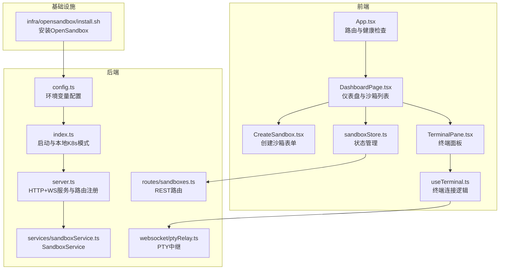
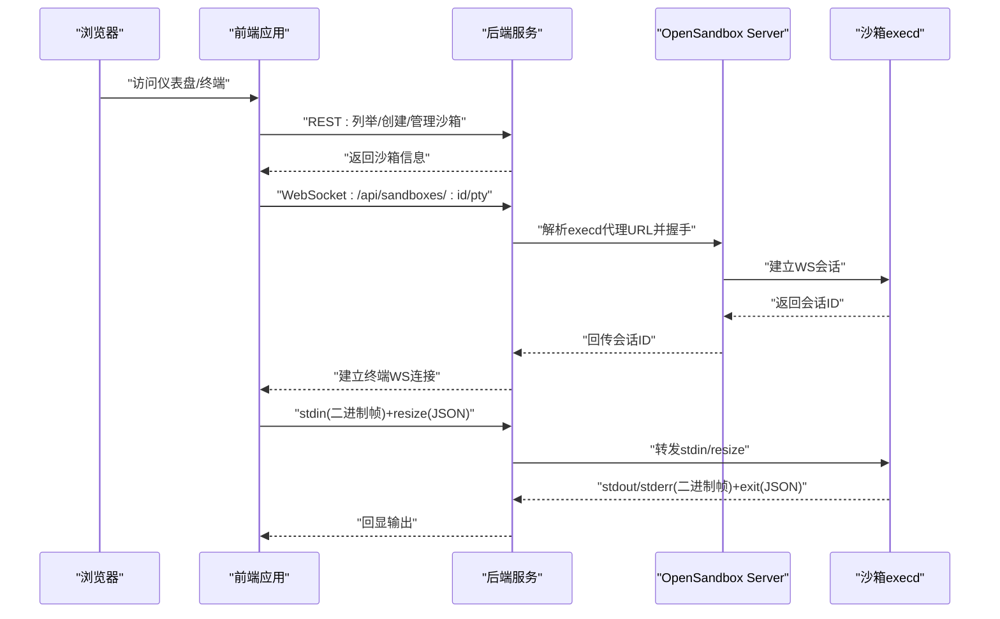
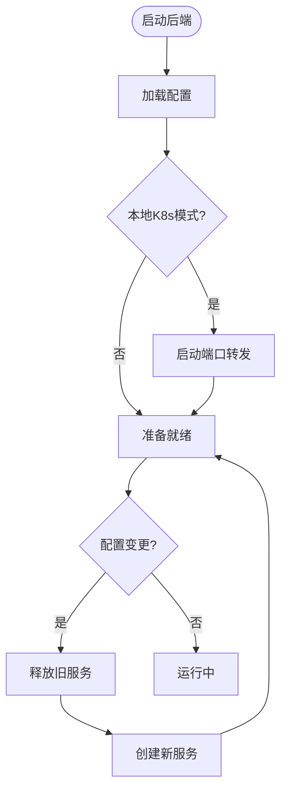
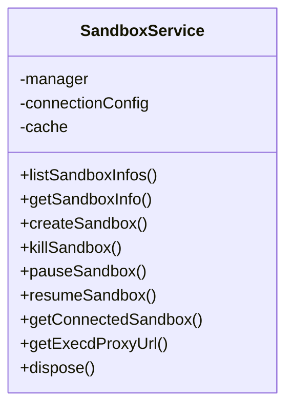
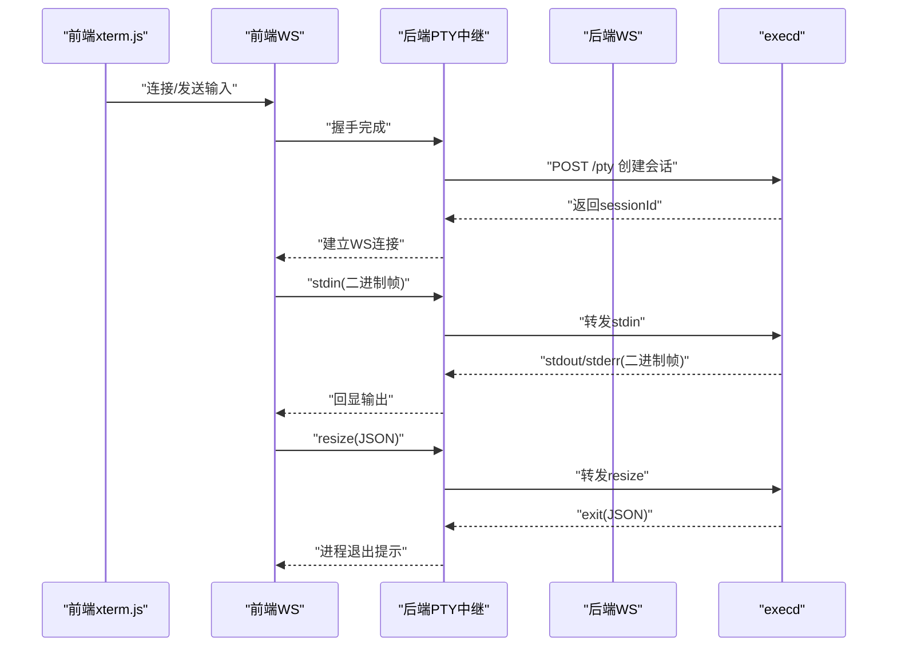
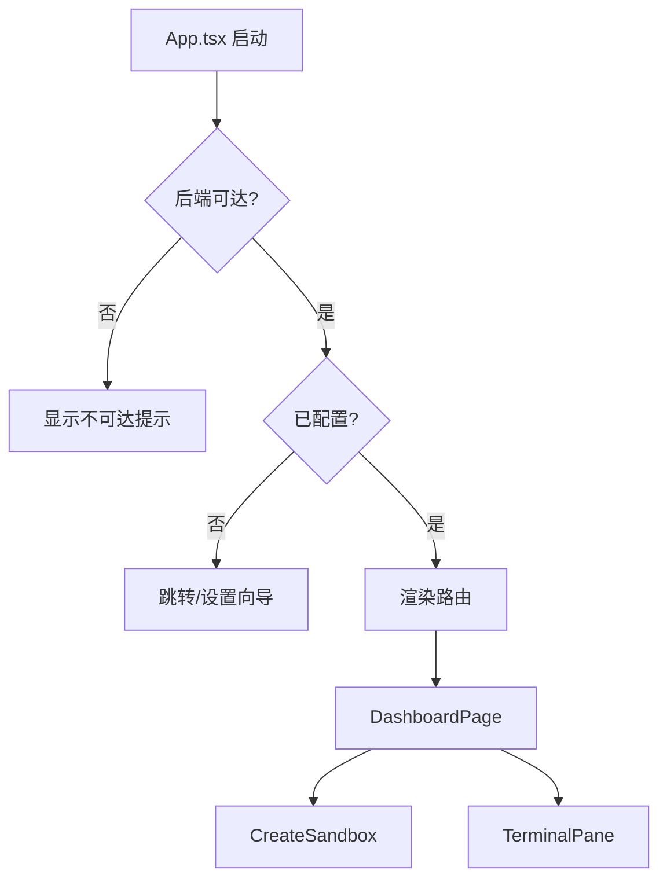
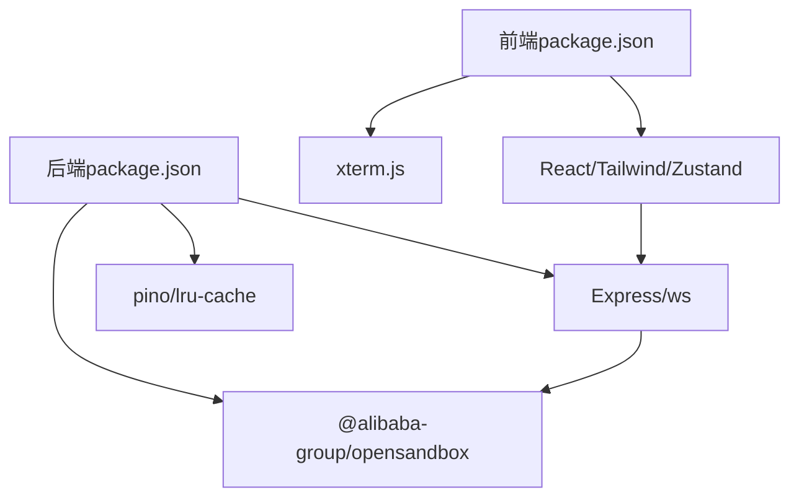

# 项目介绍与愿景

<cite>
**本文档引用的文件**
- [README.md](file://README.md)
- [package.json](file://package.json)
- [apps/backend/src/index.ts](file://apps/backend/src/index.ts)
- [apps/backend/src/server.ts](file://apps/backend/src/server.ts)
- [apps/backend/src/config.ts](file://apps/backend/src/config.ts)
- [apps/backend/src/services/sandboxService.ts](file://apps/backend/src/services/sandboxService.ts)
- [apps/backend/src/websocket/ptyRelay.ts](file://apps/backend/src/websocket/ptyRelay.ts)
- [apps/backend/src/routes/sandboxes.ts](file://apps/backend/src/routes/sandboxes.ts)
- [apps/frontend/src/App.tsx](file://apps/frontend/src/App.tsx)
- [apps/frontend/src/pages/DashboardPage.tsx](file://apps/frontend/src/pages/DashboardPage.tsx)
- [apps/frontend/src/components/sandbox/CreateSandbox.tsx](file://apps/frontend/src/components/sandbox/CreateSandbox.tsx)
- [apps/frontend/src/components/terminal/TerminalPane.tsx](file://apps/frontend/src/components/terminal/TerminalPane.tsx)
- [apps/frontend/src/hooks/useTerminal.ts](file://apps/frontend/src/hooks/useTerminal.ts)
- [apps/frontend/src/stores/sandboxStore.ts](file://apps/frontend/src/stores/sandboxStore.ts)
- [apps/backend/package.json](file://apps/backend/package.json)
- [apps/frontend/package.json](file://apps/frontend/package.json)
- [infra/opensandbox/install.sh](file://infra/opensandbox/install.sh)
</cite>

## 目录
1. [引言](#引言)
2. [项目结构](#项目结构)
3. [核心组件](#核心组件)
4. [架构总览](#架构总览)
5. [详细组件分析](#详细组件分析)
6. [依赖关系分析](#依赖关系分析)
7. [性能考量](#性能考量)
8. [故障排查指南](#故障排查指南)
9. [结论](#结论)
10. [附录](#附录)

## 引言
Sandbox Manager 是一个基于 OpenSandbox 的 Kubernetes AI 沙箱管理平台，旨在为 AI 开发与研究提供安全、隔离且易于使用的容器化实验环境。通过 Web UI，用户可以快速创建、管理和销毁沙箱；借助 Web 终端（xterm.js）实现与沙箱的实时交互；后端通过 OpenSandbox SDK 与 Kubernetes 集群中的 OpenSandbox 控制器通信，完成沙箱生命周期管理与资源调度。

本项目的核心使命是降低 AI 研究与工程化的准入门槛：让开发者无需复杂的 CLI 操作，即可在浏览器中完成从“镜像选择”到“命令执行”的全流程工作。其价值主张体现在：
- 隔离与安全：每个沙箱独立运行，互不干扰，便于资源控制与故障隔离
- 易用性：图形化界面 + 实时终端，显著降低学习成本
- 可扩展：支持多用户、多镜像、多资源配额与网络策略
- 可运维：完善的健康检查、错误处理与优雅关闭流程

## 项目结构
项目采用 pnpm monorepo 结构，分为前端、后端与基础设施三大部分：
- 前端（React 19 + TypeScript + Zustand + Tailwind CSS）：负责页面路由、状态管理与终端渲染
- 后端（Express + WebSocket + OpenSandbox SDK）：提供 REST API 与 PTY WebSocket 中继，封装 OpenSandbox SDK
- 基础设施（Helm Chart + OpenSandbox 安装脚本）：一键部署 OpenSandbox 控制器与资源池

图表来源
- [apps/frontend/src/App.tsx:1-114](file://apps/frontend/src/App.tsx#L1-L114)
- [apps/frontend/src/pages/DashboardPage.tsx:1-54](file://apps/frontend/src/pages/DashboardPage.tsx#L1-L54)
- [apps/frontend/src/components/sandbox/CreateSandbox.tsx:1-180](file://apps/frontend/src/components/sandbox/CreateSandbox.tsx#L1-L180)
- [apps/frontend/src/components/terminal/TerminalPane.tsx:1-38](file://apps/frontend/src/components/terminal/TerminalPane.tsx#L1-L38)
- [apps/frontend/src/hooks/useTerminal.ts:1-180](file://apps/frontend/src/hooks/useTerminal.ts#L1-L180)
- [apps/frontend/src/stores/sandboxStore.ts:1-63](file://apps/frontend/src/stores/sandboxStore.ts#L1-L63)
- [apps/backend/src/index.ts:1-66](file://apps/backend/src/index.ts#L1-L66)
- [apps/backend/src/server.ts:1-119](file://apps/backend/src/server.ts#L1-L119)
- [apps/backend/src/config.ts:1-71](file://apps/backend/src/config.ts#L1-L71)
- [apps/backend/src/routes/sandboxes.ts:1-175](file://apps/backend/src/routes/sandboxes.ts#L1-L175)
- [apps/backend/src/services/sandboxService.ts:1-148](file://apps/backend/src/services/sandboxService.ts#L1-L148)
- [apps/backend/src/websocket/ptyRelay.ts:1-171](file://apps/backend/src/websocket/ptyRelay.ts#L1-L171)
- [infra/opensandbox/install.sh:1-132](file://infra/opensandbox/install.sh#L1-L132)

章节来源
- [README.md:114-140](file://README.md#L114-L140)
- [package.json:1-20](file://package.json#L1-L20)

## 核心组件
- OpenSandbox 集成层：后端通过 SandboxService 封装 OpenSandbox SDK，统一管理沙箱的创建、暂停、恢复与销毁，并维护连接缓存以提升性能
- Web 终端中继：PTY 中继负责透明转发二进制帧与 JSON 控制帧，实现 xterm.js 与 OpenSandbox execd 的双向通信
- 前端状态与路由：Zustand 管理沙箱列表与操作状态，React Router 提供页面导航，useTerminal 负责终端连接与重连逻辑
- 基础设施自动化：一键安装 OpenSandbox 控制器与资源池，支持本地与远程 Kubernetes 模式

章节来源
- [apps/backend/src/services/sandboxService.ts:1-148](file://apps/backend/src/services/sandboxService.ts#L1-L148)
- [apps/backend/src/websocket/ptyRelay.ts:1-171](file://apps/backend/src/websocket/ptyRelay.ts#L1-L171)
- [apps/frontend/src/stores/sandboxStore.ts:1-63](file://apps/frontend/src/stores/sandboxStore.ts#L1-L63)
- [apps/frontend/src/hooks/useTerminal.ts:1-180](file://apps/frontend/src/hooks/useTerminal.ts#L1-L180)
- [infra/opensandbox/install.sh:1-132](file://infra/opensandbox/install.sh#L1-L132)

## 架构总览
下图展示了从浏览器到 Kubernetes 的完整数据流：前端通过 REST API 获取沙箱信息与文件系统，通过 WebSocket 与后端建立 PTY 通道，后端经 OpenSandbox Server 代理访问 execd，最终在 Kubernetes 中的沙箱容器内执行命令。

图表来源
- [apps/backend/src/websocket/ptyRelay.ts:40-118](file://apps/backend/src/websocket/ptyRelay.ts#L40-L118)
- [apps/backend/src/routes/sandboxes.ts:151-175](file://apps/backend/src/routes/sandboxes.ts#L151-L175)
- [apps/frontend/src/hooks/useTerminal.ts:25-95](file://apps/frontend/src/hooks/useTerminal.ts#L25-L95)

## 详细组件分析

### 后端服务与配置
- 服务启动与本地模式：根据配置判断是否为本地 Kubernetes 模式，自动启动端口转发以连接集群内的 OpenSandbox Server
- 配置加载：从环境变量读取 OpenSandbox 服务器地址、协议、API Key、日志级别与 PTY 空闲超时等参数
- 服务重建：在设置变更后重新初始化服务，确保配置生效

图表来源
- [apps/backend/src/index.ts:12-46](file://apps/backend/src/index.ts#L12-L46)
- [apps/backend/src/config.ts:48-70](file://apps/backend/src/config.ts#L48-L70)
- [apps/backend/src/server.ts:96-118](file://apps/backend/src/server.ts#L96-L118)

章节来源
- [apps/backend/src/index.ts:1-66](file://apps/backend/src/index.ts#L1-L66)
- [apps/backend/src/config.ts:1-71](file://apps/backend/src/config.ts#L1-L71)
- [apps/backend/src/server.ts:1-119](file://apps/backend/src/server.ts#L1-L119)

### 沙箱服务与生命周期
- 沙箱管理：封装 OpenSandbox SDK，提供列表、创建、删除、暂停、恢复与连接缓存
- 连接缓存：LRU 缓存已连接的沙箱实例，避免重复握手，提升性能
- 端点解析：根据沙箱端口获取可访问的代理 URL，用于终端连接

图表来源
- [apps/backend/src/services/sandboxService.ts:11-148](file://apps/backend/src/services/sandboxService.ts#L11-L148)

章节来源
- [apps/backend/src/services/sandboxService.ts:1-148](file://apps/backend/src/services/sandboxService.ts#L1-L148)

### PTY 终端中继
- 数据路径：xterm.js ↔ 前端WS ↔ 后端WS ↔ OpenSandbox Server 代理 ↔ execd
- 二进制帧协议：0x00 表示 stdin，0x01/0x02 表示 stdout/stderr；JSON 控制帧用于 resize 与 exit
- 握手与会话：完成前端 WS 握手后，向 OpenSandbox Server 发起 PTY 会话创建，随后建立双向中继

图表来源
- [apps/backend/src/websocket/ptyRelay.ts:9-21](file://apps/backend/src/websocket/ptyRelay.ts#L9-L21)
- [apps/backend/src/websocket/ptyRelay.ts:40-118](file://apps/backend/src/websocket/ptyRelay.ts#L40-L118)
- [apps/frontend/src/hooks/useTerminal.ts:127-144](file://apps/frontend/src/hooks/useTerminal.ts#L127-L144)

章节来源
- [apps/backend/src/websocket/ptyRelay.ts:1-171](file://apps/backend/src/websocket/ptyRelay.ts#L1-L171)
- [apps/frontend/src/hooks/useTerminal.ts:1-180](file://apps/frontend/src/hooks/useTerminal.ts#L1-L180)

### 前端路由与状态管理
- 应用启动：检查后端健康状态，未配置则跳转至设置向导，不可达则提示错误
- 仪表盘：展示沙箱列表，支持创建新沙箱与进入终端
- 创建沙箱：拉取可用镜像，支持自定义镜像与环境变量，提交后刷新列表
- 终端面板：连接后自动适配尺寸，断线自动指数退避重连

图表来源
- [apps/frontend/src/App.tsx:34-114](file://apps/frontend/src/App.tsx#L34-L114)
- [apps/frontend/src/pages/DashboardPage.tsx:10-54](file://apps/frontend/src/pages/DashboardPage.tsx#L10-L54)
- [apps/frontend/src/components/sandbox/CreateSandbox.tsx:18-180](file://apps/frontend/src/components/sandbox/CreateSandbox.tsx#L18-L180)
- [apps/frontend/src/components/terminal/TerminalPane.tsx:8-38](file://apps/frontend/src/components/terminal/TerminalPane.tsx#L8-L38)
- [apps/frontend/src/stores/sandboxStore.ts:16-63](file://apps/frontend/src/stores/sandboxStore.ts#L16-L63)

章节来源
- [apps/frontend/src/App.tsx:1-114](file://apps/frontend/src/App.tsx#L1-L114)
- [apps/frontend/src/pages/DashboardPage.tsx:1-54](file://apps/frontend/src/pages/DashboardPage.tsx#L1-L54)
- [apps/frontend/src/components/sandbox/CreateSandbox.tsx:1-180](file://apps/frontend/src/components/sandbox/CreateSandbox.tsx#L1-L180)
- [apps/frontend/src/components/terminal/TerminalPane.tsx:1-38](file://apps/frontend/src/components/terminal/TerminalPane.tsx#L1-L38)
- [apps/frontend/src/stores/sandboxStore.ts:1-63](file://apps/frontend/src/stores/sandboxStore.ts#L1-L63)

### 基础设施与部署
- 一键安装：检测 kubectl/helm，创建命名空间，安装 OpenSandbox 控制器与 Server，部署资源池
- 端口转发：本地模式下自动建立端口转发，使后端可访问集群内的 OpenSandbox Server
- 生产部署：提供 Helm Chart 与 values 文件，支持不同环境配置

章节来源
- [infra/opensandbox/install.sh:1-132](file://infra/opensandbox/install.sh#L1-L132)
- [README.md:28-98](file://README.md#L28-L98)

## 依赖关系分析
- 技术栈分层：前端（React + Zustand + xterm.js）、后端（Express + ws + OpenSandbox SDK）、基础设施（Kubernetes + OpenSandbox）
- 关键依赖：OpenSandbox SDK、ws、xterm.js、Tailwind CSS、pnpm monorepo
- 环境变量：OPENSANDBOX_SERVER_URL、OPENSANDBOX_API_KEY、OPENSANDBOX_PROTOCOL、PORT、CORS_ORIGIN、LOG_LEVEL、PTY_IDLE_TIMEOUT_MS

图表来源
- [apps/frontend/package.json:1-32](file://apps/frontend/package.json#L1-L32)
- [apps/backend/package.json:1-32](file://apps/backend/package.json#L1-L32)

章节来源
- [apps/frontend/package.json:1-32](file://apps/frontend/package.json#L1-L32)
- [apps/backend/package.json:1-32](file://apps/backend/package.json#L1-L32)
- [README.md:15-188](file://README.md#L15-L188)

## 性能考量
- 连接缓存：SandboxService 使用 LRU 缓存连接实例，减少重复握手开销
- PTY 透明中继：仅做二进制帧与 JSON 控制帧的透传，避免额外序列化/反序列化
- 终端适配：fitAddon 动态适配容器尺寸，减少不必要的重绘
- 重连策略：前端终端指数退避重连，避免频繁抖动

章节来源
- [apps/backend/src/services/sandboxService.ts:35-44](file://apps/backend/src/services/sandboxService.ts#L35-L44)
- [apps/frontend/src/hooks/useTerminal.ts:127-144](file://apps/frontend/src/hooks/useTerminal.ts#L127-L144)

## 故障排查指南
- 后端不可达：前端会在非设置页面显示错误提示，建议先启动后端再刷新
- OpenSandbox 未配置：首次访问会自动跳转设置向导，按提示填写环境变量并保存
- 本地K8s模式：若无法连接集群，请确认已启用 Docker Desktop Kubernetes 或其他可用集群
- 端口转发：本地模式需保持端口转发命令运行，否则后端无法访问 OpenSandbox Server
- PTY 连接失败：检查后端日志与网络连通性，确认 OpenSandbox Server 正常运行

章节来源
- [apps/frontend/src/App.tsx:34-114](file://apps/frontend/src/App.tsx#L34-L114)
- [apps/backend/src/index.ts:12-46](file://apps/backend/src/index.ts#L12-L46)
- [README.md:22-98](file://README.md#L22-L98)

## 结论
Sandbox Manager 通过“Web UI + 实时终端 + Kubernetes 隔离沙箱”的组合，为 AI 开发与研究提供了即开即用的实验环境。其创新点在于：
- 以图形化方式简化复杂 CLI 操作，降低上手门槛
- 通过 PTY 透明中继实现低延迟、高保真的终端体验
- 支持多用户场景下的资源管理与网络策略配置
- 提供一键安装与本地/远程双模式部署，兼顾易用性与可运维性

未来发展方向建议：
- 增强多租户与配额管理，支持更细粒度的资源控制
- 引入沙箱模板与快照机制，加速环境复用
- 扩展文件系统与持久化存储能力，满足训练数据与模型管理需求
- 加强可观测性与审计日志，满足企业合规要求

## 附录
- 快速开始：安装 OpenSandbox 基础设施 → 建立端口转发 → 配置环境变量 → 启动前后端 → 访问 Web UI
- API 概览：健康检查、沙箱 CRUD、文件浏览/写入、命令执行、PTY 终端连接
- 环境变量参考：OPENSANDBOX_SERVER_URL、OPENSANDBOX_API_KEY、OPENSANDBOX_PROTOCOL、PORT、CORS_ORIGIN、LOG_LEVEL、PTY_IDLE_TIMEOUT_MS

章节来源
- [README.md:28-188](file://README.md#L28-L188)