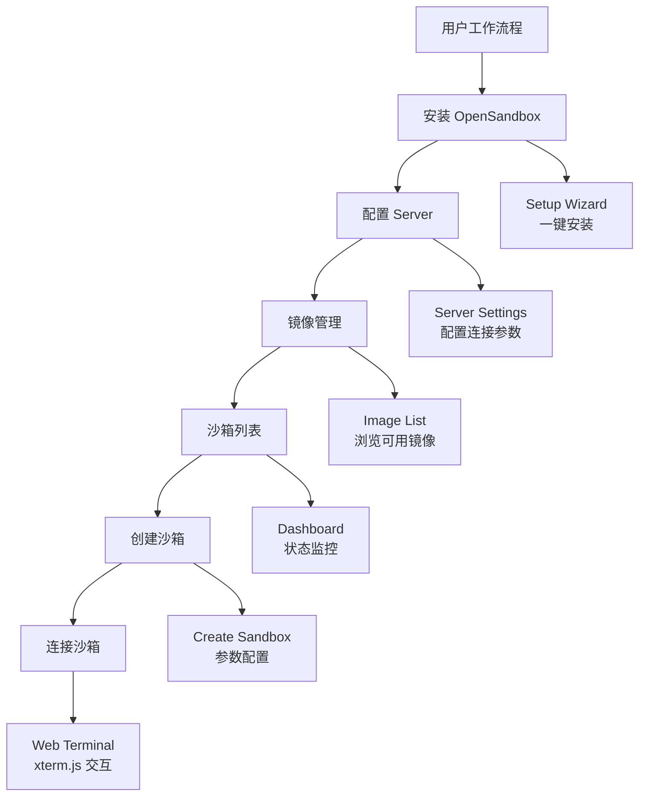
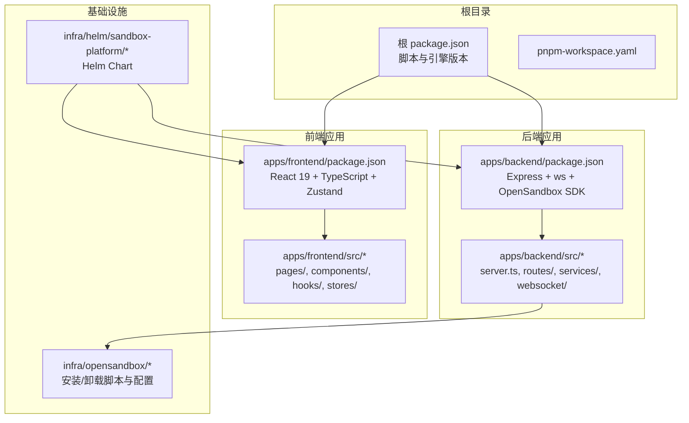
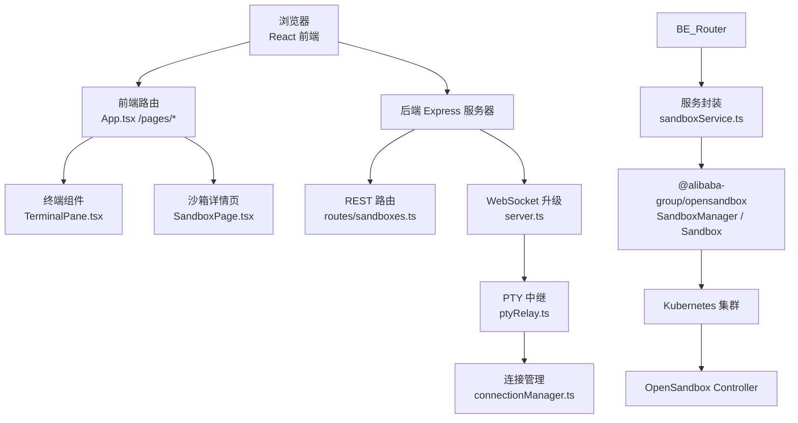
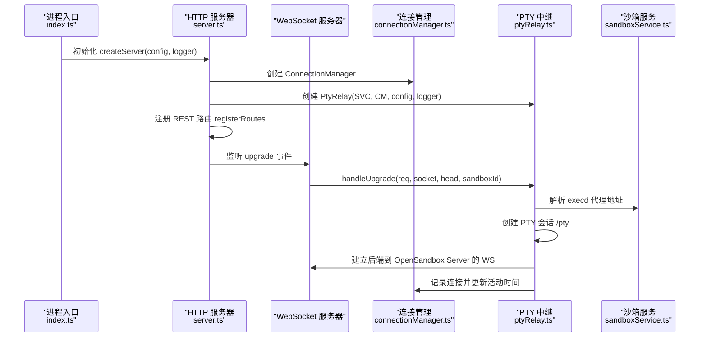
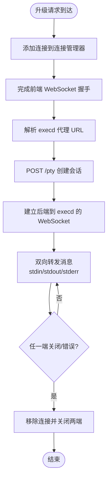
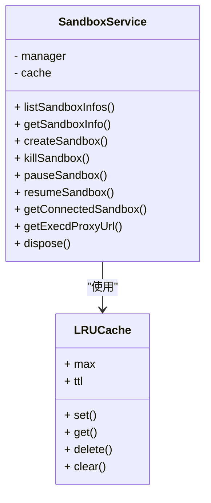
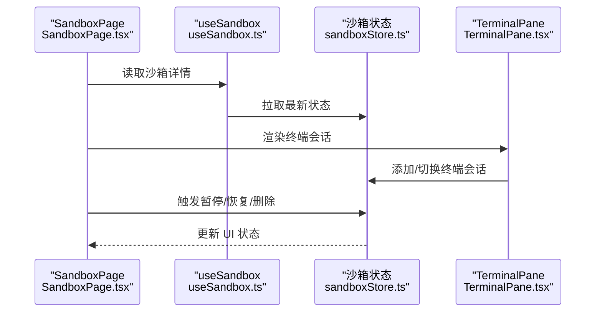
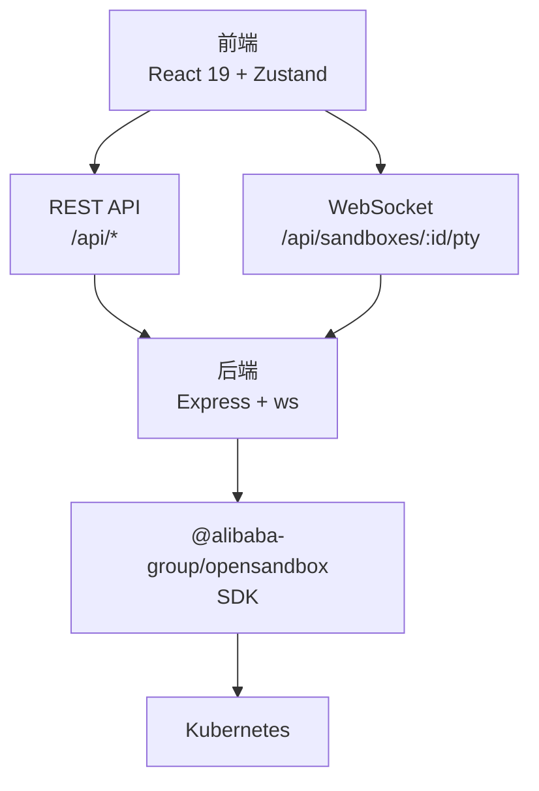

# 项目概述

<cite>
**本文档引用的文件**
- [README.md](file://README.md)
- [package.json](file://package.json)
- [apps/backend/package.json](file://apps/backend/package.json)
- [apps/frontend/package.json](file://apps/frontend/package.json)
- [apps/backend/src/index.ts](file://apps/backend/src/index.ts)
- [apps/backend/src/server.ts](file://apps/backend/src/server.ts)
- [apps/backend/src/config.ts](file://apps/backend/src/config.ts)
- [apps/backend/src/services/sandboxService.ts](file://apps/backend/src/services/sandboxService.ts)
- [apps/backend/src/websocket/connectionManager.ts](file://apps/backend/src/websocket/connectionManager.ts)
- [apps/backend/src/websocket/ptyRelay.ts](file://apps/backend/src/websocket/ptyRelay.ts)
- [apps/backend/src/routes/sandboxes.ts](file://apps/backend/src/routes/sandboxes.ts)
- [apps/frontend/src/App.tsx](file://apps/frontend/src/App.tsx)
- [apps/frontend/src/pages/SandboxPage.tsx](file://apps/frontend/src/pages/SandboxPage.tsx)
- [apps/frontend/src/components/terminal/TerminalPane.tsx](file://apps/frontend/src/components/terminal/TerminalPane.tsx)
- [apps/frontend/src/stores/sandboxStore.ts](file://apps/frontend/src/stores/sandboxStore.ts)
- [apps/frontend/src/hooks/useSandbox.ts](file://apps/frontend/src/hooks/useSandbox.ts)
</cite>

## 目录
1. [引言](#引言)
2. [功能展示](#功能展示)
3. [项目结构](#项目结构)
4. [核心组件](#核心组件)
5. [架构总览](#架构总览)
6. [详细组件分析](#详细组件分析)
7. [依赖关系分析](#依赖关系分析)
8. [性能考虑](#性能考虑)
9. [故障排除指南](#故障排除指南)
10. [结论](#结论)
11. [附录](#附录)

## 引言
Sandbox Manager 是一个基于 OpenSandbox 的 Kubernetes AI 沙箱管理平台，通过 Web UI 创建、管理隔离的沙箱环境，并使用 Web 终端 (xterm.js) 实时交互。项目旨在为 AI/数据科学工作负载提供安全、可控且可扩展的容器化执行环境，结合 Kubernetes 的编排能力与 OpenSandbox 的安全沙箱机制，实现从开发到实验的全生命周期管理。

项目愿景与价值主张：
- 愿景：让 AI 工作负载在受控、隔离且可审计的环境中高效运行，降低研发与运维成本。
- 应用场景：AI 实验、模型训练、数据处理、自动化脚本执行、多租户隔离等。
- 核心价值：统一的 Web 界面、实时终端交互、与 Kubernetes/OpenSandbox 的深度集成、前后端分离与可观测性。

**更新** 新增完整的用户工作流程视觉演示，包括安装、配置、镜像管理、沙箱管理、创建沙箱和连接沙箱的六个关键步骤，为用户提供直观的平台使用指导。

## 功能展示

### 用户工作流程视觉演示

平台提供完整的用户工作流程，通过可视化界面引导用户完成从安装到使用的全过程：

#### 1. 安装 OpenSandbox
通过 Setup Wizard 一键安装 OpenSandbox 基础设施到 Kubernetes 集群，简化部署流程。

#### 2. 配置 Server
在平台中配置 OpenSandbox Server 连接地址和 API Key，建立与后端服务的安全连接。

#### 3. 镜像管理
浏览可用的沙箱镜像列表，支持预设镜像和自定义镜像，为沙箱创建提供多样化的运行环境。

#### 4. 沙箱列表
Dashboard 展示所有沙箱实例及其运行状态，支持批量管理，便于监控和控制。

#### 5. 创建沙箱
选择镜像和配置参数，一键创建隔离的沙箱环境，支持资源限制和网络策略配置。

#### 6. 连接沙箱
通过 Web 终端 (xterm.js) 实时连接沙箱，支持完整交互式操作，包括文件浏览和命令执行。

**章节来源**
- [README.md:5-41](file://README.md#L5-L41)

## 项目结构
项目采用 pnpm monorepo 结构，分为前端与后端两个子包，并通过根级脚本统一管理开发与构建流程。基础设施通过 Helm Chart 与 OpenSandbox 安装脚本进行部署。

**图表来源**
- [package.json:1-20](file://package.json#L1-L20)
- [apps/backend/src/index.ts:1-66](file://apps/backend/src/index.ts#L1-L66)
- [apps/frontend/src/App.tsx:1-114](file://apps/frontend/src/App.tsx#L1-L114)

**章节来源**
- [README.md:240-266](file://README.md#L240-L266)
- [package.json:1-20](file://package.json#L1-L20)

## 核心组件
- 后端服务（Express + WebSocket + OpenSandbox SDK）
  - 负责 REST API 路由、WebSocket 终端中继、服务初始化与错误处理。
  - 关键模块：配置加载、服务封装（沙箱/镜像）、连接管理、PTY 中继。
- 前端界面（React 19 + TypeScript + Zustand）
  - 提供仪表盘、沙箱列表、沙箱详情页、镜像管理、终端与文件浏览。
  - 关键模块：状态管理（Zustand）、路由与页面、终端会话、沙箱钩子。
- 基础设施（Kubernetes + OpenSandbox Controller）
  - 通过 Helm Chart 与安装脚本部署 OpenSandbox 控制器与资源池，提供安全沙箱运行时。

**章节来源**
- [apps/backend/src/server.ts:36-90](file://apps/backend/src/server.ts#L36-L90)
- [apps/backend/src/services/sandboxService.ts:11-47](file://apps/backend/src/services/sandboxService.ts#L11-L47)
- [apps/backend/src/websocket/ptyRelay.ts:22-38](file://apps/backend/src/websocket/ptyRelay.ts#L22-L38)
- [apps/frontend/src/stores/sandboxStore.ts:16-62](file://apps/frontend/src/stores/sandboxStore.ts#L16-L62)

## 架构总览
系统采用前后端分离架构，后端通过 Express 提供 REST API，WebSocket 处理 PTY 二进制帧透传；前端使用 React 19 与 Zustand 管理状态，提供终端与文件系统交互。后端通过 OpenSandbox SDK 与 Kubernetes 集成，实现沙箱生命周期管理与网络端点暴露。

**图表来源**
- [apps/backend/src/server.ts:72-87](file://apps/backend/src/server.ts#L72-L87)
- [apps/backend/src/websocket/ptyRelay.ts:40-118](file://apps/backend/src/websocket/ptyRelay.ts#L40-L118)
- [apps/backend/src/services/sandboxService.ts:31-46](file://apps/backend/src/services/sandboxService.ts#L31-L46)
- [apps/frontend/src/pages/SandboxPage.tsx:13-163](file://apps/frontend/src/pages/SandboxPage.tsx#L13-L163)

## 详细组件分析

### 后端架构与控制流
后端启动时加载配置，初始化服务与 WebSocket 服务器，注册 REST 路由并在 HTTP 升级事件中处理 PTY WebSocket 连接。配置变更后可重新初始化服务以适配新设置。

**图表来源**
- [apps/backend/src/index.ts:20-46](file://apps/backend/src/index.ts#L20-L46)
- [apps/backend/src/server.ts:36-90](file://apps/backend/src/server.ts#L36-L90)
- [apps/backend/src/websocket/ptyRelay.ts:40-118](file://apps/backend/src/websocket/ptyRelay.ts#L40-L118)
- [apps/backend/src/websocket/connectionManager.ts:30-46](file://apps/backend/src/websocket/connectionManager.ts#L30-L46)

**章节来源**
- [apps/backend/src/index.ts:10-46](file://apps/backend/src/index.ts#L10-L46)
- [apps/backend/src/server.ts:36-90](file://apps/backend/src/server.ts#L36-L90)

### PTY 终端中继流程
PTY 中继负责透明转发二进制帧与 JSON 控制帧，建立前端 xterm.js 与 OpenSandbox execd 之间的双向通道。握手失败或异常会触发清理逻辑。

**图表来源**
- [apps/backend/src/websocket/ptyRelay.ts:40-118](file://apps/backend/src/websocket/ptyRelay.ts#L40-L118)
- [apps/backend/src/websocket/connectionManager.ts:48-66](file://apps/backend/src/websocket/connectionManager.ts#L48-L66)

**章节来源**
- [apps/backend/src/websocket/ptyRelay.ts:10-21](file://apps/backend/src/websocket/ptyRelay.ts#L10-L21)
- [apps/backend/src/websocket/ptyRelay.ts:120-170](file://apps/backend/src/websocket/ptyRelay.ts#L120-L170)

### 沙箱服务与缓存策略
沙箱服务封装 OpenSandbox SDK，提供列表、创建、暂停/恢复、删除以及连接缓存。LRU 缓存用于复用已连接实例，减少重复连接开销。

**图表来源**
- [apps/backend/src/services/sandboxService.ts:11-47](file://apps/backend/src/services/sandboxService.ts#L11-L47)
- [apps/backend/src/services/sandboxService.ts:112-123](file://apps/backend/src/services/sandboxService.ts#L112-L123)

**章节来源**
- [apps/backend/src/services/sandboxService.ts:17-47](file://apps/backend/src/services/sandboxService.ts#L17-L47)

### 前端状态管理与页面交互
前端使用 Zustand 管理沙箱列表与操作，React Hooks 在沙箱详情页中驱动终端会话与文件浏览，页面布局支持拖拽调整侧边栏宽度。

**图表来源**
- [apps/frontend/src/pages/SandboxPage.tsx:13-163](file://apps/frontend/src/pages/SandboxPage.tsx#L13-L163)
- [apps/frontend/src/hooks/useSandbox.ts:6-58](file://apps/frontend/src/hooks/useSandbox.ts#L6-L58)
- [apps/frontend/src/stores/sandboxStore.ts:16-62](file://apps/frontend/src/stores/sandboxStore.ts#L16-L62)
- [apps/frontend/src/components/terminal/TerminalPane.tsx:8-37](file://apps/frontend/src/components/terminal/TerminalPane.tsx#L8-L37)

**章节来源**
- [apps/frontend/src/App.tsx:34-113](file://apps/frontend/src/App.tsx#L34-L113)
- [apps/frontend/src/pages/SandboxPage.tsx:13-163](file://apps/frontend/src/pages/SandboxPage.tsx#L13-L163)

## 依赖关系分析
- 技术栈选择与优势
  - 前端：React 19 + TypeScript + Tailwind CSS + Zustand，提供类型安全与轻量状态管理，UI 组件化良好。
  - 终端：xterm.js v5 + WebSocket 二进制帧透传，实现低延迟、高保真的终端体验。
  - 后端：Express + WebSocket (ws) + OpenSandbox SDK，REST API 易于集成，WebSocket 支持实时交互。
  - 运行时：Kubernetes + OpenSandbox Controller，提供安全隔离与资源编排。
  - 构建：pnpm monorepo + Vite + tsx，提升开发效率与构建性能。
- 外部依赖与集成点
  - OpenSandbox SDK：封装沙箱生命周期与网络端点访问。
  - Kubernetes：通过 Helm Chart 部署控制器与资源池。
  - xterm.js：与后端 WebSocket 二进制帧协议配合，实现终端渲染与输入输出。

**图表来源**
- [apps/backend/src/server.ts:72-87](file://apps/backend/src/server.ts#L72-L87)
- [apps/backend/src/routes/sandboxes.ts:151-174](file://apps/backend/src/routes/sandboxes.ts#L151-L174)
- [apps/backend/src/services/sandboxService.ts:31-46](file://apps/backend/src/services/sandboxService.ts#L31-L46)

**章节来源**
- [README.md:131-139](file://README.md#L131-L139)
- [apps/backend/package.json:11-20](file://apps/backend/package.json#L11-L20)
- [apps/frontend/package.json:11-19](file://apps/frontend/package.json#L11-L19)

## 性能考虑
- 连接与缓存
  - 后端对已连接的 Sandbox 实例使用 LRU 缓存，避免频繁连接与握手开销。
  - 连接管理器维护活跃连接并定期检测空闲连接，防止资源泄漏。
- 传输优化
  - PTY 中继采用二进制帧透传，最小化协议开销，确保终端响应速度。
  - 前端终端组件按需渲染，隐藏非激活会话以减少 DOM 与内存占用。
- 配置与伸缩
  - 通过环境变量控制日志级别、超时与 PTY 空闲阈值，便于在不同环境调优。
  - 前后端分离架构支持水平扩展与独立部署。

## 故障排除指南
- 后端未启动或不可达
  - 现象：前端显示"后端服务器不可达"提示。
  - 排查：确认后端服务已启动并监听指定端口，检查 CORS 配置与日志。
- OpenSandbox 未配置
  - 现象：沙箱相关接口返回未配置错误。
  - 排查：检查环境变量 OPENSANDBOX_SERVER_URL 与 OPENSANDBOX_API_KEY，完成设置向导。
- PTY 连接失败
  - 现象：终端无响应或报错。
  - 排查：确认 execd 代理 URL 解析成功，检查后端到 OpenSandbox Server 的网络连通性与鉴权头。
- 端口转发问题（本地 K8s 模式）
  - 现象：无法访问 OpenSandbox Server。
  - 排查：确认已执行端口转发命令并将本地端口映射到集群服务。

**章节来源**
- [apps/frontend/src/App.tsx:84-110](file://apps/frontend/src/App.tsx#L84-L110)
- [apps/backend/src/server.ts:34-45](file://apps/backend/src/server.ts#L34-L45)
- [apps/backend/src/websocket/ptyRelay.ts:110-118](file://apps/backend/src/websocket/ptyRelay.ts#L110-L118)
- [README.md:42-48](file://README.md#L42-L48)

## 结论
Sandbox Manager 通过清晰的前后端分层、可靠的 WebSocket 实时通信与 Kubernetes/OpenSandbox 的深度集成，为 AI 工作负载提供了安全、易用且高性能的沙箱管理方案。其模块化设计与可观测性支持，使其既适合初学者快速上手，也能满足有经验开发者对可扩展性的需求。新增的用户工作流程视觉演示进一步降低了使用门槛，为用户提供了从安装到使用的完整指导。

## 附录
- 快速开始与环境准备
  - 安装 OpenSandbox 基础设施、建立端口转发、配置环境变量、启动后端与前端。
- API 概览
  - 包含健康检查、沙箱 CRUD、端点查询、文件与命令、PTY 终端等接口。
- 环境变量参考
  - OPENSANDBOX_SERVER_URL、OPENSANDBOX_API_KEY、PORT、CORS_ORIGIN、LOG_LEVEL、PTY_IDLE_TIMEOUT_MS 等。

**章节来源**
- [README.md:154-224](file://README.md#L154-L224)
- [README.md:370-405](file://README.md#L370-L405)
- [apps/backend/src/config.ts:48-70](file://apps/backend/src/config.ts#L48-L70)