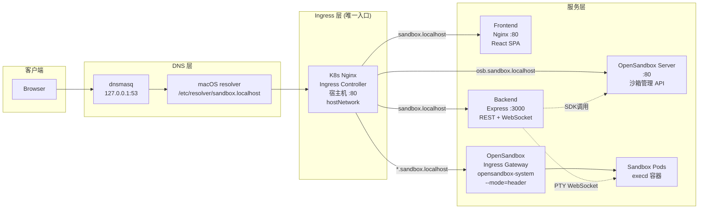
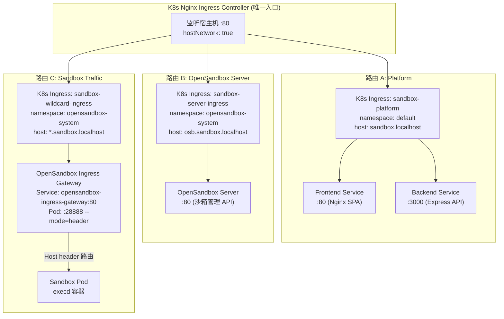

# Sandbox Manager

基于 [OpenSandbox](https://github.com/opensandbox/opensandbox) 的 Kubernetes AI 沙箱管理平台。通过 Web UI 创建、管理隔离的沙箱环境，并使用 Web 终端 (xterm.js) 实时交互。

## 系统架构

### 整体架构概览



### 三条 Ingress 路由

所有流量统一经过 **K8s Nginx Ingress Controller**，通过 HTTP Host 头匹配分发：



| Host 匹配 | K8s Ingress 资源 | Namespace | 后端 Service | 用途 |
|-----------|------------------|-----------|--------------|------|
| `sandbox.localhost` | `sandbox-platform` | default | Frontend(:80) + Backend(:3000) | Web UI + REST API + WebSocket |
| `osb.sandbox.localhost` | `sandbox-server-ingress` | opensandbox-system | opensandbox-server(:80) | 沙箱管理 API |
| `*.sandbox.localhost` | `sandbox-wildcard-ingress` | opensandbox-system | opensandbox-ingress-gateway(:80) | 沙箱流量访问 |

> 详细架构文档见 [docs/system-architecture.md](docs/system-architecture.md)

## 技术栈

| 层级 | 技术 |
|------|------|
| 前端 | React 19 + TypeScript + Tailwind CSS + Zustand |
| 终端 | xterm.js v5 + WebSocket 二进制帧透传 |
| 后端 | Express + WebSocket (ws) + OpenSandbox SDK |
| 运行时 | Kubernetes + OpenSandbox Controller |
| 构建 | pnpm monorepo + Vite + tsx |

## 前置条件

- **Node.js** >= 20
- **pnpm** >= 9
- **Docker Desktop** 并启用 Kubernetes，或任意可用的 K8s 集群
- **kubectl** 和 **helm**

确认 Kubernetes 集群就绪：

```bash
kubectl cluster-info
```

## 快速开始

### 1. 安装 OpenSandbox 基础设施

```bash
bash infra/opensandbox/install.sh
```

该脚本会自动完成：
- 检查 kubectl / helm 依赖
- 创建 `opensandbox-system` 和 `opensandbox` 命名空间
- 通过 Helm 安装 OpenSandbox Controller 和 Server
- 部署沙箱资源池 (Pool CRD)

### 2. 建立 Port-Forward

```bash
kubectl port-forward svc/opensandbox-server 8080:80 -n opensandbox-system
```

保持该终端运行。这条命令将 OpenSandbox Server 的 80 端口映射到本机 `localhost:8080`。

### 3. 安装依赖并配置环境变量

```bash
pnpm install
cp .env.example apps/backend/.env
```

编辑 `apps/backend/.env`，确认以下配置与你的环境匹配：

```env
OPENSANDBOX_SERVER_URL=localhost:8080
OPENSANDBOX_API_KEY=dev-api-key-change-in-prod
PORT=3000
CORS_ORIGIN=*
LOG_LEVEL=debug
```

> 如果使用 `infra/opensandbox/values-dev.yaml` 安装，API Key 默认为 `dev-api-key-change-in-prod`。

### 4. 启动后端开发服务器

```bash
pnpm dev:backend
```

后端运行在 `http://localhost:3000`，可用以下命令验证：

```bash
curl http://localhost:3000/api/health
```

### 5. 启动前端开发服务器

新开一个终端：

```bash
pnpm dev:frontend
```

前端运行在 `http://localhost:5173`，Vite 自动将 `/api` 请求代理到后端。

### 6. 访问应用

浏览器打开 `http://localhost:5173`，即可：
- 查看沙箱列表
- 创建新的沙箱
- 进入沙箱详情页，使用 Web 终端交互
- 浏览沙箱文件系统

## 一键脚本（可选）

项目提供了辅助脚本：

```bash
# 完整安装 + 启动 port-forward
bash scripts/setup.sh

# 启动后端
bash scripts/dev-backend.sh

# 启动前端
bash scripts/dev-frontend.sh
```

## 项目结构

```
.
├── apps/
│   ├── backend/                # Express 后端
│   │   └── src/
│   │       ├── routes/         # REST API 路由 (sandboxes, files, commands)
│   │       ├── services/       # SandboxService (SDK 封装 + LRU 缓存)
│   │       ├── websocket/      # PTY WebSocket relay (二进制帧透传)
│   │       ├── middleware/     # 错误处理
│   │       ├── config.ts       # 环境变量配置
│   │       └── server.ts       # Express + HTTP + WS 服务器
│   └── frontend/               # React 前端
│       └── src/
│           ├── api/            # API 客户端层
│           ├── stores/         # Zustand 状态管理
│           ├── hooks/          # useTerminal, useSandbox, useFileTree
│           ├── components/     # UI 组件 (终端、文件树、沙箱卡片)
│           └── pages/          # DashboardPage, SandboxPage
├── infra/
│   ├── opensandbox/            # OpenSandbox 安装脚本和配置
│   └── helm/                   # 平台自身的 Helm Chart (生产部署)
├── scripts/                    # 开发辅助脚本
├── package.json                # pnpm workspace 根
└── pnpm-workspace.yaml
```

## 构建

```bash
# 构建所有包
pnpm build

# 单独构建
pnpm build:backend
pnpm build:frontend
```

## 生产部署

项目通过 GitHub Actions 自动构建 Docker 镜像和 Helm Chart，并推送至 GitHub Container Registry (GHCR)。部署时**无需 clone 代码**，直接从 GHCR 拉取即可。

### CI/CD 工作流

推送代码到 `main` 分支或创建 `v*` 标签时，自动触发构建：

| 触发条件 | 产物 |
|----------|------|
| Push `main` | Docker 镜像 (`latest`, `sha-<commit>`) + Helm Chart |
| Push tag `v0.1.0` | Docker 镜像 (`v0.1.0`, `latest`, `sha-<commit>`) + Helm Chart |

发布地址：
- **Helm Chart**: `oci://ghcr.io/rabbitai-lab/sandbox-platform`
- **Backend 镜像**: `ghcr.io/rabbitai-lab/sandbox-manager/backend`
- **Frontend 镜像**: `ghcr.io/rabbitai-lab/sandbox-manager/frontend`

### 前置条件

- **Kubernetes 集群**（任意可用的 K8s 集群）
- **kubectl** 和 **helm**（需支持 OCI，Helm >= 3.8.0）
- **Nginx Ingress Controller** 已安装 — sandbox-platform 内部的 Setup Wizard 会自动完成此步骤

### 步骤 1: 部署 sandbox-platform

Chart 从 GHCR (OCI) 拉取，values 通过 GitHub raw URL 加载，完全无需 clone 代码：

```bash
helm install sandbox-platform oci://ghcr.io/rabbitai-lab/sandbox-platform \
  -f https://raw.githubusercontent.com/RabbitAI-Lab/Sandbox-Manager/main/infra/helm/sandbox-platform/values-ghcr.yaml \
  --wait --timeout 120s
```

> `-f` 支持直接读取远程 URL，`values-ghcr.yaml` 将镜像地址指向 GHCR 并设置 `pullPolicy: Always`。

如果要部署到生产域名（如 `sandbox.rabbitai-lab.com`），叠加生产配置：

```bash
helm install sandbox-platform oci://ghcr.io/rabbitai-lab/sandbox-platform \
  -f https://raw.githubusercontent.com/RabbitAI-Lab/Sandbox-Manager/main/infra/helm/sandbox-platform/values-ghcr.yaml \
  -f https://raw.githubusercontent.com/RabbitAI-Lab/Sandbox-Manager/main/infra/helm/sandbox-platform/values-production.yaml \
  --wait --timeout 120s
```

> 本地开发时仍可使用本地路径：`-f infra/helm/sandbox-platform/values-ghcr.yaml`

### 步骤 2: 配置 DNS 解析

**本地开发环境**（macOS + dnsmasq）：

```bash
# dnsmasq 配置 (/etc/dnsmasq.d/sandbox-domains.conf)
address=/sandbox.localhost/127.0.0.1

# macOS resolver (/etc/resolver/sandbox.localhost)
nameserver 127.0.0.1
```

**生产环境**：将域名（如 `sandbox.rabbitai-lab.com`）的 DNS A 记录指向集群 Ingress Controller 所在节点的 IP。

### 步骤 3: 访问平台

```bash
# 本地开发
open http://sandbox.localhost

# 生产环境
open https://sandbox.rabbitai-lab.com
```

### 更新部署

代码更新后，GitHub Actions 自动构建新镜像和 Chart。然后升级 Helm release：

```bash
helm upgrade sandbox-platform oci://ghcr.io/rabbitai-lab/sandbox-platform \
  -f https://raw.githubusercontent.com/RabbitAI-Lab/Sandbox-Manager/main/infra/helm/sandbox-platform/values-ghcr.yaml \
  --wait --timeout 120s
```

### 卸载

```bash
# 卸载平台
helm uninstall sandbox-platform

# 卸载 OpenSandbox 基础设施
bash infra/opensandbox/uninstall.sh
```

## API 概览

| 方法 | 路径 | 说明 |
|------|------|------|
| GET | `/api/health` | 健康检查 |
| GET | `/api/sandboxes` | 列出所有沙箱 |
| POST | `/api/sandboxes` | 创建沙箱 |
| GET | `/api/sandboxes/:id` | 获取沙箱详情 |
| DELETE | `/api/sandboxes/:id` | 删除沙箱 |
| POST | `/api/sandboxes/:id/pause` | 暂停沙箱 |
| POST | `/api/sandboxes/:id/resume` | 恢复沙箱 |
| GET | `/api/sandboxes/:id/endpoints` | 获取沙箱端点 |
| GET | `/api/sandboxes/:id/files` | 列出目录文件 |
| GET | `/api/sandboxes/:id/files/content` | 读取文件内容 |
| PUT | `/api/sandboxes/:id/files/content` | 写入文件 |
| POST | `/api/sandboxes/:id/commands` | 执行命令 |
| WS | `/api/sandboxes/:id/pty` | PTY WebSocket 终端连接 |

## 卸载 OpenSandbox

```bash
bash infra/opensandbox/uninstall.sh
```

## 环境变量参考

| 变量 | 默认值 | 说明 |
|------|--------|------|
| `OPENSANDBOX_SERVER_URL` | `localhost:8080` | OpenSandbox Server 地址 |
| `OPENSANDBOX_API_KEY` | (空) | OpenSandbox API 密钥 |
| `OPENSANDBOX_PROTOCOL` | `http` | 连接协议 |
| `PORT` | `3000` | 后端监听端口 |
| `CORS_ORIGIN` | `*` | CORS 允许来源 |
| `LOG_LEVEL` | `info` | 日志级别 (debug/info/warn/error) |
| `PTY_IDLE_TIMEOUT_MS` | `300000` | PTY 空闲超时 (毫秒) |
