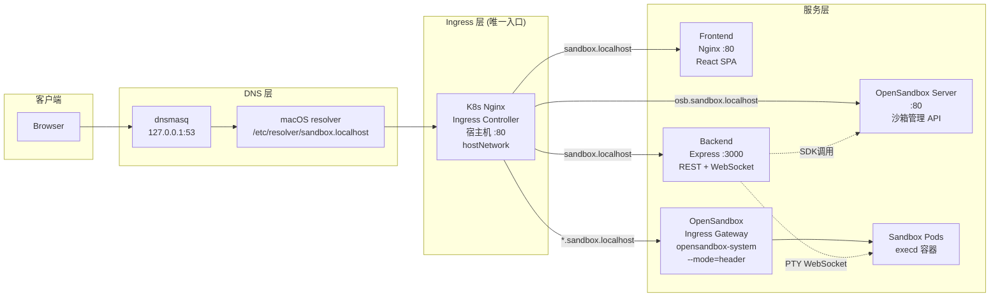
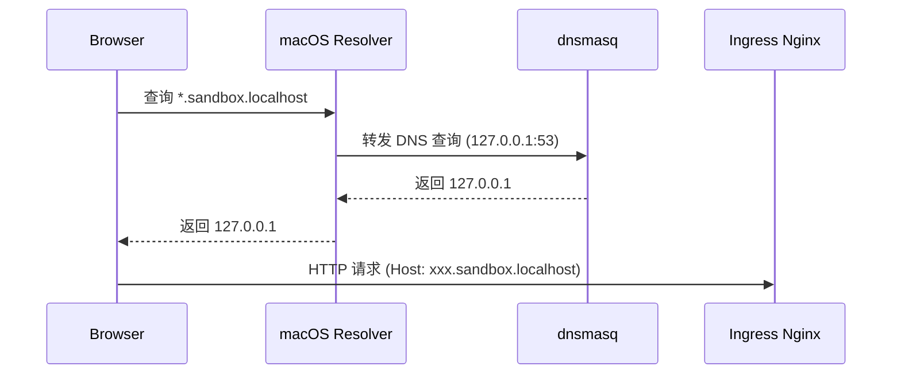
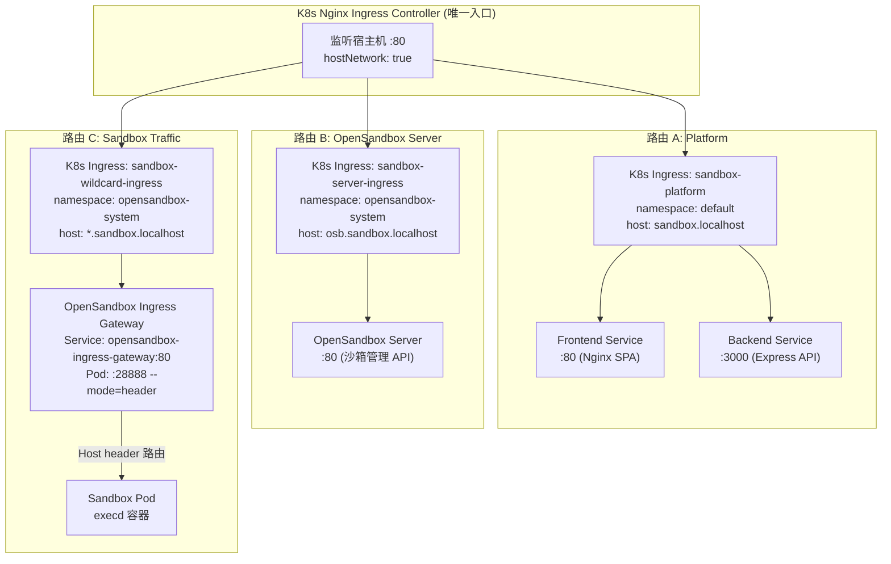
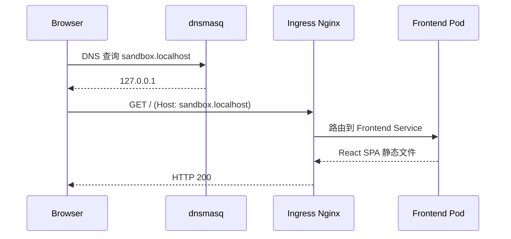
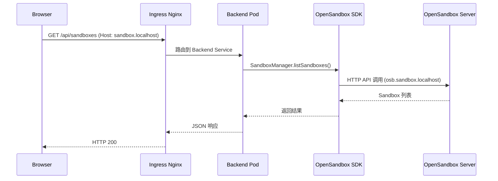
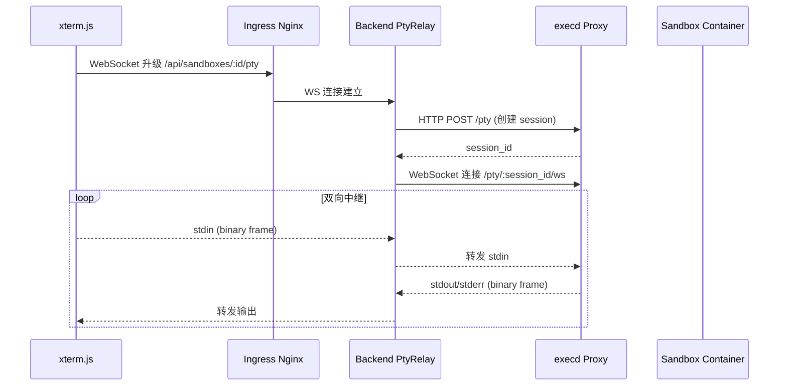
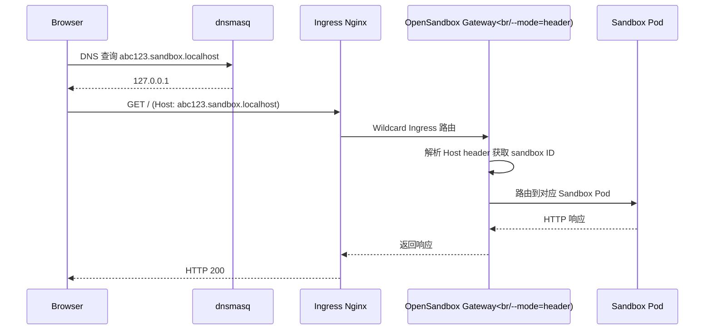

# Sandbox-Manager 系统架构

## 整体架构概览



## DNS 解析流程



**dnsmasq 配置规则**（动态生成）:

```bash
# /etc/dnsmasq.d/sandbox-domains.conf
address=/sandbox.localhost/127.0.0.1
# 通配符语法：address=/domain/ip 会覆盖所有子域名
```

**macOS resolver 配置**:

```bash
# /etc/resolver/sandbox.localhost
nameserver 127.0.0.1
```

## 三条 Ingress 路由

所有流量统一经过 **K8s Nginx Ingress Controller**，通过 HTTP Host 头匹配分发：



### 路由对照表

| Host 匹配 | K8s Ingress 资源 | Namespace | 后端 Service | 用途 |
|-----------|------------------|-----------|--------------|------|
| `sandbox.localhost` | `sandbox-platform` | default (Helm release ns) | Frontend(:80) + Backend(:3000) | Web UI + REST API + WebSocket |
| `osb.sandbox.localhost` | `sandbox-server-ingress` | opensandbox-system | opensandbox-server(:80) | 沙箱管理 API (SDK 调用) |
| `*.sandbox.localhost` | `sandbox-wildcard-ingress` | opensandbox-system | opensandbox-ingress-gateway(:80) → Sandbox Pods | 沙箱 Web 服务访问 |

### K8s Ingress 资源说明

系统中有**三个 K8s Ingress 资源**（注意：不是 Ingress Controller），它们定义了 HTTP Host 头到 K8s Service 的路由规则：

| K8s Ingress 名称 | Namespace | 定义文件 | 说明 |
|------------------|-----------|----------|------|
| `sandbox-platform` | default | `infra/helm/sandbox-platform/templates/ingress.yaml` | Platform 的 Web UI 和 API 路由，由 Helm chart 管理 |
| `sandbox-server-ingress` | opensandbox-system | `infra/opensandbox/server-ingress.yaml` | OpenSandbox Server API 路由，由 infraRunner 动态生成 |
| `sandbox-wildcard-ingress` | opensandbox-system | `infra/opensandbox/sandbox-ingress.yaml` | 沙箱流量通配符路由，由 infraRunner 动态生成 |

> 三个 Ingress 资源都使用 `ingressClassName: nginx`，由同一个 **K8s Nginx Ingress Controller** 处理。

> 注：`sandbox-server-ingress` 和 `sandbox-wildcard-ingress` 的 yaml 文件是参考模板，实际安装时由 `infraRunner.ts` 的 `generateIngressResources()` 函数根据配置的域名动态生成并应用到集群。

### OpenSandbox Ingress Gateway 说明

**OpenSandbox Ingress Gateway** 是 OpenSandbox 项目提供的沙箱流量网关组件：

| 属性 | 值 |
|------|-----|
| **部署位置** | `opensandbox-system` namespace |
| **Service** | `opensandbox-ingress-gateway:80`（容器实际端口 :28888） |
| **路由模式** | `--mode=header`，通过解析 HTTP Host header 中的 sandbox ID 路由到对应 Pod |
| **作用** | 作为 K8s Ingress Nginx 的第二层路由，在多个 Sandbox Pod 间分发流量 |

> 注意：Helm chart 默认配置 `routeMode: wildcard`，但 InfraRunner 在安装后会 patch 为 `--mode=header`，参见 `infraRunner.ts:399-408`

## 典型请求链路

### 1. Web UI 访问



### 2. API 调用



### 3. PTY WebSocket 终端



### 4. Sandbox Web 服务访问



## 关键文件索引

| 文件路径 | 作用 |
|----------|------|
| `infra/helm/sandbox-platform/templates/ingress.yaml` | K8s Ingress `sandbox-platform` 定义 (default ns) |
| `infra/opensandbox/sandbox-ingress.yaml` | K8s Ingress `sandbox-wildcard-ingress` 参考模板 (opensandbox-system ns) |
| `infra/opensandbox/server-ingress.yaml` | K8s Ingress `sandbox-server-ingress` 参考模板 (opensandbox-system ns) |
| `apps/backend/src/services/infraRunner.ts` | 动态生成 `sandbox-server-ingress` + `sandbox-wildcard-ingress` 资源 |
| `apps/backend/src/services/envCheckService.ts` | dnsmasq 配置生成 |
| `apps/backend/src/websocket/ptyRelay.ts` | PTY WebSocket 双向中继 |
| `apps/frontend/Dockerfile` | 前端 Nginx 代理配置 (生产模式) |
| `apps/frontend/vite.config.ts` | 前端 Vite dev proxy (开发模式) |

## 核心要点总结

1. **唯一入口**：所有流量都经过 K8s Nginx Ingress Controller（宿主机 :80，hostNetwork）
2. **Host 头路由**：三条路由通过 HTTP Host 头匹配，由三个不同的 Ingress 资源定义
3. **第二层路由**：OpenSandbox Ingress Gateway 使用 `--mode=header` 在 Sandbox Pod 间分发
4. **DNS 通配**：dnsmasq 的 `address=/domain/ip` 语法自动覆盖所有子域名
5. **WebSocket 支持**：Ingress 注解 `websocket-services` + 3600s 超时配置